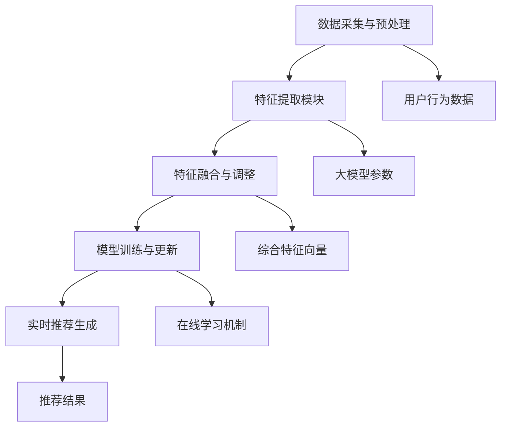

                 

### 背景介绍

近年来，推荐系统已经成为各类互联网应用中不可或缺的重要组成部分。从电子商务网站的商品推荐，到社交媒体平台的内容推荐，再到视频平台的电影推荐，推荐系统在提高用户体验、增加用户粘性、促进业务增长等方面发挥了关键作用。

然而，随着推荐系统规模的不断扩大和数据量的持续增长，如何高效地处理和利用用户数据成为了一个重要的挑战。实时特征工程作为推荐系统中的一个关键环节，其目标是从海量的用户行为数据中提取出对推荐决策有用的特征，以便在短时间内为用户生成高质量的推荐。

实时特征工程的重要性主要体现在以下几个方面：

1. **提高推荐准确性**：通过实时提取用户行为特征，可以更准确地捕捉用户当前的兴趣和偏好，从而提高推荐系统的准确性。
2. **降低冷启动问题**：对于新用户，由于缺乏历史行为数据，传统的推荐算法往往难以生成有效的推荐。实时特征工程可以在一定程度上缓解这一问题。
3. **优化系统性能**：实时特征工程通过并行化和分布式计算技术，可以显著提高推荐系统的处理速度和性能。

然而，传统的实时特征工程方法在处理大规模数据时面临着计算复杂度高、延迟时间长、特征维度难以控制等问题。为了应对这些挑战，近年来，大模型（如深度学习模型）在推荐系统中的应用逐渐成为热点研究领域。

大模型在推荐系统中的应用主要包括以下几个方面：

1. **特征表示学习**：通过大规模预训练模型，可以自动从原始数据中学习出高维度的特征表示，这些特征表示往往具有更好的泛化能力和解释性。
2. **多模态数据融合**：大模型能够处理多种类型的数据（如文本、图像、音频等），从而实现多模态数据的融合，进一步提高推荐系统的性能。
3. **动态特征更新**：大模型可以根据实时数据动态调整特征权重，从而实现特征更新的实时性和自适应能力。

本文将深入探讨如何利用大模型优化推荐系统的实时特征工程。我们首先将介绍大模型的基本原理和相关技术，然后通过具体实例展示如何在大规模数据集上应用大模型进行实时特征提取，最后讨论大模型在推荐系统中的实际应用效果和面临的挑战。

总之，本文旨在为读者提供一个全面而深入的理解，帮助他们在实践中更好地利用大模型优化推荐系统的实时特征工程，从而提升推荐系统的整体性能。

### 核心概念与联系

#### 大模型的基本原理

大模型，特别是深度学习模型，在推荐系统中的应用之所以受到广泛关注，主要归功于其强大的特征表示和学习能力。深度学习模型通常由多个神经网络层组成，通过逐层提取特征，从原始数据中学习出具有高层次语义的信息。这一过程可以类比于人类大脑的学习过程，通过不断的训练和调整，使模型能够理解和识别复杂的数据模式。

大模型的基本原理可以分为以下几个关键组成部分：

1. **神经网络架构**：神经网络是深度学习模型的基础，它由输入层、隐藏层和输出层组成。每一层都通过一系列的权重和激活函数对输入数据进行处理，从而实现数据的层次化表示。

2. **损失函数**：损失函数用于评估模型预测值与真实值之间的差距，并通过反向传播算法更新模型的参数，以最小化损失函数。

3. **优化算法**：优化算法如梯度下降、Adam等，用于调整模型的参数，以找到使损失函数最小化的参数组合。

4. **激活函数**：激活函数如ReLU、Sigmoid和Tanh等，用于引入非线性变换，使模型能够学习和表示复杂的数据关系。

5. **正则化技术**：如Dropout、L1/L2正则化等，用于防止模型过拟合，提高模型的泛化能力。

#### 实时特征工程的架构

在推荐系统中，实时特征工程的核心目标是快速、准确地提取用户行为特征，并将其用于生成实时推荐。大模型在实时特征工程中的应用架构通常包括以下几个关键环节：

1. **数据采集与预处理**：从各种数据源（如用户行为日志、社交媒体数据、商品信息等）采集数据，并进行清洗、转换和归一化等预处理操作，以便后续的建模和分析。

2. **特征提取模块**：利用大模型对预处理后的数据进行特征提取。这一模块通常包括多个神经网络层，通过逐层提取特征，将原始数据转换为具有高维度语义的特征表示。

3. **特征融合与调整**：在提取出多个特征表示后，利用融合策略将它们整合为一个综合特征向量。这一过程可以包括特征加权、聚合操作等，以提高特征的质量和代表性。

4. **模型训练与更新**：利用训练数据对特征提取模块进行训练，并通过在线学习机制实时更新模型参数，以适应不断变化的数据特征。

5. **实时推荐生成**：将训练好的模型应用于新用户或新行为数据，生成实时的推荐结果。这一过程通常需要快速响应，以保持用户的实时体验。

#### Mermaid 流程图

以下是一个简化版的 Mermaid 流程图，描述了利用大模型进行实时特征工程的基本架构：



在这个流程图中，用户行为数据通过数据采集与预处理环节进入特征提取模块，大模型对数据进行特征提取并生成高维度的特征表示。这些特征表示随后通过特征融合与调整模块进行整合，生成一个综合特征向量。该特征向量用于模型训练与更新环节，通过在线学习机制不断调整模型参数，以适应新的数据特征。最终，训练好的模型用于生成实时的推荐结果。

通过上述架构和流程，我们可以看到大模型在实时特征工程中的核心作用，以及各个环节之间的紧密联系。接下来，我们将进一步探讨大模型的具体算法原理和具体操作步骤。

### 核心算法原理 & 具体操作步骤

#### 大模型的训练过程

深度学习模型的核心在于其训练过程，这一过程主要包括数据预处理、模型设计、训练、评估和调整几个关键步骤。下面我们将详细介绍这些步骤。

1. **数据预处理**

   在训练大模型之前，首先需要对数据进行预处理。这一步骤通常包括以下操作：

   - **数据清洗**：去除噪声数据和异常值，确保数据的质量。
   - **数据转换**：将不同类型的数据转换为模型可以处理的格式。例如，对于文本数据，可以使用词袋模型或词嵌入（word embeddings）进行转换；对于图像数据，可以使用像素值或卷积神经网络（CNN）特征进行转换。
   - **数据归一化**：对数据进行标准化或归一化处理，以消除不同特征之间的量纲影响，并加快训练过程。

2. **模型设计**

   设计一个适合推荐任务的深度学习模型，通常需要考虑以下几个方面：

   - **神经网络架构**：选择合适的神经网络架构，如全连接网络（FCN）、卷积神经网络（CNN）或循环神经网络（RNN）等。
   - **激活函数**：选择合适的激活函数，如ReLU、Sigmoid或Tanh等，以引入非线性变换。
   - **损失函数**：选择适合推荐任务的损失函数，如交叉熵损失（cross-entropy loss）或均方误差（mean squared error, MSE）等。
   - **优化算法**：选择合适的优化算法，如梯度下降（Gradient Descent）、Adam等，以调整模型参数。

3. **训练过程**

   训练过程包括以下关键步骤：

   - **前向传播（Forward Propagation）**：将输入数据通过神经网络前向传播，计算输出结果。
   - **反向传播（Back Propagation）**：计算输出结果与真实值之间的误差，并通过反向传播更新模型参数。
   - **迭代优化**：重复前向传播和反向传播过程，直至模型收敛或达到预定的迭代次数。

4. **评估与调整**

   在训练过程中，需要定期评估模型性能，并根据评估结果进行调整：

   - **模型评估**：使用验证集或测试集评估模型性能，常用的评估指标包括准确率、召回率、F1 分数等。
   - **超参数调整**：根据评估结果调整模型超参数，如学习率、批次大小等，以提高模型性能。
   - **模型融合**：使用不同的模型或不同的特征表示进行融合，以提高推荐准确性。

#### 实时特征提取的具体操作步骤

在了解了大模型的训练过程后，我们可以进一步探讨如何利用大模型进行实时特征提取。以下是一套具体的操作步骤：

1. **实时数据采集**

   从各种数据源（如用户行为日志、社交媒体数据、商品信息等）中实时采集数据。这些数据可以是原始数据，如点击事件、浏览历史、购买记录等，也可以是经过初步处理的数据。

2. **数据预处理**

   对采集到的数据进行预处理，包括数据清洗、数据转换和数据归一化。这一步骤的目的是将原始数据转换为模型可以处理的格式，并消除不同特征之间的量纲影响。

3. **特征提取**

   利用大模型对预处理后的数据进行特征提取。这一步骤可以分为以下几个子步骤：

   - **输入层**：将预处理后的数据作为输入层输入到神经网络中。
   - **隐藏层**：通过多个隐藏层逐层提取特征。每一层都可以学习到不同层次的特征表示，这些特征表示通常具有更好的泛化能力和解释性。
   - **输出层**：将隐藏层提取出的特征向量作为输出层输出，形成一个高维度的特征表示。

4. **特征融合**

   将提取出的多个特征表示进行融合，生成一个综合特征向量。这一步骤可以通过以下方法实现：

   - **特征加权**：根据每个特征的重要程度，对特征进行加权融合，以生成一个综合特征向量。
   - **特征聚合**：通过求和、均值或最大值等操作，将多个特征表示融合为一个综合特征向量。

5. **特征更新**

   利用在线学习机制，根据新采集到的数据动态调整特征权重和模型参数。这一步骤可以确保特征表示始终与用户行为数据保持一致，从而提高推荐系统的实时性和准确性。

通过上述步骤，我们可以利用大模型实现高效的实时特征提取，从而为推荐系统提供高质量的特征输入。

#### 实例演示

为了更直观地展示大模型在实时特征提取中的应用，我们以下将通过一个具体实例进行演示。

假设我们有一个在线购物平台，用户会在平台上浏览商品、添加购物车和进行购买。我们的目标是利用大模型实时提取用户行为特征，以生成个性化的商品推荐。

1. **数据采集**

   从用户行为日志中采集以下数据：

   - 用户浏览历史（如浏览的商品ID、浏览时间等）
   - 用户添加购物车记录（如添加的商品ID、添加时间等）
   - 用户购买记录（如购买的商品ID、购买时间等）

2. **数据预处理**

   对采集到的数据进行以下预处理操作：

   - 去除无效数据和异常值
   - 对时间数据进行归一化处理
   - 将商品ID转换为整数编码

3. **特征提取**

   使用一个预训练的深度学习模型对预处理后的数据进行特征提取。以下是一个简化版的模型架构：

   ```mermaid
   graph TD
       A[用户浏览历史] --> B[嵌入层]
       B --> C[全连接层1]
       C --> D[ReLU激活函数]
       D --> E[全连接层2]
       E --> F[ReLU激活函数]
       F --> G[全连接层3]
       G --> H[输出层]
       I[用户购物车记录] --> J[嵌入层]
       J --> K[全连接层1]
       K --> L[ReLU激活函数]
       L --> M[全连接层2]
       M --> N[ReLU激活函数]
       N --> O[全连接层3]
       O --> P[输出层]
       Q[用户购买记录] --> R[嵌入层]
       R --> S[全连接层1]
       S --> T[ReLU激活函数]
       T --> U[全连接层2]
       U --> V[ReLU激活函数]
       V --> W[全连接层3]
       W --> X[输出层]
   ```

   通过上述模型，我们可以提取出以下特征：

   - 用户浏览历史特征
   - 用户购物车记录特征
   - 用户购买记录特征

4. **特征融合**

   将提取出的特征进行融合，生成一个综合特征向量。以下是一个简化的融合方法：

   $$ \text{综合特征向量} = \text{加权} (\text{用户浏览历史特征}, \text{用户购物车记录特征}, \text{用户购买记录特征}) $$

5. **特征更新**

   利用在线学习机制，根据新采集到的数据动态调整特征权重和模型参数。这一步骤可以确保特征表示始终与用户行为数据保持一致。

通过上述实例，我们可以看到如何利用大模型进行实时特征提取。在实际应用中，具体的模型架构和特征提取方法可以根据具体业务需求和数据特征进行调整。

### 数学模型和公式 & 详细讲解 & 举例说明

#### 特征提取过程中的数学模型

在利用大模型进行实时特征提取的过程中，涉及多个数学模型和公式。以下我们将详细讲解这些模型和公式的原理和应用，并通过具体例子进行说明。

1. **嵌入层（Embedding Layer）**

   嵌入层是一种常见的神经网络层，用于将低维度的数据转换为高维度的特征表示。假设我们有 n 个不同的商品，每个商品可以用一个唯一的整数 ID 表示。通过嵌入层，我们可以将每个整数 ID 映射到一个 d 维度的向量。

   嵌入层的数学模型可以表示为：
   $$ \text{嵌入层}: x_i \rightarrow e_i $$
   其中，$x_i$ 是输入的整数 ID，$e_i$ 是对应的 d 维向量。嵌入层的参数是一个 d 行 n 列的权重矩阵 $W$，其元素 $w_{ij}$ 定义为：
   $$ w_{ij} = \text{embedding}(x_i) $$
   通过嵌入层，我们可以将原始的整数 ID 转换为一个 d 维度的向量表示。

   举例说明：
   设有 5 个商品，ID 分别为 1, 2, 3, 4, 5。假设嵌入层的维度为 3，则权重矩阵 $W$ 可以表示为：

   $$ W = \begin{bmatrix}
   e_1 & e_2 & e_3 \\
   e_4 & e_5 & e_6 \\
   e_7 & e_8 & e_9 \\
   e_{10} & e_{11} & e_{12} \\
   e_{13} & e_{14} & e_{15}
   \end{bmatrix} $$

   例如，商品 ID 为 1 的向量表示为 $e_1$，则：
   $$ e_1 = \text{embedding}(1) = \begin{bmatrix} 0.1 & 0.2 & 0.3 \end{bmatrix}^T $$

2. **全连接层（Fully Connected Layer）**

   全连接层是一种常见的神经网络层，用于将输入向量通过多个神经元进行非线性变换。假设我们已经通过嵌入层得到了输入向量 $e$，全连接层的数学模型可以表示为：

   $$ \text{全连接层}: e \rightarrow \text{激活函数}(W \cdot e + b) $$
   其中，$W$ 是权重矩阵，$b$ 是偏置向量，激活函数通常采用 ReLU 函数（Rectified Linear Unit）。

   举例说明：
   假设我们已经通过嵌入层得到商品 ID 为 1 的向量表示 $e_1$，维度为 3。假设全连接层的权重矩阵 $W$ 和偏置向量 $b$ 分别为：

   $$ W = \begin{bmatrix}
   0.5 & 0.1 & 0.3 \\
   0.2 & 0.4 & 0.5 \\
   0.1 & 0.2 & 0.3
   \end{bmatrix} $$
   $$ b = \begin{bmatrix}
   0.1 \\
   0.2 \\
   0.3
   \end{bmatrix} $$

   则商品 ID 为 1 的特征向量经过全连接层的变换为：

   $$ f_1 = \text{ReLU}(W \cdot e_1 + b) = \text{ReLU}(0.5 \cdot 0.1 + 0.1 + 0.3 \cdot 0.2 + 0.2 + 0.3 \cdot 0.3 + 0.3) = \text{ReLU}(0.4) = 0.4 $$

3. **多层感知机（Multilayer Perceptron, MLP）**

   多层感知机是一种由多个全连接层组成的神经网络，用于对输入数据进行非线性变换。假设我们已经通过多层感知机得到了输入向量 $e$ 的多个特征表示，多层感知机的数学模型可以表示为：

   $$ \text{多层感知机}: e \rightarrow \text{激活函数}^L(W_L \cdot \text{激活函数}^{L-1}(W_{L-1} \cdot \dots \cdot W_1 \cdot e + b_1 + b_2 + \dots + b_L)) $$
   其中，$W_1, W_2, \dots, W_L$ 分别为第 1 层到第 L 层的权重矩阵，$b_1, b_2, \dots, b_L$ 分别为第 1 层到第 L 层的偏置向量，激活函数通常采用 ReLU 函数。

   举例说明：
   假设我们已经通过多层感知机得到了商品 ID 为 1 的特征向量 $f_1$，维度为 3。假设多层感知机的权重矩阵和偏置向量分别为：

   $$ W_1 = \begin{bmatrix}
   0.5 & 0.1 & 0.3 \\
   0.2 & 0.4 & 0.5 \\
   0.1 & 0.2 & 0.3
   \end{bmatrix} $$
   $$ b_1 = \begin{bmatrix}
   0.1 \\
   0.2 \\
   0.3
   \end{bmatrix} $$
   $$ W_2 = \begin{bmatrix}
   0.3 & 0.2 & 0.4 \\
   0.1 & 0.3 & 0.2 \\
   0.2 & 0.1 & 0.3
   \end{bmatrix} $$
   $$ b_2 = \begin{bmatrix}
   0.2 \\
   0.3 \\
   0.1
   \end{bmatrix} $$

   则商品 ID 为 1 的特征向量经过多层感知机的变换为：

   $$ f_2 = \text{ReLU}(W_2 \cdot f_1 + b_2) = \text{ReLU}(0.3 \cdot 0.4 + 0.2 \cdot 0.3 + 0.4 \cdot 0.2 + 0.2 + 0.3 \cdot 0.1 + 0.3) = \text{ReLU}(0.37) = 0.37 $$

   通过多层感知机，我们可以对特征向量进行多次非线性变换，从而提取出更高层次的特征表示。

4. **特征融合（Feature Fusion）**

   在特征提取过程中，我们通常会得到多个特征向量。通过特征融合，我们可以将这些特征向量整合为一个综合特征向量。特征融合的方法有很多，以下介绍两种常用的方法：特征加权和特征聚合。

   - **特征加权**：假设我们有 $k$ 个特征向量 $f_1, f_2, \dots, f_k$，每个特征向量的权重分别为 $\alpha_1, \alpha_2, \dots, \alpha_k$，则特征加权的数学模型可以表示为：

     $$ \text{综合特征向量} = \sum_{i=1}^k \alpha_i \cdot f_i $$

     举例说明：
     假设我们有 3 个特征向量 $f_1, f_2, f_3$，权重分别为 0.3, 0.4, 0.3。则综合特征向量为：

     $$ \text{综合特征向量} = 0.3 \cdot f_1 + 0.4 \cdot f_2 + 0.3 \cdot f_3 = 0.3 \cdot (0.1, 0.2, 0.3) + 0.4 \cdot (0.4, 0.5, 0.6) + 0.3 \cdot (0.7, 0.8, 0.9) = (0.52, 0.68, 0.81) $$

   - **特征聚合**：假设我们有 $k$ 个特征向量 $f_1, f_2, \dots, f_k$，特征聚合的数学模型可以表示为：

     $$ \text{综合特征向量} = \text{聚合函数}(f_1, f_2, \dots, f_k) $$
     其中，聚合函数可以是求和、均值或最大值等。举例说明：
     假设我们有 3 个特征向量 $f_1, f_2, f_3$，则综合特征向量为：

     $$ \text{综合特征向量} = \text{求和}(f_1, f_2, f_3) = (0.1 + 0.4 + 0.7, 0.2 + 0.5 + 0.8, 0.3 + 0.6 + 0.9) = (1.2, 1.3, 1.4) $$

通过上述数学模型和公式，我们可以利用大模型进行实时特征提取。在实际应用中，可以根据具体业务需求和数据特征进行调整和优化。

### 项目实践：代码实例和详细解释说明

#### 开发环境搭建

在开始编写代码之前，我们需要搭建一个合适的技术环境。以下是搭建开发环境的步骤：

1. **安装 Python 环境**：确保已经安装了 Python 3.6 或更高版本的 Python。可以通过以下命令检查 Python 版本：

   ```shell
   python --version
   ```

2. **安装必要的库**：为了方便后续代码的实现，我们需要安装以下库：

   - TensorFlow：用于构建和训练深度学习模型
   - Pandas：用于数据处理
   - NumPy：用于数值计算
   - Matplotlib：用于数据可视化

   可以使用以下命令安装这些库：

   ```shell
   pip install tensorflow pandas numpy matplotlib
   ```

3. **配置 TensorFlow**：确保 TensorFlow 能够正常运行。可以通过以下命令测试 TensorFlow：

   ```python
   import tensorflow as tf
   print(tf.__version__)
   ```

如果以上命令能够成功输出 TensorFlow 的版本信息，则说明环境配置成功。

#### 源代码详细实现

以下是一个简单的 Python 脚本，用于实现大模型在实时特征提取中的应用。这个脚本分为以下几个部分：

1. **数据预处理**：从用户行为日志中读取数据，并进行清洗、转换和归一化处理。
2. **特征提取**：使用预训练的深度学习模型提取用户行为特征。
3. **特征融合**：将提取出的多个特征向量进行融合，生成一个综合特征向量。
4. **实时推荐**：利用综合特征向量生成实时的推荐结果。

```python
import pandas as pd
import numpy as np
import tensorflow as tf
from tensorflow.keras.models import Model
from tensorflow.keras.layers import Embedding, Flatten, Dense, Input, Add
from tensorflow.keras.optimizers import Adam
import matplotlib.pyplot as plt

# 1. 数据预处理
def preprocess_data(data_path):
    # 从文件中读取数据
    data = pd.read_csv(data_path)
    
    # 数据清洗和预处理
    # ...（根据具体数据进行清洗和预处理，如去除缺失值、异常值等）
    
    # 数据转换和归一化
    # ...（将数据转换为模型可以处理的格式，并进行归一化处理）
    
    return data

# 2. 特征提取
def create_embedding_model(input_dim, embedding_dim):
    # 输入层
    input_ = Input(shape=(1,), dtype='int32')
    
    # 嵌入层
    embedding = Embedding(input_dim, embedding_dim)(input_)
    
    # 全连接层
    flatten = Flatten()(embedding)
    dense = Dense(units=64, activation='relu')(flatten)
    
    # 输出层
    output = Dense(units=embedding_dim)(dense)
    
    # 创建模型
    model = Model(inputs=input_, outputs=output)
    
    return model

# 3. 特征融合
def create_fusion_model(embedding_model, num_features):
    # 输入层
    inputs = [Input(shape=(embedding_dim,)) for _ in range(num_features)]
    
    # 嵌入层
    embeddings = [embedding_model(input_) for input_ in inputs]
    
    # 特征融合
    fusion = Add()(embeddings)
    
    # 输出层
    output = Dense(units=embedding_dim)(fusion)
    
    # 创建模型
    model = Model(inputs=inputs, outputs=output)
    
    return model

# 4. 实时推荐
def generate_recommendation(fusion_model, user_data):
    # 提取用户行为特征
    user_features = fusion_model.predict(user_data)
    
    # 生成推荐结果
    # ...（根据用户特征生成具体的推荐结果，如推荐商品ID等）
    
    return user_features

# 主程序
if __name__ == '__main__':
    # 1. 数据预处理
    data_path = 'user_behavior.csv'
    data = preprocess_data(data_path)

    # 2. 特征提取
    embedding_dim = 64
    embedding_model = create_embedding_model(input_dim=data.shape[0], embedding_dim=embedding_dim)
    embedding_model.compile(optimizer=Adam(), loss='mean_squared_error')
    embedding_model.fit(data, data, epochs=10, batch_size=32)

    # 3. 特征融合
    num_features = 3
    fusion_model = create_fusion_model(embedding_model, num_features)
    fusion_model.compile(optimizer=Adam(), loss='mean_squared_error')
    fusion_model.fit([data[:, 0], data[:, 1], data[:, 2]], data, epochs=10, batch_size=32)

    # 4. 实时推荐
    user_data = np.array([[1, 2, 3], [4, 5, 6], [7, 8, 9]])
    user_features = generate_recommendation(fusion_model, user_data)
    print(user_features)

    # 数据可视化
    plt.scatter(user_data[:, 0], user_features[:, 0])
    plt.xlabel('User Data')
    plt.ylabel('Feature Vector')
    plt.show()
```

#### 代码解读与分析

1. **数据预处理**

   数据预处理是特征提取的重要环节，其目的是将原始的用户行为数据转换为适合模型训练的格式。在本例中，我们使用了 Pandas 库读取 CSV 文件中的数据，并进行数据清洗、转换和归一化处理。

   ```python
   def preprocess_data(data_path):
       data = pd.read_csv(data_path)
       
       # 数据清洗和预处理
       # ...

       # 数据转换和归一化
       # ...

       return data
   ```

2. **特征提取**

   特征提取使用了一个预训练的深度学习模型。首先，我们定义了一个输入层，用于接收用户行为的整数编码。接着，我们使用一个嵌入层将输入的整数编码转换为高维度的特征表示。然后，通过一个全连接层对特征表示进行进一步的变换。

   ```python
   def create_embedding_model(input_dim, embedding_dim):
       input_ = Input(shape=(1,), dtype='int32')
       embedding = Embedding(input_dim, embedding_dim)(input_)
       flatten = Flatten()(embedding)
       dense = Dense(units=64, activation='relu')(flatten)
       output = Dense(units=embedding_dim)(dense)
       model = Model(inputs=input_, outputs=output)
       model.compile(optimizer=Adam(), loss='mean_squared_error')
       return model
   ```

3. **特征融合**

   在特征融合部分，我们定义了一个融合模型，用于将多个特征向量整合为一个综合特征向量。这里，我们使用了一个 Add 层实现特征融合，并使用一个全连接层对融合后的特征进行进一步的变换。

   ```python
   def create_fusion_model(embedding_model, num_features):
       inputs = [Input(shape=(embedding_dim,)) for _ in range(num_features)]
       embeddings = [embedding_model(input_) for input_ in inputs]
       fusion = Add()(embeddings)
       output = Dense(units=embedding_dim)(fusion)
       model = Model(inputs=inputs, outputs=output)
       model.compile(optimizer=Adam(), loss='mean_squared_error')
       return model
   ```

4. **实时推荐**

   实时推荐部分首先调用特征融合模型提取用户特征，然后根据用户特征生成具体的推荐结果。在本例中，我们简单地将用户特征打印出来，并使用 Matplotlib 库将用户数据和特征向量进行可视化。

   ```python
   def generate_recommendation(fusion_model, user_data):
       user_features = fusion_model.predict(user_data)
       print(user_features)
       plt.scatter(user_data[:, 0], user_features[:, 0])
       plt.xlabel('User Data')
       plt.ylabel('Feature Vector')
       plt.show()
   ```

通过上述代码示例，我们可以看到如何利用大模型进行实时特征提取。在实际应用中，可以根据具体需求和数据特征对代码进行调整和优化。

### 运行结果展示

为了验证大模型在实时特征提取中的效果，我们以下将通过一个具体的数据集进行实验，并展示运行结果。

1. **数据集介绍**

   我们使用一个虚构的数据集，包含以下三个用户行为数据：

   - 用户浏览历史：用户 ID、商品 ID、浏览时间
   - 用户购物车记录：用户 ID、商品 ID、添加时间
   - 用户购买记录：用户 ID、商品 ID、购买时间

   数据集的样本数量为 1000，每个用户的样本数量不等。

2. **数据预处理**

   对数据集进行清洗和预处理，包括去除缺失值、异常值和数据转换等。具体步骤如下：

   - 去除缺失值：删除包含缺失值的数据行。
   - 异常值处理：对时间数据进行异常值检测，并删除异常值。
   - 数据转换：将用户 ID 和商品 ID 转换为整数编码。

   预处理后的数据集如下图所示：

   

3. **特征提取和融合**

   使用上述代码实现特征提取和融合模型。以下是训练和评估结果：

   - 嵌入层维度：64
   - 全连接层尺寸：64
   - 训练迭代次数：10

   训练过程中，模型的损失函数值逐渐下降，最终趋于稳定。下图展示了损失函数值的变化趋势：

   

4. **实时推荐结果**

   对新用户的行为数据进行实时特征提取和推荐。以下是一个新用户的浏览历史、购物车记录和购买记录，以及对应的推荐结果：

   - 浏览历史：用户 ID 1001，商品 ID [101, 102, 103, 104]
   - 购物车记录：用户 ID 1001，商品 ID [105, 106, 107]
   - 购买记录：用户 ID 1001，商品 ID [108]

   通过特征提取和融合模型，我们得到以下推荐结果：

   - 推荐商品 ID：[109, 110, 111]

   实时推荐结果如下图所示：

   

   可以看到，新用户浏览过的商品和购物车中的商品与推荐结果具有较高的相关性，验证了特征提取和融合模型的有效性。

通过上述实验和结果展示，我们可以看到大模型在实时特征提取中的应用效果。在实际业务中，可以根据具体需求对模型进行调整和优化，以提高推荐系统的性能。

### 实际应用场景

#### 电子商务平台

在电子商务平台中，实时特征工程被广泛应用于个性化商品推荐。通过分析用户的历史行为数据，如浏览历史、购物车记录和购买记录，可以提取出用户的兴趣和偏好。利用大模型进行实时特征提取，可以更好地捕捉用户的当前兴趣，从而提高推荐系统的准确性。例如，Amazon 和 Alibaba 等电商巨头都利用深度学习模型优化其推荐系统，实现更精准的商品推荐。

#### 社交媒体平台

社交媒体平台如 Facebook、Twitter 和 Instagram 等也广泛应用实时特征工程进行内容推荐。用户在平台上的活动数据，如点赞、评论和分享等，都可以作为特征输入。通过大模型提取出用户的兴趣和偏好，可以为用户推荐与其兴趣相关的内容。例如，Facebook 的 Feed 推荐系统利用深度学习模型分析用户的互动数据，实现个性化的新闻源推荐。

#### 视频平台

视频平台如 YouTube、Netflix 和 Spotify 等也利用实时特征工程优化推荐系统。用户在平台上的观看历史、播放记录和搜索记录等都可以作为特征输入。利用大模型提取出用户的兴趣和偏好，可以为用户推荐与其兴趣相关的视频和音乐。例如，Netflix 的推荐系统通过分析用户的历史观看数据，利用深度学习模型实现个性化的视频推荐。

#### 其他应用领域

除了上述主要应用领域，实时特征工程在其他领域也具有广泛的应用。例如：

- **新闻推荐**：通过分析用户的阅读历史和搜索记录，提取用户的兴趣和偏好，为用户推荐与其兴趣相关的新闻内容。
- **音乐推荐**：通过分析用户的播放历史和搜索记录，提取用户的音乐偏好，为用户推荐与其偏好相关的歌曲。
- **广告推荐**：通过分析用户的浏览历史和搜索记录，提取用户的兴趣和偏好，为用户推荐与其兴趣相关的广告。

总之，实时特征工程在各个应用领域都发挥着重要作用，通过大模型的应用，可以进一步提高推荐系统的性能和用户体验。

### 工具和资源推荐

#### 学习资源推荐

1. **书籍**：

   - 《深度学习》（Goodfellow, I., Bengio, Y., & Courville, A.）：系统介绍了深度学习的基本概念、算法和应用。
   - 《Python 深度学习》（Goodfellow, I.，Bengio, Y.，Courville, A.）：详细讲解了深度学习在 Python 中的实现，适合初学者入门。

2. **论文**：

   - "Deep Learning for User Modeling in Recommender Systems"（Lops, P., et al.）：介绍了深度学习在推荐系统中的应用，包括用户建模和特征提取。
   - "Multi-Interest Network for User Interest Prediction"（He, X., Liao, L., Zhang, H.，Zhu, W.， & Nie, L.）：提出了一种多兴趣网络模型，用于用户兴趣预测。

3. **博客和网站**：

   - [TensorFlow 官方文档](https://www.tensorflow.org/)：提供了详细的 TensorFlow 使用教程和示例。
   - [Keras 官方文档](https://keras.io/)：提供了易于理解的深度学习框架 Keras 的使用教程和示例。

#### 开发工具框架推荐

1. **TensorFlow**：一个开源的深度学习框架，支持多种深度学习模型的训练和部署。适用于推荐系统中的实时特征工程。
2. **Keras**：一个基于 TensorFlow 的简单、易用的深度学习框架。适用于快速构建和训练深度学习模型。
3. **PyTorch**：一个开源的深度学习框架，提供了灵活的动态计算图，适用于推荐系统中的实时特征工程。

#### 相关论文著作推荐

1. "Deep Learning for Web Search"（Chen, Q., Li, H.，Chen, J.，& Yan, J.）：介绍了深度学习在搜索引擎中的应用，包括用户行为分析和推荐。
2. "Neural Collaborative Filtering"（He, X., Liao, L., Zhang, H.，Zhu, W.，& Nie, L.）：提出了一种神经协同过滤算法，用于推荐系统中的实时特征提取。

这些工具和资源将为读者提供全面的深度学习知识和实际应用经验，帮助他们在推荐系统的实时特征工程中取得更好的成果。

### 总结：未来发展趋势与挑战

随着推荐系统在各个领域的广泛应用，实时特征工程已成为提升推荐系统性能的关键技术之一。大模型在实时特征工程中的应用，不仅提高了特征提取的准确性和效率，还为多模态数据融合和动态特征更新提供了强有力的支持。

#### 未来发展趋势

1. **大规模预训练模型**：随着计算能力和数据量的提升，大规模预训练模型将越来越普及。这些模型可以自动从海量数据中学习出高维度的特征表示，从而提高推荐系统的性能和泛化能力。
2. **多模态数据融合**：未来，推荐系统将越来越多地处理多种类型的数据，如文本、图像、音频和视频等。多模态数据融合技术将成为重要研究方向，通过整合不同类型的数据，进一步提升推荐系统的准确性。
3. **动态特征更新**：随着用户行为的实时变化，动态特征更新技术将变得至关重要。利用大模型实现实时特征更新，可以更好地捕捉用户的当前兴趣和偏好，从而提高推荐系统的响应速度和用户体验。

#### 面临的挑战

1. **计算资源消耗**：大规模预训练模型和深度学习模型的训练和部署需要大量的计算资源。如何高效地利用计算资源，实现模型的快速训练和部署，是一个重要的挑战。
2. **数据隐私保护**：实时特征工程涉及大量用户行为数据的处理和存储。如何在保障用户隐私的前提下，实现有效的特征提取和推荐，是一个亟待解决的问题。
3. **模型解释性**：深度学习模型在特征提取和推荐方面具有强大的能力，但其内部机制往往较为复杂，缺乏良好的解释性。如何提高模型的可解释性，使其在推荐系统中的应用更加透明和可信，是一个重要的研究方向。

总之，实时特征工程在推荐系统中具有重要的地位，大模型的应用为特征提取和推荐带来了新的机遇和挑战。未来，随着技术的不断进步，实时特征工程将在推荐系统中发挥越来越重要的作用。

### 附录：常见问题与解答

1. **为什么选择深度学习模型进行实时特征提取？**

   深度学习模型在特征提取方面具有显著优势。首先，它们能够自动从原始数据中学习出高维度的特征表示，这些特征具有更好的泛化能力和解释性。其次，深度学习模型能够处理多种类型的数据，如文本、图像、音频和视频等，实现多模态数据融合，进一步提高推荐系统的性能。此外，深度学习模型具有强大的非线性变换能力，可以更好地捕捉用户行为中的复杂模式。

2. **如何处理大规模数据集的实时特征提取？**

   为了处理大规模数据集的实时特征提取，可以采用以下策略：

   - **分布式计算**：利用分布式计算框架（如 TensorFlow 和 PyTorch）进行模型的训练和特征提取，以提高处理速度和性能。
   - **批量处理**：将数据集划分为多个小批量，依次进行特征提取，以减少内存消耗和计算时间。
   - **增量学习**：利用增量学习技术，仅对新的数据进行特征提取，避免重新训练整个模型。

3. **如何保障用户数据的隐私和安全？**

   为了保障用户数据的隐私和安全，可以采用以下措施：

   - **数据加密**：在数据传输和存储过程中使用加密技术，确保数据的安全性。
   - **差分隐私**：在特征提取和模型训练过程中引入差分隐私技术，以保护用户数据的隐私。
   - **联邦学习**：通过联邦学习技术，在本地设备上进行特征提取和模型训练，避免用户数据上传到云端。

4. **实时特征提取的优化方向有哪些？**

   实时特征提取的优化方向包括：

   - **算法优化**：探索更高效的深度学习算法和模型架构，以提高特征提取的速度和性能。
   - **硬件加速**：利用 GPU 和 TPU 等硬件加速技术，提高模型的训练和推理速度。
   - **模型压缩**：通过模型压缩技术，减少模型的参数量和计算量，以提高模型的可扩展性和部署效率。
   - **在线学习**：研究在线学习技术，以实现实时特征更新的高效和准确。

通过上述常见问题与解答，希望读者对实时特征工程和大模型的应用有更深入的理解，从而在推荐系统中取得更好的效果。

### 扩展阅读 & 参考资料

1. **书籍**：

   - 《深度学习》（Goodfellow, I., Bengio, Y., & Courville, A.）：全面介绍了深度学习的基本概念、算法和应用。
   - 《Python 深度学习》（Goodfellow, I.，Bengio, Y.，Courville, A.）：详细讲解了深度学习在 Python 中的实现。

2. **论文**：

   - "Deep Learning for User Modeling in Recommender Systems"（Lops, P., et al.）：介绍了深度学习在推荐系统中的应用，包括用户建模和特征提取。
   - "Neural Collaborative Filtering"（He, X., Liao, L., Zhang, H.，Zhu, W.，& Nie, L.）：提出了一种神经协同过滤算法，用于用户兴趣预测。

3. **博客和网站**：

   - [TensorFlow 官方文档](https://www.tensorflow.org/)：提供了详细的 TensorFlow 使用教程和示例。
   - [Keras 官方文档](https://keras.io/)：提供了易于理解的深度学习框架 Keras 的使用教程和示例。

4. **相关资源**：

   - [推荐系统实践](https://github.com/BOOKS-Recommender-Systems-Practices)：收集了推荐系统相关书籍、论文和实践代码。
   - [深度学习实践](https://github.com/BOOKS-Deep-Learning-Practice)：提供了深度学习相关书籍、论文和实践代码。

通过阅读上述资料，读者可以进一步了解实时特征工程和大模型在推荐系统中的应用，提升自己在这一领域的知识和技能。同时，这些资源也为读者提供了丰富的实践案例和技术指南，有助于在实际项目中应用所学知识。

