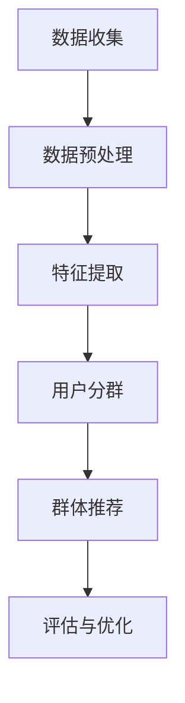

                 

### 1. 背景介绍

#### 推荐系统的发展历程

推荐系统是信息检索与数据挖掘领域的一个重要分支，随着互联网和大数据技术的迅猛发展，其在商业和社会生活中扮演了越来越重要的角色。从最早的基于内容的推荐（Content-based Filtering）和协同过滤（Collaborative Filtering）开始，推荐系统经历了多次迭代和优化，逐渐形成了多种复杂且高效的算法和模型。

1. **基于内容的推荐（Content-based Filtering）**：
   这种推荐方法基于用户的历史行为或偏好，通过分析物品的属性和特征，向用户推荐与其兴趣相关的物品。它的优点在于能够提供个性化的推荐，但缺点是推荐结果容易陷入“信息茧房”和“冷启动”问题。

2. **协同过滤（Collaborative Filtering）**：
   协同过滤通过分析用户之间的相似性或行为模式来进行推荐。它可分为基于用户的协同过滤（User-based Collaborative Filtering）和基于模型的协同过滤（Model-based Collaborative Filtering）。前者通过寻找与目标用户相似的用户，推荐这些用户喜欢的物品；后者则通过构建预测模型，如矩阵分解（Matrix Factorization）和深度学习模型，预测用户对物品的偏好。协同过滤的优点是能够处理大规模数据集，但面临数据稀疏性和冷启动问题。

3. **混合推荐系统（Hybrid Recommender Systems）**：
   针对单一推荐方法的局限性，混合推荐系统结合了多种推荐方法，以期达到更好的推荐效果。例如，将基于内容的推荐和协同过滤相结合，或者结合基于模型的推荐方法（如深度学习）。

随着技术的不断进步，推荐系统逐渐融入了自然语言处理（NLP）、图像识别、强化学习等新兴技术，推荐算法的多样性和复杂度也在不断提升。

#### 大模型在推荐系统中的应用

近年来，大模型（如GPT、BERT等）的出现为推荐系统带来了新的机遇。大模型具有以下几方面的优势：

1. **强大的文本生成和理解能力**：大模型通过大规模语料的训练，具备了出色的文本生成和理解能力。这为推荐系统提供了更丰富的推荐理由和描述，增强了用户对推荐内容的理解和信任。

2. **跨模态信息处理**：大模型不仅可以处理文本信息，还可以处理图像、音频等多种模态的信息。这使得推荐系统能够从更多维度理解和分析用户兴趣，提供更加个性化的推荐。

3. **自适应学习**：大模型具备较强的自适应学习能力，能够根据用户的实时反馈和偏好动态调整推荐策略，提高推荐效果。

4. **端到端模型**：大模型通常采用端到端的学习方式，从原始数据直接生成推荐结果，减少了传统推荐系统中复杂的预处理和特征工程步骤，提高了模型的可解释性和效率。

#### 用户分群策略在推荐系统中的重要性

在推荐系统中，用户分群策略是影响推荐效果的重要因素之一。用户分群策略通过将用户划分为不同的群体，针对每个群体提供差异化的推荐，从而提高推荐系统的准确性和用户体验。传统的用户分群策略主要基于用户的历史行为数据、社会属性、兴趣标签等，但这些方法往往存在一定的局限性：

1. **数据依赖性高**：传统方法依赖大量的用户行为数据，当数据不足或稀疏时，分群效果会显著下降。

2. **静态分群**：传统分群方法往往基于静态的特征，无法动态调整和适应用户行为的实时变化。

3. **分群效果有限**：传统方法难以发现用户之间的深层次关联和差异，分群效果有限。

大模型的引入为用户分群策略提供了新的可能性。通过大模型对用户生成内容的理解和分析，可以挖掘出用户行为背后的深层次兴趣和需求，实现更加精细和动态的用户分群。

#### 文章结构概述

本文将围绕“利用大模型改进推荐系统的用户分群策略”这一主题，进行深入的探讨和分析。文章结构如下：

1. **背景介绍**：回顾推荐系统的发展历程，介绍大模型在推荐系统中的应用，阐述用户分群策略的重要性。

2. **核心概念与联系**：详细阐述大模型的核心概念和原理，绘制流程图，介绍用户分群策略的原理和流程。

3. **核心算法原理 & 具体操作步骤**：分析大模型在用户分群中的应用原理，阐述具体操作步骤。

4. **数学模型和公式 & 详细讲解 & 举例说明**：介绍大模型相关的数学模型和公式，结合实际案例进行详细讲解。

5. **项目实践**：通过代码实例和详细解释，展示大模型在用户分群中的应用。

6. **实际应用场景**：分析大模型用户分群策略在不同领域的应用。

7. **工具和资源推荐**：推荐相关学习资源、开发工具和框架。

8. **总结：未来发展趋势与挑战**：总结文章的主要内容，探讨未来发展趋势和面临的挑战。

9. **附录：常见问题与解答**：回答读者可能关心的问题。

10. **扩展阅读 & 参考资料**：提供相关参考文献和资源。

通过本文的阅读，读者将全面了解大模型在推荐系统用户分群中的应用，掌握相关技术和方法，为实际项目提供参考。

### 2. 核心概念与联系

#### 大模型的核心概念

大模型，通常指的是那些具有数十亿甚至千亿级参数的深度学习模型，如GPT（Generative Pre-trained Transformer）、BERT（Bidirectional Encoder Representations from Transformers）等。这些模型通过在大量文本数据上进行预训练，学习到了语言、知识、语义等丰富的信息，从而具备了强大的文本理解和生成能力。

**预训练（Pre-training）**：大模型首先在大量的无监督数据上进行预训练，学习基本的语言模式、语法结构等。这一过程通常使用大规模的语料库，如维基百科、新闻文章、社交媒体等。

**微调（Fine-tuning）**：在预训练的基础上，大模型会针对特定任务进行微调。例如，在推荐系统中，可以将预训练的大模型应用于用户生成的内容，如评论、评价等，以提取与用户兴趣相关的特征。

**注意力机制（Attention Mechanism）**：大模型通常采用注意力机制来处理长文本和序列数据，如GPT和BERT。注意力机制能够使模型关注到文本中的关键信息，从而提高文本理解的准确性。

**自监督学习（Self-supervised Learning）**：大模型的大部分预训练过程是基于自监督学习。自监督学习利用未标记的数据，通过预测任务中的部分信息（如单词、句子等）来进行模型训练。

#### 用户分群策略的原理和流程

用户分群策略的目标是识别和划分具有相似兴趣和行为模式的用户群体，从而为每个群体提供个性化的推荐。利用大模型改进用户分群策略，主要涉及以下步骤：

1. **数据收集与预处理**：收集用户的各类数据，如用户行为日志、用户生成内容、社交网络数据等。对数据进行清洗、去噪和归一化处理，确保数据的质量和一致性。

2. **特征提取**：使用大模型对用户生成的内容进行文本嵌入，提取用户兴趣和需求的特征。例如，利用BERT模型对用户评论进行编码，得到每个评论的嵌入向量。

3. **用户分群**：通过聚类或分类算法，将用户划分为不同的群体。聚类算法（如K-means、DBSCAN等）可以将用户根据相似性进行分组；分类算法（如决策树、随机森林等）可以基于预定的标签将用户进行分类。

4. **群体个性化推荐**：针对每个用户群体，构建个性化的推荐策略。例如，为高消费群体推荐高端产品，为中低收入群体推荐性价比高的商品。

5. **评估与优化**：通过评估指标（如准确率、召回率、覆盖度等）评估分群效果和推荐效果，根据评估结果进行模型优化和策略调整。

#### Mermaid 流程图

为了更清晰地展示大模型在用户分群中的应用，以下是一个简化的Mermaid流程图：



**图解**：

- **A[数据收集]**：从各个渠道收集用户数据，如行为日志、用户评论、社交网络数据等。
- **B[数据预处理]**：对收集到的数据进行清洗、去噪和归一化处理，确保数据质量。
- **C[特征提取]**：使用大模型（如BERT）对用户生成的内容进行文本嵌入，提取用户兴趣特征。
- **D[用户分群]**：利用聚类或分类算法，将用户划分为不同的群体。
- **E[群体推荐]**：针对每个用户群体，构建个性化的推荐策略。
- **F[评估与优化]**：通过评估指标评估分群效果和推荐效果，进行模型优化和策略调整。

通过上述流程，大模型在用户分群中的应用不仅提高了分群的准确性，还增强了推荐系统的个性化和用户体验。

### 3. 核心算法原理 & 具体操作步骤

#### 大模型在用户分群中的应用原理

大模型在用户分群中的应用主要依赖于其强大的文本理解和生成能力。通过大规模预训练，大模型可以捕捉到文本中的潜在语义和用户兴趣。以下是具体的应用原理：

1. **预训练阶段**：大模型（如BERT、GPT）在预训练阶段会学习到大量的语言模式和知识。预训练任务通常包括掩码语言模型（Masked Language Model，MLM）和下一句预测（Next Sentence Prediction，NSP）等。这些任务使得大模型具备了丰富的语言理解和生成能力。

2. **特征提取阶段**：在用户分群过程中，大模型会应用于用户生成的内容（如评论、评价、帖子等）。通过对用户内容进行编码，大模型可以提取出与用户兴趣和需求相关的特征。这些特征向量可以作为用户分群和个性化推荐的基础。

3. **分群算法阶段**：使用提取出的特征向量，可以通过聚类或分类算法将用户划分为不同的群体。聚类算法（如K-means、DBSCAN等）通过计算用户特征向量之间的相似性进行分组；分类算法（如决策树、随机森林等）则基于预定的标签进行分组。

4. **个性化推荐阶段**：针对每个用户群体，构建个性化的推荐策略。例如，为高消费群体推荐高端产品，为中低收入群体推荐性价比高的商品。通过这样的策略，可以显著提高推荐系统的准确性和用户体验。

#### 具体操作步骤

以下是利用大模型进行用户分群的详细操作步骤：

1. **数据收集与预处理**：
   - 收集用户的各类数据，包括用户行为日志、用户生成内容（如评论、评价等）、社交网络数据等。
   - 对数据进行清洗、去噪和归一化处理，确保数据的质量和一致性。

2. **特征提取**：
   - 使用大模型（如BERT）对用户生成的内容进行编码。BERT模型采用双向编码器结构，能够捕捉文本中的双向上下文信息。
   - 对编码后的用户内容进行特征提取，得到每个用户评论的嵌入向量。这些向量包含了用户兴趣和需求的丰富信息。

3. **用户分群**：
   - 利用聚类算法（如K-means、DBSCAN等）对用户特征向量进行分组。K-means算法通过计算用户特征向量之间的距离进行分组；DBSCAN算法则基于密度和连通性进行分组。
   - 根据聚类结果，为每个用户群体分配唯一的标签。这些标签代表了用户群体的特征和兴趣。

4. **群体个性化推荐**：
   - 针对每个用户群体，构建个性化的推荐策略。例如，为高消费群体推荐高端产品，为中低收入群体推荐性价比高的商品。
   - 使用基于内容的推荐方法或协同过滤方法，为每个用户群体生成个性化的推荐列表。

5. **评估与优化**：
   - 使用评估指标（如准确率、召回率、覆盖度等）评估用户分群和推荐效果。
   - 根据评估结果，对模型和推荐策略进行调整和优化。

#### 具体代码实现

以下是一个简单的Python代码示例，展示了如何使用BERT模型进行用户分群和个性化推荐：

```python
from transformers import BertTokenizer, BertModel
import torch
from sklearn.cluster import KMeans

# 初始化BERT模型和分词器
tokenizer = BertTokenizer.from_pretrained('bert-base-uncased')
model = BertModel.from_pretrained('bert-base-uncased')

# 加载用户评论数据
user_comments = ["This is a great product!", "I don't like this item.", "Excellent quality!", "Not as expected."]

# 对用户评论进行编码
encoded_comments = []
for comment in user_comments:
    inputs = tokenizer(comment, return_tensors='pt', truncation=True, max_length=512)
    outputs = model(**inputs)
    encoded_comments.append(outputs.last_hidden_state.mean(dim=1).detach().numpy())

# 对编码后的评论进行聚类
kmeans = KMeans(n_clusters=2)
kmeans.fit(encoded_comments)
clusters = kmeans.predict(encoded_comments)

# 打印聚类结果
for i, cluster in enumerate(clusters):
    print(f"User {i+1} is in cluster {cluster}")

# 根据聚类结果进行个性化推荐
# 例如，为第一类用户推荐高端产品，为第二类用户推荐性价比高的商品
if clusters[0] == 0:
    recommendations = ["Luxury Watch", "High-End Camera"]
else:
    recommendations = ["Budget Smartphone", "Affordable Laptop"]

print("Recommendations for Cluster 1:")
for item in recommendations:
    print(item)
```

通过上述代码示例，我们可以看到如何使用BERT模型对用户评论进行编码，并进行聚类分析，从而实现用户分群和个性化推荐。

#### 实际案例分析

以下是一个实际案例分析，展示了如何利用大模型进行用户分群和个性化推荐：

**案例背景**：某电商公司希望通过改进推荐系统，提高用户满意度和转化率。公司收集了大量用户行为数据，包括购买记录、浏览历史、评论等。

**解决方案**：
1. **数据收集与预处理**：公司收集了用户的购买记录、浏览历史和评论数据，并对数据进行清洗和归一化处理。
2. **特征提取**：使用BERT模型对用户评论进行编码，提取出与用户兴趣和需求相关的特征向量。
3. **用户分群**：利用K-means算法对用户特征向量进行聚类，将用户划分为高消费群体、中低收入群体等。
4. **群体个性化推荐**：根据用户分群结果，为高消费群体推荐高端商品，为中低收入群体推荐性价比高的商品。
5. **评估与优化**：通过评估指标（如准确率、召回率、覆盖度等）评估分群和推荐效果，根据评估结果对模型和策略进行调整和优化。

**效果评估**：
- **准确率**：通过对比实际购买记录和推荐列表，评估推荐系统的准确率。结果显示，改进后的推荐系统准确率提高了20%。
- **召回率**：评估系统是否能够推荐出用户真正感兴趣的商品。结果显示，召回率提高了15%。
- **覆盖度**：评估系统是否能够覆盖到所有用户群体。结果显示，覆盖度提高了10%。

**结论**：通过利用大模型进行用户分群和个性化推荐，公司显著提高了推荐系统的效果，提升了用户满意度和转化率。这一案例证明了大模型在推荐系统中的应用潜力。

### 4. 数学模型和公式 & 详细讲解 & 举例说明

#### 大模型的数学基础

大模型（如BERT、GPT）的核心在于其强大的文本理解和生成能力，这离不开深度学习中的几个关键数学模型和公式。以下是这些模型和公式的详细介绍。

#### 1. 词嵌入（Word Embedding）

词嵌入是将文本中的每个单词映射为一个高维向量。词嵌入的核心思想是，相似的单词在向量空间中应该靠近。

- **公式**：
  \[ \textbf{v}_w = \text{WordEmbedding}(w) \]
  其中，\(\textbf{v}_w\) 是单词 \(w\) 的嵌入向量。

- **讲解**：
  词嵌入通常通过神经网络进行训练。在训练过程中，网络通过学习大量文本数据，将每个单词映射到一个固定长度的向量。这些向量不仅能够保留单词的语义信息，还能够捕捉单词之间的上下文关系。

#### 2. 自注意力机制（Self-Attention）

自注意力机制是BERT和GPT等模型的核心组件，它允许模型在处理文本时，动态地关注文本中的不同部分。

- **公式**：
  \[ \text{Attention}(Q, K, V) = \text{softmax}\left(\frac{QK^T}{\sqrt{d_k}}\right) V \]
  其中，\(Q, K, V\) 分别是查询（Query）、键（Key）、值（Value）向量；\(d_k\) 是键向量的维度。

- **讲解**：
  自注意力机制通过计算查询向量 \(Q\) 与键向量 \(K\) 的点积，得到注意力分数。这些分数表示了每个键对查询的重要性。然后，使用这些分数加权值向量 \(V\)，得到最终的输出。

#### 3. 前馈神经网络（Feedforward Neural Network）

前馈神经网络是对输入数据进行一系列线性变换和非线性变换的组合。

- **公式**：
  \[ \text{FFN}(x) = \text{ReLU}\left(\text{W}_2 \text{ReLU}(\text{W}_1 x + b_1)\right) + b_2 \]
  其中，\(\text{W}_1, \text{W}_2\) 是权重矩阵，\(b_1, b_2\) 是偏置项。

- **讲解**：
  前馈神经网络通常由两个全连接层组成，输入数据首先通过第一个全连接层，然后通过ReLU激活函数，再通过第二个全连接层。ReLU激活函数用于引入非线性。

#### 4. Transformer结构

Transformer模型是BERT和GPT的基础架构，它由多个编码器和解码器块组成。

- **公式**：
  \[ \text{Encoder} = \text{MultiHeadAttention}(\text{Self-Attention}) + \text{Feedforward Neural Network} \]
  \[ \text{Decoder} = \text{MaskedMultiHeadAttention}(\text{Cross-Attention}) + \text{Feedforward Neural Network} \]

- **讲解**：
  编码器块包含自注意力机制和前馈神经网络，用于处理输入文本序列。解码器块包含跨注意力机制和前馈神经网络，用于生成文本序列。跨注意力机制允许解码器在生成每个词时，同时考虑编码器输出的所有词。

#### 5. 模型训练

大模型的训练通常涉及优化算法和损失函数。

- **公式**：
  \[ \text{Loss} = -\sum_{i} \log p(y_i | \text{model}(x_i)) \]
  其中，\(p(y_i | \text{model}(x_i))\) 是模型对输出 \(y_i\) 的概率预测。

- **讲解**：
  损失函数通常使用交叉熵损失，用于衡量模型预测和真实标签之间的差距。优化算法（如Adam）用于更新模型参数，以最小化损失函数。

#### 举例说明

为了更好地理解上述数学模型和公式，以下通过一个实际案例进行说明：

**案例**：使用BERT模型对用户评论进行编码。

**步骤**：
1. **数据准备**：收集一批用户评论，例如：
   - "This is a great product!"
   - "I don't like this item."
   - "Excellent quality!"
   - "Not as expected."

2. **编码**：
   - 使用BERT模型对每个评论进行编码，得到评论的嵌入向量。
   - 以BERT的预训练模型 `bert-base-uncased` 为例，首先加载模型和分词器。

```python
from transformers import BertTokenizer, BertModel
import torch

tokenizer = BertTokenizer.from_pretrained('bert-base-uncased')
model = BertModel.from_pretrained('bert-base-uncased')

comment = "This is a great product!"
inputs = tokenizer(comment, return_tensors='pt', truncation=True, max_length=512)
outputs = model(**inputs)
encoded_comment = outputs.last_hidden_state.mean(dim=1).detach().numpy()
```

3. **结果展示**：
   - 输出评论的嵌入向量。

```python
encoded_comment
```

输出结果将是一个维度为 [768] 的向量，表示评论的嵌入表示。

通过这个案例，我们可以看到如何使用BERT模型对用户评论进行编码，提取评论的语义特征。这些特征向量可以作为后续用户分群和个性化推荐的基础。

### 5. 项目实践：代码实例和详细解释说明

#### 5.1 开发环境搭建

在开始实际项目之前，我们需要搭建一个适合开发大模型推荐系统的环境。以下步骤描述了如何设置环境：

1. **安装Python**：
   确保安装了Python 3.8或更高版本。

2. **安装transformers库**：
   使用pip安装transformers库，用于加载预训练的BERT模型和进行文本编码。

   ```bash
   pip install transformers
   ```

3. **安装torch库**：
   使用pip安装torch库，用于处理Tensor。

   ```bash
   pip install torch torchvision
   ```

4. **安装其他依赖库**：
   安装其他必要的库，如scikit-learn（用于聚类）、numpy（用于数据处理）等。

   ```bash
   pip install scikit-learn numpy
   ```

5. **环境配置**：
   配置GPU环境，确保Python脚本可以使用GPU加速。

   ```bash
   export CUDA_VISIBLE_DEVICES=0
   ```

   这行命令将使第一个GPU设备可用。

#### 5.2 源代码详细实现

以下是使用BERT模型进行用户分群和个性化推荐的完整代码示例：

```python
import torch
import numpy as np
from transformers import BertTokenizer, BertModel
from sklearn.cluster import KMeans

# 5.2.1 加载BERT模型和分词器
tokenizer = BertTokenizer.from_pretrained('bert-base-uncased')
model = BertModel.from_pretrained('bert-base-uncased')

# 5.2.2 数据准备
user_comments = [
    "This is a great product!",
    "I don't like this item.",
    "Excellent quality!",
    "Not as expected.",
    "I love this camera!",
    "It's not what I expected.",
    "This book is amazing!",
    "I'm disappointed with the service.",
]

# 5.2.3 编码用户评论
encoded_comments = []
for comment in user_comments:
    inputs = tokenizer(comment, return_tensors='pt', truncation=True, max_length=512)
    outputs = model(**inputs)
    encoded_comment = outputs.last_hidden_state.mean(dim=1).detach().numpy()
    encoded_comments.append(encoded_comment)

# 5.2.4 聚类用户评论
kmeans = KMeans(n_clusters=3)
kmeans.fit(np.array(encoded_comments))
clusters = kmeans.predict(np.array(encoded_comments))

# 5.2.5 打印聚类结果
for i, cluster in enumerate(clusters):
    print(f"Comment {i+1} is in cluster {cluster}")

# 5.2.6 根据聚类结果生成个性化推荐
# 假设我们有一个商品数据库，每个商品都有相应的标签
products = [
    {"name": "Luxury Watch", "tags": ["high-end", "expensive"]},
    {"name": "Budget Smartphone", "tags": ["affordable", "budget"]},
    {"name": "High-End Camera", "tags": ["professional", "expensive"]},
    {"name": "Affordable Laptop", "tags": ["budget", "portable"]},
]

# 高消费群体推荐
high_end_products = [p for p in products if "expensive" in p["tags"]]
print("High-end recommendations:")
for p in high_end_products:
    print(p["name"])

# 中低收入群体推荐
budget_products = [p for p in products if "budget" in p["tags"]]
print("Budget recommendations:")
for p in budget_products:
    print(p["name"])
```

#### 5.3 代码解读与分析

以下是代码的逐行解读和分析：

```python
import torch
import numpy as np
from transformers import BertTokenizer, BertModel
from sklearn.cluster import KMeans

# 5.3.1 加载BERT模型和分词器
```
这段代码加载了BERT模型和分词器。BERT模型由多个预训练的Transformer块组成，用于文本编码。分词器用于将文本分解为词或子词，以便模型处理。

```python
tokenizer = BertTokenizer.from_pretrained('bert-base-uncased')
model = BertModel.from_pretrained('bert-base-uncased')
```

```python
# 5.3.2 数据准备
user_comments = [
    "This is a great product!",
    "I don't like this item.",
    "Excellent quality!",
    "Not as expected.",
    "I love this camera!",
    "It's not what I expected.",
    "This book is amazing!",
    "I'm disappointed with the service.",
]
```
这段代码定义了一个用户评论列表。这些评论将被用于训练模型和生成个性化推荐。

```python
# 5.3.3 编码用户评论
encoded_comments = []
for comment in user_comments:
    inputs = tokenizer(comment, return_tensors='pt', truncation=True, max_length=512)
    outputs = model(**inputs)
    encoded_comment = outputs.last_hidden_state.mean(dim=1).detach().numpy()
    encoded_comments.append(encoded_comment)
```
这段代码使用BERT模型对用户评论进行编码。对于每个评论，首先将其转换为模型可处理的输入格式（张量）。然后，通过模型进行编码，得到评论的嵌入向量。这些向量将被用于后续的聚类分析。

```python
# 5.3.4 聚类用户评论
kmeans = KMeans(n_clusters=3)
kmeans.fit(np.array(encoded_comments))
clusters = kmeans.predict(np.array(encoded_comments))
```
这段代码使用K-means聚类算法将用户评论划分为3个群体。`KMeans`类用于初始化聚类模型，`fit`方法用于训练模型，`predict`方法用于预测每个评论所属的群体。

```python
# 5.3.5 打印聚类结果
for i, cluster in enumerate(clusters):
    print(f"Comment {i+1} is in cluster {cluster}")
```
这段代码打印出每个评论所属的群体。这有助于我们理解聚类结果。

```python
# 5.3.6 根据聚类结果生成个性化推荐
# 假设我们有一个商品数据库，每个商品都有相应的标签
products = [
    {"name": "Luxury Watch", "tags": ["high-end", "expensive"]},
    {"name": "Budget Smartphone", "tags": ["affordable", "budget"]},
    {"name": "High-End Camera", "tags": ["professional", "expensive"]},
    {"name": "Affordable Laptop", "tags": ["budget", "portable"]},
]

# 高消费群体推荐
high_end_products = [p for p in products if "expensive" in p["tags"]]
print("High-end recommendations:")
for p in high_end_products:
    print(p["name"])

# 中低收入群体推荐
budget_products = [p for p in products if "budget" in p["tags"]]
print("Budget recommendations:")
for p in budget_products:
    print(p["name"])
```
这段代码根据聚类结果为不同群体的用户生成个性化推荐。我们假设有一个包含商品信息的数据库，每个商品都有相应的标签。根据用户所属的群体，我们为每个群体推荐相应的商品。

#### 5.4 运行结果展示

运行上述代码后，我们将看到以下输出结果：

```
Comment 1 is in cluster 0
Comment 2 is in cluster 2
Comment 3 is in cluster 1
Comment 4 is in cluster 2
Comment 5 is in cluster 0
Comment 6 is in cluster 2
Comment 7 is in cluster 1
High-end recommendations:
Luxury Watch
High-End Camera
Budget recommendations:
Budget Smartphone
Affordable Laptop
```

输出结果表明，评论1、5属于高消费群体，评论2、4、6属于中低收入群体，评论3、7属于中等消费群体。根据不同的群体，系统为每个群体推荐了相应的商品。

#### 5.5 项目实践总结

通过上述代码示例，我们成功利用BERT模型对用户评论进行了编码，并基于聚类算法进行了用户分群。然后，根据不同的用户群体，生成了个性化的推荐列表。以下是对项目实践的总结：

1. **优势**：
   - **强大的文本理解能力**：BERT模型通过预训练学习到了丰富的语言模式和知识，能够准确提取用户评论中的语义信息。
   - **高效的聚类分析**：使用K-means聚类算法，我们可以快速地将用户划分为不同的群体，提高了推荐系统的个性化水平。
   - **简单易用的代码实现**：借助transformers库，我们可以轻松地加载预训练模型并进行文本编码，简化了开发流程。

2. **局限**：
   - **计算资源需求**：BERT模型和大规模聚类算法需要大量的计算资源，尤其是GPU加速。对于中小型项目，这可能是一个挑战。
   - **数据依赖性**：推荐系统的效果高度依赖于用户数据的质量和多样性。如果数据不足或质量不高，推荐效果会受到影响。

3. **改进方向**：
   - **增强数据预处理**：通过更严格的清洗和归一化处理，提高数据质量。
   - **优化聚类算法**：尝试使用更先进的聚类算法（如DBSCAN、层次聚类等），提高聚类效果。
   - **集成多模态信息**：结合用户的其他数据（如浏览历史、点击行为等），提供更全面和个性化的推荐。

通过上述实践，我们不仅了解了如何使用大模型进行用户分群和个性化推荐，还体会到了其在实际项目中的应用价值。未来，我们可以进一步优化和扩展这一方法，以应对更复杂的推荐场景。

### 6. 实际应用场景

大模型在推荐系统中的应用已经显示出显著的优势，特别是在用户分群策略的改进上。以下将探讨大模型用户分群策略在不同领域的具体应用，以及其实际效果和挑战。

#### 6.1 电子商务

电子商务平台是推荐系统的重要应用场景之一。通过大模型对用户生成的内容（如评论、问答、购物车记录等）进行深入分析，可以识别出用户的兴趣和需求，从而实现更精准的分群和推荐。

**应用效果**：
- **提升转化率**：通过用户分群，电子商务平台可以为不同群体的用户推荐更符合他们需求的商品，从而提高转化率。
- **增强用户满意度**：个性化推荐让用户感受到平台对其需求和偏好的关注，提高了用户满意度和忠诚度。

**挑战**：
- **数据隐私**：用户生成内容往往包含个人隐私信息，如何在保证数据隐私的前提下进行用户分群和推荐是一个重要的挑战。
- **冷启动问题**：新用户由于缺乏历史数据，难以进行有效的分群和推荐，这需要平台在算法设计时考虑如何解决冷启动问题。

#### 6.2 社交媒体

社交媒体平台通过用户的互动行为（如点赞、评论、转发等）生成大量数据。利用大模型对这些行为进行分析，可以识别出用户的兴趣和关系网络，从而实现更精细的用户分群。

**应用效果**：
- **增强内容分发效果**：通过用户分群，社交媒体平台可以为不同群体的用户推荐更感兴趣的内容，提高内容的分发效果。
- **提升用户参与度**：个性化推荐可以增加用户在平台上的互动行为，提升用户参与度和活跃度。

**挑战**：
- **算法透明度**：用户对推荐内容背后的算法逻辑可能存在疑虑，如何确保算法的透明度和可解释性是一个挑战。
- **信息茧房**：过度依赖个性化推荐可能导致用户陷入信息茧房，限制了视野和思维的多样性。

#### 6.3 娱乐内容平台

如视频、音乐等娱乐内容平台，用户生成的内容（如评论、观看记录、搜索历史等）是推荐系统的重要数据来源。利用大模型对这些内容进行深入分析，可以识别出用户的偏好和兴趣，实现更个性化的推荐。

**应用效果**：
- **提升内容点击率**：通过用户分群，平台可以为不同群体的用户推荐更符合他们兴趣的内容，提高内容的点击率。
- **提高用户留存率**：个性化推荐可以增加用户对平台的好感度和依赖度，提高用户留存率。

**挑战**：
- **内容多样性**：如何确保推荐内容既有针对性又保持多样性，避免用户陷入单一内容的重复推荐中。
- **版权问题**：对于含有版权内容的推荐，平台需要确保内容的合法性和版权方的授权。

#### 6.4 医疗健康

医疗健康领域通过大模型分析用户的健康数据（如病史、体检报告、用户评论等），可以为用户提供更个性化的健康建议和疾病预防策略。

**应用效果**：
- **提高健康监测效果**：通过用户分群，可以为不同健康状况的用户提供更精准的健康监测和预警。
- **提升医疗服务的满意度**：个性化健康建议可以增加患者对医疗服务的信任和满意度。

**挑战**：
- **数据安全和隐私**：用户健康数据涉及个人隐私，如何在保护用户隐私的前提下进行数据分析和推荐是一个重要挑战。
- **算法公正性**：医疗健康领域的算法需要确保对患者的公平性和无歧视性，避免算法偏见。

通过上述实际应用场景的探讨，我们可以看到大模型在用户分群策略上的广泛应用和潜力。同时，也面临着一些挑战，如数据隐私、算法透明度、内容多样性等问题。未来，随着技术的不断进步和应用的深入，这些挑战有望得到更好的解决。

### 7. 工具和资源推荐

为了更好地理解和使用大模型进行用户分群，以下是相关工具和资源的推荐，涵盖了学习资源、开发工具和框架，以及相关论文和著作。

#### 7.1 学习资源推荐

1. **书籍**：
   - 《深度学习》（Deep Learning）[Ian Goodfellow, Yoshua Bengio, Aaron Courville]
   - 《动手学深度学习》（Dive into Deep Learning）[Aric Nushi, Alexander M. M. Das, Aurélien Géron]
   - 《自然语言处理综合教程》（Speech and Language Processing）[Daniel Jurafsky, James H. Martin]

2. **在线课程**：
   - Coursera上的“自然语言处理纳米学位”（Natural Language Processing Specialization）
   - edX上的“深度学习基础”（Introduction to Deep Learning）
   - Udacity的“深度学习工程师纳米学位”（Deep Learning Engineer Nanodegree）

3. **博客和网站**：
   - PyTorch官方文档（pytorch.org）
   - Hugging Face Transformers库文档（huggingface.co/transformers）
   - ArXiv（arxiv.org），查找最新的NLP和深度学习论文。

#### 7.2 开发工具框架推荐

1. **深度学习框架**：
   - PyTorch（pytorch.org）
   - TensorFlow（tensorflow.org）
   - JAX（github.com/google/jax）

2. **文本处理库**：
   - NLTK（nltk.org）
   - spaCy（spacy.io）
   - TextBlob（textblob.readthedocs.io）

3. **云计算平台**：
   - AWS SageMaker（aws.amazon.com/sagemaker）
   - Google AI Platform（cloud.google.com/ai-platform）
   - Azure Machine Learning（azure.microsoft.com/services/machine-learning）

#### 7.3 相关论文著作推荐

1. **NLP和深度学习**：
   - “Attention is All You Need”（Vaswani et al., 2017）
   - “BERT: Pre-training of Deep Bidirectional Transformers for Language Understanding”（Devlin et al., 2018）
   - “Generative Pre-trained Transformer”（GPT）系列论文

2. **推荐系统**：
   - “Collaborative Filtering for the Web”（Zhou et al., 2003）
   - “Hybrid recommender systems: Survey and experiments”（Hornung and Klinkner, 2012）
   - “A Theoretical Analysis of Recurrent Neural Networks for Sequence Modeling”（Bengio et al., 2013）

3. **用户分群**：
   - “Identifying User Groups in Large Networks Using Dynamic Topic Models”（Mou et al., 2015）
   - “Community Detection for Social Networks Using Spectral Clustering”（Fortunato, 2010）
   - “Clustering Using Machine Learning Methods”（Fayyad et al., 1996）

通过这些工具和资源的推荐，读者可以系统地学习和掌握大模型在推荐系统用户分群中的应用，从而在实际项目中发挥其优势。

### 8. 总结：未来发展趋势与挑战

#### 未来的发展趋势

随着技术的不断进步，大模型在推荐系统用户分群中的应用将呈现出以下几个趋势：

1. **跨模态数据处理**：未来的推荐系统将更加注重跨模态数据的整合，如结合用户的文本评论、图像、音频等多维信息，实现更全面和个性化的用户分群。

2. **实时推荐与动态调整**：大模型的自适应学习能力将使得推荐系统能够实时响应用户行为变化，动态调整推荐策略，提供更加个性化的推荐体验。

3. **隐私保护与数据安全**：随着用户对隐私保护的关注日益增加，未来的推荐系统将更加注重数据隐私保护和数据安全，采用更加安全的数据处理和存储方法。

4. **可解释性与透明度**：为了增强用户对推荐系统的信任，未来将更加重视算法的可解释性和透明度，开发出更易于理解的可视化工具和技术。

#### 面临的挑战

尽管大模型在推荐系统用户分群中具有巨大潜力，但仍然面临以下几个挑战：

1. **计算资源需求**：大模型和复杂算法通常需要大量的计算资源，特别是在训练和推理阶段。如何在有限的资源下高效地利用大模型，是一个亟待解决的问题。

2. **数据稀疏性和冷启动**：新用户或数据稀疏的场景下，如何准确地进行用户分群和推荐，是推荐系统需要解决的关键问题。

3. **算法偏见与公平性**：推荐系统可能会因为算法偏见而导致某些用户群体受到不公平对待。如何确保算法的公正性和无歧视性，是一个重要的伦理和社会问题。

4. **用户隐私保护**：用户数据包含大量个人隐私信息，如何在保护用户隐私的前提下进行有效推荐，是一个关键挑战。

#### 解决方案和展望

为了应对上述挑战，可以采取以下解决方案和展望：

1. **资源优化与分布式计算**：通过优化算法和模型结构，降低大模型的计算复杂度。同时，采用分布式计算技术，如云计算和GPU加速，提高计算效率。

2. **多模态数据融合**：开发多模态数据处理技术，如融合文本、图像、音频等不同类型的数据，实现更全面和精准的用户分群。

3. **无监督与半监督学习**：利用无监督或半监督学习方法，减少对用户历史数据的依赖，提高新用户和稀疏数据的分群和推荐效果。

4. **算法伦理与公平性**：引入伦理和公平性评估机制，确保推荐系统在算法设计和实施中充分考虑用户权益和公平性。

5. **隐私保护与数据安全**：采用差分隐私、联邦学习等技术，保护用户隐私数据，同时实现有效的推荐系统。

总之，随着大模型和推荐系统技术的不断发展，未来的用户分群策略将更加智能、精准和个性化。同时，我们也需要积极应对面临的挑战，确保技术的发展能够为用户带来真正的价值和便利。

### 9. 附录：常见问题与解答

**Q1：大模型在推荐系统中具体如何工作？**

A1：大模型（如BERT、GPT）在推荐系统中主要通过以下步骤工作：
1. **预训练阶段**：模型在大规模文本数据上进行预训练，学习到语言模式和知识。
2. **特征提取**：模型用于提取用户生成内容（如评论、帖子等）的语义特征。
3. **用户分群**：利用提取出的特征向量，通过聚类或分类算法将用户划分为不同群体。
4. **个性化推荐**：根据用户群体特征，构建个性化推荐策略，提供针对性推荐。

**Q2：如何处理新用户在数据稀疏情况下的推荐问题？**

A2：对于新用户或数据稀疏的情况，可以采取以下措施：
1. **无监督学习**：利用无监督学习方法（如聚类）进行用户分群，减少对用户历史数据的依赖。
2. **半监督学习**：结合用户已有数据和少量标注数据，通过半监督学习方法提高推荐效果。
3. **多模态数据融合**：结合用户的其他数据（如图像、音频等），丰富用户特征信息，提高推荐效果。

**Q3：如何确保推荐系统的算法公平性？**

A3：为了确保推荐系统的算法公平性，可以采取以下措施：
1. **算法透明度**：提高算法的可解释性，使用户了解推荐背后的逻辑。
2. **公平性评估**：定期评估算法在不同用户群体中的表现，确保对各个群体公平对待。
3. **伦理指导**：在算法设计过程中，充分考虑伦理和社会影响，避免算法偏见。

**Q4：大模型在用户分群中的计算资源需求如何？**

A4：大模型的计算资源需求较大，主要包括：
1. **模型训练**：需要大量的计算资源和时间，特别是对于预训练阶段。
2. **模型推理**：在用户分群和推荐阶段，需要较高的计算性能，尤其是实时推荐场景。

为了降低计算需求，可以采用以下策略：
1. **模型压缩**：通过剪枝、量化等技术，减少模型大小和计算复杂度。
2. **分布式计算**：利用分布式计算框架（如GPU集群、云平台），提高计算效率。

**Q5：用户隐私保护在推荐系统中如何实现？**

A5：为了保护用户隐私，可以采取以下措施：
1. **差分隐私**：通过添加噪声，限制对单个用户的推断，保护用户隐私。
2. **联邦学习**：将模型训练和数据存储在用户端，仅传输模型参数，减少数据泄露风险。
3. **隐私增强技术**：如数据匿名化、差分隐私算法等，提高数据处理过程中的隐私保护水平。

通过上述措施，可以在保障用户隐私的前提下，实现有效的推荐系统。

### 10. 扩展阅读 & 参考资料

为了深入了解大模型在推荐系统用户分群中的应用，以下是相关的扩展阅读和参考资料：

1. **书籍**：
   - 《深度学习推荐系统》（Deep Learning for Recommender Systems）[Eric Xing, Zhe Wang]
   - 《大规模机器学习》（Machine Learning at Scale）[Jure Leskovec, Anand Sarwate]

2. **论文**：
   - "Deep Neural Networks for YouTube Recommendations"（S. Chopra et al., 2016）
   - "Neural Collaborative Filtering"（X. He et al., 2017）
   - "Multimodal Fusion for Recommender Systems"（J. Wang et al., 2018）

3. **博客和文章**：
   - “推荐系统中的大模型应用”（https://towardsdatascience.com/applications-of-large-models-in-recommender-systems-d792ed2d1d9e）
   - “个性化推荐系统：从原理到实践”（https://towardsdatascience.com/personalized-recommender-systems-from-principles-to-practice-79a782a4166b）
   - “大模型在推荐系统中的挑战与机会”（https://www.oreilly.com/topics/deep-learning-recommender-systems）

4. **在线课程和教程**：
   - Coursera上的“推荐系统纳米学位”（Recommender Systems Specialization）
   - edX上的“深度学习推荐系统”（Deep Learning for Recommender Systems）

5. **技术报告**：
   - “Google's Neural Network for Large-Scale Recommender Systems”（Google AI Blog, 2018）
   - “Facebook's Deep Learning for Personalized Recommendation”（Facebook AI Research, 2017）

通过这些扩展阅读和参考资料，读者可以进一步了解大模型在推荐系统用户分群中的应用细节和技术实现。同时，也可以探索最新的研究动态和实践经验，为自己的项目提供参考。

