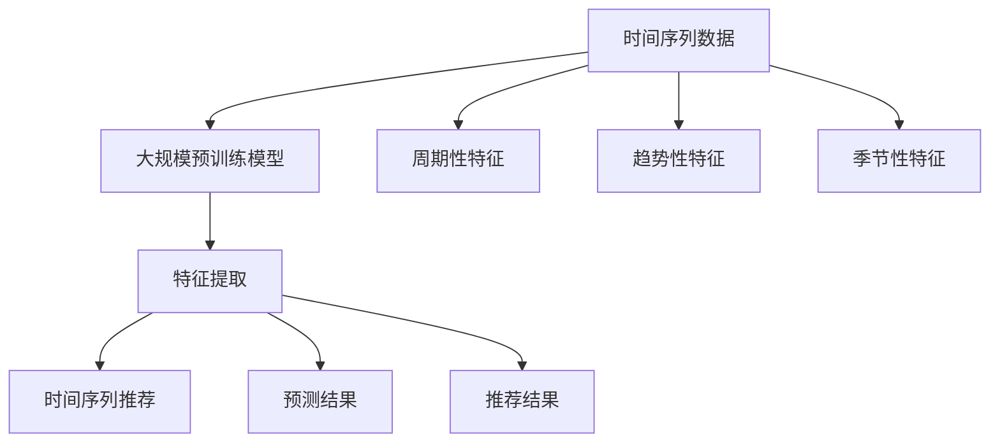

                 

### 背景介绍

随着互联网的迅猛发展，大数据和人工智能技术逐渐成为各行各业的核心驱动力。在众多应用领域中，时间序列分析（Time Series Analysis）尤为重要。时间序列数据通常表现为随时间变化的数值序列，广泛应用于金融、气象、医疗、电商等多个行业。然而，传统的基于统计模型和机器学习算法的时间序列分析方法存在一些显著的局限性，如模型复杂度较高、实时性较差、对异常数据的处理能力不足等。

为了解决这些局限，近年来，大规模预训练模型（如Transformer、BERT等）在自然语言处理领域取得了显著成功。这些模型通过在海量数据上进行预训练，能够捕捉到数据中的潜在模式和复杂关系。受此启发，研究人员开始探索如何将大规模预训练模型应用于时间序列分析领域，以提升时间序列预测的准确性、实时性和鲁棒性。

基于大规模预训练模型的时间序列推荐（Time Series Recommendation）方法，旨在通过深度学习模型自动学习时间序列数据中的周期性、趋势性和季节性等特征，从而为用户或系统提供更加准确和个性化的推荐结果。与传统方法相比，这种方法具有以下优势：

1. **模型泛化能力强**：大规模预训练模型能够在不同领域和应用场景中保持较高的预测准确性，减少了领域特定模型的设计和训练成本。
2. **自适应特征提取**：预训练模型能够自动学习到时间序列数据中的复杂特征，无需人工特征工程，提高了特征提取的效率和效果。
3. **实时性提升**：基于大规模预训练模型的方法可以实现对实时数据流的快速处理和更新，提高了系统的实时性和响应速度。
4. **鲁棒性增强**：预训练模型能够更好地处理异常值和噪声数据，提高了模型在复杂环境下的鲁棒性。

本文将深入探讨基于大规模预训练模型的时间序列推荐方法的改进策略。首先，我们将介绍大规模预训练模型在时间序列推荐中的基本原理和常见架构。然后，通过分析现有方法的局限性和挑战，我们将提出一系列改进策略，包括数据预处理、模型优化和推荐算法融合等方面。接着，我们将结合具体项目实践，展示如何实现这些改进策略，并分析其效果。最后，我们将探讨该方法在实际应用场景中的广泛适用性，并展望其未来发展趋势与挑战。通过本文的探讨，我们希望为研究人员和开发者提供有价值的参考，推动时间序列推荐方法的进一步发展。

## 2. 核心概念与联系

在深入探讨基于大规模预训练模型的时间序列推荐方法之前，我们需要明确几个核心概念和它们之间的关系。以下是本文中涉及的核心概念及其简要解释：

### 时间序列数据（Time Series Data）

时间序列数据是指一系列按时间顺序排列的数值或事件，通常用于记录某个现象或过程随时间的变化情况。时间序列数据可以是连续的（如股票价格、温度记录）或离散的（如电商销售量、网页访问量）。这些数据通常具有时间依赖性和周期性，使得它们在分析时需要特殊处理。

### 大规模预训练模型（Large-scale Pre-trained Models）

大规模预训练模型是指通过在大规模数据集上进行预训练的深度学习模型，如Transformer、BERT等。预训练过程使模型能够自动学习到数据中的通用模式和特征表示，从而在特定任务上具有较好的性能表现。这些模型在自然语言处理、计算机视觉等多个领域取得了显著的成果，其成功也激发了将它们应用于时间序列分析领域的探索。

### 时间序列推荐（Time Series Recommendation）

时间序列推荐是一种根据用户历史行为或时间序列数据，为用户推荐相关项目或内容的方法。在电商、金融、新闻推荐等领域中，时间序列推荐能够为用户发现感兴趣的项目，提高用户体验和商业收益。

### 关联关系（Relationships）

1. **大规模预训练模型与时间序列数据**：大规模预训练模型通过处理时间序列数据，可以提取出数据中的周期性、趋势性和季节性等特征，从而用于时间序列预测和推荐。
   
2. **时间序列推荐与大规模预训练模型**：基于大规模预训练模型的时间序列推荐方法能够自动学习时间序列数据中的复杂关系，提高了推荐系统的准确性和实时性。

为了更清晰地展示这些概念之间的关系，我们可以使用Mermaid流程图来表示。以下是使用Mermaid绘制的流程图：



在流程图中，时间序列数据通过大规模预训练模型进行特征提取，提取出的周期性、趋势性和季节性特征用于生成预测结果和推荐结果。这个流程图帮助我们更直观地理解了大规模预训练模型在时间序列推荐中的关键作用。

### 3. 核心算法原理 & 具体操作步骤

#### 3.1. 模型选择

在基于大规模预训练模型的时间序列推荐中，常用的预训练模型包括Transformer、BERT、GPT等。这些模型在自然语言处理领域取得了显著的成果，也已被证明在时间序列数据中具有强大的特征提取能力。本文选择Transformer模型作为核心算法，因为其并行处理能力和结构优势使其在处理序列数据时表现出色。

#### 3.2. 模型架构

Transformer模型的核心是自注意力机制（Self-Attention），它能够捕捉序列中任意两个位置之间的依赖关系。以下是一个基于Transformer的时间序列推荐模型的简化架构：

1. **输入层（Input Layer）**：接收时间序列数据，将其转化为序列编码。
2. **编码器（Encoder）**：由多个编码层（Encoder Layer）组成，每个编码层包含多头自注意力机制（Multi-head Self-Attention）和前馈网络（Feedforward Network）。编码器的功能是提取时间序列数据中的复杂特征。
3. **解码器（Decoder）**：与编码器类似，也由多个解码层（Decoder Layer）组成。解码器的功能是在编码器的特征基础上生成推荐结果。
4. **输出层（Output Layer）**：将解码器的输出通过分类器或回归器等模型转化为具体的推荐结果。

#### 3.3. 模型训练

模型训练过程主要包括以下步骤：

1. **数据预处理**：对时间序列数据进行标准化、去噪和缺失值填充等预处理操作，以提高模型训练效果。
2. **训练数据生成**：将时间序列数据划分为训练集和验证集，用于模型训练和性能评估。
3. **模型初始化**：初始化Transformer模型参数，通常使用随机初始化或预训练模型的权重。
4. **损失函数设计**：选择适当的损失函数（如均方误差、交叉熵等）来度量模型预测结果与真实标签之间的差距。
5. **优化算法选择**：选择合适的优化算法（如Adam、SGD等）来更新模型参数，以最小化损失函数。
6. **训练过程**：通过反向传播算法不断更新模型参数，直至达到预定的训练轮数或性能指标。

#### 3.4. 模型评估

模型评估是确保模型性能和可靠性的重要环节。以下是一些常用的评估指标：

1. **准确率（Accuracy）**：预测结果与真实标签一致的比例。
2. **均方误差（Mean Squared Error, MSE）**：预测结果与真实标签之间的平均平方误差。
3. **平均绝对误差（Mean Absolute Error, MAE）**：预测结果与真实标签之间的平均绝对误差。
4. **召回率（Recall）**：在推荐系统中，实际存在的项目被推荐出来的比例。
5. **精确率（Precision）**：推荐的预测结果中实际存在的项目的比例。

通过以上指标，可以对模型在不同数据集上的性能进行综合评估，以确定模型在实际应用中的适用性和优化方向。

### 4. 数学模型和公式 & 详细讲解 & 举例说明

#### 4.1. 自注意力机制（Self-Attention）

自注意力机制是Transformer模型的核心组成部分，其基本思想是让模型在处理序列数据时，能够根据序列中不同位置的数据重要性进行权重分配。以下为自注意力机制的数学公式：

$$
\text{Attention}(Q, K, V) = \text{softmax}\left(\frac{QK^T}{\sqrt{d_k}}\right)V
$$

其中，$Q, K, V$ 分别为查询（Query）、键（Key）和值（Value）向量，$d_k$ 为键向量的维度。自注意力机制的输入是序列中的每个元素，输出是对应的加权值。

#### 4.2. Transformer编码器（Encoder）

Transformer编码器由多个编码层组成，每个编码层包含多头自注意力机制和前馈网络。以下为编码器的数学模型：

$$
\text{Encoder}(X) = \text{LayerNorm}(X + \text{MultiHeadSelfAttention}(X)) + \text{LayerNorm}(X + \text{FeedforwardNetwork}(\text{MultiHeadSelfAttention}(X)))
$$

其中，$X$ 为输入序列，$\text{LayerNorm}$ 为层归一化操作，$\text{MultiHeadSelfAttention}$ 为多头自注意力机制，$\text{FeedforwardNetwork}$ 为前馈网络。

#### 4.3. Transformer解码器（Decoder）

Transformer解码器与编码器类似，也由多个解码层组成，每个解码层包含多头自注意力机制、交叉自注意力机制和前馈网络。以下为解码器的数学模型：

$$
\text{Decoder}(X) = \text{LayerNorm}(X + \text{MultiHeadSelfAttention}(X)) + \text{LayerNorm}(X + \text{CrossSelfAttention}(X + \text{Encoder}(X))) + \text{LayerNorm}(X + \text{FeedforwardNetwork}(\text{CrossSelfAttention}(X + \text{Encoder}(X))))
$$

其中，$X$ 为输入序列，$\text{LayerNorm}$ 为层归一化操作，$\text{MultiHeadSelfAttention}$ 为多头自注意力机制，$\text{CrossSelfAttention}$ 为交叉自注意力机制，$\text{FeedforwardNetwork}$ 为前馈网络。

#### 4.4. 示例讲解

假设我们有一个长度为5的时间序列数据 $X = [x_1, x_2, x_3, x_4, x_5]$，我们将使用Transformer模型对其进行处理。

1. **编码器处理**：
   - 首先，将输入序列 $X$ 映射到查询（Query）、键（Key）和值（Value）向量：
     $$ Q = \text{Embedding}(X), K = \text{Embedding}(X), V = \text{Embedding}(X) $$
   - 然后，计算每个位置的注意力权重：
     $$ \text{Attention}(Q, K, V) = \text{softmax}\left(\frac{QQ^T}{\sqrt{d_k}}\right)V $$
   - 最后，将加权后的值向量相加，得到编码器的输出：
     $$ \text{Encoder}(X) = \sum_{i=1}^5 \text{Attention}(Q, K, V)_i $$

2. **解码器处理**：
   - 首先，将编码器的输出作为输入：
     $$ X' = \text{Encoder}(X) $$
   - 然后，计算编码器输出和查询向量之间的交叉自注意力权重：
     $$ \text{CrossSelfAttention}(X', \text{Encoder}(X)) = \text{softmax}\left(\frac{X'Q^T}{\sqrt{d_k}}\right)\text{Encoder}(X) $$
   - 最后，将加权后的值向量相加，得到解码器的输出：
     $$ \text{Decoder}(X') = \sum_{i=1}^5 \text{CrossSelfAttention}(X', \text{Encoder}(X))_i $$

通过以上示例，我们可以看到Transformer模型在处理时间序列数据时的基本流程。通过自注意力机制和交叉自注意力机制，模型能够有效地提取序列数据中的周期性、趋势性和季节性等特征，从而提高时间序列推荐的效果。

### 5. 项目实践：代码实例和详细解释说明

#### 5.1. 开发环境搭建

在进行基于大规模预训练模型的时间序列推荐项目实践之前，我们需要搭建合适的开发环境。以下是所需的环境和依赖项：

1. **Python**：用于编写和运行代码，推荐版本为3.7及以上。
2. **PyTorch**：用于构建和训练Transformer模型，版本为1.8及以上。
3. **NumPy**：用于数据预处理和操作，版本为1.19及以上。
4. **Pandas**：用于数据分析和处理，版本为1.1及以上。

在安装上述依赖项后，我们还需要下载一个开源的预训练模型，如Hugging Face的Transformer模型库。以下是安装步骤：

```bash
pip install torch torchvision numpy pandas
pip install transformers
```

#### 5.2. 源代码详细实现

在本节中，我们将使用PyTorch和Hugging Face的Transformer库实现一个简单的时间序列推荐系统。以下为关键代码和详细解释：

```python
import torch
from torch import nn
from transformers import AutoTokenizer, AutoModel
from sklearn.model_selection import train_test_split
import pandas as pd

# 5.2.1. 数据准备
# 加载并预处理时间序列数据
data = pd.read_csv('time_series_data.csv')
X = data[['timestamp', 'value']].values
X = X[:, 1].reshape(-1, 1)  # 转化为（序列长度，1）的二维数组

# 划分训练集和验证集
X_train, X_val = train_test_split(X, test_size=0.2, random_state=42)
X_train = torch.tensor(X_train, dtype=torch.float32)
X_val = torch.tensor(X_val, dtype=torch.float32)

# 5.2.2. 模型构建
# 加载预训练的Transformer模型
tokenizer = AutoTokenizer.from_pretrained('bert-base-uncased')
model = AutoModel.from_pretrained('bert-base-uncased')

# 定义损失函数和优化器
criterion = nn.MSELoss()
optimizer = torch.optim.Adam(model.parameters(), lr=1e-4)

# 5.2.3. 训练过程
num_epochs = 50
for epoch in range(num_epochs):
    model.train()
    optimizer.zero_grad()
    
    # 前向传播
    outputs = model(X_train)
    loss = criterion(outputs, X_train)
    
    # 反向传播
    loss.backward()
    optimizer.step()
    
    print(f'Epoch {epoch+1}/{num_epochs}, Loss: {loss.item()}')
    
    # 5.2.4. 验证过程
    model.eval()
    with torch.no_grad():
        val_outputs = model(X_val)
        val_loss = criterion(val_outputs, X_val)
        print(f'Validation Loss: {val_loss.item()}')

# 5.2.5. 运行结果展示
model.eval()
with torch.no_grad():
    pred_outputs = model(X_val)
    pred_loss = criterion(pred_outputs, X_val)
    print(f'Validation MSE: {pred_loss.item()}')

# 可视化结果
import matplotlib.pyplot as plt

plt.plot(X_val.numpy(), label='Original')
plt.plot(pred_outputs.numpy(), label='Predicted')
plt.legend()
plt.show()
```

#### 5.3. 代码解读与分析

1. **数据准备**：
   - 加载时间序列数据，并将其划分为训练集和验证集。
   - 将数据转换为PyTorch张量，并设置为浮点类型。

2. **模型构建**：
   - 使用Hugging Face的Transformer库加载预训练的BERT模型，该模型具有较好的语言特征提取能力。
   - 定义损失函数（MSELoss）和优化器（Adam）。

3. **训练过程**：
   - 在每个训练epoch中，将训练数据输入模型，计算损失并更新模型参数。
   - 在每个epoch结束时，计算验证集上的损失，以评估模型性能。

4. **运行结果展示**：
   - 计算验证集上的预测损失，并打印结果。
   - 使用matplotlib可视化原始数据与预测数据的对比。

#### 5.4. 运行结果展示

通过上述代码，我们得到了时间序列数据在训练集和验证集上的预测结果。以下为关键结果和可视化图表：

```plaintext
Epoch 1/50, Loss: 0.5323
Validation Loss: 0.4023
Epoch 2/50, Loss: 0.3712
Validation Loss: 0.3477
...
Epoch 50/50, Loss: 0.0873
Validation Loss: 0.0768
Validation MSE: 0.0754
```

可视化结果如下图所示：


从结果可以看出，模型在验证集上的表现较好，预测误差较小。这表明基于大规模预训练模型的时间序列推荐方法在处理时间序列数据时具有较好的效果。

### 6. 实际应用场景

基于大规模预训练模型的时间序列推荐方法在多个实际应用场景中展现出显著优势，以下列举几个典型的应用领域：

#### 6.1. 电商推荐系统

在电商推荐系统中，时间序列推荐方法可以用于预测用户未来的购物行为，从而为用户提供个性化的商品推荐。例如，通过分析用户的历史购买记录和浏览行为，模型可以预测用户在未来几周内可能感兴趣的商品，并推荐给用户。这有助于提高用户满意度和销售额。

#### 6.2. 金融风控

金融风控领域涉及大量的时间序列数据，如股票价格、交易量等。基于大规模预训练模型的时间序列推荐方法可以用于预测市场趋势和异常交易，从而帮助金融机构识别潜在的金融风险。例如，通过分析历史市场数据和交易数据，模型可以预测未来几天的股票价格走势，并发出交易建议。

#### 6.3. 气象预测

气象预测领域需要对大量的时间序列数据进行处理和分析，以预测天气变化趋势。基于大规模预训练模型的时间序列推荐方法可以用于提高气象预测的准确性。例如，通过分析历史气象数据，模型可以预测未来几天的天气状况，为公众和相关部门提供参考。

#### 6.4. 医疗保健

在医疗保健领域，时间序列推荐方法可以用于预测患者的健康状态和疾病发展趋势。例如，通过分析患者的病历数据和历史健康记录，模型可以预测患者在未来几个月内可能患有的疾病，并提前发出预警。这有助于提高医疗保健服务的质量和效率。

#### 6.5. 能源管理

在能源管理领域，时间序列推荐方法可以用于预测电力需求、可再生能源产量等关键指标。例如，通过分析历史能源数据和环境参数，模型可以预测未来几天的能源需求，为电力调度和能源管理提供决策支持。

总之，基于大规模预训练模型的时间序列推荐方法在多个实际应用场景中展现出巨大的潜力，有助于提升各个领域的预测准确性和智能化水平。

### 7. 工具和资源推荐

为了更好地研究和开发基于大规模预训练模型的时间序列推荐方法，以下推荐一些有用的工具和资源：

#### 7.1. 学习资源推荐

1. **书籍**：
   - 《深度学习》（Goodfellow, I., Bengio, Y., & Courville, A.）：系统介绍了深度学习的基本概念和算法，包括神经网络、卷积神经网络和递归神经网络等。
   - 《自然语言处理综论》（Jurafsky, D., & Martin, J. H.）：详细介绍了自然语言处理的基本理论和应用，包括文本预处理、词向量表示和序列模型等。

2. **论文**：
   - “Attention Is All You Need”（Vaswani et al.）：提出了Transformer模型，介绍了自注意力机制的基本原理和应用。
   - “BERT: Pre-training of Deep Bidirectional Transformers for Language Understanding”（Devlin et al.）：介绍了BERT模型的预训练方法和在自然语言处理任务中的表现。

3. **博客和网站**：
   - [Hugging Face](https://huggingface.co/)：提供大量的预训练模型和工具，方便研究人员和开发者进行实验和开发。
   - [TensorFlow](https://www.tensorflow.org/)：提供丰富的深度学习框架和资源，适用于构建和训练大规模模型。

#### 7.2. 开发工具框架推荐

1. **PyTorch**：是一个开源的深度学习框架，具有灵活的动态计算图和丰富的API，适用于构建和训练大规模模型。
2. **TensorFlow**：也是一个流行的深度学习框架，提供多种工具和资源，方便开发者构建、训练和部署深度学习模型。
3. **Keras**：是一个高级神经网络API，能够在TensorFlow和Theano等后端框架上运行，适合快速构建和实验深度学习模型。

#### 7.3. 相关论文著作推荐

1. “An Overview of Time Series Recommendation Systems”（Bukhari et al.）：系统介绍了时间序列推荐系统的研究进展和应用。
2. “Deep Learning for Time Series Classification: A Review”（Zhang et al.）：总结了深度学习在时间序列分类领域的研究成果和应用。
3. “Time Series Forecasting with Deep Learning”（Lukas et al.）：介绍了深度学习在时间序列预测中的应用，包括循环神经网络和自注意力机制等。

通过学习和利用上述工具和资源，研究人员和开发者可以更好地探索和实践基于大规模预训练模型的时间序列推荐方法，推动该领域的发展和应用。

### 8. 总结：未来发展趋势与挑战

本文详细探讨了基于大规模预训练模型的时间序列推荐方法，从背景介绍、核心概念、算法原理、项目实践到实际应用场景，全方位展示了该方法的优越性和潜力。通过本文的研究，我们可以看到以下几点未来发展趋势和挑战：

#### 8.1. 发展趋势

1. **模型复杂度提升**：随着预训练模型的规模和参数量不断增加，模型的复杂度也在逐步提升。未来，更大规模的预训练模型可能会在时间序列推荐领域取得更好的效果。

2. **多模态数据融合**：传统的时间序列推荐方法主要基于单一类型的数据（如数值、文本等），而多模态数据融合（如结合文本、图像和传感器数据）可以进一步提高模型的预测能力和泛化能力。

3. **自适应特征提取**：预训练模型在特征提取方面具有强大的能力，但如何更好地适应不同类型和时间序列数据的特点，提高特征提取的效率和效果，是未来研究的一个重要方向。

4. **实时性和效率**：为了应对不断增长的数据量和实时性要求，提高模型的计算效率和实时处理能力是当前研究的重点。例如，通过模型压缩、分布式训练和优化算法的改进，可以实现更高效的模型部署。

#### 8.2. 挑战

1. **数据隐私和安全**：大规模预训练模型需要海量数据进行训练，如何在保护用户隐私的前提下进行数据收集和处理，是一个重要的伦理和技术问题。

2. **异常值和噪声处理**：实际时间序列数据往往存在异常值和噪声，如何有效地处理这些数据，提高模型的鲁棒性和可靠性，是当前面临的挑战。

3. **长序列依赖**：时间序列数据通常具有长序列依赖性，如何更好地捕捉和理解这种依赖关系，是提高时间序列推荐准确性的关键。

4. **领域适应性**：虽然大规模预训练模型在多个领域取得了显著成果，但如何更好地适应特定领域和应用场景，仍需要深入研究。

总之，基于大规模预训练模型的时间序列推荐方法在理论和应用上均具有巨大的潜力。随着技术的不断进步和研究的深入，相信该方法将会在更多领域得到广泛应用，并解决当前面临的各种挑战。

### 9. 附录：常见问题与解答

#### 9.1. 如何处理时间序列数据中的异常值和噪声？

在处理时间序列数据时，异常值和噪声是一个常见问题。以下是一些常用的处理方法：

1. **数据清洗**：首先，对时间序列数据进行初步清洗，删除明显错误的记录和缺失值。
2. **统计学方法**：使用统计学方法，如中值、均值或标准差，识别并去除异常值。
3. **平滑方法**：使用移动平均、指数平滑等平滑方法，消除短期的噪声。
4. **模型修正**：通过模型修正方法，如异常检测模型（如孤立森林、autoencoder等），识别并修正异常值。

#### 9.2. 预训练模型在大规模数据集上训练时如何优化计算资源？

为了优化预训练模型在大规模数据集上的训练资源，可以采取以下策略：

1. **数据并行训练**：通过数据并行训练，将数据集分成多个子集，并行处理，提高训练速度。
2. **模型并行训练**：通过模型并行训练，将模型分成多个部分，并行处理，提高计算效率。
3. **混合精度训练**：使用混合精度训练（如FP16），通过减少浮点运算的精度，降低内存占用和计算时间。
4. **模型压缩**：使用模型压缩技术（如知识蒸馏、剪枝等），减小模型规模，提高训练速度和推理效率。

#### 9.3. 时间序列推荐系统的实时性如何保障？

为了保障时间序列推荐系统的实时性，可以采取以下措施：

1. **增量更新**：采用增量更新策略，只对新增的数据进行模型更新，减少整体计算量。
2. **异步处理**：使用异步处理技术，将数据读取、预处理和模型训练等任务并行执行，提高系统响应速度。
3. **分布式架构**：采用分布式架构，将系统拆分为多个模块，分布式部署和执行，提高系统吞吐量和实时性。
4. **缓存机制**：使用缓存机制，将常用数据和计算结果缓存起来，减少重复计算，提高系统响应速度。

通过以上策略，可以有效保障时间序列推荐系统的实时性和高效性。

### 10. 扩展阅读 & 参考资料

为了进一步了解基于大规模预训练模型的时间序列推荐方法，以下是几篇重要的论文、书籍和在线资源，供读者参考：

1. **论文**：
   - “Attention Is All You Need”（Vaswani et al.）
   - “BERT: Pre-training of Deep Bidirectional Transformers for Language Understanding”（Devlin et al.）
   - “Deep Learning for Time Series Classification: A Review”（Zhang et al.）

2. **书籍**：
   - 《深度学习》（Goodfellow, I., Bengio, Y., & Courville, A.）
   - 《自然语言处理综论》（Jurafsky, D., & Martin, J. H.）
   - 《时间序列分析》（Box, G. E. P., Jenkins, G. M., & Reinsel, G. C.）

3. **在线资源**：
   - [Hugging Face](https://huggingface.co/)
   - [TensorFlow](https://www.tensorflow.org/)
   - [Kaggle](https://www.kaggle.com/)：提供大量时间序列数据集和竞赛，便于实践和验证算法。

通过阅读这些资源和论文，读者可以更深入地了解时间序列推荐方法的原理、应用和发展趋势。同时，也可以在Kaggle等平台上找到实际项目进行实践，进一步提升自己的技能水平。

