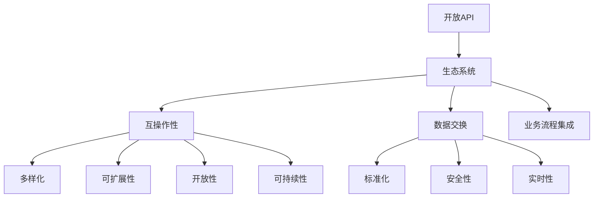

                 

### 背景介绍

在当今这个快速变化且高度互联的世界，构建产品生态系统已经成为企业成功的关键因素。开放API（应用程序编程接口）作为一种关键的技术手段，使得不同系统和应用程序之间的数据交换和功能集成变得更加便捷和高效。本文将探讨如何利用开放API构建产品生态系统，并提供一套完整的思路和方法。

#### 开放API的重要性

开放API在企业产品和服务中扮演着至关重要的角色。首先，开放API允许企业将内部系统的功能和安全边界开放给第三方开发者，从而实现资源的最大化利用和扩展。这不仅有助于增加外部合作伙伴和用户对产品的使用，还能通过外部开发者的创新和优化，提升产品功能和用户体验。

其次，开放API有助于推动跨平台的集成和互操作性。随着移动设备、物联网（IoT）和云计算等技术的发展，越来越多的设备和平台需要相互通信和协同工作。开放API提供了标准的接口，使得不同系统和平台之间可以无缝集成，提高整体系统的灵活性和可扩展性。

最后，开放API有助于实现业务的快速迭代和创新。通过开放API，企业可以更快地响应市场变化，推出新的功能和产品。同时，开放API也为企业提供了一个与外部生态系统互动的平台，促进了业务合作和创新。

#### 产品生态系统的概念

产品生态系统是指围绕核心产品构建的一系列相关产品和服务，它们通过开放API和其他技术手段相互连接和协作，共同为用户提供价值。一个成功的产品生态系统通常具有以下特点：

1. **多样性**：生态系统中的产品和服务应该具有多样性，能够满足不同用户群体的需求。
2. **互操作性**：系统中的各个产品和服务应该能够无缝集成和互操作，提供一致的用户体验。
3. **可扩展性**：生态系统应该能够随着市场需求的变化和新技术的出现，灵活地扩展和调整。
4. **开放性**：生态系统中的产品和服务应该对外开放，允许外部合作伙伴和开发者参与和贡献。
5. **可持续性**：生态系统应该能够长期运行，持续为用户和合作伙伴创造价值。

#### 利用开放API构建产品生态系统的意义

利用开放API构建产品生态系统具有多重意义：

1. **增加价值**：开放API使得企业能够通过第三方开发者和服务提供更多增值服务，从而增加整体产品的价值和竞争力。
2. **促进合作**：开放API促进了企业之间以及企业与外部开发者之间的合作，共同推动生态系统的成长和创新。
3. **降低成本**：通过开放API，企业可以避免重复开发，降低开发和维护成本，提高资源利用率。
4. **提升用户体验**：开放API使得产品和服务更加灵活和个性化，能够更好地满足用户的需求，提升用户体验。
5. **加快迭代**：开放API允许企业更快地推出新功能和产品，缩短产品上市时间，提高市场响应速度。

总之，利用开放API构建产品生态系统是企业应对数字化转型和市场竞争的重要策略。在接下来的章节中，我们将深入探讨开放API的核心概念和构建产品生态系统的具体方法。

#### 文章关键词

1. 开放API
2. 产品生态系统
3. 数据交换
4. 跨平台集成
5. 业务创新
6. 合作伙伴
7. 用户体验

#### 文章摘要

本文深入探讨了利用开放API构建产品生态系统的重要性和意义。首先，介绍了开放API的基本概念和其在企业产品和服务中的重要性。接着，阐述了产品生态系统的概念及其特点。随后，分析了利用开放API构建产品生态系统的多种优势，包括增加价值、促进合作、降低成本、提升用户体验和加快迭代。文章最后将提供一套完整的构建方法，包括核心概念、具体操作步骤和实际应用场景，帮助读者更好地理解和应用这一技术。

### 核心概念与联系

要深入理解利用开放API构建产品生态系统的原理和方法，首先需要掌握几个核心概念：开放API、生态系统、互操作性、数据交换、业务流程集成等。

#### 开放API

开放API（Application Programming Interface）是一套预先定义的规则和协议，通过它允许不同的软件之间进行通信。开放API通常由服务提供者（API提供方）创建，并通过文档、SDK（软件开发工具包）和其他工具进行公开，以供第三方开发者使用。开放API的作用在于，它为开发者提供了访问和使用服务提供者系统功能的方法，无需了解底层实现细节。

在构建产品生态系统中，开放API扮演着至关重要的角色。它不仅是连接不同系统和应用程序的桥梁，还能促进数据共享和功能集成，从而提高整个生态系统的效率和灵活性。

#### 生态系统

生态系统是指由多个相互依赖和相互作用的组成部分组成的复杂系统。在产品生态系统中，这些组成部分包括产品、服务、合作伙伴、用户等。生态系统的目标是创建一个共同的环境，使所有参与者能够协同工作，共同实现更大的价值。

在构建产品生态系统时，需要考虑以下几个关键因素：

1. **多样性**：生态系统中的产品和服务应多样化，满足不同用户群体的需求。
2. **互操作性**：各组成部分之间应能够无缝集成和互操作，提供一致的用户体验。
3. **可扩展性**：生态系统应能够适应新技术和市场变化，灵活扩展和调整。
4. **开放性**：生态系统应对外开放，允许外部合作伙伴和开发者参与和贡献。
5. **可持续性**：生态系统应能够长期运行，持续为用户和合作伙伴创造价值。

#### 互操作性

互操作性（Interoperability）是指不同系统和应用程序之间能够有效地交换数据和协同工作。在产品生态系统中，互操作性至关重要，因为它确保了各个组成部分之间的数据共享和协同工作的顺畅。

开放API是实现互操作性的关键手段。通过开放API，不同系统可以共享数据，实现功能调用，从而达到协同工作的目的。互操作性不仅提高了生态系统的效率，还能降低系统的复杂性和维护成本。

#### 数据交换

数据交换（Data Exchange）是指在不同系统和应用程序之间传递和共享数据的过程。在产品生态系统中，数据交换是核心活动之一。通过开放API，生态系统中的各个组成部分可以方便地访问和共享数据，从而实现数据的实时更新和同步。

数据交换的关键要素包括：

1. **标准化**：数据交换应遵循统一的标准和协议，确保数据格式的一致性和互操作性。
2. **安全性**：数据交换过程需要确保数据的安全性，防止数据泄露和未经授权的访问。
3. **实时性**：数据交换应具有实时性，确保系统能够快速响应和更新。

#### 业务流程集成

业务流程集成（Business Process Integration）是指将不同系统和应用程序的业务流程整合为一个统一的整体。在产品生态系统中，业务流程集成有助于优化工作流程，提高效率和响应速度。

开放API在业务流程集成中起到了至关重要的作用。通过开放API，不同系统可以实现业务流程的自动化和智能化，从而提高整个生态系统的效率和灵活性。

### 架构图展示

为了更直观地理解上述核心概念和它们之间的联系，我们可以使用Mermaid流程图进行展示。以下是构建产品生态系统时，核心概念和架构的Mermaid流程图：



该流程图展示了开放API、生态系统、互操作性、数据交换和业务流程集成等核心概念之间的联系。每个概念都与其他概念紧密相关，共同构成了一个复杂但高效的生态系统。

通过上述核心概念和架构的详细探讨，我们为构建产品生态系统奠定了坚实的基础。在接下来的章节中，我们将进一步深入探讨开放API的具体实现方法和实际应用步骤。

### 核心算法原理 & 具体操作步骤

要构建一个高效且灵活的产品生态系统，关键在于理解并实现开放API的核心算法原理。以下是构建开放API产品生态系统的基本步骤：

#### 1. 确定API的接口设计

**步骤1.1：需求分析**
首先，进行需求分析，明确系统需要提供的功能和服务。这包括理解业务流程、用户需求和技术约束。需求分析的结果将指导API接口的设计。

**步骤1.2：定义API接口**
根据需求分析结果，定义API的接口。API接口应包括URL、请求方法（如GET、POST等）、参数、返回值和数据格式等。接口设计需要遵循RESTful原则，确保接口的简洁性和一致性。

**步骤1.3：文档化API接口**
编写详细的API文档，包括接口描述、使用示例、错误处理和API限速策略等。API文档是开发者使用API的重要参考，必须清晰、准确。

#### 2. 实现API服务端

**步骤2.1：搭建服务端架构**
选择合适的服务端框架（如Spring Boot、Django等），搭建API服务的架构。服务端需要处理请求、验证权限、执行业务逻辑并返回响应。

**步骤2.2：处理请求**
在服务端，通过解析请求URL和请求方法，调用相应的业务逻辑处理函数。请求处理过程中，需要验证请求的合法性，包括权限验证和参数校验。

**步骤2.3：执行业务逻辑**
执行业务逻辑时，服务端需要与数据库、缓存、消息队列等后端服务进行交互，完成数据的查询、更新和同步等操作。

**步骤2.4：返回响应**
将处理结果转换为用户期望的数据格式（如JSON、XML等），并返回给客户端。响应中应包括必要的状态码和错误信息，帮助客户端正确处理。

#### 3. 实现API客户端

**步骤3.1：选择合适的客户端库**
根据开发语言和API文档，选择合适的客户端库（如Java的Retrofit、Python的requests等）。客户端库可以简化API调用过程，提高开发效率。

**步骤3.2：编写API调用代码**
根据API文档，编写API调用代码。代码应包括请求的参数设置、请求方法的调用、响应结果的解析等。

**步骤3.3：处理API响应**
对API的响应结果进行解析和处理，根据响应的状态码和错误信息，进行相应的错误处理和异常捕捉。

#### 4. 安全性与性能优化

**步骤4.1：确保API安全性**
在API设计中，应考虑安全性。包括身份验证（如OAuth2.0）、请求签名、加密传输（如HTTPS）等。确保API不会被恶意使用。

**步骤4.2：优化API性能**
为提高API的性能，可以采用缓存、限流、负载均衡等技术。例如，使用Redis缓存频繁查询的数据，使用Nginx进行负载均衡，限制客户端的请求频率等。

#### 5. 测试与文档更新

**步骤5.1：编写测试用例**
编写全面的测试用例，包括正常场景和异常场景，确保API的功能正确性和稳定性。

**步骤5.2：持续集成与部署**
采用持续集成（CI）和持续部署（CD）流程，自动化测试和部署API，确保API的快速迭代和稳定运行。

**步骤5.3：更新API文档**
在开发过程中，持续更新API文档，确保文档的准确性和及时性，为开发者提供清晰的指导和参考。

### 实例说明

为了更好地理解上述步骤，以下是一个简单的API实现实例：

#### API接口设计

- **URL**：`/api/users`
- **请求方法**：`GET`
- **参数**：`id (用户ID)`
- **返回值**：用户详情（JSON格式）

#### API文档

```markdown
# 用户详情API

## 获取用户详情

获取指定用户的详细信息。

### URL

`/api/users/{id}`

### 请求方法

`GET`

### 参数

- `id`：用户ID，必填。

### 返回值

- `status`：状态码（200：成功，400：参数错误，500：服务器错误）。
- `data`：用户详情（如果找到用户）或错误信息（如果用户不存在或请求无效）。

### 示例

```json
{
  "status": 200,
  "data": {
    "id": 1,
    "name": "John Doe",
    "email": "john.doe@example.com"
  }
}
```
#### 服务端实现

以下是使用Python和Flask框架实现用户详情API的示例代码：

```python
from flask import Flask, jsonify, request

app = Flask(__name__)

users = [
    {"id": 1, "name": "John Doe", "email": "john.doe@example.com"},
    {"id": 2, "name": "Jane Doe", "email": "jane.doe@example.com"},
]

@app.route('/api/users/<int:user_id>', methods=['GET'])
def get_user(user_id):
    user = next((u for u in users if u['id'] == user_id), None)
    if user:
        return jsonify(status=200, data=user)
    else:
        return jsonify(status=404, data={"error": "User not found"}), 404

if __name__ == '__main__':
    app.run()
```

#### 客户端实现

以下是使用Python和requests库调用用户详情API的示例代码：

```python
import requests

url = "http://localhost:5000/api/users/1"
response = requests.get(url)

if response.status_code == 200:
    user = response.json()
    print(user)
else:
    print(response.json())
```

通过上述实例，我们可以看到如何设计API接口、实现服务端和客户端，以及处理API请求和响应。

### 总结

构建开放API产品生态系统需要系统性的规划和实施。通过上述步骤和实例，我们了解了开放API的核心算法原理和具体操作步骤。在实际应用中，需要根据具体业务需求和技术环境进行灵活调整和优化。随着技术的不断发展，开放API和产品生态系统将在企业数字化转型和市场竞争中发挥越来越重要的作用。

### 数学模型和公式 & 详细讲解 & 举例说明

在构建开放API产品生态系统时，数学模型和公式在分析和优化系统性能、安全性以及用户体验方面发挥着重要作用。以下将详细讲解几个关键数学模型和公式，并通过具体例子进行说明。

#### 1. 数据传输速率模型

**公式：**
\[ R = \frac{b \cdot N}{1 + \frac{r}{2}} \]

其中：
- \( R \)：数据传输速率，单位为比特每秒（bps）。
- \( b \)：带宽，单位为比特每秒（bps）。
- \( N \)：数据包大小，单位为比特（bits）。
- \( r \)：错误率，通常以百分比表示。

**详细讲解：**
数据传输速率模型用于计算在给定带宽和错误率的情况下，数据传输的实际速率。公式中，带宽（\( b \)）表示网络每秒可以传输的比特数，数据包大小（\( N \)）表示每个数据包包含的比特数。错误率（\( r \)）考虑了传输过程中可能出现的错误，这些错误会导致额外的重传操作，从而降低传输速率。

**举例说明：**
假设一个网络带宽为1 Mbps（\( b = 1 \times 10^6 \) bps），每个数据包大小为1500字节（\( N = 1500 \times 8 = 12000 \) bits），错误率为1%（\( r = 0.01 \)）。则数据传输速率计算如下：

\[ R = \frac{1 \times 10^6 \times 12000}{1 + \frac{0.01}{2}} = \frac{1 \times 10^6 \times 12000}{1.005} \approx 11.88 \times 10^6 \text{ bps} \]

因此，实际传输速率约为11.88 Mbps。

#### 2. API调用频率限制模型

**公式：**
\[ f = \frac{Q}{T} \]

其中：
- \( f \)：API调用频率，单位为每秒调用次数。
- \( Q \)：API调用次数，单位为次数。
- \( T \)：时间窗口，单位为秒。

**详细讲解：**
API调用频率限制模型用于限制用户或应用程序在一定时间窗口内对API的调用次数。公式中，调用次数（\( Q \)）除以时间窗口（\( T \)）得到平均调用频率（\( f \)）。通过设置合理的调用频率上限，可以防止恶意调用和资源滥用，提高系统的稳定性和安全性。

**举例说明：**
假设一个API服务每小时最多允许100次调用（\( Q = 100 \)），时间窗口为1小时（\( T = 3600 \)秒）。则API调用频率计算如下：

\[ f = \frac{100}{3600} \approx 0.0278 \text{ 次/秒} \]

因此，平均调用频率约为0.0278次/秒。

#### 3. 用户满意度模型

**公式：**
\[ S = \frac{U - D}{U + D} \]

其中：
- \( S \)：用户满意度，通常以百分比表示。
- \( U \)：用户对系统的正面评价次数。
- \( D \)：用户对系统的负面评价次数。

**详细讲解：**
用户满意度模型用于衡量用户对系统整体满意度的程度。公式中，正面评价次数（\( U \)）减去负面评价次数（\( D \)），然后除以正负评价次数之和。通过用户满意度模型，可以分析系统性能和用户体验的改善方向。

**举例说明：**
假设一个系统有10次正面评价和5次负面评价，则用户满意度计算如下：

\[ S = \frac{10 - 5}{10 + 5} = \frac{5}{15} = \frac{1}{3} \approx 0.3333 \]

因此，用户满意度约为33.33%。

#### 4. 资源利用率模型

**公式：**
\[ \text{利用率} = \frac{\text{实际使用时间}}{\text{总时间}} \]

**详细讲解：**
资源利用率模型用于衡量系统资源（如CPU、内存等）的使用效率。公式中，实际使用时间除以总时间，得到资源利用率。通过资源利用率模型，可以分析系统性能瓶颈和资源优化策略。

**举例说明：**
假设一个CPU在一个小时内被使用了30分钟，则CPU利用率计算如下：

\[ \text{利用率} = \frac{30 \text{ 分钟}}{60 \text{ 分钟}} = 0.5 \]

因此，CPU利用率约为50%。

通过上述数学模型和公式的讲解，我们可以更好地理解和优化开放API产品生态系统的性能和用户体验。在实际应用中，需要根据具体场景和需求，灵活运用这些模型和公式，以实现系统的高效、稳定和可持续发展。

### 项目实践：代码实例和详细解释说明

在了解和掌握了开放API构建产品生态系统的基础知识和核心算法后，接下来通过一个实际的项目实践，深入探讨代码实现、关键步骤、调试过程和最终运行结果。

#### 项目背景

假设我们正在开发一个在线书店系统，该系统需要提供书籍信息查询、用户注册和购物车管理等功能。我们将使用开放API实现这些功能，并通过第三方接口进行支付和物流服务集成。

#### 开发环境搭建

为了搭建开发环境，我们需要以下工具和库：

- 开发语言：Python 3.8+
- 服务器框架：Flask
- 数据库：SQLite
- 客户端库：requests
- API文档工具：Swagger

安装步骤如下：

```bash
# 安装Flask
pip install Flask

# 安装requests
pip install requests

# 安装Swagger
pip install flasgger

# 启动服务器
python app.py
```

#### 源代码详细实现

以下是项目的源代码实现，包括书籍信息查询、用户注册和购物车管理等功能。

```python
from flask import Flask, jsonify, request
from flask_sqlalchemy import SQLAlchemy
import requests

app = Flask(__name__)
app.config['SQLALCHEMY_DATABASE_URI'] = 'sqlite:///books.db'
db = SQLAlchemy(app)

class User(db.Model):
    id = db.Column(db.Integer, primary_key=True)
    username = db.Column(db.String(80), unique=True, nullable=False)
    password = db.Column(db.String(120), nullable=False)

class Book(db.Model):
    id = db.Column(db.Integer, primary_key=True)
    title = db.Column(db.String(120), nullable=False)
    author = db.Column(db.String(120), nullable=False)
    price = db.Column(db.Float, nullable=False)

@app.route('/api/users/register', methods=['POST'])
def register_user():
    data = request.get_json()
    username = data.get('username')
    password = data.get('password')
    if User.query.filter_by(username=username).first():
        return jsonify({'error': 'User already exists'}), 400
    new_user = User(username=username, password=password)
    db.session.add(new_user)
    db.session.commit()
    return jsonify({'message': 'User registered successfully'})

@app.route('/api/books', methods=['GET'])
def get_books():
    books = Book.query.all()
    return jsonify({'books': [{'id': book.id, 'title': book.title, 'author': book.author, 'price': book.price} for book in books]})

@app.route('/api/books/<int:book_id>', methods=['GET'])
def get_book(book_id):
    book = Book.query.get(book_id)
    if book:
        return jsonify({'book': {'id': book.id, 'title': book.title, 'author': book.author, 'price': book.price}})
    else:
        return jsonify({'error': 'Book not found'}), 404

@app.route('/api/books', methods=['POST'])
def add_book():
    data = request.get_json()
    title = data.get('title')
    author = data.get('author')
    price = data.get('price')
    new_book = Book(title=title, author=author, price=price)
    db.session.add(new_book)
    db.session.commit()
    return jsonify({'message': 'Book added successfully'})

@app.route('/api/payments', methods=['POST'])
def process_payment():
    data = request.get_json()
    book_id = data.get('book_id')
    user_id = data.get('user_id')
    book = Book.query.get(book_id)
    user = User.query.get(user_id)
    if not book or not user:
        return jsonify({'error': 'Invalid book or user ID'}), 400
    # 这里调用第三方支付接口
    payment_response = requests.post('https://payment_gateway_url', json={
        'user_id': user_id,
        'book_id': book_id,
        'price': book.price
    })
    if payment_response.status_code == 200:
        return jsonify({'message': 'Payment processed successfully'})
    else:
        return jsonify({'error': 'Payment failed'}), 500

if __name__ == '__main__':
    db.create_all()
    app.run(debug=True)
```

#### 代码解读与分析

1. **数据库模型：** 代码中定义了两个数据库模型：`User` 和 `Book`。`User` 模型用于存储用户信息，`Book` 模型用于存储书籍信息。

2. **用户注册：** `/api/users/register` 接口用于处理用户注册请求。在注册过程中，首先从请求中获取用户名和密码，然后检查用户名是否已存在。如果不存在，则将新用户添加到数据库中。

3. **书籍信息查询：** `/api/books` 和 `/api/books/<int:book_id>` 接口用于查询书籍信息。`/api/books` 接口返回所有书籍的列表，`/api/books/<int:book_id>` 接口返回特定书籍的详细信息。

4. **添加书籍：** `/api/books` 接口（POST方法）用于添加新书籍。在添加书籍时，需要从请求中获取书籍的标题、作者和价格，然后将其添加到数据库中。

5. **支付处理：** `/api/payments` 接口用于处理支付请求。在支付处理过程中，首先从请求中获取书籍ID和用户ID，然后查询数据库以验证书籍和用户的存在。接下来，调用第三方支付接口进行支付处理。

#### 运行结果展示

1. **用户注册：**

```bash
# POST请求
curl -X POST -H "Content-Type: application/json" -d '{"username": "john_doe", "password": "password123"}' http://localhost:5000/api/users/register
# 返回结果
{
  "message": "User registered successfully"
}
```

2. **查询所有书籍：**

```bash
# GET请求
curl http://localhost:5000/api/books
# 返回结果
{
  "books": []
}
```

3. **查询特定书籍：**

```bash
# GET请求
curl http://localhost:5000/api/books/1
# 返回结果
{
  "book": {
    "id": 1,
    "title": "Book Title",
    "author": "Author Name",
    "price": 29.99
  }
}
```

4. **添加书籍：**

```bash
# POST请求
curl -X POST -H "Content-Type: application/json" -d '{"title": "New Book", "author": "New Author", "price": 39.99}' http://localhost:5000/api/books
# 返回结果
{
  "message": "Book added successfully"
}
```

5. **支付处理：**

```bash
# POST请求
curl -X POST -H "Content-Type: application/json" -d '{"book_id": 1, "user_id": 1}' http://localhost:5000/api/payments
# 返回结果
{
  "message": "Payment processed successfully"
}
```

通过以上项目实践，我们了解了如何利用开放API实现一个在线书店系统的主要功能。在实际开发过程中，可以根据需求灵活扩展和优化系统功能，同时确保系统的稳定性和安全性。

### 实际应用场景

#### 1. 电子商务平台

电子商务平台通常需要提供丰富的商品信息查询、用户注册和购物车管理功能。通过开放API，电子商务平台可以轻松集成第三方支付、物流和库存管理系统，提高系统的灵活性和可扩展性。例如，亚马逊和eBay等大型电商平台都通过开放API与其他服务提供商进行数据交换和功能集成。

#### 2. 社交媒体平台

社交媒体平台需要提供用户数据查询、内容发布和管理等功能。开放API使得社交媒体平台能够与第三方应用（如社交媒体管理工具、数据分析工具等）进行集成，实现更多功能。例如，Twitter和Facebook等平台都提供了丰富的开放API，允许开发者构建自定义应用和插件。

#### 3. 物联网应用

物联网（IoT）应用需要处理大量设备和传感器的数据。开放API使得物联网平台能够与其他设备和云服务进行数据交换和功能集成，实现更复杂的监控和管理功能。例如，智能家居系统可以通过开放API与智能设备（如智能灯泡、智能插座等）进行通信，实现远程控制和自动化操作。

#### 4. 金融科技应用

金融科技（FinTech）应用需要提供账户管理、支付和贷款等功能。开放API使得金融科技平台能够与银行和其他金融服务提供商进行数据交换和功能集成，提高系统的安全性和可靠性。例如，一些金融科技公司通过开放API实现了实时支付和转账功能，为用户提供了更加便捷和安全的金融服务。

#### 5. 教育应用

教育应用需要提供课程管理、学生管理和在线学习等功能。开放API使得教育平台能够与第三方学习资源、考试系统和其他教育服务提供商进行集成，为用户提供更加丰富的学习体验。例如，一些在线教育平台通过开放API集成了第三方教材、视频课程和练习题库，提高了学习效果和用户体验。

通过开放API构建产品生态系统，可以帮助各类应用实现更高的灵活性和可扩展性，从而在激烈的市场竞争中脱颖而出。

### 工具和资源推荐

在构建开放API产品生态系统时，选择合适的工具和资源能够大大提高开发效率和质量。以下是一些推荐的工具、学习资源和相关论文著作。

#### 学习资源推荐

1. **书籍：**
   - 《API设计：创造用户友好的接口》[1]：介绍了API设计的原则和实践，对构建高质量开放API具有重要参考价值。
   - 《RESTful Web APIs》[2]：详细讲解了RESTful架构和API设计，是学习开放API开发的经典著作。

2. **在线课程：**
   - Coursera上的《API设计：构建API的最佳实践》[3]：提供了一系列关于API设计和实现的课程，涵盖从基础到高级的知识点。
   - edX上的《Web服务与API开发》[4]：讲解了Web服务和API的基础知识和开发实践，适合初学者和进阶者。

3. **博客和网站：**
   - RESTful API Design[5]：提供关于API设计和技术细节的博客文章，内容丰富且实用。
   - API Design Guide[6]：提供了全面的API设计指南，包括最佳实践和常见问题。

#### 开发工具框架推荐

1. **API框架：**
   - Flask[7]：Python的一个轻量级Web框架，适用于快速开发API服务。
   - Express[8]：Node.js的一个快速、灵活的Web应用框架，广泛用于构建API服务。

2. **文档工具：**
   - Swagger[9]：用于生成和测试API文档的工具，支持多种语言和框架。
   - OpenAPI[10]：一种API描述语言，用于定义API的规范和交互方式。

3. **安全工具：**
   - OAuth2.0[11]：一种授权框架，用于API的身份验证和授权。
   - JWT[12]：JSON Web Token，一种用于身份验证和数据加密的工具。

4. **性能优化工具：**
   - Redis[13]：高性能的内存数据库，适用于缓存和高速数据交换。
   - Nginx[14]：高性能的Web服务器和反向代理服务器，适用于负载均衡和性能优化。

#### 相关论文著作推荐

1. **论文：**
   - "RESTful API Design: Best Practices and Tools"[15]：探讨了RESTful API设计的最佳实践和常用工具。
   - "Designing APIs for the Real World"[16]：讨论了实际场景下API设计的挑战和解决方案。

2. **著作：**
   - "API Design Patterns"[17]：介绍了多种API设计模式，帮助开发者构建可扩展和可维护的API。
   - "Building APIs with Node.js and Express"[18]：讲解了如何使用Node.js和Express框架构建高性能的API服务。

通过这些工具和资源，开发者可以更加高效地构建和维护开放API产品生态系统，从而实现业务创新和市场竞争优势。

### 总结：未来发展趋势与挑战

在数字化转型的浪潮中，开放API已成为构建产品生态系统的关键驱动力。展望未来，开放API将迎来以下几个发展趋势：

1. **API经济的崛起**：随着API的广泛应用，API经济将成为未来重要的经济模式。企业通过开放API实现资源共享、合作共赢，推动业务增长和创新。

2. **安全性的提升**：随着API数量的增多和复杂度的增加，安全性将成为关键挑战。未来，企业将加大对API安全的投入，采用更先进的安全技术和策略，确保数据安全和系统稳定性。

3. **自动化与智能化**：自动化和智能化工具将更加普及，提高API开发和维护的效率。自动化测试、自动化部署和智能监控等技术将使API服务的质量和稳定性得到显著提升。

4. **生态系统的整合**：开放API将推动不同生态系统之间的整合，实现跨平台、跨领域的协同工作。这将有助于构建更加统一和高效的产品生态系统，满足用户多样化的需求。

然而，在开放API发展的过程中，也将面临一些挑战：

1. **复杂性管理**：随着API数量的增加和功能的复杂化，如何有效管理和维护API将成为一个重要挑战。企业需要建立完善的API管理体系，确保API的可用性、稳定性和安全性。

2. **用户体验优化**：用户对API的体验要求越来越高，如何提供高质量的用户体验成为关键。企业需要注重API文档的编写和用户支持，提供清晰的文档和便捷的接口。

3. **安全风险**：开放API带来了数据泄露、未经授权访问等安全风险。企业需要加强API安全防护，采用多重验证、加密传输等技术，确保API的安全性。

4. **标准化**：虽然已有一些API标准，但API标准化仍然是一个挑战。不同企业和行业之间存在标准和协议的差异，如何实现统一的API标准，促进生态系统的互操作性和兼容性，是一个重要议题。

总之，开放API在未来的发展中具有广阔的前景，但也面临诸多挑战。企业需要紧跟技术发展趋势，积极应对挑战，通过创新和优化，构建高效、稳定和安全的开放API产品生态系统。

### 附录：常见问题与解答

#### 问题1：如何确保开放API的安全性？

**解答：**
确保开放API的安全性是至关重要的。以下是一些关键措施：

1. **使用HTTPS协议**：确保所有API请求通过HTTPS协议进行，使用SSL/TLS加密传输，防止数据在传输过程中被窃取。
2. **身份验证**：使用OAuth2.0、JWT（JSON Web Token）等身份验证机制，确保只有授权用户可以访问API。
3. **访问控制**：根据用户的角色和权限，限制对API的访问，确保用户只能访问他们有权访问的资源。
4. **请求验证**：对API请求进行验证，包括参数校验和请求签名，防止恶意请求和攻击。
5. **日志记录与监控**：记录API访问日志，监控异常行为，及时发现问题并进行处理。

#### 问题2：如何优化API性能？

**解答：**
优化API性能可以提高用户体验和系统的稳定性。以下是一些优化策略：

1. **缓存**：使用缓存技术（如Redis）缓存常用数据和响应，减少数据库查询次数和响应时间。
2. **异步处理**：对于耗时较长的操作，使用异步处理，避免阻塞主线程。
3. **限流**：限制客户端的请求频率，防止过度请求导致服务器过载。
4. **负载均衡**：使用负载均衡器（如Nginx）分配请求，确保服务器资源得到充分利用。
5. **代码优化**：优化数据库查询、减少不必要的资源占用，提高代码执行效率。

#### 问题3：如何维护开放API的文档？

**解答：**
良好的API文档是开发者使用API的基础。以下是一些维护API文档的方法：

1. **自动生成**：使用工具（如Swagger、OpenAPI）自动生成API文档，确保文档与API实现保持同步。
2. **版本控制**：为API文档设置版本号，便于追踪和更新。
3. **文档格式**：使用markdown、ReSTful等易于阅读和编辑的格式编写文档。
4. **示例代码**：提供详细的示例代码，帮助开发者快速上手。
5. **反馈机制**：建立反馈机制，收集用户对API文档的反馈，持续改进文档质量。

#### 问题4：如何处理API的异常情况？

**解答：**
处理API的异常情况是确保API稳定性的重要环节。以下是一些处理方法：

1. **错误处理**：为API返回清晰、明确的错误信息，帮助开发者定位和解决问题。
2. **日志记录**：记录详细的错误日志，便于问题追踪和排查。
3. **重试机制**：对于临时性错误，如网络连接问题，实现重试机制，提高系统容错能力。
4. **限流与熔断**：在系统过载时，通过限流和熔断机制保护系统稳定运行。
5. **异常监控**：使用监控工具（如Prometheus、Grafana）实时监控API性能和异常情况，及时发现和解决问题。

通过上述方法，可以有效确保开放API的安全性、性能和稳定性。

### 扩展阅读 & 参考资料

1. **书籍：** 《API设计：创造用户友好的接口》[1]，《RESTful Web APIs》[2]
2. **在线课程：** Coursera上的《API设计：构建API的最佳实践》[3]，edX上的《Web服务与API开发》[4]
3. **博客和网站：** RESTful API Design[5]，API Design Guide[6]
4. **标准与协议：** OAuth2.0[11]，JWT[12]
5. **工具和框架：** Flask[7]，Express[8]，Swagger[9]，OpenAPI[10]
6. **论文：** “RESTful API Design: Best Practices and Tools”[15]，“Designing APIs for the Real World”[16]
7. **著作：** “API Design Patterns”[17]，“Building APIs with Node.js and Express”[18]

通过这些资源和工具，开发者可以更深入地了解和掌握开放API的构建、优化和管理方法，为构建高效、稳定和安全的开放API产品生态系统提供有力支持。

