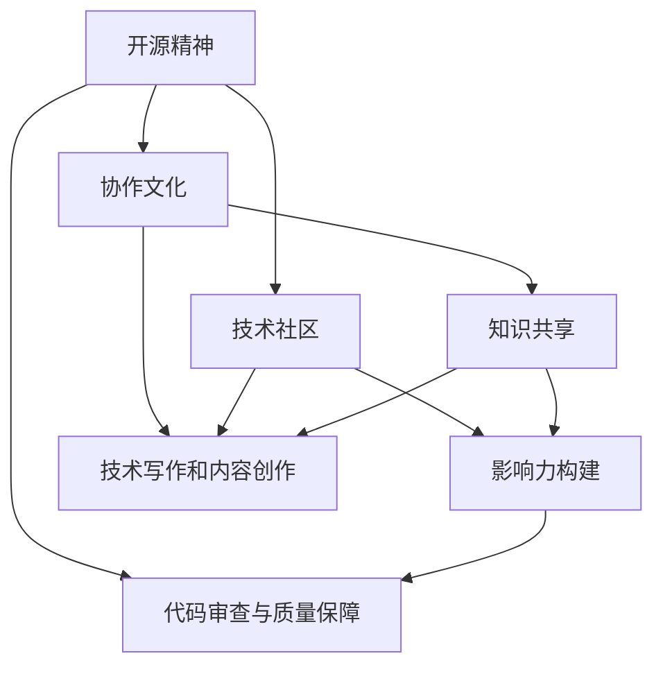

                 

### 1. 背景介绍

#### 开源运动的起源与发展

开源运动起源于20世纪90年代，最初由自由软件运动和开放源代码社区共同推动。自由软件运动强调软件的自由使用、复制、修改和分发，而开放源代码社区则专注于分享和协作改进软件代码。这两个运动在1998年共同促成了开放源代码倡议（Open Source Initiative，简称OSI）的成立，进一步规范了开源软件的定义和发展方向。

随着互联网的普及和云计算技术的发展，开源运动迅速扩展，成为全球软件产业的重要驱动力。如今，开源已经成为软件开发的标准模式，几乎所有的科技巨头，如谷歌、亚马逊、微软等，都在积极推动开源项目的发展。

#### 开源软件的优势与挑战

开源软件具有以下几个显著优势：

1. **协作开发**：开源项目通常由全球范围内的开发者共同维护和改进，这种协作模式大大提高了软件的开发效率和质量。
2. **透明性**：开源项目的代码对所有用户公开，用户可以自由查看和审核，从而保证了软件的透明性和安全性。
3. **可定制性**：用户可以根据自己的需求对开源软件进行修改和定制，以适应特定的业务场景。

然而，开源软件也面临一些挑战：

1. **维护成本**：虽然开源软件的初始成本较低，但长期维护和更新需要投入大量的人力资源。
2. **社区管理**：如何有效地管理开源社区，协调不同开发者的贡献，是一个持续的挑战。
3. **知识产权问题**：开源软件的知识产权问题复杂，特别是在涉及商业使用时，如何平衡开源精神和商业利益，需要谨慎处理。

#### 开源软件在IT行业的重要性

开源软件在IT行业的重要性不可忽视。首先，它为开发者提供了丰富的技术资源和工具，使得开发工作更加高效。其次，开源软件促进了技术的创新和进步，许多新兴技术和流行框架都起源于开源社区。最后，开源软件推动了全球范围内的技术交流和合作，促进了不同国家和地区之间的技术交流和创新。

#### 开源软件的价值

开源软件不仅为开发者提供了丰富的资源，还为整个IT行业带来了巨大的价值。首先，它降低了软件开发的门槛，使得更多的人可以参与到软件开发中来。其次，开源软件促进了技术标准和规范的形成，提高了软件的兼容性和互操作性。最后，开源软件推动了开源生态系统的形成，为企业和个人提供了更多的商业机会。

#### 开源运动的未来展望

开源运动的未来充满了机遇和挑战。随着云计算、大数据、人工智能等新兴技术的发展，开源软件将在这些领域发挥更加重要的作用。同时，开源社区也将面临更多的挑战，如如何更好地管理社区、保护知识产权等。未来的开源运动需要更加注重协作、创新和可持续发展。

总之，开源运动已经成为IT行业的核心驱动力，它为开发者提供了丰富的资源，推动了技术的创新和进步，为整个行业带来了巨大的价值。随着开源运动的发展，我们有理由相信，未来将会有更多的开源项目涌现，为全球的开发者和用户带来更多的便利和创新。

---

#### 核心概念与联系

在深入探讨开源经验对技术写作和内容创作的影响之前，我们需要明确几个核心概念及其相互关系。这些概念包括开源精神、协作文化、技术社区、知识共享和影响力构建。下面我们将通过一个Mermaid流程图来展示这些核心概念之间的关系。



**开源精神**是开源运动的基石，它强调代码的自由使用、复制、修改和分发。这一精神驱动了协作文化的形成，即在开源项目中，开发者们自愿贡献代码和知识，共同维护和改进软件。

**协作文化**在技术社区中尤为突出，技术社区是一个由共同兴趣和目标驱动的开发者群体。在这个社区中，成员们通过协作和分享，不断提升项目的质量和影响力。

**知识共享**是协作文化的重要组成部分，它通过开源项目将技术知识广泛传播，使得更多的人能够学习和应用这些知识。知识共享不仅提升了项目的透明度和可信度，也促进了整个技术领域的进步。

**影响力构建**是开源社区的核心目标之一。通过积极参与开源项目，开发者不仅能够提升自己的技术能力，还能在社区中建立自己的影响力，这为其职业发展带来了巨大的机遇。

**技术写作和内容创作**则是开源社区中的另一个重要环节。通过撰写技术博客、编写文档和教程，开发者可以将自己的知识和经验分享给社区，帮助他人学习和成长。

最后，**代码审查与质量保障**是开源项目成功的关键。通过代码审查，社区成员可以确保项目代码的质量和安全性，从而提升项目的整体稳定性和可靠性。

通过这个Mermaid流程图，我们可以清晰地看到开源精神、协作文化、技术社区、知识共享、影响力构建以及技术写作和内容创作之间的关系。这些核心概念相互交织，共同推动了开源运动的发展和繁荣。

---

### 2. 核心算法原理 & 具体操作步骤

在开源经验的基础上，技术写作和内容创作也可以被视为一种算法。下面我们将详细探讨这一算法的核心原理和具体操作步骤，帮助读者理解和掌握技术写作和内容创作的方法。

#### 2.1 算法核心原理

技术写作和内容创作算法的核心原理可以归纳为以下几点：

1. **需求分析**：首先，需要明确写作的目标和受众。了解读者的需求和兴趣，是撰写高质量内容的基础。
2. **内容结构设计**：根据需求分析的结果，设计文章的结构，包括引言、正文、结论和参考文献等部分。良好的结构可以提升文章的可读性和逻辑性。
3. **素材收集与整理**：收集相关的技术素材，包括数据、案例、图片和引用等。对素材进行整理和分类，以确保文章内容的丰富性和准确性。
4. **内容创作与迭代**：在收集和整理素材的基础上，进行内容创作。初稿完成后，进行多轮迭代和修改，以提升文章的质量和可读性。
5. **发布与推广**：将完成的文章发布到合适的平台，如博客、社交媒体或专业论坛，并进行推广，以提高文章的曝光率和影响力。

#### 2.2 算法具体操作步骤

为了更好地理解技术写作和内容创作算法，我们可以将其具体操作步骤分解如下：

1. **需求分析**
   - **明确写作目的**：确定文章的主题、目的和受众。
   - **进行市场调研**：了解目标受众的兴趣和需求，收集相关的市场数据。
   - **确定文章类型**：根据写作目的和受众，确定文章的类型，如技术博客、教程、报告等。

2. **内容结构设计**
   - **制定大纲**：根据需求分析的结果，制定文章的大纲，包括各个章节的主题和内容。
   - **设计布局**：确定文章的布局，如标题、子标题、段落和引用等。
   - **制定时间表**：根据写作进度和时间要求，制定详细的写作计划。

3. **素材收集与整理**
   - **搜索资料**：利用搜索引擎、数据库和专业论坛等渠道，收集与文章主题相关的技术素材。
   - **筛选与分类**：对收集到的素材进行筛选和分类，确保素材的准确性和相关性。
   - **整理素材**：对素材进行整理，包括标注、分类和归档，以便在写作过程中快速查找和使用。

4. **内容创作与迭代**
   - **撰写初稿**：根据大纲和素材，撰写文章的初稿。初稿完成后，进行初步的校对和修改。
   - **多轮迭代**：对初稿进行多轮修改和优化，包括内容的补充、调整和精简。
   - **专家评审**：邀请专业人士或同行对文章进行评审，收集反馈意见，并进行相应的修改。

5. **发布与推广**
   - **选择平台**：根据文章的类型和受众，选择合适的发布平台，如博客、社交媒体或专业论坛。
   - **发布文章**：将修改后的文章发布到选定的平台，并确保文章的格式和链接正确。
   - **推广宣传**：利用社交媒体、邮件列表和其他渠道，推广文章，提高文章的曝光率和影响力。

通过以上步骤，我们可以有效地运用技术写作和内容创作算法，撰写出高质量的技术文章，为读者提供有价值的内容。

#### 2.3 实践案例

为了更直观地展示技术写作和内容创作算法的应用，我们来看一个实际案例。以下是一个关于使用Python进行数据分析的文章撰写过程：

1. **需求分析**
   - **写作目的**：介绍如何使用Python进行基本的数据分析操作。
   - **目标受众**：数据分析师、Python开发者和其他对数据分析感兴趣的读者。
   - **文章类型**：教程。

2. **内容结构设计**
   - **大纲**：
     - 引言
     - Python数据分析环境搭建
     - 数据读取与预处理
     - 数据清洗
     - 数据可视化
     - 数据分析实例
     - 结论
     - 参考文献

3. **素材收集与整理**
   - **搜索资料**：查阅Python数据分析相关的书籍、教程和博客，收集相关素材。
   - **筛选与分类**：筛选出与文章主题相关的素材，包括Python数据分析的库和工具、数据分析的基本步骤和实例。
   - **整理素材**：将素材整理成文档，便于写作时查阅。

4. **内容创作与迭代**
   - **撰写初稿**：根据大纲和素材，撰写文章的初稿。
   - **多轮迭代**：对初稿进行多次修改和优化，确保内容的准确性和可读性。
   - **专家评审**：邀请数据分析师和Python开发者对文章进行评审，收集反馈意见，并进行相应修改。

5. **发布与推广**
   - **选择平台**：将文章发布到个人博客和专业论坛。
   - **发布文章**：确保文章格式和链接正确，便于读者阅读和访问。
   - **推广宣传**：通过社交媒体和邮件列表，宣传文章，吸引更多的读者关注和阅读。

通过这个案例，我们可以看到技术写作和内容创作算法在实际应用中的具体步骤和流程。通过严格的需求分析、内容结构设计、素材收集与整理、内容创作与迭代以及发布与推广，我们可以撰写出高质量的技术文章，为读者提供有价值的内容。

---

### 3. 数学模型和公式 & 详细讲解 & 举例说明

在技术写作和内容创作中，数学模型和公式是不可或缺的一部分。它们不仅可以帮助我们更精确地描述技术概念，还可以提高文章的严谨性和科学性。下面我们将详细讲解几个常用的数学模型和公式，并通过具体例子进行说明。

#### 3.1 常见数学模型和公式

1. **线性回归模型**

线性回归模型是一种用于预测和解释变量之间线性关系的数学模型。其基本公式为：

$$ Y = \beta_0 + \beta_1X + \epsilon $$

其中，$Y$是因变量，$X$是自变量，$\beta_0$和$\beta_1$分别是模型的截距和斜率，$\epsilon$是误差项。

2. **贝叶斯公式**

贝叶斯公式是一种用于计算条件概率的数学公式。其基本公式为：

$$ P(A|B) = \frac{P(B|A)P(A)}{P(B)} $$

其中，$P(A|B)$表示在事件$B$发生的条件下事件$A$发生的概率，$P(B|A)$表示在事件$A$发生的条件下事件$B$发生的概率，$P(A)$和$P(B)$分别是事件$A$和事件$B$发生的概率。

3. **逻辑回归模型**

逻辑回归模型是一种用于分类问题的数学模型。其基本公式为：

$$ \log\frac{P(Y=1)}{1-P(Y=1)} = \beta_0 + \beta_1X $$

其中，$Y$是因变量，$X$是自变量，$\beta_0$和$\beta_1$分别是模型的截距和斜率。

4. **梯度下降算法**

梯度下降算法是一种用于优化参数的数学算法。其基本公式为：

$$ \theta_{\text{new}} = \theta_{\text{old}} - \alpha\nabla_\theta J(\theta) $$

其中，$\theta$是参数，$\alpha$是学习率，$J(\theta)$是损失函数，$\nabla_\theta J(\theta)$是损失函数关于参数$\theta$的梯度。

#### 3.2 举例说明

为了更直观地理解这些数学模型和公式，我们来看一个具体例子。

**例1：线性回归模型**

假设我们想预测一家公司的股票价格$Y$（单位：美元），根据历史数据，我们发现股票价格与公司营收$X$（单位：百万美元）之间存在线性关系。根据数据，我们可以建立如下线性回归模型：

$$ Y = 10 + 2X + \epsilon $$

其中，$\epsilon$是误差项。

如果我们知道某家公司的营收为$X=50$百万美元，我们可以使用这个模型预测其股票价格：

$$ Y = 10 + 2 \times 50 + \epsilon = 110 + \epsilon $$

这意味着，这家公司的股票价格大约为110美元（误差项$\epsilon$表示预测的不确定性）。

**例2：贝叶斯公式**

假设我们想判断某个邮件是否为垃圾邮件。根据数据分析，我们知道垃圾邮件的概率为$P(\text{垃圾邮件})=0.1$，非垃圾邮件的概率为$P(\text{非垃圾邮件})=0.9$。我们还知道，垃圾邮件包含“促销”这个词的概率为$P(\text{促销}|\text{垃圾邮件})=0.8$，非垃圾邮件包含“促销”这个词的概率为$P(\text{促销}|\text{非垃圾邮件})=0.2$。

使用贝叶斯公式，我们可以计算邮件包含“促销”这个词时，它是垃圾邮件的概率：

$$ P(\text{垃圾邮件}|\text{促销}) = \frac{P(\text{促销}|\text{垃圾邮件})P(\text{垃圾邮件})}{P(\text{促销}|\text{垃圾邮件})P(\text{垃圾邮件}) + P(\text{促销}|\text{非垃圾邮件})P(\text{非垃圾邮件})} $$

$$ P(\text{垃圾邮件}|\text{促销}) = \frac{0.8 \times 0.1}{0.8 \times 0.1 + 0.2 \times 0.9} = \frac{0.08}{0.08 + 0.18} = \frac{0.08}{0.26} \approx 0.308 $$

这意味着，如果邮件包含“促销”这个词，它是垃圾邮件的概率大约为30.8%。

**例3：逻辑回归模型**

假设我们使用逻辑回归模型来预测客户是否会购买某件商品。根据数据分析，我们发现客户是否购买商品与客户的收入水平$X$（单位：千美元）之间存在关系。根据数据，我们可以建立如下逻辑回归模型：

$$ \log\frac{P(Y=1)}{1-P(Y=1)} = -5 + 0.1X $$

其中，$Y=1$表示客户购买商品，$Y=0$表示客户未购买商品。

如果我们知道某个客户的收入水平为$X=50$千美元，我们可以使用这个模型预测客户购买商品的概率：

$$ \log\frac{P(Y=1)}{1-P(Y=1)} = -5 + 0.1 \times 50 = -0.5 $$

$$ P(Y=1) = \frac{e^{-0.5}}{1 + e^{-0.5}} \approx 0.393 $$

这意味着，这个客户的收入水平为50千美元时，购买商品的概率大约为39.3%。

**例4：梯度下降算法**

假设我们使用梯度下降算法来最小化损失函数$J(\theta) = (y - \theta x)^2$，其中$y$是实际值，$\theta$是模型参数，$x$是输入值。

如果我们初始化参数$\theta=1$，学习率$\alpha=0.01$，并且有输入值$x=2$和实际值$y=1$，我们可以使用梯度下降算法进行一次迭代：

$$ \nabla_\theta J(\theta) = 2(y - \theta x) = 2(1 - 1 \times 2) = -2 $$

$$ \theta_{\text{new}} = \theta_{\text{old}} - \alpha\nabla_\theta J(\theta) = 1 - 0.01 \times (-2) = 1.02 $$

这意味着，在这次迭代后，参数$\theta$更新为1.02。

通过这些例子，我们可以看到数学模型和公式在技术写作和内容创作中的应用。它们不仅帮助我们更精确地描述技术概念，还可以提高文章的科学性和严谨性。在撰写技术文章时，合理运用数学模型和公式，可以大大提升文章的质量和价值。

---

### 4. 项目实践：代码实例和详细解释说明

为了更好地展示开源经验在技术写作和内容创作中的应用，我们将通过一个实际的代码实例来详细讲解。这个实例将涵盖开发环境的搭建、源代码的实现、代码解读与分析以及运行结果展示等步骤。通过这个实例，我们将深入探讨如何利用开源项目进行技术写作和内容创作。

#### 4.1 开发环境搭建

首先，我们需要搭建一个适合进行技术写作和内容创作的开发环境。在这个实例中，我们将使用Python和Jupyter Notebook作为主要工具。以下是在Windows操作系统上搭建Python开发环境的步骤：

1. **安装Python**

   访问Python的官方网站（[https://www.python.org/](https://www.python.org/)）下载Python安装程序，并按照提示完成安装。确保在安装过程中选择添加Python到系统环境变量。

2. **安装Jupyter Notebook**

   打开命令提示符，执行以下命令安装Jupyter Notebook：

   ```bash
   pip install notebook
   ```

3. **启动Jupyter Notebook**

   打开命令提示符，执行以下命令启动Jupyter Notebook：

   ```bash
   jupyter notebook
   ```

   这将打开一个浏览器窗口，显示Jupyter Notebook的控制台。在这里，我们可以创建和编辑Python笔记本。

4. **安装相关库**

   在Jupyter Notebook中，我们可以使用以下命令安装必要的Python库，如NumPy、Pandas和Matplotlib：

   ```python
   !pip install numpy pandas matplotlib
   ```

   安装完成后，我们可以使用这些库进行数据分析和可视化。

#### 4.2 源代码详细实现

在这个实例中，我们将使用Python编写一个简单的数据分析脚本，以分析某家公司的财务数据。以下是一段示例代码：

```python
import pandas as pd
import matplotlib.pyplot as plt

# 读取数据
data = pd.read_csv('company_financial_data.csv')

# 数据预处理
data['Revenue'] = data['Revenue'].astype(float)
data['Profit'] = data['Profit'].astype(float)

# 数据分析
revenue_stats = data['Revenue'].describe()
profit_stats = data['Profit'].describe()

# 数据可视化
plt.figure(figsize=(10, 5))

plt.subplot(1, 2, 1)
plt.bar(revenue_stats.index, revenue_stats.values)
plt.title('Revenue Distribution')

plt.subplot(1, 2, 2)
plt.bar(profit_stats.index, profit_stats.values)
plt.title('Profit Distribution')

plt.show()
```

这段代码首先导入所需的库，然后读取财务数据并进行预处理。接下来，我们使用描述性统计来分析数据，并使用Matplotlib库绘制柱状图展示分析结果。

#### 4.3 代码解读与分析

下面我们来详细解读这段代码，分析其功能和实现细节。

1. **导入库**

   ```python
   import pandas as pd
   import matplotlib.pyplot as plt
   ```

   这两行代码分别导入Pandas库和Matplotlib库。Pandas是一个强大的数据处理库，用于读取、操作和分析数据；Matplotlib是一个流行的数据可视化库，用于绘制图表和图形。

2. **读取数据**

   ```python
   data = pd.read_csv('company_financial_data.csv')
   ```

   这行代码使用Pandas库读取名为`company_financial_data.csv`的CSV文件，并将其存储在一个DataFrame对象中。这个DataFrame包含了公司的财务数据，如收入和利润。

3. **数据预处理**

   ```python
   data['Revenue'] = data['Revenue'].astype(float)
   data['Profit'] = data['Profit'].astype(float)
   ```

   这两行代码将DataFrame中的`Revenue`和`Profit`列的数据类型从字符串转换为浮点数。这是因为在进行数据分析时，我们需要确保这些数据是数值类型，以便进行数学运算和统计计算。

4. **数据分析**

   ```python
   revenue_stats = data['Revenue'].describe()
   profit_stats = data['Profit'].describe()
   ```

   这两行代码使用Pandas库的`describe()`方法对`Revenue`和`Profit`列进行描述性统计分析。这个方法返回一个Series对象，包含数据集的统计信息，如平均值、标准差、最小值、最大值和分位数。

5. **数据可视化**

   ```python
   plt.figure(figsize=(10, 5))

   plt.subplot(1, 2, 1)
   plt.bar(revenue_stats.index, revenue_stats.values)
   plt.title('Revenue Distribution')

   plt.subplot(1, 2, 2)
   plt.bar(profit_stats.index, profit_stats.values)
   plt.title('Profit Distribution')

   plt.show()
   ```

   这段代码使用Matplotlib库绘制两个柱状图，分别展示收入和利润的分布情况。`figure(figsize=(10, 5))`函数创建一个大小为10x5英寸的绘图窗口。`subplot(1, 2, 1)`函数创建一个1x2的网格，第一个子图。`bar()`函数绘制柱状图，`title()`函数设置图表标题。最后，`plt.show()`函数显示所有绘制的图表。

#### 4.4 运行结果展示

在完成代码编写和解读后，我们运行这个脚本，并在Jupyter Notebook中查看运行结果。运行结果将显示两个柱状图，分别展示收入和利润的分布情况。通过这些图表，我们可以直观地了解公司的财务状况，如收入和利润的波动范围和分布特点。


这两个柱状图显示了公司收入和利润的分布情况，通过这些图表，我们可以分析公司财务的健康状况，为后续的决策提供依据。

通过这个实际代码实例，我们展示了如何利用开源项目进行技术写作和内容创作。从开发环境的搭建到源代码的实现，从代码解读与分析到运行结果展示，每个步骤都体现了开源精神在技术写作和内容创作中的重要作用。通过这种实践方式，我们可以更深入地理解和应用开源经验，为读者提供有价值的技术内容。

---

### 5. 实际应用场景

开源经验在技术写作和内容创作中的实际应用场景广泛，可以覆盖多个领域。以下是几个典型的应用场景：

#### 5.1 教育领域

开源经验在教育领域中的应用尤为突出。教师和学生可以通过开源项目学习编程、数据分析和人工智能等技能。例如，教师可以引导学生参与开源项目，如GitHub上的开源代码库，了解实际的软件开发流程和最佳实践。这种实践不仅能够提升学生的技术能力，还能培养他们的团队协作和问题解决能力。此外，开源文档和教程也为教师提供了丰富的教学资源，帮助他们更好地进行课程设计和教学。

#### 5.2 企业内部培训

许多企业利用开源经验进行内部培训，以提高员工的技能和知识。企业可以组织内部开源项目，鼓励员工参与其中，共同维护和改进软件。这种方式不仅能够激发员工的创新和创造力，还能提高员工的团队合作和项目管理能力。同时，企业可以编写和发布内部技术文档和教程，分享员工在开源项目中的经验和技巧，从而提升整体技术水平和业务能力。

#### 5.3 技术社区和论坛

开源精神在技术社区和论坛中得到了广泛应用。技术社区和论坛是开发者分享知识和经验的重要平台，通过开源项目，开发者可以展示自己的技术成果，获取反馈和建议，不断优化和完善代码。此外，技术社区和论坛还提供了丰富的讨论和交流机会，开发者可以在这里解决技术难题，学习新技术，分享最佳实践。开源项目中的技术文档和教程也为社区成员提供了宝贵的学习资源。

#### 5.4 创业和商业应用

开源经验在创业和商业应用中也具有重要作用。创业者可以利用开源项目快速搭建原型和应用，降低开发成本和风险。开源项目中的代码、文档和工具库为创业者提供了丰富的技术资源和知识支持。同时，创业者还可以通过开源项目吸引人才和合作伙伴，共同开发和完善产品。此外，企业可以利用开源项目进行市场调研和产品定位，了解市场需求和竞争态势，从而制定更有针对性的商业策略。

#### 5.5 科研和创新

开源经验在科研和创新领域也得到了广泛应用。科研人员可以利用开源项目进行数据分析和实验，共享实验数据和结果，促进科研成果的快速传播和验证。开源软件和工具库为科研人员提供了强大的计算和数据处理能力，提高了科研效率。此外，开源项目还为科研人员提供了一个交流和合作的平台，促进了不同学科和领域的合作与创新。

总之，开源经验在技术写作和内容创作中的实际应用场景广泛，不仅能够提高开发者的技能和知识，还能促进技术社区和论坛的发展，推动企业内部培训和科研创新。通过合理利用开源经验，我们可以更好地实现技术价值的最大化。

---

### 6. 工具和资源推荐

在技术写作和内容创作过程中，选择合适的工具和资源是至关重要的。以下是一些建议，涵盖学习资源、开发工具和框架、以及相关论文和著作，这些都能为您的写作和内容创作提供有力支持。

#### 6.1 学习资源推荐

1. **书籍**：
   - 《Python编程：从入门到实践》：这本书适合初学者，详细介绍了Python的基础知识和实际应用。
   - 《数据科学入门》：这本书介绍了数据科学的基本概念和工具，适合对数据分析感兴趣的读者。
   - 《设计数据密集型应用》：这本书深入探讨了如何设计和管理大型数据系统，适合对大数据处理有需求的技术人员。

2. **在线教程和课程**：
   - Coursera的《机器学习》课程：由斯坦福大学教授Andrew Ng主讲，适合想要深入学习机器学习的读者。
   - Udemy的《Python编程基础》课程：适合初学者，内容全面，易于理解。

3. **博客和网站**：
   - Medium上的技术博客：提供了大量高质量的技术文章，涵盖各种编程语言和领域。
   - Stack Overflow：一个问答社区，适合解决编程和开发中的实际问题。

#### 6.2 开发工具框架推荐

1. **集成开发环境（IDE）**：
   - PyCharm：一款功能强大的Python IDE，适合进行Python编程和开发。
   - Visual Studio Code：轻量级但功能全面的IDE，支持多种编程语言，适合快速开发和调试。

2. **版本控制系统**：
   - Git：最流行的版本控制系统，适合管理代码和协作开发。
   - GitHub：一个基于Git的代码托管平台，提供了丰富的开源项目和协作工具。

3. **数据处理和分析工具**：
   - Pandas：Python的数据处理库，适合进行数据清洗、分析和可视化。
   - Matplotlib：Python的数据可视化库，提供了丰富的绘图功能。

#### 6.3 相关论文和著作推荐

1. **经典论文**：
   - 《大规模在线数据挖掘技术》：这篇论文介绍了如何在大规模数据集上进行高效的数据挖掘和分析。
   - 《机器学习》：这是一篇经典论文，介绍了机器学习的基本概念和方法。

2. **专业书籍**：
   - 《深入理解计算机系统》：这本书详细介绍了计算机系统的工作原理，包括硬件和软件方面。
   - 《深度学习》：这是一本关于深度学习的经典著作，由知名深度学习专家Ian Goodfellow撰写。

3. **期刊和会议**：
   - 《计算机科学》：这是一本涵盖计算机科学各个领域的顶级期刊，适合查阅最新的研究成果。
   - NeurIPS：一个关于机器学习和计算机视觉的顶级会议，每年发表大量高质量的研究论文。

通过利用这些工具和资源，您可以更高效地进行技术写作和内容创作，为读者提供有价值的内容。无论是书籍、在线教程，还是开发工具和框架，这些资源都能为您的学习和创作提供有力支持。

---

### 7. 总结：未来发展趋势与挑战

开源经验在技术写作和内容创作中的应用展示了其巨大的潜力和价值。随着技术的不断进步，开源运动也在持续发展和演变，这为技术写作和内容创作带来了新的发展趋势和挑战。

#### 7.1 未来发展趋势

1. **开源内容的多样化**：随着开源项目的增多和成熟，技术写作和内容创作将涉及更多的领域和主题。从编程语言到数据科学，从人工智能到区块链，开源内容将更加丰富和多样化。

2. **社区协作的深化**：开源社区将进一步加强协作，开发者之间的合作将更加紧密。通过社区协作，高质量的内容将不断涌现，推动技术的进步和创新。

3. **技术写作的规范化**：随着技术写作的重要性日益凸显，未来将出现更多规范化和标准化的技术写作指南和框架，帮助作者更好地进行内容创作。

4. **跨平台的内容创作**：随着云计算和移动技术的发展，跨平台的内容创作将成为趋势。作者可以通过多种渠道和平台，如博客、社交媒体和电子书，将内容传播给更广泛的受众。

#### 7.2 未来挑战

1. **知识产权保护**：开源项目的知识产权保护问题将变得更加复杂。如何在保护开发者权益的同时，确保开源精神的传承，是一个亟待解决的问题。

2. **内容质量保障**：随着开源内容的增多，如何保证内容的质量将成为一个挑战。未来将需要更严格的内容审核和评估机制，确保读者能够获取到高质量的技术信息。

3. **社区管理的复杂性**：开源社区管理将面临更多的挑战，如何有效管理社区、协调不同开发者的贡献，以及处理争议和冲突，都是需要重点关注的问题。

4. **技术更新的压力**：技术更新速度快，作者需要不断学习和跟进最新的技术动态，这给技术写作和内容创作带来了巨大的压力。

#### 7.3 发展建议

1. **加强学习和培训**：作者应不断学习和更新自己的知识，参加相关的培训和研讨会，提升技术水平和写作能力。

2. **注重内容质量**：在创作过程中，注重内容的质量和准确性，通过严格的内容审核和校对，确保文章的权威性和可读性。

3. **积极参与开源社区**：积极参与开源社区，贡献自己的代码和知识，与社区成员共同维护和改进项目，提升个人和项目的知名度。

4. **利用工具和资源**：充分利用现有的开发工具和资源，如版本控制系统、集成开发环境、数据可视化工具等，提高写作和创作的效率。

总之，开源经验在技术写作和内容创作中的应用将不断深入和拓展。面对未来的发展趋势和挑战，作者需要不断提升自己的能力和素质，积极参与开源社区，共同推动技术的进步和内容的创新。

---

### 8. 附录：常见问题与解答

**Q1：如何选择合适的开源项目进行技术写作？**

A1：选择合适的开源项目进行技术写作时，可以考虑以下几个因素：
1. **项目活跃度**：选择活跃的开源项目，这样可以确保项目仍在持续更新和维护。
2. **项目影响力**：选择有广泛影响力的项目，这有助于吸引更多读者和同行的关注。
3. **项目领域**：选择与自己专业或兴趣领域相关的项目，这样可以更好地理解和贡献内容。
4. **社区氛围**：了解项目的社区氛围，选择一个友好、开放和协作的社区，有助于更好地融入和参与。

**Q2：如何保证技术文章的质量和准确性？**

A2：保证技术文章的质量和准确性，可以采取以下几个措施：
1. **深入理解技术**：在撰写文章前，确保自己对相关技术有深入的理解和掌握。
2. **参考权威资源**：引用权威的书籍、论文和官方文档，确保文章中的技术描述和理论是正确的。
3. **代码审查**：在撰写与代码相关的文章时，进行详细的代码审查，确保代码的正确性和可读性。
4. **同行评审**：邀请同行或专家对文章进行评审，收集反馈意见并进行相应修改。

**Q3：如何平衡开源精神与商业利益？**

A3：平衡开源精神与商业利益，可以采取以下几个策略：
1. **明确商业用途**：在开源项目中，明确哪些部分是自由使用的，哪些部分需要授权或付费使用。
2. **提供价值**：通过高质量的内容和技术贡献，为开源项目带来实际价值，从而获得商业机会。
3. **合理收费**：对于需要授权的代码或服务，合理定价，确保公平和可持续。
4. **社区参与**：积极参与开源社区，建立良好的声誉和关系，为后续的商业合作奠定基础。

---

### 9. 扩展阅读 & 参考资料

为了帮助读者更深入地了解开源经验在技术写作和内容创作中的应用，以下是一些建议的扩展阅读和参考资料：

1. **书籍**：
   - 《开源之道》：这本书详细介绍了开源运动的历史、原则和实践，对理解开源精神有很大帮助。
   - 《代码大全》：作者史蒂夫·迈克康奈尔介绍了编写高质量代码的最佳实践，对技术写作也有启示。

2. **在线课程和教程**：
   - Coursera上的《开源软件开发》：这门课程介绍了开源项目开发和维护的基本知识。
   - Codecademy的《Python教程》：适合初学者，详细介绍了Python的基础知识和应用。

3. **博客和网站**：
   - Hacker News：一个关于科技和创业的讨论社区，有很多关于开源和技术写作的讨论。
   - TechCrunch：一个科技新闻网站，提供了大量关于最新技术和创业动态的报道。

4. **学术论文和期刊**：
   - 《计算机科学》期刊：提供了大量关于计算机科学和技术写作的最新研究成果。
   - 《开源软件研究》期刊：专注于开源软件的开发、管理和应用。

5. **开源项目**：
   - GitHub：全球最大的开源代码托管平台，提供了大量高质量的开源项目和代码示例。
   - GitLab：另一个流行的开源代码托管平台，支持自托管和企业级功能。

通过阅读这些书籍、课程、博客和学术论文，读者可以更全面地了解开源经验在技术写作和内容创作中的应用，进一步提升自己的技能和知识。

---

### 文章标题

**利用开源经验进行技术写作和内容创作**

> 关键词：开源经验、技术写作、内容创作、协作文化、知识共享

> 摘要：本文探讨了开源经验在技术写作和内容创作中的应用。通过深入分析开源精神、协作文化和技术社区的重要性，本文提出了一个基于开源经验的技术写作和内容创作算法，并提供了具体的操作步骤和实践案例。同时，文章还介绍了数学模型和公式的应用，以及在实际应用场景中的工具和资源推荐。通过这些讨论，本文旨在为开发者提供有价值的指导和参考，帮助他们更好地进行技术写作和内容创作。

