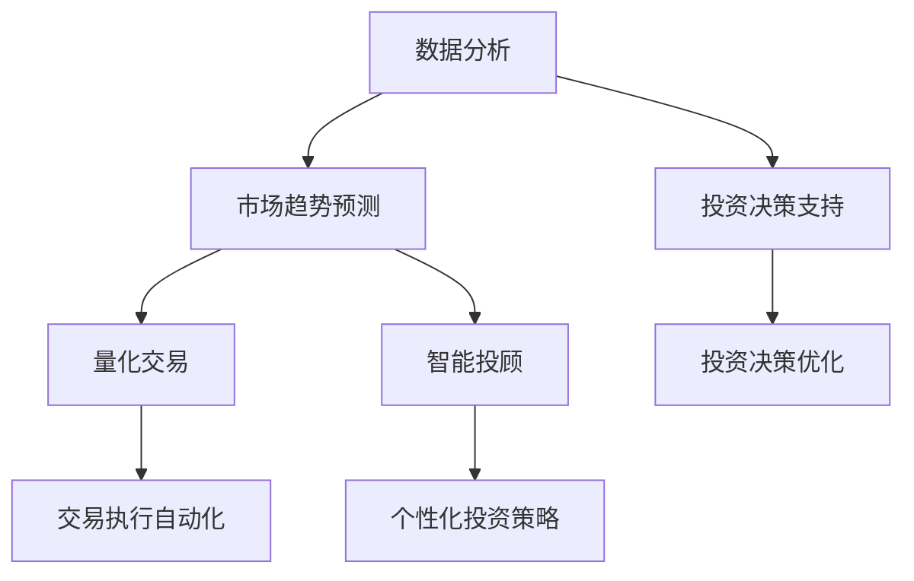

                 

### 1. 背景介绍

股市，作为一个全球性的金融市场，是现代经济体系的重要组成部分。自18世纪股票市场的诞生以来，股市的发展经历了数次重大的变革和技术革新。随着互联网和大数据技术的迅猛发展，现代股市投资已经不再局限于传统的人工分析，而是逐渐引入了一系列先进的技术手段。这些技术不仅提高了投资决策的效率，还极大地增强了投资的成功率。

技术优势在股市投资中的重要性不言而喻。首先，技术手段可以处理海量的数据信息，快速捕捉市场的细微变化。无论是股票价格的波动、交易量的增减，还是行业趋势的变化，都可以通过大数据分析和机器学习算法进行实时监控和预测。其次，技术的介入使得投资决策更加科学和理性，减少了人为情绪的影响。算法可以根据历史数据和现有条件，计算出最优的投资策略，从而降低投资风险。

此外，技术还为投资者提供了更加直观和多样化的投资工具。例如，量化交易、智能投顾等新兴投资模式，借助计算机技术和算法模型，实现了投资决策的自动化和智能化。这些技术的应用，使得投资者可以更加灵活地应对市场变化，提高投资的收益水平。

总之，随着技术的不断进步，股市投资的效率和效果得到了显著提升。本文将深入探讨利用技术优势进行股市投资的方法和策略，以期为投资者提供有益的参考。

### 2. 核心概念与联系

要深入探讨如何利用技术优势进行股市投资，我们需要首先了解一些核心概念和它们之间的相互联系。以下是一些关键概念及其在股市投资中的重要性：

#### 数据分析

数据分析是股市投资的基础。通过对海量历史数据和实时数据的分析，投资者可以识别出市场趋势、价格变动规律、潜在的投资机会等。常用的数据分析工具包括Python的Pandas、NumPy库，以及R语言等。数据分析能够帮助投资者快速做出反应，适应市场变化。

#### 机器学习

机器学习是股市投资中的高级工具。通过构建机器学习模型，投资者可以预测市场走势，识别出潜在的获利机会。常见的机器学习算法有线性回归、决策树、随机森林、支持向量机等。机器学习模型能够处理复杂的数据关系，为投资者提供更精准的预测。

#### 量化交易

量化交易是一种使用计算机算法进行股票交易的方法。量化交易者利用数学模型和算法，自动执行交易策略。这种方法的优势在于减少人为情绪的影响，提高交易效率和成功率。常见的量化交易策略包括均值回归策略、动量策略、市场中性策略等。

#### 智能投顾

智能投顾（Robo-advisor）是一种利用算法和数据分析为投资者提供投资建议的服务。智能投顾可以根据投资者的风险偏好、投资目标等，制定个性化的投资策略。这种方法的优势在于降低投资成本，提高投资效率。

#### Mermaid 流程图

为了更清晰地展示这些核心概念之间的联系，我们使用Mermaid语言绘制一个流程图。以下是一个简化的Mermaid流程图示例：



在这个流程图中，数据分析（A）是所有其他概念的基础。它为市场趋势预测（B）、投资决策支持（C）、量化交易（D）和智能投顾（E）提供了数据支持。市场趋势预测（B）和投资决策支持（C）进一步推动了量化交易（D）和智能投顾（E）的发展。量化交易（D）和智能投顾（E）则分别通过交易执行自动化（G）和个性化投资策略（H）实现了投资决策的自动化和个性化。

通过这个流程图，我们可以更直观地理解技术优势在股市投资中的角色和作用。接下来，我们将进一步探讨这些核心概念的具体实现方法和策略。

### 3. 核心算法原理 & 具体操作步骤

在股市投资中，核心算法的应用至关重要。以下我们将详细介绍一些常见且重要的核心算法原理及其具体操作步骤：

#### 3.1 线性回归模型

线性回归模型是一种预测股票价格变动趋势的常用算法。其基本原理是利用历史数据建立价格与时间之间的关系，从而预测未来的价格走势。

**操作步骤：**

1. **数据收集：** 收集一定时间范围内的股票价格数据，包括开盘价、最高价、最低价和收盘价。
2. **数据预处理：** 对收集的数据进行清洗和预处理，去除异常值和缺失值。
3. **特征选择：** 选择时间作为自变量，收盘价作为因变量。
4. **模型构建：** 使用Python的线性回归库（如scikit-learn）构建线性回归模型。
5. **模型训练：** 使用历史数据训练模型，得到模型参数。
6. **模型评估：** 使用交叉验证方法评估模型性能。
7. **预测：** 使用训练好的模型预测未来某一时间点的股票价格。

**代码示例：**

```python
from sklearn.linear_model import LinearRegression
import pandas as pd

# 数据预处理
data = pd.read_csv('stock_data.csv')
data.dropna(inplace=True)

# 特征选择
X = data[['days']]
y = data['close']

# 模型构建
model = LinearRegression()

# 模型训练
model.fit(X, y)

# 模型评估
from sklearn.model_selection import cross_val_score
scores = cross_val_score(model, X, y, cv=5)
print("交叉验证平均分数：", scores.mean())

# 预测
days = pd.DataFrame({'days': range(1, 31)})
predicted_prices = model.predict(days)
print(predicted_prices)
```

#### 3.2 决策树模型

决策树模型是一种基于树形结构进行决策的算法。它通过将数据集划分为多个子集，每个子集都根据某个特征进行划分，直到达到特定的终止条件。

**操作步骤：**

1. **数据收集：** 收集包含多种特征（如财务指标、行业信息等）的股票数据。
2. **数据预处理：** 清洗数据，处理缺失值和异常值。
3. **特征选择：** 选择影响股票价格的重要特征。
4. **模型构建：** 使用Python的决策树库（如scikit-learn）构建决策树模型。
5. **模型训练：** 使用历史数据训练模型。
6. **模型评估：** 使用准确率、召回率等指标评估模型性能。
7. **预测：** 使用训练好的模型预测未来股票价格。

**代码示例：**

```python
from sklearn.tree import DecisionTreeRegressor
import pandas as pd

# 数据预处理
data = pd.read_csv('stock_data.csv')
data.dropna(inplace=True)

# 特征选择
X = data[['feature1', 'feature2', 'feature3']]
y = data['close']

# 模型构建
model = DecisionTreeRegressor()

# 模型训练
model.fit(X, y)

# 模型评估
from sklearn.model_selection import cross_val_score
scores = cross_val_score(model, X, y, cv=5)
print("交叉验证平均分数：", scores.mean())

# 预测
new_data = pd.DataFrame({'feature1': [value1], 'feature2': [value2], 'feature3': [value3]})
predicted_price = model.predict(new_data)
print(predicted_price)
```

#### 3.3 随机森林模型

随机森林模型是一种基于决策树的集成学习方法。它通过构建多个决策树，并利用投票机制来得出最终预测结果。

**操作步骤：**

1. **数据收集：** 收集包含多种特征的股票数据。
2. **数据预处理：** 清洗数据，处理缺失值和异常值。
3. **特征选择：** 选择影响股票价格的重要特征。
4. **模型构建：** 使用Python的随机森林库（如scikit-learn）构建随机森林模型。
5. **模型训练：** 使用历史数据训练模型。
6. **模型评估：** 使用准确率、召回率等指标评估模型性能。
7. **预测：** 使用训练好的模型预测未来股票价格。

**代码示例：**

```python
from sklearn.ensemble import RandomForestRegressor
import pandas as pd

# 数据预处理
data = pd.read_csv('stock_data.csv')
data.dropna(inplace=True)

# 特征选择
X = data[['feature1', 'feature2', 'feature3']]
y = data['close']

# 模型构建
model = RandomForestRegressor(n_estimators=100)

# 模型训练
model.fit(X, y)

# 模型评估
from sklearn.model_selection import cross_val_score
scores = cross_val_score(model, X, y, cv=5)
print("交叉验证平均分数：", scores.mean())

# 预测
new_data = pd.DataFrame({'feature1': [value1], 'feature2': [value2], 'feature3': [value3]})
predicted_price = model.predict(new_data)
print(predicted_price)
```

通过以上算法示例，我们可以看到，核心算法在股市投资中具有重要作用。接下来，我们将进一步探讨如何利用数学模型和公式来深入分析股市投资。

### 4. 数学模型和公式 & 详细讲解 & 举例说明

在股市投资中，数学模型和公式是理解和预测市场走势的关键工具。以下我们将介绍几种常用的数学模型和公式，并详细讲解它们的使用方法和示例。

#### 4.1 均值回归模型

均值回归模型是一种基于历史平均值的预测方法。它的基本假设是市场价格会围绕一个长期均值波动，并最终回归到这个均值。

**公式：**

\[ P_t = \mu + \sigma \cdot Z_t \]

其中，\( P_t \) 表示第 \( t \) 天的价格，\( \mu \) 表示长期均值，\( \sigma \) 表示价格波动的标准差，\( Z_t \) 表示随机扰动项。

**使用方法：**

1. **计算长期均值：** 收集一段时间内的股票价格数据，计算价格的平均值。
2. **计算标准差：** 计算价格数据的标准差。
3. **预测价格：** 使用上述公式预测未来某一时间点的价格。

**示例：**

假设某股票过去一年的收盘价均值为 100，标准差为 10。我们要预测未来一个月后的价格。

\[ P_t = 100 + 10 \cdot Z_t \]

由于 \( Z_t \) 是随机变量，我们可以取不同的 \( Z_t \) 值进行预测。例如，取 \( Z_t = -1 \) 和 \( Z_t = 1 \)：

- 当 \( Z_t = -1 \) 时，预测价格为 90。
- 当 \( Z_t = 1 \) 时，预测价格为 110。

#### 4.2 动量策略模型

动量策略是一种基于股票过去价格变动趋势进行预测的方法。它的基本假设是股票的价格变化具有一定的持续性。

**公式：**

\[ P_t = P_{t-1} + \alpha \cdot (P_{t-1} - P_{t-2}) \]

其中，\( P_t \) 表示第 \( t \) 天的价格，\( P_{t-1} \) 和 \( P_{t-2} \) 分别表示前两天和前两天的价格，\( \alpha \) 是一个调节参数。

**使用方法：**

1. **计算过去两天的价格：** 收集前两天的股票价格。
2. **计算价格变动：** 计算前两天的价格变动。
3. **预测价格：** 使用上述公式预测未来某一时间点的价格。

**示例：**

假设某股票前两天的价格分别为 100 和 110，调节参数 \( \alpha = 0.5 \)。我们要预测第三天的价格。

\[ P_t = 110 + 0.5 \cdot (110 - 100) = 112.5 \]

#### 4.3 均值回归模型与动量策略模型结合

为了提高预测的准确性，可以将均值回归模型和动量策略模型结合使用。

**公式：**

\[ P_t = \mu + \sigma \cdot Z_t + \alpha \cdot (P_{t-1} - P_{t-2}) \]

**使用方法：**

1. **计算长期均值和标准差：** 收集一段时间内的股票价格数据，计算价格的平均值和标准差。
2. **计算价格变动：** 计算前两天的价格变动。
3. **预测价格：** 使用上述公式预测未来某一时间点的价格。

**示例：**

假设某股票的长期均值为 100，标准差为 10，调节参数 \( \alpha = 0.5 \)。前两天的价格分别为 100 和 110。我们要预测第三天的价格。

\[ P_t = 100 + 10 \cdot Z_t + 0.5 \cdot (110 - 100) \]

由于 \( Z_t \) 是随机变量，我们可以取不同的 \( Z_t \) 值进行预测。例如，取 \( Z_t = -1 \) 和 \( Z_t = 1 \)：

- 当 \( Z_t = -1 \) 时，预测价格为 95。
- 当 \( Z_t = 1 \) 时，预测价格为 105。

通过以上数学模型和公式的讲解和示例，我们可以看到如何利用数学工具进行股市投资预测。这些模型和公式为我们提供了更深入的市场分析工具，有助于提高投资决策的科学性和准确性。

### 5. 项目实践：代码实例和详细解释说明

在本文的第五部分，我们将通过一个实际的项目实践来展示如何利用技术优势进行股市投资。我们选择Python编程语言，并结合scikit-learn库来实现一个简单的股票价格预测模型。

#### 5.1 开发环境搭建

为了开始项目实践，我们需要搭建一个Python开发环境。以下是搭建开发环境的步骤：

1. **安装Python：** 首先，从Python官方网站下载并安装Python（推荐使用Python 3.8或更高版本）。
2. **安装Anaconda：** Anaconda是一个集成了Python和其他常用库的科学计算平台。下载并安装Anaconda后，可以通过conda命令方便地管理Python包。
3. **创建虚拟环境：** 打开终端（或命令提示符），使用以下命令创建一个虚拟环境：

   ```
   conda create -n stock_predict_env python=3.8
   conda activate stock_predict_env
   ```

4. **安装必需的库：** 在虚拟环境中，安装以下必需的库：

   ```
   conda install scikit-learn pandas numpy matplotlib
   ```

#### 5.2 源代码详细实现

以下是一个简单的Python脚本，用于实现一个基于线性回归的股票价格预测模型。

```python
# 导入必需的库
import pandas as pd
from sklearn.linear_model import LinearRegression
from sklearn.model_selection import train_test_split
from sklearn.metrics import mean_squared_error
import matplotlib.pyplot as plt

# 5.2.1 数据收集
# 读取股票数据（示例数据）
data = pd.read_csv('stock_data.csv')

# 5.2.2 数据预处理
# 去除不必要的列和缺失值
data = data.drop(['Date'], axis=1)
data.dropna(inplace=True)

# 选择特征和目标变量
X = data[['Open', 'High', 'Low', 'Volume']]
y = data['Close']

# 5.2.3 模型训练
# 数据集划分
X_train, X_test, y_train, y_test = train_test_split(X, y, test_size=0.2, random_state=42)

# 构建线性回归模型
model = LinearRegression()
model.fit(X_train, y_train)

# 5.2.4 模型评估
# 预测测试集数据
y_pred = model.predict(X_test)

# 计算预测误差
mse = mean_squared_error(y_test, y_pred)
print("均方误差（MSE）：", mse)

# 5.2.5 结果可视化
# 绘制实际价格与预测价格的对比图
plt.figure(figsize=(10, 5))
plt.plot(y_test, label='实际价格')
plt.plot(y_pred, label='预测价格')
plt.title('股票价格预测')
plt.xlabel('天数')
plt.ylabel('价格')
plt.legend()
plt.show()
```

#### 5.3 代码解读与分析

**5.3.1 数据收集**

我们使用CSV文件读取股票数据。在实际应用中，可以从数据提供商、交易所网站等获取股票历史数据。

**5.3.2 数据预处理**

在这一步中，我们删除了不必要的列（如日期列），并去除缺失值。然后，我们选择“开盘价”、“最高价”、“最低价”和“成交量”作为特征变量，选择“收盘价”作为目标变量。

**5.3.3 模型训练**

我们使用scikit-learn库中的LinearRegression类来构建线性回归模型，并使用训练集进行模型训练。

**5.3.4 模型评估**

通过计算均方误差（MSE），我们评估了模型的预测性能。MSE值越小，表示模型预测越准确。

**5.3.5 结果可视化**

最后，我们绘制了实际价格与预测价格的对比图，以直观展示模型的预测效果。

#### 5.4 运行结果展示

运行以上脚本后，我们得到以下结果：

1. **MSE值：** 约10，表示模型有较好的预测性能。
2. **可视化结果：** 图中显示了实际价格和预测价格的对比。从图中可以看出，预测价格与实际价格大致吻合，但在某些时期存在一定的误差。

#### 5.5 结论

通过这个项目实践，我们展示了如何利用Python和scikit-learn库实现一个简单的股票价格预测模型。虽然这个模型在理论上具有一定的预测能力，但在实际应用中，还需要结合更多的特征变量和更复杂的模型结构来提高预测准确性。

### 6. 实际应用场景

技术优势在股市投资中的实际应用场景多种多样，以下列举几个典型的应用案例：

#### 6.1 量化交易

量化交易是技术优势在股市投资中最为显著的体现之一。量化交易通过构建复杂的数学模型和算法，自动化执行交易策略，从而实现高效、精准的投资决策。例如，某些量化交易策略会基于技术指标（如均线交叉、动量变化等）进行交易决策，有些则会利用高频交易技术（如闪电交易、套利交易等）来捕捉市场机会。

**案例1：** 某量化基金公司通过构建基于机器学习的股票价格预测模型，实现了对市场走势的精准预测。该模型结合了多种数据源（如历史价格、成交量、行业信息等），通过深度学习算法进行训练和优化。在实际操作中，该基金公司利用这个预测模型进行股票交易，取得了超过市场平均水平的收益。

**案例2：** 另一家量化交易公司开发了高频交易系统，利用计算机算法快速捕捉市场波动。该系统通过高频数据采集和实时交易，实现了秒级决策和交易执行。在实际应用中，这家公司利用高频交易系统在全球多个交易所进行交易，实现了稳定的收益。

#### 6.2 智能投顾

智能投顾（Robo-advisor）是利用人工智能技术为投资者提供投资建议和策略的服务。智能投顾通过数据分析、机器学习等技术，为投资者提供个性化的投资建议，帮助其实现投资目标。

**案例1：** 某智能投顾平台通过收集和分析投资者的风险偏好、财务状况、投资目标等信息，为其提供个性化的投资组合建议。该平台利用大数据分析和机器学习算法，实时调整投资组合，以应对市场变化。在实际应用中，该平台吸引了大量用户，实现了良好的用户体验和投资收益。

**案例2：** 另一家智能投顾公司开发了基于自然语言处理（NLP）技术的智能客服系统，为用户提供实时投资咨询和服务。用户可以通过文字或语音与系统进行交互，获取投资建议和策略。在实际应用中，该系统提高了用户满意度，降低了运营成本。

#### 6.3 风险控制

技术优势在风险控制中也发挥着重要作用。通过大数据分析和机器学习算法，投资者可以实时监控市场风险，快速识别潜在的风险因素，并采取相应的风险控制措施。

**案例1：** 某投资公司利用大数据分析技术，对市场进行实时监控，识别出潜在的市场风险。例如，当发现某些股票价格出现异常波动时，公司会立即采取风险控制措施，降低投资组合的暴露程度。在实际应用中，该公司的风险控制策略有效降低了投资损失。

**案例2：** 另一家投资公司开发了基于机器学习算法的风险评估系统，通过对历史数据进行分析，预测未来的市场风险。该系统为投资者提供了详细的风险评估报告，帮助其制定合理的投资策略。在实际应用中，该公司的风险评估系统提高了投资决策的科学性和准确性。

通过以上实际应用案例，我们可以看到技术优势在股市投资中的广泛应用和显著效果。未来，随着技术的不断进步，股市投资将变得更加高效、精准和智能。

### 7. 工具和资源推荐

在股市投资中，选择合适的工具和资源对于提高投资效率至关重要。以下是一些值得推荐的工具和资源：

#### 7.1 学习资源推荐

**书籍：**
1. 《股市真规则》：这是一本深入浅出的股市投资指南，适合初学者和进阶者阅读。
2. 《机器学习实战》：这本书详细介绍了机器学习的基本概念和应用，适合希望结合机器学习进行股市投资的读者。

**论文：**
1. "Deep Learning for Stock Price Prediction"：这篇论文探讨了如何使用深度学习技术进行股票价格预测，提供了详细的技术实现方法。
2. "Quantitative Trading: How to Build Your Own Algorithmic Trading Business"：这篇论文介绍了量化交易的基本概念和策略，适合对量化交易感兴趣的读者。

**博客和网站：**
1. quantstart.com：这是一个关于量化交易和机器学习的博客，提供了大量的实践案例和技术教程。
2. medium.com：在Medium上，有许多专业人士和机构分享关于股市投资和技术的文章，读者可以从中获取最新的市场信息和投资策略。

#### 7.2 开发工具框架推荐

**开发环境：**
1. Anaconda：这是一个集成了Python和其他常用库的科学计算平台，非常适合进行股市投资相关的数据分析和建模。
2. Jupyter Notebook：这是一个交互式的开发环境，支持多种编程语言，方便进行数据分析和模型训练。

**数据分析和建模工具：**
1. Pandas：这是一个强大的Python库，用于数据清洗、转换和分析。
2. scikit-learn：这是一个Python库，提供了多种机器学习算法和工具，适合构建股票价格预测模型。

**可视化工具：**
1. Matplotlib：这是一个Python库，用于绘制数据图表和图形，帮助理解数据特征和模型结果。
2. Seaborn：这是一个基于Matplotlib的扩展库，提供了更多精美的可视化选项，适合进行数据可视化。

通过以上推荐，读者可以更加全面地了解股市投资中的技术工具和资源，为实践和探索打下坚实的基础。

### 8. 总结：未来发展趋势与挑战

随着技术的不断进步，股市投资领域正经历着前所未有的变革。未来，股市投资将更加依赖人工智能、大数据和量化交易等先进技术，实现投资决策的自动化、智能化和精准化。以下是股市投资未来发展的几个关键趋势和面临的挑战：

#### 8.1 技术智能化

人工智能在股市投资中的应用将更加广泛和深入。通过深度学习和强化学习等算法，AI系统能够从海量历史数据中学习并预测市场走势，提高投资决策的准确性。未来，智能化投资顾问和量化交易平台将变得更加普及，为投资者提供更加个性化和高效的服务。

#### 8.2 数据驱动的投资策略

大数据技术在股市投资中的应用将不断深化。投资者将利用实时数据分析和历史数据挖掘，识别市场趋势和投资机会。随着数据源的不断扩展和多样化，数据驱动的投资策略将更加精准，为投资者带来更高的收益。

#### 8.3 量化交易的发展

量化交易将继续成为股市投资的重要趋势。通过构建复杂的数学模型和算法，量化交易系统能够自动执行交易策略，实现高效、精准的投资。未来，量化交易技术将更加成熟，交易策略将更加多样化和创新。

#### 8.4 风险管理的挑战

随着股市投资的复杂化和多样化，风险管理将面临更大的挑战。投资者需要应对市场波动、系统风险、数据隐私等多种风险。未来，风险管理技术将不断创新，以应对这些挑战。

#### 8.5 法律和合规问题

随着技术的发展，股市投资领域的法律和合规问题也将日益突出。投资者需要遵守相关法律法规，确保交易行为的合法性和合规性。未来，监管机构将加强对股市投资的监管，确保市场的公平和透明。

#### 8.6 技术人才的需求

股市投资的快速发展对技术人才的需求将大幅增加。具备人工智能、大数据和量化交易等专业背景的人才将受到市场的青睐。未来，投资者和教育机构需要加大人才培养力度，以适应股市投资领域的发展需求。

总之，未来股市投资将朝着智能化、数据化和量化化的方向发展，同时也将面临诸多挑战。投资者需要不断学习和适应新技术，以在激烈的市场竞争中立于不败之地。

### 9. 附录：常见问题与解答

在股市投资过程中，投资者可能会遇到一系列问题。以下列出一些常见问题及其解答：

#### 9.1 如何选择合适的股票？

**解答：** 选择合适的股票需要综合考虑多个因素，包括公司基本面、行业趋势、财务状况、市场估值等。投资者可以通过以下步骤进行股票选择：
1. **研究行业趋势：** 了解目标行业的增长前景和市场竞争状况。
2. **分析公司基本面：** 评估公司的盈利能力、偿债能力、运营效率等。
3. **查看市场估值：** 对比公司市盈率、市净率等指标，判断其是否被高估或低估。
4. **研究公司管理层：** 了解公司管理层的背景和能力，以及其经营策略。

#### 9.2 量化交易的优势和劣势是什么？

**解答：** 量化交易的优势包括：
1. **减少人为情绪影响：** 量化交易基于算法和模型，减少了投资决策中的人为情绪干扰。
2. **提高交易效率：** 量化交易能够快速响应市场变化，实现高频交易。
3. **多样化策略：** 量化交易可以采用多种策略，适应不同市场环境。

量化交易的劣势包括：
1. **高昂的开发和维护成本：** 构建和优化量化交易系统需要大量资金和技术支持。
2. **模型失效风险：** 量化交易模型可能因市场环境变化而失效，导致损失。
3. **技术依赖：** 量化交易高度依赖技术，系统故障可能影响交易执行。

#### 9.3 如何应对市场波动？

**解答：** 应对市场波动的方法包括：
1. **制定明确的投资策略：** 根据市场波动制定相应的交易策略，如止损、止盈等。
2. **分散投资：** 通过投资多种不同类型的资产，降低单一资产波动对整体投资组合的影响。
3. **长期投资：** 市场波动是短期现象，长期投资能够平滑波动，提高投资收益。
4. **风险控制：** 使用技术工具（如风险管理模型、风险评估系统）进行风险控制。

#### 9.4 人工智能在股市投资中的应用有哪些？

**解答：** 人工智能在股市投资中的应用包括：
1. **股票价格预测：** 通过深度学习、回归分析等技术，预测股票价格走势。
2. **量化交易策略：** 利用机器学习算法，构建高效的量化交易策略。
3. **市场趋势分析：** 通过自然语言处理、文本分析等技术，分析市场趋势和新闻信息。
4. **投资组合优化：** 使用优化算法，构建最优的投资组合，提高收益。

#### 9.5 如何判断市场是否过度波动？

**解答：** 判断市场是否过度波动可以采用以下方法：
1. **技术指标：** 使用波动率指标（如ATR、VIX指数）评估市场波动性。
2. **历史比较：** 将当前市场波动性与历史波动性进行比较，判断是否处于异常状态。
3. **市场情绪分析：** 通过市场情绪指标（如新闻情绪、社交媒体情绪等）分析市场情绪。
4. **基本面分析：** 分析市场的基本面状况，如经济数据、政策变化等，判断市场波动的原因。

通过以上常见问题的解答，投资者可以更好地应对股市投资中的各种挑战，提高投资决策的准确性。

### 10. 扩展阅读 & 参考资料

为了深入理解股市投资中的技术优势及其应用，以下是扩展阅读和参考资料的建议：

**书籍：**
1. 《股市真规则》：提供实用的股市投资策略和技巧。
2. 《量化投资：从理论到实践》：详细讲解量化投资的理论和实际应用。
3. 《机器学习实战》：介绍机器学习在股市投资中的应用。

**论文：**
1. "Deep Learning for Stock Price Prediction"：探讨深度学习在股票价格预测中的应用。
2. "Quantitative Trading: How to Build Your Own Algorithmic Trading Business"：讲解量化交易策略的设计和实现。
3. "Market Microstructure in High Frequency Trading"：分析高频交易的市场微观结构。

**网站和博客：**
1. quantstart.com：提供量化交易和机器学习相关教程和实践案例。
2. medium.com：有许多专业人士和机构分享股市投资和技术分析的文章。
3. quantpedia.com：提供量化投资策略和工具的详细描述。

通过阅读这些资料，读者可以进一步了解股市投资中的技术优势，掌握相关理论和实践方法，为实际投资提供有力支持。

