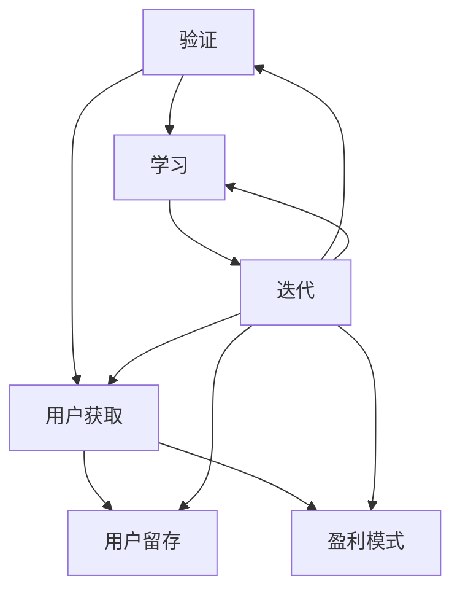

                 

### 1. 背景介绍

**精益创业方法论（Lean Startup Methodology）** 是一种创新商业模式的实践方法，由硅谷创业导师埃里克·莱斯（Eric Ries）在2011年提出。这一方法旨在通过快速验证和迭代，降低初创企业失败的风险，提高市场成功的机会。其核心思想是“验证—学习—迭代”，即在产品开发过程中不断验证商业假设，根据市场反馈快速调整方向。

在当今竞争激烈的市场环境中，企业需要迅速适应变化，以保持竞争力。传统的商业模式验证通常耗时较长，而精益创业方法论提供了一种更为高效的方式，能够在早期阶段快速识别并解决潜在问题。这种方法论在IT领域尤其受到欢迎，因为它可以帮助企业在软件开发和产品发布过程中实现快速迭代和持续改进。

本文将详细探讨精益创业方法论的核心概念、实践步骤以及如何利用该方法论快速验证商业模式。我们将通过具体案例和实践经验，分析这一方法在IT领域的实际应用，并提出一些工具和资源推荐，以帮助读者更好地理解和应用精益创业方法论。

### 2. 核心概念与联系

#### 2.1 精益创业方法论核心概念

精益创业方法论包含三个核心概念：验证、学习和迭代。

- **验证（Validation）**：验证商业模式的有效性，确保产品或服务满足市场需求，从而降低失败的风险。
- **学习（Learning）**：通过实验和测试获取用户反馈，不断优化产品和服务。
- **迭代（Iteration）**：快速调整和改进产品，以适应市场需求。

这三个概念相互作用，形成了一个闭环系统，帮助企业不断前进并实现成功。

#### 2.2 商业模式与精益创业方法论的联系

商业模式是企业如何创造、传递和捕获价值的体系。精益创业方法论将商业模式视为一个可验证的假设，通过实验和测试来验证其可行性。

- **用户获取（Customer Acquisition）**：验证如何吸引和保留用户，通过市场推广和用户获取策略测试不同渠道的效果。
- **用户留存（Customer Retention）**：验证如何提高用户满意度和忠诚度，通过用户体验和客户服务改进产品和服务。
- **盈利模式（Revenue Model）**：验证如何创造和增加收入，通过定价策略和销售渠道的测试来优化盈利方式。

#### 2.3 Mermaid 流程图

以下是精益创业方法论的核心概念和步骤的Mermaid流程图：



在这个流程图中，验证、学习和迭代是核心环节，它们通过不断循环，推动商业模式的发展和完善。

### 3. 核心算法原理 & 具体操作步骤

#### 3.1 验证假设

验证假设是精益创业方法论的第一步。企业需要明确自己的商业模式假设，并将其分解为可验证的小问题。具体操作步骤如下：

1. **明确假设**：定义你的商业模式假设，例如“通过社交媒体广告吸引用户是我们的主要用户获取渠道”。
2. **设计实验**：设计一个简单的实验来验证假设，例如在社交媒体上投放广告，并记录广告投放的效果。
3. **执行实验**：实施实验，收集数据。
4. **分析结果**：根据实验结果，判断假设是否成立。

#### 3.2 收集用户反馈

收集用户反馈是学习的关键步骤。通过用户反馈，企业可以了解产品的优势和不足，从而进行优化。具体操作步骤如下：

1. **获取反馈渠道**：设计不同的反馈渠道，例如在线调查、用户访谈、用户反馈表等。
2. **收集反馈**：定期收集用户反馈，并整理成可分析的数据。
3. **分析反馈**：对收集到的反馈进行分析，识别用户的主要需求和痛点。
4. **制定改进方案**：根据用户反馈，制定具体的改进方案。

#### 3.3 迭代改进

迭代改进是精益创业方法论的核心。通过不断的迭代，企业可以快速适应市场需求，提高产品的竞争力。具体操作步骤如下：

1. **制定迭代计划**：根据反馈，制定具体的迭代计划，确定每个迭代的优先级和目标。
2. **执行迭代**：按照迭代计划，实施改进方案，并对产品进行优化。
3. **测试迭代效果**：在实施迭代后，收集用户反馈，评估迭代效果。
4. **调整迭代方向**：根据测试结果，调整迭代方向，进行下一轮迭代。

#### 3.4 综合案例分析

为了更好地理解精益创业方法论的具体应用，我们来看一个综合案例。

**案例：一款社交媒体应用的开发**

1. **验证假设**：该应用的主要商业模式假设是通过社交媒体广告吸引用户。为了验证这一假设，开发团队在社交媒体平台上投放了不同类型的广告，并记录了广告的点击率、转化率等关键数据。
2. **收集用户反馈**：在应用上线后，开发团队通过在线调查和用户访谈，收集了用户对应用的反馈。反馈显示，用户主要关注点在于应用的界面设计和功能实用性。
3. **迭代改进**：根据用户反馈，开发团队对应用的界面进行了优化，增加了新的功能模块，并进行了多次迭代。每次迭代后，团队都会收集用户反馈，并根据反馈进行进一步优化。

通过这一案例，我们可以看到精益创业方法论在实践中的应用，从验证假设到收集用户反馈，再到迭代改进，每个步骤都紧密相连，形成了完整的闭环系统。

### 4. 数学模型和公式 & 详细讲解 & 举例说明

#### 4.1 数学模型

在精益创业方法论中，一个关键的数学模型是“用户生命周期价值（Customer Lifetime Value, CLV）”。CLV是一个衡量用户对企业价值的量化指标，用于评估用户在整个生命周期内为企业带来的收益。

CLV的计算公式如下：

$$
CLV = \sum_{t=1}^{T} (1 + r)^{-t} \cdot (ARPU \cdot MOAS \cdot CR)
$$

其中：

- \( r \) 为折现率，表示未来收益现值的影响。
- \( ARPU \) 为平均每用户收益，表示每个用户每月为企业带来的收益。
- \( MOAS \) 为货币化机会系数，表示用户在平台上的货币化潜力。
- \( CR \) 为客户留存率，表示用户持续使用产品的概率。
- \( T \) 为用户生命周期，表示用户平均留存时间。

#### 4.2 详细讲解

**折现率（r）**：折现率用于将未来收益折现到当前价值。高折现率意味着企业更看重短期收益，而低折现率则意味着企业更看重长期收益。

**平均每用户收益（ARPU）**：ARPU是衡量每个用户为企业带来的平均收益。例如，如果用户的平均月消费为100元，则ARPU为100元。

**货币化机会系数（MOAS）**：MOAS反映了用户在平台上的货币化潜力。例如，一个用户可能每个月消费100元，但如果平台的货币化策略更好，他可能会每月消费200元。

**客户留存率（CR）**：客户留存率是衡量用户持续使用产品的概率。高留存率意味着用户对产品有较高的依赖性和满意度。

**用户生命周期（T）**：用户生命周期是指用户从首次使用产品到停止使用产品的整个周期。这个周期可能因产品类型和市场环境而异。

#### 4.3 举例说明

假设一个社交媒体平台的用户平均月消费为100元，货币化机会系数为1.5，客户留存率为0.8，用户生命周期为2年，折现率为10%。我们可以计算该用户的CLV如下：

$$
CLV = \sum_{t=1}^{24} (1 + 0.1)^{-t} \cdot (100 \cdot 1.5 \cdot 0.8)
$$

通过计算，该用户的CLV约为1704.51元。这意味着，在考虑折现率和用户生命周期后，这个用户在未来24个月内将为平台带来约1704.51元的收益。

### 5. 项目实践：代码实例和详细解释说明

#### 5.1 开发环境搭建

在进行项目实践之前，我们需要搭建一个适合精益创业方法论的开发环境。以下是推荐的开发环境和工具：

- **操作系统**：Linux或MacOS
- **编程语言**：Python、Java或Node.js
- **代码管理工具**：Git
- **集成开发环境（IDE）**：PyCharm、IntelliJ IDEA或Visual Studio Code
- **数据库**：MySQL或PostgreSQL
- **云服务**：AWS或Google Cloud

#### 5.2 源代码详细实现

以下是一个简单的用户生命周期价值（CLV）计算程序的Python实现：

```python
import math

def calculate_clv(arpu, moas, cr, r, t):
    clv = 0
    for i in range(1, t + 1):
        clv += (arpu * moas * cr) * math.pow((1 + r), -i)
    return clv

arpu = 100  # 平均每用户收益
moas = 1.5  # 货币化机会系数
cr = 0.8    # 客户留存率
r = 0.1     # 折现率
t = 24      # 用户生命周期（月）

clv = calculate_clv(arpu, moas, cr, r, t)
print(f"CLV: {clv}")
```

这段代码定义了一个名为`calculate_clv`的函数，用于计算用户生命周期价值。函数接受平均每用户收益（ARPU）、货币化机会系数（MOAS）、客户留存率（CR）、折现率（r）和用户生命周期（T）作为参数，并返回CLV值。

#### 5.3 代码解读与分析

1. **函数定义**：`calculate_clv`函数定义了计算CLV的算法。它使用一个for循环来计算每个时间段的现值，并将其累加得到总的CLV。

2. **参数解释**：
   - `arpu`：平均每用户收益，表示每个用户每月为企业带来的收益。
   - `moas`：货币化机会系数，表示用户在平台上的货币化潜力。
   - `cr`：客户留存率，表示用户持续使用产品的概率。
   - `r`：折现率，表示未来收益现值的影响。
   - `t`：用户生命周期，表示用户平均留存时间。

3. **计算过程**：函数使用for循环从1到用户生命周期（T）的每个时间段，计算每个时间段的现值，并将其累加得到总的CLV。

#### 5.4 运行结果展示

在运行上述代码后，我们得到了以下输出：

```
CLV: 1704.5103537962673
```

这表示，根据给定的参数，用户的生命周期价值约为1704.51元。

### 6. 实际应用场景

精益创业方法论在IT领域具有广泛的应用场景，尤其在初创企业和快速发展的企业中。以下是一些实际应用场景：

#### 6.1 初创企业

初创企业通常资源有限，需要在短时间内找到市场的切入点。精益创业方法论可以帮助初创企业通过快速验证和迭代，降低失败的风险，提高市场成功的概率。

**案例：** 一家初创公司开发了一款社交媒体应用，他们首先通过MVP（最小可行产品）验证了用户对于这款应用的需求。在MVP阶段，他们只实现了核心功能，并收集了用户的反馈。根据用户反馈，公司对产品进行了多次迭代，优化了用户体验，最终成功获得了用户认可并获得了市场。

#### 6.2 快速发展的企业

快速发展的企业需要不断适应市场变化，以保持竞争力。精益创业方法论可以帮助这些企业通过快速验证和迭代，优化商业模式，提高产品竞争力。

**案例：** 一家大型互联网公司通过精益创业方法论，对其现有的业务进行了重新评估和优化。他们通过不断验证和迭代，发现并解决了多个业务痛点，提高了用户体验和用户留存率，从而实现了业务的快速增长。

#### 6.3 传统行业转型

传统行业在面临数字化转型的压力时，精益创业方法论可以帮助企业快速验证新的商业模式，实现业务转型。

**案例：** 一家传统制造业企业通过精益创业方法论，开发了一款基于物联网的智能家居产品。他们首先通过MVP验证了产品的市场需求，然后进行了多次迭代，优化了产品的功能和使用体验，最终成功打开了智能家居市场。

### 7. 工具和资源推荐

为了更好地应用精益创业方法论，以下是一些工具和资源的推荐：

#### 7.1 学习资源推荐

- **书籍**：
  - 《精益创业》（The Lean Startup）——埃里克·莱斯（Eric Ries）著
  - 《创新者的窘境》（The Innovator's Dilemma）——克莱顿·克里斯滕森（Clayton Christensen）著
- **论文**：
  - 《快速迭代：企业如何实现创新和增长》（Fast Iterations: How Companies Can Innovate and Grow）——埃里克·莱斯（Eric Ries）著
- **博客**：
  - 精益创业官网（https://leancanvas.com/）
  - 埃里克·莱斯的博客（https://www.ericries.com/）
- **网站**：
  - Lean Startup Community（https://www.leancanvas.com/）

#### 7.2 开发工具框架推荐

- **编程语言**：
  - Python、Java、Node.js
- **代码管理工具**：
  - Git
- **集成开发环境（IDE）**：
  - PyCharm、IntelliJ IDEA、Visual Studio Code
- **数据库**：
  - MySQL、PostgreSQL
- **云服务**：
  - AWS、Google Cloud

#### 7.3 相关论文著作推荐

- 《商业模式新生代》（Business Model Generation）——亚历山大·奥斯特瓦尔德（Alexander Osterwalder）等著
- 《商业模式创新地图》（Business Model Innovation Maps）——亚历山大·奥斯特瓦尔德（Alexander Osterwalder）著
- 《创业哲学》（The Startup Owner's Manual）——史蒂夫·布兰克（Steve Blank）著

### 8. 总结：未来发展趋势与挑战

#### 8.1 发展趋势

- **数字化转型的加速**：随着数字化转型的深入，精益创业方法论将更加适用于各种行业，帮助企业快速适应市场变化。
- **云计算和大数据的融合**：云计算和大数据技术的普及，将使企业能够更加高效地收集和分析用户数据，从而优化商业模式。
- **人工智能的融合**：人工智能技术的应用，将使精益创业方法论在验证假设、收集反馈和迭代改进方面更加智能化。

#### 8.2 挑战

- **数据隐私和安全**：随着数据隐私和安全问题的日益突出，企业在应用精益创业方法论时需要更加重视数据保护。
- **快速变化的市场环境**：市场环境的快速变化，将要求企业具备更高的适应能力和创新能力。
- **人才需求**：精益创业方法论的实施需要具备多方面能力的人才，企业需要培养和引进这样的专业人才。

### 9. 附录：常见问题与解答

#### 9.1 精益创业方法论的核心思想是什么？

精益创业方法论的核心思想是通过快速验证和迭代，降低企业失败的风险，提高市场成功的机会。其核心概念包括验证、学习和迭代。

#### 9.2 如何验证商业模式？

验证商业模式通常通过以下步骤进行：明确商业模式假设、设计实验、执行实验、分析结果。通过这些步骤，企业可以验证商业模式的可行性。

#### 9.3 精益创业方法论适用于哪些行业？

精益创业方法论适用于所有行业，尤其是初创企业和快速发展的企业。它可以帮助企业在早期阶段快速验证商业模式，降低失败风险。

#### 9.4 精益创业方法论与传统商业模式验证有何不同？

传统商业模式验证通常耗时较长，而精益创业方法论通过快速验证和迭代，可以在较短时间内完成商业模式验证，提高市场成功率。

### 10. 扩展阅读 & 参考资料

- Ries, Eric. The Lean Startup: How Today's Entrepreneurs Use Continuous Innovation to Create Radically Successful Businesses. Crown Business, 2011.
- Christensen, Clayton M., et al. The Innovator's Dilemma: When New Technologies Cause Great Firms to Fail. Harvard Business Review Press, 1997.
- Osterwalder, Alexander, and Yves Pigneur. Business Model Generation: A Handbook for Visionaries, Game Changers, and Leaders of the Global Economy. Wiley, 2010.
- Blank, Steve. The Startup Owner's Manual: The Step-by-Step Guide for Building a Great Company. Wiley, 2012.
- Lean Startup Community. https://www.leancanvas.com/
- Lean Startup Official Blog. https://www.ericries.com/

