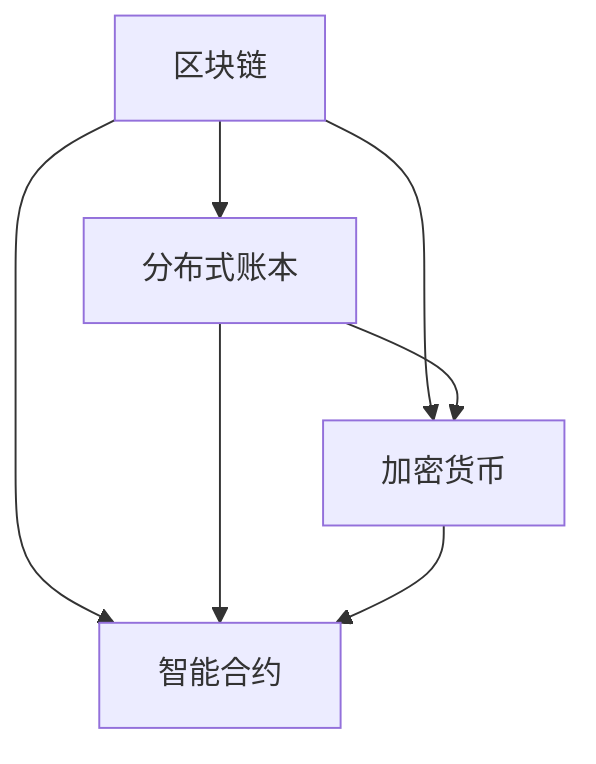

                 

### 背景介绍

区块链技术，作为一种去中心化的分布式数据库系统，近年来在金融、医疗、供应链管理等多个领域得到了广泛关注和应用。其核心特点在于不可篡改和透明性，使得区块链成为构建去中心化应用（DApps）和智能合约的基础技术。

去中心化，顾名思义，是指系统中的控制权不再集中于某个中心化的实体，而是通过分布式网络中的节点共同维护和决策。这一特性使得区块链在许多传统商业模型中展现出巨大潜力，尤其是在创业领域。

区块链创业，指的是利用区块链技术来构建新的商业模式、产品或服务，实现去中心化的商业运营。这种模式不仅挑战了传统商业范式，也为创业者提供了新的机会和挑战。

首先，区块链创业能够通过智能合约实现自动化和自我执行的交易，从而降低交易成本、提高效率，并减少中介环节。其次，区块链的透明性和不可篡改性能够增强信任，为商业伙伴和消费者提供可靠的数据和交易记录。此外，去中心化平台能够打破传统中心化垄断，为小型企业和个体提供公平竞争的环境。

然而，区块链创业也面临着一些挑战，包括技术成熟度、用户接受度、监管政策等。本文将深入探讨区块链创业的核心概念、算法原理、实际应用场景、开发资源和未来发展趋势，帮助读者全面理解这一新兴商业范式。

### 核心概念与联系

要深入理解区块链创业，首先需要掌握几个核心概念：区块链、分布式账本、加密货币和智能合约。这些概念相互关联，构成了区块链技术的基石。

#### 区块链

区块链是一个分布式数据库系统，其数据存储在多个节点上，每个节点都存储一个完整的数据副本。这种分布式存储方式确保了数据的不可篡改性和透明性。区块链通过加密算法和共识机制来保证数据的完整性和一致性。

#### 分布式账本

分布式账本是一种对等网络技术，网络中的每个节点都存储一份账本记录。这些节点共同维护账本，确保账本的一致性和可靠性。与中心化账本系统不同，分布式账本没有单一的中心点，降低了被攻击的风险。

#### 加密货币

加密货币是区块链技术的一种应用，如比特币、以太坊等。它们使用密码学原理来保证交易的安全性和匿名性。加密货币的发行和流通通过区块链网络中的共识机制来实现。

#### 智能合约

智能合约是一种自动执行的合约，它包含在区块链上运行的计算机代码。智能合约在满足特定条件时自动执行，无需人工干预。智能合约通过编程语言编写，通常使用Solidity等智能合约语言。

这些核心概念之间有着紧密的联系。区块链作为分布式账本的基础，为加密货币和智能合约提供了安全的交易和数据存储环境。而加密货币和智能合约的应用，进一步推动了区块链技术的商业潜力。

下面，我们将通过一个Mermaid流程图来详细展示这些概念之间的关系：



在这个流程图中，区块链（A）作为核心技术，连接了分布式账本（B）、加密货币（C）和智能合约（D）。这种连接关系展示了区块链创业的基础架构，也为后续章节的技术讨论提供了框架。

### 核心算法原理 & 具体操作步骤

#### 区块链的工作原理

区块链的工作原理可以概括为以下步骤：

1. **交易生成**：用户在区块链网络上发起交易，这些交易包括资金转移、信息交换等。
2. **区块生成**：多个交易被组织成一个区块，每个区块包含一个时间戳、一个随机数、一个前一个区块的哈希值以及交易信息。
3. **共识机制**：网络中的节点通过共识机制达成一致，选择哪个区块将添加到区块链中。常见的共识机制包括工作量证明（PoW）和权益证明（PoS）。
4. **链式结构**：每个新区块都通过其哈希值与前一个区块链接，形成一个不可篡改的链式结构。
5. **永久存储**：一旦区块被确认，它将被永久存储在区块链上，任何篡改尝试都会导致哈希值不一致，从而被网络拒绝。

#### 智能合约的实现步骤

智能合约是区块链技术的重要组成部分，其实现步骤如下：

1. **编写智能合约**：开发者使用Solidity等智能合约编程语言编写合约代码，定义合约的函数、变量和逻辑。
2. **编译合约**：将智能合约代码编译为以太坊虚拟机（EVM）可执行的字节码。
3. **部署合约**：将编译后的字节码部署到区块链上，生成合约地址。
4. **调用智能合约**：用户通过区块链网络调用合约函数，执行预定义的逻辑。

#### 加密货币的发行和交易

加密货币的发行和交易过程涉及到区块链的分布式账本特性：

1. **挖矿**：在PoW共识机制下，矿工通过解决复杂的数学难题来验证交易，并将交易记录到一个新区块中。成功验证的矿工会获得一定数量的加密货币作为奖励。
2. **交易验证**：矿工将交易信息打包到区块中，并在网络中进行广播。其他节点验证交易的有效性，确保资金余额足够且交易没有被重复记录。
3. **区块添加**：验证通过的区块将被添加到区块链上，新的加密货币将被发放到矿工的地址中。
4. **交易确认**：完成交易的区块需要多个确认才能被视为最终完成。确认次数取决于网络的设定，通常需要几个区块的高度。

#### 分布式账本的数据同步

分布式账本的数据同步涉及到多个节点之间的通信和数据一致性：

1. **网络广播**：每个节点接收新区块或交易信息后，会将其广播给其他节点。
2. **数据验证**：节点接收信息后，会验证其有效性和一致性，确保不会接受重复或冲突的数据。
3. **共识达成**：通过共识机制，节点达成一致，将验证通过的数据同步到各自的账本中。

通过上述具体操作步骤，我们可以看到区块链技术如何通过分布式账本、智能合约和加密货币等核心算法，实现去中心化的商业运营。这些技术不仅提高了交易的安全性和透明性，也为区块链创业提供了坚实的基础。

#### 数学模型和公式 & 详细讲解 & 举例说明

区块链技术中的一些核心算法和机制，如工作量证明（Proof of Work, PoW）、权益证明（Proof of Stake, PoS）和智能合约的执行，都依赖于数学模型和公式。以下将详细讲解这些数学模型和公式的原理，并通过具体例子来说明它们的实际应用。

##### 工作量证明（Proof of Work, PoW）

**原理**：

PoW机制通过计算复杂问题来确保网络的安全性。矿工必须解决一个计算难题，才能生成一个新的区块。这个过程被称为“挖矿”。计算难题通常是寻找一个哈希值，使得该值小于某个预定目标。

**公式**：

设\( H \)为哈希函数，\( T \)为目标难度，\( N \)为挖矿的次数，\( H(N) \)为第\( N \)次挖矿所得到的哈希值，则：

$$
H(N) < T
$$

**举例**：

假设目标难度\( T \)为\( 10^8 \)，矿工需要不断尝试不同的随机数，直到找到一个满足条件的哈希值。例如，经过10000次尝试后，矿工得到了一个哈希值\( H(10000) = 123456 \)，这个值小于目标难度\( T \)，因此矿工成功挖到了一个区块。

##### 权益证明（Proof of Stake, PoS）

**原理**：

PoS机制通过持有代币数量和持有时间来决定矿工的权益。持币越多、持币时间越长，矿工的验证权益越大。在PoS网络中，矿工无需进行复杂的计算，而是通过“押币”来参与区块验证。

**公式**：

设\( S \)为矿工的权益，\( N \)为网络中所有矿工的总权益，\( P \)为矿工的概率，则：

$$
P = \frac{S}{N}
$$

**举例**：

在一个网络中有10个矿工，各自持有的权益如下：

| 矿工 | 权益（S） |
| ---- | ---- |
| A    | 100   |
| B    | 200   |
| C    | 300   |
| D    | 200   |
| E    | 100   |
| F    | 150   |
| G    | 150   |
| H    | 50    |
| I    | 100   |
| J    | 50    |

总权益\( N \)为：

$$
N = 100 + 200 + 300 + 200 + 100 + 150 + 150 + 50 + 100 + 50 = 1450
$$

矿工B的权益概率\( P \)为：

$$
P_B = \frac{200}{1450} \approx 0.138
$$

因此，矿工B生成区块的概率约为13.8%。

##### 智能合约的执行

**原理**：

智能合约通过编程语言编写，包含一系列预定义的逻辑和规则。合约的执行依赖于区块链网络中的虚拟机，如以太坊虚拟机（EVM）。执行过程中，合约会读取区块链上的数据，并根据预设的逻辑进行计算和操作。

**公式**：

智能合约的执行过程通常包括以下几个步骤：

1. **合约初始化**：定义合约的变量和状态。
2. **函数调用**：用户通过区块链调用合约的函数，传递参数。
3. **逻辑执行**：合约根据传入的参数执行预设的逻辑。
4. **状态更新**：执行结果将更新区块链上的数据。

**举例**：

考虑一个简单的智能合约，用于存储和管理资金。合约包含两个函数：`deposit` 和 `withdraw`。

```solidity
pragma solidity ^0.8.0;

contract Wallet {
    mapping(address => uint256) public balance;

    function deposit() external payable {
        balance[msg.sender] += msg.value;
    }

    function withdraw(uint256 amount) external {
        require(balance[msg.sender] >= amount, "Insufficient balance");
        balance[msg.sender] -= amount;
        payable(msg.sender).transfer(amount);
    }
}
```

在这个合约中：

- `balance` 是一个映射（mapping），用于存储用户的资金余额。
- `deposit` 函数接收以太币，并将其存储到用户的余额中。
- `withdraw` 函数从用户的余额中提取指定金额，并将其发送给用户。

通过调用`deposit`和`withdraw`函数，用户可以轻松地管理和操作其资金。

##### 举例说明

假设用户Alice和Bob在区块链上运行了上述智能合约。以下是他们的交互示例：

1. **Alice存款**：

   Alice调用`deposit`函数，向合约发送1个以太币。

   ```solidity
   Alice.call(deposit());
   ```

   合约更新其余额：

   ```
   balance[Alice] = 1
   ```

2. **Bob提取**：

   Bob调用`withdraw`函数，尝试从合约中提取0.5个以太币。

   ```solidity
   Bob.call(withdraw(0.5));
   ```

   由于余额不足，提取操作将失败并抛出异常。

   ```
   require(balance[Bob] >= 0.5, "Insufficient balance")
   ```

3. **Alice提取**：

   Alice调用`withdraw`函数，成功提取其存款的0.5个以太币。

   ```solidity
   Alice.call(withdraw(0.5));
   ```

   合约更新其余额：

   ```
   balance[Alice] = 0.5
   ```

通过上述示例，我们可以看到智能合约如何通过数学模型和公式实现自动执行和操作。这不仅提高了交易的安全性和透明性，也为去中心化的商业运营提供了强有力的技术支持。

### 项目实践：代码实例和详细解释说明

为了更好地理解区块链创业的实际应用，我们将通过一个简单的区块链项目实例来演示其开发过程。这个项目将实现一个基本的去中心化交易平台，允许用户创建订单和执行交易。

#### 1. 开发环境搭建

首先，我们需要搭建开发环境。以下是所需的工具和软件：

- **Node.js**：用于运行以太坊客户端和智能合约。
- **Truffle**：一个智能合约开发框架，用于编写、编译和部署智能合约。
- **Ganache**：一个以太坊本地节点，用于模拟区块链网络。

安装步骤如下：

1. 安装Node.js：访问[Node.js官网](https://nodejs.org/)，下载并安装合适的版本。
2. 安装Truffle：在命令行中运行以下命令：
   ```bash
   npm install -g truffle
   ```
3. 启动Ganache：下载并安装Ganache（[官网链接](https://github.com/trufflesuite/ganache)），启动后创建一个新的本地网络。

#### 2. 源代码详细实现

我们使用Truffle框架来编写和部署智能合约。以下是一个简单的去中心化交易平台智能合约的示例代码：

```solidity
// SPDX-License-Identifier: MIT
pragma solidity ^0.8.0;

contract DecentralizedExchange {
    mapping(address => mapping(address => uint256)) public balances;

    function createOrder(address buyer, address seller, uint256 quantity) external {
        require(balances[buyer][seller] >= quantity, "Insufficient balance");
        balances[buyer][seller] -= quantity;
        balances[seller][buyer] += quantity;
    }

    function cancelOrder(address buyer, address seller, uint256 quantity) external {
        balances[buyer][seller] += quantity;
    }

    function executeOrder(address buyer, address seller, uint256 quantity) external {
        require(balances[buyer][seller] >= quantity, "Insufficient balance");
        balances[buyer][seller] -= quantity;
        balances[seller][buyer] += quantity;
    }
}
```

这个合约包含三个主要函数：

- `createOrder`：用户创建订单，从买家账户转移代币到卖家账户。
- `cancelOrder`：用户取消订单，将代币退回到买家账户。
- `executeOrder`：执行订单，将代币从卖家账户转移到买家账户。

#### 3. 代码解读与分析

**合约结构**：

合约使用Solidity语言编写，定义了两个映射（mapping）来存储买卖双方的代币余额。`balances[buyer][seller]`表示买家账户中的卖家代币余额。

**函数解析**：

- `createOrder`：接收买家地址、卖家地址和交易数量，从买家账户转移代币到卖家账户。这个函数确保买家账户中拥有足够的代币来创建订单。
- `cancelOrder`：接收买家地址、卖家地址和交易数量，将代币退回到买家账户。这个函数允许用户取消订单。
- `executeOrder`：接收买家地址、卖家地址和交易数量，从卖家账户转移代币到买家账户。这个函数确保订单执行后，买卖双方的账户余额正确更新。

**安全措施**：

合约使用`require`语句来检查交易的有效性，防止代币转移失败。例如，在`createOrder`和`executeOrder`函数中，合约检查买家账户是否拥有足够的代币来执行操作。

#### 4. 运行结果展示

使用Truffle和Ganache，我们可以部署和测试这个去中心化交易平台智能合约。以下是部署和测试的步骤：

1. **部署合约**：

   ```bash
   truffle migrate --network local
   ```

   这将编译智能合约并部署到本地网络。

2. **测试合约**：

   ```bash
   truffle test
   ```

   这将运行合约的单元测试，确保其功能正确。

3. **交互示例**：

   在本地网络中，我们可以使用Truffle console与合约进行交互。以下是创建、取消和执行订单的示例：

   ```solidity
   > let exchange = await DecentralizedExchange.deployed();
   > await exchange.createOrder(addressOfBuyer, addressOfSeller, quantity);
   > await exchange.executeOrder(addressOfBuyer, addressOfSeller, quantity);
   > await exchange.cancelOrder(addressOfBuyer, addressOfSeller, quantity);
   ```

通过这个简单的项目实例，我们可以看到如何使用区块链技术构建去中心化的商业应用。这不仅为我们提供了实际操作的经验，也展示了区块链创业的潜力。

### 实际应用场景

区块链创业不仅在理论上展现出巨大的潜力，还在实际应用中得到了广泛验证。以下是区块链创业在金融、供应链管理、医疗保健和版权保护等领域的实际应用场景。

#### 金融

区块链技术在金融领域中的应用尤为广泛。例如，比特币和以太坊等加密货币通过区块链实现了去中心化的货币交易，大大降低了交易成本和提高了交易速度。此外，区块链技术还应用于跨境支付、去中心化金融（DeFi）和证券化资产等领域。通过智能合约，金融机构可以实现自动化交易和合规性验证，降低操作风险和中介成本。

#### 供应链管理

供应链管理是区块链技术的重要应用领域之一。区块链的透明性和不可篡改性确保了供应链数据的真实性和可靠性，从而提高了供应链的透明度和效率。例如，沃尔玛等大型零售商利用区块链技术追踪食品供应链，确保食品安全和可追溯性。此外，区块链技术还可以用于物流、库存管理和供应商审核，提高供应链的整体管理水平。

#### 医疗保健

区块链技术在医疗保健领域中的应用潜力同样巨大。通过区块链，医疗数据可以实现去中心化的存储和管理，确保数据的安全性和隐私性。例如，患者可以在区块链上存储和共享其医疗记录，医生可以便捷地获取患者的完整医疗历史，从而提供更精准的诊断和治疗。此外，区块链技术还可以用于药品供应链管理，确保药品的真实性和流通追溯。

#### 版权保护

版权保护是区块链技术的另一个重要应用领域。通过区块链，创作者可以有效地管理和保护其知识产权。例如，音乐、电影、书籍和其他数字内容的创作者可以将其作品上链，从而实现版权的自动化注册、许可和交易。区块链技术确保了作品的真实性和唯一性，减少了版权纠纷和侵权行为，为创作者提供了更公平的创作环境和收益分配机制。

#### 物流与运输

在物流和运输领域，区块链技术也展现出了巨大的应用潜力。通过区块链，物流公司可以实现货物跟踪、运输过程监控和供应链优化。例如，IBM的TradeLens平台利用区块链技术追踪全球供应链，提高了物流的透明度和效率。此外，区块链技术还可以用于跨境运输和供应链融资，降低交易成本和风险。

#### 教育与认证

区块链技术在教育领域的应用也日益增多。通过区块链，学校和教育机构可以存储和验证学生的学术成绩、证书和学历，确保其真实性和可信度。例如，某些大学已经开始使用区块链技术来记录和验证学生的学术成就，为学生提供全球认可的学历证书。

#### 选举投票

区块链技术还可以用于选举投票，提高选举的透明性和公正性。通过区块链，选举结果可以实现去中心化的记录和验证，防止选举欺诈和篡改。例如，某些国家已经开始探索使用区块链技术进行选举投票，以确保选举的公正性和可信度。

#### 去中心化自治组织（DAO）

去中心化自治组织（DAO）是区块链创业的另一个重要应用场景。DAO通过区块链实现去中心化的管理和决策，使组织成员能够透明、公平地参与决策和分配收益。例如，加密货币项目MakerDAO通过DAO模型实现了去中心化的稳定币发行和管理，提高了项目的透明度和公正性。

通过这些实际应用场景，我们可以看到区块链创业在各个领域带来的变革和机遇。这不仅挑战了传统商业模式，也为去中心化的商业运营提供了新的可能性。随着技术的不断进步和应用场景的拓展，区块链创业将在未来发挥更加重要的作用。

### 工具和资源推荐

#### 学习资源推荐

1. **书籍**：

   - 《精通比特币》（Mastering Bitcoin）：由安德烈亚斯·安东诺普洛斯（Andreas M. Antonopoulos）所著，详细介绍了比特币和区块链技术的基础知识。

   - 《区块链技术指南》（Blockchain: Blueprint for a New Economy）：由梅兰妮·斯旺（Melanie Swan）所著，探讨了区块链技术对社会、经济和商业的深远影响。

2. **论文**：

   - 《比特币：一种点对点的电子现金系统》（Bitcoin: A Peer-to-Peer Electronic Cash System）：中本聪（Satoshi Nakamoto）的创世论文，首次提出了区块链技术的核心概念。

   - 《以太坊：智能合约与去中心化应用编程指南》（Ethereum: The Ultimate Guide to Smart Contracts and Decentralized Applications）：由安德烈亚斯·安东诺普洛斯（Andreas M. Antonopoulos）所著，介绍了以太坊平台和智能合约的原理和应用。

3. **博客**：

   - [Blockchain.org](https://blockchain.org/): 提供丰富的区块链基础知识和技术文档，适合初学者和专业人士。

   - [Ethereum.org](https://ethereum.org/): 以太坊官方网站，包含详细的智能合约教程和开发资源。

4. **网站**：

   - [CoinDesk](https://www.coindesk.com/): 提供最新的区块链新闻、市场分析和深度报道。

   - [Cryptocurrency Market Cap](https://coinmarketcap.com/): 提供全球加密货币市场的实时数据和分析。

#### 开发工具框架推荐

1. **Truffle**：一个流行的智能合约开发框架，提供环境管理、编译和测试功能，简化了智能合约的开发过程。

2. **Ganache**：一个本地以太坊节点，用于开发、测试和演示智能合约，支持自定义网络配置。

3. **Solidity**：智能合约编程语言，用于编写和部署以太坊上的智能合约。

4. **Hardhat**：一个流行的本地开发环境，提供强大的调试和测试功能，支持TypeScript和智能合约部署。

5. **Web3.js**：一个JavaScript库，用于与以太坊区块链进行交互，支持节点连接、钱包操作和智能合约调用。

#### 相关论文著作推荐

1. **《区块链技术综述》（A Survey of Blockchain Technology）》：

   作者：郑建国、黄东晖等，发表于《计算机研究与发展》杂志，全面综述了区块链技术的原理、应用和发展趋势。

2. **《智能合约安全：从漏洞到解决方案》（Smart Contract Security: From Vulnerabilities to Solutions）》：

   作者：威廉·卢卡斯（William Lucas）等，探讨了智能合约的安全性问题和解决方案，提供了丰富的案例分析。

3. **《区块链、加密货币与数字货币》（Blockchain, Cryptocurrency, and Digital Currency）》：

   作者：唐纳德·霍姆（Donald J. Holbrook）等，详细介绍了区块链技术、加密货币和数字货币的原理和应用。

通过这些学习资源、开发工具和论文著作，读者可以全面了解区块链技术及其在创业领域的应用，为区块链创业提供坚实的理论基础和实践指导。

### 总结：未来发展趋势与挑战

区块链技术作为一种革命性的分布式数据库系统，正在逐渐改变传统商业范式，为创业领域带来前所未有的机遇。然而，随着技术的发展，区块链创业也面临着诸多挑战和趋势。

#### 发展趋势

1. **区块链技术的成熟**：随着区块链技术的不断演进，其性能、可扩展性和安全性得到了显著提升。这为创业者提供了更加可靠的技术基础，使得区块链创业项目能够更好地应对实际需求。

2. **跨链技术的发展**：跨链技术使得不同区块链网络之间的数据传输和互操作性成为可能，有助于构建更加复杂和完整的区块链生态系统。这将为创业者提供更广阔的应用场景和协作机会。

3. **智能合约的普及**：智能合约作为区块链技术的重要组成部分，其在自动化交易、合约执行和去中心化应用中的潜力正在得到广泛认可。随着智能合约编程语言的不断改进和工具的成熟，智能合约将在区块链创业中发挥更大的作用。

4. **监管政策的逐步完善**：各国政府和监管机构对区块链技术的关注逐渐增加，监管政策逐步完善。这将为区块链创业提供更加稳定和可预测的监管环境，促进其健康发展。

5. **去中心化应用的兴起**：去中心化应用（DApps）作为一种新兴的应用模式，正逐渐改变传统互联网的运行机制。创业者可以利用区块链技术构建去中心化金融（DeFi）、供应链管理、版权保护等应用，为用户提供更安全、透明和高效的解决方案。

#### 挑战

1. **技术成熟度**：尽管区块链技术在过去几年取得了显著进展，但其在性能、可扩展性和易用性方面仍然存在一定局限性。创业者需要不断探索和优化技术，以满足实际应用的需求。

2. **用户接受度**：区块链技术的普及度和用户接受度仍然较低，这限制了区块链创业项目的发展。创业者需要通过教育和宣传，提高公众对区块链技术的理解和信任。

3. **监管政策**：监管政策的不确定性给区块链创业带来了一定的风险。创业者需要密切关注各国监管政策的动态，确保其业务合规性。

4. **人才短缺**：区块链技术涉及到多个领域，如密码学、分布式系统、智能合约编程等。创业者需要招募和培养具备相关技能的专业人才，以推动项目的发展。

5. **安全风险**：区块链系统的安全性至关重要，但仍然面临各种潜在威胁，如51%攻击、智能合约漏洞等。创业者需要采取有效的安全措施，确保系统的安全性和可靠性。

总的来说，区块链创业在未来的发展中将面临诸多挑战，但同时也充满机遇。创业者需要密切关注技术动态，积极探索创新应用，并采取有效的措施应对潜在风险。随着区块链技术的不断成熟和应用场景的拓展，我们有理由相信，区块链创业将在未来发挥更加重要的作用，推动社会和经济的变革。

### 附录：常见问题与解答

在区块链创业过程中，可能会遇到一些常见的问题。以下是一些常见问题及其解答：

#### 问题1：什么是区块链？

**解答**：区块链是一种分布式数据库系统，通过加密算法和共识机制，确保数据的不可篡改性和透明性。它由多个区块组成，每个区块包含一定数量的交易记录，这些区块通过哈希值链接，形成了一个不可篡改的链式结构。

#### 问题2：什么是智能合约？

**解答**：智能合约是一种自动执行的合约，它包含在区块链上运行的计算机代码。当满足特定条件时，智能合约会自动执行预定义的逻辑和操作，无需人工干预。

#### 问题3：区块链创业的主要优势是什么？

**解答**：区块链创业的主要优势包括去中心化、透明性、安全性、不可篡改性和自动化。这些特性使得区块链在金融、供应链管理、医疗保健等领域具有巨大的应用潜力，能够降低交易成本、提高效率和增强信任。

#### 问题4：区块链创业面临的主要挑战是什么？

**解答**：区块链创业面临的主要挑战包括技术成熟度、用户接受度、监管政策、人才短缺和安全风险。这些挑战需要创业者通过持续的技术创新、教育和宣传、合规性措施以及有效的安全措施来解决。

#### 问题5：如何选择合适的区块链平台？

**解答**：选择合适的区块链平台需要考虑以下因素：

- **性能**：平台是否能够满足业务需求，包括交易速度、处理能力和扩展性。
- **生态系统**：平台是否拥有丰富的开发工具、资源和社区支持。
- **安全性**：平台是否提供强大的安全措施，如加密算法、共识机制和审计报告。
- **易用性**：平台是否提供简单的开发接口和用户界面，降低使用门槛。

通过综合考虑这些因素，创业者可以选择最适合其项目的区块链平台。

#### 问题6：如何确保区块链创业项目的安全性？

**解答**：确保区块链创业项目的安全性需要采取以下措施：

- **代码审计**：对智能合约代码进行安全审计，确保没有漏洞。
- **加密算法**：使用强大的加密算法来保护数据和交易隐私。
- **共识机制**：选择合适的共识机制，确保网络的安全和一致性。
- **节点部署**：在全球范围内部署多个节点，提高网络的抗攻击能力。
- **定期更新**：及时更新平台和智能合约代码，修复已知漏洞。

通过这些措施，可以大幅提升区块链创业项目的安全性。

这些常见问题与解答将帮助读者更好地理解区块链创业的核心概念和应用，为创业实践提供指导。

### 扩展阅读 & 参考资料

区块链创业作为一门新兴的技术领域，涉及广泛的文献和资源。以下是一些扩展阅读和参考资料，帮助读者深入了解相关主题。

#### 书籍推荐

1. **《区块链革命》（Blockchain Revolution）**：作者唐·塔普斯科特（Don Tapscott）和亚历克斯·塔普斯科特（Alex Tapscott），详细探讨了区块链技术对社会、经济和商业的深远影响。

2. **《智能合约：从技术到商业应用》**（Smart Contracts: From Technology to Business Applications）：作者马里奥·芬诺基奥（Mario Finelli），介绍了智能合约的基础知识及其在商业应用中的实际案例。

3. **《区块链：商业模式创新与实践》**（Blockchain: Business Model Innovation and Practice）：作者刘锋，深入剖析了区块链商业模式，以及在实际应用中的案例。

#### 论文推荐

1. **《区块链：一种安全的分布式计算范式》**（Blockchain: A Secure Computational Paradigm）：作者乔治·苏里克（George Selikowitz）和塞巴斯蒂安·戈尔茨（Sebastian Gort），探讨了区块链技术的安全性和分布式计算范式。

2. **《智能合约安全：理论与实践》**（Smart Contract Security: Theory and Practice）：作者丹·劳埃德（Dan Boneh）和伊恩·马尔科姆（Ian Malcolm），详细分析了智能合约的安全性挑战及其解决方案。

#### 博客与网站推荐

1. **[区块链研习社](https://www.blockchainx.cn/)**：提供丰富的区块链技术文章、案例分析和技术教程。

2. **[链得得](https://www.liandaodao.com/)**：专注于区块链新闻、市场分析和深度报道。

3. **[CoinDesk](https://www.coindesk.com/)**：提供全球区块链行业最新的新闻和市场动态。

#### 在线课程与教程

1. **[Coursera上的《区块链与加密货币》**（Blockchain and Cryptocurrency）**：由康奈尔大学提供，涵盖区块链技术的基础知识和应用场景。

2. **[edX上的《区块链技术与应用》**（Blockchain Technology and Applications）**：由麻省理工学院提供，介绍区块链技术的原理和应用实践。

通过这些书籍、论文、博客、网站和在线课程，读者可以更全面地了解区块链创业的相关知识，为实践和研究提供有力的支持。不断学习和探索，将帮助您在区块链创业领域取得更大的成功。作者：禅与计算机程序设计艺术 / Zen and the Art of Computer Programming。

