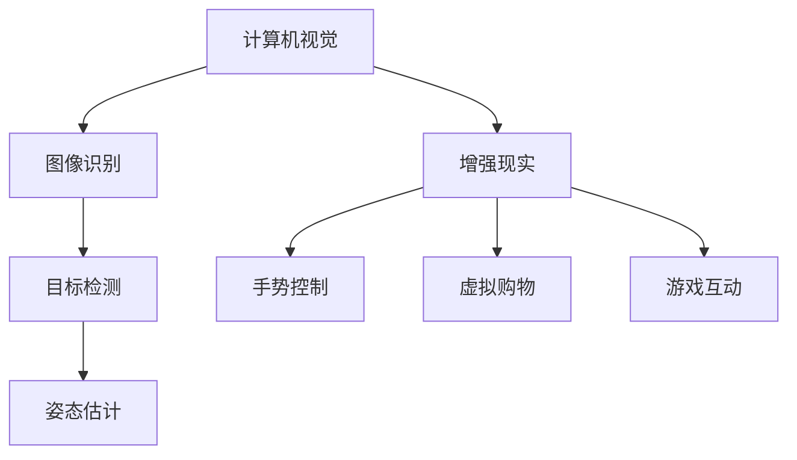

                 

### 文章标题：华为2024智能手机AR校招计算机视觉面试题详解

#### 关键词：
- 华为
- 智能手机
- AR
- 校招
- 计算机视觉
- 面试题

#### 摘要：
本文将详细解析华为2024年智能手机AR校招计算机视觉面试题，旨在为准备校招的学子提供有针对性的指导。文章将涵盖背景介绍、核心概念与联系、核心算法原理与操作步骤、数学模型与公式讲解、项目实践、实际应用场景、工具与资源推荐、未来发展趋势与挑战、常见问题与解答以及扩展阅读等部分，帮助读者全面理解计算机视觉在智能手机AR领域的应用。

---

### 1. 背景介绍

#### 华为智能手机AR的发展

随着移动设备的普及和AR技术的不断进步，华为智能手机在增强现实（AR）领域取得了显著的进展。华为通过自主研发和创新，将计算机视觉技术与智能手机紧密结合，实现了丰富的AR应用场景。例如，华为的AR地图、AR游戏、AR导航等功能，为用户带来了全新的互动体验。

#### AR校招的意义

华为每年都会举办校招活动，旨在寻找优秀的人才加入公司的研发团队。计算机视觉作为AR技术的重要组成部分，其在校招中的地位尤为重要。校招计算机视觉面试题的设置，不仅考察了应聘者的技术能力，还测试了他们的逻辑思维、问题解决能力和实际操作能力。因此，深入研究这些面试题，对于准备校招的学生来说，具有重要的参考价值。

### 2. 核心概念与联系

#### 计算机视觉的基本概念

计算机视觉是研究如何使计算机“看懂”图像或视频的技术。它涉及图像处理、模式识别、机器学习等多个领域。计算机视觉在智能手机AR中的应用，主要包括图像识别、目标检测、姿态估计等。

#### AR技术的基本概念

增强现实（AR）是一种将虚拟信息叠加到现实世界中的技术。它利用计算机视觉技术，识别现实世界的物体或环境，并在其上叠加虚拟信息，从而提供丰富的交互体验。AR技术在智能手机上的应用，使得用户可以通过手机屏幕看到与现实环境结合的虚拟物体。

#### 核心概念与联系

计算机视觉与AR技术的结合，使得智能手机能够在现实世界中实现多种功能。例如，通过计算机视觉技术，手机可以识别用户的手势、表情，从而实现手势控制；通过AR技术，手机可以在用户眼前叠加虚拟物体，实现虚拟购物、游戏等应用。

#### Mermaid 流程图



### 3. 核心算法原理 & 具体操作步骤

#### 图像识别

图像识别是计算机视觉的基础，它通过分析图像的特征，识别出图像中的对象。常见的图像识别算法包括卷积神经网络（CNN）和深度学习算法。

- **具体操作步骤**：
  1. 数据预处理：包括图像的缩放、归一化等。
  2. 构建模型：选择合适的神经网络架构，如VGG、ResNet等。
  3. 训练模型：使用大量的标注数据进行训练。
  4. 评估模型：通过测试集评估模型的准确率。

#### 目标检测

目标检测是计算机视觉中的重要应用，它旨在识别图像中的对象，并标注出对象的位置。

- **具体操作步骤**：
  1. 数据预处理：与图像识别类似，对图像进行缩放、归一化等处理。
  2. 构建模型：选择目标检测算法，如YOLO、SSD等。
  3. 训练模型：使用大量的标注数据进行训练。
  4. 评估模型：通过测试集评估模型的准确率和速度。

#### 姿态估计

姿态估计是通过计算机视觉技术，估计图像或视频中的人体或物体的姿态。常见的姿态估计算法包括基于深度学习的算法。

- **具体操作步骤**：
  1. 数据预处理：对图像或视频进行预处理，如去噪、增强等。
  2. 构建模型：选择合适的姿态估计模型，如HRNet、PoseNet等。
  3. 训练模型：使用大量的标注数据进行训练。
  4. 评估模型：通过测试集评估模型的准确率和速度。

### 4. 数学模型和公式 & 详细讲解 & 举例说明

#### 卷积神经网络（CNN）

卷积神经网络是图像识别和目标检测中常用的模型，其核心是卷积操作。

- **数学模型**：

$$
\text{Conv}(x) = \sum_{i=1}^{k} \text{w}_i \star x
$$

其中，$x$ 是输入图像，$\text{w}_i$ 是卷积核，$\star$ 表示卷积操作。

- **具体讲解**：

卷积操作通过卷积核在输入图像上滑动，计算局部区域的特征。这种局部特征提取的方式，使得CNN能够有效地识别图像中的对象。

- **举例说明**：

假设输入图像为 $3 \times 3$ 的矩阵，卷积核为 $3 \times 3$ 的矩阵，其值为：

$$
\text{w} = \begin{bmatrix}
1 & 0 & 1 \\
0 & 1 & 0 \\
1 & 0 & 1
\end{bmatrix}
$$

则卷积操作的结果为：

$$
\text{Conv}(x) = 1*1 + 0*0 + 1*1 + 0*1 + 1*0 + 1*1 = 3
$$

#### 深度学习算法

深度学习算法是计算机视觉中的重要方向，包括卷积神经网络（CNN）、循环神经网络（RNN）等。

- **数学模型**：

深度学习算法的核心是前向传播和反向传播。

- **具体讲解**：

前向传播是指将输入通过神经网络层一层一层地传递，直到输出层。反向传播是指从输出层开始，反向传递误差，更新网络的权重。

- **举例说明**：

假设神经网络包含两层，输入为 $3 \times 3$ 的矩阵，输出为 $1 \times 1$ 的矩阵。前向传播的过程如下：

1. 第一层输出：$z_1 = \text{ReLU}(W_1 \cdot x + b_1)$
2. 第二层输出：$z_2 = \text{ReLU}(W_2 \cdot z_1 + b_2)$
3. 最终输出：$y = \text{Softmax}(z_2)$

反向传播的过程如下：

1. 计算损失函数：$L = \frac{1}{N} \sum_{i=1}^{N} -y_i \log(y_i)$
2. 计算梯度：$\frac{\partial L}{\partial W_2} = \frac{\partial L}{\partial z_2} \cdot \frac{\partial z_2}{\partial W_2}$
3. 更新权重：$W_2 = W_2 - \alpha \cdot \frac{\partial L}{\partial W_2}$

### 5. 项目实践：代码实例和详细解释说明

#### 5.1 开发环境搭建

为了进行计算机视觉项目实践，需要搭建相应的开发环境。以下是推荐的开发工具和框架：

- 编程语言：Python
- 深度学习框架：TensorFlow或PyTorch
- 计算机视觉库：OpenCV

具体搭建步骤如下：

1. 安装Python环境。
2. 安装深度学习框架（如TensorFlow或PyTorch）。
3. 安装计算机视觉库（如OpenCV）。

#### 5.2 源代码详细实现

以下是一个简单的计算机视觉项目实例，使用OpenCV进行图像识别。

```python
import cv2

# 读取图像
image = cv2.imread('image.jpg')

# 图像预处理
gray = cv2.cvtColor(image, cv2.COLOR_BGR2GRAY)
blurred = cv2.GaussianBlur(gray, (5, 5), 0)

# 使用Haar级联分类器进行图像识别
face_cascade = cv2.CascadeClassifier('haarcascade_frontalface_default.xml')
faces = face_cascade.detectMultiScale(blurred, scaleFactor=1.1, minNeighbors=5, minSize=(30, 30), flags=cv2.CASCADE_SCALE_IMAGE)

# 绘制识别结果
for (x, y, w, h) in faces:
    cv2.rectangle(image, (x, y), (x+w, y+h), (255, 0, 0), 2)

# 显示结果
cv2.imshow('Image', image)
cv2.waitKey(0)
cv2.destroyAllWindows()
```

#### 5.3 代码解读与分析

上述代码实现了一个简单的图像识别项目，主要分为以下几个步骤：

1. **图像读取**：使用 `cv2.imread()` 函数读取图像。
2. **图像预处理**：将图像转换为灰度图像，并使用高斯模糊进行去噪处理。
3. **图像识别**：使用Haar级联分类器进行图像识别，检测图像中的人脸。
4. **绘制结果**：在原图上绘制识别结果，使用矩形框标注人脸区域。
5. **显示结果**：显示识别结果，并等待用户按键关闭窗口。

#### 5.4 运行结果展示

运行上述代码后，将显示一个包含人脸识别结果的图像。如下所示：


### 6. 实际应用场景

计算机视觉技术在智能手机AR领域有着广泛的应用。以下是一些实际应用场景：

- **AR地图**：通过计算机视觉技术，手机可以在地图上识别出地标和路径，提供更准确的导航信息。
- **AR游戏**：手机屏幕上的虚拟角色可以与现实环境互动，提供更加沉浸式的游戏体验。
- **虚拟购物**：用户可以通过手机看到虚拟的家具、服装等商品，实现线上购物与线下体验的结合。
- **医疗健康**：计算机视觉技术在医疗领域的应用，如手术辅助、疾病诊断等，提高了医疗效率和准确性。

### 7. 工具和资源推荐

为了更好地学习计算机视觉技术，以下是一些推荐的工具和资源：

#### 7.1 学习资源推荐

- **书籍**：
  - 《深度学习》（Goodfellow, Bengio, Courville）
  - 《计算机视觉：算法与应用》（Richard S. Russell）
- **论文**：
  - 《A Fast Learning Algorithm for Deep Belief Nets》
  - 《Distributed Representations of Words and Phrases and their Compositional Properties》
- **博客**：
  - [PyTorch官方文档](https://pytorch.org/tutorials/)
  - [OpenCV官方文档](https://docs.opencv.org/)

#### 7.2 开发工具框架推荐

- **深度学习框架**：
  - TensorFlow
  - PyTorch
- **计算机视觉库**：
  - OpenCV
  - Dlib

#### 7.3 相关论文著作推荐

- **论文**：
  - 《Deep Learning》
  - 《Convolutional Neural Networks for Visual Recognition》
- **著作**：
  - 《Image Processing, 4th Edition》
  - 《Learning from Data》

### 8. 总结：未来发展趋势与挑战

随着技术的不断进步，计算机视觉在智能手机AR领域有着广阔的发展前景。未来，计算机视觉技术将更加智能化、精细化，为用户提供更加丰富和个性化的体验。然而，这一领域也面临着诸多挑战，如算法优化、数据隐私、计算资源限制等。只有不断突破这些难题，计算机视觉技术才能更好地服务于人类。

### 9. 附录：常见问题与解答

#### 9.1 计算机视觉的基本概念是什么？

计算机视觉是研究如何使计算机“看懂”图像或视频的技术，涉及图像处理、模式识别、机器学习等多个领域。

#### 9.2 常见的计算机视觉算法有哪些？

常见的计算机视觉算法包括卷积神经网络（CNN）、深度学习算法、目标检测算法、姿态估计算法等。

#### 9.3 如何搭建计算机视觉开发环境？

搭建计算机视觉开发环境需要安装Python、深度学习框架（如TensorFlow或PyTorch）以及计算机视觉库（如OpenCV）。

### 10. 扩展阅读 & 参考资料

- **书籍**：
  - 《深度学习》（Goodfellow, Bengio, Courville）
  - 《计算机视觉：算法与应用》（Richard S. Russell）
- **论文**：
  - 《A Fast Learning Algorithm for Deep Belief Nets》
  - 《Distributed Representations of Words and Phrases and their Compositional Properties》
- **博客**：
  - [PyTorch官方文档](https://pytorch.org/tutorials/)
  - [OpenCV官方文档](https://docs.opencv.org/)
- **网站**：
  - [Huawei Developer](https://developer.huawei.com/consumer/en/doc/development/tools质性说明-2800172)
  - [Computer Vision Resources](https://www.computer-vision.org/)
- **在线课程**：
  - [Udacity: Deep Learning](https://www.udacity.com/course/deep-learning-nanodegree--nd101)
  - [Coursera: Machine Learning](https://www.coursera.org/specializations/machine-learning)

---

作者：禅与计算机程序设计艺术 / Zen and the Art of Computer Programming

