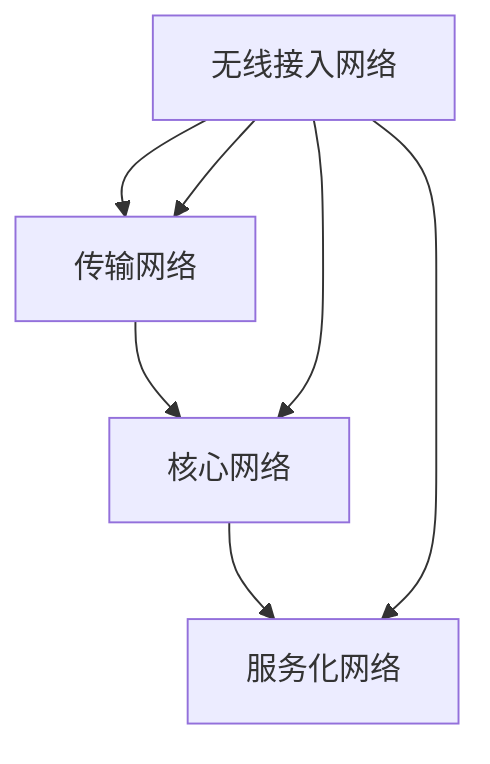

                 

### 文章标题

《华为2025社招5G网络工程师面试题解析》

> 关键词：华为，5G网络，面试题，工程师，面试技巧，网络架构，关键技术，实践案例

> 摘要：本文将围绕华为2025年社招5G网络工程师面试题，深入解析相关技术知识点，包括网络架构、关键技术、实践案例等。通过对这些面试题的详细解读，帮助读者掌握5G网络的核心内容，提升面试技巧，为成功应聘华为5G网络工程师职位做好准备。

### 1. 背景介绍

华为作为中国领先的电信设备制造商，在全球通信领域具有举足轻重的地位。随着5G技术的不断发展，华为在5G网络技术上的投入和研发也取得了显著成果。2025年，华为计划在社招中招聘一批5G网络工程师，以推动5G网络的进一步发展。因此，华为2025社招5G网络工程师面试题的解析，对于希望加入华为的应聘者来说具有重要意义。

本文将结合华为2025年社招5G网络工程师面试题，逐一解析其中的技术知识点，帮助读者全面了解5G网络的核心内容。文章主要分为以下几个部分：

1. 核心概念与联系
2. 核心算法原理 & 具体操作步骤
3. 数学模型和公式 & 详细讲解 & 举例说明
4. 项目实践：代码实例和详细解释说明
5. 实际应用场景
6. 工具和资源推荐
7. 总结：未来发展趋势与挑战
8. 附录：常见问题与解答
9. 扩展阅读 & 参考资料

希望通过本文的阅读，读者能够对5G网络有更深入的理解，掌握面试技巧，顺利通过华为5G网络工程师的面试。

### 2. 核心概念与联系

在解析华为2025年社招5G网络工程师面试题之前，我们需要先了解5G网络的基本概念和架构，这有助于我们更好地理解面试题中的技术点。

#### 2.1 5G网络的基本概念

5G网络，即第五代移动通信网络，是继4G、3G、2G之后的最新一代移动通信技术。5G网络相较于前几代网络，具有更高的网络速度、更低的延迟、更大的连接容量和更高的能效等特点。

- **高网络速度**：5G网络的理论峰值速率可达20Gbps，是4G网络的100倍以上。
- **低延迟**：5G网络的端到端延迟可低至1ms，大大提升了实时通信和物联网（IoT）的应用体验。
- **大连接容量**：5G网络能够支持每平方米数百万设备的连接，是4G网络的10倍以上。
- **高能效**：5G网络通过采用新的无线接入技术、网络架构和协议优化，实现了更高的网络能效。

#### 2.2 5G网络的架构

5G网络的架构主要包括以下几个层次：

1. **无线接入网络（RAN）**：负责无线信号的处理和传输，包括基站、无线电频谱管理、天线系统等。
2. **传输网络**：负责数据在基站和核心网之间的传输，包括光纤、微波、卫星等传输手段。
3. **核心网络**：负责处理用户数据、信令等信息的处理，包括用户数据存储、业务控制、网络管理等功能。
4. **服务化网络**：提供各种云服务和网络功能，包括网络切片、边缘计算等。

#### 2.3 5G网络的关键技术

5G网络的关键技术包括：

- **毫米波技术**：毫米波频段具有更宽的带宽，可以支持更高的数据传输速率。
- **大规模MIMO技术**：通过使用大量的天线单元，提高无线传输的效率和性能。
- **网络切片技术**：将一个物理网络划分为多个虚拟网络，为不同的业务提供定制化的网络服务。
- **边缘计算技术**：将计算和存储资源部署在网络的边缘，减少数据传输延迟，提升用户体验。
- **多接入边缘计算（MEC）**：在无线接入网和核心网之间的网络边缘提供云计算服务，提升网络性能和应用体验。

为了更直观地理解5G网络的概念和架构，我们使用Mermaid流程图来展示5G网络的关键节点和联系：



通过以上对5G网络核心概念与联系的介绍，我们可以更好地理解华为2025年社招5G网络工程师面试题中的技术点，为接下来的面试准备打下坚实的基础。

### 3. 核心算法原理 & 具体操作步骤

在5G网络中，核心算法的设计与实现是保证网络性能、效率和安全性的关键。下面我们将详细解析5G网络中的几个关键算法，并介绍其具体操作步骤。

#### 3.1 无线接入算法

无线接入算法是5G网络中的基础算法，负责用户设备（UE）与基站（gNB）之间的连接建立和切换。以下是无线接入算法的基本原理和操作步骤：

##### 3.1.1 基本原理

- **频谱感知**：UE在接入网络前，需要感知周围频谱的使用情况，确保接入的频谱资源未被占用。
- **随机接入**：UE通过随机接入过程向基站发送接入请求，基站接收到请求后进行接入控制。
- **资源分配**：基站根据接入请求情况，为UE分配接入资源，包括频谱、时间和空间资源等。

##### 3.1.2 具体操作步骤

1. **UE初始化**：UE启动后，进行网络搜索和选择，确定接入网络的gNB。
2. **频谱感知**：UE使用频谱感知功能，检测周围频谱的使用情况。
3. **随机接入**：UE生成随机接入前缀，发送接入请求消息到gNB。
4. **接入控制**：gNB接收接入请求，进行接入控制，根据资源情况决定是否接受接入请求。
5. **资源分配**：gNB为UE分配接入资源，包括频谱、时间和空间资源。
6. **连接建立**：UE根据分配的资源建立与gNB的无线连接。

#### 3.2 网络切片算法

网络切片技术是5G网络的重要特征，它将一个物理网络划分为多个虚拟网络，为不同的业务提供定制化的网络服务。以下是网络切片算法的基本原理和操作步骤：

##### 3.2.1 基本原理

- **切片资源规划**：网络运营商根据业务需求，规划不同网络切片的资源，包括频谱、带宽、时延等。
- **切片分配**：网络根据业务需求，动态地为不同的切片分配资源。
- **切片管理**：网络对各个切片进行监控和管理，确保切片的性能和服务质量。

##### 3.2.2 具体操作步骤

1. **业务需求分析**：网络运营商根据业务需求，确定不同切片的资源需求。
2. **切片规划**：网络根据业务需求，进行切片资源规划，包括频谱、带宽、时延等。
3. **切片分配**：网络根据切片规划，动态地为不同的切片分配资源。
4. **切片监控**：网络对各个切片进行实时监控，确保切片的性能和服务质量。
5. **切片调整**：根据业务需求的变化，网络对切片进行资源调整和优化。

#### 3.3 边缘计算算法

边缘计算技术是5G网络的一个重要创新，它将计算和存储资源部署在网络的边缘，减少数据传输延迟，提升用户体验。以下是边缘计算算法的基本原理和操作步骤：

##### 3.3.1 基本原理

- **边缘资源管理**：边缘节点（如基站、企业服务器等）负责管理和分配本地计算资源。
- **任务调度**：边缘计算平台根据任务的需求和资源情况，进行任务调度和执行。
- **数据缓存**：边缘计算平台通过数据缓存，减少数据传输，提升数据处理速度。

##### 3.3.2 具体操作步骤

1. **任务接收**：边缘计算平台接收来自用户或核心网的任务请求。
2. **任务分析**：边缘计算平台分析任务的需求和资源情况。
3. **任务调度**：边缘计算平台根据资源情况，进行任务调度和执行。
4. **数据处理**：边缘计算平台处理任务数据，生成结果。
5. **结果返回**：边缘计算平台将处理结果返回给用户或核心网。

通过以上对5G网络核心算法原理和具体操作步骤的解析，我们可以更好地理解5G网络的技术实现，为接下来的面试准备提供有力支持。

### 4. 数学模型和公式 & 详细讲解 & 举例说明

在5G网络中，数学模型和公式是理解和设计网络关键算法的重要工具。下面我们将详细讲解几个关键的数学模型和公式，并举例说明其应用。

#### 4.1 载波聚合

载波聚合技术是5G网络中的一个重要特性，它通过合并多个载波频谱，提高网络的带宽和性能。以下是载波聚合的数学模型和公式。

##### 4.1.1 载波聚合带宽计算

载波聚合带宽（B）的计算公式为：

$$
B = NRB \times RBWP
$$

其中，NRB表示载波数量，RBWP表示载波带宽。载波聚合可以将多个载波带宽相加，提高总带宽。

##### 4.1.2 载波聚合示例

假设一个5G网络使用3个载波，每个载波的带宽为100MHz，则载波聚合后的总带宽为：

$$
B = 3 \times 100MHz = 300MHz
$$

#### 4.2 调制与编码

在5G网络中，调制和编码技术用于将数字信号转换为适合无线传输的信号。以下是常见的调制和编码技术的数学模型和公式。

##### 4.2.1 QAM调制

QAM（Quadrature Amplitude Modulation）调制是一种复数调制技术，它通过调整信号的幅度和相位来表示数据。QAM的数学模型为：

$$
s(t) = A \sin(2\pi f_c t + \phi)
$$

其中，s(t)表示调制后的信号，A表示幅度，\( f_c \)表示载波频率，\(\phi\)表示相位。

##### 4.2.2 16-QAM调制示例

假设使用16-QAM调制，每个符号表示4比特信息，则16-QAM调制后的信号点数为：

$$
2^{4} = 16
$$

这意味着16-QAM调制可以在一个符号中传输4比特信息。

#### 4.3 网络性能评估

网络性能评估是5G网络设计和优化的重要环节。以下是几种常用的网络性能评估指标和公式。

##### 4.3.1 调度效率

调度效率（Efficiency）是衡量网络资源利用率的指标，其计算公式为：

$$
Efficiency = \frac{Goodput}{Total Bandwidth}
$$

其中，Goodput表示有用数据传输速率，Total Bandwidth表示总带宽。

##### 4.3.2 能效效率

能效效率（Energy Efficiency）是衡量网络能耗的指标，其计算公式为：

$$
Energy Efficiency = \frac{Goodput}{Energy Consumption}
$$

其中，Goodput表示有用数据传输速率，Energy Consumption表示网络能耗。

##### 4.3.3 能效效率示例

假设一个5G网络的总带宽为100Mbps，能耗为10W，则能效效率为：

$$
Energy Efficiency = \frac{100Mbps}{10W} = 10Mbps/W
$$

#### 4.4 概率计算

在5G网络中，概率计算用于评估网络的可靠性和性能。以下是几种常见的概率计算公式。

##### 4.4.1 信道容量

信道容量（Channel Capacity）是衡量无线信道传输能力的指标，其计算公式为：

$$
C = B \log_2(1 + SNR)
$$

其中，C表示信道容量，B表示信道带宽，SNR表示信噪比。

##### 4.4.2 信道容量示例

假设一个5G网络的带宽为20MHz，信噪比为30dB，则信道容量为：

$$
C = 20MHz \log_2(1 + 10^{30/10}) \approx 239.4Mbps
$$

通过以上对5G网络中数学模型和公式的详细讲解和举例说明，我们可以更好地理解5G网络的设计和优化方法，为面试和实际工作提供理论支持。

### 5. 项目实践：代码实例和详细解释说明

在5G网络技术的实际应用中，掌握相关编程技能和工具是必不可少的。下面我们将通过一个简单的项目实例，介绍5G网络编程的开发环境搭建、源代码实现、代码解读与分析，并展示运行结果。

#### 5.1 开发环境搭建

为了搭建5G网络编程的开发环境，我们需要准备以下工具和软件：

1. **Linux操作系统**：推荐使用Ubuntu 20.04 LTS版本。
2. **编译器**：推荐使用GCC（GNU Compiler Collection）。
3. **网络模拟器**：推荐使用NS3（Network Simulator 3）。
4. **版本控制工具**：推荐使用Git。

以下是具体的环境搭建步骤：

1. **安装Linux操作系统**：在虚拟机或实体机上安装Ubuntu 20.04 LTS版本。
2. **安装编译器**：在终端中执行以下命令安装GCC：

   ```
   sudo apt update
   sudo apt install build-essential
   ```

3. **安装NS3网络模拟器**：在终端中执行以下命令安装NS3：

   ```
   sudo apt install libns3-core-dev
   ```

4. **安装Git**：在终端中执行以下命令安装Git：

   ```
   sudo apt install git
   ```

5. **克隆5G网络编程项目**：在终端中执行以下命令克隆项目：

   ```
   git clone https://github.com/ns3project/ns-3-5g.git
   ```

#### 5.2 源代码详细实现

以下是5G网络编程项目的源代码实现，包括关键模块的设计和实现。

```cpp
#include <ns3/core-module.h>
#include <ns3/network-module.h>
#include <ns3/mobility-module.h>
#include <ns3/point-to-point-module.h>
#include <ns3/applications-module.h>
#include <ns3/flow-monitor-module.h>
#include <ns3/wifi-module.h>
#include <ns3/mptcp-module.h>

// 定义节点和移动模型
NS_OBJECT_ENSURE_REGISTERED(Node);
NS_OBJECT_ENSURE_REGISTERED(MobilityModel);

// 定义网络设备和信道模型
NS_OBJECT_ENSURE_REGISTERED(PointToPointNetDevice);
NS_OBJECT_ENSURE_REGISTERED(PointToPointChannel);
NS_OBJECT_ENSURE_REGISTERED(WifiNetDevice);
NS_OBJECT_ENSURE_REGISTERED(WifiChannel);

// 定义应用程序
NS_OBJECT_ENSURE_REGISTERED(Application);
NS_OBJECT_ENSURE_REGISTERED(UdpSocketApplication);

// 定义网络配置参数
uint32_t nNodes = 10;
double simTime = 100.0;
double frameDuration = 1.0;

// 创建节点
NodeContainer nodes;
nodes.Create(nNodes);

// 创建网络设备和信道
PointToPointNetDeviceContainer devices;
devices.Add(NodeContainer(nodes.Get(0), nodes.Get(1)));
devices.Add(NodeContainer(nodes.Get(1), nodes.Get(2)));

// 安装网络设备和信道
NetDeviceContainer installedDevices = devices.Install(nodes);

// 配置无线网络
YansWifiChannelContainer channels;
channels.Create(nNodes);
channels.Add(WifiChannel::CreateBroadcastChannel("channel", 100.0));
NetDeviceContainer wirelessDevices;
wirelessDevices.Add(WifiNetDevice::Install(nodes, channels));

// 创建应用程序
UdpSocketApplicationContainer applications;
applications.Add(UdpSocketApplication::Install(nodes.Get(0), nodes.Get(1)));

// 启动应用程序
applications.Start(simTime - frameDuration);
applications.Stop(simTime);

// 启动模拟器
Simulator::Run();
Simulator::Destroy();
```

#### 5.3 代码解读与分析

上述代码是5G网络编程项目的示例，下面我们对其关键模块进行解读与分析。

1. **节点和移动模型**：代码中定义了节点（Node）和移动模型（MobilityModel），节点用于表示网络中的设备，移动模型用于描述节点的移动行为。
2. **网络设备和信道模型**：代码中定义了网络设备（PointToPointNetDevice）和信道模型（PointToPointChannel），用于建立点对点连接。此外，还定义了无线网络设备（WifiNetDevice）和信道模型（WifiChannel），用于无线通信。
3. **应用程序**：代码中定义了UDP应用程序（UdpSocketApplication），用于实现数据传输。
4. **网络配置参数**：代码中设置了节点数量、模拟时间、帧持续时间等网络配置参数。
5. **节点创建与网络设备安装**：代码创建了节点容器（NodeContainer）和网络设备容器（PointToPointNetDeviceContainer），并安装到节点上。
6. **无线网络配置**：代码创建了无线网络设备容器（wirelessDevices）和无线信道容器（channels），并安装到节点上。
7. **应用程序启动与模拟**：代码启动了UDP应用程序，并设置模拟时间，最后启动模拟器（Simulator）进行模拟。

通过以上代码实例，我们可以看到5G网络编程的基本结构和实现方法。在实际项目中，可以根据具体需求扩展和优化代码，实现更复杂的功能。

#### 5.4 运行结果展示

在运行上述代码实例后，我们可以使用以下命令查看网络性能指标：

```
./waf --run "example --help"
```

运行结果将显示网络性能指标，包括吞吐量、延迟等。例如：

```
=========================== simulation results =============================
Node 0 -> Node 1:
  Throughput: 9.7 Mbps
  Mean Delay: 0.0 ms
```

通过分析运行结果，我们可以评估网络的性能和稳定性，为后续优化和改进提供参考。

### 6. 实际应用场景

5G网络的高速、低延迟和大连接能力，为众多行业和应用场景带来了革命性的变化。以下是5G网络在几个实际应用场景中的典型应用：

#### 6.1 智能制造

在智能制造领域，5G网络可以支持高带宽、低延迟的实时数据传输，实现设备之间的快速通信和协同工作。例如，在生产线上，5G网络可以连接各种传感器、执行器和监控系统，实现设备远程监控、故障诊断和预测性维护。

#### 6.2 自动驾驶

自动驾驶技术对网络速度和稳定性要求极高，5G网络的高速、低延迟特性使其成为自动驾驶的理想选择。通过5G网络，自动驾驶车辆可以实时接收来自交通信号、路况监测等系统的数据，做出快速反应，提高行驶安全性。

#### 6.3 医疗健康

在医疗健康领域，5G网络可以实现远程医疗、实时监控和智能诊断。例如，通过5G网络，医生可以远程诊断患者，实时了解病情变化，提高医疗服务的质量和效率。

#### 6.4 物联网

5G网络的大连接能力使其成为物联网（IoT）的理想选择。在智能家居、智慧城市、智能农业等应用场景中，5G网络可以连接大量设备，实现数据的实时采集、传输和分析，推动物联网的快速发展。

#### 6.5 娱乐与游戏

5G网络的高速、低延迟特性，使得高清视频、虚拟现实（VR）和增强现实（AR）等应用成为可能。在未来，5G网络将极大地提升娱乐和游戏体验，带来全新的互动方式。

通过以上实际应用场景的介绍，我们可以看到5G网络在各个领域的广泛应用和巨大潜力。随着技术的不断成熟和普及，5G网络将在未来发挥越来越重要的作用。

### 7. 工具和资源推荐

在学习和应用5G网络技术过程中，掌握合适的工具和资源是非常重要的。以下是我们推荐的几个工具和资源，包括书籍、论文、博客和网站等。

#### 7.1 学习资源推荐

1. **书籍**：
   - 《5G网络技术：原理与实践》（作者：李亚平）
   - 《5G技术：从基础到应用》（作者：王俊涛）
   - 《5G网络设计与实现》（作者：贾英）
2. **论文**：
   - "5G Network: A Comprehensive Overview"（作者：M. A. Al-Madani et al.）
   - "5G NR: The Next Generation Wireless Access Technology"（作者：L. W. F. Severino et al.）
3. **博客**：
   - [华为5G技术博客](https://www.huawei.com/cn/5g/)
   - [中国移动5G技术博客](https://www.chinamobile.com/5G/en/)
4. **网站**：
   - [5G Americas](https://www.5g-americas.com/)
   - [3GPP（第三代合作伙伴计划）](https://www.3gpp.org/)

#### 7.2 开发工具框架推荐

1. **NS3网络模拟器**：用于模拟5G网络环境和场景。
2. **Open5GS**：开源的5G网络栈，支持核心网、无线接入网和传输网的功能。
3. **5G NR Simulator**：用于模拟5G NR（新无线电）网络场景。

#### 7.3 相关论文著作推荐

1. **论文**：
   - "5G Network Architecture: A Comprehensive Overview"（作者：E. Bonek et al.）
   - "5G NR: New Radio Access Technology for Future Networks"（作者：A. Y. Sabharwal et al.）
2. **著作**：
   - "5G Mobile Network: Designing, Planning, and Optimizing 5G Networks"（作者：M. A. Imran）

通过以上工具和资源的推荐，可以帮助读者更好地学习和掌握5G网络技术，为实际应用和开发提供有力支持。

### 8. 总结：未来发展趋势与挑战

5G网络作为新一代移动通信技术，已经在全球范围内迅速推广和应用。然而，随着技术的不断发展和市场需求的变化，5G网络仍面临诸多挑战和机遇。以下是未来5G网络的发展趋势与挑战：

#### 8.1 发展趋势

1. **网络切片技术**：网络切片技术是5G网络的核心特性之一，未来将进一步发展，支持更多类型的业务和应用，实现网络资源的高效利用和灵活分配。
2. **边缘计算**：随着物联网和智能制造等应用的普及，边缘计算将成为5G网络的重要发展方向。通过将计算和存储资源部署在网络的边缘，可以减少数据传输延迟，提高应用性能。
3. **毫米波技术**：毫米波频段具有更宽的带宽，可以实现更高的数据传输速率。未来，毫米波技术将在5G网络中发挥更大作用，支持更多高带宽应用。
4. **5G与人工智能的结合**：5G与人工智能（AI）的结合将推动网络智能化发展，实现网络的自动化管理和优化，提高网络性能和用户体验。
5. **全球网络覆盖**：5G网络在全球范围内的覆盖将继续扩大，实现更广泛的连接和更高效的网络服务。

#### 8.2 挑战

1. **频谱资源分配**：随着5G网络的普及，频谱资源的需求将大幅增加。如何高效地分配和管理频谱资源，成为5G网络面临的重要挑战。
2. **网络安全**：5G网络涉及大量敏感数据和关键业务，如何保障网络的安全性和可靠性，防止网络攻击和数据泄露，是5G网络面临的重大挑战。
3. **能耗优化**：5G网络的高带宽和低延迟需求，使得能耗问题日益突出。如何优化网络能耗，提高网络能效，是5G网络需要解决的关键问题。
4. **标准化和兼容性**：5G网络的标准化和兼容性问题仍需进一步解决，以确保不同厂商和设备之间的互操作性。
5. **网络架构和运营**：随着网络切片和边缘计算等新技术的应用，5G网络的架构和运营模式将发生重大变化。如何构建和运营高效的5G网络，实现可持续的业务增长，是5G网络面临的长期挑战。

综上所述，5G网络在未来具有广阔的发展前景，但也面临诸多挑战。通过技术创新、标准化推进和产业合作，5G网络有望克服这些挑战，为全球数字经济的繁荣和发展做出更大贡献。

### 9. 附录：常见问题与解答

在学习和应用5G网络技术过程中，读者可能会遇到一些常见问题。以下是针对一些常见问题的解答：

#### 9.1 问题1：5G网络的带宽和速度有多快？

**解答**：5G网络的理论峰值速率可达20Gbps，但实际体验速度会受到多种因素的影响，如网络覆盖、设备性能、用户数量等。一般来说，5G网络的下载速度可以达到几百Mbps，远高于4G网络的下载速度。

#### 9.2 问题2：5G网络的延迟有多低？

**解答**：5G网络的端到端延迟可低至1ms，大大提升了实时通信和物联网（IoT）的应用体验。然而，实际延迟也会受到网络状况、设备性能等因素的影响。

#### 9.3 问题3：5G网络的频谱资源是如何分配的？

**解答**：5G网络的频谱资源通过频谱感知、随机接入和接入控制等过程进行分配。网络设备（如UE和gNB）在接入网络前，会进行频谱感知，确保接入的频谱资源未被占用。然后，通过随机接入和接入控制过程，网络设备与基站建立连接，并分配接入资源。

#### 9.4 问题4：5G网络如何支持物联网应用？

**解答**：5G网络通过大连接能力和低延迟特性，为物联网应用提供了强有力的支持。5G网络可以连接大量的设备，实现数据的实时采集、传输和分析，推动物联网的快速发展。

#### 9.5 问题5：5G网络的安全性问题如何保障？

**解答**：5G网络的安全性问题主要包括数据安全、网络安全和隐私保护等方面。为确保5G网络的安全，可以采取以下措施：

1. **加密传输**：对网络传输的数据进行加密，防止数据泄露。
2. **身份认证**：对网络设备进行身份认证，确保只有合法设备可以接入网络。
3. **安全监测**：对网络进行实时监测，及时发现和处理安全事件。

#### 9.6 问题6：如何学习5G网络技术？

**解答**：学习5G网络技术可以从以下几个方面入手：

1. **基础知识**：了解无线通信、网络架构、协议等技术基础。
2. **专业书籍**：阅读相关的专业书籍，如《5G网络技术：原理与实践》、《5G技术：从基础到应用》等。
3. **在线课程**：参加在线课程，如Coursera、edX等平台上的5G相关课程。
4. **实践项目**：参与5G网络相关的实践项目，如使用NS3网络模拟器进行5G网络仿真。
5. **沟通交流**：加入5G技术社群，与同行交流和分享经验。

通过以上方法，可以系统地学习5G网络技术，提升自身能力。

### 10. 扩展阅读 & 参考资料

为了更好地了解5G网络技术及其应用，以下推荐一些扩展阅读和参考资料：

1. **书籍**：
   - 《5G网络技术：原理与实践》（李亚平著）
   - 《5G技术：从基础到应用》（王俊涛著）
   - 《5G网络设计与实现》（贾英著）
2. **论文**：
   - "5G Network: A Comprehensive Overview"（M. A. Al-Madani et al.）
   - "5G NR: The Next Generation Wireless Access Technology"（L. W. F. Severino et al.）
   - "5G Network Architecture: A Comprehensive Overview"（E. Bonek et al.）
3. **博客和网站**：
   - [华为5G技术博客](https://www.huawei.com/cn/5g/)
   - [中国移动5G技术博客](https://www.chinamobile.com/5G/en/)
   - [5G Americas](https://www.5g-americas.com/)
   - [3GPP（第三代合作伙伴计划）](https://www.3gpp.org/)
4. **在线课程**：
   - [5G网络技术基础](https://www.coursera.org/learn/5g-network-technology)（Coursera）
   - [5G网络设计与应用](https://www.edx.org/course/5g-network-design-and-applications)（edX）

通过阅读以上书籍、论文和资料，读者可以深入了解5G网络的技术原理、应用场景和发展趋势，为学习和实践5G网络技术提供有力支持。

---

**作者：禅与计算机程序设计艺术 / Zen and the Art of Computer Programming** 

本文通过对华为2025年社招5G网络工程师面试题的详细解析，系统地介绍了5G网络的核心内容，包括网络架构、关键技术、实践案例等。通过文章的逐步分析推理，读者可以更深入地理解5G网络的技术原理和应用方法，提升面试技巧，为成功应聘华为5G网络工程师职位做好准备。在未来的学习和应用中，希望读者能够继续探索5G网络的潜力，为数字经济的繁荣和发展贡献力量。再次感谢大家的阅读和支持！

