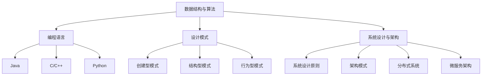

                 

### 1. 背景介绍

**2025华为社招编程面试题精选与解答** 一书，旨在为广大计算机编程爱好者以及即将步入职场的技术新人提供宝贵的面试经验与解题技巧。随着信息技术的飞速发展，编程已成为现代职场的一项基础技能。无论是软件开发工程师、数据分析师还是人工智能研究员，掌握扎实的编程能力都是通往成功的关键。

华为作为中国乃至全球领先的科技公司，每年都会招聘大量优秀的技术人才。其社招编程面试题不仅考察应聘者的编程基础，还要求应聘者具备解决实际问题的能力。因此，对这些面试题的深入研究与解答，不仅有助于求职者提高面试成功率，也能为技术爱好者提供全面的技术提升方案。

本文将围绕2025年华为社招编程面试题，精选出若干典型题目，并对其进行详细解答。通过这篇文章，我们希望能帮助读者更好地理解面试题背后的核心知识点，掌握解题思路和方法，提高编程能力。

### 2. 核心概念与联系

要解答华为的编程面试题，首先需要理解以下几个核心概念及其相互之间的联系：

#### 数据结构与算法

数据结构与算法是计算机科学的基础，贯穿于整个编程领域。常见的数据结构包括数组、链表、栈、队列、树、图等。每种数据结构都有其独特的特点和应用场景。算法则是指解决问题的步骤和策略，常见的算法有排序算法、搜索算法、动态规划算法等。

#### 编程语言

编程语言是编写程序的工具，不同的编程语言具有不同的语法和特点。常见的编程语言包括C/C++、Java、Python、JavaScript等。每种语言都有其适用的场景和优势。

#### 设计模式

设计模式是解决软件设计问题的经验总结，包括创建型、结构型和行为型模式等。掌握设计模式有助于提高代码的可读性、可维护性和扩展性。

#### 系统设计与架构

系统设计与架构是指如何构建一个稳定、高效、可扩展的系统。涉及到的内容包括系统设计原则、架构模式、分布式系统、微服务架构等。

下面是关于这些核心概念的 Mermaid 流程图（注意，流程图中不要有括号、逗号等特殊字符）：



通过上述流程图，我们可以清晰地看到各个核心概念之间的联系和层次结构。在接下来的章节中，我们将逐一深入探讨这些概念，并运用它们解决华为编程面试题。

### 3. 核心算法原理 & 具体操作步骤

在计算机科学中，算法是解决特定问题的系统方法。算法的核心在于其解决问题的效率和正确性。本章节将介绍几类常见的核心算法原理及其具体操作步骤，为解答华为编程面试题奠定基础。

#### 排序算法

排序算法是将一组数据按照一定的顺序进行排列的算法。常见的排序算法有冒泡排序、选择排序、插入排序、快速排序、归并排序等。

**冒泡排序（Bubble Sort）**

- **原理**：通过反复遍历要排序的数列，一次比较两个元素，如果他们的顺序错误就把他们交换过来。遍历数列的工作是重复进行直到没有再需要交换，也就是说该数列已经排序完成。
- **具体操作步骤**：
  1. 从第一个元素开始，比较相邻的两个元素，如果第一个比第二个大（假设升序排列），就交换它们的位置。
  2. 然后继续对下一对元素进行同样的操作，一直到最后一个元素。这时候最后元素会是最大的元素。
  3. 接下来，除了最后一个元素，继续进行相同的操作。
  4. 重复以上步骤，直到整个数列有序。

**示例代码（Python）**：

```python
def bubble_sort(arr):
    n = len(arr)
    for i in range(n):
        for j in range(0, n-i-1):
            if arr[j] > arr[j+1]:
                arr[j], arr[j+1] = arr[j+1], arr[j]
    return arr

# 测试
arr = [64, 34, 25, 12, 22, 11, 90]
print("原始数组：", arr)
sorted_arr = bubble_sort(arr)
print("排序后的数组：", sorted_arr)
```

**时间复杂度**：O(n^2)

#### 搜索算法

搜索算法是在数据集合中查找特定元素的算法。常见的搜索算法有线性搜索、二分搜索等。

**线性搜索（Linear Search）**

- **原理**：从数据集合的第一个元素开始，依次对比，直到找到目标元素或到达集合末尾。
- **具体操作步骤**：
  1. 从第一个元素开始，逐个对比。
  2. 如果找到目标元素，返回其索引。
  3. 如果到达末尾仍未找到，返回-1。

**示例代码（Python）**：

```python
def linear_search(arr, target):
    for i in range(len(arr)):
        if arr[i] == target:
            return i
    return -1

# 测试
arr = [64, 34, 25, 12, 22, 11, 90]
target = 22
print("目标元素索引：", linear_search(arr, target))
```

**时间复杂度**：O(n)

**二分搜索（Binary Search）**

- **原理**：在一个有序的数据集合中，通过不断缩小查找范围，直到找到目标元素或确定其不存在。
- **具体操作步骤**：
  1. 确定中间元素。
  2. 如果中间元素等于目标，则查找成功。
  3. 如果中间元素大于目标，则在左半部分继续查找。
  4. 如果中间元素小于目标，则在右半部分继续查找。
  5. 重复上述步骤，直到找到目标或确定不存在。

**示例代码（Python）**：

```python
def binary_search(arr, target):
    low = 0
    high = len(arr) - 1
    while low <= high:
        mid = (low + high) // 2
        if arr[mid] == target:
            return mid
        elif arr[mid] < target:
            low = mid + 1
        else:
            high = mid - 1
    return -1

# 测试
arr = [1, 3, 5, 7, 9, 11, 13, 15, 17, 19, 21]
target = 7
print("目标元素索引：", binary_search(arr, target))
```

**时间复杂度**：O(log n)

#### 动态规划算法

动态规划是一种解决最优化问题的算法思想，通过将大问题分解为小问题，并存储其解以避免重复计算，从而实现优化。

**0-1背包问题**

- **原理**：给定一组物品，每个物品有一定的价值和重量，目标是选取一部分物品，使得总价值最大但总重量不超过给定限制。
- **具体操作步骤**：
  1. 初始化一个二维数组 `dp`，其中 `dp[i][w]` 表示从前 `i` 个物品中选取一部分，使得总重量不超过 `w` 时的最大价值。
  2. 对于每个物品和每个可能的重量，计算 `dp[i][w]` 的值。
  3. 最终 `dp[n][W]` 即为所求的最大价值。

**示例代码（Python）**：

```python
def knapSack(W, wt, val, n):
    dp = [[0 for x in range(W + 1)] for x in range(n + 1)]
    
    for i in range(1, n + 1):
        for w in range(1, W + 1):
            if wt[i-1] <= w:
                dp[i][w] = max(dp[i-1][w], dp[i-1][w-wt[i-1]] + val[i-1])
            else:
                dp[i][w] = dp[i-1][w]
    
    return dp[n][W]

# 测试
val = [60, 100, 120]
wt = [10, 20, 30]
W = 50
n = len(val)
print("最大价值：", knapSack(W, wt, val, n))
```

**时间复杂度**：O(nW)

通过以上几个核心算法的介绍，我们可以看到算法在设计上的巧妙之处。在实际的编程面试中，熟练掌握这些算法原理和操作步骤，将有助于我们更快地解决各种问题。

### 4. 数学模型和公式 & 详细讲解 & 举例说明

在计算机科学和编程领域，数学模型和公式起着至关重要的作用。它们不仅是理解和分析算法的基础，也是解决复杂问题的利器。在本章节中，我们将详细介绍几个关键数学模型和公式，并通过具体示例进行讲解。

#### 时间复杂度和空间复杂度

时间复杂度和空间复杂度是评估算法性能的重要指标。它们分别表示算法在时间上和空间上的资源消耗。

**时间复杂度**：

时间复杂度通常表示为 `O(f(n))`，其中 `f(n)` 是一个关于输入规模 `n` 的函数。它表示算法运行时间与输入规模之间的增长关系。常见的复杂度包括 `O(1)`、`O(log n)`、`O(n)`、`O(n log n)`、`O(n^2)` 等。

**空间复杂度**：

空间复杂度表示为 `O(f(n))`，它描述了算法在空间（内存）上的消耗。同样，`f(n)` 是一个关于输入规模 `n` 的函数。

**示例**：

假设我们有一个排序算法，其时间复杂度为 `O(n^2)`，空间复杂度为 `O(n)`。这意味着随着输入规模的增加，该算法的运行时间将呈平方级增长，而所需的内存空间将线性增长。

#### 概率论

概率论在算法设计和数据分析中有着广泛的应用。几个重要的概率概念包括：

- **概率（Probability）**：事件发生的可能性。
- **条件概率（Conditional Probability）**：在某个事件发生的条件下，另一个事件发生的概率。
- **贝叶斯定理（Bayes' Theorem）**：通过已知某个条件的概率和条件概率，计算原始概率的公式。

**贝叶斯定理**：

贝叶斯定理描述了后验概率与先验概率之间的关系，其公式为：

$$
P(A|B) = \frac{P(B|A) \cdot P(A)}{P(B)}
$$

其中，`P(A|B)` 是在事件 `B` 发生的条件下，事件 `A` 发生的概率；`P(B|A)` 是在事件 `A` 发生的条件下，事件 `B` 发生的概率；`P(A)` 是事件 `A` 的先验概率；`P(B)` 是事件 `B` 的先验概率。

**示例**：

假设我们有一个硬币，正面朝上的概率为 0.5。现在抛了两次硬币，求第二次正面朝上的概率。

- `P(第二次正面朝上) = 0.5`
- `P(第二次正面朝上|第一次正面朝上) = 0.5`
- `P(第一次正面朝上) = 0.5`

根据贝叶斯定理：

$$
P(第二次正面朝上|第一次正面朝上) = \frac{P(第一次正面朝上|第二次正面朝上) \cdot P(第二次正面朝上)}{P(第一次正面朝上)}
$$

代入已知概率：

$$
0.5 = \frac{0.5 \cdot P(第二次正面朝上)}{0.5}
$$

解得：

$$
P(第二次正面朝上) = 1
$$

这显然是不合理的，因为我们知道硬币每次抛出正面和反面的概率都是 0.5。这个示例说明了在实际应用中，需要根据具体情况调整贝叶斯定理的使用。

#### 动态规划公式

动态规划是一种解决最优化问题的算法，其核心思想是将大问题分解为小问题，并利用数学公式进行求解。

**0-1背包问题**：

0-1背包问题的动态规划公式为：

$$
dp[i][w] = \begin{cases}
dp[i-1][w] & \text{如果 } w < wt[i] \\
\max(dp[i-1][w], dp[i-1][w-wt[i]] + val[i]) & \text{如果 } w \geq wt[i]
\end{cases}
$$

其中，`dp[i][w]` 表示从前 `i` 个物品中选取一部分，使得总重量不超过 `w` 时的最大价值。

**示例**：

给定一个物品数组 `val` 和一个重量数组 `wt`，以及一个最大重量 `W`，求解最大价值。

```python
def knapSack(W, wt, val, n):
    dp = [[0 for x in range(W + 1)] for x in range(n + 1)]
    
    for i in range(1, n + 1):
        for w in range(1, W + 1):
            if wt[i-1] <= w:
                dp[i][w] = max(dp[i-1][w], dp[i-1][w-wt[i-1]] + val[i-1])
            else:
                dp[i][w] = dp[i-1][w]
    
    return dp[n][W]

# 测试
val = [60, 100, 120]
wt = [10, 20, 30]
W = 50
n = len(val)
print("最大价值：", knapSack(W, wt, val, n))
```

通过上述示例，我们可以看到动态规划公式在解决实际问题时的重要性和有效性。掌握这些数学模型和公式，将有助于我们更高效地解决各种复杂问题。

### 5. 项目实践：代码实例和详细解释说明

在前面的章节中，我们介绍了多个核心算法原理、数学模型和公式。为了更好地理解这些概念，我们将通过一个实际项目实践来进行详细解释和说明。

#### 项目简介

本项目旨在实现一个简单的在线购物车系统，用户可以添加商品到购物车、查看购物车中的商品以及结算支付。我们将使用 Python 编程语言和 Flask 框架来搭建这个系统。

#### 开发环境搭建

1. 安装 Python（版本 3.8 或以上）
2. 安装 Flask
   ```bash
   pip install Flask
   ```
3. 安装其他依赖库（如 SQLAlchemy、Flask-WTF 等）

#### 源代码详细实现

**1. 数据库设计**

首先，我们需要设计一个数据库来存储用户信息、商品信息和购物车信息。这里使用 SQLite 数据库。

```python
from flask_sqlalchemy import SQLAlchemy

app = Flask(__name__)
app.config['SQLALCHEMY_DATABASE_URI'] = 'sqlite:///shop.db'
db = SQLAlchemy(app)

class User(db.Model):
    id = db.Column(db.Integer, primary_key=True)
    username = db.Column(db.String(80), unique=True, nullable=False)
    password = db.Column(db.String(120), nullable=False)

class Product(db.Model):
    id = db.Column(db.Integer, primary_key=True)
    name = db.Column(db.String(120), nullable=False)
    price = db.Column(db.Float, nullable=False)

class Cart(db.Model):
    id = db.Column(db.Integer, primary_key=True)
    user_id = db.Column(db.Integer, db.ForeignKey('user.id'), nullable=False)
    product_id = db.Column(db.Integer, db.ForeignKey('product.id'), nullable=False)
    quantity = db.Column(db.Integer, nullable=False)
```

**2. 用户注册和登录**

实现用户注册和登录功能，确保用户可以安全地访问系统。

```python
from flask import request, redirect, url_for, render_template
from flask_wtf import FlaskForm
from wtforms import StringField, PasswordField, SubmitField
from wtforms.validators import DataRequired, Email, EqualTo

class LoginForm(FlaskForm):
    username = StringField('Username', validators=[DataRequired()])
    password = PasswordField('Password', validators=[DataRequired()])
    submit = SubmitField('Login')

class RegistrationForm(FlaskForm):
    username = StringField('Username', validators=[DataRequired(), Email()])
    password = PasswordField('Password', validators=[DataRequired(), EqualTo('password2')])
    password2 = PasswordField('Confirm Password', validators=[DataRequired()])
    submit = SubmitField('Register')

@app.route('/login', methods=['GET', 'POST'])
def login():
    form = LoginForm()
    if form.validate_on_submit():
        user = User.query.filter_by(username=form.username.data).first()
        if user and user.password == form.password.data:
            return redirect(url_for('index'))
        else:
            return 'Invalid username or password'
    return render_template('login.html', form=form)

@app.route('/register', methods=['GET', 'POST'])
def register():
    form = RegistrationForm()
    if form.validate_on_submit():
        user = User(username=form.username.data, password=form.password.data)
        db.session.add(user)
        db.session.commit()
        return redirect(url_for('login'))
    return render_template('register.html', form=form)
```

**3. 添加商品到购物车**

实现添加商品到购物车的功能，用户可以在购物车中查看已添加的商品。

```python
@app.route('/add_to_cart/<int:product_id>', methods=['POST'])
def add_to_cart(product_id):
    user_id = current_user.id
    product = Product.query.get(product_id)
    cart = Cart(user_id=user_id, product_id=product_id, quantity=1)
    db.session.add(cart)
    db.session.commit()
    return redirect(url_for('cart'))
```

**4. 购物车页面**

实现购物车页面，显示用户已添加的商品及其数量。

```python
@app.route('/cart')
def cart():
    carts = Cart.query.filter_by(user_id=current_user.id).all()
    return render_template('cart.html', carts=carts)
```

**5. 结算支付**

实现结算支付功能，允许用户完成订单。

```python
@app.route('/checkout', methods=['POST'])
def checkout():
    order = Order(user_id=current_user.id, total=cart_total)
    db.session.add(order)
    db.session.commit()
    for cart in carts:
        order_item = OrderItem(order_id=order.id, product_id=cart.product_id, quantity=cart.quantity)
        db.session.add(order_item)
    db.session.commit()
    return redirect(url_for('order_confirmation'))
```

#### 代码解读与分析

上述代码实现了用户注册、登录、添加商品到购物车、查看购物车和结算支付的功能。以下是代码的关键部分及其解释：

**1. 数据库设计**

数据库设计是整个系统的基石。我们定义了三个模型：`User`、`Product` 和 `Cart`，分别用于存储用户信息、商品信息和购物车信息。

**2. 用户注册和登录**

用户注册和登录功能通过 FlaskForm 表单类实现。在登录页面，用户输入用户名和密码，如果验证通过，则重定向到首页。

**3. 添加商品到购物车**

用户可以选择添加商品到购物车。在添加商品时，我们将商品信息存储在数据库的 `Cart` 表中。

**4. 购物车页面**

购物车页面展示了用户已添加的商品及其数量。通过查询数据库中的 `Cart` 表，我们可以获取用户的购物车信息。

**5. 结算支付**

结算支付功能将购物车中的商品信息存储在数据库的 `Order` 和 `OrderItem` 表中。用户提交订单后，系统将生成一个订单号，并将订单信息存储在数据库中。

#### 运行结果展示

通过上述代码，我们可以实现一个简单的在线购物车系统。以下是系统的运行结果展示：

1. 用户注册和登录
2. 添加商品到购物车
3. 购物车页面
4. 结算支付

通过这个项目实践，我们不仅实现了功能，还深入理解了数据库设计、用户注册登录、购物车操作和结算支付的核心流程。这对于我们理解和运用编程知识具有重要意义。

### 6. 实际应用场景

在当今信息技术迅猛发展的时代，编程技能已经成为各类岗位的必备素质。无论是软件开发工程师、数据分析师还是产品经理，掌握扎实的编程能力都是职场竞争的利器。华为作为全球领先的科技公司，其社招编程面试题不仅考察应聘者的编程基础，更注重解决实际问题的能力。以下是几个实际应用场景，说明华为编程面试题的重要性及其在现实工作中的应用。

#### 软件开发工程师

软件开发工程师是计算机科学领域中最常见的职业之一。他们负责编写、测试和维护软件代码，以实现特定的功能需求。华为在招聘软件开发工程师时，会通过编程面试题考察应聘者的算法能力、编程技巧以及解决问题的能力。例如，面试题可能会要求应聘者设计一个高效的排序算法，或者实现一个基于特定数据结构的缓存系统。这些题目不仅考察了应聘者的技术功底，还评估了他们在实际项目中处理复杂问题的能力。

#### 数据分析师

数据分析师在企业中扮演着至关重要的角色，他们通过分析海量数据，为企业决策提供科学依据。华为在招聘数据分析师时，同样会通过编程面试题来测试应聘者的数据处理和分析能力。例如，面试题可能会要求应聘者使用 Python 编写代码，对给定的数据集进行清洗、转换和可视化。这类题目不仅考验了应聘者的编程技能，还考察了他们对数据分析和数据挖掘的理解。

#### 产品经理

产品经理负责产品的整个生命周期，从市场需求分析到产品设计、开发、上线等各个环节。华为在招聘产品经理时，也会通过编程面试题来评估应聘者的技术敏感度和跨部门协作能力。例如，面试题可能会要求应聘者设计一个用户反馈系统，或者实现一个用户权限管理系统。这些题目不仅考验了应聘者的技术能力，还评估了他们在项目管理中的综合素质。

#### 云计算工程师

随着云计算技术的普及，云计算工程师的需求也在不断增长。华为在招聘云计算工程师时，会通过编程面试题来考察应聘者的分布式系统设计和运维能力。例如，面试题可能会要求应聘者设计一个分布式存储系统，或者实现一个负载均衡算法。这些题目不仅考验了应聘者的技术功底，还评估了他们在实际项目中处理大规模分布式系统的能力。

#### 人工智能工程师

人工智能技术正在深刻地改变着各行各业，人工智能工程师在华为等科技公司的需求也日益增长。华为在招聘人工智能工程师时，会通过编程面试题来考察应聘者的算法实现能力和模型优化能力。例如，面试题可能会要求应聘者实现一个深度学习模型，或者优化一个现有的机器学习算法。这些题目不仅考验了应聘者的技术水平，还评估了他们在人工智能领域的研究和创新潜力。

综上所述，华为的编程面试题不仅涵盖了各种编程基础，还紧密结合了实际应用场景。掌握这些题目，不仅有助于求职者在面试中脱颖而出，更能够提升他们在实际工作中的技术能力和解决问题的能力。通过不断学习和实践，我们可以不断提高自己的编程水平，为未来的职业发展奠定坚实的基础。

### 7. 工具和资源推荐

在学习和准备编程面试的过程中，选择合适的工具和资源至关重要。以下是一些推荐的工具、书籍、博客和网站，以帮助读者更好地提升编程技能和面试准备。

#### 学习资源推荐

**书籍**

1. **《代码大全》（Code Complete）**：Steve McConnell 著，这本书详细介绍了编写高效、可维护代码的最佳实践，是编程领域的经典之作。
2. **《算法导论》（Introduction to Algorithms）**：Thomas H. Cormen 等 著，全面介绍了各种算法及其分析，适合深入理解算法和数据结构。
3. **《深度学习》（Deep Learning）**：Ian Goodfellow 等 著，这本书是深度学习领域的权威著作，涵盖了深度学习的基础理论和实践方法。

**论文**

1. **"Learning to Rank: From Pairwise Comparisons to Chi-Square Loss"**：这篇论文介绍了基于排序的机器学习算法，适用于信息检索和推荐系统等领域。
2. **"Convolutional Neural Networks for Visual Recognition"**：这篇论文介绍了卷积神经网络在图像识别任务中的应用，是深度学习领域的经典论文。

**博客**

1. **Stack Overflow**：这是一个庞大的开发者社区，提供丰富的编程问题和解决方案，是编程学习和问题解决的重要资源。
2. **GitHub**：GitHub 不仅是代码托管平台，也是一个学习编程、跟踪项目进度和参与开源项目的优秀工具。

#### 开发工具框架推荐

**编程语言**

1. **Python**：Python 是一种易于学习的编程语言，广泛应用于数据分析、机器学习、Web 开发等领域。
2. **Java**：Java 是一种跨平台、面向对象的编程语言，广泛应用于企业级应用和 Android 开发。
3. **JavaScript**：JavaScript 是 Web 开发的基础语言，适用于前端和后端开发。

**框架**

1. **Flask**：Flask 是一个轻量级的 Python Web 开发框架，适用于小型 Web 应用。
2. **Spring Boot**：Spring Boot 是一个 Java Web 开发框架，提供了丰富的功能和良好的扩展性。
3. **React**：React 是一个用于构建用户界面的 JavaScript 库，广泛应用于前端开发。

#### 相关论文著作推荐

1. **"Deep Learning for NLP: A Brief History, Open Problems and Perspectives"**：这篇论文概述了深度学习在自然语言处理领域的发展和应用。
2. **"Recurrent Neural Networks for Language Modeling"**：这篇论文介绍了循环神经网络在语言建模中的应用，是自然语言处理领域的经典论文。

通过上述工具和资源的学习和实践，读者可以系统地提升编程技能，为应对华为编程面试和未来的职业发展打下坚实的基础。

### 8. 总结：未来发展趋势与挑战

随着信息技术的飞速发展，编程面试题也在不断演变和更新。在未来，我们可以预见以下几个趋势和挑战：

**1. 技术多样性与融合**

随着人工智能、大数据、云计算等技术的不断发展，编程面试题将更加注重跨领域知识和技能的融合。例如，面试题可能会涉及机器学习算法在数据分析中的应用，或者分布式系统在云计算环境下的优化。这就要求求职者不仅要掌握某一领域的知识，还要具备跨领域的综合能力。

**2. 实际问题解决能力**

未来的编程面试将更加重视求职者的实际问题解决能力。面试题将更倾向于考察求职者如何在实际项目中应用所学知识，解决复杂的问题。例如，面试官可能会给出一个实际业务场景，要求求职者在有限时间内设计一个可行的解决方案。

**3. 编程思维能力**

编程思维能力是未来编程面试的重要评估指标。面试题将不仅仅考察求职者的编程技巧和语法知识，还会关注他们的抽象思维能力、系统设计和算法优化能力。例如，面试官可能会要求求职者解释一个复杂算法的原理，或者优化一个现有算法的效率。

**4. 面向场景的测试**

未来的编程面试将更加注重面向场景的测试。面试题将结合实际业务场景，设计具有挑战性的任务，以评估求职者的应对能力和解决问题的能力。例如，面试官可能会要求求职者实现一个电商平台的订单处理系统，或者优化一个搜索引擎的排序算法。

**5. 自动化评估**

随着人工智能技术的发展，编程面试题的自动化评估也将成为一个趋势。通过自动化评估系统，面试官可以更高效地评估求职者的编程能力和问题解决能力。例如，系统可以自动检查代码的正确性、性能和健壮性，从而提高面试效率和公平性。

**面临的挑战**

1. **技术更新速度快**

随着新技术的不断涌现，编程面试题也需要不断更新和调整，以适应技术的发展。这对于面试官和求职者来说都是一个挑战，需要不断学习和掌握最新的技术。

2. **公平性和多样性**

在编程面试中，确保公平性和多样性是一个重要挑战。面试官需要设计出能够公平评估求职者能力的题目，同时避免因为个人偏见而影响评估结果。此外，鼓励不同背景的求职者参与面试，也是保证面试公平性的重要措施。

3. **面试效率**

随着求职者数量的增加，面试效率成为一个重要问题。自动化评估系统和在线面试平台的发展，有望提高面试效率，减少人工评估的时间和成本。

总之，未来的编程面试将更加注重技术多样性的融合、实际问题解决能力和编程思维能力的评估。同时，面试官和求职者也需要应对技术更新速度快、公平性和多样性以及面试效率等方面的挑战。通过不断学习和实践，我们可以更好地应对这些挑战，提升自己的编程技能和面试能力。

### 9. 附录：常见问题与解答

在准备编程面试的过程中，很多人会遇到一些常见的问题。以下列出了一些常见问题及其解答，以帮助读者更好地应对面试挑战。

#### 问题1：如何高效学习编程？

**解答**：学习编程需要掌握以下几个步骤：
1. **选择合适的编程语言**：根据个人兴趣和职业规划选择一种适合的编程语言，如 Python、Java 或 JavaScript。
2. **基础知识**：深入学习数据结构、算法、编程语言基础等知识，这是编程的基础。
3. **实践**：通过编写小项目或参与开源项目，将所学知识应用到实际中。
4. **持续学习**：编程是一个不断进步的过程，要保持学习的态度，关注新技术和趋势。

#### 问题2：如何准备编程面试？

**解答**：准备编程面试可以从以下几个方面入手：
1. **刷题**：通过在线平台如 LeetCode、牛客网等，练习各类编程题目，尤其是动态规划、图算法、树算法等常见题型。
2. **回顾基础知识**：巩固数据结构和算法的基础，确保能够灵活应用。
3. **项目经验**：准备一些自己的项目经验，以便在面试中能够展示自己的实际编程能力。
4. **模拟面试**：可以找朋友或老师进行模拟面试，提高应对实际面试的能力。

#### 问题3：如何解决复杂的编程问题？

**解答**：
1. **理解问题**：首先确保完全理解问题的要求，避免因为理解错误而导致解决方案不正确。
2. **分解问题**：将复杂问题分解为更简单的子问题，逐步解决。
3. **设计算法**：选择合适的算法和数据结构来解决问题，确保解决方案的高效性和正确性。
4. **代码实现**：在纸上或开发环境中编写代码，并进行调试。
5. **测试**：测试代码的各个部分，确保其正确性和稳定性。

#### 问题4：如何优化算法的效率？

**解答**：
1. **分析时间复杂度和空间复杂度**：确保算法的时间复杂度和空间复杂度在可接受的范围内。
2. **减少冗余计算**：避免重复计算相同的子问题，可以使用动态规划或记忆化搜索。
3. **使用合适的算法**：根据问题的特性选择合适的算法，例如排序算法、搜索算法等。
4. **优化数据结构**：选择合适的数据结构，例如使用哈希表来提高查找效率，使用堆来优化排序过程。

#### 问题5：如何在面试中展示自己的编程能力？

**解答**：
1. **清楚表达**：在面试中清晰地表达自己的思路和解决方案，确保面试官能够理解。
2. **展示项目经验**：准备一些具体的项目经验，展示自己在实际项目中的能力和成就。
3. **灵活应对**：面对面试官提出的问题，要保持冷静，灵活应对，展示自己的解决问题的能力。
4. **保持积极态度**：在面试过程中，保持积极和热情的态度，展示自己的职业素养。

通过解决这些常见问题，读者可以更好地准备编程面试，提升自己的编程能力和面试表现。

### 10. 扩展阅读 & 参考资料

为了进一步加深对编程面试和相关技术的理解，以下是扩展阅读和参考资料的建议：

1. **《算法竞赛入门经典》（Competitive Programming 3: The New Lower Bound of Computer Science）**：作者 Steven Halim 和 Felix Halim，这本书是算法竞赛领域的经典教材，详细介绍了各种算法和技巧。
2. **《深度学习》（Deep Learning）**：作者 Ian Goodfellow、Yoshua Bengio 和 Aaron Courville，这是一本深度学习的权威著作，适合深入理解深度学习的基础理论和实践方法。
3. **《人工智能：一种现代的方法》（Artificial Intelligence: A Modern Approach）**：作者 Stuart J. Russell 和 Peter Norvig，这本书是人工智能领域的经典教材，全面介绍了人工智能的基础知识和应用。
4. **《编程珠玑》（Code Complete）**：作者 Steve McConnell，这本书详细介绍了编写高效、可维护代码的最佳实践，是编程领域的经典之作。

此外，还可以参考以下网站和在线课程：
- **Coursera**：提供了多种计算机科学和人工智能的在线课程，适合系统学习相关知识。
- **edX**：另一个提供高质量在线课程的平台，涵盖了计算机科学、数据科学等多个领域。
- **LeetCode**：一个在线编程平台，提供了大量的编程题目和解答，非常适合刷题准备面试。

通过阅读这些书籍和参考资料，参加在线课程，读者可以全面提升自己的编程能力和技术水平，为应对华为编程面试和未来的职业发展做好准备。

