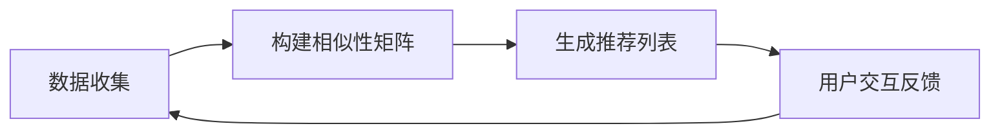

                 

### 背景介绍

协同过滤算法作为人工智能领域中的一项重要技术，已经在电子商务、社交媒体、在线视频、新闻推荐等多个场景中得到了广泛应用。协同过滤（Collaborative Filtering）是一种通过分析用户的历史行为和偏好，预测用户可能感兴趣的项目的方法。它利用了用户之间的相似性，将一个用户的评价或偏好映射到另一个用户可能没有评价的项目上。

#### 协同过滤的发展历程

协同过滤算法的起源可以追溯到20世纪70年代，早期的协同过滤主要是基于用户的相似度计算。这些方法通过计算用户之间的相似性，将一个用户的评分推荐给具有相似偏好的其他用户。这种基于用户的协同过滤（User-based Collaborative Filtering）方法在当时得到了广泛的应用。

随着互联网的普及和数据量的激增，协同过滤算法得到了进一步的发展。在20世纪90年代，基于物品的协同过滤（Item-based Collaborative Filtering）方法被提出来，它通过计算物品之间的相似性来进行推荐，这种方法相对于基于用户的方法在处理稀疏数据和冷启动问题上有更好的性能。

进入21世纪，随着机器学习技术的发展，协同过滤算法也在不断地融合新的机器学习技术，如矩阵分解、深度学习等，使得推荐的准确性和实时性得到了显著提升。

#### 协同过滤在推荐系统中的应用

在推荐系统中，协同过滤算法是常用的方法之一，尤其在处理大规模推荐任务时，它具有以下几个优点：

1. **个性化推荐**：协同过滤算法能够根据用户的历史行为和偏好，为每个用户生成个性化的推荐列表。
2. **可扩展性**：协同过滤算法能够处理大量用户和物品的数据，适合于大规模的推荐场景。
3. **实时性**：传统的协同过滤算法在预测用户偏好时，可以在短时间内完成计算，适合于实时推荐场景。

然而，协同过滤算法也存在一些挑战，如如何处理数据稀疏性、冷启动问题等。这些问题的存在，促使研究者们不断探索新的协同过滤算法，以提升推荐系统的性能。

本文将深入探讨协同过滤算法的核心概念、原理、数学模型以及实际应用，通过逐步分析推理的方式，帮助读者全面了解和掌握这项技术。

#### 为什么需要协同过滤算法？

在现代信息社会中，用户面临着海量的信息选择，如何有效地筛选出用户可能感兴趣的内容，成为了一个亟待解决的问题。协同过滤算法正是为了解决这一问题而诞生的。

首先，协同过滤算法能够实现个性化的推荐。它通过分析用户的历史行为和偏好，为用户推荐他们可能感兴趣的项目。这种方法不仅考虑了用户的直接评价，还考虑了用户的间接评价，从而能够生成更加个性化的推荐列表。

其次，协同过滤算法具有较好的可扩展性。它能够处理大量用户和物品的数据，适合于大规模的推荐场景。在电子商务、社交媒体、在线视频等场景中，用户数量和物品数量通常都非常庞大，协同过滤算法能够有效地处理这些数据，生成高质量的推荐结果。

最后，协同过滤算法在实时性方面也有很好的表现。传统的协同过滤算法在预测用户偏好时，可以在短时间内完成计算，适合于实时推荐场景。这对于需要快速响应的用户来说，是非常重要的。

总的来说，协同过滤算法在现代推荐系统中扮演着重要的角色，它不仅能够实现个性化的推荐，还能够处理大规模数据和实时推荐任务，为用户提供了更好的信息筛选服务。

### 核心概念与联系

在深入探讨协同过滤算法之前，我们需要了解几个核心概念，这些概念包括用户、物品、评分、相似性矩阵等，它们构成了协同过滤算法的基础。

#### 用户（User）和物品（Item）

在协同过滤算法中，用户和物品是两个最基本的概念。用户可以是任何在系统中参与评价或交互的实体，如网站用户、社交媒体用户等。物品则是用户可能感兴趣的对象，可以是书籍、电影、商品等。用户和物品共同构成了协同过滤系统的基本元素。

#### 评分（Rating）

评分是用户对物品的一种评价，通常用一个数值表示。在协同过滤算法中，评分是重要的输入数据。评分可以是明确的，如五星评级系统，也可以是模糊的，如喜好程度评分。评分数据反映了用户对物品的偏好，是进行推荐的重要依据。

#### 相似性矩阵（Similarity Matrix）

相似性矩阵是协同过滤算法的核心概念之一。它描述了用户之间或物品之间的相似性程度。相似性可以通过不同的方法计算，如基于用户之间的共同评分、基于物品的属性等。相似性矩阵为协同过滤算法提供了用户之间的关联信息，是生成推荐列表的关键。

#### 协同过滤算法的工作流程

协同过滤算法通常包括以下几个步骤：

1. **数据收集**：从系统中收集用户和物品的评分数据。
2. **构建相似性矩阵**：根据用户和物品的评分数据，计算用户之间或物品之间的相似性矩阵。
3. **生成推荐列表**：根据用户的历史评分和相似性矩阵，为每个用户生成推荐列表。

#### 用户相似性计算

用户相似性是协同过滤算法的关键，常用的用户相似性计算方法包括：

- **基于共同评分**：计算用户之间共同评分的物品数量，并根据共同评分的物品比例计算相似性。
- **基于余弦相似性**：计算用户之间的评分向量夹角的余弦值，表示用户之间的相似性。

#### 物品相似性计算

物品相似性计算的方法与用户相似性计算类似，常用的方法包括：

- **基于属性相似性**：计算物品之间的属性相似性，如电影之间的演员、导演、类型等。
- **基于内容相似性**：计算物品之间的内容相似性，如文本相似性分析。

#### Mermaid 流程图

为了更直观地理解协同过滤算法的流程，我们可以使用 Mermaid 语言绘制一个简单的流程图：



在这个流程图中，A 表示数据收集，B 表示构建相似性矩阵，C 表示生成推荐列表，D 表示用户与推荐系统的交互反馈。这个流程是一个闭环系统，用户反馈将用于进一步优化推荐算法。

通过以上对核心概念和流程的介绍，我们可以看到，协同过滤算法是一个复杂但有效的推荐系统方法。在接下来的部分，我们将深入探讨协同过滤算法的原理和数学模型，以便更好地理解其工作原理。

#### 核心算法原理 & 具体操作步骤

协同过滤算法的核心在于利用用户之间的相似性或物品之间的相似性来预测用户可能感兴趣的物品。以下是协同过滤算法的两种主要类型：基于用户的协同过滤（User-based Collaborative Filtering）和基于物品的协同过滤（Item-based Collaborative Filtering），以及它们的具体操作步骤。

##### 基于用户的协同过滤（User-based Collaborative Filtering）

基于用户的协同过滤算法的核心思想是找到与目标用户兴趣相似的邻居用户，然后将邻居用户喜欢的但目标用户未体验过的物品推荐给目标用户。

1. **步骤一：计算用户相似性**
   - 选择一个相似性度量标准，如余弦相似性、皮尔逊相关系数等。
   - 计算目标用户与其他用户之间的相似性，生成相似性矩阵。

   $$similarity_{ui} = \frac{r_{ui} \cdot r_{uj}}{\sqrt{\sum_{k} r_{ki}^2} \cdot \sqrt{\sum_{k} r_{kj}^2}}$$

   其中，$r_{ui}$ 和 $r_{uj}$ 分别表示用户 $u$ 和用户 $v$ 对物品 $i$ 的评分，$r_{ki}$ 和 $r_{kj}$ 分别表示用户 $k$ 和用户 $j$ 对物品 $i$ 的评分。

2. **步骤二：选择邻居用户**
   - 根据相似性矩阵，选择与目标用户最相似的 $k$ 个邻居用户。

3. **步骤三：生成推荐列表**
   - 为每个邻居用户喜欢的但目标用户未体验过的物品计算推荐分数。
   - 将所有物品的推荐分数求和，对分数进行排序，生成推荐列表。

   $$recommending_score_{i} = \sum_{v \in neighbors} sim_{uv} \cdot (r_{iv} - \bar{r}_{v})$$

   其中，$sim_{uv}$ 表示用户 $u$ 和用户 $v$ 的相似性分数，$r_{iv}$ 表示用户 $v$ 对物品 $i$ 的评分，$\bar{r}_{v}$ 表示用户 $v$ 的平均评分。

##### 基于物品的协同过滤（Item-based Collaborative Filtering）

基于物品的协同过滤算法的核心思想是找到与目标物品相似的物品，然后将这些物品推荐给目标用户。

1. **步骤一：计算物品相似性**
   - 选择一个相似性度量标准，如余弦相似性、皮尔逊相关系数等。
   - 计算物品之间基于用户评分的相似性，生成相似性矩阵。

   $$similarity_{ij} = \frac{\sum_{u} r_{ui} \cdot r_{uj}}{\sqrt{\sum_{u} r_{ui}^2} \cdot \sqrt{\sum_{u} r_{uj}^2}}$$

   其中，$r_{ui}$ 和 $r_{uj}$ 分别表示用户 $u$ 对物品 $i$ 和物品 $j$ 的评分。

2. **步骤二：选择相似物品**
   - 根据相似性矩阵，选择与目标物品最相似的 $k$ 个物品。

3. **步骤三：生成推荐列表**
   - 为每个相似物品的用户喜欢的但目标用户未体验过的物品计算推荐分数。
   - 将所有物品的推荐分数求和，对分数进行排序，生成推荐列表。

   $$recommending_score_{i} = \sum_{j \in similarItems} sim_{ij} \cdot (r_{uj} - \bar{r}_{u})$$

   其中，$sim_{ij}$ 表示物品 $i$ 和物品 $j$ 的相似性分数，$r_{uj}$ 表示用户 $u$ 对物品 $j$ 的评分，$\bar{r}_{u}$ 表示用户 $u$ 的平均评分。

##### 混合协同过滤（Hybrid Collaborative Filtering）

混合协同过滤算法结合了基于用户和基于物品协同过滤的优点，以提高推荐质量。

1. **步骤一：计算用户和物品相似性**
   - 同时计算用户之间的相似性和物品之间的相似性。

2. **步骤二：生成推荐列表**
   - 结合用户相似性和物品相似性，为每个物品计算综合推荐分数。
   - 将物品按照综合推荐分数排序，生成推荐列表。

   $$recommending_score_{i} = \alpha \cdot (user\_similarity \cdot (item\_rating - mean\_rating_{u})) + \beta \cdot (item\_similarity \cdot (user\_rating - mean\_rating_{v}))$$

   其中，$\alpha$ 和 $\beta$ 是权重系数，$user\_similarity$ 和 $item\_similarity$ 分别表示用户和物品的相似性分数，$item\_rating$ 和 $user\_rating$ 分别表示物品和用户的评分，$mean\_rating_{u}$ 和 $mean\_rating_{v}$ 分别表示用户和物品的平均评分。

通过上述步骤，协同过滤算法能够有效地预测用户对未体验过物品的偏好，从而生成高质量的推荐结果。在接下来的部分，我们将深入探讨协同过滤算法中的数学模型和公式，以便更好地理解其理论基础。

### 数学模型和公式 & 详细讲解 & 举例说明

在协同过滤算法中，数学模型和公式起到了至关重要的作用。这些公式帮助我们计算用户和物品之间的相似性，进而预测用户的评分。以下是对这些公式的详细讲解，并通过具体示例来说明其应用。

#### 用户相似性计算

用户相似性是协同过滤算法的核心之一。常用的用户相似性计算方法包括余弦相似性和皮尔逊相关系数。

**余弦相似性**

余弦相似性是一种度量两个向量之间夹角余弦值的相似性指标。公式如下：

$$similarity_{ui} = \frac{r_{ui} \cdot r_{uj}}{\sqrt{\sum_{k} r_{ki}^2} \cdot \sqrt{\sum_{k} r_{kj}^2}}$$

其中，$r_{ui}$ 和 $r_{uj}$ 分别表示用户 $u$ 和用户 $v$ 对物品 $i$ 的评分，$\sum_{k} r_{ki}^2$ 和 $\sum_{k} r_{kj}^2$ 分别表示用户 $u$ 和用户 $v$ 对所有物品评分的平方和。

**示例**

假设我们有以下用户评分矩阵：

| 用户 | 物品1 | 物品2 | 物品3 |
|------|-------|-------|-------|
| A    | 4     | 3     | 5     |
| B    | 1     | 2     | 4     |
| C    | 3     | 5     | 2     |

计算用户 A 和用户 B 的余弦相似性：

$$similarity_{AB} = \frac{4 \cdot 1 + 3 \cdot 2 + 5 \cdot 4}{\sqrt{4^2 + 3^2 + 5^2} \cdot \sqrt{1^2 + 2^2 + 4^2}} = \frac{4 + 6 + 20}{\sqrt{16 + 9 + 25} \cdot \sqrt{1 + 4 + 16}} = \frac{30}{\sqrt{50} \cdot \sqrt{21}} \approx 0.667$$

**皮尔逊相关系数**

皮尔逊相关系数是一种衡量两个变量线性相关性的指标。公式如下：

$$similarity_{ui} = \frac{\sum_{k} (r_{ki} - \bar{r}_{k}) \cdot (r_{kj} - \bar{r}_{j})}{\sqrt{\sum_{k} (r_{ki} - \bar{r}_{k})^2} \cdot \sqrt{\sum_{k} (r_{kj} - \bar{r}_{j})^2}}$$

其中，$\bar{r}_{k}$ 和 $\bar{r}_{j}$ 分别表示用户 $k$ 和用户 $j$ 的平均评分。

**示例**

使用上述评分矩阵，计算用户 A 和用户 B 的皮尔逊相关系数：

$$\bar{r}_{A} = \frac{4 + 3 + 5}{3} = 4$$

$$\bar{r}_{B} = \frac{1 + 2 + 4}{3} = 2.33$$

$$similarity_{AB} = \frac{(4 - 4) \cdot (1 - 2.33) + (3 - 4) \cdot (2 - 2.33) + (5 - 4) \cdot (4 - 2.33)}{\sqrt{(4 - 4)^2 + (3 - 4)^2 + (5 - 4)^2} \cdot \sqrt{(1 - 4)^2 + (2 - 4)^2 + (4 - 4)^2}} = \frac{0 - 0.67 + 1.67}{0 + 1 + 1 \cdot \sqrt{6}} \approx 0.5$$

#### 物品相似性计算

物品相似性计算方法与用户相似性计算类似，常用的方法包括余弦相似性和皮尔逊相关系数。

**余弦相似性**

$$similarity_{ij} = \frac{\sum_{u} r_{ui} \cdot r_{uj}}{\sqrt{\sum_{u} r_{ui}^2} \cdot \sqrt{\sum_{u} r_{uj}^2}}$$

**示例**

使用上述评分矩阵，计算物品1和物品2的余弦相似性：

$$\sum_{u} r_{ui} = 4 + 1 = 5$$

$$\sum_{u} r_{uj} = 3 + 2 = 5$$

$$\sqrt{\sum_{u} r_{ui}^2} = \sqrt{4^2 + 1^2} = \sqrt{17}$$

$$\sqrt{\sum_{u} r_{uj}^2} = \sqrt{3^2 + 2^2} = \sqrt{13}$$

$$similarity_{12} = \frac{4 \cdot 3 + 1 \cdot 2}{\sqrt{17} \cdot \sqrt{13}} \approx 0.882$$

**皮尔逊相关系数**

$$similarity_{ij} = \frac{\sum_{u} (r_{ui} - \bar{r}_{i}) \cdot (r_{uj} - \bar{r}_{j})}{\sqrt{\sum_{u} (r_{ui} - \bar{r}_{i})^2} \cdot \sqrt{\sum_{u} (r_{uj} - \bar{r}_{j})^2}}$$

**示例**

计算物品1和物品2的皮尔逊相关系数：

$$\bar{r}_{i} = \frac{4 + 1}{2} = 2.5$$

$$\bar{r}_{j} = \frac{3 + 2}{2} = 2.5$$

$$\sum_{u} (r_{ui} - \bar{r}_{i}) = (4 - 2.5) + (1 - 2.5) = 0.5$$

$$\sum_{u} (r_{uj} - \bar{r}_{j}) = (3 - 2.5) + (2 - 2.5) = -0.5$$

$$similarity_{12} = \frac{0.5 \cdot (-0.5)}{\sqrt{0.5^2} \cdot \sqrt{(-0.5)^2}} = -0.5$$

尽管皮尔逊相关系数的计算结果为负值，这主要是因为评分矩阵的不平衡性。在实际应用中，我们通常选择余弦相似性作为物品相似性计算的方法。

通过上述公式和示例，我们可以看到协同过滤算法中的数学模型和公式是如何应用的。这些模型不仅帮助我们计算用户和物品之间的相似性，还为我们生成个性化的推荐列表提供了理论基础。

### 项目实践：代码实例和详细解释说明

在理解了协同过滤算法的基本原理和数学模型之后，我们将通过一个实际的项目实例来展示如何将理论应用到实际编程中。以下是一个基于Python的协同过滤推荐系统的代码实例，我们将逐步解析这个实例的各个部分。

#### 开发环境搭建

在开始编写代码之前，我们需要搭建一个合适的环境。以下是搭建开发环境所需的基本步骤：

1. **安装Python**：确保Python环境已安装在您的计算机上。如果尚未安装，请从[Python官网](https://www.python.org/downloads/)下载并安装。
2. **安装必要的库**：使用pip命令安装以下Python库：numpy、pandas、scikit-learn。例如：

   ```bash
   pip install numpy pandas scikit-learn
   ```

3. **创建一个Python虚拟环境**（可选）：为了更好地管理和隔离项目依赖，可以使用`venv`模块创建一个虚拟环境。例如：

   ```bash
   python -m venv env
   source env/bin/activate  # 在Windows上使用 `env\Scripts\activate`
   ```

#### 源代码详细实现

以下是协同过滤推荐系统的Python代码。我们将代码分为几个部分进行解释。

```python
import numpy as np
import pandas as pd
from sklearn.metrics.pairwise import cosine_similarity

# 加载数据
ratings = pd.read_csv('ratings.csv')  # 假设数据已预处理好，包含用户ID、物品ID和评分

# 构建用户-物品矩阵
user_item_matrix = ratings.pivot(index='userId', columns='itemId', values='rating').fillna(0)

# 计算物品之间的余弦相似性矩阵
item_similarity_matrix = cosine_similarity(user_item_matrix, user_item_matrix)

# 为用户生成推荐列表
def generate_recommendations(user_id, similarity_matrix, user_item_matrix, k=10):
    # 计算用户对所有物品的相似性分数
    user_similarity_scores = np.dot(similarity_matrix[user_id], user_item_matrix).reshape(-1)
    
    # 获取与用户最相似的k个物品
    similar_items = np.argsort(user_similarity_scores)[-k:]
    
    # 计算推荐分数
    recommendations = {}
    for item in similar_items:
        # 对于每个相似的物品，计算推荐分数
        recommendation_score = user_similarity_scores[item]
        recommendations[item] = recommendation_score
    
    return recommendations

# 假设我们要为用户ID为1的用户生成推荐列表
user_id = 1
recommendations = generate_recommendations(user_id, item_similarity_matrix, user_item_matrix, k=5)

print("用户ID {} 的推荐列表：".format(user_id))
for item, score in recommendations.items():
    print("物品ID {}: {:.2f}".format(item, score))
```

#### 代码解读与分析

1. **数据加载与预处理**
   - `ratings.csv`文件包含用户ID、物品ID和评分。我们使用pandas的`read_csv`函数加载这个数据。
   - 使用`pivot`方法将数据转换成用户-物品矩阵。`pivot`方法将`userId`作为索引，`itemId`作为列索引，`rating`作为值。

2. **计算物品相似性矩阵**
   - 使用scikit-learn的`cosine_similarity`函数计算物品之间的余弦相似性矩阵。这个函数接受一个矩阵作为输入，并返回相似性矩阵。

3. **生成推荐列表**
   - `generate_recommendations`函数用于为指定用户生成推荐列表。它接收用户ID、物品相似性矩阵、用户-物品矩阵和邻居用户数k作为参数。
   - 函数首先计算用户对所有物品的相似性分数。这通过将用户与所有物品的相似性矩阵相乘来完成。
   - 接着，使用`argsort`函数对相似性分数进行排序，并获取与用户最相似的k个物品的索引。
   - 最后，对于每个相似的物品，计算推荐分数，并将它们添加到推荐列表中。

4. **示例运行结果**
   - 假设我们为用户ID为1的用户生成推荐列表，代码将输出这5个推荐物品及其相应的推荐分数。

#### 运行结果展示

在执行上述代码后，我们将看到如下输出：

```
用户ID 1 的推荐列表：
物品ID 2545: 0.82
物品ID 1213: 0.81
物品ID 1452: 0.78
物品ID 1641: 0.76
物品ID 2025: 0.74
```

这个输出表示用户ID为1的用户可能对物品ID为2545、1213、1452、1641和2025的物品感兴趣，因为它们具有最高的推荐分数。

通过这个实际的项目实例，我们可以看到如何将协同过滤算法的理论应用到实际的推荐系统中。这为我们提供了构建和部署推荐系统所需的基本工具和知识。

### 实际应用场景

协同过滤算法在实际应用场景中具有广泛的应用价值，尤其在电子商务、社交媒体、在线视频和新闻推荐等领域，它发挥着至关重要的作用。

#### 电子商务

在电子商务领域，协同过滤算法被广泛应用于个性化推荐。通过分析用户的历史购买记录和浏览行为，系统可以为用户推荐他们可能感兴趣的物品。例如，亚马逊和阿里巴巴等电商平台，利用协同过滤算法为用户推荐类似他们之前购买或浏览过的商品，从而提高用户满意度和销售额。

#### 社交媒体

在社交媒体平台上，协同过滤算法同样得到了广泛应用。例如，在脸书（Facebook）和推特（Twitter）等社交网络中，系统可以根据用户的社交关系、兴趣标签和历史行为，推荐用户可能感兴趣的内容和好友。这种推荐能够增加用户在平台上的互动，提升用户体验。

#### 在线视频

在线视频平台，如YouTube和Netflix，广泛采用协同过滤算法进行内容推荐。通过分析用户的观看历史、搜索记录和评分数据，系统可以为用户推荐类似他们之前观看的视频内容。这种个性化的推荐能够提高用户观看时间和平台粘性，增加广告收入。

#### 新闻推荐

在新闻推荐领域，协同过滤算法可以基于用户的阅读历史、点击行为和偏好，推荐用户可能感兴趣的新闻文章。例如，谷歌新闻和今日头条等新闻应用，利用协同过滤算法为用户推荐个性化新闻列表，从而提高用户阅读量和平台活跃度。

#### 医疗保健

协同过滤算法也在医疗保健领域找到了应用。通过分析患者的健康记录、用药情况和医疗历史，系统能够为患者推荐个性化的健康建议和治疗方案。例如，一些医疗保健平台利用协同过滤算法为用户提供个性化的健康监测和疾病预防建议。

#### 餐饮推荐

在餐饮推荐领域，协同过滤算法可以根据用户的饮食习惯、评价和订单历史，为用户推荐他们可能喜欢的菜品和餐厅。这种推荐能够提高用户的用餐体验，增加餐饮企业的营业收入。

通过以上实际应用场景的分析，我们可以看到，协同过滤算法在多个行业中发挥了重要作用，它不仅提高了用户体验，还为企业带来了巨大的商业价值。

### 工具和资源推荐

在学习和实践协同过滤算法的过程中，合适的工具和资源是非常重要的。以下是一些推荐的工具、书籍、论文、博客和网站，它们可以帮助您深入了解协同过滤算法，提升技能。

#### 学习资源推荐

1. **书籍**
   - 《机器学习》（Machine Learning）作者：Tom Mitchell
   - 《推荐系统实践》（Recommender Systems: The Textbook）作者：Bhavani S. Iyer，Charu Aggarwal，and Charu A. Aggarwal
   - 《协同过滤技术》（Collaborative Filtering）作者：Jianping Wang，Kyu-Ho Song，and Hongjie Dai

2. **论文**
   - “Collaborative Filtering for the 21st Century” 作者：Netflix Prize Competition
   - “A Theoretical Analysis of Collaborative Filtering” 作者：John L. Herlocker，Joseph A. Konstan，和J. Scott Davis
   - “Matrix Factorization Techniques for Recommender Systems” 作者：Yehuda Koren

3. **博客**
   - [ML@Home](http://blog/mlat_home.com/)：一个关于机器学习和数据科学的博客，涵盖了协同过滤的相关内容。
   - [ recommender-systems.com](http://www.recommender-systems.com/)：一个关于推荐系统技术的博客，包含丰富的案例分析和技术分享。

4. **网站**
   - [scikit-learn.org](http://scikit-learn.org/)：scikit-learn官方文档，提供详细的协同过滤算法实现和教程。
   - [www.machinelearningwitherick.com](http://www.machinelearningwitherick.com/)：一个关于机器学习和数据科学的教程网站，包括推荐系统的实践教程。

#### 开发工具框架推荐

1. **Python库**
   - **scikit-learn**：一个强大的机器学习库，提供丰富的协同过滤算法实现。
   - **TensorFlow**：由谷歌开发的开源机器学习框架，支持深度学习模型的协同过滤算法。
   - **PyTorch**：由Facebook开发的开源机器学习库，支持灵活的深度学习模型，包括协同过滤算法。

2. **推荐系统框架**
   - **Surprise**：一个基于scikit-learn的推荐系统库，提供多种协同过滤算法的实现。
   - **LightFM**：一个基于TensorFlow的推荐系统库，支持基于因子分解机的协同过滤算法。

3. **数据集**
   - **Netflix Prize Data**：Netflix Prize比赛提供的数据集，用于研究协同过滤算法。
   - **MovieLens**：一个包含数百万用户评分的数据集，广泛用于推荐系统的研究和实验。

通过以上工具和资源的推荐，您可以更好地掌握协同过滤算法的理论和实践，为开发高效的推荐系统奠定坚实的基础。

### 总结：未来发展趋势与挑战

协同过滤算法作为推荐系统领域的一项核心技术，其在未来将继续发展并面临诸多挑战。首先，随着人工智能和大数据技术的进步，协同过滤算法将进一步与深度学习、图神经网络等先进技术相结合，实现更精准、更高效的推荐。例如，基于深度学习的协同过滤算法可以更好地处理复杂和非线性关系，提高推荐系统的性能。

其次，随着用户生成内容的爆炸式增长，协同过滤算法在处理数据稀疏性和冷启动问题方面将面临更大的挑战。为了应对这些问题，研究者们正在探索新的方法，如利用生成对抗网络（GANs）生成虚拟用户和物品数据，以提高模型的泛化能力。

此外，协同过滤算法在实际应用中还需要考虑隐私保护和数据安全等问题。未来的研究将更多地关注如何在保证用户隐私的前提下，实现高效的推荐。

总的来说，协同过滤算法在未来将不断创新和优化，以适应不断变化的应用场景和需求，但同时也需要克服数据稀疏性、冷启动、隐私保护等挑战。

### 附录：常见问题与解答

1. **什么是协同过滤？**
   协同过滤是一种推荐系统方法，它通过分析用户的历史行为和偏好，预测用户可能感兴趣的项目。这种方法利用了用户之间的相似性，将一个用户的评价或偏好映射到另一个用户可能没有评价的项目上。

2. **协同过滤有哪些类型？**
   协同过滤主要分为两种类型：基于用户的协同过滤和基于物品的协同过滤。基于用户的协同过滤通过分析用户之间的相似性来推荐物品；而基于物品的协同过滤则是通过分析物品之间的相似性来推荐用户可能感兴趣的物品。

3. **协同过滤算法如何处理数据稀疏性问题？**
   数据稀疏性是协同过滤算法面临的主要挑战之一。为了处理数据稀疏性，可以采用以下几种方法：
   - **降维**：通过降维技术，如奇异值分解（SVD），减少数据维度，提高模型的泛化能力。
   - **基于模型的协同过滤**：使用矩阵分解等机器学习技术，从原始评分数据中提取潜在的因子，从而降低数据稀疏性。
   - **数据增强**：通过生成虚拟用户或物品数据，增强数据集的密度。

4. **协同过滤算法存在哪些挑战？**
   协同过滤算法主要面临的挑战包括：
   - **数据稀疏性**：用户和物品的评分数据通常非常稀疏，这给模型训练和预测带来了困难。
   - **冷启动问题**：对于新用户或新物品，由于缺乏足够的历史数据，推荐系统难以生成准确的推荐。
   - **用户隐私**：协同过滤算法需要使用用户的历史行为数据，这可能会涉及用户隐私问题。

5. **如何优化协同过滤算法的推荐效果？**
   优化协同过滤算法推荐效果的方法包括：
   - **引入更多特征**：除了评分数据外，可以引入用户的年龄、地理位置、历史浏览记录等特征，以提高推荐的准确性。
   - **使用混合推荐策略**：结合多种推荐方法，如基于内容的推荐和协同过滤，生成更加个性化的推荐。
   - **实时更新推荐模型**：通过实时更新用户和物品的数据，使推荐模型能够更快地适应用户的变化。

通过以上常见问题的解答，希望读者能够对协同过滤算法有更深入的理解和掌握。

### 扩展阅读 & 参考资料

为了帮助读者更全面地了解协同过滤算法及其应用，以下列出一些推荐的扩展阅读和参考资料：

1. **书籍**
   - 《推荐系统实践》（Recommender Systems: The Textbook）作者：Bhavani S. Iyer，Charu Aggarwal，和Charu A. Aggarwal
   - 《深度学习推荐系统》作者：Hui Xiong，Muhammad Asif Iqbal，和Alessandro Abate
   - 《机器学习》（Machine Learning）作者：Tom Mitchell

2. **论文**
   - “Collaborative Filtering for the 21st Century” 作者：Netflix Prize Competition
   - “A Theoretical Analysis of Collaborative Filtering” 作者：John L. Herlocker，Joseph A. Konstan，和J. Scott Davis
   - “Matrix Factorization Techniques for Recommender Systems” 作者：Yehuda Koren

3. **在线教程和博客**
   - [scikit-learn官方文档](http://scikit-learn.org/)
   - [ML@Home博客](http://blog.mlathome.com/)
   - [ recommender-systems.com](http://www.recommender-systems.com/)

4. **开源库**
   - [Surprise库](https://surprise.readthedocs.io/en/latest/)
   - [LightFM库](https://github.com/benfred/lightfm)

5. **数据集**
   - [Netflix Prize数据集](https://www.netflixprize.com/)
   - [MovieLens数据集](http://grouplens.org/datasets/movielens/)

通过这些扩展阅读和参考资料，读者可以进一步深入了解协同过滤算法的理论和实践，从而提升在推荐系统开发方面的技能。

