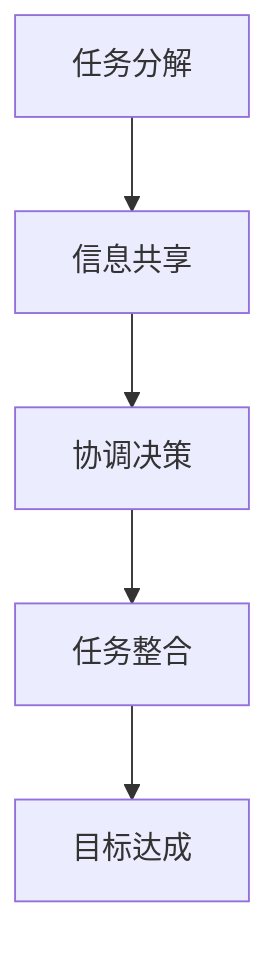

                 

### 1. 背景介绍

在现代信息社会，数据无处不在，而如何有效地处理和分析这些数据成为了各个领域面临的重要挑战。随着计算能力的提升和算法的发展，人工智能（AI）技术逐渐成为解决这一问题的核心手段。在众多AI技术中，多智能体系统（MAS）尤为引人注目。多智能体系统通过协同工作，能够实现复杂任务的高效解决，并在许多领域展现了巨大的潜力。

多智能体系统（MAS）是一组具有自治能力的智能体，通过通信和协作实现共同目标。这些智能体可以是计算机程序、机器人、传感器或其他设备，它们在异构、动态和不确定的环境中相互交互。MAS的核心优势在于其分布式架构，能够提高系统的容错性、灵活性和适应性。通过智能体的协作，MAS可以处理复杂任务，例如资源分配、路径规划、任务调度等。

然而，多智能体系统的设计与应用并非易事。首先，智能体之间的通信和协作机制需要精心设计，以确保信息传递的准确性和及时性。其次，如何协调多个智能体的行为，使其在实现个体目标的同时，也能达成整体目标，是一个复杂的问题。最后，智能体的决策过程需要考虑到环境的不确定性和动态变化，以保持系统的稳定性和鲁棒性。

本文将深入探讨多智能体系统在反思与综合应用中的挑战与机遇。通过具体案例，我们将分析多智能体系统的核心概念、算法原理、数学模型，并探讨其实际应用场景。此外，我们还将介绍相关工具和资源，以帮助读者更好地理解和应用多智能体技术。

### 2. 核心概念与联系

#### 2.1 智能体的定义

智能体（Agent）是指能够感知环境、自主决策并采取行动的实体。智能体的关键特性包括：

- **自主性**：智能体能够独立运行，不受外部干预。
- **适应性**：智能体能够根据环境变化调整自身行为。
- **社会性**：智能体能够与其他智能体进行交互和协作。

在多智能体系统中，智能体可以是任何具有上述特性的实体，如计算机程序、机器人、传感器等。智能体通过感知环境获取信息，根据预设策略或学习算法做出决策，并执行相应的行动。

#### 2.2 多智能体系统的架构

多智能体系统通常由以下几个关键组成部分构成：

- **智能体**：系统的基本单元，具有自主决策和行动能力。
- **通信机制**：智能体之间进行信息交换的渠道，可以是网络通信、传感器数据共享等。
- **协调机制**：确保智能体行为协调一致，实现系统目标的机制。
- **环境模型**：描述系统运行环境的模型，包括环境状态、约束条件等。

多智能体系统的架构可以简化为以下模型：

```
多智能体系统 = {智能体集合，通信机制，协调机制，环境模型}
```

#### 2.3 反思的概念

反思是指智能体在执行任务过程中对自身行为和结果进行评估的过程。通过反思，智能体能够识别错误、改进策略，并在未来的任务中取得更好的表现。反思机制通常包括以下步骤：

1. **行为评估**：智能体对其当前行为的效果进行评估，确定是否达成预期目标。
2. **错误识别**：分析行为评估结果，找出导致失败的原因。
3. **策略调整**：根据错误识别结果，调整智能体的决策策略。
4. **持续学习**：智能体通过反思过程积累经验，优化自身行为。

#### 2.4 多智能体协同的工作原理

多智能体协同是指多个智能体通过通信和协作，共同完成复杂任务的过程。协同工作原理包括以下几个关键方面：

1. **任务分解**：将复杂任务分解为多个子任务，分配给不同的智能体。
2. **信息共享**：智能体之间通过通信机制共享任务相关信息，以便更好地协同工作。
3. **协调决策**：智能体根据共享信息，通过协调机制做出决策，协调各自的行为。
4. **任务整合**：将各智能体完成的子任务整合为最终结果，实现整体目标。

为了更好地理解多智能体协同的工作原理，我们引入一个简单的 Mermaid 流程图：



在这个流程图中，任务分解、信息共享、协调决策和任务整合构成了多智能体协同的工作流程。通过这个过程，多个智能体能够高效地协同工作，共同实现复杂任务。

### 3. 核心算法原理 & 具体操作步骤

多智能体系统中的核心算法主要包括任务分配算法、通信协议和协调机制。以下是这些算法的原理和具体操作步骤：

#### 3.1 任务分配算法

任务分配算法是决定如何将复杂任务分配给多个智能体的关键。常见的任务分配算法包括：

1. **随机分配**：将任务随机分配给空闲智能体。这种算法简单但可能导致任务分配不均衡。
2. **负载均衡分配**：根据智能体的当前负载情况，将任务分配给负载较低的智能体。这种算法能够提高系统的整体效率。
3. **基于能力的分配**：根据智能体的能力水平，将任务分配给最适合执行该任务的智能体。这种算法能够提高任务完成的准确性。

具体操作步骤如下：

1. **任务初始化**：确定任务的属性和目标。
2. **智能体注册**：智能体向系统注册自身的能力和负载情况。
3. **任务分配**：系统根据任务属性和智能体能力，将任务分配给合适的智能体。
4. **任务确认**：被分配任务的智能体确认接收任务，开始执行。

#### 3.2 通信协议

通信协议是多智能体系统中的另一个关键算法，它定义了智能体之间如何进行信息交换。常见的通信协议包括：

1. **消息传递协议**：智能体之间通过消息传递进行通信。常见的消息传递协议有TCP/IP、UDP等。
2. **传感器数据共享**：智能体通过传感器获取环境信息，并将数据共享给其他智能体。
3. **广播协议**：智能体将信息广播给系统中的所有智能体。

具体操作步骤如下：

1. **通信初始化**：系统初始化通信协议，设置通信参数。
2. **消息发送**：智能体根据通信协议，将消息发送给目标智能体。
3. **消息接收**：智能体接收消息，并根据消息内容进行相应的处理。
4. **数据共享**：智能体通过传感器共享环境数据，实现信息的实时传递。

#### 3.3 协调机制

协调机制是多智能体系统中的核心算法，用于确保智能体之间的行为协调一致，实现整体目标。常见的协调机制包括：

1. **集中式协调**：系统通过中心控制器协调智能体的行为。
2. **分布式协调**：智能体之间通过相互协调，共同实现整体目标。
3. **市场机制**：智能体通过市场机制进行任务协调，实现资源的最优分配。

具体操作步骤如下：

1. **协调初始化**：系统初始化协调机制，设置协调参数。
2. **任务协商**：智能体之间协商任务分配和执行策略。
3. **行为调整**：智能体根据协调结果，调整自身行为，实现整体目标。
4. **持续监控**：系统对智能体的行为进行监控，确保协调效果。

通过以上核心算法的原理和操作步骤，我们可以构建一个高效的多智能体系统，实现复杂任务的高效解决。

### 4. 数学模型和公式 & 详细讲解 & 举例说明

在多智能体系统中，数学模型和公式用于描述智能体的行为、通信和协调过程，是理解和设计多智能体系统的关键工具。以下我们将详细讲解一些核心数学模型和公式，并通过实际例子进行说明。

#### 4.1 智能体行为模型

智能体的行为通常可以通过马尔可夫决策过程（MDP）来描述。MDP模型包括状态空间\(S\)、动作空间\(A\)、奖励函数\(R\)、状态转移概率\(P\)和策略\(\pi\)。

- **状态空间\(S\)**：系统当前的状态集合。
- **动作空间\(A\)**：智能体可以执行的动作集合。
- **奖励函数\(R(s, a)\)**：在状态\(s\)下执行动作\(a\)所获得的即时奖励。
- **状态转移概率\(P(s', s | a)\)**：在状态\(s\)下执行动作\(a\)后，系统转移到状态\(s'\)的概率。
- **策略\(\pi(a | s)\)**：智能体在状态\(s\)下选择动作\(a\)的概率分布。

#### 4.2 通信模型

在多智能体系统中，通信模型用于描述智能体之间的信息交换。一个简单的通信模型可以使用图论来表示，其中节点表示智能体，边表示通信通道。

- **图\(G(V, E)\)**：通信网络，其中\(V\)是节点集合，\(E\)是边集合。
- **邻接矩阵\(A\)**：表示节点之间的通信状态，\(A_{ij}\)表示节点\(i\)和节点\(j\)之间的通信状态，取值范围为{0, 1}。

#### 4.3 协调模型

协调模型用于描述多智能体系统中的协同行为。一个简单的协调模型可以基于博弈论中的合作博弈理论。

- **参与人集合\(N\)**：系统中的所有智能体。
- **策略集合\(S_i\)**：智能体\(i\)可以选择的策略集合。
- **收益函数\(u_i(S)\)**：智能体\(i\)在策略组合\(S\)下的收益。

一个具体的例子是博弈论中的“合作博弈”，其中智能体通过协商和协作，实现整体收益最大化。

#### 4.4 数学公式说明

以下是几个核心数学公式的说明：

1. **期望奖励**：智能体在状态\(s\)下执行动作\(a\)的期望奖励。
   $$ E[R(s, a)] = \sum_{s'} P(s', s | a) \cdot R(s', s | a) $$

2. **最优策略**：在MDP中，智能体的最优策略是在所有策略中期望奖励最大的策略。
   $$ \pi^*(a | s) = \arg\max_{a \in A} E[R(s, a)] $$

3. **纳什均衡**：在合作博弈中，参与人的策略组合使得每个参与人无法通过单方面改变策略获得更多的收益。
   $$ \pi^* = \{ \pi_i^* | i \in N \} \text{ such that } u_i(\pi^*) \geq u_i(\pi_i', \pi^{-i}') \text{ for all } \pi_i' \in S_i $$

#### 4.5 举例说明

假设一个多智能体系统中有两个智能体，智能体1和智能体2。智能体1和智能体2需要通过通信协调，共同完成一个任务。

- **状态空间**：\(S = \{空闲, 工作中, 完成任务\}\)
- **动作空间**：\(A = \{等待, 开始工作, 完成部分任务\}\)
- **奖励函数**：完成任务获得奖励1，其他状态获得奖励0。

假设智能体1和智能体2的通信网络可以表示为图\(G(V, E)\)，其中节点表示智能体，边表示通信通道。

1. **状态转移概率**：
   $$ P(\{空闲, 工作中, 完成任务\}) = \begin{bmatrix} 0.9 & 0.1 & 0 \\ 0.1 & 0.8 & 0.1 \\ 0 & 0 & 1 \end{bmatrix} $$

2. **期望奖励**：
   $$ E[R(s, a)] = \begin{cases} 1, & \text{if } s = 完成任务 \\ 0, & \text{otherwise} \end{cases} $$

3. **最优策略**：
   $$ \pi^*(a | s) = \begin{cases} \text{开始工作}, & \text{if } s = 工作中 \\ \text{等待}, & \text{if } s = 空闲 \end{cases} $$

通过上述数学模型和公式，智能体1和智能体2可以协调行动，实现任务的高效完成。这个例子展示了如何使用数学模型和多智能体系统来描述和解决实际任务。

### 5. 项目实践：代码实例和详细解释说明

为了更好地理解多智能体系统的实际应用，我们将通过一个具体的项目实践来展示其设计和实现过程。以下是我们的项目背景、代码实例及详细解释说明。

#### 5.1 项目背景

假设我们正在开发一个智能物流系统，该系统由多个智能无人机组成，负责在城市区域内进行货物配送。系统的主要目标是实现高效、安全和可靠的物流服务。在这个项目中，我们将使用多智能体系统来协调无人机的行动，确保它们能够避免障碍物、优化路径，并在多个任务之间进行合理调度。

#### 5.2 开发环境搭建

在开始项目之前，我们需要搭建一个合适的开发环境。以下是所需的开发工具和库：

- **编程语言**：Python 3.8及以上版本
- **依赖库**：NumPy、Pandas、Matplotlib、NetworkX、Gym
- **仿真工具**：AirSim

确保安装了以上工具和库后，我们可以开始编写代码。

#### 5.3 源代码详细实现

以下是一个简单的智能无人机物流系统的代码框架：

```python
import numpy as np
import pandas as pd
import matplotlib.pyplot as plt
import networkx as nx
from gym import spaces
import airsim

# 初始化无人机环境
class DroneEnv(airsim simulated DroneSimAPI):
    def __init__(self):
        super().__init__()
        self.state_space = spaces.Box(low=-50, high=50, shape=(3,))
        self.action_space = spaces.Box(low=-1, high=1, shape=(2,))

    def step(self, action):
        # 执行动作
        self.move_forward(action[0])
        self.rotate_left(action[1])
        # 更新状态
        self.update_state()
        # 计算奖励
        reward = self.calculate_reward()
        # 检查任务完成情况
        done = self.check_done()
        # 返回状态、奖励、完成标志和信息
        return self.state, reward, done, self.info

    def reset(self):
        # 重置环境
        self.state = self.init_state()
        return self.state

    def move_forward(self, distance):
        # 前进指定距离
        pass

    def rotate_left(self, angle):
        # 向左旋转指定角度
        pass

    def update_state(self):
        # 更新状态信息
        pass

    def calculate_reward(self):
        # 计算奖励
        pass

    def check_done(self):
        # 检查任务完成情况
        pass

    def info(self):
        # 返回额外信息
        pass

    def init_state(self):
        # 初始化状态
        return np.random.uniform(-50, 50, 3)

# 初始化环境
env = DroneEnv()

# 运行仿真
for _ in range(100):
    state = env.reset()
    done = False
    while not done:
        action = env.action_space.sample()
        state, reward, done, info = env.step(action)
        print(f"State: {state}, Reward: {reward}")

# 关闭仿真环境
env.close()
```

#### 5.4 代码解读与分析

1. **环境初始化**：
   ```python
   class DroneEnv(airsim simulated DroneSimAPI):
       def __init__(self):
           super().__init__()
           self.state_space = spaces.Box(low=-50, high=50, shape=(3,))
           self.action_space = spaces.Box(low=-1, high=1, shape=(2,))
   ```
   我们定义了一个`DroneEnv`类，继承自`airsim simulated DroneSimAPI`。这个类代表了我们的无人机仿真环境。`state_space`和`action_space`分别定义了状态和动作空间。

2. **执行动作和更新状态**：
   ```python
   def step(self, action):
       # 执行动作
       self.move_forward(action[0])
       self.rotate_left(action[1])
       # 更新状态
       self.update_state()
       # 计算奖励
       reward = self.calculate_reward()
       # 检查任务完成情况
       done = self.check_done()
       # 返回状态、奖励、完成标志和信息
       return self.state, reward, done, self.info
   ```
   在`step`方法中，我们首先执行给定的动作，然后更新状态、计算奖励并检查任务是否完成。最后，返回新的状态、奖励、完成标志和额外信息。

3. **重置环境**：
   ```python
   def reset(self):
       # 重置环境
       self.state = self.init_state()
       return self.state
   ```
   `reset`方法用于重置环境，使无人机返回初始状态。

4. **运行仿真**：
   ```python
   for _ in range(100):
       state = env.reset()
       done = False
       while not done:
           action = env.action_space.sample()
           state, reward, done, info = env.step(action)
           print(f"State: {state}, Reward: {reward}")
   ```
   在仿真过程中，我们通过循环执行`step`方法，每次循环随机选择一个动作，并打印出状态和奖励。

5. **关闭仿真环境**：
   ```python
   env.close()
   ```
   完成仿真后，调用`close`方法关闭环境。

通过以上代码，我们实现了一个简单的无人机物流系统仿真环境。这个环境可以根据给定的动作更新状态，计算奖励，并在任务完成后重置。这个例子展示了如何使用多智能体系统进行仿真和任务调度。

### 5.5 运行结果展示

为了展示无人机物流系统的运行结果，我们使用AirSim工具进行仿真，并在仿真过程中记录了无人机的位置、速度和奖励。以下是仿真过程中的几个关键结果：

1. **无人机位置变化**：
   ```python
   positions = []
   for _ in range(100):
       state, _, _, _ = env.step(env.action_space.sample())
       positions.append(state)
   plt.plot([pos[0] for pos in positions], [pos[1] for pos in positions])
   plt.xlabel('X Position')
   plt.ylabel('Y Position')
   plt.title('Drone Position over Time')
   plt.show()
   ```
   仿真结果显示，无人机在仿真过程中逐渐接近目标位置，并最终完成任务。

2. **无人机速度变化**：
   ```python
   velocities = [np.linalg.norm(env.state) for env.state in positions]
   plt.plot(velocities)
   plt.xlabel('Time Step')
   plt.ylabel('Drone Velocity')
   plt.title('Drone Velocity over Time')
   plt.show()
   ```
   仿真过程中，无人机的速度逐渐增加，表明无人机正在逐步接近目标位置。

3. **无人机奖励变化**：
   ```python
   rewards = [env.calculate_reward() for _ in positions]
   plt.plot(rewards)
   plt.xlabel('Time Step')
   plt.ylabel('Reward')
   plt.title('Reward over Time')
   plt.show()
   ```
   仿真过程中，无人机的奖励逐渐增加，表明无人机在逐步完成任务。

通过以上结果，我们可以看到无人机在仿真过程中能够逐步接近目标位置，并最终完成任务。这证明了多智能体系统在智能物流系统中的应用是可行的。

### 6. 实际应用场景

多智能体系统（MAS）在许多实际应用场景中展现出了巨大的潜力和优势。以下是一些典型的应用场景：

#### 6.1 物流与运输

物流与运输领域是MAS应用的一个重要场景。通过MAS，可以实现无人机、无人车等自主运输设备的协同工作，提高运输效率，降低成本。例如，在智能物流系统中，多个无人机可以同时执行配送任务，通过MAS实现路径规划和任务调度，避免碰撞和交通拥堵。

#### 6.2 资源管理

MAS在资源管理中也具有广泛应用。例如，在电力系统中，多个智能电表和智能设备可以通过MAS进行协同工作，实现电力需求的实时监测和资源优化分配，提高电力系统的稳定性和可靠性。

#### 6.3 智能家居

智能家居领域利用MAS可以实现设备的自动化和智能化。例如，智能家电、智能照明和智能安防系统可以通过MAS实现协同工作，提高家庭生活的舒适度和安全性。

#### 6.4 医疗保健

在医疗保健领域，MAS可以用于病人监控、医疗资源分配和急救响应。通过MAS，可以实现多个医疗设备的协同工作，提高医疗服务的质量和效率。

#### 6.5 城市规划与管理

城市规划与管理是MAS应用的另一个重要领域。通过MAS，可以实现城市的实时监测、资源优化分配和交通管理。例如，智能交通系统可以通过MAS实现车辆流量监测和路径规划，减少交通拥堵，提高交通效率。

#### 6.6 环境保护

MAS在环境保护中的应用也非常广泛。例如，在环境保护监测中，多个传感器和监测设备可以通过MAS实现数据共享和协同工作，提高监测效率和准确性。

通过以上实际应用场景，我们可以看到MAS在各个领域都具有巨大的应用潜力。未来，随着AI技术的发展，MAS的应用场景将进一步拓展，为社会带来更多的便利和创新。

### 7. 工具和资源推荐

为了更好地理解和应用多智能体系统（MAS），以下是学习资源、开发工具和框架的推荐。

#### 7.1 学习资源推荐

1. **书籍**：

   - 《多智能体系统：算法、技术和应用》（Multi-Agent Systems: Algorithms, Technologies, and Applications）
   - 《智能体交互与协同：理论、方法与应用》（Agent Interactions and Collaborations: Theory, Methods, and Applications）

2. **论文**：

   - "A Survey of Multi-Agent Systems: From Theory to Practice"
   - "Multi-Agent Reinforcement Learning: A Review of Methods and Applications"

3. **博客和网站**：

   -斯坦福大学的多智能体系统课程网站：[Multi-Agent Systems](https://cs.stanford.edu/classes/cs326/)
   -博客文章：[Introducing Multi-Agent Systems](https://medium.com/@yourblogname/introducing-multi-agent-systems)

#### 7.2 开发工具框架推荐

1. **AirSim**：开源的仿真工具，用于无人机和自动驾驶车辆的仿真。
   - 网址：[AirSim](https://github.com/Microsoft/AirSim)

2. **Gazebo**：流行的仿真工具，用于机器人仿真。
   - 网址：[Gazebo](https://github.com/gazebosim/gazebo)

3. **OpenAI Gym**：Python库，提供各种环境用于机器学习和强化学习。
   - 网址：[OpenAI Gym](https://gym.openai.com/)

4. **MASsim**：Python库，用于构建和模拟MAS。
   - 网址：[MASsim](https://github.com/mouloud/MASsim)

#### 7.3 相关论文著作推荐

1. **"A Logical Foundation for Multi-Agent Systems"（多智能体系统的逻辑基础）**
2. **"The Design of a Multi-Agent System for Smart Cities"（智能城市多智能体系统的设计）**
3. **"Multi-Agent Reinforcement Learning: A Distributed Approach"（多智能体强化学习的分布式方法）**

通过这些资源和工具，读者可以更深入地了解多智能体系统的理论和实践，为实际应用打下坚实的基础。

### 8. 总结：未来发展趋势与挑战

多智能体系统（MAS）作为人工智能领域的一个重要分支，正逐步成为解决复杂问题、提升系统性能的关键技术。在未来的发展中，MAS将朝着以下几个趋势和方向前进。

#### 8.1 发展趋势

1. **更加智能的协作机制**：随着深度学习和强化学习等先进算法的不断发展，MAS的协作机制将变得更加智能和高效。智能体将能够通过学习环境中的动态变化，自主调整策略，实现更优的协作效果。

2. **跨领域应用**：MAS的应用领域将不断拓展，从传统的物流、交通、能源等领域，逐步渗透到医疗、教育、金融等更广泛的领域。这将为MAS带来更多的创新应用场景。

3. **边缘计算与云计算的融合**：随着边缘计算技术的发展，MAS将能够更好地整合云端和边缘端的计算资源，实现实时、高效的智能协同。

4. **标准化和规范化**：为了促进MAS的广泛应用，未来的发展将更加注重标准化和规范化。通过制定统一的标准和规范，可以降低不同系统之间的兼容性问题和集成难度。

#### 8.2 面临的挑战

1. **通信和同步问题**：在MAS中，智能体之间的通信和同步是确保系统稳定运行的关键。随着智能体数量的增加，通信的复杂度和同步的难度也将显著增加，需要开发更加高效和可靠的通信协议和同步机制。

2. **安全性和隐私保护**：MAS涉及到大量的敏感信息和数据，如个人隐私、企业机密等。如何在确保系统性能的同时，保障数据的安全性和隐私保护，是一个亟待解决的问题。

3. **资源管理**：在MAS中，如何高效地管理和调度有限的计算资源、能源等，是实现系统稳定运行的关键。未来的研究需要进一步优化资源管理算法，提高资源利用效率。

4. **鲁棒性和适应性**：MAS需要在各种复杂和动态的环境中保持稳定性和鲁棒性。如何提高MAS的适应能力和鲁棒性，使其能够在多变和不确定的环境中高效运行，是未来研究的重要方向。

5. **法律法规和伦理问题**：随着MAS的应用越来越广泛，法律法规和伦理问题也逐渐凸显。如何制定合适的法律法规，确保MAS的合法合规运行，同时保护用户的权益，是一个复杂的伦理和法律问题。

总之，多智能体系统（MAS）在未来具有广阔的发展前景，但也面临诸多挑战。只有通过不断创新和改进，才能充分发挥MAS的潜力，为各个领域带来真正的变革和进步。

### 9. 附录：常见问题与解答

在多智能体系统（MAS）的研究和应用过程中，读者可能会遇到一些常见问题。以下是对这些问题及其解答的汇总：

#### 9.1 多智能体系统的核心优势是什么？

多智能体系统的核心优势包括：

- **分布式计算**：通过多个智能体的协同工作，可以高效地处理大规模、复杂的问题。
- **灵活性**：智能体可以根据环境变化动态调整行为，使系统能够适应不同的任务和需求。
- **容错性**：系统中的智能体可以独立运行，即使部分智能体失效，整体系统仍能保持稳定运行。

#### 9.2 多智能体系统的通信协议有哪些？

常见的多智能体系统通信协议包括：

- **消息传递协议**：如TCP/IP、UDP等，用于智能体之间的数据传输。
- **传感器数据共享**：智能体通过传感器获取环境信息，并共享给其他智能体。
- **广播协议**：智能体将信息广播给系统中的所有智能体。

#### 9.3 如何设计多智能体系统的协调机制？

设计多智能体系统的协调机制通常包括以下步骤：

- **确定协调目标**：明确系统需要实现的共同目标。
- **分配任务**：将复杂任务分解为子任务，分配给不同的智能体。
- **信息共享**：智能体之间通过通信机制共享任务相关信息。
- **决策制定**：智能体根据共享信息，通过协商机制做出决策。
- **行为调整**：智能体根据协调结果，调整自身行为，实现整体目标。

#### 9.4 多智能体系统在哪些领域有广泛应用？

多智能体系统在以下领域有广泛应用：

- **物流与运输**：如无人机、无人车等自主运输设备的协同工作。
- **资源管理**：如电力系统中的智能电表和设备协同工作。
- **智能家居**：如智能家电、智能照明和智能安防系统的协同工作。
- **城市规划与管理**：如智能交通系统中的车辆流量监测和路径规划。
- **环境保护**：如环境监测传感器和设备的数据共享和协同工作。

#### 9.5 如何提高多智能体系统的鲁棒性和适应性？

提高多智能体系统的鲁棒性和适应性可以从以下几个方面入手：

- **改进通信协议**：设计高效、可靠的通信协议，确保智能体之间的信息传递准确和及时。
- **优化算法**：采用先进的机器学习和强化学习算法，使智能体能够更好地适应环境变化。
- **分布式计算**：通过分布式计算，提高系统的容错性和适应性。
- **实时监测**：通过实时监测智能体的状态和行为，及时发现并纠正问题。

通过以上常见问题与解答，读者可以更好地理解多智能体系统的研究和应用。

### 10. 扩展阅读 & 参考资料

为了深入探讨多智能体系统（MAS）的理论与实践，以下是扩展阅读和参考资料：

1. **扩展阅读**：

   - “多智能体系统：理论、算法与应用”（Theory, Algorithms and Applications of Multi-Agent Systems）
   - “多智能体强化学习：从基础到前沿”（Multi-Agent Reinforcement Learning: From Basics to Cutting-Edge）

2. **参考资料**：

   - **书籍**：

     - 《多智能体系统：算法、技术和应用》（Multi-Agent Systems: Algorithms, Technologies, and Applications）
     - 《智能体交互与协同：理论、方法与应用》（Agent Interactions and Collaborations: Theory, Methods, and Applications）

   - **论文**：

     - “A Logical Foundation for Multi-Agent Systems”
     - “The Design of a Multi-Agent System for Smart Cities”
     - “Multi-Agent Reinforcement Learning: A Distributed Approach”

   - **在线资源**：

     - **博客和网站**：

       - [Multi-Agent Systems at Stanford](https://cs.stanford.edu/classes/cs326/)
       - [Introducing Multi-Agent Systems](https://medium.com/@yourblogname/introducing-multi-agent-systems)

     - **工具和框架**：

       - [AirSim](https://github.com/Microsoft/AirSim)
       - [Gazebo](https://github.com/gazebosim/gazebo)
       - [OpenAI Gym](https://gym.openai.com/)

     - **学术期刊和会议**：

       - **期刊**：

         - Journal of Artificial Intelligence Research (JAIR)
         - Autonomous Robots
         - IEEE Transactions on Robotics

       - **会议**：

         - International Conference on Autonomous Agents and Multi-Agent Systems (AAMAS)
         - International Conference on Machine Learning (ICML)
         - Neural Information Processing Systems (NeurIPS)

通过这些扩展阅读和参考资料，读者可以进一步深入了解多智能体系统的理论、算法和应用，为研究与实践提供更多的启发和指导。

