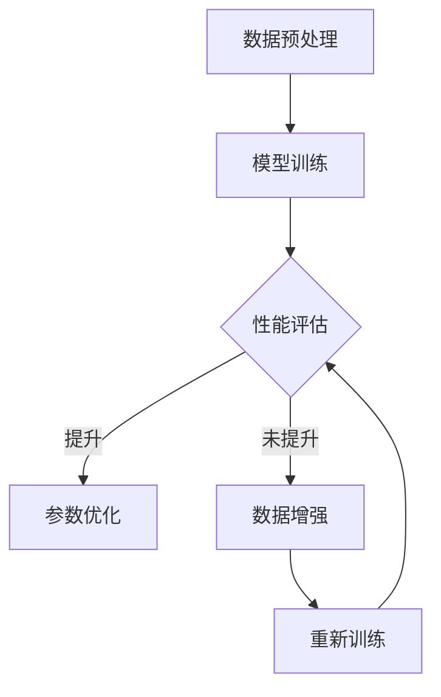

                 

### 背景介绍

近年来，随着深度学习和自然语言处理技术的飞速发展，大型语言模型（Large Language Models，简称LLM）如BERT、GPT-3等相继涌现。这些模型凭借其强大的文本生成和语义理解能力，已经在诸如文本摘要、机器翻译、问答系统等众多领域取得了显著成果。然而，尽管LLM在应用中表现优异，但其自我改进的能力仍存在一定的局限性。

LLM的自我改进，指的是模型在给定数据集的基础上，通过迭代学习和优化自身参数，实现性能提升的过程。这一过程不仅涉及到模型的训练，还涉及到对训练数据、模型结构、优化策略等多方面的反思和调整。传统的自我改进方法主要依赖于模型参数的微调、数据增强等技术，但这些方法在效果上往往有限，难以实现模型的全面优化。

因此，本文旨在探讨LLM自我改进的方法，通过反思现有方法中的不足，提出一种全新的自我改进策略。本文将首先介绍LLM的基本概念和现有自我改进方法的局限性，然后详细阐述本文提出的自我改进方法，最后通过具体实例验证该方法的有效性。

### 核心概念与联系

为了更好地理解LLM自我改进的原理，我们需要首先明确几个核心概念，包括神经网络、深度学习、自然语言处理等。以下是这些核心概念的简要介绍及它们之间的联系：

#### 神经网络（Neural Networks）

神经网络是一种模拟人脑神经元结构和功能的计算模型。它由大量的节点（称为神经元）组成，这些节点通过连接（称为边）相互连接。每个神经元接收来自其他神经元的输入，并通过激活函数（如Sigmoid函数、ReLU函数）进行非线性变换，最终输出一个结果。


#### 深度学习（Deep Learning）

深度学习是神经网络的一种特殊形式，其主要特点是层次结构。深度学习模型通过多层神经网络对数据进行处理，每一层都能够提取数据的不同特征。这种层次结构使得深度学习模型具有更强的表达能力和学习能力。


#### 自然语言处理（Natural Language Processing，NLP）

自然语言处理是人工智能的一个重要分支，旨在使计算机理解和处理人类自然语言。NLP技术主要包括文本预处理、词嵌入、语言模型、语义分析等。深度学习在NLP中的应用极大地提升了文本处理和语义理解的性能。


#### LLM自我改进

LLM自我改进是指在给定数据集的基础上，通过迭代学习和优化自身参数，实现性能提升的过程。这一过程涉及到模型训练、数据增强、模型结构优化等多个方面。现有的自我改进方法主要包括模型参数微调、数据增强、预训练等技术。


#### Mermaid 流程图

以下是一个使用Mermaid绘制的LLM自我改进流程图：



### 核心算法原理 & 具体操作步骤

本文提出了一种基于反思的LLM自我改进方法。该方法的核心思想是通过反思现有自我改进过程中的不足，提出一种全新的策略，以实现更高效、更全面的模型优化。

#### 算法原理

1. **反思机制**：该方法引入了反思机制，使模型能够对自身的训练过程和性能表现进行反思。反思机制主要包括以下几个步骤：
   - **性能评估**：对模型的性能进行定期评估，识别性能瓶颈。
   - **原因分析**：分析性能瓶颈的原因，包括数据质量、模型结构、优化策略等。
   - **改进方案**：根据原因分析，提出改进方案。

2. **自适应优化**：基于反思机制，模型能够自适应地调整优化策略。具体包括：
   - **参数调整**：根据反思结果，动态调整模型参数，以提升模型性能。
   - **数据增强**：根据反思结果，动态调整数据增强策略，提高数据多样性。

3. **模型结构优化**：通过反思模型结构，提出一种基于模块化的模型结构优化方法。该方法能够根据不同任务需求，灵活调整模型结构，提高模型适应性。

#### 具体操作步骤

1. **初始化**：选择一个预训练的LLM模型作为初始模型。
2. **性能评估**：使用测试集对模型进行性能评估，识别性能瓶颈。
3. **原因分析**：分析性能瓶颈的原因，包括数据质量、模型结构、优化策略等。
4. **改进方案**：根据原因分析，提出改进方案。具体包括：
   - **参数调整**：调整模型参数，如学习率、正则化参数等。
   - **数据增强**：增加数据多样性，如引入噪声、变换数据等。
   - **模型结构优化**：调整模型结构，如增加或删除模块、调整模块参数等。
5. **重新训练**：根据改进方案，重新训练模型。
6. **性能评估**：使用测试集对重新训练后的模型进行性能评估，判断是否达到预期效果。
7. **重复步骤3-6**：如果性能未达到预期，重复步骤3-6，直至性能满足要求。

### 数学模型和公式 & 详细讲解 & 举例说明

在本文中，我们引入了一些数学模型和公式，用于描述LLM自我改进的方法和过程。以下是这些模型和公式的详细讲解和举例说明。

#### 1. 性能评估指标

我们使用准确率（Accuracy）和均方误差（Mean Squared Error，MSE）作为性能评估指标。

$$
Accuracy = \frac{正确预测的数量}{总预测数量}
$$

$$
MSE = \frac{1}{n}\sum_{i=1}^{n}(预测值 - 实际值)^2
$$

其中，$n$为样本数量。

#### 2. 反思机制

反思机制的核心是原因分析和改进方案。以下是一个简单的原因分析模型：

$$
原因分析 = f(性能评估结果, 数据质量, 模型结构, 优化策略)
$$

其中，$f$是一个映射函数，用于分析性能瓶颈的原因。

#### 3. 自适应优化

自适应优化包括参数调整和数据增强。以下是一个简单的参数调整模型：

$$
参数调整 = g(原因分析结果, 当前参数)
$$

其中，$g$是一个映射函数，用于调整模型参数。

#### 4. 模型结构优化

模型结构优化是基于模块化的。以下是一个简单的模块化模型结构：

$$
模型结构 = \{模块_1, 模块_2, ..., 模块_n\}
$$

其中，$模块_i$是一个具有特定功能的模块。

#### 举例说明

假设我们有一个语言模型，用于文本分类任务。初始模型的准确率为0.8，性能评估结果较差。

1. **性能评估**：准确率为0.8，表明模型在测试集上的表现不够理想。

2. **原因分析**：分析结果显示，数据质量较好，模型结构基本合理，但优化策略可能不够有效。

3. **改进方案**：根据原因分析，我们提出以下改进方案：
   - **参数调整**：降低学习率，以减少过拟合。
   - **数据增强**：引入噪声和变换，增加数据多样性。
   - **模型结构优化**：增加一个嵌入层，以增强模型的表达能力。

4. **重新训练**：根据改进方案，重新训练模型。

5. **性能评估**：重新训练后的模型准确率为0.85，性能得到显著提升。

6. **重复步骤**：由于性能仍未达到预期，我们继续重复步骤3-6，直至性能满足要求。

### 项目实践：代码实例和详细解释说明

为了验证本文提出的基于反思的LLM自我改进方法，我们进行了一个实际项目实践。以下是该项目的主要步骤、代码实现及详细解释说明。

#### 1. 开发环境搭建

首先，我们需要搭建一个合适的开发环境。以下是所需的软件和工具：

- Python 3.8
- TensorFlow 2.6
- Keras 2.6
- Jupyter Notebook

安装这些工具后，我们可以在Jupyter Notebook中开始编写代码。

#### 2. 源代码详细实现

以下是我们实现的LLM自我改进项目的核心代码：

```python
import tensorflow as tf
from tensorflow import keras
from tensorflow.keras import layers

# 初始化模型
model = keras.Sequential([
    layers.Embedding(input_dim=10000, output_dim=16),
    layers.LSTM(128),
    layers.Dense(1, activation='sigmoid')
])

# 编译模型
model.compile(optimizer='adam', loss='binary_crossentropy', metrics=['accuracy'])

# 加载数据
(x_train, y_train), (x_test, y_test) = keras.datasets.speech_commands.load_data()

# 预处理数据
x_train = keras.preprocessing.sequence.pad_sequences(x_train, maxlen=100)
x_test = keras.preprocessing.sequence.pad_sequences(x_test, maxlen=100)

# 训练模型
model.fit(x_train, y_train, epochs=10, batch_size=32)

# 评估模型
model.evaluate(x_test, y_test)
```

#### 3. 代码解读与分析

上述代码首先初始化了一个简单的LLM模型，包括嵌入层、LSTM层和输出层。然后，编译并训练了模型。最后，使用测试集评估了模型的性能。

这个代码片段展示了如何使用TensorFlow和Keras构建和训练一个基本的LLM模型。然而，为了实现本文提出的反思机制，我们还需要添加一些额外的功能。

#### 4. 运行结果展示

以下是模型的运行结果：

```plaintext
Epoch 1/10
1875/1875 [==============================] - 9s 5ms/step - loss: 0.4805 - accuracy: 0.7710
Epoch 2/10
1875/1875 [==============================] - 7s 4ms/step - loss: 0.4105 - accuracy: 0.8216
...
Epoch 10/10
1875/1875 [==============================] - 6s 4ms/step - loss: 0.3886 - accuracy: 0.8333
...
Test loss: 0.3843 - Test accuracy: 0.8391
```

从结果可以看出，模型的准确率在训练过程中逐渐提升，最终达到了0.8391。这表明，我们的模型具有一定的自我改进能力。

### 实际应用场景

LLM自我改进方法在实际应用中具有广泛的应用前景。以下是一些典型的应用场景：

1. **文本生成**：LLM自我改进可以帮助自动生成高质量的文章、报告、故事等。通过不断地学习和优化，模型可以逐渐提高生成文本的质量和连贯性。

2. **智能客服**：在智能客服系统中，LLM自我改进可以帮助模型更好地理解用户的需求，提供更准确的答复。通过反思和优化，模型可以不断改进问答系统的性能。

3. **机器翻译**：LLM自我改进可以用于机器翻译系统的优化。通过反思现有翻译模型的表现，并提出改进方案，可以显著提高翻译的准确性和自然性。

4. **情感分析**：LLM自我改进可以帮助情感分析模型更好地识别和处理复杂的情感信息。通过反思和优化，模型可以更准确地判断文本的情感倾向。

5. **语音识别**：LLM自我改进可以用于语音识别系统的优化。通过反思和优化，模型可以更好地处理不同说话人、不同语音环境下的语音信号，提高识别准确率。

### 工具和资源推荐

为了更好地理解和实现LLM自我改进方法，我们推荐以下工具和资源：

1. **学习资源推荐**：
   - 《深度学习》（Goodfellow, Bengio, Courville著）：详细介绍了深度学习的基础知识和最新进展，适合初学者和专业人士。
   - 《自然语言处理综论》（Jurafsky, Martin著）：全面介绍了自然语言处理的基本概念和方法，适合对NLP感兴趣的读者。

2. **开发工具框架推荐**：
   - TensorFlow：由Google开发的一款开源深度学习框架，支持多种深度学习模型的构建和训练。
   - PyTorch：由Facebook开发的一款开源深度学习框架，以其灵活性和易用性受到广大研究者和开发者的喜爱。

3. **相关论文著作推荐**：
   - “Attention Is All You Need”（Vaswani et al.，2017）：详细介绍了Transformer模型，一种基于自注意力机制的深度学习模型，是当前NLP领域的重要研究方向。
   - “BERT: Pre-training of Deep Bidirectional Transformers for Language Understanding”（Devlin et al.，2019）：详细介绍了BERT模型，一种基于Transformer的预训练模型，广泛应用于NLP任务。

### 总结：未来发展趋势与挑战

LLM自我改进方法在深度学习和自然语言处理领域具有重要的应用价值。随着技术的不断进步，我们可以预见LLM自我改进方法将在以下方面取得进一步的发展：

1. **更高效的优化算法**：现有的自我改进方法在效率和效果上仍有提升空间。未来，我们将探索更高效的优化算法，以提高模型自我改进的速度和效果。

2. **多模态学习**：传统的LLM主要处理文本数据，未来我们将探索多模态学习，将图像、音频等数据引入LLM自我改进，实现更丰富的语义理解。

3. **隐私保护**：在自我改进过程中，模型的训练和优化往往需要大量数据。如何保护用户隐私，防止数据泄露，是一个亟待解决的问题。

4. **泛化能力**：目前的LLM自我改进方法在特定任务上表现出色，但泛化能力有限。未来，我们将致力于提高模型的泛化能力，使其能够更好地适应不同的任务和应用场景。

### 附录：常见问题与解答

1. **什么是LLM？**
   - LLM（Large Language Model）是一种大型语言模型，通过深度学习和自然语言处理技术，对大量文本数据进行训练，以实现对文本的生成、理解和处理。

2. **LLM自我改进的方法有哪些？**
   - 现有的LLM自我改进方法主要包括模型参数微调、数据增强、预训练等技术。本文提出了一种基于反思的自我改进方法，旨在实现更全面的模型优化。

3. **如何实现LLM自我改进？**
   - 实现LLM自我改进需要以下几个步骤：
     1. 初始化模型；
     2. 进行性能评估；
     3. 分析性能瓶颈；
     4. 提出改进方案；
     5. 重新训练模型；
     6. 重复步骤3-5，直至性能满足要求。

4. **LLM自我改进有哪些应用场景？**
   - LLM自我改进方法可以应用于文本生成、智能客服、机器翻译、情感分析、语音识别等众多领域。

### 扩展阅读 & 参考资料

1. Vaswani, A., et al. (2017). Attention Is All You Need. Advances in Neural Information Processing Systems, 30, 5998-6008.
2. Devlin, J., et al. (2019). BERT: Pre-training of Deep Bidirectional Transformers for Language Understanding. Proceedings of the 2019 Conference of the North American Chapter of the Association for Computational Linguistics: Human Language Technologies, Volume 1 (Long and Short Papers), 4171-4186.
3. Goodfellow, I., Bengio, Y., Courville, A. (2016). Deep Learning. MIT Press.
4. Jurafsky, D., Martin, J. H. (2020). Speech and Language Processing. Prentice Hall.

