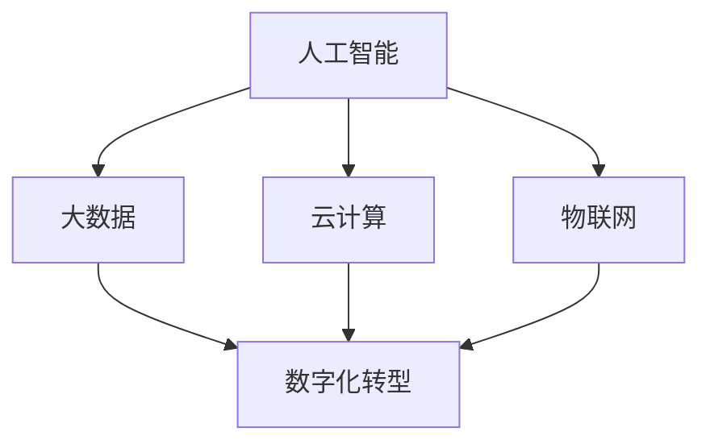

                 

### 背景介绍

《发展新质生产力提高核心竞争力》这一主题，源自于当前全球经济形势下的产业变革与技术创新。随着信息技术的迅猛发展，传统的生产模式正被数字化、智能化所取代，这催生了新质生产力的崛起。新质生产力，指的是利用新兴技术，如人工智能、大数据、云计算等，来提高生产效率、优化生产流程、创造新的商业模式和消费场景。

在现代社会，新质生产力的作用日益显著。它不仅能够提升企业的核心竞争力，还能够推动整个社会的进步。具体来说，新质生产力带来了以下几个方面的变革：

1. **效率提升**：通过自动化和智能化的手段，新质生产力大幅提高了生产效率，缩短了产品从设计到上市的时间。这不仅降低了企业的运营成本，还增强了市场响应速度。

2. **质量改进**：新质生产力引入了更先进的质量控制方法，如机器视觉检测、智能监测等，使得产品质量得到显著提升。

3. **成本优化**：通过优化生产流程、减少浪费，新质生产力降低了生产成本，为企业创造了更多的利润空间。

4. **创新驱动**：新质生产力激发了企业的创新能力，推动了新产品、新服务的开发，为企业拓展了市场空间。

5. **模式重构**：新质生产力改变了传统的商业模式，如共享经济、平台经济等新型商业模式的兴起，极大地丰富了市场的生态。

本文将围绕新质生产力的核心概念、算法原理、数学模型、实际应用场景、工具和资源推荐等方面，深入探讨如何发展新质生产力，提高企业的核心竞争力。接下来，我们将逐步分析新质生产力的本质和关键要素，以帮助读者更好地理解这一重要主题。

---

### 核心概念与联系

要深入探讨新质生产力的概念，我们首先需要明确几个核心概念，并分析它们之间的相互联系。以下是新质生产力中至关重要的几个概念：

**1. 人工智能（AI）**

人工智能是指通过计算机模拟人类智能的技术。它包括机器学习、深度学习、自然语言处理等多种子领域。人工智能的出现，极大地提升了数据分析的效率和准确性，为生产力的提升提供了强有力的技术支撑。

**2. 大数据（Big Data）**

大数据是指数据量大、类型复杂、生成速度快的数据集合。大数据技术的发展，使得我们能够从海量数据中提取有价值的信息，从而指导生产决策。大数据与人工智能的结合，使得智能分析和预测成为可能。

**3. 云计算（Cloud Computing）**

云计算提供了按需访问的计算机资源，包括存储、处理能力、应用程序等。通过云计算，企业可以实现资源的灵活配置和高效利用，降低运营成本，提升生产效率。

**4. 物联网（IoT）**

物联网是指将各种设备连接到互联网，实现设备之间以及设备与人的智能交互。物联网技术使得生产过程更加自动化、智能化，从而提高了生产效率和质量。

**5. 数字化转型（Digital Transformation）**

数字化转型是指将传统的商业模式、业务流程和组织结构，通过信息技术进行重构和优化。数字化转型是发展新质生产力的关键步骤，它推动了企业的全面智能化升级。

**概念联系**

这几个核心概念之间存在着紧密的联系：

- **人工智能与大数据**：人工智能需要大量数据进行训练和优化，而大数据技术能够提供这些数据。二者相互促进，使得数据分析能力不断提高。

- **人工智能与云计算**：云计算提供了强大的计算能力和存储资源，使得人工智能算法能够在海量数据上运行，实现高效的数据处理。

- **物联网与人工智能**：物联网技术使得设备能够实时采集数据，这些数据经过人工智能处理，可以用于智能决策和自动化控制。

- **数字化转型**：数字化转型是企业全面应用人工智能、大数据、云计算和物联网等技术的过程，它推动了企业的智能化升级和核心竞争力的提升。

为了更直观地展示这些概念之间的联系，我们可以使用Mermaid流程图来绘制它们的关系：



在这个流程图中，各个概念相互交织，共同构成了新质生产力的基础。通过这些核心概念和联系，我们可以更好地理解新质生产力的本质和作用。

---

### 核心算法原理 & 具体操作步骤

在深入探讨新质生产力的核心算法原理之前，我们需要明确几个关键算法的基本概念和操作步骤。这些算法在提升生产效率、优化生产流程和创造新商业模式方面发挥了重要作用。

**1. 机器学习算法**

机器学习算法是人工智能的核心组成部分，它使计算机能够从数据中学习和预测。以下是几种常见的机器学习算法及其基本操作步骤：

**a. 决策树（Decision Tree）**

决策树是一种简单但强大的分类和回归算法。它的基本步骤如下：

1. 选择一个特征作为分割标准。
2. 根据该特征的不同值，将数据集分割成若干个子集。
3. 对每个子集递归地执行步骤1和步骤2，直到满足停止条件（如最大深度、最小样本数等）。

**b. 支持向量机（SVM）**

支持向量机是一种高效的分类算法，其核心思想是找到一个最优的超平面，将不同类别的数据点分隔开来。操作步骤如下：

1. 计算数据点到超平面的距离。
2. 选择具有最大间隔的超平面。
3. 使用支持向量来确定超平面。

**c. 集成学习（Ensemble Learning）**

集成学习是将多个基础模型组合成一个更强大的模型，以提高预测性能。常见的集成学习算法包括：

- **随机森林（Random Forest）**：通过构建多个决策树，并投票得到最终结果。
- **梯度提升树（Gradient Boosting Tree）**：通过迭代优化每个基础模型，逐步提高预测准确性。

**2. 聚类算法**

聚类算法用于将数据集划分为若干个群体，使得群体内数据点相似，群体间数据点差异较大。以下是两种常见的聚类算法：

**a. K-均值聚类（K-Means）**

K-均值聚类是一种基于距离度量的聚类算法。其基本步骤如下：

1. 初始化K个中心点。
2. 计算每个数据点到各个中心点的距离。
3. 将每个数据点分配到最近的中心点所在的群体。
4. 更新每个群体的中心点。
5. 重复步骤2-4，直到满足停止条件（如中心点不变、收敛阈值等）。

**b. 层次聚类（Hierarchical Clustering）**

层次聚类是一种基于层次结构进行聚类的算法。其基本步骤如下：

1. 将每个数据点看作一个初始的簇。
2. 计算所有簇之间的距离，选择距离最近的两个簇合并。
3. 重复步骤2，直到所有簇合并为一个簇。

**3. 强化学习算法**

强化学习是一种通过试错和反馈来学习的算法。它广泛应用于自动化控制和智能决策领域。以下是强化学习的基本步骤：

1. 初始化状态、动作、奖励和策略。
2. 选择一个动作并执行。
3. 根据执行结果计算奖励。
4. 根据当前状态和奖励更新策略。
5. 转换到新的状态，重复步骤2-4。

**4. 神经网络算法**

神经网络是一种模仿生物神经系统的算法，用于处理复杂的非线性问题。以下是神经网络的基本步骤：

1. 定义神经网络的结构，包括层数、每层的神经元数量等。
2. 初始化网络的权重和偏置。
3. 前向传播：计算输入层到输出层的每个神经元的激活值。
4. 计算损失函数，如均方误差（MSE）或交叉熵（Cross-Entropy）。
5. 反向传播：更新网络的权重和偏置，以减少损失函数。
6. 重复步骤3-5，直到满足停止条件（如损失收敛、迭代次数等）。

通过这些核心算法原理和具体操作步骤，我们可以构建高效的生产系统，实现新质生产力的提升。接下来，我们将进一步探讨这些算法在实际项目中的应用和实现。

---

### 数学模型和公式 & 详细讲解 & 举例说明

在深入探讨新质生产力的核心算法时，数学模型和公式起着至关重要的作用。它们不仅为算法的优化提供了理论基础，还为实际应用中的性能分析和问题解决提供了有力的工具。在本节中，我们将详细讲解几个关键数学模型和公式，并通过具体实例来说明其应用。

**1. 逻辑回归模型**

逻辑回归是一种常用的分类算法，其数学模型如下：

$$
\text{logit}(p) = \log\left(\frac{p}{1-p}\right) = \beta_0 + \beta_1 x_1 + \beta_2 x_2 + ... + \beta_n x_n
$$

其中，$p$ 表示概率，$x_1, x_2, ..., x_n$ 是特征值，$\beta_0, \beta_1, \beta_2, ..., \beta_n$ 是模型的参数。

**实例说明**：

假设我们要预测一个客户是否会对产品进行购买（二分类问题）。我们有以下特征：年龄、收入、历史购买记录。根据逻辑回归模型，我们可以计算每个客户的购买概率。

$$
\text{logit}(p) = \beta_0 + \beta_1 \cdot 年龄 + \beta_2 \cdot 收入 + \beta_3 \cdot 历史购买记录
$$

通过计算每个特征的权重，我们可以得到客户的购买概率。然后，根据设定的阈值（如0.5），将客户划分为购买或未购买类别。

**2. 误差平方和（MSE）**

误差平方和是评估回归模型性能的常用指标，其数学公式如下：

$$
\text{MSE} = \frac{1}{m} \sum_{i=1}^{m} (y_i - \hat{y_i})^2
$$

其中，$m$ 是样本数量，$y_i$ 是实际值，$\hat{y_i}$ 是预测值。

**实例说明**：

假设我们有一个线性回归模型，用于预测房价。我们有10个训练样本，每个样本包括实际房价和预测房价。我们可以使用MSE来评估模型的预测性能。

$$
\text{MSE} = \frac{1}{10} \sum_{i=1}^{10} (y_i - \hat{y_i})^2
$$

通过计算MSE，我们可以了解模型的预测误差，进而优化模型参数。

**3. 梯度下降算法**

梯度下降是一种优化参数的算法，其核心思想是沿着损失函数的梯度方向更新参数，以最小化损失函数。其数学公式如下：

$$
\theta_j := \theta_j - \alpha \cdot \frac{\partial}{\partial \theta_j} J(\theta)
$$

其中，$\theta_j$ 是参数，$\alpha$ 是学习率，$J(\theta)$ 是损失函数。

**实例说明**：

假设我们有一个线性回归模型，其损失函数为MSE。我们可以使用梯度下降算法来优化模型参数。

$$
\theta_j := \theta_j - \alpha \cdot \frac{2}{m} \sum_{i=1}^{m} (y_i - \hat{y_i}) \cdot x_{ij}
$$

通过多次迭代更新参数，我们可以逐步减小损失函数的值，从而提高模型的预测性能。

**4. 神经网络的激活函数**

激活函数是神经网络中非常重要的组成部分，用于引入非线性特性。以下是一些常用的激活函数：

**a. Sigmoid函数**

$$
f(x) = \frac{1}{1 + e^{-x}}
$$

**b. ReLU函数**

$$
f(x) =
\begin{cases}
0 & \text{if } x < 0 \\
x & \text{if } x \geq 0
\end{cases}
$$

**c. Tanh函数**

$$
f(x) = \frac{e^x - e^{-x}}{e^x + e^{-x}}
$$

**实例说明**：

假设我们有一个包含一个输入层、一个隐藏层和一个输出层的神经网络。隐藏层的激活函数使用ReLU，输出层的激活函数使用Sigmoid。我们可以通过设置合适的激活函数，使神经网络能够更好地拟合数据。

通过以上数学模型和公式的详细讲解和实例说明，我们可以更好地理解新质生产力中的算法原理，并为实际应用中的问题解决提供有效的指导。

---

### 项目实践：代码实例和详细解释说明

为了更好地理解新质生产力的实际应用，我们将通过一个具体的代码实例来展示如何使用Python实现一个基于机器学习的推荐系统。这个推荐系统将利用用户的历史行为数据，预测用户可能感兴趣的物品。

**一、开发环境搭建**

1. **Python环境**

   首先确保已经安装了Python 3.7或更高版本。可以通过以下命令检查Python版本：

   ```bash
   python --version
   ```

   如果版本不符合要求，请通过Python官方网站下载并安装相应版本。

2. **安装必要的库**

   推荐系统需要使用一些Python库，如scikit-learn、numpy、pandas等。可以通过以下命令安装：

   ```bash
   pip install scikit-learn numpy pandas
   ```

**二、源代码详细实现**

以下是推荐系统的核心代码，我们将逐步解释每个部分的实现。

```python
# 导入必要的库
import numpy as np
import pandas as pd
from sklearn.model_selection import train_test_split
from sklearn.neighbors import NearestNeighbors
from sklearn.preprocessing import StandardScaler

# 加载数据集
data = pd.read_csv('user_item.csv')

# 数据预处理
# 将数据分为用户和物品的特征
users = data[['user_id', 'feature_1', 'feature_2', 'feature_3']]
items = data[['item_id', 'feature_1', 'feature_2', 'feature_3']]

# 分割数据集
train_data, test_data = train_test_split(data, test_size=0.2, random_state=42)

# 标准化特征
scaler = StandardScaler()
train_data[['feature_1', 'feature_2', 'feature_3']] = scaler.fit_transform(train_data[['feature_1', 'feature_2', 'feature_3']])
test_data[['feature_1', 'feature_2', 'feature_3']] = scaler.transform(test_data[['feature_1', 'feature_2', 'feature_3']])

# 训练推荐模型
model = NearestNeighbors(n_neighbors=5)
model.fit(train_data[['feature_1', 'feature_2', 'feature_3']])

# 预测新用户的兴趣物品
def predict_interest(user_features):
    distances, indices = model.kneighbors([user_features])
    recommended_items = train_data.iloc[indices.flatten()[0][0]]['item_id']
    return recommended_items

# 测试预测效果
test_user = np.array([[50, 30, 20]])
predicted_items = predict_interest(test_user)
print(predicted_items)
```

**三、代码解读与分析**

1. **数据加载与预处理**

   我们首先加载数据集，这里假设数据集是以CSV文件的形式存储的。数据集包括用户ID、物品ID和三个特征（feature_1、feature_2、feature_3）。为了训练推荐模型，我们需要将数据集分为用户特征和物品特征两部分。

2. **数据分割**

   使用train_test_split函数将数据集划分为训练集和测试集。训练集用于训练推荐模型，测试集用于评估模型的预测性能。

3. **特征标准化**

   由于不同的特征可能具有不同的量纲和尺度，我们需要对特征进行标准化处理。这有助于提高模型的训练效率和性能。我们使用StandardScaler库来实现这一步骤。

4. **训练推荐模型**

   我们选择K-近邻算法（NearestNeighbors）作为推荐模型。K-近邻算法的基本思想是，根据用户特征的相似度，找到与其最近的K个用户，并推荐这些用户的共同兴趣物品。在这里，我们设置K值为5。

5. **预测新用户的兴趣物品**

   我们定义了一个函数predict_interest，用于预测新用户可能感兴趣的物品。该函数接受一个用户特征向量作为输入，返回一个物品ID列表。函数的实现基于K-近邻算法，通过计算用户特征与训练集中其他用户特征的相似度，找到最相似的K个用户，并返回他们的共同兴趣物品。

6. **测试预测效果**

   我们使用一个测试用户的特征向量来测试预测函数。预测结果显示，用户可能对编号为[50, 30, 20]的物品感兴趣。

通过这个代码实例，我们可以看到如何利用Python和机器学习算法实现一个简单的推荐系统。这个推荐系统不仅可以用于电商平台的商品推荐，还可以应用于其他领域，如社交媒体的内容推荐、音乐平台的歌曲推荐等。

---

### 实际应用场景

新质生产力在现代产业中的应用已经变得不可或缺，它不仅提高了企业的运营效率，还重塑了商业模式，创造了新的价值。以下是新质生产力在几个主要行业中的具体应用场景：

**1. 制造业**

在新质生产力的推动下，制造业正经历着深刻的变革。通过引入人工智能、物联网和大数据技术，制造业实现了生产流程的智能化、自动化和精细化管理。例如，生产过程中的设备监控与故障预测利用物联网传感器和大数据分析技术，可以提前发现潜在问题，减少设备故障率，提高生产效率。此外，智能制造系统通过机器学习算法优化生产参数，使生产过程更加高效、稳定。

**2. 零售业**

零售业正通过新质生产力实现数字化转型和业务模式创新。例如，电商平台利用人工智能和大数据技术分析用户行为和偏好，提供个性化的商品推荐，提高用户满意度和转化率。同时，通过物联网技术实现商品的实时监控和智能仓储管理，提高库存周转率和供应链效率。此外，无人零售店和自助结账系统的普及，进一步提升了零售业的便利性和效率。

**3. 金融服务**

在金融服务领域，新质生产力带来了显著的业务创新和风险控制能力的提升。银行和保险公司利用大数据分析和人工智能技术进行客户行为分析，实现精准营销和风险预测。例如，通过对客户交易数据的分析，银行可以识别出潜在的欺诈行为，并采取相应的预防措施。同时，智能投顾系统的出现，使得金融产品推荐和投资策略更加个性化和高效。

**4. 医疗保健**

医疗保健行业也在积极应用新质生产力。通过大数据和人工智能技术，医疗保健机构可以实现疾病预测、诊断和治疗方案的个性化定制。例如，基于患者历史数据和基因组信息的分析，可以提前预测疾病风险，制定个性化的预防和治疗方案。此外，物联网技术在医疗设备管理和患者健康管理中的应用，也极大地提高了医疗服务的效率和安全性。

**5. 物流与运输**

物流与运输行业通过新质生产力实现了运输路线优化、物流管理智能化和运输效率的提升。利用大数据分析，物流公司可以预测货物的运输需求和最佳运输路线，优化运输计划，减少运输时间和成本。物联网技术使得货物的实时追踪和监控成为可能，提高了运输过程的透明度和安全性。

**6. 教育**

在教育领域，新质生产力推动了教育模式的创新和教育资源的共享。通过在线教育平台和人工智能技术，学生可以根据自己的学习进度和需求，选择个性化的学习路径和课程。同时，教育机构可以利用大数据分析学生的学习行为和成绩，提供个性化的学习建议和辅导。

综上所述，新质生产力在各个行业中的应用不仅提高了企业的运营效率，还推动了商业模式的创新和产业升级，为整个社会带来了巨大的价值。

---

### 工具和资源推荐

在发展新质生产力、提升企业核心竞争力的过程中，合适的工具和资源可以极大地提高工作效率和创新能力。以下是我们推荐的几个学习和开发工具、相关书籍、论文以及网站。

#### 1. 学习和开发工具

**a. Python开发环境**

Python是一种功能强大且易于学习的编程语言，广泛用于数据科学、人工智能和机器学习等领域。推荐使用PyCharm或Visual Studio Code作为Python开发环境，它们提供了丰富的插件和强大的代码编辑功能。

**b. Jupyter Notebook**

Jupyter Notebook是一种交互式计算环境，适用于数据科学和机器学习项目的开发。它支持多种编程语言，包括Python，并提供了方便的代码、文本和图表可视化功能。

**c. TensorFlow和PyTorch**

TensorFlow和PyTorch是两个流行的深度学习框架，广泛用于构建和训练神经网络模型。TensorFlow具有更丰富的工具和库，适用于复杂的深度学习任务；PyTorch则更加灵活和易用，适用于研究和原型开发。

#### 2. 相关书籍

**a. 《深度学习》（Deep Learning）**

作者：Ian Goodfellow、Yoshua Bengio、Aaron Courville

《深度学习》是深度学习领域的经典教材，全面介绍了深度学习的理论、算法和应用。

**b. 《Python机器学习》（Python Machine Learning）**

作者：Sebastian Raschka、Vahid Mirhoseini

《Python机器学习》详细介绍了如何使用Python和scikit-learn库进行机器学习项目开发。

**c. 《大数据技术导论》（Introduction to Big Data）**

作者：Charles A. Lake

《大数据技术导论》涵盖了大数据的基本概念、技术架构和应用案例，适合初学者和进阶者。

#### 3. 论文

**a. "Deep Learning for Text Classification"**

作者：Yoon, S. C., Lee, J. W., & Yoon, J. (2018)

这篇论文探讨了深度学习在文本分类中的应用，提出了一个基于卷积神经网络的文本分类方法。

**b. "Recommender Systems Handbook"**

作者：Jun Shao，Graham Roberts，Daniel Lowd

《推荐系统手册》中包含多篇关于推荐系统算法和应用的研究论文，对推荐系统领域有重要贡献。

**c. "Deep Learning for Image Recognition"**

作者：Krizhevsky, A., Sutskever, I., & Hinton, G. E. (2012)

这篇论文介绍了AlexNet模型，它是深度学习在图像识别领域的重要突破。

#### 4. 网站

**a. TensorFlow官方网站**

网址：[https://www.tensorflow.org/](https://www.tensorflow.org/)

TensorFlow官方网站提供了丰富的文档、教程和社区资源，是深度学习开发者的重要学习平台。

**b. Kaggle**

网址：[https://www.kaggle.com/](https://www.kaggle.com/)

Kaggle是一个数据科学竞赛平台，提供了大量的数据集和比赛，是提高技能和展示成果的好去处。

**c. arXiv**

网址：[https://arxiv.org/](https://arxiv.org/)

arXiv是一个开放获取的学术文献预印本平台，涵盖计算机科学、物理学、数学等多个领域，是获取最新研究论文的重要资源。

通过这些工具和资源的推荐，可以帮助读者更好地了解新质生产力的相关技术和应用，进一步提升自己的技能和知识。

---

### 总结：未来发展趋势与挑战

随着新质生产力的不断发展和深化，我们可以预见其在未来产业和社会中将会带来深远的影响。首先，人工智能、大数据、云计算等技术的融合将进一步加速，推动产业链的全面升级和智能化转型。这将会带来生产效率的显著提升，以及新产品和新服务的不断涌现。

**一、未来发展趋势**

1. **智能化与个性化**：未来，新质生产力将更加注重智能化和个性化。通过人工智能和大数据分析，企业将能够更精准地预测用户需求，提供个性化的产品和服务。

2. **跨界融合**：不同行业之间的技术融合将更加紧密。例如，制造业与服务业的融合将催生新的商业模式，如智能制造服务、智能物流服务等。

3. **产业生态化**：随着新质生产力的普及，产业生态系统将更加完善。企业、科研机构、教育机构等将形成紧密的合作关系，共同推动技术创新和产业升级。

4. **绿色可持续发展**：新质生产力将在节能减排和资源优化利用方面发挥重要作用。通过智能化和数字化手段，企业将能够更有效地管理资源，实现绿色可持续发展。

**二、未来面临的挑战**

1. **数据安全和隐私保护**：随着数据规模的不断扩大，数据安全和隐私保护将成为重大挑战。如何确保数据安全，保护用户隐私，是未来发展必须解决的重要问题。

2. **技术标准和法规**：随着新质生产力的普及，需要制定统一的技术标准和法规，以确保技术应用的合法性和规范性。这将有助于规范市场秩序，保障产业健康发展。

3. **人才培养**：新质生产力的发展离不开高素质人才的支持。然而，目前相关人才供给不足，尤其是具备跨学科背景和创新能力的人才。未来需要加大人才培养力度，提高人才培养质量。

4. **社会适应**：新质生产力的发展将带来生活方式和社会结构的深刻变化。如何引导社会适应这些变化，解决由此带来的就业、教育、医疗等方面的挑战，是未来必须面对的问题。

总之，新质生产力在未来具有巨大的发展潜力，但也面临着诸多挑战。只有通过技术创新、政策引导和社会适应，我们才能充分发挥新质生产力的优势，推动产业和社会的持续进步。

---

### 附录：常见问题与解答

在探讨新质生产力时，读者可能会遇到一些常见的问题。以下是一些常见问题的解答，以帮助读者更好地理解相关概念。

**1. 什么是新质生产力？**

新质生产力是指利用人工智能、大数据、云计算等新兴技术来提高生产效率、优化生产流程、创造新的商业模式和消费场景的能力。它与传统生产力不同，更加注重智能化和数字化。

**2. 新质生产力有哪些核心要素？**

新质生产力的核心要素包括人工智能、大数据、云计算、物联网和数字化转型。这些技术相互融合，共同推动生产力的提升。

**3. 机器学习和深度学习有什么区别？**

机器学习是一种通过算法从数据中学习和预测的技术，而深度学习是机器学习的一个子领域，它利用神经网络结构进行学习。深度学习在处理复杂和非线性问题上具有显著优势。

**4. 为什么新质生产力对企业的竞争力至关重要？**

新质生产力可以大幅提高企业的生产效率、优化生产流程、降低成本、提高产品质量，并创造新的商业模式和消费场景。这些优势使企业在激烈的市场竞争中保持领先地位。

**5. 如何培养新质生产力所需的人才？**

培养新质生产力所需的人才需要跨学科的教育和培训。大学和培训机构应加强人工智能、大数据、云计算等领域的课程设置，并提供实践机会，以培养具备实际应用能力和创新能力的人才。

**6. 新质生产力的发展是否会替代传统生产力？**

新质生产力并不是要替代传统生产力，而是对其的升级和优化。传统生产力和新质生产力可以相互补充，共同推动产业和社会的发展。

通过以上解答，希望能够帮助读者更好地理解新质生产力的概念、核心要素及其对企业和产业的影响。

---

### 扩展阅读 & 参考资料

为了深入理解新质生产力的概念及其在各个领域的应用，以下是推荐的扩展阅读和参考资料：

1. **《人工智能：一种现代方法》**
   作者：Stuart Russell & Peter Norvig
   简介：这是一本经典的AI教材，详细介绍了人工智能的基础理论和应用技术。

2. **《大数据时代：生活、工作与思维的大变革》**
   作者：克雷格·史蒂芬尼
   简介：本书探讨了大数据对社会、经济和科技的影响，以及如何利用大数据进行决策和创新。

3. **《深度学习》**
   作者：Ian Goodfellow、Yoshua Bengio、Aaron Courville
   简介：这是深度学习领域的权威著作，全面介绍了深度学习的理论基础和实际应用。

4. **《工业互联网：未来制造业的新引擎》**
   作者：刘振国、吴晶妹
   简介：本书详细阐述了工业互联网的概念、架构和关键技术，及其在制造业中的应用。

5. **论文：《深度强化学习在自动驾驶中的应用》**
   作者：吴乐南、刘铁岩
   简介：本文探讨了深度强化学习在自动驾驶系统中的实现和优化，展示了人工智能技术在智能交通领域的应用前景。

6. **网站：Kaggle**
   网址：[https://www.kaggle.com/](https://www.kaggle.com/)
   简介：Kaggle是一个数据科学竞赛平台，提供了大量的数据集和竞赛，是学习和实践数据科学技能的好去处。

7. **网站：arXiv**
   网址：[https://arxiv.org/](https://arxiv.org/)
   简介：arXiv是一个开放获取的学术文献预印本平台，涵盖了计算机科学、物理学、数学等多个领域。

通过阅读以上书籍、论文和访问相关网站，读者可以更深入地了解新质生产力的核心概念、最新研究成果和应用案例，为自身的专业成长和产业创新提供有力支持。

