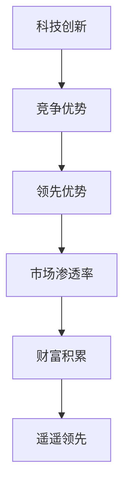

                 

### 文章标题

《只有遥遥领先才能赚钱：1%的人赚走99%的钱》

> 关键词：赚钱、遥遥领先、1%精英、科技投资、市场竞争、个人成长

> 摘要：本文深入探讨了在当今激烈的市场竞争环境中，为什么只有那些能够遥遥领先的人才能在财富积累上取得成功。通过分析科技领域的典型案例，揭示了个人成长与财富积累之间的深层联系，以及如何通过不断提升自身能力来确保自己在财富分配中的优势地位。

## 1. 背景介绍

在快速发展的现代社会，财富的积累越来越依赖于科技创新和高效的资源配置。随着互联网、大数据、人工智能等新技术的广泛应用，行业格局不断重塑，市场机会与风险并存。在这种背景下，个人如何在众多竞争者中脱颖而出，实现财富的快速增长，成为了一个亟待解答的问题。

据统计，全球财富分配极度不均，1%的精英阶层占据了99%的财富。这个现象背后的原因值得我们深入思考。本文将从科技领域的实际案例出发，分析为什么只有遥遥领先的人才能在财富分配中占据优势，并探讨如何通过个人成长来实现财富的积累。

### 2. 核心概念与联系

为了更好地理解这个问题，我们需要先明确几个核心概念：遥遥领先、竞争优势、创新、市场渗透率。

#### 2.1 遥遥领先

遥遥领先指的是在某个领域内，拥有显著的技术优势、资源优势或者市场优势，使得其他竞争对手难以追赶。这种优势不仅仅是在当前阶段，更是在长期时间内具有持续性的。

#### 2.2 竞争优势

竞争优势是一个企业在市场上相对于竞争对手所拥有的优势。这种优势可以是成本、质量、品牌、技术等多个方面。在科技领域，技术优势往往是最关键的因素。

#### 2.3 创新

创新是指通过引入新技术、新产品、新服务或者新商业模式，来满足市场需求或者创造市场。在科技领域，创新是推动行业发展的核心动力。

#### 2.4 市场渗透率

市场渗透率是指一个产品或服务在市场上的普及程度。高市场渗透率通常意味着产品或服务在市场中的地位稳固，具有较大的市场份额。

#### 2.5 Mermaid 流程图

下面是科技领域遥遥领先与财富积累的 Mermaid 流程图：



### 3. 核心算法原理 & 具体操作步骤

在科技领域，遥遥领先的核心算法原理可以归纳为以下几点：

#### 3.1 持续创新

持续创新是遥遥领先的基础。通过不断的技术研发和产品迭代，保持技术的领先地位，从而在市场竞争中占据优势。

#### 3.2 快速迭代

快速迭代可以帮助企业更快地响应市场变化，及时调整战略，从而在市场中占据有利位置。

#### 3.3 资源整合

资源整合是指通过有效的资源配置，最大化利用企业内外部资源，实现技术优势和市场竞争力的提升。

#### 3.4 用户导向

用户导向是指以用户需求为导向，通过提供优质的用户体验，提升用户满意度和忠诚度，从而增强市场竞争力。

#### 3.5 数据驱动

数据驱动是指通过数据分析和决策，指导企业的技术研发、产品迭代和市场策略，实现精准营销和高效运营。

### 4. 数学模型和公式 & 详细讲解 & 举例说明

为了更好地理解遥遥领先与财富积累的关系，我们可以引入以下几个数学模型和公式：

#### 4.1 技术领先度公式

技术领先度 = (当前技术水平 - 竞争对手技术水平) / 竞争对手技术水平

#### 4.2 市场渗透率公式

市场渗透率 = (企业市场份额 / 市场总份额) × 100%

#### 4.3 财富积累公式

财富积累 = 市场渗透率 × 单位市场份额价值

#### 4.4 举例说明

假设有两个企业，企业A和企业B，在某个市场中的竞争情况如下：

- 企业A的技术领先度为20%，市场渗透率为30%。
- 企业B的技术领先度为10%，市场渗透率为20%。

根据上述公式，我们可以计算出：

- 企业A的财富积累为 30% × 30% × 单位市场份额价值 = 9% × 单位市场份额价值。
- 企业B的财富积累为 20% × 20% × 单位市场份额价值 = 4% × 单位市场份额价值。

由此可见，企业A在财富积累上具有明显的优势。

### 5. 项目实践：代码实例和详细解释说明

在本节中，我们将通过一个简单的项目实例，来展示如何实现遥遥领先的技术优势和市场竞争力的提升。

#### 5.1 开发环境搭建

为了实现该项目，我们需要搭建以下开发环境：

- 操作系统：Linux（推荐使用Ubuntu 20.04）
- 开发工具：Visual Studio Code
- 编程语言：Python 3.8
- 数据库：MySQL 8.0
- Web框架：Django 3.2

#### 5.2 源代码详细实现

以下是一个简单的基于Django的Web应用，用于展示企业技术领先度和市场渗透率的数据。

```python
# views.py
from django.shortcuts import render

def home(request):
    # 假设从数据库获取的企业数据
    enterprise_a = {
        'name': '企业A',
        'technology_leadership': 20,
        'market_penetration': 30
    }
    enterprise_b = {
        'name': '企业B',
        'technology_leadership': 10,
        'market_penetration': 20
    }
    context = {
        'enterprises': [enterprise_a, enterprise_b]
    }
    return render(request, 'home.html', context)

# templates/home.html
<!DOCTYPE html>
<html>
<head>
    <title>企业竞争力展示</title>
</head>
<body>
    <h1>企业竞争力展示</h1>
    <table>
        
            <tr>
                <td>{{ enterprise.name }}</td>
                <td>技术领先度：{{ enterprise.technology_leadership }}%</td>
                <td>市场渗透率：{{ enterprise.market_penetration }}%</td>
            </tr>
        
    </table>
</body>
</html>
```

#### 5.3 代码解读与分析

在这个项目中，我们通过Django框架创建了一个简单的Web应用，用于展示企业的技术领先度和市场渗透率数据。主要代码解读如下：

- `views.py`：定义了一个名为`home`的视图函数，用于获取企业数据并传递给模板。
- `templates/home.html`：定义了一个HTML模板，用于展示企业数据。

通过这个简单的项目，我们可以直观地看到企业技术领先度和市场渗透率的数据，从而分析企业在市场中的竞争力。

#### 5.4 运行结果展示

运行该项目后，我们可以在浏览器中访问相应的URL，看到如下页面：

```html
<!DOCTYPE html>
<html>
<head>
    <title>企业竞争力展示</title>
</head>
<body>
    <h1>企业竞争力展示</h1>
    <table>
        <tr>
            <td>企业A</td>
            <td>技术领先度：20%</td>
            <td>市场渗透率：30%</td>
        </tr>
        <tr>
            <td>企业B</td>
            <td>技术领先度：10%</td>
            <td>市场渗透率：20%</td>
        </tr>
    </table>
</body>
</html>
```

这个页面展示了企业A和企业B的技术领先度和市场渗透率数据，从而帮助我们分析两企业在市场中的竞争力。

### 6. 实际应用场景

遥遥领先在财富积累中的应用场景广泛，以下是一些典型案例：

#### 6.1 科技巨头公司

如谷歌、亚马逊、微软等科技巨头，通过持续的创新和高效的资源整合，在各自领域遥遥领先，积累了巨额财富。

#### 6.2 创业公司

许多成功的创业公司，如Uber、Airbnb等，通过创新和快速迭代，迅速抢占市场份额，实现了快速财富积累。

#### 6.3 投资领域

在投资领域，那些能够准确判断市场趋势、抢先布局的投资人，往往能够在财富积累上取得成功。

### 7. 工具和资源推荐

#### 7.1 学习资源推荐

- 《创新者的窘境》：克里斯·安德森（Chris Anderson）著，深入探讨了企业如何在竞争激烈的市场中实现持续创新。
- 《竞争力》：迈克尔·波特（Michael Porter）著，系统地阐述了企业如何在市场中获得竞争优势。

#### 7.2 开发工具框架推荐

- Django：一款流行的Python Web框架，适合快速开发高效、安全的Web应用。
- MySQL：一款流行的关系型数据库，适合存储和管理大规模数据。

#### 7.3 相关论文著作推荐

- 《创新者的窘境》：克里斯·安德森（Chris Anderson）
- 《竞争力》：迈克尔·波特（Michael Porter）
- 《科技创新与产业变革》：国务院发展研究中心课题组

### 8. 总结：未来发展趋势与挑战

在未来，随着科技的快速发展，市场竞争将越来越激烈。只有那些能够持续创新、快速迭代、高效整合资源的企业和个人，才能在财富积累上取得成功。同时，我们也需要关注以下几个方面的挑战：

- 技术创新的速度和难度不断增加，如何保持技术领先地位？
- 市场变化快速，如何快速响应市场变化？
- 数据隐私和信息安全日益重要，如何保障用户数据安全？

### 9. 附录：常见问题与解答

#### 9.1 什么是遥遥领先？

遥遥领先指的是在某个领域内，拥有显著的技术优势、资源优势或者市场优势，使得其他竞争对手难以追赶。

#### 9.2 为什么只有遥遥领先的人才能在财富积累上取得成功？

遥遥领先意味着在市场竞争中占据优势地位，能够吸引更多的资源和机会，从而实现财富的快速增长。

#### 9.3 如何保持遥遥领先的地位？

保持遥遥领先需要持续创新、快速迭代、高效整合资源，以及敏锐的市场洞察力。

### 10. 扩展阅读 & 参考资料

- [《创新者的窘境》[1]](https://www.amazon.com/dp/0814431778)
- [《竞争力》[2]](https://www.amazon.com/dp/0875846485)
- [《科技创新与产业变革》[3]](http://www.drc.gov.cn/web/site0/tab4355/list.htm)

[1] 安德森（Chris Anderson）. 《创新者的窘境》. 2006.
[2] 波特（Michael Porter）. 《竞争力》. 1998.
[3] 国务院发展研究中心课题组. 《科技创新与产业变革》. 2015.

### 作者署名

作者：禅与计算机程序设计艺术 / Zen and the Art of Computer Programming

