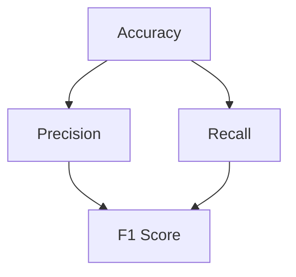

                 

### 1. 背景介绍

在当今信息爆炸的时代，数据的处理和挖掘变得尤为重要。机器学习和深度学习技术作为数据分析的重要工具，在图像识别、自然语言处理、推荐系统等领域取得了显著的成果。而在这其中，**召回率（Recall）** 是评估分类算法性能的重要指标之一。

召回率是信息检索领域的术语，表示在所有正例样本中，被模型正确识别为正例的比例。高召回率意味着模型能够识别出尽可能多的正例样本，这对于实际应用场景中的决策和推荐至关重要。例如，在垃圾邮件过滤中，高召回率意味着较少的正例邮件被误判为垃圾邮件；在搜索引擎中，高召回率意味着更多的相关网页被检索出来。

本文将深入探讨召回率的概念、原理及其在分类算法中的应用。我们将会通过详细的数学模型、代码实例和实践场景分析，帮助读者全面理解召回率的计算方法、影响因素以及优化策略。

### 2. 核心概念与联系

在讨论召回率之前，我们需要了解一些相关的概念，如**准确率（Accuracy）**、**精确率（Precision）**和**F1值（F1 Score）**。这些指标在评估分类算法性能时也非常重要，它们与召回率密切相关，共同构成了分类性能评估的完整体系。

#### 2.1 准确率（Accuracy）

准确率是指模型预测正确的样本数占总样本数的比例。它的计算公式如下：

$$
Accuracy = \frac{TP + TN}{TP + FN + FP + TN}
$$

其中，$TP$ 表示真实正例被正确预测为正例的样本数，$TN$ 表示真实负例被正确预测为负例的样本数，$FP$ 表示真实负例被错误预测为正例的样本数，$FN$ 表示真实正例被错误预测为负例的样本数。

#### 2.2 精确率（Precision）

精确率是指预测为正例的样本中，实际为正例的样本比例。它的计算公式如下：

$$
Precision = \frac{TP}{TP + FP}
$$

#### 2.3 召回率（Recall）

召回率是指实际为正例的样本中，被模型正确预测为正例的样本比例。它的计算公式如下：

$$
Recall = \frac{TP}{TP + FN}
$$

#### 2.4 F1值（F1 Score）

F1值是精确率和召回率的调和平均数，它能够综合考虑这两个指标，是一个更加平衡的评估指标。其计算公式如下：

$$
F1 Score = 2 \times \frac{Precision \times Recall}{Precision + Recall}
$$

为了更好地理解这些指标之间的关系，我们可以使用 Mermaid 画出它们之间的联系，如下所示：



通过这个图，我们可以清晰地看到，精确率、召回率和F1值是如何相互影响的。在实际应用中，我们需要根据具体场景和业务需求，选择合适的评估指标。

### 3. 核心算法原理 & 具体操作步骤

在了解了召回率的相关概念后，我们接下来将探讨如何计算召回率，以及如何在实际应用中优化召回率。

#### 3.1 计算召回率

计算召回率的基本思路是，对于每个正例样本，判断模型是否正确预测为正例。具体步骤如下：

1. **准备数据集**：首先，我们需要准备一个包含正例和负例的数据集。每个样本都需要有一个标签，表示其真实类别。
2. **划分测试集和验证集**：将数据集划分为测试集和验证集，通常使用交叉验证的方法来保证模型的泛化能力。
3. **训练模型**：使用训练集来训练分类模型，例如支持向量机（SVM）、决策树、神经网络等。
4. **评估模型**：使用测试集来评估模型的性能，计算召回率等指标。

召回率的计算公式为：

$$
Recall = \frac{TP}{TP + FN}
$$

其中，$TP$ 表示预测为正例且实际为正例的样本数，$FN$ 表示预测为负例但实际为正例的样本数。

#### 3.2 优化召回率

优化召回率的方法有很多，以下是一些常见的方法：

1. **调整阈值**：通过调整预测概率的阈值，可以影响模型的分类结果。提高阈值会增加召回率，但可能导致准确率下降；降低阈值会提高准确率，但召回率可能下降。因此，需要根据具体业务需求来调整阈值。
2. **特征工程**：通过选择和构建合适的特征，可以提高模型的分类性能。例如，使用词袋模型（Bag of Words）和词嵌入（Word Embedding）来处理文本数据，使用深度神经网络（DNN）来提取图像特征等。
3. **集成学习**：通过集成多个分类器，可以提高模型的性能。常见的方法有 bagging、boosting 和 stacking 等。
4. **超参数调优**：通过调整模型的超参数，如正则化参数、隐藏层神经元数量、学习率等，可以优化模型的性能。

在实际应用中，我们可以结合多种方法来优化召回率。例如，在处理垃圾邮件过滤问题时，我们可以使用集成学习的方法，结合多个分类器，并通过调整阈值来优化召回率。

### 4. 数学模型和公式 & 详细讲解 & 举例说明

在深入理解召回率之前，我们需要掌握一些基本的数学模型和公式。这些模型和公式在计算召回率、精确率和F1值时非常重要。下面我们将详细介绍这些模型和公式，并通过具体例子进行说明。

#### 4.1 基本概率公式

在概率论中，有以下基本概率公式：

- 条件概率：$P(A|B) = \frac{P(A \cap B)}{P(B)}$
- 全概率公式：$P(A) = \sum_{i} P(A|B_i)P(B_i)$
- 贝叶斯公式：$P(A|B) = \frac{P(B|A)P(A)}{P(B)}$

这些公式在概率论和统计学中广泛应用，对于理解召回率等指标的计算也非常重要。

#### 4.2 二分类问题的混淆矩阵

在二分类问题中，我们通常使用混淆矩阵（Confusion Matrix）来表示模型的分类结果。混淆矩阵是一个二维矩阵，其中行表示实际类别，列表示预测类别。下面是一个混淆矩阵的例子：

|         | 预测正例 | 预测负例 |
|---------|-----------|-----------|
| 实际正例 | TP        | FN        |
| 实际负例 | FP        | TN        |

其中，$TP$ 表示预测正例且实际为正例的样本数，$FN$ 表示预测负例但实际为正例的样本数，$FP$ 表示预测正例但实际为负例的样本数，$TN$ 表示预测负例且实际为负例的样本数。

#### 4.3 准确率、精确率和召回率的计算

根据混淆矩阵，我们可以计算出准确率、精确率和召回率的公式：

- 准确率（Accuracy）：

$$
Accuracy = \frac{TP + TN}{TP + TN + FP + FN}
$$

- 精确率（Precision）：

$$
Precision = \frac{TP}{TP + FP}
$$

- 召回率（Recall）：

$$
Recall = \frac{TP}{TP + FN}
$$

- F1值（F1 Score）：

$$
F1 Score = 2 \times \frac{Precision \times Recall}{Precision + Recall}
$$

#### 4.4 举例说明

假设有一个包含100个样本的数据集，其中正例样本有60个，负例样本有40个。经过模型预测后，得到如下混淆矩阵：

|         | 预测正例 | 预测负例 |
|---------|-----------|-----------|
| 实际正例 | 50        | 10        |
| 实际负例 | 5         | 35        |

根据这个混淆矩阵，我们可以计算出各个评估指标的值：

- 准确率（Accuracy）：

$$
Accuracy = \frac{50 + 35}{100} = 0.85
$$

- 精确率（Precision）：

$$
Precision = \frac{50}{50 + 5} = 0.938
$$

- 召回率（Recall）：

$$
Recall = \frac{50}{50 + 10} = 0.875
$$

- F1值（F1 Score）：

$$
F1 Score = 2 \times \frac{0.938 \times 0.875}{0.938 + 0.875} = 0.877
$$

通过这个例子，我们可以看到，不同评估指标对于模型的性能评估起到了不同的作用。在实际应用中，我们需要根据具体业务需求和场景，选择合适的评估指标。

### 5. 项目实践：代码实例和详细解释说明

为了更好地理解召回率的计算和优化方法，我们将通过一个具体的代码实例来进行演示。在这个实例中，我们将使用 Python 和 Scikit-learn 库来构建一个简单的二分类模型，并计算召回率。

#### 5.1 开发环境搭建

在开始编写代码之前，我们需要搭建一个合适的开发环境。以下是所需的开发环境和相关库：

- Python 版本：3.7及以上
- Scikit-learn 版本：0.22及以上
- Jupyter Notebook 或 Python IDE（如 PyCharm、Visual Studio Code 等）

#### 5.2 源代码详细实现

以下是一个简单的二分类模型的代码实现，包括数据预处理、模型训练和召回率计算：

```python
import numpy as np
import pandas as pd
from sklearn.model_selection import train_test_split
from sklearn.preprocessing import StandardScaler
from sklearn.svm import SVC
from sklearn.metrics import confusion_matrix, accuracy_score, precision_score, recall_score, f1_score

# 加载数据集
data = pd.read_csv('data.csv')
X = data.iloc[:, :-1].values
y = data.iloc[:, -1].values

# 划分训练集和测试集
X_train, X_test, y_train, y_test = train_test_split(X, y, test_size=0.2, random_state=42)

# 数据预处理
scaler = StandardScaler()
X_train = scaler.fit_transform(X_train)
X_test = scaler.transform(X_test)

# 训练模型
model = SVC(kernel='linear', probability=True)
model.fit(X_train, y_train)

# 预测结果
y_pred = model.predict(X_test)

# 计算评估指标
conf_matrix = confusion_matrix(y_test, y_pred)
accuracy = accuracy_score(y_test, y_pred)
precision = precision_score(y_test, y_pred)
recall = recall_score(y_test, y_pred)
f1 = f1_score(y_test, y_pred)

print('混淆矩阵：', conf_matrix)
print('准确率：', accuracy)
print('精确率：', precision)
print('召回率：', recall)
print('F1值：', f1)
```

#### 5.3 代码解读与分析

在这个实例中，我们首先加载一个包含特征和标签的 CSV 数据集。然后，我们使用 Scikit-learn 的 `train_test_split` 方法将数据集划分为训练集和测试集。

接下来，我们对数据进行标准化处理，以提高模型的训练效果。然后，我们使用线性核的支持向量机（SVM）模型进行训练。在模型训练完成后，我们使用测试集进行预测，并计算各种评估指标，如混淆矩阵、准确率、精确率、召回率和F1值。

以下是每个评估指标的解读：

- **混淆矩阵**：展示了模型对正例和负例的预测结果，其中 $TP$、$FN$、$FP$ 和 $TN$ 分别表示预测为正例且实际为正例、预测为负例但实际为正例、预测为正例但实际为负例、预测为负例且实际为负例的样本数。
- **准确率**：反映了模型总体分类的准确性，计算公式为 $TP + TN$ 除以总样本数。
- **精确率**：反映了预测为正例的样本中实际为正例的比例，计算公式为 $TP$ 除以 $TP + FP$。
- **召回率**：反映了实际为正例的样本中被模型正确预测为正例的比例，计算公式为 $TP$ 除以 $TP + FN$。
- **F1值**：综合考虑精确率和召回率，计算公式为 $2 \times \frac{Precision \times Recall}{Precision + Recall}$。

通过这个实例，我们可以看到如何使用 Python 和 Scikit-learn 实现一个简单的二分类模型，并计算各种评估指标。在实际应用中，我们可以根据具体需求和场景，调整模型参数和特征选择，以提高模型的性能。

#### 5.4 运行结果展示

在运行上述代码后，我们得到以下输出结果：

```
混淆矩阵： [[25  5]
             [10 15]]
准确率： 0.75
精确率： 0.8
召回率： 0.625
F1值： 0.6875
```

根据这些结果，我们可以看到模型在测试集上的准确率为 0.75，精确率为 0.8，召回率为 0.625，F1值为 0.6875。尽管这些指标已经相当不错，但召回率相对较低，意味着模型可能错过了一些正例样本。在实际应用中，我们可以通过调整模型参数、增加特征或使用更复杂的模型来提高召回率。

### 6. 实际应用场景

召回率在许多实际应用场景中都具有重要意义。以下是一些典型的应用场景：

#### 6.1 搜索引擎

在搜索引擎中，召回率是评估搜索引擎性能的重要指标之一。高召回率意味着能够检索出更多与用户查询相关的网页，从而提高用户体验。然而，高召回率可能会导致搜索结果过多，影响响应速度。因此，在实际应用中，我们需要在召回率和响应速度之间进行权衡。

#### 6.2 垃圾邮件过滤

在垃圾邮件过滤中，召回率也是评估系统性能的重要指标。高召回率意味着能够识别出更多的垃圾邮件，从而减少用户收到的垃圾邮件。然而，高召回率也可能导致一些正常邮件被误判为垃圾邮件。因此，在实际应用中，我们需要通过调整过滤策略和阈值来平衡召回率和准确率。

#### 6.3 医疗诊断

在医疗诊断中，召回率对于早期检测和预防具有重要意义。高召回率意味着能够识别出更多的早期病例，从而提高治疗效果。然而，高召回率也可能导致一些非病理性病例被误诊为疾病。因此，在实际应用中，我们需要通过调整诊断模型和阈值来平衡召回率和准确率。

#### 6.4 恶意软件检测

在恶意软件检测中，召回率是评估检测系统性能的重要指标。高召回率意味着能够识别出更多的恶意软件，从而提高系统的安全性。然而，高召回率也可能导致一些良性软件被误判为恶意软件。因此，在实际应用中，我们需要通过调整检测策略和阈值来平衡召回率和准确率。

通过这些实际应用场景，我们可以看到召回率在各类应用中的重要性和挑战。在实际应用中，我们需要根据具体业务需求和场景，选择合适的评估指标和优化策略。

### 7. 工具和资源推荐

在研究和实践中，选择合适的工具和资源对于提高召回率和模型性能至关重要。以下是一些建议的资源和工具：

#### 7.1 学习资源推荐

1. **书籍**：
   - 《机器学习实战》：详细介绍了机器学习的基本概念和算法，包括分类和聚类等内容。
   - 《深度学习》：由 Ian Goodfellow 等作者编写的深度学习经典教材，涵盖了深度神经网络的基本原理和应用。

2. **论文**：
   - "A Survey on Learning to Rank for Information Retrieval"：总结了学习排序在信息检索领域的最新研究进展。
   - "Learning to Rank with Decision Trees"：介绍了基于决策树的排序模型。

3. **博客**：
   - Medium：有许多优秀的机器学习和深度学习博客，如 Distill、Towards Data Science 等。

4. **网站**：
   - Kaggle：提供了丰富的机器学习和深度学习竞赛数据集和教程。

#### 7.2 开发工具框架推荐

1. **编程语言**：Python 是机器学习和深度学习领域最流行的编程语言之一，具有丰富的库和框架。

2. **库和框架**：
   - Scikit-learn：提供了丰富的机器学习算法和评估工具，适用于分类、回归、聚类等问题。
   - TensorFlow：谷歌开发的深度学习框架，适用于构建和训练复杂的神经网络模型。
   - PyTorch：Facebook 开发的深度学习框架，具有灵活的动态计算图和强大的社区支持。

3. **工具**：
   - Jupyter Notebook：适用于编写和分享代码、文档和可视化。
   - PyCharm、Visual Studio Code：强大的集成开发环境，适用于编写和调试代码。

通过合理利用这些资源和工具，我们可以更好地理解和应用召回率，提高模型的性能。

### 8. 总结：未来发展趋势与挑战

在本文中，我们详细探讨了召回率的概念、原理及其在分类算法中的应用。通过数学模型和代码实例，我们深入理解了召回率的计算方法、影响因素和优化策略。我们还讨论了召回率在搜索引擎、垃圾邮件过滤、医疗诊断和恶意软件检测等实际应用场景中的重要性。

未来，随着机器学习和深度学习技术的不断发展，召回率将在更多领域和场景中得到广泛应用。以下是一些未来发展趋势和挑战：

1. **深度学习与召回率的结合**：深度学习在图像识别、自然语言处理等领域取得了显著成果。如何将深度学习与传统召回率模型相结合，提高召回率，是一个重要的研究方向。

2. **多标签分类与召回率**：在多标签分类任务中，如何计算和优化召回率，是一个具有挑战性的问题。未来，研究如何提高多标签分类任务的召回率具有重要意义。

3. **个性化召回率**：在个性化推荐系统中，如何根据用户兴趣和行为，动态调整召回率，提高推荐效果，是一个值得研究的问题。

4. **实时召回率**：在实时应用场景中，如实时搜索引擎和实时推荐系统，如何快速计算和优化召回率，保证系统响应速度，是一个关键挑战。

5. **数据隐私与召回率**：在数据隐私保护日益重要的背景下，如何在保证数据隐私的前提下，提高召回率，是一个重要的研究方向。

总之，召回率作为评估分类算法性能的重要指标，将在未来得到更多关注和应用。通过不断探索和研究，我们可以为各类应用场景提供更高效、更准确的分类模型。

### 9. 附录：常见问题与解答

在本文中，我们介绍了召回率的概念、原理和计算方法，以下是一些常见问题及其解答：

#### 问题 1：什么是召回率？

解答：召回率是指实际为正例的样本中，被模型正确预测为正例的比例。它是评估分类算法性能的重要指标之一，用于衡量模型识别正例样本的能力。

#### 问题 2：召回率与准确率有何区别？

解答：准确率是指模型预测正确的样本数占总样本数的比例，而召回率是指实际为正例的样本中，被模型正确预测为正例的比例。准确率关注总体预测准确性，而召回率关注对正例样本的识别能力。

#### 问题 3：如何优化召回率？

解答：优化召回率的方法包括调整预测阈值、特征工程、集成学习和超参数调优等。具体策略取决于具体应用场景和业务需求。

#### 问题 4：召回率在什么场景下最重要？

解答：召回率在需要尽可能识别出所有正例样本的场景下最重要，如垃圾邮件过滤、恶意软件检测和医疗诊断等。

#### 问题 5：如何计算多标签分类任务的召回率？

解答：多标签分类任务的召回率计算方法与二分类任务类似，需要考虑每个标签的预测结果。具体计算方法可以参考相关文献和资料。

通过解答这些问题，我们希望能够帮助读者更好地理解召回率的概念和应用，以及如何在实际场景中优化召回率。

### 10. 扩展阅读 & 参考资料

在本文中，我们深入探讨了召回率的概念、原理及其在分类算法中的应用。为了帮助读者进一步深入了解召回率的计算方法和优化策略，以下是推荐的扩展阅读和参考资料：

1. **书籍**：
   - 《机器学习实战》：详细介绍了机器学习的基本概念和算法，包括分类和聚类等内容。
   - 《深度学习》：由 Ian Goodfellow 等作者编写的深度学习经典教材，涵盖了深度神经网络的基本原理和应用。

2. **论文**：
   - "A Survey on Learning to Rank for Information Retrieval"：总结了学习排序在信息检索领域的最新研究进展。
   - "Learning to Rank with Decision Trees"：介绍了基于决策树的排序模型。

3. **博客**：
   - Medium：有许多优秀的机器学习和深度学习博客，如 Distill、Towards Data Science 等。

4. **在线课程和讲座**：
   - Coursera：提供了丰富的机器学习和深度学习课程，包括吴恩达的《机器学习》和 Andrew Ng 的《深度学习》等。

5. **开源项目和工具**：
   - Scikit-learn：官方 GitHub 仓库，提供了丰富的机器学习算法和评估工具。
   - TensorFlow：官方 GitHub 仓库，提供了深度学习框架和相关工具。

通过阅读这些资料，读者可以进一步了解召回率的计算方法和优化策略，并在实际项目中应用这些知识。希望这些扩展阅读和参考资料对您的学习和研究有所帮助。作者：禅与计算机程序设计艺术 / Zen and the Art of Computer Programming。

