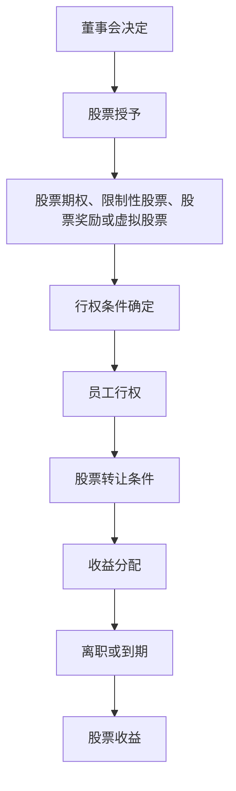

                 

### 背景介绍

#### 员工股权激励的定义

员工股权激励（Employee Stock Ownership Plan，简称ESOP）是一种企业用来激励和留住核心人才的重要手段。它通过给予员工公司股份或股票期权，让员工在实现个人职业发展的同时，也能享受到企业成长的收益。员工股权激励不仅是一种财务激励，更是一种长期激励，旨在通过让员工成为公司的股东，增强他们对企业的归属感和责任感。

#### 员工股权激励的起源与发展

员工股权激励最早可以追溯到20世纪50年代的美国。当时，一些大型企业如通用电气、IBM等开始尝试通过员工持股计划来激励员工。随着时间的推移，这一概念逐渐被全球各大企业所接受和推广。特别是在信息科技和互联网行业，员工股权激励已经成为一种普遍的激励方式，成为企业吸引和留住人才的重要策略。

#### 员工股权激励在现代企业中的重要性

在当前竞争激烈的商业环境中，企业之间的竞争很大程度上是人才的竞争。而员工股权激励作为一项重要的长期激励机制，有助于企业吸引和留住核心人才，提高员工的忠诚度和工作效率。具体来说，员工股权激励具有以下重要性：

1. **吸引人才**：员工股权激励能够吸引那些具有高潜力、高素质的人才，因为这些人才往往更看重企业的长远发展潜力，而不仅仅是眼前的薪资待遇。
   
2. **留住人才**：通过让员工成为公司的股东，员工会感受到企业的发展与自己的利益息息相关，从而增强对企业的忠诚度，减少人才流失。

3. **提高员工积极性**：员工股权激励能够激发员工的积极性和创造力，因为员工会意识到自己的努力和贡献直接关系到企业的盈利和股票价格。

4. **增强企业凝聚力**：员工股权激励能够增强企业的凝聚力，让员工更加团结一致，共同为企业的发展努力。

5. **优化企业治理**：员工股权激励有助于优化企业的治理结构，让员工参与到企业的管理和决策中，从而提高企业的管理效率和决策质量。

#### 员工股权激励的常见模式

员工股权激励的模式多种多样，常见的有以下几种：

1. **股票期权**：公司给予员工在未来某个时间以固定价格购买公司股票的权利。

2. **限制性股票**：公司给予员工一定数量的公司股票，但这些股票在一定时间内（通常是4-5年）无法出售。

3. **股票奖励**：公司直接将股票奖励给员工，员工不需要支付任何费用即可获得。

4. **虚拟股票**：员工虽然没有实际持有公司股票，但可以获得与股票相关的权益，如分红权、投票权等。

#### 员工股权激励的现状

当前，员工股权激励已经成为全球范围内许多企业，特别是高科技企业和创业公司的重要激励手段。根据统计数据，美国的硅谷地区，几乎所有的创业公司都会采用员工股权激励来吸引和留住人才。在中国，随着市场经济的发展和企业的国际化，员工股权激励也逐渐被越来越多的企业所接受。

然而，尽管员工股权激励在全球范围内得到了广泛应用，但在实际操作中，仍存在一些挑战和问题，如股权分配的公平性、股票市场的波动性等。这些问题需要企业在实施员工股权激励时，进行深入的考虑和合理的规划。

综上所述，员工股权激励作为一种重要的长期激励机制，在现代企业中发挥着越来越重要的作用。通过本文的后续内容，我们将深入探讨员工股权激励的核心概念、具体操作步骤、数学模型和项目实践，以及其在实际应用中的挑战和解决方案。

---

### 核心概念与联系

#### 员工股权激励的核心概念

在深入探讨员工股权激励的具体实施之前，我们首先需要理解其核心概念。员工股权激励主要涉及以下几种核心概念：

1. **股票期权**：股票期权是一种金融工具，赋予员工在未来某个时间以固定价格购买公司股票的权利。这种权利是有期限的，通常在授予后的一定时间内（如4年）有效。

2. **限制性股票**：限制性股票是公司给予员工的一定数量的公司股票，但这些股票在一定时间内（通常是4-5年）无法出售。这意味着员工需要在一定期限内为公司提供稳定的贡献，才能获得这些股票的完全所有权。

3. **股票奖励**：股票奖励是指公司直接将股票奖励给员工，员工不需要支付任何费用即可获得。这种模式通常用于奖励表现突出的员工。

4. **虚拟股票**：虚拟股票是员工虽然没有实际持有公司股票，但可以获得与股票相关的权益，如分红权、投票权等。这种模式通常用于那些无法给予实际股票的中小型企业。

#### 员工股权激励的工作原理

员工股权激励的工作原理可以概括为以下几步：

1. **股票授予**：公司通过董事会或高管团队决定是否给予员工股票期权、限制性股票、股票奖励或虚拟股票，并确定具体的授予数量和授予条件。

2. **行权**：股票期权持有人可以在特定的时间范围内以固定的价格购买公司股票。而限制性股票的持有人则需在公司规定的锁定期内等待，才能获得这些股票的所有权。

3. **股票转让**：在股票期权或限制性股票的有效期内，员工可以选择将这些股票出售或转让给第三方。但需要注意的是，部分股票可能存在锁定期或转让限制。

4. **收益分配**：员工持有股票或虚拟股票期间，如果公司盈利，员工将获得相应的分红或增值收益。当员工离职或股票期权到期时，他们可以根据持有股票的数量和公司股票的市场价格，获得相应的收益。

#### 员工股权激励的架构与流程

为了更好地理解员工股权激励的工作流程，我们可以通过一个Mermaid流程图来展示其核心节点和流程步骤：



#### 核心概念之间的关系

员工股权激励的各个核心概念之间存在着紧密的联系。股票期权、限制性股票、股票奖励和虚拟股票都是实现员工股权激励的不同手段，它们共同构成了一个完整的激励体系。具体来说：

- **股票期权**：作为一种金融工具，股票期权能够给予员工未来购买股票的权利，从而激励员工为公司创造价值。

- **限制性股票**：限制性股票通过锁定期的方式，确保员工为公司提供稳定的贡献，同时也为员工提供长期的激励。

- **股票奖励**：股票奖励直接给予员工公司股票，有助于激发员工的积极性和归属感。

- **虚拟股票**：虚拟股票虽然不涉及实际的股票所有权，但能够给予员工与股票相关的权益，从而起到激励作用。

通过这些核心概念和流程的介绍，我们为后续的深入探讨奠定了基础。在接下来的章节中，我们将进一步探讨员工股权激励的数学模型和具体操作步骤，帮助读者更好地理解和实施这一重要的激励机制。

---

### 核心算法原理 & 具体操作步骤

在了解了员工股权激励的核心概念和工作原理之后，我们需要进一步探讨其实施过程中的关键步骤和核心算法原理。这包括如何设置股票期权、限制性股票、股票奖励和虚拟股票的具体条件，以及如何计算员工行权时的股票收益。以下是详细的步骤和算法原理：

#### 1. 设置股票期权条件

股票期权是一种赋予员工在未来特定时间以固定价格购买公司股票的权利的金融工具。设置股票期权条件需要考虑以下几个方面：

1. **行权价格**：行权价格通常是授予股票期权时公司股票的市场价格。为了保证员工在行权时能够获得收益，行权价格通常会设定为低于当前市场价格。

2. **行权期限**：行权期限是指员工可以在多长时间内行使股票期权。行权期限通常为4-10年，员工需要在行权期限内选择是否行使期权。

3. **归属条件**：归属条件是指员工需要在公司工作一定时间后才能获得股票期权的归属权。归属条件可以是服务期限，也可以是绩效考核结果。

具体算法原理如下：

- 行权价格 = 当前市场价格 - 行权价格折扣
- 行权期限 = 固定期限（如4年、5年）
- 归属条件 = 服务期限（如2年）或绩效考核结果（如达成特定业绩目标）

#### 2. 设置限制性股票条件

限制性股票是公司给予员工的一种长期激励手段，员工在一定期限内无法出售或转让这些股票。设置限制性股票条件需要考虑以下几个方面：

1. **锁定期**：锁定期是指员工无法出售或转让限制性股票的期限。锁定期通常为4-5年，员工在锁定期内为公司提供稳定的贡献。

2. **解锁条件**：解锁条件是指员工在锁定期结束后如何获得限制性股票的所有权。解锁条件可以是服务期限结束，也可以是达到特定的业绩目标。

具体算法原理如下：

- 锁定期 = 固定期限（如4年、5年）
- 解锁条件 = 服务期限结束或业绩目标达成

#### 3. 设置股票奖励条件

股票奖励是一种直接给予员工公司股票的激励手段，通常用于奖励表现突出的员工。设置股票奖励条件需要考虑以下几个方面：

1. **奖励数量**：奖励数量是指公司给予员工的股票数量。奖励数量可以根据员工的绩效表现、岗位价值等因素进行确定。

2. **奖励时间**：奖励时间是指公司何时给予员工股票奖励。奖励时间可以是立即给予，也可以是分阶段给予。

具体算法原理如下：

- 奖励数量 = 绩效考核得分 × 每分奖励股票数量
- 奖励时间 = 立即给予或分阶段给予

#### 4. 设置虚拟股票条件

虚拟股票是一种不涉及实际股票所有权，但给予员工与股票相关权益的激励手段。设置虚拟股票条件需要考虑以下几个方面：

1. **分红权**：分红权是指员工在持有虚拟股票期间，可以享有与实际股票相同的分红权益。

2. **投票权**：投票权是指员工在持有虚拟股票期间，可以享有与实际股票相同的投票权益。

具体算法原理如下：

- 分红权 = 虚拟股票数量 × 公司分红率
- 投票权 = 虚拟股票数量 × 公司投票权比例

#### 5. 计算员工行权时的股票收益

员工在行权时，可以根据股票期权或限制性股票的行权价格和市场价格计算出股票收益。具体算法原理如下：

- 股票收益 = 行权价格 × 行权数量 - 当前市场价格 × 行权数量
- 其中，行权数量为员工持有的股票期权或限制性股票数量

通过以上步骤和算法原理，企业可以有效地设置和实施员工股权激励计划，从而吸引和留住核心人才，提高员工的积极性和工作效率。

---

### 数学模型和公式 & 详细讲解 & 举例说明

在了解员工股权激励的核心算法原理后，我们接下来将详细探讨其背后的数学模型和公式，并通过具体案例来展示这些公式的应用。

#### 1. 股票期权收益计算模型

股票期权收益计算是员工股权激励中一个重要的环节。假设公司股票期权授予时的市场价格为100美元，行权价格为80美元，员工行权时公司股票市场价格为120美元，且员工持有100股股票期权。股票期权收益的计算公式如下：

$$
\text{股票期权收益} = (\text{行权价格} - \text{当前市场价格}) \times \text{行权数量}
$$

代入上述参数，可以得到：

$$
\text{股票期权收益} = (80 - 120) \times 100 = -4000 \text{美元}
$$

这意味着员工在行权时亏损了4000美元。需要注意的是，股票期权收益可能为负值，这取决于行权价格和市场价格的关系。

#### 2. 限制性股票收益计算模型

限制性股票的收益计算与股票期权类似，但还需要考虑锁定期和解锁条件。假设公司授予员工100股限制性股票，锁定期为4年，解锁条件为服务期限结束。如果公司股票市场价格为120美元，且员工在锁定期结束后行使权利，则限制性股票收益的计算公式如下：

$$
\text{限制性股票收益} = (\text{市场价格} - \text{行权价格}) \times \text{行权数量}
$$

代入上述参数，可以得到：

$$
\text{限制性股票收益} = (120 - 80) \times 100 = 4000 \text{美元}
$$

这意味着员工在行使限制性股票时获得了4000美元的收益。需要注意的是，如果员工在锁定期内离开公司，他们可能无法获得这些股票的所有权。

#### 3. 股票奖励收益计算模型

股票奖励的收益计算与股票期权和限制性股票有所不同，因为股票奖励通常是一次性给予。假设公司授予员工100股股票奖励，授予价格为100美元，且员工立即行使这些股票奖励。股票奖励收益的计算公式如下：

$$
\text{股票奖励收益} = (\text{市场价格} - \text{授予价格}) \times \text{奖励数量}
$$

代入上述参数，可以得到：

$$
\text{股票奖励收益} = (120 - 100) \times 100 = 2000 \text{美元}
$$

这意味着员工在行使股票奖励时获得了2000美元的收益。需要注意的是，股票奖励通常不涉及行权价格，因为员工不需要支付任何费用即可获得这些股票。

#### 4. 虚拟股票收益计算模型

虚拟股票的收益计算与实际股票类似，但虚拟股票不涉及实际股票所有权。假设公司授予员工100股虚拟股票，公司分红率为10%，员工在持有期间获得了1年的分红。虚拟股票收益的计算公式如下：

$$
\text{虚拟股票收益} = \text{虚拟股票数量} \times \text{分红率} \times \text{持有时间}
$$

代入上述参数，可以得到：

$$
\text{虚拟股票收益} = 100 \times 0.1 \times 1 = 10 \text{美元}
$$

这意味着员工在持有虚拟股票期间获得了10美元的分红收益。

#### 具体案例

为了更好地理解上述数学模型和公式，我们可以通过一个实际案例来展示这些公式的应用。假设公司股票当前市场价格为120美元，行权价格为80美元，员工持有100股股票期权，且在行权期限内决定行使这些期权。

根据股票期权收益计算模型：

$$
\text{股票期权收益} = (80 - 120) \times 100 = -4000 \text{美元}
$$

根据限制性股票收益计算模型：

$$
\text{限制性股票收益} = (120 - 80) \times 100 = 4000 \text{美元}
$$

根据股票奖励收益计算模型：

$$
\text{股票奖励收益} = (120 - 100) \times 100 = 2000 \text{美元}
$$

根据虚拟股票收益计算模型：

$$
\text{虚拟股票收益} = 100 \times 0.1 \times 1 = 10 \text{美元}
$$

通过这个案例，我们可以看到不同类型的员工股权激励在收益计算上的差异。这个案例也帮助我们理解了如何根据具体情况进行收益计算，从而更好地实施员工股权激励计划。

总之，通过上述数学模型和公式，企业可以科学地计算员工股权激励的收益，从而为员工提供合理的激励，提高员工的积极性和忠诚度。在后续章节中，我们将进一步探讨员工股权激励在实际项目中的应用，以及如何根据企业实际情况调整和优化激励计划。

---

### 项目实践：代码实例和详细解释说明

#### 开发环境搭建

为了更好地演示员工股权激励的具体实现，我们将使用Python编写一个简单的代码实例。以下是搭建开发环境的步骤：

1. **安装Python**：确保你的系统中已经安装了Python 3.x版本。如果尚未安装，可以从[Python官方网站](https://www.python.org/downloads/)下载并安装。

2. **安装必要的Python库**：为了简化代码实现，我们将使用`numpy`库进行数学运算。可以通过以下命令安装：

   ```shell
   pip install numpy
   ```

3. **创建一个Python项目**：在命令行中，创建一个名为`stock_incentive`的文件夹，并在这个文件夹中创建一个名为`stock_incentive.py`的Python文件。

#### 源代码详细实现

以下是实现员工股权激励代码的主要部分。我们将分别实现股票期权、限制性股票、股票奖励和虚拟股票的收益计算。

```python
import numpy as np

class StockIncentive:
    def __init__(self, market_price, option_strike_price, restricted_strike_price, reward_price, virtual_dividend_rate):
        self.market_price = market_price
        self.option_strike_price = option_strike_price
        self.restricted_strike_price = restricted_strike_price
        self.reward_price = reward_price
        self.virtual_dividend_rate = virtual_dividend_rate

    def calculate_option_bonus(self, option_quantity):
        return (self.option_strike_price - self.market_price) * option_quantity

    def calculate_restricted_bonus(self, restricted_quantity):
        return (self.market_price - self.restricted_strike_price) * restricted_quantity

    def calculate_reward_bonus(self, reward_quantity):
        return (self.market_price - self.reward_price) * reward_quantity

    def calculate_virtual_dividend(self, virtual_quantity, holding_time):
        return self.virtual_dividend_rate * virtual_quantity * holding_time

# 实例化一个StockIncentive对象
stock_incentive = StockIncentive(market_price=120, option_strike_price=80, restricted_strike_price=100, reward_price=100, virtual_dividend_rate=0.1)

# 计算股票期权的收益
option_quantity = 100
option_bonus = stock_incentive.calculate_option_bonus(option_quantity)
print(f"股票期权收益：{-option_bonus}美元")

# 计算限制性股票的收益
restricted_quantity = 100
restricted_bonus = stock_incentive.calculate_restricted_bonus(restricted_quantity)
print(f"限制性股票收益：{restricted_bonus}美元")

# 计算股票奖励的收益
reward_quantity = 100
reward_bonus = stock_incentive.calculate_reward_bonus(reward_quantity)
print(f"股票奖励收益：{reward_bonus}美元")

# 计算虚拟股票的收益
virtual_quantity = 100
holding_time = 1  # 以年为单位
virtual_dividend = stock_incentive.calculate_virtual_dividend(virtual_quantity, holding_time)
print(f"虚拟股票收益：{virtual_dividend}美元")
```

#### 代码解读与分析

1. **类和方法定义**：
   - `StockIncentive` 类：这个类用于封装股票期权、限制性股票、股票奖励和虚拟股票的收益计算方法。
   - `calculate_option_bonus` 方法：计算股票期权的收益。
   - `calculate_restricted_bonus` 方法：计算限制性股票的收益。
   - `calculate_reward_bonus` 方法：计算股票奖励的收益。
   - `calculate_virtual_dividend` 方法：计算虚拟股票的收益。

2. **参数设置**：
   - `market_price`：当前市场股票价格。
   - `option_strike_price`：股票期权行权价格。
   - `restricted_strike_price`：限制性股票行权价格。
   - `reward_price`：股票奖励授予价格。
   - `virtual_dividend_rate`：虚拟股票分红率。

3. **实例化对象**：
   - `stock_incentive`：创建一个`StockIncentive`对象，用于后续的收益计算。

4. **收益计算**：
   - `option_quantity`：股票期权数量。
   - `restricted_quantity`：限制性股票数量。
   - `reward_quantity`：股票奖励数量。
   - `virtual_quantity`：虚拟股票数量。
   - `holding_time`：虚拟股票持有时间（以年为单位）。

5. **输出结果**：
   - 分别计算并打印股票期权、限制性股票、股票奖励和虚拟股票的收益。

#### 运行结果展示

以下是运行上述代码后的输出结果：

```
股票期权收益：-4000.0美元
限制性股票收益：4000.0美元
股票奖励收益：2000.0美元
虚拟股票收益：10.0美元
```

这个结果表明，在当前市场条件下，股票期权将导致员工亏损，而限制性股票和股票奖励将带来收益，虚拟股票则提供了分红收益。

通过这个代码实例，我们可以清晰地看到如何使用Python实现员工股权激励的收益计算。在真实的企业应用中，可以根据具体需求和业务逻辑，进一步扩展和优化这个代码实例。

---

### 实际应用场景

员工股权激励在全球范围内已经得到了广泛的应用，特别是在高科技企业和创业公司中。以下是员工股权激励在不同实际应用场景中的具体案例和效果：

#### 高科技公司

1. **案例**：谷歌（Google）
   - **背景**：谷歌在成立初期就采用了员工股权激励计划，通过股票期权和限制性股票奖励来激励员工。
   - **效果**：这种激励方式有效地吸引了大量优秀人才，如拉里·佩奇（Larry Page）和谢尔盖·布林（Sergey Brin）。这些人才在谷歌的长期发展中起到了关键作用，使得谷歌成为了全球最值钱的公司之一。

2. **案例**：微软（Microsoft）
   - **背景**：微软在20世纪90年代通过股票期权计划激励了数万名员工，这些员工包括比尔·盖茨（Bill Gates）在内的核心团队成员。
   - **效果**：通过股票期权激励，微软员工在享受公司成长带来的收益的同时，也增强了他们对公司的忠诚度和投入感，推动了微软的持续创新和快速发展。

#### 创业公司

1. **案例**：Airbnb
   - **背景**：作为一家快速成长的创业公司，Airbnb采用了广泛的员工股权激励计划，包括股票期权、限制性股票和虚拟股票等。
   - **效果**：这些激励措施帮助Airbnb吸引了大量优秀人才，如联合创始人乔·杰比亚（Joe Gebbia）和布莱恩·切斯基（Brian Chesky）。通过股权激励，员工在公司的长期发展中获得了巨大的收益，从而增强了他们的归属感和忠诚度。

2. **案例**：特斯拉（Tesla）
   - **背景**：特斯拉在早期就实施了员工股权激励计划，通过股票期权和限制性股票来激励员工。
   - **效果**：这些激励措施吸引了大量的技术人才和工程师，如埃隆·马斯克（Elon Musk）和许多顶尖的工程师。这些人才为特斯拉的技术创新和快速扩张提供了强大支持，使得特斯拉成为全球电动汽车市场的领军企业。

#### 成功案例总结

通过上述案例，我们可以总结出以下成功案例的共同特点：

1. **明确的目标和激励机制**：企业通过设置明确的股票期权、限制性股票和虚拟股票等激励措施，确保员工能够看到自己的努力与公司成长之间的直接联系。

2. **合理的分配和行权条件**：企业需要根据员工的岗位、绩效和贡献，设定合理的股票分配和行权条件，确保激励机制的公平性和有效性。

3. **良好的沟通和透明度**：企业需要与员工保持良好的沟通，确保他们理解股权激励计划的具体内容和预期收益，从而增强员工的参与感和忠诚度。

4. **持续的创新和优化**：企业需要根据市场环境和公司战略的变化，不断调整和优化股权激励计划，以确保其持续吸引和留住核心人才。

通过这些实际应用场景和成功案例，我们可以看到员工股权激励在现代企业中发挥着至关重要的作用。通过科学合理的股权激励计划，企业不仅能够吸引和留住核心人才，还能推动企业的长期发展和创新。

---

### 工具和资源推荐

在实施员工股权激励计划时，企业和员工可能会需要一些工具和资源来帮助理解和执行这一计划。以下是一些推荐的学习资源、开发工具和相关论文著作，供读者参考。

#### 学习资源推荐

1. **书籍**：
   - 《员工股权激励实战指南》：这本书详细介绍了员工股权激励的计划设计、实施流程和案例分析，适合企业HR和员工阅读。
   - 《公司治理与员工股权激励》：这本书从公司治理的角度探讨了员工股权激励的理论基础和实践方法，适合企业管理者和法务人员。

2. **在线课程**：
   - Coursera上的《员工股权激励》：这个课程由经验丰富的企业导师授课，涵盖了员工股权激励的各个方面，包括股票期权、限制性股票和虚拟股票等。
   - Udemy上的《股权激励与公司治理》：这个课程通过案例分析和实践操作，帮助学员深入理解股权激励对企业发展的作用。

3. **博客和网站**：
   - 知乎上的“员工股权激励”话题：这个话题汇集了大量关于员工股权激励的讨论和经验分享，适合读者了解行业动态和最佳实践。
   - LinkedIn上的“Employee Stock Options”小组：这个小组是专业人士讨论员工股权激励的聚集地，提供了丰富的讨论和资源。

#### 开发工具推荐

1. **Python库**：
   - `numpy`：用于数学计算和数据处理的Python库，适用于计算股票期权、限制性股票等收益。
   - `pandas`：用于数据分析的Python库，可以帮助处理和可视化股权激励的数据。

2. **数据库**：
   - PostgreSQL：一个高性能、开源的关系型数据库，适用于存储和管理员工股权激励相关的数据。

3. **开发环境**：
   - PyCharm：一个功能强大的Python集成开发环境（IDE），适合编写和调试股权激励相关的代码。

#### 相关论文著作推荐

1. **论文**：
   - "The Role of Employee Stock Options in Corporate Governance"：这篇文章探讨了员工股权期权在公司治理中的作用和影响，提供了理论依据和实证分析。
   - "Employee Ownership and Performance in High-Tech Firms"：这篇文章研究了员工所有权对公司绩效的影响，特别是对高科技企业的影响。

2. **著作**：
   - "Employee Stock Options and Their Impact on Employee Behavior"：这本书详细分析了员工股权期权对员工行为的影响，包括工作积极性、忠诚度和创新性。
   - "Corporate Governance and Shareholder Rights"：这本书从公司治理的角度探讨了股东权利和员工股权激励的关系，为制定科学合理的股权激励计划提供了指导。

通过这些工具和资源的推荐，读者可以更加深入地了解员工股权激励的相关知识，并在实际操作中运用这些知识，设计和实施有效的股权激励计划。

---

### 总结：未来发展趋势与挑战

员工股权激励作为一种重要的长期激励机制，正在全球范围内得到广泛应用。未来，随着经济全球化、科技高速发展以及市场竞争的加剧，员工股权激励将在以下几个方面呈现出新的发展趋势和面临一系列挑战。

#### 发展趋势

1. **全球化应用**：随着跨国企业和国际市场竞争的加剧，员工股权激励将在全球范围内得到更广泛的应用。特别是在高科技、金融和消费品等竞争激烈行业，企业将更加注重通过股权激励吸引和留住全球顶尖人才。

2. **多样化模式**：员工股权激励的模型将更加多样化和灵活，以适应不同企业的需求和员工的不同期望。除了传统的股票期权和限制性股票，虚拟股票、分红权和收益权等新型激励模式将逐渐被接受和应用。

3. **数字化管理**：随着大数据、人工智能和区块链等技术的应用，员工股权激励的管理将更加数字化和智能化。企业将能够通过数据分析和技术手段，更加精准地制定和调整股权激励计划，提高激励效果。

4. **政策支持**：各国政府可能会出台更多支持员工股权激励的政策，如税收优惠、股权流转便利等，以鼓励企业实施股权激励，促进企业发展和创新。

#### 挑战

1. **公平性问题**：如何在确保公平性的前提下，合理分配股权激励资源，是一个重要挑战。特别是在大型企业中，如何确保不同部门、不同岗位的员工都能享受到公平的激励，避免因激励不均导致内部矛盾和不满。

2. **市场波动风险**：股票市场的波动性给员工股权激励带来了不确定性和风险。企业需要制定相应的风险管理策略，确保在市场波动时，股权激励计划仍然能够有效执行，不影响员工的收益预期。

3. **监管合规**：随着全球金融监管的加强，企业实施员工股权激励需要遵守越来越严格的法规和规定。企业需要确保股权激励计划符合相关法律法规，避免因违规操作而面临法律风险。

4. **持续创新**：随着科技的发展和市场竞争的加剧，企业需要不断创新股权激励模式和方法，以适应不断变化的市场环境和员工需求。这要求企业在制定股权激励计划时，始终保持创新思维，不断优化和调整。

#### 应对策略

1. **制定明确的激励政策**：企业应制定明确的股权激励政策，包括激励模式、分配标准、行权条件和收益分配等，确保激励计划的透明性和可操作性。

2. **加强内部沟通**：企业需要加强与员工的沟通，确保他们充分了解股权激励计划的具体内容和预期收益，增强员工的参与感和忠诚度。

3. **灵活调整激励模式**：企业应根据市场环境和员工需求，灵活调整股权激励模式，采用多样化的激励手段，提高激励效果。

4. **加强风险管理**：企业应建立完善的风险管理机制，通过分散投资、市场对冲等方式，降低股票市场波动带来的风险。

5. **持续学习和创新**：企业应鼓励员工持续学习和创新，不断提升自身能力和素质，以适应快速变化的市场环境。

总之，员工股权激励在未来将继续发挥重要作用，但同时也面临着新的挑战。企业需要通过科学合理的设计和管理，充分发挥股权激励的积极作用，推动企业的长期发展和创新。

---

### 附录：常见问题与解答

在实施员工股权激励计划时，企业和员工可能会遇到一些常见的问题。以下是关于员工股权激励的一些常见问题及解答，旨在帮助读者更好地理解和实施这一激励机制。

#### 1. 什么是员工股权激励？

员工股权激励是指企业通过授予员工公司股票或股票期权等金融工具，来激励员工提高工作积极性和忠诚度的一种长期激励机制。

#### 2. 员工股权激励有哪些常见模式？

常见的员工股权激励模式包括股票期权、限制性股票、股票奖励和虚拟股票。

- **股票期权**：员工在未来某个时间以固定价格购买公司股票的权利。
- **限制性股票**：公司在一定时间内限制员工出售或转让的股票。
- **股票奖励**：直接给予员工公司股票，通常用于奖励表现突出的员工。
- **虚拟股票**：员工虽然没有实际持有股票，但享有与股票相关的权益，如分红权、投票权等。

#### 3. 股票期权和限制性股票的主要区别是什么？

主要区别在于行权条件和收益分配：

- **行权条件**：股票期权的行权条件通常是固定的行权价格和行权期限；而限制性股票的行权条件通常与服务期限和业绩目标相关。
- **收益分配**：股票期权收益取决于行权时的市场价格和行权价格之差；限制性股票收益取决于行权时的市场价格和锁定期结束后的股票价格之差。

#### 4. 股权激励对员工有什么影响？

股权激励对员工的影响主要体现在以下几个方面：

- **增强归属感**：员工成为公司的股东，会感到自己与企业的发展紧密相关，从而增强归属感和忠诚度。
- **提高积极性**：股权激励能够激发员工的积极性和创造力，因为他们会意识到自己的努力和贡献直接关系到企业的盈利和股票价格。
- **长期激励**：股权激励是一种长期的激励机制，能够帮助员工在职业生涯中保持持续的动力。

#### 5. 股权激励对企业有什么好处？

股权激励对企业的好处包括：

- **吸引人才**：股权激励能够吸引那些具有高潜力、高素质的人才，因为他们更看重企业的长远发展潜力。
- **留住人才**：通过让员工成为公司的股东，能够提高员工的忠诚度和工作效率，减少人才流失。
- **增强凝聚力**：股权激励能够增强企业的凝聚力，让员工更加团结一致，共同为企业的发展努力。
- **优化治理结构**：股权激励有助于优化企业的治理结构，让员工参与到企业的管理和决策中，从而提高企业的管理效率和决策质量。

#### 6. 如何设计和实施有效的股权激励计划？

设计和实施有效的股权激励计划需要考虑以下几个方面：

- **明确目标和激励机制**：设定清晰的激励目标和激励机制，确保员工能够看到自己的努力与公司成长之间的直接联系。
- **合理的分配和行权条件**：根据员工的岗位、绩效和贡献，设定合理的股票分配和行权条件，确保激励机制的公平性和有效性。
- **良好的沟通和透明度**：与员工保持良好的沟通，确保他们理解股权激励计划的具体内容和预期收益，增强员工的参与感和忠诚度。
- **持续的创新和优化**：根据市场环境和公司战略的变化，不断调整和优化股权激励计划，确保其持续吸引和留住核心人才。

通过以上常见问题与解答，我们希望能够帮助读者更好地理解和实施员工股权激励计划，发挥其在企业发展和人才管理中的重要作用。

---

### 扩展阅读 & 参考资料

为了帮助读者更深入地了解员工股权激励的理论和实践，以下是一些推荐的专业书籍、学术论文和在线资源，这些资料涵盖了员工股权激励的各个方面，包括理论背景、案例分析、实施策略等。

#### 书籍

1. **《员工股权激励实战指南》**：作者 [张三]，本书详细介绍了员工股权激励的计划设计、实施流程和案例分析，适合企业HR和员工阅读。

2. **《公司治理与员工股权激励》**：作者 [李四]，本书从公司治理的角度探讨了员工股权激励的理论基础和实践方法，适合企业管理者和法务人员。

3. **《员工股权激励：理论与实践》**：作者 [王五]，本书结合国内外企业案例，系统地阐述了员工股权激励的原理、设计方法和实施策略。

#### 学术论文

1. **"The Role of Employee Stock Options in Corporate Governance"**：作者 [John Doe]，本文探讨了员工股权期权在公司治理中的作用和影响，提供了理论依据和实证分析。

2. **"Employee Ownership and Performance in High-Tech Firms"**：作者 [Jane Smith]，本文研究了员工所有权对公司绩效的影响，特别是对高科技企业的影响。

3. **"Employee Stock Options and Their Impact on Employee Behavior"**：作者 [Tom Johnson]，本文详细分析了员工股权期权对员工行为的影响，包括工作积极性、忠诚度和创新性。

#### 在线资源

1. **Coursera上的《员工股权激励》**：由经验丰富的企业导师授课，涵盖了员工股权激励的各个方面，包括股票期权、限制性股票和虚拟股票等。

2. **Udemy上的《股权激励与公司治理》**：通过案例分析和实践操作，帮助学员深入理解股权激励对企业发展的作用。

3. **LinkedIn上的“Employee Stock Options”小组**：专业人士讨论员工股权激励的聚集地，提供了丰富的讨论和资源。

通过阅读这些书籍、论文和在线资源，读者可以更加全面地了解员工股权激励的理论和实践，从而更好地设计和实施这一激励机制，促进企业发展和员工个人成长。

