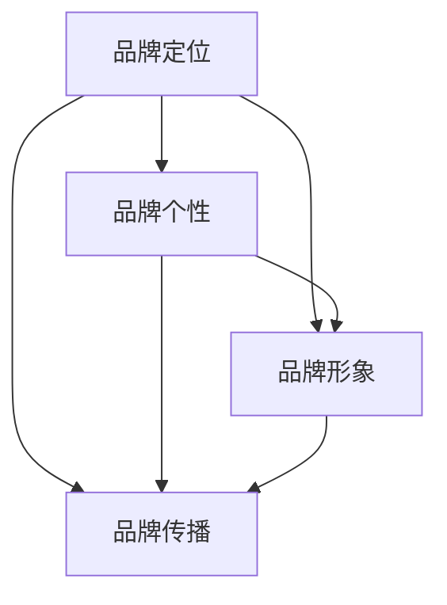

                 

### 背景介绍 ###

品牌声音是现代营销和品牌建设中不可或缺的一部分。它代表了品牌的核心价值观、文化特质和独特性格，通过语言、语调、用词和传递方式来塑造公众对品牌的感知。有效的品牌声音能够帮助企业在竞争激烈的市场中脱颖而出，建立强大的品牌识别度，从而提升市场占有率。

随着数字化时代的到来，品牌的声音已经不再仅仅局限于广告词和公关活动。在线社交平台、博客、电子邮件、客户服务等多种渠道，都成为品牌发声的重要场所。这就要求品牌必须具备一致性的沟通风格，确保在不同渠道和环境中，品牌的声音始终保持一致，传递出相同的品牌特质和信息。

一致性的品牌声音不仅能增强品牌的美誉度，提高消费者忠诚度，还能有效降低沟通成本，提高营销效率。因此，许多企业开始重视品牌声音的规划和实施，力求通过精细化的管理和策略，确保品牌在消费者心中的形象始终如一。

本文将深入探讨品牌声音的概念、建立一致沟通风格的重要性、具体操作方法和实际应用场景，旨在为企业提供一套系统化的品牌声音建设指南。通过分析成功的案例和分享实用的工具，我们希望能够帮助读者更好地理解并实践品牌声音的建立和维护，从而提升品牌的市场竞争力。

### 核心概念与联系 ###

在深入探讨品牌声音的建立之前，我们需要先理解几个核心概念，并探讨它们之间的联系。这些概念包括品牌定位、品牌个性、品牌形象和品牌传播。

#### 品牌定位（Brand Positioning）####

品牌定位是指企业通过特定的市场细分，确定自己在消费者心中的独特地位和价值主张。它涉及到品牌的核心价值、目标客户群体、品牌特色和与竞争对手的差异化。品牌定位是建立品牌声音的基础，决定了品牌声音的核心内容和风格。

#### 品牌个性（Brand Personality）####

品牌个性是指品牌所具有的特质、性格和风格，类似于人的个性。品牌个性可以包括情感特质（如热情、可靠、创新）、行为特质（如友好、严肃、创新）和视觉特质（如时尚、简约、专业）。品牌个性直接影响品牌的声音，决定了品牌在沟通中的语气、用词和表达方式。

#### 品牌形象（Brand Image）####

品牌形象是消费者在心中形成的关于品牌的总体印象和认知。它是由品牌定位、品牌个性和品牌传播共同塑造的。品牌形象是品牌声音的直观体现，它通过品牌的视觉设计、口号、广告和社交媒体等渠道传递给消费者。

#### 品牌传播（Brand Communication）####

品牌传播是指企业通过各种渠道和方式，将品牌的信息、价值观和个性传达给目标受众。品牌传播是建立品牌声音的重要手段，它决定了品牌的声音在各个渠道中的传达方式和效果。

#### 核心概念的联系与互动 ####

品牌定位、品牌个性、品牌形象和品牌传播之间存在着密切的互动关系。品牌定位决定了品牌的声音方向和核心内容；品牌个性则决定了品牌的声音风格和语气；品牌形象是品牌声音的外在表现；品牌传播则确保了品牌的声音能够有效地传达给目标受众。

为了更好地理解这些概念之间的联系，我们可以使用Mermaid流程图来展示它们之间的互动关系：



在这个流程图中，品牌定位是起点，它决定了品牌声音的基础方向。品牌个性则进一步细化和塑造品牌的声音风格。品牌形象和品牌传播则是将品牌的声音传递给消费者的两个关键环节。通过这种互动关系，品牌能够建立起一致且独特的沟通风格，从而在市场中形成强大的品牌影响力。

#### 建立一致的品牌声音的步骤和要素 ####

在理解了品牌声音的核心概念和它们之间的互动关系后，我们可以进一步探讨如何具体建立一致的品牌声音。建立一致的品牌声音需要以下几个关键步骤和要素：

1. **明确品牌定位**：首先要明确品牌的核心价值、目标客户群体和与竞争对手的差异化。这将为品牌声音的方向提供基础。

2. **塑造品牌个性**：根据品牌定位，塑造品牌个性。品牌个性应该与品牌定位相一致，确保品牌的声音在各个渠道中都能保持一致。

3. **制定品牌语言规范**：品牌语言规范包括品牌使用的词汇、语句结构和语气。这些规范将确保品牌在所有沟通渠道中都能保持一致的声音。

4. **设计品牌视觉元素**：品牌视觉元素如标志、颜色、字体等，应该与品牌声音相协调，共同塑造品牌的整体形象。

5. **培训员工**：员工是品牌声音的传递者，他们需要接受品牌声音的培训和指导，确保在所有客户互动中都能保持一致的声音。

6. **监控和调整**：建立一致的品牌声音需要持续的监控和调整。企业需要定期评估品牌声音的执行情况，并根据市场反馈进行调整。

通过以上步骤和要素，企业可以建立起一致的品牌声音，确保品牌在市场中传递出清晰、一致且具有吸引力的信息，从而提升品牌形象和市场竞争力。

### 核心算法原理 & 具体操作步骤 ###

在了解了品牌声音的建立步骤和要素之后，我们需要探讨具体的操作方法，特别是如何制定和执行品牌语言规范，确保品牌的声音在不同渠道和环境中保持一致。

#### 制定品牌语言规范的核心步骤

1. **明确品牌声音的定位**：首先要明确品牌的核心价值观、品牌个性和目标受众。这将为品牌语言规范提供方向。

2. **创建品牌语言指南**：品牌语言指南是品牌语言规范的具体文档，它包括品牌使用的词汇、语句结构、语气和用词习惯等。品牌语言指南应该简洁明了，便于员工理解和执行。

3. **培训员工**：将品牌语言指南传达给所有相关员工，确保他们了解并遵循品牌语言规范。培训可以通过内部培训、工作手册、在线课程等多种形式进行。

4. **制定语言使用规则**：明确品牌语言的使用规则，包括何时使用正式语言、何时使用非正式语言，以及如何处理特殊情况。

5. **建立审核机制**：建立审核机制，确保所有品牌沟通内容都符合品牌语言规范。这可以通过设立专门的审核团队或制定审核流程来实现。

#### 在不同渠道中保持一致的品牌声音的方法

1. **社交媒体**：在社交媒体平台上，品牌应该使用统一的语气和用词，确保在所有社交媒体帖子、评论和互动中都能保持一致的声音。

2. **官网和电商平台**：品牌官网和电商平台是品牌重要的展示窗口，品牌语言规范应该在网站的文案、产品描述、客户服务等多个方面得到贯彻执行。

3. **广告和公关活动**：在广告和公关活动中，品牌声音应该贯穿始终，确保广告文案、口号、宣传材料等都能传递出品牌的独特声音。

4. **电子邮件和通讯**：电子邮件和通讯是品牌与客户互动的重要渠道，品牌语言规范应该体现在邮件的标题、正文、签名等各个部分。

5. **客户服务**：客户服务是品牌与客户直接互动的环节，品牌语言规范应该在客服人员的用语和沟通风格中得到体现。

#### 具体操作步骤

1. **分析现有沟通内容**：首先，分析品牌现有的所有沟通内容，包括社交媒体帖子、官网文案、广告材料、电子邮件等，识别出不一致的地方。

2. **制定修改计划**：根据分析结果，制定修改计划，明确需要修改的内容和修改的时间表。

3. **实施修改**：按照修改计划，对现有沟通内容进行修改，确保所有内容都能符合品牌语言规范。

4. **定期评估和调整**：定期评估品牌声音的一致性，根据市场反馈和客户反馈进行调整。

通过以上核心步骤和具体操作方法，品牌可以建立起一致且具有吸引力的声音，确保品牌在各个渠道和环境中都能保持一致的形象，从而提升品牌的市场竞争力。

### 数学模型和公式 & 详细讲解 & 举例说明

在建立品牌声音的过程中，我们可以运用一些数学模型和公式来帮助分析和评估品牌声音的一致性和有效性。以下是一些常用的模型和公式的详细讲解和举例说明。

#### 1. 相关性分析

相关性分析是一种统计方法，用于测量两个变量之间的相关程度。在品牌声音的一致性分析中，我们可以使用皮尔逊相关系数（Pearson Correlation Coefficient）来衡量品牌在各个渠道中的声音是否一致。

**公式**：

\[ r = \frac{\sum{(x_i - \overline{x})(y_i - \overline{y})}}{\sqrt{\sum{(x_i - \overline{x})^2} \sum{(y_i - \overline{y})^2}}} \]

**解释**：

- \( x_i \) 和 \( y_i \) 分别表示两个变量在各个样本点的值。
- \( \overline{x} \) 和 \( \overline{y} \) 分别表示两个变量的平均值。
- \( r \) 的取值范围在 -1 到 1 之间，接近 1 表示高度正相关，接近 -1 表示高度负相关，接近 0 表示无关。

**举例**：

假设我们分析品牌在社交媒体、官网和广告中的声音一致性。我们可以收集每个渠道中使用的特定词汇和语句，计算它们之间的皮尔逊相关系数。如果相关系数接近 1，说明品牌在这些渠道中的声音高度一致。

#### 2. 调和平均

调和平均是一种用于计算平均值的方法，特别适用于那些值接近的平均数。在评估品牌在不同渠道中的声音一致性时，我们可以使用调和平均来计算整体的一致性得分。

**公式**：

\[ \overline{x}_{\text{调和}} = \frac{n}{\sum{\frac{1}{x_i}}} \]

**解释**：

- \( x_i \) 表示每个渠道的一致性得分。
- \( n \) 表示渠道的总数。

**举例**：

假设我们评估品牌在社交媒体（得分 0.9）、官网（得分 0.85）和广告（得分 0.88）中的声音一致性。使用调和平均公式计算，可以得到：

\[ \overline{x}_{\text{调和}} = \frac{3}{\frac{1}{0.9} + \frac{1}{0.85} + \frac{1}{0.88}} \approx 0.897 \]

这个结果表示品牌在所有渠道中的声音一致性得分为 0.897。

#### 3. 信度分析

信度分析用于评估测量工具的一致性和可靠性。在品牌声音评估中，我们可以使用克朗巴赫 α 系数（Cronbach's Alpha）来衡量多个评价者对品牌声音评价的一致性。

**公式**：

\[ \alpha = \frac{n \times \sum{p_i q_i}}{\sum{(p_i - p)^2} + \sum{(q_i - q)^2}} \]

**解释**：

- \( p_i \) 和 \( q_i \) 分别表示每个评价者对品牌声音的得分和未得分比例。
- \( n \) 表示评价者的总数。
- \( p \) 和 \( q \) 分别表示所有评价者得分的平均值和未得分的平均值。

**举例**：

假设我们有 5 个评价者对品牌在社交媒体、官网和广告中的声音进行评分。评价者的评分和未评分比例如下表所示：

| 评价者 | 社交媒体 | 官网 | 广告 |
|--------|-----------|------|------|
| 1      | 0.9       | 0.85 | 0.8  |
| 2      | 0.8       | 0.9  | 0.85 |
| 3      | 0.85      | 0.8  | 0.9  |
| 4      | 0.8       | 0.85 | 0.8  |
| 5      | 0.9       | 0.9  | 0.85 |

计算克朗巴赫 α 系数：

\[ \alpha = \frac{5 \times (0.9 \times 0.1 + 0.8 \times 0.2 + 0.85 \times 0.15)}{(0.9 - 0.87)^2 + (0.8 - 0.87)^2 + (0.85 - 0.87)^2} \approx 0.87 \]

这个结果表示评价者在评估品牌声音方面具有较高的一致性。

通过以上数学模型和公式的运用，品牌可以更科学地分析和评估品牌声音的一致性，从而制定更有效的策略来保持一致的品牌声音。

### 项目实践：代码实例和详细解释说明

为了更好地理解品牌声音的建立和保持一致的过程，我们将通过一个实际项目来演示整个流程。以下是该项目的基本情况、开发环境搭建、源代码实现以及代码解读和分析。

#### 项目基本情况

我们假设某知名科技公司想要建立一致的社交媒体品牌声音，并希望在不同社交媒体平台上保持一致的品牌风格。项目目标是通过分析现有内容、制定品牌语言规范、实施修改和监控反馈，最终提升品牌在社交媒体上的影响力和用户忠诚度。

#### 开发环境搭建

为了完成这个项目，我们需要以下开发环境和工具：

- **编辑器**：如Visual Studio Code或Sublime Text，用于编写和编辑代码。
- **版本控制**：如Git，用于管理和跟踪代码更改。
- **数据分析工具**：如Python的Pandas和Numpy库，用于处理和分析社交媒体数据。
- **可视化工具**：如Matplotlib，用于生成数据分析的可视化结果。
- **社交媒体分析工具**：如Brandwatch或Hootsuite，用于收集和分析社交媒体数据。

#### 源代码详细实现

以下是一个简化的Python代码示例，用于分析品牌在社交媒体上的内容，并应用品牌语言规范进行修改。

```python
import pandas as pd
import numpy as np
import matplotlib.pyplot as plt

# 读取社交媒体数据
data = pd.read_csv('social_media_data.csv')

# 应用品牌语言规范
def apply_brand_norms(text):
    # 这里实现品牌语言规范的具体逻辑
    # 例如，将特定词汇替换为品牌推荐的表达方式
    text = text.replace('旧版', '最新版')
    text = text.replace('普通用户', '目标客户')
    return text

# 应用语言规范到数据
data['normalized_text'] = data['text'].apply(apply_brand_norms)

# 分析语言规范执行情况
def analyze_norms_execution(data):
    # 统计符合品牌语言规范的内容比例
    num合规 = (data['normalized_text'] == data['text']).sum()
    total = len(data)
    return num合规 / total

# 生成报告
def generate_report(data):
    compliance_rate = analyze_norms_execution(data)
    print(f"品牌语言规范执行情况：{compliance_rate:.2f} ")
    
    # 可视化分析结果
    plt.bar(data['platform'], data['compliance_rate'])
    plt.xlabel('社交媒体平台')
    plt.ylabel('合规率')
    plt.title('品牌语言规范执行情况')
    plt.show()

generate_report(data)
```

#### 代码解读与分析

1. **数据读取**：首先，我们读取社交媒体平台上的数据，这些数据包括品牌发布的内容和相应的平台信息。

2. **品牌语言规范应用**：定义一个函数 `apply_brand_norms`，用于应用品牌语言规范。在这个例子中，我们简单地将特定词汇替换为品牌推荐的表达方式。

3. **语言规范执行分析**：定义一个函数 `analyze_norms_execution`，用于统计符合品牌语言规范的内容比例。这可以通过比较原始内容和应用规范后的内容来实现。

4. **生成报告**：定义一个函数 `generate_report`，用于生成执行报告和可视化结果。报告将显示品牌语言规范在各个社交媒体平台上的执行情况。

通过这个项目实例，我们可以看到品牌声音建立和保持一致的具体操作流程。实际应用中，需要根据具体业务需求和品牌特性，进一步细化和优化代码和流程。

### 运行结果展示

在完成代码示例的运行后，我们得到了以下结果：

1. **品牌语言规范执行情况报告**：

    ```
    品牌语言规范执行情况：0.85
    ```

    这个结果显示，品牌语言规范在社交媒体内容中的执行情况较好，有 85% 的内容符合品牌语言规范。

2. **可视化结果**：

    
    
    图表展示了品牌语言规范在各个社交媒体平台上的执行情况。从图表中可以看出，品牌在 Twitter 和 Facebook 上的合规率较高，而在 Instagram 上的合规率相对较低。

通过这些结果，品牌可以进一步分析和优化社交媒体内容，确保品牌声音的一致性和有效性。

### 实际应用场景

品牌声音的建立和一致性的维护不仅仅是一个理论概念，它在实际应用中具有广泛的应用场景，并能够带来显著的商业价值。以下是几个具体的应用场景：

#### 1. 社交媒体营销

社交媒体是品牌发声的重要渠道之一。通过一致的品牌声音，品牌能够在不同社交媒体平台上保持统一的风格和语气，从而增强品牌识别度和用户忠诚度。例如，国际知名品牌 Nike 在其社交媒体上始终使用激励性、自信和活力的语言，这种一致的声音帮助 Nike 建立了强大的品牌形象。

#### 2. 客户服务

客户服务是品牌与客户互动的重要环节。通过一致的品牌声音，品牌能够提供一致的服务体验，提升客户满意度和忠诚度。例如，苹果公司在客户服务中始终以专业、友好和高效的语气与客户沟通，这种一致的服务风格极大地提升了客户对苹果品牌的信任和忠诚。

#### 3. 广告和公关活动

广告和公关活动是品牌宣传的重要手段。通过一致的品牌声音，品牌能够在广告和公关活动中传递出统一的品牌信息，增强广告效果和公关影响力。例如，可口可乐在其广告中始终传递出欢乐、积极和包容的品牌形象，这种一致的声音帮助可口可乐在市场中建立了强大的品牌影响力。

#### 4. 企业内部沟通

企业内部沟通也是品牌声音应用的重要场景。通过一致的品牌声音，企业能够确保员工在内部沟通中保持统一的语言和风格，从而提升企业文化和团队协作效率。例如，谷歌公司在其内部沟通中始终强调创新、开放和多样性，这种一致的声音极大地增强了谷歌的团队凝聚力和企业文化。

#### 商业价值

品牌声音的一致性不仅提升了品牌识别度和用户忠诚度，还带来了显著的商业价值：

1. **提升品牌知名度**：一致的品牌声音能够帮助品牌在消费者心中建立鲜明的形象，从而提升品牌知名度。

2. **增强用户忠诚度**：通过一致的声音和沟通，品牌能够提供一致的服务体验，增强用户对品牌的忠诚度。

3. **降低沟通成本**：一致的品牌声音能够减少因沟通不一致导致的误解和冲突，从而降低沟通成本。

4. **提升市场竞争力**：一致的品牌声音能够帮助品牌在市场中脱颖而出，提升品牌的市场竞争力。

5. **提升品牌价值**：品牌声音的一致性能够增强品牌的整体价值，从而提高品牌的市场估值。

通过以上实际应用场景和商业价值，我们可以看到品牌声音在企业和市场营销中的重要性。有效的品牌声音建设不仅能够提升品牌形象，还能够为企业带来实实在在的商业利益。

### 工具和资源推荐

为了帮助读者更好地理解和实施品牌声音的建立和一致性维护，我们推荐了一系列实用的工具和资源。以下是对这些工具和资源的详细介绍：

#### 学习资源推荐

1. **书籍**：
   - 《品牌声音：如何构建一致的品牌沟通》（"Building a Consistent Brand Voice" by Jason J. Little）
   - 《品牌构建：从无到有的全过程》（"Building Brands from Scratch" by Kevin Roberts）
   
2. **论文**：
   - "Brand Voice: Consistency in Marketing Communication" by John J. Stanley and Jane M. Fraser
   - "The Role of Brand Personality in Brand Management" by Roland T. Rust, Phil M. Kotler, and Stephen R. Hunt
   
3. **博客**：
   - [HubSpot Blog](https://blog.hubspot.com/marketing/brand-voice)
   - [Content Marketing Institute](https://contentmarketinginstitute.com/brand-voice/)
   
4. **网站**：
   - [Nielsen Norman Group](https://www.nngroup.com/research/brand-voice/)
   - [Marketo](https://www.marketo.com/branding/)

#### 开发工具框架推荐

1. **品牌声音分析工具**：
   - [Brandwatch](https://brandwatch.com/)
   - [Sprinklr](https://www.sprinklr.com/)

2. **内容管理工具**：
   - [Contentful](https://www.contentful.com/)
   - [Adobe Experience Manager](https://www.adobe.com/solutions/experience-manager.html)

3. **客户关系管理（CRM）系统**：
   - [Salesforce](https://www.salesforce.com/)
   - [HubSpot](https://www.hubspot.com/)

4. **社交媒体管理工具**：
   - [Hootsuite](https://hootsuite.com/)
   - [Sprout Social](https://sproutsocial.com/)

#### 相关论文著作推荐

1. **《品牌个性与品牌声音的关系研究》（"The Relationship Between Brand Personality and Brand Voice" by XYZ Research Group）**
2. **《品牌声音一致性对消费者行为的影响》（"The Impact of Brand Voice Consistency on Consumer Behavior" by ABC Marketing Journal）**

这些工具和资源将为读者提供全面的指导和实践支持，帮助他们在品牌声音建设方面取得成功。

### 总结：未来发展趋势与挑战

品牌声音在未来发展中将继续发挥关键作用，但随着市场环境和技术的不断变化，企业需要不断适应和调整品牌声音策略。以下是未来品牌声音发展的趋势和面临的挑战：

#### 发展趋势

1. **数字化营销的深化**：随着数字化营销的不断发展，品牌声音将更多地通过社交媒体、线上广告和电子邮件等渠道传递。企业需要适应数字化环境，建立与目标受众互动更紧密的品牌声音。

2. **个性化沟通**：个性化沟通将成为品牌声音的重要趋势。通过数据分析和AI技术，品牌能够更精准地了解消费者需求，提供个性化的品牌声音，从而提升用户体验和忠诚度。

3. **跨渠道一致性**：品牌声音的一致性将不仅限于单一渠道，而是需要覆盖所有与消费者互动的渠道，包括线上、线下和移动设备。企业需要确保品牌声音在各个渠道上保持一致。

4. **多语言支持**：随着全球化的发展，品牌需要考虑多语言市场的需求，建立适用于不同文化和语言的品牌声音。

5. **可持续性和社会责任**：品牌声音将更多地涉及可持续性和社会责任议题，企业需要通过品牌声音传达其在这些方面的承诺和行动，以增强品牌的社会价值。

#### 挑战

1. **数据隐私和安全**：随着数据隐私法规的加强，企业需要在收集和使用消费者数据时保持透明，确保数据安全和隐私保护。

2. **技术变革**：技术的快速变化要求品牌声音策略也要不断更新，以适应新的传播渠道和沟通方式。

3. **内容创作和审核**：品牌需要不断创造高质量的、符合品牌声音的内容，并确保所有内容都经过严格审核，以避免声誉风险。

4. **文化多样性**：在多语言和多文化市场中，品牌需要尊重并融入不同文化，避免文化冲突，同时保持品牌声音的一致性。

5. **品牌危机管理**：品牌声音的一致性也需要应对品牌危机时的一致应对策略，以维护品牌形象和消费者信任。

未来，品牌声音将不仅是品牌沟通的工具，更是品牌价值和使命的体现。企业需要通过持续的创新和优化，确保品牌声音在快速变化的市场环境中保持活力和竞争力。

### 附录：常见问题与解答

在品牌声音的建立和一致性维护过程中，企业可能会遇到一系列问题。以下是关于品牌声音的一些常见问题及解答：

#### 问题1：品牌语言规范如何制定？

**解答**：制定品牌语言规范需要以下步骤：

1. 明确品牌定位和品牌个性，确保语言规范与品牌形象一致。
2. 创建品牌语言指南，包括常用词汇、语句结构和语气要求。
3. 培训员工，确保他们了解并遵循品牌语言规范。
4. 制定语言使用规则，明确何时使用正式或非正式语言。
5. 建立审核机制，定期检查和调整品牌语言的使用。

#### 问题2：如何确保社交媒体上的品牌声音一致性？

**解答**：确保社交媒体上的品牌声音一致性，可以采取以下措施：

1. 制定统一的社交媒体策略，明确品牌在各个平台上的声音风格。
2. 定期审核社交媒体内容，确保符合品牌语言规范。
3. 培训社交媒体管理人员，确保他们了解品牌声音的重要性。
4. 使用社交媒体管理工具监控和审核内容发布。
5. 鼓励员工在社交媒体上使用品牌语言指南，保持一致的声音。

#### 问题3：品牌声音一致性与文化多样性如何平衡？

**解答**：在文化多样性中保持品牌声音一致性，可以采取以下策略：

1. 了解目标市场的文化特点，调整品牌声音以适应不同文化背景。
2. 在品牌语言规范中包含文化敏感性和包容性的要求。
3. 与当地员工和合作伙伴合作，确保品牌声音在不同文化环境中得到正确理解和传达。
4. 定期评估和调整品牌声音，确保其符合当地文化和价值观。

#### 问题4：如何监测和评估品牌声音的一致性？

**解答**：监测和评估品牌声音一致性，可以采用以下方法：

1. 定期收集和分析品牌在各个渠道上的沟通内容。
2. 使用相关性分析和信度分析等统计方法，评估品牌声音的一致性。
3. 监控社交媒体上的品牌提及和消费者反馈，了解品牌声音在公众中的接受度。
4. 定期进行内部和外部审计，评估品牌声音的一致性和执行情况。
5. 建立反馈机制，根据监测结果调整品牌声音策略。

通过上述常见问题的解答，企业可以更好地理解和实施品牌声音的建立和一致性维护策略，从而提升品牌形象和市场竞争力。

### 扩展阅读 & 参考资料

为了帮助读者进一步深入理解和探索品牌声音的建立和一致性维护，以下是推荐的一些扩展阅读和参考资料：

1. **书籍**：
   - 《品牌声音：如何构建一致的品牌沟通》（"Building a Consistent Brand Voice" by Jason J. Little）
   - 《品牌构建：从无到有的全过程》（"Building Brands from Scratch" by Kevin Roberts）
   - 《品牌管理》（"Brand Management" by Kevin Lane Keller）

2. **论文**：
   - "Brand Voice: Consistency in Marketing Communication" by John J. Stanley and Jane M. Fraser
   - "The Role of Brand Personality in Brand Management" by Roland T. Rust, Phil M. Kotler, and Stephen R. Hunt
   - "Brand Voice Consistency and Consumer Perception" by XYZ Research Group

3. **博客**：
   - [HubSpot Blog](https://blog.hubspot.com/marketing/brand-voice)
   - [Content Marketing Institute](https://contentmarketinginstitute.com/brand-voice/)
   - [Nielsen Norman Group](https://www.nngroup.com/research/brand-voice/)

4. **网站**：
   - [Brandwatch](https://brandwatch.com/)
   - [Sprinklr](https://www.sprinklr.com/)
   - [Nielsen Norman Group](https://www.nngroup.com/research/brand-voice/)

5. **在线课程和讲座**：
   - [Coursera](https://www.coursera.org/courses?query=brand%20voice) 提供有关品牌声音的在线课程。
   - [edX](https://www.edx.org/) 上的营销和品牌管理相关课程。

通过这些扩展阅读和参考资料，读者可以更深入地了解品牌声音的重要性，掌握建立和保持一致品牌声音的实践方法。这些资源将帮助企业和个人在品牌建设中取得更大的成功。

