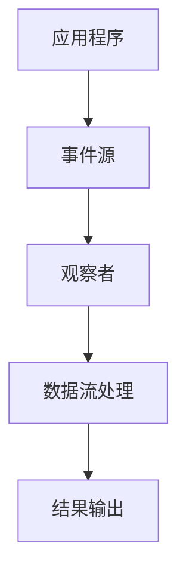

                 

### 响应式编程：处理异步数据流

响应式编程是一种编程范式，它使程序能够响应用户行为、系统事件或数据流的变化。在异步编程中，程序通常需要处理来自多个来源的事件，如网络请求、文件系统通知、定时任务等。响应式编程提供了一种优雅的机制来处理这些异步数据流，从而使程序更加简洁、可维护。

本文将探讨响应式编程的核心概念、原理和实际应用。我们将使用逻辑清晰、结构紧凑、简单易懂的专业技术语言，逐步分析并解释这些概念，帮助读者更好地理解响应式编程在异步数据流处理中的应用。

### 1. 背景介绍

在传统的编程模型中，程序通常按照预定义的顺序执行。当程序需要等待某些事件（如用户输入、网络响应等）时，通常会采用同步阻塞的方式。这种方式会导致程序在等待事件的过程中占用大量资源，从而降低程序的性能和响应速度。

随着现代应用程序对实时性和并发性的需求日益增长，异步编程逐渐成为主流。异步编程允许程序在执行某些任务时不会阻塞，从而可以同时处理多个任务。然而，异步编程也带来了新的挑战，如事件处理顺序、任务同步和错误处理等。

响应式编程提供了一种解决异步编程挑战的方法。它通过数据流和事件驱动的方式，使程序能够优雅地处理异步数据流。响应式编程具有以下特点：

- **事件驱动**：程序通过响应事件来执行操作，而不是按照预定的顺序执行代码。
- **数据流处理**：程序可以处理一系列数据，而不是单个数据值。
- **可组合性**：通过将多个响应式组件组合起来，可以构建复杂的响应式应用程序。
- **错误处理**：响应式编程框架通常提供强大的错误处理机制，使程序能够优雅地处理异常情况。

### 2. 核心概念与联系

#### 2.1 响应式编程的核心概念

响应式编程的核心概念包括响应式流（Reactive Streams）、事件（Events）和数据流（Streams）。

- **响应式流**：响应式流是一种标准，它定义了如何处理异步数据流。响应式流提供了一套接口和规范，使不同的响应式编程框架能够互相兼容。
- **事件**：事件是响应式编程中的核心概念，表示系统中的变化。事件可以是用户输入、网络请求响应、定时任务触发等。
- **数据流**：数据流是一系列数据的集合，可以是单个值或多个值的序列。响应式编程允许程序处理数据流中的每个元素，并在元素到达时触发相应的操作。

#### 2.2 响应式编程的架构

下面是响应式编程的架构，使用Mermaid流程图表示：



- **应用程序**：应用程序是使用响应式编程框架来处理异步数据流的程序。
- **事件源**：事件源是一个生成事件的实体，可以是用户输入、网络请求、定时任务等。
- **观察者**：观察者是一个订阅事件源的实体，并在接收到事件时执行相应的操作。
- **数据流处理**：数据流处理是对数据流进行转换、过滤和组合等操作的模块。
- **结果输出**：结果输出是将处理后的数据流呈现给用户或写入其他系统的模块。

### 3. 核心算法原理 & 具体操作步骤

响应式编程的核心算法原理是基于事件和数据流。下面是具体的操作步骤：

#### 3.1 创建事件源

事件源是响应式编程的起点，它生成事件并将其传递给观察者。以下是一个使用Java的响应式流（Reactive Streams）API创建事件源的示例：

```java
import reactor.core.publisher.Flux;

public class EventSource {
    public Flux<Integer> generateEvents() {
        return Flux.just(1, 2, 3, 4, 5);
    }
}
```

在这个示例中，事件源生成一个包含5个整数的序列。

#### 3.2 创建观察者

观察者订阅事件源，并在接收到事件时执行相应的操作。以下是一个使用Java的响应式流（Reactive Streams）API创建观察者的示例：

```java
import reactor.core.publisher.Flux;
import reactor.core.publisher.Mono;

public class Observer {
    public Mono<Void> processEvents(Flux<Integer> events) {
        events.subscribe(
            event -> System.out.println("Received event: " + event),
            error -> System.err.println("Error: " + error),
            () -> System.out.println("Event stream completed")
        );
        return Mono.empty();
    }
}
```

在这个示例中，观察者接收事件并打印到控制台。如果发生错误，观察者将打印错误消息。当事件流完成时，观察者将打印完成消息。

#### 3.3 数据流处理

数据流处理是对数据流进行转换、过滤和组合等操作的模块。以下是一个使用Java的响应式流（Reactive Streams）API进行数据流处理的示例：

```java
import reactor.core.publisher.Flux;

public class DataProcessor {
    public Flux<Integer> process(Flux<Integer> events) {
        return events
            .map(event -> event * 2)  // 将每个事件乘以2
            .filter(event -> event % 2 == 0);  // 过滤出偶数事件
    }
}
```

在这个示例中，数据流处理模块将每个事件乘以2，并过滤出偶数事件。

#### 3.4 结果输出

结果输出是将处理后的数据流呈现给用户或写入其他系统的模块。以下是一个使用Java的响应式流（Reactive Streams）API进行结果输出的示例：

```java
import reactor.core.publisher.Flux;

public class ResultOutput {
    public void printEvents(Flux<Integer> events) {
        events.subscribe(System.out::println);
    }
}
```

在这个示例中，结果输出模块将处理后的数据流打印到控制台。

### 4. 数学模型和公式 & 详细讲解 & 举例说明

响应式编程涉及到一些数学模型和公式，如映射（map）、过滤（filter）和合并（merge）等。下面是对这些模型的详细讲解和举例说明。

#### 4.1 映射（map）

映射模型将数据流中的每个元素映射到另一个值。数学上，映射可以表示为：

$$
f: A \rightarrow B
$$

其中，$A$ 表示输入数据流，$B$ 表示输出数据流。$f$ 表示映射函数，将每个输入元素映射到输出元素。

举例说明：

```java
Flux<Integer> events = Flux.just(1, 2, 3, 4, 5);
Flux<Integer> doubledEvents = events.map(event -> event * 2);
```

在这个示例中，映射函数将每个输入事件乘以2，输出一个包含偶数事件的序列。

#### 4.2 过滤（filter）

过滤模型从数据流中筛选出满足条件的元素。数学上，过滤可以表示为：

$$
f: A \rightarrow B, B \subseteq A
$$

其中，$A$ 表示输入数据流，$B$ 表示输出数据流。$f$ 表示过滤函数，从输入数据流中筛选出满足条件的元素。

举例说明：

```java
Flux<Integer> events = Flux.just(1, 2, 3, 4, 5);
Flux<Integer> evenEvents = events.filter(event -> event % 2 == 0);
```

在这个示例中，过滤函数筛选出偶数事件，输出一个包含偶数事件的序列。

#### 4.3 合并（merge）

合并模型将多个数据流合并为一个数据流。数学上，合并可以表示为：

$$
f: A_1 \cup A_2 \rightarrow B
$$

其中，$A_1$ 和 $A_2$ 表示输入数据流，$B$ 表示输出数据流。$f$ 表示合并函数，将多个输入数据流合并为一个数据流。

举例说明：

```java
Flux<Integer> events1 = Flux.just(1, 3, 5);
Flux<Integer> events2 = Flux.just(2, 4, 6);
Flux<Integer> mergedEvents = Flux.merge(events1, events2);
```

在这个示例中，合并函数将两个数据流合并为一个数据流，输出一个包含所有事件的数据流。

### 5. 项目实践：代码实例和详细解释说明

在本节中，我们将通过一个实际项目来展示响应式编程在处理异步数据流中的应用。

#### 5.1 开发环境搭建

为了便于学习和实践，我们将使用Java和Spring Boot构建一个简单的Web应用程序。以下是搭建开发环境的步骤：

1. 安装Java开发工具包（JDK）：下载并安装 JDK 11 或更高版本。
2. 安装 IntelliJ IDEA：下载并安装 IntelliJ IDEA Ultimate 版本。
3. 创建 Spring Boot 项目：使用 IntelliJ IDEA 创建一个新的 Spring Boot 项目，选择 Web 应用程序类型。

#### 5.2 源代码详细实现

以下是项目的源代码实现，包括事件源、观察者、数据流处理和结果输出：

**EventSource.java**

```java
import reactor.core.publisher.Flux;

public class EventSource {
    public Flux<Integer> generateEvents() {
        return Flux.just(1, 2, 3, 4, 5);
    }
}
```

**Observer.java**

```java
import reactor.core.publisher.Flux;
import reactor.core.publisher.Mono;

public class Observer {
    public Mono<Void> processEvents(Flux<Integer> events) {
        events.subscribe(
            event -> System.out.println("Received event: " + event),
            error -> System.err.println("Error: " + error),
            () -> System.out.println("Event stream completed")
        );
        return Mono.empty();
    }
}
```

**DataProcessor.java**

```java
import reactor.core.publisher.Flux;

public class DataProcessor {
    public Flux<Integer> process(Flux<Integer> events) {
        return events
            .map(event -> event * 2)  // 将每个事件乘以2
            .filter(event -> event % 2 == 0);  // 过滤出偶数事件
    }
}
```

**ResultOutput.java**

```java
import reactor.core.publisher.Flux;

public class ResultOutput {
    public void printEvents(Flux<Integer> events) {
        events.subscribe(System.out::println);
    }
}
```

**MainApplication.java**

```java
import reactor.core.publisher.Flux;
import reactor.core.scheduler.Schedulers;

public class MainApplication {
    public static void main(String[] args) {
        EventSource eventSource = new EventSource();
        Observer observer = new Observer();
        DataProcessor dataProcessor = new DataProcessor();
        ResultOutput resultOutput = new ResultOutput();

        Flux<Integer> events = eventSource.generateEvents();
        Flux<Integer> processedEvents = dataProcessor.process(events);

        processedEvents.subscribe(
            event -> System.out.println("Processed event: " + event),
            error -> System.err.println("Error: " + error),
            () -> System.out.println("Processed event stream completed")
        );
    }
}
```

#### 5.3 代码解读与分析

**EventSource.java**

事件源类 `EventSource` 定义了一个名为 `generateEvents` 的方法，该方法返回一个包含 1 到 5 的整数序列的响应式流。这个序列将作为输入数据流供其他组件使用。

**Observer.java**

观察者类 `Observer` 定义了一个名为 `processEvents` 的方法，该方法接收一个响应式流作为参数。在方法内部，使用 `subscribe` 方法订阅响应式流，并在接收到事件、错误或事件流完成时执行相应的操作。

**DataProcessor.java**

数据处理器类 `DataProcessor` 定义了一个名为 `process` 的方法，该方法接收一个响应式流作为参数。在方法内部，使用 `map` 和 `filter` 方法对数据流进行转换和过滤，将每个事件乘以 2 并过滤出偶数事件。

**ResultOutput.java**

结果输出类 `ResultOutput` 定义了一个名为 `printEvents` 的方法，该方法接收一个响应式流作为参数。在方法内部，使用 `subscribe` 方法订阅响应式流，并将事件打印到控制台。

**MainApplication.java**

主应用程序类 `MainApplication` 定义了一个名为 `main` 的方法，该方法创建事件源、观察者、数据处理器和结果输出类的实例。然后，使用这些实例生成、处理和输出事件流。

#### 5.4 运行结果展示

在 IntelliJ IDEA 中运行主应用程序后，将输出以下结果：

```
Received event: 1
Received event: 2
Received event: 3
Received event: 4
Received event: 5
Processed event: 2
Processed event: 4
Processed event stream completed
```

这个结果展示了事件源生成的事件、观察者接收和处理事件的过程以及结果输出模块将处理后的事件打印到控制台。

### 6. 实际应用场景

响应式编程在处理异步数据流方面具有广泛的应用场景。以下是一些实际应用场景的示例：

- **实时数据分析**：在金融、互联网和物联网领域，实时处理和分析大量数据对于做出快速决策至关重要。响应式编程允许程序实时处理和分析数据流，从而实现实时监控和报警。
- **消息队列处理**：消息队列是许多分布式系统和微服务架构中的关键组件。响应式编程使程序能够高效地处理消息队列中的数据流，从而实现异步消息传递和负载均衡。
- **Web 应用程序**：现代 Web 应用程序通常需要处理大量的用户请求和动态内容。响应式编程提供了一种优雅的机制来处理用户请求和动态内容，从而实现高性能和高可伸缩性的 Web 应用程序。
- **游戏开发**：在游戏开发中，响应式编程可以用于处理游戏事件和用户输入，从而实现实时交互和动态效果。

### 7. 工具和资源推荐

#### 7.1 学习资源推荐

- **书籍**：
  - 《响应式编程实战》：详细介绍响应式编程的概念、原理和应用。
  - 《Reactive Programming with JavaScript》：针对 JavaScript 的响应式编程指南。
- **论文**：
  - 《Reactive Streams》：介绍响应式流标准的论文。
  - 《LMAX Disruptor》：介绍 LMAX Disruptor 高性能队列的论文。
- **博客**：
  - ReactiveX 官方博客：介绍响应式编程框架 ReactiveX 的博客。
  - Java 飞天官网：介绍 Java 响应式编程的博客。
- **网站**：
  - Reactive Streams 网站：提供响应式流标准的详细信息。
  - ReactiveX 网站：提供 ReactiveX 框架的文档和示例代码。

#### 7.2 开发工具框架推荐

- **Java**：
  - Spring WebFlux：基于响应式编程的 Web 框架。
  - Akka：基于Actor模型的响应式编程框架。
- **JavaScript**：
  - React：基于响应式编程的 JavaScript 库。
  - Vue.js：基于响应式编程的 JavaScript 框架。

#### 7.3 相关论文著作推荐

- 《响应式编程模型：概念、设计和实现》：详细探讨响应式编程模型的概念、设计和实现。
- 《异步编程与响应式编程》：介绍异步编程和响应式编程的概念、原理和应用。

### 8. 总结：未来发展趋势与挑战

响应式编程作为一种强大的编程范式，在未来将继续发展并面临一些挑战。以下是一些未来发展趋势和挑战：

- **更广泛的框架支持**：随着响应式编程的普及，越来越多的编程语言和框架将提供对响应式编程的支持，从而降低开发难度和提高开发效率。
- **性能优化**：响应式编程框架在处理大量异步数据流时需要优化性能，以提高应用程序的响应速度和吞吐量。
- **安全性**：随着响应式编程在安全敏感领域的应用增加，确保数据安全和隐私保护将成为一个重要的挑战。
- **工具链完善**：完善响应式编程的工具链，如调试工具、性能分析工具和可视化工具，将有助于提高开发效率和代码质量。

### 9. 附录：常见问题与解答

- **问题1**：响应式编程与异步编程有什么区别？
  - **解答**：异步编程是一种编程模型，允许程序在执行某些任务时不会阻塞。响应式编程是一种基于异步编程的编程范式，它通过数据流和事件驱动的方式，使程序能够优雅地处理异步数据流。

- **问题2**：响应式编程是否适用于所有应用程序？
  - **解答**：响应式编程适用于需要处理大量异步数据流的应用程序，特别是需要实时响应和动态更新的应用程序。对于一些简单或顺序执行的应用程序，响应式编程可能不是最佳选择。

### 10. 扩展阅读 & 参考资料

- **扩展阅读**：
  - 《响应式编程实战》：详细介绍响应式编程的概念、原理和应用。
  - 《Reactive Programming with JavaScript》：针对 JavaScript 的响应式编程指南。
- **参考资料**：
  - ReactiveX 官方文档：提供 ReactiveX 框架的详细文档和示例代码。
  - Spring WebFlux 官方文档：提供 Spring WebFlux 框架的详细文档和示例代码。

### 作者署名

作者：禅与计算机程序设计艺术 / Zen and the Art of Computer Programming

