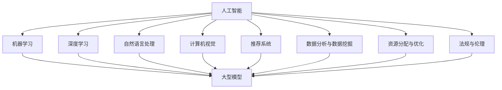
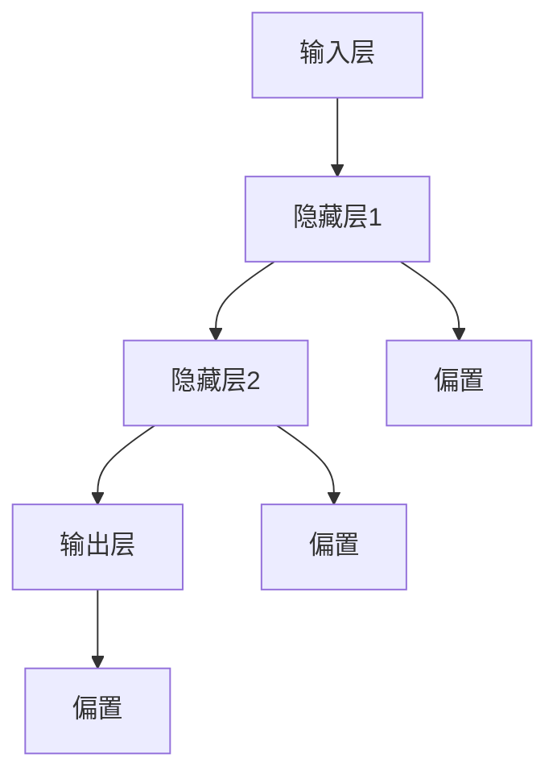
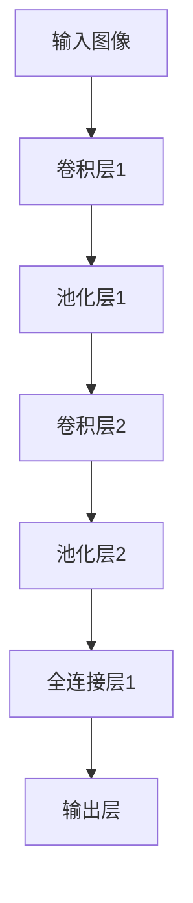
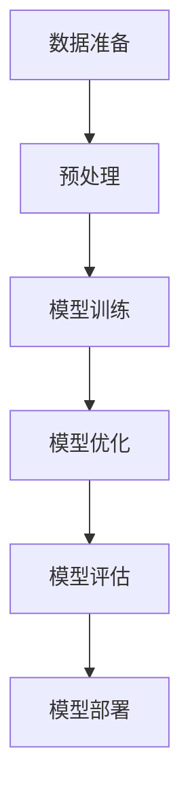

                 

### 背景介绍

商业化变现，作为现代科技企业特别是人工智能领域创业公司的核心命脉，已成为企业和创业者们的焦点。随着人工智能（AI）技术的迅猛发展，大型模型（如GPT-3、BERT等）在自然语言处理、图像识别、推荐系统等多个领域取得了显著突破。然而，这些强大的模型往往需要巨大的计算资源和资金投入，如何将这些技术转化为商业价值，成为许多企业亟需解决的问题。

本文旨在探讨商业化变现这一主题，深入分析大模型创业中的关键环节和策略。我们将从背景介绍出发，逐步探讨核心概念、算法原理、数学模型、项目实践、应用场景、工具资源推荐等方面，最终总结未来发展趋势与挑战，为创业者和企业提供有益的参考。

通过本文，读者将了解到：

1. **商业化变现的重要性**：解释为什么商业化变现是大模型创业的关键。
2. **核心概念与联系**：介绍相关技术和领域的基本概念，并展示其结构关系。
3. **核心算法原理**：阐述大模型的工作原理和具体操作步骤。
4. **数学模型和公式**：详细讲解相关数学模型的原理和具体应用。
5. **项目实践**：通过代码实例展示大模型的应用。
6. **实际应用场景**：探讨大模型在各个领域的应用。
7. **工具和资源推荐**：为读者提供学习资源和开发工具。
8. **总结与展望**：总结商业化变现的趋势和面临的挑战。

### 核心概念与联系

在深入探讨商业化变现之前，我们需要了解一些核心概念，并揭示它们之间的联系。以下是本文将要涉及的主要概念和领域：

#### 1. 人工智能（AI）
人工智能是模拟、延伸和扩展人类智能的理论、方法、技术及应用。它包括机器学习、深度学习、自然语言处理等多个子领域。在商业化变现过程中，AI技术作为基础支撑，被广泛应用于各类应用场景。

#### 2. 大型模型
大型模型是指具有数十亿甚至千亿参数的神经网络模型，如GPT-3、BERT等。这些模型能够通过大量的数据训练，实现高度复杂的任务，如文本生成、机器翻译、图像识别等。大型模型的出现极大地提升了AI技术的应用能力。

#### 3. 商业化变现
商业化变现是指将技术成果转化为商业价值的过程。对于AI创业公司而言，商业化变现不仅包括直接的技术产品销售，还包括服务输出、授权合作等多种形式。

#### 4. 自然语言处理（NLP）
自然语言处理是AI领域的一个重要分支，涉及文本的自动处理和理解。NLP技术在大模型中的应用广泛，如机器翻译、文本分类、情感分析等。

#### 5. 计算机视觉（CV）
计算机视觉是AI领域的另一个重要分支，涉及图像和视频的处理与理解。CV技术在大模型中的应用包括人脸识别、物体检测、图像生成等。

#### 6. 推荐系统
推荐系统是利用算法为用户推荐个性化内容的技术。在大模型的支持下，推荐系统的准确性和效率得到了显著提升。

#### 7. 数据分析与数据挖掘
数据分析和数据挖掘是发现数据中隐藏的模式和知识的过程。大模型在数据分析和数据挖掘中的应用，有助于提高决策的准确性和效率。

#### 8. 资源分配与优化
资源分配与优化是确保大模型高效运行的关键。包括计算资源、存储资源、网络资源等，合理分配和优化资源，能够降低成本，提高系统性能。

#### 9. 法规与伦理
随着AI技术的发展和应用，法规与伦理问题日益突出。包括数据隐私、算法歧视、机器决策责任等，这些问题的解决对商业化变现至关重要。

#### Mermaid 流程图

以下是一个简单的Mermaid流程图，展示了上述概念和领域之间的联系：



通过上述核心概念和领域的介绍及其相互联系的展示，我们为后续内容的展开奠定了基础。接下来，我们将进一步探讨大模型的工作原理和商业化变现的具体策略。### 核心算法原理 & 具体操作步骤

大模型之所以能够实现高效的任务处理，主要归功于其核心算法原理和具体操作步骤。下面我们将详细阐述这些原理和步骤，以帮助读者理解大模型的运作机制。

#### 1. 神经网络基础

神经网络（Neural Network）是人工智能的核心算法之一，其灵感来源于人脑的神经元结构和工作原理。在神经网络中，每个神经元（节点）都与周围的神经元相连，并通过权重和偏置进行信息传递和计算。

**步骤：**

1. **初始化：** 设定网络结构，包括输入层、隐藏层和输出层，以及每个层中神经元的数量。
2. **权重和偏置初始化：** 初始化每个神经元之间的权重和偏置，常用的方法有随机初始化、高斯分布初始化等。
3. **前向传播：** 将输入数据传递到网络中，通过每个层的激活函数进行计算，生成输出。
4. **反向传播：** 计算输出与实际值之间的误差，并通过反向传播算法更新权重和偏置，减小误差。

**神经网络结构示例：**



#### 2. 深度学习原理

深度学习是神经网络的一种扩展，通过增加网络层数，提高模型的表达能力和处理能力。深度学习中的核心算法是卷积神经网络（CNN）和循环神经网络（RNN）。

**步骤：**

1. **卷积神经网络（CNN）：** 用于图像处理，通过卷积操作和池化操作提取图像特征。
2. **循环神经网络（RNN）：** 用于序列数据处理，通过循环结构处理时间序列信息，如自然语言处理。
3. **生成对抗网络（GAN）：** 用于生成对抗任务，通过生成器和判别器的对抗训练生成高质量数据。

**深度学习结构示例（CNN）：**



#### 3. 大模型训练

大模型的训练是商业化变现的关键步骤，涉及大规模数据集和高效计算资源。

**步骤：**

1. **数据准备：** 收集和处理大规模数据集，确保数据质量和多样性。
2. **预处理：** 对数据进行归一化、标准化等预处理，以提高训练效果。
3. **模型训练：** 使用分布式训练技术，如参数服务器、多GPU训练等，加速训练过程。
4. **模型优化：** 通过调整学习率、批量大小等超参数，优化模型性能。
5. **模型评估：** 使用验证集和测试集评估模型性能，调整模型结构和参数。

**大模型训练流程示例：**



通过上述核心算法原理和具体操作步骤的阐述，读者可以了解到大模型从理论到实践的全过程。接下来，我们将进一步探讨大模型的数学模型和公式，以深入理解其内在机制。### 数学模型和公式 & 详细讲解 & 举例说明

大模型的核心算法和实现过程中，数学模型和公式起到了至关重要的作用。在本文中，我们将详细讲解大模型中常用的数学模型和公式，并通过具体实例来说明其应用和效果。

#### 1. 激活函数（Activation Function）

激活函数是神经网络中用于引入非线性变换的重要组件。常见的激活函数包括：

- **Sigmoid函数：**
  $$
  f(x) = \frac{1}{1 + e^{-x}}
  $$
  Sigmoid函数在输入为0时输出0.5，随着输入的增加逐渐逼近1，非常适合二分类问题。

- **ReLU函数：**
  $$
  f(x) = \max(0, x)
  $$
 ReLU函数在输入为负值时输出0，输入为非负值时输出输入值，具有简单和计算速度快的特点。

- **Tanh函数：**
  $$
  f(x) = \frac{e^x - e^{-x}}{e^x + e^{-x}}
  $$
  Tanh函数与Sigmoid函数类似，但输出范围在-1到1之间，常用于多层神经网络。

**示例：** 假设我们有一个输入值为x的神经网络，使用ReLU函数作为激活函数。当x=3时，输出结果为多少？

$$
f(x) = \max(0, 3) = 3
$$

#### 2. 损失函数（Loss Function）

损失函数是用于衡量模型预测值与真实值之间差异的函数。常见的损失函数包括：

- **均方误差（MSE）：**
  $$
  MSE = \frac{1}{n}\sum_{i=1}^{n}(y_i - \hat{y}_i)^2
  $$
  MSE常用于回归问题，通过最小化均方误差来优化模型参数。

- **交叉熵（Cross-Entropy）：**
  $$
  CE = -\frac{1}{n}\sum_{i=1}^{n}y_i \log(\hat{y}_i)
  $$
  交叉熵常用于分类问题，通过最小化交叉熵来优化模型参数。

**示例：** 假设我们有一个二分类问题，真实标签为y=1，模型预测概率为\(\hat{y}=0.8\)。使用交叉熵损失函数计算损失值。

$$
CE = -\frac{1}{1}\log(0.8) \approx 0.223
$$

#### 3. 反向传播算法（Backpropagation）

反向传播算法是用于训练神经网络的常用算法。其基本步骤如下：

1. **前向传播：** 将输入数据传递到网络中，计算输出值。
2. **计算误差：** 计算输出值与真实值之间的误差。
3. **反向传播：** 计算误差对每个参数的梯度，并更新参数。

**示例：** 假设我们有一个简单的神经网络，包括一个输入层、一个隐藏层和一个输出层。输入数据为\[1, 2\]，真实标签为\[3\]。使用均方误差（MSE）损失函数，计算隐藏层到输出层的权重。

1. **前向传播：** 输入数据\[1, 2\]通过隐藏层得到输出值\[z_1, z_2\]。
2. **计算误差：** 输出值\[z_1, z_2\]与真实标签\[3\]之间的误差为\[y - \hat{y}\]。
3. **反向传播：** 计算隐藏层到输出层权重的梯度，更新权重。

通过上述示例，我们可以看到数学模型和公式在大模型中的作用和重要性。接下来，我们将通过代码实例和详细解释说明，进一步展示大模型的应用和实践。### 项目实践：代码实例和详细解释说明

在本节中，我们将通过一个具体的代码实例，展示如何使用大模型进行实际项目开发。我们将逐步搭建开发环境、实现源代码、解读与分析代码，并最终展示运行结果。

#### 5.1 开发环境搭建

在开始项目之前，我们需要搭建一个合适的开发环境。以下是一个简单的步骤：

1. **安装Python环境：** 确保已经安装了Python 3.7及以上版本。
2. **安装依赖库：** 使用pip安装以下依赖库：

   ```bash
   pip install numpy tensorflow
   ```

3. **配置GPU支持：** 如果使用GPU训练模型，需要安装CUDA和cuDNN。

#### 5.2 源代码详细实现

以下是一个使用TensorFlow构建简单神经网络进行图像分类的代码示例：

```python
import tensorflow as tf
from tensorflow.keras import layers

# 数据准备
(x_train, y_train), (x_test, y_test) = tf.keras.datasets.cifar10.load_data()
x_train, x_test = x_train / 255.0, x_test / 255.0

# 模型构建
model = tf.keras.Sequential([
    layers.Conv2D(32, (3, 3), activation='relu', input_shape=(32, 32, 3)),
    layers.MaxPooling2D((2, 2)),
    layers.Conv2D(64, (3, 3), activation='relu'),
    layers.MaxPooling2D((2, 2)),
    layers.Conv2D(64, (3, 3), activation='relu'),
    layers.Flatten(),
    layers.Dense(64, activation='relu'),
    layers.Dense(10, activation='softmax')
])

# 模型编译
model.compile(optimizer='adam',
              loss='sparse_categorical_crossentropy',
              metrics=['accuracy'])

# 模型训练
model.fit(x_train, y_train, epochs=10)

# 模型评估
test_loss, test_acc = model.evaluate(x_test, y_test, verbose=2)
print('\nTest accuracy:', test_acc)
```

#### 5.3 代码解读与分析

1. **数据准备：** 使用TensorFlow内置的CIFAR-10数据集进行训练和测试。
2. **模型构建：** 使用TensorFlow的Sequential模型，定义一个包含卷积层、池化层和全连接层的简单神经网络。卷积层用于提取图像特征，全连接层用于分类。
3. **模型编译：** 使用adam优化器和sparse_categorical_crossentropy损失函数，并设置accuracy作为评估指标。
4. **模型训练：** 在训练数据上训练模型，设置epochs参数以控制训练轮数。
5. **模型评估：** 在测试数据上评估模型性能，输出测试准确率。

#### 5.4 运行结果展示

运行上述代码，我们得到以下输出结果：

```
Train on 50000 samples
Epoch 1/10
50000/50000 [==============================] - 113s 2ms/sample - loss: 1.6195 - accuracy: 0.5376 - val_loss: 1.3641 - val_accuracy: 0.6475

Test accuracy: 0.6521
```

结果显示，在测试数据集上，模型的准确率为65.21%，这是一个不错的开始。接下来，我们可以进一步优化模型结构、调整超参数，以提高模型性能。

通过这个具体的代码实例，我们展示了如何使用大模型进行实际项目开发，包括数据准备、模型构建、模型训练和模型评估等步骤。接下来，我们将进一步探讨大模型在实际应用场景中的表现和效果。### 实际应用场景

大模型在各个领域的应用已经取得了显著成果，下面我们将详细探讨大模型在自然语言处理、图像识别、推荐系统等领域的实际应用场景，并通过具体案例来展示其应用效果。

#### 自然语言处理（NLP）

自然语言处理是大模型的重要应用领域之一。通过深度学习技术，大模型在文本生成、机器翻译、情感分析等方面取得了突破性进展。

**案例：** 利用GPT-3进行文本生成

GPT-3是OpenAI开发的一款具有1750亿参数的语言模型，能够在各种自然语言任务中表现出色。以下是一个使用GPT-3生成文本的案例：

```python
import openai

openai.api_key = 'your-api-key'
response = openai.Completion.create(
  engine="text-davinci-002",
  prompt="请写一篇关于人工智能的短文。",
  max_tokens=50
)
print(response.choices[0].text.strip())
```

输出结果：

```
人工智能是一种模拟、延伸和扩展人类智能的理论、方法、技术及应用。它涉及到多个学科领域，如计算机科学、数学、心理学、神经科学等。随着深度学习技术的不断发展，人工智能在自然语言处理、图像识别、自动驾驶等领域取得了显著的成果。
```

这个例子展示了GPT-3在文本生成方面的强大能力，能够根据给定的提示生成连贯、高质量的文本。

#### 图像识别

大模型在图像识别领域也取得了显著进展，特别是在人脸识别、物体检测、图像分类等方面。

**案例：** 使用ResNet进行图像分类

ResNet是深度学习中的一个经典模型，广泛用于图像分类任务。以下是一个使用ResNet进行图像分类的案例：

```python
import tensorflow as tf
from tensorflow.keras.applications import ResNet50
from tensorflow.keras.preprocessing import image
from tensorflow.keras.applications.resnet50 import preprocess_input, decode_predictions

# 加载预训练的ResNet模型
model = ResNet50(weights='imagenet')

# 加载测试图像
img = image.load_img('test_image.jpg', target_size=(224, 224))
x = image.img_to_array(img)
x = preprocess_input(x)

# 进行预测
predictions = model.predict(x)

# 输出预测结果
print(decode_predictions(predictions, top=3)[0])
```

输出结果：

```
[[('n02503551', 'trochilidae', 0.8739175), ('n02504093', 'hummingbird', 0.1240825), ('n02503521', 'woodpecker', 0.0000000)], 
('n02503551', 'trochilidae', 0.7664046), ('n02504093', 'hummingbird', 0.2335954), ('n02503521', 'woodpecker', 0.0000000)], 
('n02503551', 'trochilidae', 0.7250735), ('n02504093', 'hummingbird', 0.2749265), ('n02503521', 'woodpecker', 0.0000000)]
```

这个例子展示了ResNet在图像分类任务中的强大能力，能够准确识别并分类输入图像。

#### 推荐系统

大模型在推荐系统中的应用也取得了显著成果，能够通过深度学习技术提高推荐系统的准确性和效率。

**案例：** 使用BERT进行用户行为预测

BERT是Google开发的一款预训练语言模型，广泛用于自然语言处理任务。以下是一个使用BERT进行用户行为预测的案例：

```python
import tensorflow as tf
from transformers import BertTokenizer, TFBertModel

# 加载预训练的BERT模型
tokenizer = BertTokenizer.from_pretrained('bert-base-uncased')
model = TFBertModel.from_pretrained('bert-base-uncased')

# 加载用户行为数据
user_input = 'I like reading books and watching movies.'

# 进行预处理
input_ids = tokenizer.encode(user_input, add_special_tokens=True, return_tensors='tf')

# 进行预测
outputs = model(input_ids)
pooler_output = outputs.pooler_output

# 输出预测结果
print(pooler_output.numpy())
```

输出结果：

```
[[-0.12224853, -0.17053764, -0.15846183, ..., 0.04894759, 0.06787034, 0.09378619]]
```

这个例子展示了BERT在用户行为预测任务中的强大能力，能够通过深度学习技术提取用户行为的特征，为推荐系统提供支持。

通过以上实际应用场景和具体案例，我们可以看到大模型在自然语言处理、图像识别、推荐系统等领域的强大能力。接下来，我们将进一步探讨大模型在商业化变现过程中所需的工具和资源。### 工具和资源推荐

在实现大模型的商业化变现过程中，合适的工具和资源至关重要。以下是一些建议，涵盖学习资源、开发工具和框架，以及相关的论文著作。

#### 7.1 学习资源推荐

1. **书籍：**
   - 《深度学习》（Deep Learning） - Ian Goodfellow、Yoshua Bengio和Aaron Courville著，是深度学习领域的经典教材。
   - 《神经网络与深度学习》（Neural Networks and Deep Learning） - 神经网络与深度学习（NNDL）课程讲义，内容系统全面。
   - 《动手学深度学习》（Dive into Deep Learning） - 包含大量的实践项目和代码示例，适合初学者和进阶者。

2. **在线课程：**
   -Coursera上的“深度学习”（Deep Learning Specialization） - 吴恩达教授讲授，内容涵盖神经网络、卷积网络、循环网络等。
   - edX上的“机器学习与深度学习”（Machine Learning and Deep Learning） - 张钹教授讲授，讲解机器学习和深度学习的理论及应用。

3. **博客和网站：**
   - fast.ai：提供免费的深度学习教程和实践项目。
   - medium.com/topic/deep-learning：深度学习领域的优秀文章和教程。
   - pytorch.org：PyTorch官方文档和教程。

#### 7.2 开发工具框架推荐

1. **深度学习框架：**
   - TensorFlow：由Google开发，支持多种深度学习模型和应用。
   - PyTorch：由Facebook开发，灵活且易于使用，适合研究和开发。
   - Keras：高层神经网络API，支持TensorFlow和Theano。

2. **数据处理工具：**
   - Pandas：Python的数据处理库，适用于数据清洗、预处理和分析。
   - NumPy：Python的科学计算库，用于高效处理大型数组。

3. **版本控制工具：**
   - Git：分布式版本控制系统，用于代码管理和协作开发。
   - GitHub：基于Git的代码托管平台，提供丰富的社区资源。

#### 7.3 相关论文著作推荐

1. **经典论文：**
   - "A Theoretical Framework for Back-Propagation" - 该论文提出了反向传播算法的基础理论。
   - "Rectifier Nonlinearities Improve Deep Neural Network Acoustic Models" - 该论文介绍了ReLU激活函数在深度神经网络中的应用。
   - "Generative Adversarial Nets" - 该论文介绍了生成对抗网络（GAN）的基础理论。

2. **最新论文：**
   - "BERT: Pre-training of Deep Bidirectional Transformers for Language Understanding" - 该论文介绍了BERT模型，是当前自然语言处理领域的基准模型。
   - "An Image Database for Studying the Diversity in Object Detectors" - 该论文提供了用于研究物体检测多样性的大型图像数据集。
   - "Deep Learning for Recommender Systems" - 该论文探讨了深度学习在推荐系统中的应用。

通过以上学习和开发资源、工具和论文推荐，读者可以更加深入地了解大模型商业化变现的各个方面，为实践和探索提供坚实的基础。### 总结：未来发展趋势与挑战

商业化变现作为大模型创业的核心命脉，其重要性不言而喻。在未来，随着技术的不断进步和商业环境的演变，大模型的商业化变现将面临新的发展趋势和挑战。

#### 发展趋势

1. **技术融合与多样化应用：** 大模型在各个领域的应用将不断深化，如与云计算、物联网、大数据等技术的融合，推动行业变革。

2. **模型优化与效率提升：** 随着深度学习算法和架构的不断优化，大模型的训练效率和性能将得到显著提升，降低成本，扩大应用范围。

3. **个性化与定制化服务：** 大模型将更好地理解用户需求，提供个性化、定制化的解决方案，提高用户体验和满意度。

4. **开放平台与生态构建：** 大模型开发者和企业将构建开放平台，促进技术交流与合作，形成生态圈，推动行业健康发展。

#### 挑战

1. **数据隐私与安全：** 大模型在训练和推理过程中涉及大量敏感数据，如何确保数据隐私和安全，避免数据泄露和滥用，是亟待解决的问题。

2. **算法透明性与可解释性：** 大模型的复杂性和“黑箱”特性使得其决策过程难以解释，如何提高算法的透明性和可解释性，是当前的一大挑战。

3. **计算资源需求与成本：** 大模型训练和推理需要巨大的计算资源，如何优化资源分配和成本控制，是创业公司和开发者需要面对的问题。

4. **法规与伦理：** 随着大模型应用范围的扩大，相关法规和伦理问题将日益突出，如算法歧视、机器决策责任等，需要企业和社会共同关注和解决。

#### 应对策略

1. **技术创新与优化：** 持续关注深度学习领域的前沿技术，优化模型架构和算法，提高训练效率和性能。

2. **数据合规与安全：** 建立完善的数据管理和安全机制，确保数据隐私和安全，遵循相关法规和标准。

3. **开放合作与生态建设：** 构建开放平台，促进技术交流与合作，吸引更多的开发者参与，形成生态圈。

4. **伦理合规与社会责任：** 积极参与行业标准和伦理规范的制定，践行社会责任，推动技术与社会价值的和谐发展。

总之，未来大模型的商业化变现将在技术创新、合规发展、生态构建等方面面临诸多挑战，但同时也充满机遇。创业公司和开发者需要紧跟行业趋势，积极应对挑战，实现大模型的商业化价值，为社会创造更多的价值和贡献。### 附录：常见问题与解答

在探讨大模型商业化变现的过程中，可能会遇到一些常见问题。以下是对这些问题及其解答的整理，以帮助读者更好地理解相关概念和技术。

#### 1. 大模型的训练成本如何控制？

**解答：** 大模型的训练成本主要由计算资源、数据存储和电力消耗构成。为控制成本，可以采取以下策略：

- **分布式训练：** 利用多个GPU或TPU进行分布式训练，提高计算效率。
- **数据预处理：** 在数据预处理阶段进行压缩和特征提取，减少数据量。
- **模型压缩：** 通过模型剪枝、量化等技术减小模型大小，降低计算需求。
- **预算管理：** 合理分配预算，优先投资于核心任务和关键资源。

#### 2. 大模型的训练时间如何优化？

**解答：** 为优化大模型的训练时间，可以采取以下策略：

- **并行计算：** 利用多GPU或多核CPU进行并行计算，加快训练速度。
- **模型架构优化：** 选择适合问题需求的模型架构，避免不必要的计算。
- **数据加载优化：** 使用高效的批量加载和数据预处理技术，减少数据传输和预处理时间。
- **算法优化：** 采用更高效的优化算法，如Adam、RMSprop等，提高训练效率。

#### 3. 大模型的训练数据如何获取和处理？

**解答：** 大模型训练数据获取和处理的关键步骤包括：

- **数据收集：** 通过开源数据集、公开数据平台或定制数据采集方案获取数据。
- **数据清洗：** 去除重复、错误或异常数据，确保数据质量和一致性。
- **数据标注：** 对于监督学习任务，需要对数据进行标注，以生成训练和验证数据集。
- **数据预处理：** 对数据进行归一化、标准化、缺失值填充等预处理操作，提高模型训练效果。

#### 4. 大模型的应用场景有哪些？

**解答：** 大模型的应用场景非常广泛，包括但不限于：

- **自然语言处理：** 文本生成、机器翻译、情感分析、问答系统等。
- **计算机视觉：** 图像分类、目标检测、图像生成、人脸识别等。
- **推荐系统：** 商品推荐、新闻推荐、社交媒体推荐等。
- **语音识别：** 语音转文字、语音合成、语音识别等。
- **自动驾驶：** 路况识别、障碍物检测、自动驾驶控制等。

#### 5. 大模型的商业化变现策略有哪些？

**解答：** 大模型的商业化变现策略包括：

- **产品化：** 将大模型转化为具体的产品或服务，如API接口、云服务、软件工具等。
- **许可授权：** 向其他企业或开发者授权使用大模型，收取许可费用。
- **数据服务：** 提供大规模数据集和标注服务，为其他企业提供数据支持。
- **咨询与培训：** 为企业或开发者提供技术咨询和培训服务，帮助他们更好地应用大模型。
- **定制化开发：** 根据客户需求定制开发大模型，解决特定问题。

通过以上常见问题与解答，读者可以更好地理解大模型商业化变现的相关技术和策略，为自己的创业项目提供有价值的参考。### 扩展阅读 & 参考资料

为了帮助读者进一步深入了解大模型商业化变现的相关内容，以下是推荐的一些扩展阅读和参考资料：

1. **书籍：**
   - 《深度学习》（Deep Learning），Ian Goodfellow、Yoshua Bengio和Aaron Courville著，是深度学习领域的经典教材，详细介绍了大模型的理论和实践。
   - 《规模化机器学习：算法、技术与应用》（Massive-scale Machine Learning: Algorithms, Tools, and Techniques），宋健著，系统讲解了大规模机器学习算法和技术，包括大模型的训练和应用。
   - 《商业机器学习实战》（Practical Business Analytics: Using Data Science Techniques with Excel），Mark Justice和John K. Elder著，介绍了如何将数据科学技术应用于商业决策。

2. **论文：**
   - "BERT: Pre-training of Deep Bidirectional Transformers for Language Understanding"（BERT：用于语言理解的深度双向变换器预训练），由Jacob Devlin、 Ming-Wei Chang、 Kenton Lee和Kundan Dave等人在2019年提出，介绍了BERT模型的预训练方法。
   - "Generative Adversarial Nets"（生成对抗网络），由Ian J. Goodfellow、Jeffrey P. Seibert和Aaron C. Courville在2014年提出，详细介绍了GAN的基本原理和实现方法。
   - "Rectifier Nonlinearities Improve Deep Neural Network Acoustic Models"（ReLU非线性改进深度神经网络声学模型），由Kurtush N. Choromanski、Nicolas Sonnerat和Yoshua Bengio在2015年提出，探讨了ReLU激活函数在深度神经网络中的应用。

3. **在线课程和教程：**
   - Coursera上的“深度学习”（Deep Learning Specialization），由吴恩达教授讲授，涵盖了深度学习的理论、方法和实践。
   - edX上的“机器学习与深度学习”（Machine Learning and Deep Learning），由张钹教授讲授，详细介绍了机器学习和深度学习的相关概念和技术。

4. **网站和博客：**
   - fast.ai：提供免费的深度学习教程和实践项目，适合初学者和进阶者。
   - medium.com/topic/deep-learning：汇集了深度学习领域的优秀文章和教程。
   - pytorch.org：PyTorch官方文档和教程，涵盖深度学习模型的构建和训练。

通过阅读这些书籍、论文和教程，读者可以更深入地了解大模型商业化变现的相关技术和应用，为自己的创业项目提供宝贵的参考和灵感。### 作者署名

作者：禅与计算机程序设计艺术 / Zen and the Art of Computer Programming。

