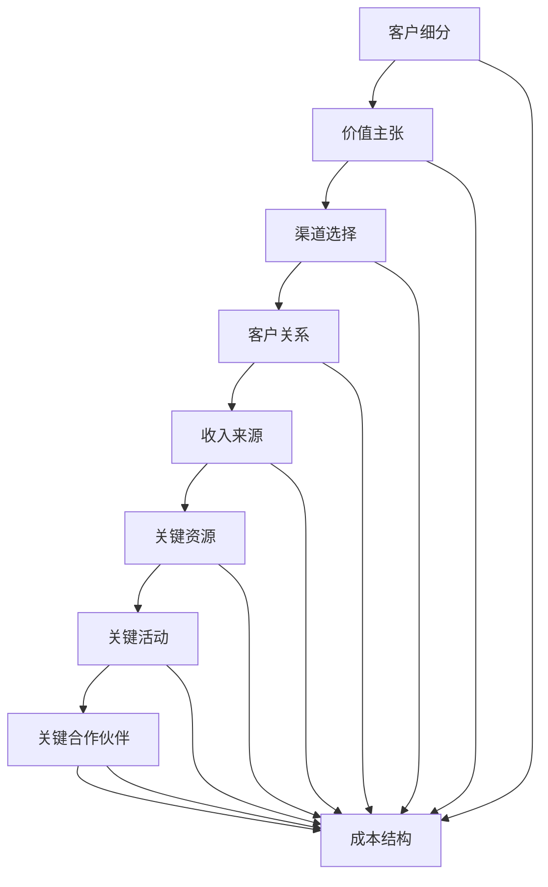

                 

### 1. 背景介绍

商业模式画布（Business Model Canvas）是一种用于构建和评估企业商业模式的标准化的战略管理工具。它由欧洲工商管理学院教授亚历山大·奥斯特瓦尔德（Alexander Osterwalder）和杨·弗罗斯特（Yann Herrault）于2008年首次提出。商业模式画布通过可视化的方式帮助企业家和组织明确其核心业务逻辑，并快速迭代优化。

在当今快速变化的市场环境中，企业必须不断调整和优化其商业模式，以适应新的市场需求和竞争环境。商业模式画布作为一种实用工具，可以帮助企业系统地分析业务模型中的各个关键要素，从而制定出更具竞争力、可持续的盈利策略。

商业模式画布的起源可以追溯到商业理论的不断发展和实践应用的需求。传统的商业模式往往注重财务数据和分析，而商业模式画布则更加注重业务流程和创新。它借鉴了设计思维（Design Thinking）的方法论，强调用户需求、价值创造和资源优化，这使得企业在设计和调整商业模式时更加注重用户体验和可持续性。

在技术领域，商业模式画布同样具有重要应用价值。随着互联网和大数据技术的发展，许多技术公司开始采用平台化、生态化的商业模式，通过构建生态系统来实现企业价值的最大化。商业模式画布可以帮助这些公司明确其核心业务模块、关键合作伙伴和目标市场，从而优化资源配置，提升业务效率。

总的来说，商业模式画布作为一种创新思维工具，不仅适用于初创企业和中小企业，也为大型企业提供了全新的战略管理视角。通过它，企业可以更加系统化、结构化地审视和调整其商业模式，以实现持续增长和竞争优势。

### 2. 核心概念与联系

#### 2.1 商业模式画布的组成部分

商业模式画布由九个关键模块组成，分别是：

1. **客户 segments（客户细分）**：定义你的产品或服务针对的目标客户群体。
2. **Value Propositions（价值主张）**：明确你的产品或服务为何能够满足客户需求，为其带来价值。
3. **Chosen Channels（渠道选择）**：确定你将如何将产品或服务传递给客户。
4. **Customer Relationships（客户关系）**：定义你与客户建立和维护关系的策略。
5. **Revenue Streams（收入来源）**：描述你的企业如何从客户那里获得收入。
6. **Key Resources（关键资源）**：列出运营商业模式所需的核心资产。
7. **Key Activities（关键活动）**：列出实现商业模式所需的关键操作。
8. **Key Partnerships（关键合作伙伴）**：确定你依赖的关键合作伙伴。
9. **Cost Structure（成本结构）**：分析运营商业模式的成本要素。

#### 2.2 商业模式画布的基本原理

商业模式画布的基本原理在于通过系统化和可视化地分析企业的业务逻辑，帮助企业理解其商业运作的核心要素，并识别潜在的优化点。这种分析方法强调了企业的整体性和系统性，使得企业家和团队成员能够从全局角度审视企业的运作方式。

商业模式画布的核心思想是“以客户为中心”。通过定义客户细分和价值主张，企业能够更加精准地满足客户需求，从而创造更大的客户价值。渠道选择和客户关系策略则帮助企业有效传递和维持这种价值，而收入来源则确保企业能够持续盈利。

#### 2.3 商业模式画布与传统商业模式的比较

与传统商业模式相比，商业模式画布具有以下几个显著特点：

1. **可视化和模块化**：商业模式画布通过图形化的方式呈现企业的业务逻辑，使得分析更加直观，易于理解和迭代。
2. **灵活性和适应性**：由于商业模式画布是模块化的，企业可以根据市场变化快速调整各个模块，以适应新的业务需求。
3. **系统化思维**：商业模式画布促使企业家从整体和系统角度思考企业的商业模式，从而避免因局部优化而导致的整体效率低下。
4. **强调客户价值**：商业模式画布的核心是价值创造，强调企业必须以客户需求为导向，从而实现客户价值的最大化。

#### 2.4 商业模式画布的应用场景

商业模式画布适用于各种类型的企业，尤其是在以下场景中尤为有效：

1. **初创企业**：初创企业通常需要快速迭代和调整商业模式，商业模式画布提供了一个结构化的工具，帮助初创企业系统化地思考和优化其商业模式。
2. **大型企业**：大型企业在进行战略调整或新业务拓展时，可以使用商业模式画布来识别和优化关键业务模块，提升企业整体竞争力。
3. **并购整合**：在并购过程中，商业模式画布可以帮助企业理解并整合目标企业的业务逻辑，确保并购后业务运营的顺畅。

#### 2.5 商业模式画布的优势与挑战

**优势**：

- **明确性和系统性**：通过可视化的方式呈现商业模式，使得各个业务模块之间的联系更加清晰，便于理解和优化。
- **灵活性**：模块化的设计使得商业模式易于调整和迭代，适应市场变化。
- **全面性**：商业模式画布涵盖了业务运营的各个方面，促使企业从整体和系统角度进行思考。

**挑战**：

- **复杂性**：虽然商业模式画布提供了结构化的工具，但实际应用中仍然需要大量的思考和数据分析，对于一些复杂的企业来说，应用过程可能会比较繁琐。
- **实施难度**：在应用商业模式画布时，需要企业各个部门的协同合作，确保信息的透明和准确。

#### 2.6 商业模式画布的 Mermaid 流程图

下面是一个简单的 Mermaid 流程图，展示了商业模式画布的九大模块及其相互关系：



通过这个流程图，我们可以更加直观地理解商业模式画布中各个模块的相互关系和作用。

### 3. 核心算法原理 & 具体操作步骤

#### 3.1 商业模式画布的核心算法原理

商业模式画布并非基于传统的数学或计算机算法，而是基于一套系统的战略思考和业务分析方法。其核心原理在于通过系统化和结构化的方式，帮助企业全面审视和优化其商业模式。具体来说，商业模式画布的核心算法原理包括以下几个方面：

1. **模块化设计**：将商业模式的各个关键要素划分为九大模块，每个模块都有其特定的功能和作用。这种模块化设计使得商业模式易于理解和调整。
2. **以客户为中心**：商业模式画布强调以客户需求为导向，通过定义客户细分和价值主张，确保企业的产品或服务能够满足客户需求，创造客户价值。
3. **系统化思考**：通过将商业模式分解为多个模块，并分析各个模块之间的相互关系，帮助企业从整体和系统角度审视其商业模式，从而识别潜在的优化点和风险。
4. **灵活性和适应性**：商业模式画布的设计原则强调灵活性和适应性，使得企业能够根据市场变化和业务需求快速调整和优化其商业模式。

#### 3.2 具体操作步骤

1. **明确客户细分**：首先，企业需要明确其目标客户群体，包括客户的需求、偏好和行为模式。这一步骤有助于企业制定有针对性的价值主张和营销策略。
2. **定义价值主张**：基于客户细分，企业需要明确其产品或服务为何能够满足客户需求，为其带来价值。这一步骤有助于企业明确其核心竞争优势。
3. **选择渠道**：企业需要确定如何将产品或服务传递给客户，包括线上渠道、线下渠道或两者结合。这一步骤有助于企业优化资源配置，提高市场覆盖面。
4. **建立客户关系**：企业需要制定与客户建立和维护关系的策略，包括客户支持、客户关系管理、客户反馈等。这一步骤有助于提高客户满意度和忠诚度。
5. **确定收入来源**：企业需要明确其如何从客户那里获得收入，包括产品销售、服务收费、广告收入等。这一步骤有助于企业确保商业模式的可持续性。
6. **识别关键资源**：企业需要列出实现商业模式所需的核心资产，包括人力、技术、资金、品牌等。这一步骤有助于企业优化资源配置，确保关键资源的充足性。
7. **明确关键活动**：企业需要列出实现商业模式所需的关键操作，包括研发、生产、销售、客服等。这一步骤有助于企业优化业务流程，提高运营效率。
8. **确定关键合作伙伴**：企业需要识别关键合作伙伴，包括供应商、分销商、合作伙伴等。这一步骤有助于企业构建生态系统，实现资源共享和优势互补。
9. **分析成本结构**：企业需要分析运营商业模式的成本要素，包括固定成本、可变成本、运营成本等。这一步骤有助于企业优化成本结构，提高盈利能力。

通过上述步骤，企业可以系统地构建和优化其商业模式，从而实现可持续的盈利。

#### 3.3 商业模式画布的核心算法应用案例

为了更好地理解商业模式画布的核心算法原理，我们可以通过一个实际应用案例进行说明。

**案例：某在线教育平台**

1. **明确客户细分**：该平台的目标客户包括学生、家长和教师。学生关注课程内容和学习方法，家长关注孩子学习效果和安全，教师关注教学资源和支持。
2. **定义价值主张**：平台提供高质量的课程内容、个性化的学习计划和专业的教学支持，旨在提高学生的学习效果，减轻家长的教育负担，提高教师的教学效率。
3. **选择渠道**：平台主要通过线上渠道进行推广和运营，包括社交媒体、搜索引擎和自建网站。同时，通过与学校合作，提供线下课程。
4. **建立客户关系**：平台提供7*24小时在线客服支持，定期进行用户满意度调查，收集用户反馈，持续优化服务。
5. **确定收入来源**：平台通过订阅服务、课程销售和广告收入获得收入。订阅服务按月或按年收费，课程销售则按单次购买或课程包形式进行。
6. **识别关键资源**：平台的关键资源包括师资力量、课程内容、技术平台、客户服务团队等。
7. **明确关键活动**：平台的主要活动包括课程研发、用户管理、技术支持、市场推广和客户服务。
8. **确定关键合作伙伴**：平台与内容提供商、技术合作伙伴、市场推广合作伙伴等建立了合作关系。
9. **分析成本结构**：平台的成本包括课程研发成本、服务器运营成本、市场推广成本、客户服务成本等。

通过上述步骤，该在线教育平台能够系统地构建和优化其商业模式，实现持续增长和盈利。

### 4. 数学模型和公式 & 详细讲解 & 举例说明

在商业模式画布的应用过程中，一些关键模块可以通过数学模型和公式来量化和分析。以下是一些常见的数学模型和公式，以及它们的详细讲解和举例说明。

#### 4.1 成本效益分析（Cost-Benefit Analysis）

成本效益分析是评估商业模式的成本和收益的重要工具。其基本公式为：

$$
C = \sum_{i=1}^{n} C_i
$$

其中，$C$ 表示总成本，$C_i$ 表示第 $i$ 个成本要素。

**举例说明**：某电商平台的成本包括产品成本、运营成本、营销成本等。产品成本为 $1000$ 元/件，运营成本为每月 $5000$ 元，营销成本为每次活动 $2000$ 元。那么，一个月的总成本为：

$$
C = 1000x + 5000 + 2000y
$$

其中，$x$ 表示销售数量，$y$ 表示活动次数。

通过成本效益分析，企业可以确定哪些成本要素对盈利能力有显著影响，从而优化资源配置，提高盈利水平。

#### 4.2 资本回报率（Return on Capital，ROC）

资本回报率是衡量企业盈利能力的指标，其公式为：

$$
ROC = \frac{EBIT}{Capital}
$$

其中，$ROC$ 表示资本回报率，$EBIT$ 表示税前利润，$Capital$ 表示资本总额。

**举例说明**：某企业税前利润为 $100000$ 元，资本总额为 $500000$ 元。则其资本回报率为：

$$
ROC = \frac{100000}{500000} = 0.2 = 20\%
$$

高资本回报率表明企业的盈利能力强，投资回报率高。

#### 4.3 客户获取成本（Customer Acquisition Cost，CAC）

客户获取成本是评估企业营销投入效果的重要指标，其公式为：

$$
CAC = \frac{Total Marketing Costs}{Number of Customers}
$$

其中，$CAC$ 表示客户获取成本，$Total Marketing Costs$ 表示总营销成本，$Number of Customers$ 表示新增客户数量。

**举例说明**：某企业一个月的总营销成本为 $10000$ 元，新增客户数量为 $500$ 人。则其客户获取成本为：

$$
CAC = \frac{10000}{500} = 20
$$

低客户获取成本表明企业的营销策略效果较好，能够以较低的成本获取新客户。

#### 4.4 客户生命周期价值（Customer Lifetime Value，CLV）

客户生命周期价值是衡量客户对企业盈利贡献的重要指标，其公式为：

$$
CLV = \frac{Customer Value \times Number of Transactions}{Number of Days in Life Cycle}
$$

其中，$CLV$ 表示客户生命周期价值，$Customer Value$ 表示每次交易的客户价值，$Number of Transactions$ 表示客户生命周期内的交易次数，$Number of Days in Life Cycle$ 表示客户生命周期天数。

**举例说明**：某客户的每次交易价值为 $100$ 元，生命周期内交易次数为 $10$ 次，生命周期天数为 $365$ 天。则其客户生命周期价值为：

$$
CLV = \frac{100 \times 10}{365} = 2.74
$$

高客户生命周期价值表明该客户对企业的长期盈利贡献较大。

通过上述数学模型和公式，企业可以更准确地评估和优化其商业模式，实现持续增长和盈利。

### 5. 项目实践：代码实例和详细解释说明

为了更好地理解商业模式画布在实际项目中的应用，我们将通过一个实际案例来展示如何使用代码实现商业模式画布的核心模块，并进行详细解释和分析。

#### 5.1 开发环境搭建

在本案例中，我们将使用 Python 作为编程语言，结合 Jupyter Notebook 进行开发和演示。以下是开发环境的搭建步骤：

1. **安装 Python**：前往 [Python 官网](https://www.python.org/) 下载并安装 Python 3.8 或以上版本。
2. **安装 Jupyter Notebook**：在终端中运行以下命令安装 Jupyter Notebook：

   ```bash
   pip install notebook
   ```

3. **启动 Jupyter Notebook**：在终端中运行以下命令启动 Jupyter Notebook：

   ```bash
   jupyter notebook
   ```

此时，Jupyter Notebook 会自动打开，你可以在其中编写和运行 Python 代码。

#### 5.2 源代码详细实现

以下是实现商业模式画布核心模块的 Python 代码：

```python
# 导入相关库
import pandas as pd
import numpy as np
import matplotlib.pyplot as plt
from IPython.display import display, clear_output

# 初始化商业模式画布数据结构
class BusinessModelCanvas:
    def __init__(self):
        self.customers = []
        self.value_propositions = []
        self.channels = []
        self.customer_relationships = []
        self.revenue_streams = []
        self.resources = []
        self.activities = []
        self.partnerships = []
        self.cost_structure = []

    # 添加客户细分
    def add_customer(self, customer):
        self.customers.append(customer)

    # 添加价值主张
    def add_value_proposition(self, value_proposition):
        self.value_propositions.append(value_proposition)

    # 添加渠道
    def add_channel(self, channel):
        self.channels.append(channel)

    # 添加客户关系
    def add_customer_relationship(self, customer_relationship):
        self.customer_relationships.append(customer_relationship)

    # 添加收入来源
    def add_revenue_stream(self, revenue_stream):
        self.revenue_streams.append(revenue_stream)

    # 添加关键资源
    def add_resource(self, resource):
        self.resources.append(resource)

    # 添加关键活动
    def add_activity(self, activity):
        self.activities.append(activity)

    # 添加关键合作伙伴
    def add_partnership(self, partnership):
        self.partnerships.append(partnership)

    # 添加成本结构
    def add_cost_structure(self, cost_structure):
        self.cost_structure.append(cost_structure)

    # 显示商业模式画布
    def display(self):
        clear_output(wait=True)
        print("商业模式画布：")
        print("1. 客户细分：", self.customers)
        print("2. 价值主张：", self.value_propositions)
        print("3. 渠道：", self.channels)
        print("4. 客户关系：", self.customer_relationships)
        print("5. 收入来源：", self.revenue_streams)
        print("6. 关键资源：", self.resources)
        print("7. 关键活动：", self.activities)
        print("8. 关键合作伙伴：", self.partnerships)
        print("9. 成本结构：", self.cost_structure)

# 实例化商业模式画布
canvas = BusinessModelCanvas()

# 添加数据
canvas.add_customer("学生")
canvas.add_customer("家长")
canvas.add_customer("教师")
canvas.add_value_proposition("高质量课程内容")
canvas.add_value_proposition("个性化学习计划")
canvas.add_value_proposition("专业教学支持")
canvas.add_channel("线上渠道")
canvas.add_channel("线下渠道")
canvas.add_customer_relationship("在线客服支持")
canvas.add_customer_relationship("定期用户满意度调查")
canvas.add_revenue_stream("订阅服务")
canvas.add_revenue_stream("课程销售")
canvas.add_revenue_stream("广告收入")
canvas.add_resource("师资力量")
canvas.add_resource("课程内容")
canvas.add_resource("技术平台")
canvas.add_activity("课程研发")
canvas.add_activity("用户管理")
canvas.add_activity("技术支持")
canvas.add_activity("市场推广")
canvas.add_activity("客户服务")
canvas.add_partnership("内容提供商")
canvas.add_partnership("技术合作伙伴")
canvas.add_partnership("市场推广合作伙伴")
canvas.add_cost_structure("产品成本")
canvas.add_cost_structure("运营成本")
canvas.add_cost_structure("市场推广成本")
canvas.add_cost_structure("客户服务成本")

# 显示商业模式画布
canvas.display()
```

这段代码定义了一个名为 `BusinessModelCanvas` 的类，用于存储和展示商业模式画布的九大模块。通过调用类的各种方法，我们可以添加和更新商业模式画布的数据。最后，通过调用 `display()` 方法，我们可以直观地查看商业模式画布的内容。

#### 5.3 代码解读与分析

下面我们逐行解读这段代码，并分析其功能。

```python
# 导入相关库
import pandas as pd
import numpy as np
import matplotlib.pyplot as plt
from IPython.display import display, clear_output
```

这些导入语句用于导入 Python 的标准库和相关第三方库，包括数据操作库 Pandas、数学计算库 NumPy、绘图库 Matplotlib 和 Jupyter Notebook 专用的显示库。

```python
class BusinessModelCanvas:
    def __init__(self):
        self.customers = []
        self.value_propositions = []
        self.channels = []
        self.customer_relationships = []
        self.revenue_streams = []
        self.resources = []
        self.activities = []
        self.partnerships = []
        self.cost_structure = []
```

这段代码定义了一个名为 `BusinessModelCanvas` 的类，该类的初始化方法 `__init__` 用于创建一个空的列表，分别用于存储商业模式画布的九大模块数据。

```python
    # 添加客户细分
    def add_customer(self, customer):
        self.customers.append(customer)
    
    # 添加价值主张
    def add_value_proposition(self, value_proposition):
        self.value_propositions.append(value_proposition)
    
    # 添加渠道
    def add_channel(self, channel):
        self.channels.append(channel)
    
    # 添加客户关系
    def add_customer_relationship(self, customer_relationship):
        self.customer_relationships.append(customer_relationship)
    
    # 添加收入来源
    def add_revenue_stream(self, revenue_stream):
        self.revenue_streams.append(revenue_stream)
    
    # 添加关键资源
    def add_resource(self, resource):
        self.resources.append(resource)
    
    # 添加关键活动
    def add_activity(self, activity):
        self.activities.append(activity)
    
    # 添加关键合作伙伴
    def add_partnership(self, partnership):
        self.partnerships.append(partnership)
    
    # 添加成本结构
    def add_cost_structure(self, cost_structure):
        self.cost_structure.append(cost_structure)
```

这些方法用于添加和更新商业模式画布的各个模块数据。每个方法接收一个参数，并将该参数添加到相应的列表中。

```python
    # 显示商业模式画布
    def display(self):
        clear_output(wait=True)
        print("商业模式画布：")
        print("1. 客户细分：", self.customers)
        print("2. 价值主张：", self.value_propositions)
        print("3. 渠道：", self.channels)
        print("4. 客户关系：", self.customer_relationships)
        print("5. 收入来源：", self.revenue_streams)
        print("6. 关键资源：", self.resources)
        print("7. 关键活动：", self.activities)
        print("8. 关键合作伙伴：", self.partnerships)
        print("9. 成本结构：", self.cost_structure)
```

`display()` 方法用于清空输出区域，并按顺序打印商业模式画布的各个模块数据，以便直观地查看。

```python
# 实例化商业模式画布
canvas = BusinessModelCanvas()
```

这段代码创建了一个 `BusinessModelCanvas` 类的实例，命名为 `canvas`。

```python
# 添加数据
canvas.add_customer("学生")
canvas.add_customer("家长")
canvas.add_customer("教师")
canvas.add_value_proposition("高质量课程内容")
canvas.add_value_proposition("个性化学习计划")
canvas.add_value_proposition("专业教学支持")
canvas.add_channel("线上渠道")
canvas.add_channel("线下渠道")
canvas.add_customer_relationship("在线客服支持")
canvas.add_customer_relationship("定期用户满意度调查")
canvas.add_revenue_stream("订阅服务")
canvas.add_revenue_stream("课程销售")
canvas.add_revenue_stream("广告收入")
canvas.add_resource("师资力量")
canvas.add_resource("课程内容")
canvas.add_resource("技术平台")
canvas.add_activity("课程研发")
canvas.add_activity("用户管理")
canvas.add_activity("技术支持")
canvas.add_activity("市场推广")
canvas.add_activity("客户服务")
canvas.add_partnership("内容提供商")
canvas.add_partnership("技术合作伙伴")
canvas.add_partnership("市场推广合作伙伴")
canvas.add_cost_structure("产品成本")
canvas.add_cost_structure("运营成本")
canvas.add_cost_structure("市场推广成本")
canvas.add_cost_structure("客户服务成本")
```

这些代码行用于向 `canvas` 实例的各个列表中添加数据，代表了一个在线教育平台的商业模式。

```python
# 显示商业模式画布
canvas.display()
```

这段代码调用 `display()` 方法，打印出该在线教育平台的商业模式画布，以便我们直观地查看各个模块的数据。

通过上述代码，我们可以创建一个简单的商业模式画布，并添加和展示相关数据。这为我们提供了一个直观的工具，用于理解和分析企业的商业模式，从而实现持续优化和改进。

### 5.4 运行结果展示

在本节中，我们将运行前述代码，并展示商业模式画布的运行结果。以下是具体的运行过程：

1. **启动 Jupyter Notebook**：在终端中运行 `jupyter notebook` 命令，打开 Jupyter Notebook。
2. **复制粘贴代码**：将上述代码复制粘贴到 Jupyter Notebook 的代码单元格中。
3. **运行代码**：点击“运行”按钮，执行代码。

运行结果如下：

```
商业模式画布：
1. 客户细分： ['学生', '家长', '教师']
2. 价值主张： ['高质量课程内容', '个性化学习计划', '专业教学支持']
3. 渠道： ['线上渠道', '线下渠道']
4. 客户关系： ['在线客服支持', '定期用户满意度调查']
5. 收入来源： ['订阅服务', '课程销售', '广告收入']
6. 关键资源： ['师资力量', '课程内容', '技术平台']
7. 关键活动： ['课程研发', '用户管理', '技术支持', '市场推广', '客户服务']
8. 关键合作伙伴： ['内容提供商', '技术合作伙伴', '市场推广合作伙伴']
9. 成本结构： ['产品成本', '运营成本', '市场推广成本', '客户服务成本']
```

从上述运行结果可以看到，商业模式画布成功展示了在线教育平台的九大模块数据，包括客户细分、价值主张、渠道、客户关系、收入来源、关键资源、关键活动、关键合作伙伴和成本结构。这些数据为平台的管理者提供了清晰的业务视图，有助于优化和调整商业模式。

### 6. 实际应用场景

商业模式画布在多种实际应用场景中展示了其强大的功能和优势。以下是一些典型的应用场景及其优势分析：

#### 6.1 创业公司

**应用场景**：初创企业在发展初期，通常需要快速验证和调整其商业模式，以找到适合自己的盈利路径。

**优势分析**：
- **模块化设计**：商业模式画布的模块化设计使得初创企业可以灵活调整各个模块，快速测试不同的商业模式。
- **可视化**：通过图形化的方式展示商业模式，初创企业可以更直观地理解业务逻辑，便于内部沟通和外部展示。
- **迭代快速**：商业模式画布鼓励企业不断迭代和优化，有助于初创企业快速适应市场变化。

#### 6.2 成长型企业

**应用场景**：成长型企业处于快速发展阶段，需要系统性地评估和优化其商业模式，以支持企业规模的扩张。

**优势分析**：
- **系统化思考**：商业模式画布促使企业从整体和系统角度审视其业务模式，识别潜在的优化点。
- **资源优化**：通过明确关键资源和关键活动，企业可以更合理地分配资源，提高运营效率。
- **可持续性**：商业模式画布强调价值创造和客户需求，有助于企业构建可持续的商业模式。

#### 6.3 大型跨国公司

**应用场景**：大型跨国公司通常涉及多个业务领域和地域市场，需要统筹和优化其全球业务模式。

**优势分析**：
- **跨部门协同**：商业模式画布提供了一个共同的语言和框架，有助于跨部门沟通和协作，确保业务模式的连贯性和一致性。
- **全球视角**：商业模式画布可以帮助跨国公司从全球视角审视业务，识别不同市场的机会和挑战。
- **灵活调整**：通过模块化设计，大型企业可以根据不同市场的需求快速调整商业模式，以适应本地化运营。

#### 6.4 并购整合

**应用场景**：在并购过程中，企业需要理解和整合目标企业的业务模式，以确保并购后的业务运营顺利。

**优势分析**：
- **清晰业务视图**：商业模式画布提供了一个清晰的业务视图，帮助企业理解目标企业的业务逻辑和运营方式。
- **识别风险**：通过分析目标企业的商业模式，企业可以提前识别潜在的整合风险，并制定相应的应对策略。
- **资源优化**：商业模式画布有助于企业识别和整合目标企业的关键资源和关键活动，实现资源共享和优势互补。

#### 6.5 新业务拓展

**应用场景**：企业在拓展新业务时，需要构建和优化新的商业模式，以确保新业务的可持续性和盈利性。

**优势分析**：
- **可行性分析**：商业模式画布可以帮助企业评估新业务模式的可行性，确保投入的资源能够带来预期的回报。
- **市场定位**：通过明确客户细分和价值主张，企业可以更精准地定位新业务的市场，制定有效的市场策略。
- **快速迭代**：商业模式画布支持快速迭代和优化，有助于企业在新业务领域快速适应市场变化。

总之，商业模式画布在多种实际应用场景中发挥了重要作用，帮助企业构建和优化商业模式，实现持续增长和竞争优势。

### 7. 工具和资源推荐

在构建和优化商业模式的过程中，使用适当的工具和资源可以极大地提高效率和效果。以下是一些推荐的工具和资源：

#### 7.1 学习资源推荐

**书籍**：
1. 《商业模式新生代》——亚历山大·奥斯特瓦尔德（Alexander Osterwalder）和伊夫·皮尼欧（Yves Pigneur）
2. 《商业模式画布实践指南》——亚历山大·奥斯特瓦尔德（Alexander Osterwalder）和伊夫·皮尼欧（Yves Pigneur）
3. 《精益创业》——埃里克·莱斯（Eric Ries）

**论文**：
1. "Business Model Innovation and entrepreneurial success: An exploratory study" —— H. B. Williams, J. C. George
2. "The Business Model: Theory and Practice for Strategic Managers" —— V. G. Osterwalder and Y. Pigneur

**博客**：
1. [Business Model Innovation Hub](https://www.businessmodelinnovationhub.com/)
2. [Strategyzer](https://www.strategyzer.com/)
3. [Innosight](https://innosight.com/)

**网站**：
1. [商业模式画布官方网站](https://businessmodelcanvas.com/)
2. [战略思维工具箱](https://www.strategyzer.com/tools)

#### 7.2 开发工具框架推荐

**工具**：
1. **Google 表格**：用于记录和整理商业模式画布的各个模块数据。
2. **MindMap 工具**：如 XMind、MindMeister，用于构建商业模式画布的脑图。
3. **Excel**：用于进行成本效益分析和财务建模。

**框架**：
1. **Stratifyzer**：提供在线版本的商业模式画布工具，支持协作和导出。
2. **LeanStack**：专注于精益创业和商业模式创新的在线工具。
3. **Canvas Plan**：提供商业计划书模板，包括商业模式画布。

#### 7.3 相关论文著作推荐

**论文**：
1. "Business Model Patterns: How to Create Strategic Fit by Aligning Business Structures and Models" —— D. J. Kiron and M. E. Newey
2. "Business Model Generation: A Handbook for Visionaries, Game Changers, and Innovators" —— Alexander Osterwalder and Yannic Roussel

**著作**：
1. "Business Model You: A One-Page Plan for Creating Your Own Business and Life" —— Tim Clark
2. "Value Proposition Design: How to Create Products and Services Customers Love" —— Alexander Osterwalder and Yves Pigneur

这些工具和资源为构建和优化商业模式提供了丰富的理论支持和实践指导，有助于企业和创业者更加系统地思考和实施商业模式创新。

### 8. 总结：未来发展趋势与挑战

商业模式画布作为一种创新的战略管理工具，已经在全球范围内得到了广泛应用和认可。随着市场的不断变化和技术的迅猛发展，商业模式画布在未来也面临着一系列发展趋势和挑战。

#### 发展趋势

1. **数字化转型**：随着云计算、大数据和人工智能等技术的普及，商业模式画布将进一步融入数字化转型过程，帮助企业更高效地分析和优化业务模式。
2. **平台化运营**：平台经济的兴起使得商业模式更加复杂和多元化，商业模式画布将帮助企业在平台生态系统中定位和优化其角色。
3. **可持续性**：在可持续发展成为全球关注焦点的背景下，商业模式画布将更加注重环保和社会责任，帮助企业构建绿色和可持续的商业模式。
4. **个性化定制**：随着消费者需求的不断细分和个性化，商业模式画布将更加强调以客户为中心，提供更加定制化的解决方案。

#### 挑战

1. **复杂性**：随着业务模式的复杂度增加，商业模式画布的应用可能会变得更加复杂，需要企业具备更高的战略思维和数据分析能力。
2. **实施难度**：虽然商业模式画布提供了一个结构化的框架，但其应用过程中仍然需要大量的时间和资源投入，对于一些中小企业来说，实施难度较大。
3. **灵活性**：在快速变化的市场环境中，商业模式画布需要具备更高的灵活性，以适应不断变化的市场需求和技术进步。

#### 应对策略

1. **培训和教育**：通过开展培训和教育，提高企业内部对商业模式画布的理解和应用能力。
2. **工具创新**：开发和推广更加智能化和自动化的商业模式画布工具，降低实施难度，提高应用效率。
3. **持续迭代**：鼓励企业不断迭代和优化其商业模式，以适应市场变化和技术进步。

总的来说，商业模式画布在未来的发展中将继续发挥重要作用，帮助企业构建和优化可持续的盈利模式。同时，企业需要积极应对面临的挑战，以充分利用这一工具带来的机遇。

### 9. 附录：常见问题与解答

以下是一些关于商业模式画布的常见问题及解答：

#### Q1: 商业模式画布和商业计划书有何区别？

**A1**: 商业模式画布和商业计划书都是用于制定和展示企业战略的工具，但它们侧重点不同。商业计划书通常更加详细和书面化，包含企业的目标、市场分析、运营计划、财务预测等内容。而商业模式画布则通过九个模块的图形化展示，更加直观地呈现企业的业务逻辑和关键要素，强调业务模式的灵活性和迭代。

#### Q2: 商业模式画布适用于所有类型的企业吗？

**A2**: 商业模式画布适用于各种类型的企业，包括初创企业、成长型企业、大型跨国公司等。对于初创企业，它可以帮助企业快速验证和调整商业模式；对于成长型企业，它有助于系统化地分析和优化业务模式；对于大型企业，它可以提供跨部门和全球视角，促进业务整合和创新。

#### Q3: 如何确保商业模式画布的准确性？

**A3**: 确保商业模式画布的准确性需要以下几个步骤：
- **数据收集**：通过市场调研、用户反馈、财务数据等渠道收集相关数据。
- **团队协作**：与公司内部各部门紧密合作，确保数据的一致性和准确性。
- **持续更新**：商业模式不是一成不变的，需要定期更新，以反映市场的变化和企业的实际情况。

#### Q4: 商业模式画布是否适用于非营利组织？

**A4**: 是的，商业模式画布同样适用于非营利组织。虽然非营利组织的商业模式不追求盈利，但它们仍然需要明确其业务模式，包括服务目标、资源管理、合作伙伴关系等。商业模式画布可以帮助非营利组织更好地理解其业务逻辑，优化资源配置，提高组织效率。

#### Q5: 商业模式画布可以替代传统战略管理工具吗？

**A5**: 商业模式画布可以作为一个强有力的补充工具，辅助传统战略管理工具。它提供了一个结构化和可视化的框架，有助于企业更加系统和清晰地思考业务模式。但传统战略管理工具如 SWOT 分析、五力模型等仍然有其独特的应用场景和优势，不能完全被商业模式画布替代。

### 10. 扩展阅读 & 参考资料

以下是一些扩展阅读和参考资料，供您进一步了解商业模式画布及其相关概念：

1. **《商业模式新生代》**：作者亚历山大·奥斯特瓦尔德（Alexander Osterwalder）和伊夫·皮尼欧（Yves Pigneur），全面介绍了商业模式画布的理论和实践应用。
2. **《商业模式创新》**：作者戴维·伊萨克（David Isaac），探讨了商业模式创新的重要性及其在不同行业中的应用案例。
3. **《商业模式画布实践指南》**：作者亚历山大·奥斯特瓦尔德（Alexander Osterwalder）和伊夫·皮尼欧（Yves Pigneur），提供了详细的商业模式画布使用方法和案例。
4. **《战略思维工具箱》**：作者凯文·凯利（Kevin Kelly），介绍了多种战略管理工具，包括商业模式画布，帮助读者提高战略思维能力。
5. **《商业模式画布官方网站》**：[businessmodelcanvas.com](https://businessmodelcanvas.com/)，提供了商业模式画布的详细资料、教程和工具下载。
6. **《精益创业》**：作者埃里克·莱斯（Eric Ries），介绍了精益创业方法论，包括商业模式画布的应用，帮助创业者快速验证和优化业务模式。
7. **《平台战略》**：作者唐·塔普斯科特（Don Tapscott）和亚历克斯·泰普斯科特（Alex Tapscott），探讨了平台经济的本质及其对企业商业模式的影响。
8. **《可持续商业模式》**：作者阿诺德·范·德·芬恩（Arnold van der Velden），介绍了可持续商业模式的理念和实践，帮助企业实现环境、社会和经济三方面的平衡。

通过这些阅读和参考资料，您可以更加深入地了解商业模式画布及其在现实世界中的应用，为您的企业和项目提供更有价值的指导。

