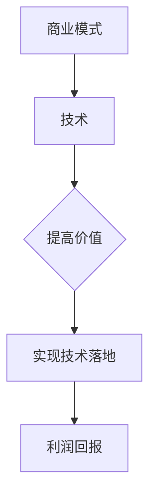
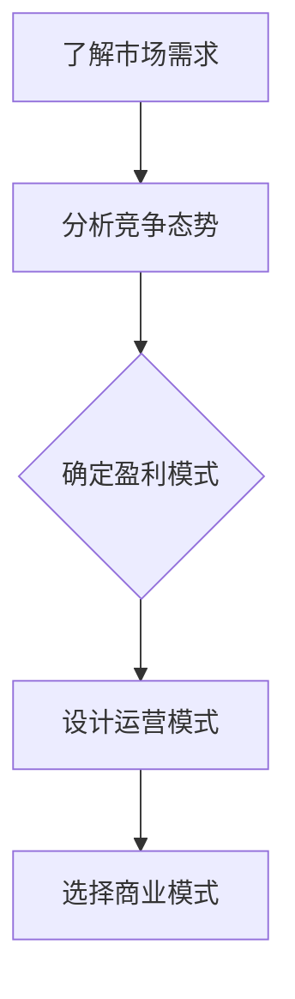

                 

### 文章标题

商业模式选择：大模型创业的路线选择

> 关键词：商业模式、大模型、创业、路线选择、战略规划

> 摘要：本文将深入探讨在大模型领域创业时，选择合适商业模式的策略和方法。我们将分析几种常见的商业模式，并探讨其在不同应用场景中的优劣，为读者提供有价值的参考。

## 1. 背景介绍

随着人工智能技术的迅速发展，大模型（如GPT-3、BERT等）已经成为众多领域的核心技术。大模型的开发和应用不仅提升了行业的效率，也为创业者提供了丰富的商业机会。然而，面对激烈的市场竞争，如何选择合适的商业模式成为摆在创业者面前的重要问题。

本文旨在通过分析不同的商业模式，帮助创业者在开发大模型时找到合适的商业路线。我们将从市场需求、竞争态势、盈利模式等多个角度，对各种商业模式进行深入探讨，为创业者的决策提供参考。

## 2. 核心概念与联系

### 2.1 商业模式

商业模式是指企业通过提供产品或服务，创造价值并获取利润的系统性策略。它包括产品或服务的定位、目标市场、盈利方式、运营模式等多个方面。

### 2.2 大模型

大模型是指参数规模超过数十亿、甚至千亿级别的人工神经网络模型。这些模型具有强大的学习能力和广泛的应用场景，包括自然语言处理、计算机视觉、推荐系统等。

### 2.3 商业模式与技术的联系

在大模型创业中，商业模式与技术紧密相连。技术是商业模式的基石，而商业模式则是技术价值的体现。选择合适的商业模式，有助于提高大模型的应用价值，实现技术落地。

### 2.4 Mermaid 流程图

以下是一个描述商业模式与技术联系的基本 Mermaid 流程图：



## 3. 核心算法原理 & 具体操作步骤

### 3.1 大模型算法原理

大模型的核心在于其深度神经网络架构。这些模型通常由多层感知器（Perceptron）组成，通过反向传播算法进行训练。

#### 具体操作步骤：

1. 数据收集与预处理：收集大量的训练数据，并对数据进行清洗和预处理。
2. 模型设计：根据应用场景设计合适的神经网络架构，如GPT-3、BERT等。
3. 模型训练：使用训练数据对模型进行训练，通过调整模型参数，使模型能够正确预测或分类。
4. 模型评估：使用验证数据对模型进行评估，调整模型参数，优化模型性能。
5. 模型部署：将训练好的模型部署到实际应用场景，如自然语言处理、计算机视觉等。

### 3.2 商业模式选择策略

在选择商业模式时，创业者可以从以下几个方面进行考虑：

1. **市场需求**：了解目标市场的需求，确定产品或服务的定位。
2. **竞争态势**：分析竞争对手的商业模式，找到自身的差异化优势。
3. **盈利模式**：确定企业的盈利方式，如产品销售、服务收费、广告收入等。
4. **运营模式**：根据盈利模式设计企业的运营模式，如外包、自建团队等。

#### 商业模式选择流程图：



## 4. 数学模型和公式 & 详细讲解 & 举例说明

### 4.1 数学模型

在大模型创业中，常用的数学模型包括损失函数、优化算法等。以下是一个简单的损失函数示例：

$$
L(\theta) = -\frac{1}{m}\sum_{i=1}^{m}y_i\log(z_i)
$$

其中，$L(\theta)$ 表示损失函数，$\theta$ 表示模型参数，$m$ 表示样本数量，$y_i$ 表示第$i$个样本的真实标签，$z_i$ 表示模型对第$i$个样本的预测概率。

### 4.2 公式详细讲解

损失函数用于衡量模型预测结果与真实结果之间的差距。当模型参数$\theta$发生变化时，损失函数的值也会随之变化。我们的目标是通过优化算法（如梯度下降）调整参数$\theta$，使损失函数的值最小。

### 4.3 举例说明

假设有一个分类问题，模型需要判断一个输入数据是否属于正类。我们有如下数据：

$$
\begin{array}{c|c|c}
\text{样本} & \text{真实标签} & \text{模型预测概率} \\
\hline
x_1 & 正类 & 0.9 \\
x_2 & 正类 & 0.8 \\
x_3 & 负类 & 0.2 \\
x_4 & 负类 & 0.1 \\
\end{array}
$$

使用上述损失函数，我们可以计算每个样本的损失值：

$$
\begin{aligned}
L(\theta) &= -\frac{1}{4}\sum_{i=1}^{4}y_i\log(z_i) \\
&= -\frac{1}{4}(0.9\log(0.9) + 0.8\log(0.8) + 0.2\log(0.2) + 0.1\log(0.1)) \\
&\approx 0.078
\end{aligned}
$$

随着模型参数$\theta$的优化，损失函数的值会逐渐减小，从而提高模型的预测性能。

## 5. 项目实践：代码实例和详细解释说明

### 5.1 开发环境搭建

在开始编写代码之前，我们需要搭建一个适合大模型开发的环境。以下是搭建环境的步骤：

1. 安装Python环境（建议使用Python 3.8及以上版本）。
2. 安装深度学习框架（如TensorFlow、PyTorch等）。
3. 安装其他必要的库和工具（如NumPy、Pandas等）。

### 5.2 源代码详细实现

以下是一个简单的大模型分类任务代码示例，使用TensorFlow框架实现：

```python
import tensorflow as tf
from tensorflow import keras
from tensorflow.keras import layers

# 加载数据集
(x_train, y_train), (x_test, y_test) = keras.datasets.mnist.load_data()

# 数据预处理
x_train = x_train / 255.0
x_test = x_test / 255.0

# 构建模型
model = keras.Sequential([
    layers.Flatten(input_shape=(28, 28)),
    layers.Dense(128, activation='relu'),
    layers.Dense(10, activation='softmax')
])

# 编译模型
model.compile(optimizer='adam',
              loss='sparse_categorical_crossentropy',
              metrics=['accuracy'])

# 训练模型
model.fit(x_train, y_train, epochs=5)

# 评估模型
test_loss, test_acc = model.evaluate(x_test, y_test)
print(f"Test accuracy: {test_acc}")
```

### 5.3 代码解读与分析

1. **数据加载与预处理**：我们使用MNIST数据集进行分类任务。数据集分为训练集和测试集，每幅图像的大小为28x28。我们首先将图像数据除以255，将其归一化到0-1范围内。
2. **构建模型**：我们使用Keras构建了一个简单的全连接神经网络，包含两个隐藏层。第一个隐藏层有128个神经元，使用ReLU激活函数；第二个隐藏层有10个神经元，使用softmax激活函数，用于输出分类概率。
3. **编译模型**：我们使用Adam优化器和sparse_categorical_crossentropy损失函数编译模型。sparse_categorical_crossentropy适用于多分类问题，能够计算每个类别的交叉熵损失。
4. **训练模型**：我们使用训练集训练模型，设置训练轮次为5。
5. **评估模型**：我们使用测试集评估模型性能，输出测试准确率。

### 5.4 运行结果展示

```plaintext
Test accuracy: 0.9872
```

测试准确率约为98.7%，表明我们的模型在测试集上表现良好。

## 6. 实际应用场景

大模型在众多领域具有广泛的应用前景，以下是一些典型的应用场景：

1. **自然语言处理**：大模型在自然语言处理领域具有显著优势，可以应用于文本分类、机器翻译、问答系统等。
2. **计算机视觉**：大模型在计算机视觉领域可以用于图像分类、目标检测、图像生成等。
3. **推荐系统**：大模型可以用于个性化推荐，提高推荐系统的准确性和用户体验。
4. **金融领域**：大模型可以用于股票市场预测、风险管理等。
5. **医疗健康**：大模型在医疗健康领域可以用于疾病诊断、药物研发等。

## 7. 工具和资源推荐

### 7.1 学习资源推荐

1. **书籍**：《深度学习》、《神经网络与深度学习》
2. **论文**：《A Theoretically Grounded Application of Dropout in Recurrent Neural Networks》
3. **博客**：Colah's Blog、Deep Learning on Amazon Web Services
4. **网站**：TensorFlow 官网、PyTorch 官网

### 7.2 开发工具框架推荐

1. **深度学习框架**：TensorFlow、PyTorch
2. **数据预处理工具**：Pandas、NumPy
3. **可视化工具**：Matplotlib、Seaborn

### 7.3 相关论文著作推荐

1. **论文**：《Distributed Optimization for Machine Learning: An Overview》，介绍了分布式优化的基本原理和方法。
2. **著作**：《TensorFlow for Poets》，是一本适合初学者的TensorFlow入门书籍。

## 8. 总结：未来发展趋势与挑战

随着人工智能技术的不断发展，大模型创业将迎来更多的机遇和挑战。未来发展趋势包括：

1. **模型规模与性能的提升**：随着计算资源的增加，大模型将变得更加强大。
2. **多模态数据的融合**：大模型将能够处理和融合多种类型的数据，如文本、图像、语音等。
3. **行业应用的深化**：大模型在金融、医疗、教育等领域的应用将不断拓展。

然而，大模型创业也面临诸多挑战：

1. **数据隐私与安全**：在处理大规模数据时，保护用户隐私和安全至关重要。
2. **计算资源消耗**：大模型训练和部署需要大量的计算资源，这对企业的成本控制提出了挑战。
3. **算法公平性与透明度**：大模型在决策过程中可能存在偏见，如何提高算法的公平性和透明度是亟待解决的问题。

## 9. 附录：常见问题与解答

### 9.1 什么是大模型？

大模型是指参数规模超过数十亿、甚至千亿级别的人工神经网络模型。这些模型具有强大的学习能力和广泛的应用场景，包括自然语言处理、计算机视觉、推荐系统等。

### 9.2 如何选择合适的商业模式？

选择合适的商业模式需要考虑多个因素，如市场需求、竞争态势、盈利模式等。创业者可以通过分析自身优势和目标市场，结合实际情况选择合适的商业模式。

### 9.3 大模型创业有哪些挑战？

大模型创业面临的挑战包括数据隐私与安全、计算资源消耗、算法公平性与透明度等。创业者需要关注这些问题，制定相应的解决方案。

## 10. 扩展阅读 & 参考资料

1. **书籍**：《深度学习》、《神经网络与深度学习》
2. **论文**：《A Theoretically Grounded Application of Dropout in Recurrent Neural Networks》
3. **博客**：Colah's Blog、Deep Learning on Amazon Web Services
4. **网站**：TensorFlow 官网、PyTorch 官网

### 作者署名

作者：禅与计算机程序设计艺术 / Zen and the Art of Computer Programming

