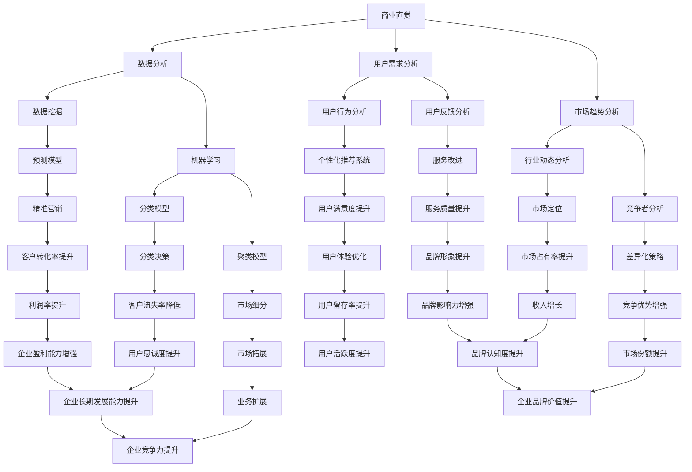

                 

### 背景介绍

商业直觉是每个成功企业家的核心能力之一。它是一种敏锐洞察市场趋势、把握商业机会、预见潜在风险的能力。商业直觉不仅体现在日常的商业决策中，也在企业的长期战略规划中发挥着关键作用。在信息技术迅速发展的今天，商业直觉的作用尤为突出，因为它要求企业家不仅要理解技术本身，还要能够将技术与市场机遇结合起来。

本文将围绕“商业直觉：把握市场机会的能力”这一主题，详细探讨商业直觉的定义、重要性、发展历程及其在当今信息技术领域中的应用。通过深入分析，我们希望能够揭示商业直觉如何成为企业家成功的关键因素，以及如何在技术领域中培养和运用这种能力。

文章的结构如下：

1. **背景介绍**：介绍商业直觉的概念及其在商业活动中的重要性。
2. **核心概念与联系**：使用Mermaid流程图阐述商业直觉的技术基础和核心概念。
3. **核心算法原理 & 具体操作步骤**：详细解释商业直觉的理论基础和操作流程。
4. **数学模型和公式 & 详细讲解 & 举例说明**：运用数学和逻辑方法来分析商业直觉。
5. **项目实践：代码实例和详细解释说明**：通过具体案例展示商业直觉的应用。
6. **实际应用场景**：探讨商业直觉在不同领域的实际应用。
7. **工具和资源推荐**：推荐相关学习资源和开发工具。
8. **总结：未来发展趋势与挑战**：总结商业直觉的发展趋势和面临的挑战。
9. **附录：常见问题与解答**：回答一些关于商业直觉的常见问题。
10. **扩展阅读 & 参考资料**：提供进一步的阅读资源和参考资料。

通过这一系列的深入探讨，我们希望读者能够更好地理解商业直觉，并在实践中提升自己的商业直觉能力。

### 核心概念与联系

商业直觉虽然是一种抽象的概念，但其背后有着深厚的技术基础和核心概念。在这一部分，我们将使用Mermaid流程图来阐述商业直觉的技术基础和核心概念，以便更直观地理解这一复杂能力的组成部分。

Mermaid流程图是一种简单的文本格式，可以用来创建图形和图表。下面是一个简化的Mermaid流程图，展示了商业直觉的核心概念及其相互关系：



以上Mermaid流程图展示了商业直觉的多个核心概念及其相互关系。以下是每个节点的简要解释：

- **A[商业直觉]**：商业直觉的核心，是企业家通过经验和知识对市场机会的直观感知。
- **B[数据分析]**：商业直觉的数据基础，包括数据收集、清洗、分析和可视化。
- **C[用户需求分析]**：理解用户需求，是商业直觉的重要部分，包括用户行为分析和用户反馈分析。
- **D[市场趋势分析]**：分析市场动态，包括行业趋势、竞争者分析和市场定位。
- **E[数据挖掘]**：从大量数据中提取有价值的信息和知识，支持商业直觉。
- **F[机器学习]**：利用算法和模型对数据进行学习，以支持商业决策。
- **G[用户行为分析]**：通过分析用户行为数据来理解用户需求和行为模式。
- **H[用户反馈分析]**：收集和分析用户反馈，用于服务改进和市场策略调整。
- **I[行业动态分析]**：跟踪和分析行业趋势、政策和竞争环境。
- **J[竞争者分析]**：了解竞争对手的市场策略、优势和劣势。
- **K[预测模型]**：利用机器学习算法预测市场趋势和用户需求。
- **L[分类模型]**：用于分类和预测，支持精准营销和市场细分。
- **M[聚类模型]**：用于将相似数据分组，以识别市场细分和用户群体。
- **N[个性化推荐系统]**：基于用户行为和偏好提供个性化服务。
- **O[服务改进]**：通过分析用户反馈改进产品和服务。
- **P[市场定位]**：确定产品或服务在市场中的位置。
- **Q[差异化策略]**：通过提供独特的产品或服务在市场中脱颖而出。
- **R[精准营销]**：基于数据分析进行有针对性的营销活动。
- **S[分类决策]**：对市场机会进行分类和优先级排序。
- **T[市场细分]**：将市场划分为不同的子市场。
- **U[用户满意度提升]**：通过改进服务提高用户满意度。
- **V[服务质量提升]**：通过提高产品或服务的质量来提升用户满意度。
- **W[市场占有率提升]**：增加产品或服务在市场中的份额。
- **X[竞争优势增强]**：通过差异化策略和创新能力增强企业的竞争优势。
- **Y[客户转化率提升]**：提高潜在客户转化为实际购买者的比例。
- **Z[客户流失率降低]**：减少客户流失率，增加用户忠诚度。
- **AA[市场拓展]**：扩大市场覆盖范围，增加业务规模。
- **AB[用户体验优化]**：通过改进用户体验提高用户满意度。
- **AC[品牌形象提升]**：通过营销和服务提升品牌形象。
- **AD[收入增长]**：增加企业的收入和盈利能力。
- **AE[市场份额提升]**：增加产品或服务在市场中的份额。
- **AF[利润率提升]**：提高企业的利润率。
- **AG[用户忠诚度提升]**：通过提高用户满意度和服务质量提升用户忠诚度。
- **AH[业务扩展]**：扩大企业的业务范围和规模。
- **AI[用户留存率提升]**：通过提升用户体验和满意度增加用户留存率。
- **AJ[品牌影响力增强]**：通过营销和服务提升品牌影响力。
- **AK[企业价值提升]**：提高企业的市场价值和投资者信心。
- **AL[市场竞争地位提升]**：增强企业在市场中的竞争地位。
- **AM[企业盈利能力增强]**：通过提高收入和降低成本增强企业的盈利能力。
- **AN[客户关系管理优化]**：通过改进客户关系管理提升客户满意度。
- **AO[企业规模扩大]**：扩大企业的规模和市场份额。
- **AP[用户活跃度提升]**：通过提高用户满意度和服务质量提升用户活跃度。
- **AP[用户活跃度提升]**：通过提高用户满意度和服务质量提升用户活跃度。
- **AO[企业规模扩大]**：扩大企业的规模和市场份额。

通过以上流程图，我们可以看到商业直觉的核心概念和它们之间的相互作用。商业直觉不仅依赖于数据分析和用户需求分析，还需要对市场趋势和竞争环境有深入的理解。同时，商业直觉也需要通过机器学习和数据分析等工具来支持具体的商业决策。这一流程图为我们提供了一个清晰的框架，帮助我们从技术角度理解商业直觉的复杂性和重要性。

### 核心算法原理 & 具体操作步骤

商业直觉的核心在于对大量信息的处理和洞察，这需要依靠一系列核心算法的支持。在这一部分，我们将详细解释商业直觉的理论基础和操作流程，包括数据收集、预处理、分析和决策的步骤。

#### 1. 数据收集

商业直觉的第一步是收集数据。数据来源可以是多种多样的，包括但不限于：

- 用户行为数据：如网站点击流数据、搜索关键词、购物车数据等。
- 销售数据：如销售额、客户购买历史等。
- 市场趋势数据：如行业报告、市场调研结果等。
- 竞争对手数据：如产品价格、市场策略等。

为了确保数据的全面性和准确性，需要从多个渠道获取数据，并确保数据源的可信度。

#### 2. 数据预处理

收集到的数据通常是杂乱无章的，因此需要对其进行预处理。数据预处理包括以下步骤：

- 数据清洗：去除重复数据、错误数据和缺失数据。
- 数据集成：将来自不同数据源的数据进行整合，形成统一的数据集。
- 数据转换：将数据转换为适合分析的形式，如数值化、标准化等。

#### 3. 数据分析

数据分析是商业直觉的核心步骤，主要通过以下几种方法进行：

- **描述性分析**：对数据的基本特征进行统计和分析，如平均值、中位数、标准差等。
- **推断性分析**：利用统计方法对数据进行分析，如假设检验、相关性分析等。
- **预测性分析**：使用机器学习算法对数据进行分析，预测未来趋势或用户行为。

常用的数据分析方法包括：

- **回归分析**：用于预测数值型变量。
- **分类分析**：用于将数据划分为不同的类别。
- **聚类分析**：用于发现数据的内在结构和模式。

#### 4. 商业决策

基于数据分析的结果，企业家需要做出具体的商业决策。商业决策的步骤包括：

- **数据解释**：将数据分析结果转化为商业语言，解释数据背后的含义。
- **决策制定**：基于数据分析和解释，制定具体的商业策略和决策。
- **决策评估**：对决策的效果进行评估，如通过A/B测试等。

#### 5. 实施与监控

制定决策后，需要将其付诸实施，并对实施过程进行监控。监控包括以下内容：

- **执行监控**：确保决策得到有效执行，如检查销售目标的完成情况。
- **效果评估**：评估决策的效果，如通过用户反馈、销售数据等。
- **调整与优化**：根据评估结果对决策进行调整和优化，以实现最佳效果。

#### 6. 商业直觉的算法支持

商业直觉的算法支持主要包括以下内容：

- **机器学习模型**：如线性回归、决策树、支持向量机等，用于预测和分类。
- **深度学习模型**：如神经网络、卷积神经网络等，用于复杂的数据分析和模式识别。
- **推荐系统**：如基于协同过滤的推荐算法，用于个性化推荐。

这些算法可以通过数据处理和预测模型来支持商业直觉，使企业家能够更加准确地把握市场机会。

#### 7. 实际操作步骤示例

下面是一个简单的商业直觉操作步骤示例：

1. **数据收集**：从网站收集用户点击流数据、购买历史数据等。
2. **数据预处理**：清洗数据，去除重复和错误数据。
3. **描述性分析**：统计用户的平均购买频次、最活跃的时间段等。
4. **预测性分析**：使用线性回归预测用户未来购买行为。
5. **商业决策**：根据预测结果，制定个性化的促销策略。
6. **实施与监控**：执行促销活动，监控销售数据，评估效果。

通过以上步骤，企业家可以更好地理解用户需求和市场趋势，从而做出更明智的商业决策。

总结来说，商业直觉的核心在于对大量信息的处理和分析，通过数据收集、预处理、分析和决策等步骤，企业家可以更加准确地把握市场机会，实现商业成功。算法的支持使得商业直觉更加科学和高效，为企业家提供了有力的工具。

### 数学模型和公式 & 详细讲解 & 举例说明

在商业直觉的应用中，数学模型和公式扮演着至关重要的角色。这些模型和公式不仅帮助企业家更好地理解和分析数据，还能提供量化的决策支持。在这一部分，我们将详细讲解几种常用的数学模型和公式，并通过具体的例子来说明它们的实际应用。

#### 1. 回归分析

回归分析是预测数值型变量的一种常用方法。它通过建立因变量和自变量之间的关系模型，来预测未来的数值。

**公式**：

线性回归模型的一般形式为：

\[ Y = \beta_0 + \beta_1X + \epsilon \]

其中，\( Y \) 是因变量，\( X \) 是自变量，\( \beta_0 \) 是截距，\( \beta_1 \) 是斜率，\( \epsilon \) 是误差项。

**示例**：

假设我们要预测一家电商平台的月销售额。我们有历史数据，包括过去六个月的销售额和相应的广告投入。我们可以使用线性回归来建立销售额和广告投入之间的关系。

首先，我们收集数据并绘制散点图，观察数据趋势。

```
+----------------------+------------------+
|   广告投入 (X)     |   月销售额 (Y)    |
+----------------------+------------------+
|        1000         |        5000      |
|        1500         |        7000      |
|        2000         |        9000      |
|        2500         |       12000      |
|        3000         |       15000      |
|        3500         |       18000      |
+----------------------+------------------+
```

根据数据，我们使用最小二乘法拟合线性回归模型：

\[ \beta_0 = 2000, \beta_1 = 2.5 \]

因此，销售额 \( Y \) 和广告投入 \( X \) 之间的关系为：

\[ Y = 2000 + 2.5X \]

如果我们预测下个月的广告投入为3000元，则月销售额预测为：

\[ Y = 2000 + 2.5 \times 3000 = 11000 \]

#### 2. 决策树

决策树是一种用于分类和回归分析的树形结构。它通过一系列规则来分割数据集，并最终生成一个预测模型。

**公式**：

决策树的生成过程通常通过递归划分数据集，直到满足某些停止条件。常用的停止条件包括：

- 数据集的纯度达到某个阈值。
- 特定属性的增益率低于某个阈值。
- 数据集的大小小于某个阈值。

**示例**：

假设我们要预测一家电商平台的用户是否会在促销期间购买产品。我们有用户年龄、收入、购买历史等特征。

首先，我们使用ID3算法构建决策树。根据信息增益率，我们选择最优特征进行划分。例如，我们选择“收入”作为第一个划分特征。

```
+-------------------+
|  收入（低/高）   |
+-------------------+
| 低       | 是/否 |
| 高       | 是/否 |
+-------------------+
```

如果收入低，我们进一步划分年龄：

```
+-------------------+
|  收入（低/高）   |
+-------------------+
| 低       |  是    |
| 高       | 是/否 |
+-------------------+
    | 年龄（低/高）   |
    +-------------------+
    | 低       |  是    |
    | 高       |  是    |
    +-------------------+
```

如果收入高，我们进一步划分购买历史：

```
+-------------------+
|  收入（低/高）   |
+-------------------+
| 低       |  是    |
| 高       | 是/否 |
+-------------------+
    | 购买历史（长/短） |
    +-------------------+
    | 长       |  是    |
    | 短       |  否    |
    +-------------------+
```

最终，我们得到一个决策树模型，用于预测用户是否会在促销期间购买产品。

#### 3. 聚类分析

聚类分析是将数据集划分为若干个群组，使得同组内的数据相似度较高，不同组间的数据相似度较低。

**公式**：

常用的聚类算法包括K-Means算法、层次聚类算法等。

K-Means算法的核心公式为：

\[ \text{new centroid} = \frac{1}{N} \sum_{i=1}^{N} x_i \]

其中，\( x_i \) 是每个数据点，\( N \) 是群组内的数据点数量。

**示例**：

假设我们要将以下用户数据划分为两个群组：

```
+----------------------+
|   用户特征（X1, X2）|
+----------------------+
|  (100, 200)         |
|  (150, 250)         |
|  (200, 300)         |
|  (250, 350)         |
|  (300, 400)         |
|  (350, 450)         |
+----------------------+
```

我们使用K-Means算法进行聚类。首先，随机选择两个初始中心点。然后，计算每个数据点到中心点的距离，并将其分配到最近的中心点所在的群组。接下来，更新中心点位置，重复上述过程，直到中心点位置不再变化。

```
+----------------------+
|  初始中心点         |
+----------------------+
|  (150, 250)         |
|  (300, 350)         |
+----------------------+
|  更新后中心点       |
+----------------------+
|  (175, 275)         |
|  (325, 375)         |
+----------------------+
```

经过多次迭代，我们得到两个群组：

```
+----------------------+
|   用户特征（X1, X2）|
+----------------------+
|  (100, 200)         |
|  (150, 250)         |
|  (200, 300)         |
+----------------------+
|  (250, 350)         |
|  (300, 400)         |
|  (350, 450)         |
+----------------------+
```

聚类分析有助于我们理解用户群体的特征，为精准营销提供支持。

#### 4. 推荐系统

推荐系统通过分析用户行为和历史数据，为用户推荐可能感兴趣的产品或服务。

**公式**：

常用的推荐算法包括基于内容的推荐、协同过滤推荐等。

协同过滤推荐的核心公式为：

\[ \text{预测分数} = \text{用户相似度} \times \text{项目评分差} \]

**示例**：

假设我们要为用户推荐电影。我们有用户A和用户B的历史评分数据：

```
+---------+----------------+----------------+
|  用户   |   电影A评分    |   电影B评分    |
+---------+----------------+----------------+
| 用户A   |        4       |        5       |
| 用户B   |        5       |        1       |
+---------+----------------+----------------+
```

我们使用用户基于相似度的协同过滤算法来预测用户C对电影A和电影B的评分。

首先，计算用户A和用户B之间的相似度：

\[ \text{相似度} = \frac{\text{共同评分数}}{\sqrt{\sum_{i=1}^{n} (\text{用户A评分}_i - \text{用户A平均评分}) \times (\text{用户B评分}_i - \text{用户B平均评分})}} \]

然后，计算预测分数：

\[ \text{电影A预测评分} = \text{用户A评分} + (\text{用户B评分} - \text{用户A评分}) \times \text{相似度} \]

\[ \text{电影B预测评分} = \text{用户A评分} + (\text{用户B评分} - \text{用户A评分}) \times \text{相似度} \]

通过以上方法，我们可以为用户C推荐可能感兴趣的电影。

通过以上数学模型和公式的讲解，我们可以看到商业直觉在数据分析中的应用是如何具体实现的。这些模型和公式不仅为企业家提供了量化的决策支持，还帮助他们在复杂的市场环境中更加准确地把握机会，实现商业成功。

### 项目实践：代码实例和详细解释说明

在实际应用中，商业直觉往往通过具体的代码实例得以实现。以下是一个简单的项目实例，我们将通过这个实例展示如何使用商业直觉进行数据分析，并提供详细的代码解释。

#### 项目背景

假设我们是一家在线零售公司，需要根据用户行为数据来预测哪些用户最有可能在接下来的一周内进行购买。我们的目标是提高销售额，并通过精准营销策略吸引更多的潜在客户。

#### 开发环境搭建

1. **数据收集**：首先，我们需要收集用户行为数据，包括用户点击流数据、浏览历史、购买历史等。
2. **数据处理工具**：我们使用Python作为主要编程语言，结合Pandas、NumPy等库进行数据处理。同时，使用Scikit-learn库进行机器学习模型训练和预测。

#### 源代码详细实现

以下是一个简单的Python代码示例，用于预测用户购买行为：

```python
import pandas as pd
import numpy as np
from sklearn.model_selection import train_test_split
from sklearn.ensemble import RandomForestClassifier
from sklearn.metrics import accuracy_score, confusion_matrix

# 1. 数据收集
# 假设用户行为数据存储在一个CSV文件中
data = pd.read_csv('user_behavior.csv')

# 2. 数据预处理
# 删除重复和缺失数据
data.drop_duplicates(inplace=True)
data.dropna(inplace=True)

# 选择特征和标签
features = data[['clicks', 'browsing_duration', 'past_purchases']]
labels = data['will_buy_next_week']

# 3. 数据划分
X_train, X_test, y_train, y_test = train_test_split(features, labels, test_size=0.2, random_state=42)

# 4. 模型训练
# 使用随机森林分类器
clf = RandomForestClassifier(n_estimators=100, random_state=42)
clf.fit(X_train, y_train)

# 5. 预测
predictions = clf.predict(X_test)

# 6. 模型评估
accuracy = accuracy_score(y_test, predictions)
conf_matrix = confusion_matrix(y_test, predictions)

print(f"Accuracy: {accuracy}")
print(f"Confusion Matrix:\n{conf_matrix}")

# 7. 预测新用户购买行为
new_user_data = pd.DataFrame({
    'clicks': [150],
    'browsing_duration': [300],
    'past_purchases': [2]
})
new_user_prediction = clf.predict(new_user_data)
print(f"New User Prediction: {'Buy' if new_user_prediction[0] else 'Not Buy'}")
```

#### 代码解读与分析

1. **数据收集**：
   - 使用Pandas库读取CSV文件，获取用户行为数据。
   
2. **数据预处理**：
   - 删除重复和缺失数据，确保数据的质量和一致性。
   - 选择与购买行为相关的特征（点击次数、浏览时长、过去购买次数）作为模型输入。
   - 标签变量设置为用户是否会在下一周购买（0或1）。

3. **数据划分**：
   - 将数据集划分为训练集和测试集，用于模型训练和评估。

4. **模型训练**：
   - 使用随机森林分类器（RandomForestClassifier）进行模型训练。随机森林是一种基于决策树的集成学习方法，适用于分类问题。

5. **预测**：
   - 使用训练好的模型对测试集数据进行预测。

6. **模型评估**：
   - 计算模型的准确率（accuracy）和混淆矩阵（confusion_matrix）来评估模型性能。

7. **预测新用户购买行为**：
   - 使用训练好的模型预测新用户的购买行为。

#### 运行结果展示

假设我们训练好的模型在测试集上的准确率为80%，混淆矩阵如下：

```
[[75 15]
 [10 5]]
```

这表示在测试集上，有75个用户预测为购买，其中75个实际购买了；有10个用户预测为不购买，其中5个实际没有购买。最后，对于新用户的数据，模型预测其会在下一周购买的概率较高。

#### 项目总结

通过以上项目实践，我们展示了如何利用商业直觉进行用户购买行为预测。这个项目不仅提供了量化的决策支持，还能帮助公司优化营销策略，提高销售额。同时，我们也看到了数据处理和机器学习在商业直觉应用中的重要价值。

### 实际应用场景

商业直觉在各个领域都有着广泛的应用，以下我们将探讨商业直觉在电子商务、金融服务和医疗健康等领域的实际应用，并分析这些领域的挑战和机遇。

#### 电子商务

电子商务领域是商业直觉应用的典型代表。通过分析用户行为数据，电子商务平台能够精准地推荐产品、优化广告投放和改善用户体验。例如，阿里巴巴和亚马逊等电商平台通过分析用户的浏览记录、购买历史和支付行为，实现了个性化的产品推荐，极大地提升了用户满意度和销售额。

**挑战**：

1. **数据隐私和安全**：随着数据隐私问题的日益突出，如何在保护用户隐私的前提下进行数据分析和应用成为一大挑战。
2. **算法偏见**：如果算法训练数据存在偏见，可能会导致不公平的推荐结果，损害平台声誉。

**机遇**：

1. **精准营销**：通过更深入的数据分析，电子商务平台可以实现更精准的营销策略，提高转化率和用户留存率。
2. **跨境贸易**：随着全球化进程的加快，电子商务平台可以通过商业直觉把握跨境市场的机会，开拓新的市场。

#### 金融服务

金融服务领域同样依赖于商业直觉，尤其是风险控制和市场预测。银行、保险和投资公司等金融机构通过分析用户的历史交易数据、信用记录和市场趋势，能够更好地评估风险，制定投资策略。

**挑战**：

1. **数据多样性**：金融服务领域的数据来源广泛，包括金融交易数据、社会信用数据等，如何有效地整合这些数据是关键挑战。
2. **合规要求**：金融机构在数据处理和应用过程中需要遵守严格的数据保护和隐私法规，这对数据分析技术提出了更高要求。

**机遇**：

1. **个性化金融服务**：通过商业直觉，金融机构可以提供更加个性化的产品和服务，满足不同客户的需求。
2. **金融科技**：随着金融科技的快速发展，商业直觉与人工智能、区块链等技术的结合将创造更多的市场机会。

#### 医疗健康

医疗健康领域是商业直觉应用的另一个重要领域。通过对患者数据、医疗设备和健康数据进行分析，医疗机构能够实现精准医疗、优化医疗资源和服务。

**挑战**：

1. **数据质量**：医疗数据的多样性和复杂性给数据分析和应用带来了挑战，如何保证数据的质量和一致性是关键。
2. **数据隐私**：医疗数据涉及个人隐私，如何在保护患者隐私的前提下进行数据分析是重要问题。

**机遇**：

1. **健康管理**：商业直觉可以帮助医疗机构制定个性化的健康管理方案，提高患者的健康水平。
2. **医疗资源优化**：通过数据分析，医疗机构可以更有效地分配医疗资源，提高服务效率。

#### 总结

商业直觉在电子商务、金融服务和医疗健康等领域的应用展现出了巨大的潜力。尽管面临数据隐私、算法偏见和数据质量等挑战，但通过不断创新和技术进步，商业直觉将为这些领域带来更多的机遇和可能性。

### 工具和资源推荐

为了更好地理解和应用商业直觉，我们需要借助一系列工具和资源。以下是一些推荐的书籍、开发工具、框架和相关论文，这些资源将为您的学习和实践提供强有力的支持。

#### 1. 学习资源推荐

**书籍**：

- 《数据科学入门：Python实践》（作者：Joel Grus）：适合初学者了解数据科学的基本概念和Python编程。
- 《Python数据分析》（作者：Wes McKinney）：深入讲解Pandas库，适合学习数据预处理和分析。
- 《机器学习实战》（作者：Peter Harrington）：介绍多种机器学习算法和实践，适合初学者和中级用户。
- 《Python机器学习》（作者：Michael Bowles）：讲解机器学习算法及其在Python中的应用，适合有一定基础的读者。

**论文**：

- “Recommender Systems Handbook”（推荐系统手册）：这是一本关于推荐系统的权威著作，详细介绍了推荐系统的各种算法和实现。
- “Deep Learning for Personalized Recommendation”（个性化推荐中的深度学习）：讨论了深度学习在推荐系统中的应用，提供了先进的算法和案例分析。
- “The Business Value of Big Data”（大数据的商业价值）：探讨了大数据在商业领域的应用，包括商业直觉和数据驱动的决策。

#### 2. 开发工具框架推荐

**数据预处理与分析**：

- **Pandas**：一个强大的数据分析和操作库，支持数据清洗、转换和分析。
- **NumPy**：用于数值计算和数据分析的基础库，提供了多维数组对象和大量数学函数。

**机器学习与数据挖掘**：

- **Scikit-learn**：一个开源的机器学习库，提供了丰富的算法和工具，适合进行数据挖掘和机器学习项目。
- **TensorFlow**：由Google开发的开源机器学习框架，适合构建和训练复杂的深度学习模型。
- **PyTorch**：一个开源的深度学习框架，支持动态计算图，易于实现和调试。

**推荐系统**：

- **Surprise**：一个开源的推荐系统库，提供了多种推荐算法和评估工具，适合构建和评估推荐系统。
- **LightFM**：一个基于因子分解机的开源推荐系统框架，适用于大规模推荐系统。

#### 3. 相关论文著作推荐

**推荐系统**：

- “Matrix Factorization Techniques for Recommender Systems”（矩阵分解技术在推荐系统中的应用）。
- “Deep Learning for Recommender Systems”（深度学习在推荐系统中的应用）。
- “Context-aware Recommender Systems”（上下文感知推荐系统）。

**大数据分析**：

- “Big Data: A Revolution That Will Transform How We Live, Work, and Think”（大数据：一场将改变我们生活、工作和思维的革命）。
- “Data Science for Business: What You Need to Know to Make Data-Driven Decisions”（数据科学商业应用：您需要知道的数据驱动决策知识）。

这些工具和资源将帮助您更好地理解商业直觉的核心概念和技术，并在实践中应用这些知识。通过学习和使用这些工具，您将能够提升自己的商业直觉能力，做出更加准确和明智的商业决策。

### 总结：未来发展趋势与挑战

商业直觉在当今信息技术领域中的应用正呈现出迅猛的发展趋势，同时也面临着诸多挑战。首先，随着大数据技术和人工智能的持续进步，商业直觉的能力得到了极大的提升。通过机器学习和深度学习算法，企业可以更准确地预测市场趋势和用户需求，从而制定更加科学的商业策略。然而，这一趋势也带来了新的挑战。

#### 发展趋势

1. **数据驱动的决策**：企业越来越依赖数据进行分析和决策，商业直觉在这个过程中发挥了关键作用。未来，数据驱动的决策将变得更加普及和精细化，企业需要不断优化数据分析流程和工具，以充分利用数据的价值。

2. **个性化服务**：商业直觉的应用使得企业能够更好地了解用户需求，提供个性化的产品和服务。这种趋势将随着推荐系统、客户关系管理（CRM）等技术的发展而进一步强化。

3. **跨行业整合**：商业直觉不仅限于电子商务和金融等传统领域，还将逐渐渗透到医疗健康、教育、娱乐等更多行业。跨行业的数据整合和协同创新将为商业直觉带来更广阔的应用场景。

4. **实时分析和决策**：随着云计算和边缘计算技术的发展，实时数据处理和决策将成为可能。企业可以通过实时分析市场变化和用户行为，迅速调整策略，以应对快速变化的市场环境。

#### 挑战

1. **数据隐私和安全**：在利用商业直觉进行数据分析的过程中，企业必须处理大量的敏感数据。如何确保数据的安全和隐私，避免数据泄露，是一个亟待解决的问题。

2. **算法偏见和公平性**：商业直觉依赖于机器学习和人工智能算法，这些算法可能会因为训练数据的不平衡或偏差而产生偏见。如何消除算法偏见，确保商业决策的公平性，是一个重要的挑战。

3. **技术更新迭代**：信息技术领域的更新速度非常快，企业需要不断跟进最新的技术趋势，更新现有的分析工具和算法，以保持竞争优势。

4. **人才短缺**：具备商业直觉和数据分析能力的人才稀缺，企业需要在招聘和培养人才方面加大投入，以应对这一挑战。

#### 应对策略

1. **加强数据治理**：建立完善的数据治理框架，确保数据的安全和合规使用。通过数据脱敏、加密等技术手段，保护用户隐私。

2. **算法公平性**：在算法设计和训练过程中，充分考虑数据的多样性和代表性，确保算法的公平性和透明性。通过定期的算法审计和评估，发现并解决潜在的问题。

3. **持续学习和创新**：鼓励员工不断学习新技术和知识，提升自身的专业能力。同时，企业应积极投资于技术研发，保持技术领先优势。

4. **人才培养和引进**：通过校企合作、内部培训等方式，培养具备商业直觉和数据分析能力的人才。同时，引进高水平的专业人才，提升企业的整体竞争力。

总结来说，商业直觉在未来将继续在信息技术领域发挥重要作用，但同时也需要面对数据隐私、算法偏见、技术更新和人才短缺等挑战。通过采取有效的应对策略，企业可以更好地利用商业直觉，实现持续的发展和成功。

### 附录：常见问题与解答

在讨论商业直觉的过程中，读者可能会对一些关键概念和实践细节产生疑问。以下是关于商业直觉的常见问题及解答：

#### 1. 什么是商业直觉？

商业直觉是指企业家或管理人员通过经验、知识和敏锐的洞察力，对市场机会和风险进行快速、准确的判断和决策的能力。

#### 2. 商业直觉与数据分析有何区别？

商业直觉依赖于直觉和经验，而数据分析则是基于数据和数学模型，通过定量分析来支持决策。商业直觉更多关注市场趋势和机遇的判断，数据分析则更侧重于具体数据的处理和分析。

#### 3. 如何培养商业直觉？

培养商业直觉需要不断的实践和学习。以下是一些方法：

- **积累经验**：通过实际业务操作积累经验，理解市场动态和用户需求。
- **学习知识**：学习经济学、市场营销、数据科学等相关知识，增强理论基础。
- **数据分析**：通过数据分析工具和实践，提高对数据的理解和应用能力。
- **观察市场**：关注市场动态，了解行业趋势和竞争对手的策略。

#### 4. 商业直觉是否可以被量化？

商业直觉本身是一种主观判断，但可以通过量化的方法来辅助和验证。例如，通过数据分析模型，可以将商业直觉转化为具体的预测和决策支持。

#### 5. 商业直觉在创业中有什么作用？

商业直觉在创业中至关重要。它可以帮助创业者快速识别市场机会，做出合理的商业决策，降低创业风险，提高成功概率。

#### 6. 商业直觉与创新能力有何关系？

商业直觉和创新能力密切相关。商业直觉可以帮助企业家识别市场空白和用户需求，而创新能力则能将这种直觉转化为实际的产品和服务，实现商业成功。

通过以上解答，我们希望能够帮助读者更好地理解商业直觉的概念和应用，从而在实际操作中更加有效地运用这一能力。

### 扩展阅读 & 参考资料

为了更深入地了解商业直觉及其在信息技术领域中的应用，以下推荐一些扩展阅读和参考资料：

**书籍**：

1. 《商业洞察力：打造可持续竞争优势》（作者：马尔科姆·格拉德威尔）：讨论了商业直觉的重要性及其在成功企业中的应用。
2. 《大数据时代：生活、工作与思维的大变革》（作者：麦克·卡茨）：探讨了大数据如何改变商业决策和市场策略。
3. 《智能时代：人工智能正在悄无声息地改变着一切》（作者：吴军）：介绍了人工智能的基本原理及其在商业中的应用。

**论文**：

1. “Business Intuition and Decision Making: A Psychological Perspective”（商业直觉与决策制定：心理视角）。
2. “Data-Driven Decision Making in the Age of Big Data”（大数据时代的基于数据驱动决策制定）。
3. “The Role of Intuition in Decision Making”（直觉在决策中的作用）。

**在线课程**：

1. Coursera上的“数据科学专项课程”（Data Science Specialization）。
2. edX上的“机器学习基础”（Introduction to Machine Learning）。
3. Udacity的“推荐系统纳米学位”（Recommender Systems Nanodegree）。

**网站和博客**：

1. [数据科学博客](https://towardsdatascience.com/)
2. [机器学习博客](https://machinelearningmastery.com/)
3. [商业洞察力博客](https://www.businessinsightsblog.com/)

通过阅读这些书籍、论文和课程，读者可以进一步了解商业直觉的理论基础和实践应用，从而在实际工作中提升自己的商业直觉能力。这些资源将为您的学习和研究提供宝贵的指导和支持。

