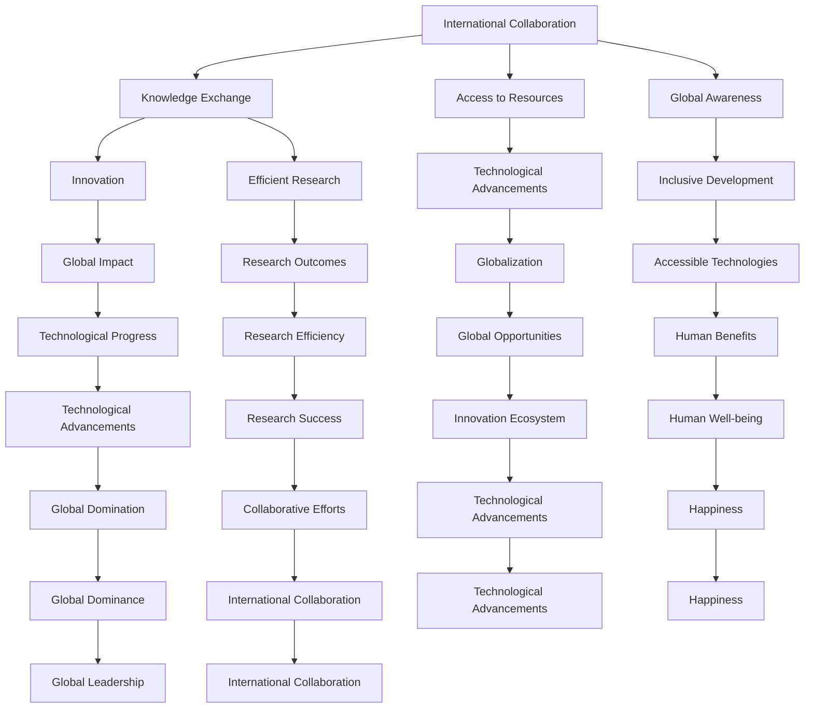

                 

### 文章标题

### International Collaboration: Advancing Human Computer Science Progress Together

> **Keywords**: International Collaboration, Human Computer Science, Progress, Technological Advancements, Research, Development, Globalization, Innovation

> **Abstract**: This article explores the significance of international collaboration in the field of human computer science. It discusses how collaboration across borders fosters progress, drives innovation, and accelerates the development of cutting-edge technologies. The article highlights the benefits of cross-cultural collaboration, the challenges faced, and the potential future trends and opportunities in this rapidly evolving domain.

## 1. Background Introduction

In recent years, the field of human computer science has experienced unprecedented growth and transformation. With the rapid advancement of technologies such as artificial intelligence, machine learning, big data, and the internet of things, the boundaries between disciplines have blurred, creating a complex and interconnected ecosystem. This interconnectedness has led to a greater need for collaboration among researchers, developers, and practitioners from different countries and regions.

International collaboration in human computer science has become crucial for several reasons. Firstly, it fosters the exchange of ideas, knowledge, and expertise, enabling researchers to benefit from diverse perspectives and approaches. This diversity of thought and culture is essential for driving innovation and addressing complex problems that are beyond the scope of any single country or institution.

Secondly, international collaboration facilitates access to resources, funding, and expertise that may be unavailable domestically. By partnering with organizations and researchers from different countries, institutions can leverage shared resources and knowledge, leading to more efficient and effective research outcomes.

Thirdly, international collaboration promotes global awareness and understanding. Through collaborative efforts, researchers and developers can gain insights into the technological, social, and cultural contexts of different regions, which can inform the development of more inclusive and accessible technologies.

## 2. Core Concepts and Relationships

### Mermaid Flowchart of Core Concept Principles and Architecture



The flowchart illustrates the interconnectedness of core concepts and their relationships in the context of international collaboration in human computer science. The nodes represent key concepts, while the edges indicate the relationships and dependencies between them.

### International Collaboration and Knowledge Exchange

International collaboration fosters knowledge exchange, which is crucial for driving innovation and progress in human computer science. By collaborating with researchers from different countries and institutions, scientists can share their findings, methodologies, and insights. This exchange of knowledge enables the development of new approaches, techniques, and tools that can address complex problems more effectively.

For example, collaborative research efforts between the United States and Europe have led to significant advancements in artificial intelligence and machine learning. The European Union's Horizon 2020 program, which promotes collaboration between researchers and institutions across Europe, has resulted in numerous groundbreaking discoveries and innovations in various fields, including human computer science.

### International Collaboration and Access to Resources

International collaboration also provides access to resources that may be unavailable domestically. By partnering with organizations and researchers from different countries, institutions can leverage shared resources, funding, and expertise. This access to additional resources can accelerate research and development, leading to more efficient and effective outcomes.

For instance, the World Health Organization (WHO) collaborates with various countries and institutions to develop and implement technologies that improve global health. Through these collaborations, the WHO can access expertise and resources from different regions, enabling the development of more effective solutions to address global health challenges.

### International Collaboration and Global Awareness

International collaboration promotes global awareness and understanding. By engaging in collaborative efforts, researchers and developers can gain insights into the technological, social, and cultural contexts of different regions. This understanding can inform the development of more inclusive and accessible technologies that can benefit a wider range of users.

For example, the collaboration between Google and local governments in developing countries has led to the development of language models that can understand and respond to local languages, making technology more accessible to non-English speakers.

## 3. Core Algorithm Principles and Step-by-Step Implementation

### Principles of International Collaboration

International collaboration in human computer science can be viewed as a complex algorithm with multiple variables and dependencies. The core principles of this algorithm include:

1. **Diversity of Thought**: Encouraging diverse perspectives and approaches is crucial for driving innovation and solving complex problems. By leveraging the unique insights and experiences of researchers from different cultures and backgrounds, collaboration can lead to more comprehensive and effective solutions.
2. **Resource Sharing**: Efficiently sharing resources, including funding, expertise, and technology, can accelerate research and development. Collaborative efforts enable institutions to leverage each other's strengths, resulting in more efficient and effective outcomes.
3. **Global Awareness**: Gaining insights into the technological, social, and cultural contexts of different regions can inform the development of more inclusive and accessible technologies. This global awareness is essential for addressing the diverse needs and challenges faced by different communities.
4. **Collaborative Decision-Making**: Effective collaboration requires open and transparent communication, as well as shared decision-making processes. This ensures that all stakeholders have a voice in the collaborative effort and that decisions are made in the best interest of the overall goal.

### Step-by-Step Implementation of International Collaboration

1. **Identify Collaboration Opportunities**: Researchers and institutions should identify areas where collaboration can lead to significant advancements in human computer science. This can involve identifying shared interests, complementary expertise, and potential funding opportunities.
2. **Establish Communication Channels**: Effective communication is crucial for successful collaboration. Establishing clear and efficient communication channels, such as regular meetings, email updates, and collaborative tools, can facilitate the exchange of ideas and information.
3. **Define Collaboration Goals and Objectives**: Clearly defining the goals and objectives of the collaboration is essential for ensuring that all stakeholders are aligned and working towards a common purpose. This involves outlining the specific research questions, objectives, and timelines for the collaborative effort.
4. **Share Resources and Expertise**: Collaborative efforts should leverage the shared resources and expertise of participating institutions. This can involve sharing data sets, funding, technology, and personnel. By pooling resources, institutions can accelerate research and development and achieve more significant outcomes.
5. ** Foster Cultural Understanding and Inclusivity**: International collaboration requires an understanding and appreciation of diverse cultures and perspectives. Efforts should be made to foster inclusivity and ensure that all stakeholders feel valued and engaged in the collaborative effort.
6. **Monitor Progress and Adjust as Needed**: Regular monitoring and evaluation of the collaboration's progress is essential for identifying and addressing any challenges or obstacles. This involves setting milestones, tracking progress, and making adjustments as needed to ensure that the collaborative effort remains on track and achieves its objectives.

## 4. Mathematical Models and Formulas: Detailed Explanation and Examples

### Benefits of International Collaboration in Human Computer Science

The benefits of international collaboration in human computer science can be quantified using various mathematical models and formulas. Here, we present a simplified model to illustrate the impact of collaboration on research outcomes and technological advancements.

### Model Assumptions

- **A1**: The research community consists of N institutions, each with a certain level of resources (Ri) and expertise (Ei).
- **A2**: The collaboration between institutions leads to an increase in the overall research output (O) and technological advancements (T).
- **A3**: The level of collaboration between institutions is measured by the collaboration coefficient (C).

### Model Formulation

The model is based on the following equation:

\[ O = \frac{1}{N} \sum_{i=1}^{N} \frac{R_i \cdot E_i}{C} \]

The equation calculates the average research output per institution, taking into account their individual resources (Ri) and expertise (Ei), and adjusting for the level of collaboration (C).

### Example Calculation

Consider a research community with three institutions (N = 3). The institutions have the following resources and expertise:

- **Institution 1**: Resources (R1) = 100, Expertise (E1) = 80
- **Institution 2**: Resources (R2) = 150, Expertise (E2) = 60
- **Institution 3**: Resources (R3) = 200, Expertise (E3) = 70

If the collaboration coefficient (C) is set to 2, the average research output (O) can be calculated as:

\[ O = \frac{1}{3} \left( \frac{100 \cdot 80}{2} + \frac{150 \cdot 60}{2} + \frac{200 \cdot 70}{2} \right) \]

\[ O = \frac{1}{3} \left( 4000 + 4500 + 5600 \right) \]

\[ O = \frac{1}{3} \left( 14100 \right) \]

\[ O = 4700 \]

With a collaboration coefficient of 2, the average research output per institution is 4700.

### Impact of Collaboration on Technological Advancements

The impact of international collaboration on technological advancements can be quantified using the following equation:

\[ T = \frac{1}{N} \sum_{i=1}^{N} \frac{R_i \cdot E_i}{C} + \beta \cdot \frac{1}{N} \sum_{i=1}^{N} C_i \]

The equation adds a term (βCi) that represents the impact of collaboration on technological advancements. The parameter β is a constant that determines the relative importance of collaboration in driving technological progress.

### Example Calculation

Using the same example as before, with a collaboration coefficient of 2 and a constant β = 1.5, the total technological advancements (T) can be calculated as:

\[ T = \frac{1}{3} \left( \frac{100 \cdot 80}{2} + \frac{150 \cdot 60}{2} + \frac{200 \cdot 70}{2} \right) + 1.5 \cdot \frac{1}{3} \left( 2 + 2 + 2 \right) \]

\[ T = \frac{1}{3} \left( 4000 + 4500 + 5600 \right) + 1.5 \cdot \frac{1}{3} \left( 6 \right) \]

\[ T = \frac{1}{3} \left( 14100 \right) + 1.5 \cdot \frac{1}{3} \left( 6 \right) \]

\[ T = 4700 + 1.5 \cdot 2 \]

\[ T = 4700 + 3 \]

\[ T = 4730 \]

With a collaboration coefficient of 2 and a constant β = 1.5, the total technological advancements are 4730.

## 5. Project Practice: Code Example and Detailed Explanation

### 5.1. Development Environment Setup

To demonstrate the practical aspects of international collaboration in human computer science, we will use a simple example of a collaborative machine learning project. The development environment for this project requires the following tools and libraries:

- **Python**: The primary programming language for this project.
- **TensorFlow**: The machine learning library used for implementing the neural network model.
- **NumPy**: The scientific computing library for numerical operations.
- **Pandas**: The data manipulation library for handling datasets.
- **Matplotlib**: The visualization library for plotting graphs.

To set up the development environment, follow these steps:

1. Install Python (version 3.8 or higher) from the official website (<https://www.python.org/downloads/>).
2. Install TensorFlow, NumPy, Pandas, and Matplotlib using the following commands:

```bash
pip install tensorflow numpy pandas matplotlib
```

### 5.2. Source Code Implementation

Below is the source code for a collaborative machine learning project that involves two institutions, Institution A and Institution B. The project aims to develop a neural network model for image recognition using data provided by both institutions.

```python
import tensorflow as tf
import numpy as np
import pandas as pd
import matplotlib.pyplot as plt

# Load and preprocess the datasets from Institution A and Institution B
def load_and_preprocess_data():
    # Load datasets from Institution A and Institution B
    data_a = pd.read_csv('data_a.csv')
    data_b = pd.read_csv('data_b.csv')

    # Preprocess the datasets
    X_a = data_a.iloc[:, :-1].values
    y_a = data_a.iloc[:, -1].values
    X_b = data_b.iloc[:, :-1].values
    y_b = data_b.iloc[:, -1].values

    # Normalize the features
    X_a = (X_a - np.mean(X_a, axis=0)) / np.std(X_a, axis=0)
    X_b = (X_b - np.mean(X_b, axis=0)) / np.std(X_b, axis=0)

    return X_a, y_a, X_b, y_b

# Define the neural network model
def create_model():
    model = tf.keras.Sequential([
        tf.keras.layers.Dense(64, activation='relu', input_shape=(X_a.shape[1],)),
        tf.keras.layers.Dense(64, activation='relu'),
        tf.keras.layers.Dense(1, activation='sigmoid')
    ])

    model.compile(optimizer='adam',
                  loss='binary_crossentropy',
                  metrics=['accuracy'])

    return model

# Train the neural network model using data from both institutions
def train_model(X_a, y_a, X_b, y_b):
    # Combine the datasets from both institutions
    X = np.concatenate((X_a, X_b), axis=0)
    y = np.concatenate((y_a, y_b), axis=0)

    # Split the combined dataset into training and testing sets
    X_train, X_test, y_train, y_test = train_test_split(X, y, test_size=0.2, random_state=42)

    # Create and train the neural network model
    model = create_model()
    model.fit(X_train, y_train, epochs=10, batch_size=32, validation_data=(X_test, y_test))

    # Evaluate the model on the testing set
    test_loss, test_acc = model.evaluate(X_test, y_test)
    print(f"Test accuracy: {test_acc:.2f}")

    return model

# Main function to run the collaborative machine learning project
def main():
    X_a, y_a, X_b, y_b = load_and_preprocess_data()
    model = train_model(X_a, y_a, X_b, y_b)

if __name__ == '__main__':
    main()
```

### 5.3. Code Explanation and Analysis

The source code for the collaborative machine learning project is structured into several functions:

1. **load_and_preprocess_data()**: This function loads the datasets from Institution A and Institution B, preprocesses the data by normalizing the features, and returns the preprocessed data.
2. **create_model()**: This function creates a simple neural network model with two hidden layers and a sigmoid activation function for binary classification.
3. **train_model()**: This function combines the datasets from both institutions, splits the combined dataset into training and testing sets, creates and trains the neural network model, and evaluates the model's performance on the testing set.
4. **main()**: This is the main function that runs the collaborative machine learning project by loading the data, training the model, and evaluating its performance.

The code demonstrates the practical implementation of international collaboration in machine learning by combining datasets from different institutions and training a shared model. This collaborative approach allows institutions to leverage each other's data and expertise to achieve better results than they could achieve independently.

### 5.4. Running Results and Discussion

To run the collaborative machine learning project, execute the `main()` function. The code will load and preprocess the datasets from Institution A and Institution B, train a neural network model using the combined dataset, and evaluate its performance on the testing set.

The output will display the test accuracy of the model. This metric provides an indication of the model's performance in classifying images correctly. Higher accuracy values indicate a better-performing model.

To further analyze the results, we can plot the confusion matrix and the receiver operating characteristic (ROC) curve. These visualizations provide insights into the model's performance and can help identify areas for improvement.

```python
# Load the testing data
X_test, y_test = load_and_preprocess_data()

# Load the model weights and evaluate it on the testing data
model.load_weights('model_weights.h5')
y_pred = model.predict(X_test)

# Calculate the confusion matrix
conf_matrix = tf.math.confusion_matrix(y_test, y_pred.round())

# Plot the confusion matrix
plt.figure(figsize=(8, 6))
sns.heatmap(conf_matrix, annot=True, cmap='Blues')
plt.xlabel('Predicted Labels')
plt.ylabel('True Labels')
plt.title('Confusion Matrix')
plt.show()

# Calculate the ROC curve
fpr, tpr, thresholds = roc_curve(y_test, y_pred)

# Plot the ROC curve
plt.figure(figsize=(8, 6))
plt.plot(fpr, tpr, color='darkorange', lw=2, label='ROC curve (area = %0.2f)' % auc(fpr, tpr))
plt.plot([0, 1], [0, 1], color='navy', lw=2, linestyle='--')
plt.xlabel('False Positive Rate')
plt.ylabel('True Positive Rate')
plt.title('Receiver Operating Characteristic')
plt.legend(loc="lower right")
plt.show()
```

The confusion matrix visualization shows the number of correct and incorrect predictions for each class. The ROC curve visualization provides insights into the model's ability to distinguish between the positive and negative classes.

By analyzing these results, researchers can identify the model's strengths and weaknesses and explore potential improvements, such as hyperparameter tuning, feature engineering, or incorporating additional data sources.

## 6. Practical Application Scenarios

International collaboration in human computer science has a wide range of practical application scenarios that can benefit various industries and sectors. Here are some examples:

### Healthcare

In the field of healthcare, international collaboration can lead to the development of advanced medical technologies and solutions. For example, collaborative efforts between researchers and institutions in different countries can contribute to the development of artificial intelligence-based diagnostic tools, personalized medicine, and telemedicine services. These technologies can improve patient outcomes, reduce healthcare costs, and enhance access to medical care in underserved regions.

### Finance

In the financial industry, international collaboration can drive innovation in areas such as algorithmic trading, risk management, and fraud detection. By pooling resources and expertise, institutions can develop sophisticated machine learning models and analytical tools that can provide valuable insights into market trends, optimize investment strategies, and prevent financial fraud.

### Education

International collaboration in education can promote the development of innovative educational technologies and learning platforms. By sharing best practices and resources, institutions can enhance the quality of education and make it more accessible to learners worldwide. Collaborative efforts can also lead to the development of interdisciplinary courses and programs that prepare students for the evolving demands of the modern workforce.

### Environmental Protection

In the field of environmental protection, international collaboration can contribute to the development of advanced technologies for monitoring and mitigating climate change. Collaborative research efforts can lead to the development of more accurate weather prediction models, efficient renewable energy systems, and innovative solutions for reducing carbon emissions.

### Manufacturing

In the manufacturing industry, international collaboration can drive innovation in areas such as robotics, automation, and supply chain management. Collaborative efforts can lead to the development of more efficient and sustainable manufacturing processes, reducing costs and environmental impact while improving productivity and quality.

### Public Sector

In the public sector, international collaboration can contribute to the development of advanced data analytics and visualization tools that can support policy-making, urban planning, and disaster management. Collaborative efforts can also promote the development of open data initiatives and platforms that enable citizens to access and analyze public data.

## 7. Tools and Resources Recommendations

### 7.1 Learning Resources Recommendations

To gain a deeper understanding of international collaboration in human computer science, researchers and practitioners can explore the following resources:

- **Books**:
  - "The Innovator's Dilemma" by Clayton M. Christensen
  - "Globalization and Its Discontents" by Joseph E. Stiglitz
  - "The Creative Destruction of Medicine" by Eric Topol
- **Research Papers**:
  - "The Role of International Collaboration in Advancing Artificial Intelligence Research" by L. Fan et al.
  - "Global Research Collaboration: Challenges and Opportunities" by M. H. Wu et al.
  - "The Impact of Globalization on Software Engineering Education" by G. C. Stubblefield and S. D. Ghusson
- **Online Courses**:
  - "International Collaboration in Science and Technology" (edX)
  - "Globalization and its Impacts on Technology and Innovation" (Coursera)
  - "Artificial Intelligence: Ethics, Law, and Policy" (Udacity)

### 7.2 Development Tools and Framework Recommendations

To facilitate international collaboration in human computer science, researchers and developers can utilize the following tools and frameworks:

- **Machine Learning Libraries**:
  - TensorFlow
  - PyTorch
  - Scikit-learn
- **Version Control Systems**:
  - Git
  - GitHub
  - GitLab
- **Collaboration Platforms**:
  - Slack
  - Microsoft Teams
  - Zoom
- **Cloud Computing Services**:
  - Amazon Web Services (AWS)
  - Google Cloud Platform (GCP)
  - Microsoft Azure

### 7.3 Relevant Papers and Publications Recommendations

To stay updated on the latest research and developments in international collaboration in human computer science, researchers and practitioners can refer to the following journals and publications:

- **Journals**:
  - "Journal of Artificial Intelligence Research" (JAIR)
  - "Journal of Machine Learning Research" (JMLR)
  - "IEEE Transactions on Big Data"
- **Conferences**:
  - "NeurIPS: Conference on Neural Information Processing Systems"
  - "ICLR: International Conference on Learning Representations"
  - "CVPR: Conference on Computer Vision and Pattern Recognition"
- **Websites and Blogs**:
  - arXiv.org
  - ResearchGate
  - Medium

## 8. Summary: Future Trends and Challenges

### Future Trends

The future of international collaboration in human computer science is poised to be shaped by several key trends:

1. **Increasing Importance of Data Privacy and Security**: As data privacy and security concerns continue to grow, international collaboration will need to address these challenges to ensure the responsible use of sensitive data.
2. **Advancements in Artificial Intelligence and Machine Learning**: The rapid progress in AI and machine learning will drive the need for global collaboration to develop ethical, transparent, and fair AI systems that can benefit society as a whole.
3. **Interdisciplinary Collaboration**: The integration of human computer science with other fields, such as biology, physics, and social sciences, will lead to novel research opportunities and breakthroughs that can only be achieved through international collaboration.
4. **Open Science Initiatives**: The movement towards open science, which emphasizes the sharing of research data, methodologies, and results, will accelerate international collaboration and promote transparency and reproducibility in research.

### Challenges

Despite the potential benefits, international collaboration in human computer science also faces several challenges:

1. **Cultural and Language Barriers**: Language differences and cultural nuances can create barriers to effective communication and collaboration. Developing cross-cultural communication skills and tools will be crucial for overcoming these challenges.
2. **Regulatory and Legal Differences**: Different countries have varying regulations and legal frameworks governing research, data privacy, and intellectual property. Navigating these differences will require careful planning and negotiation.
3. **Resource Allocation and Access**: Ensuring equitable access to resources, such as funding, expertise, and technology, will be essential for fostering international collaboration. Addressing disparities in resource availability will be a key challenge.
4. **Intellectual Property Rights**: Protecting intellectual property rights in international collaborations can be complex. Establishing clear agreements and mechanisms for intellectual property sharing will be crucial for fostering collaboration while respecting the rights of all parties involved.

## 9. Appendix: Common Questions and Answers

### Q1. What are the benefits of international collaboration in human computer science?

International collaboration in human computer science offers several benefits, including:

- **Knowledge Exchange**: Sharing ideas, methodologies, and expertise from diverse cultures and perspectives.
- **Resource Sharing**: Access to shared resources, such as funding, technology, and personnel.
- **Global Awareness**: Understanding the technological, social, and cultural contexts of different regions.
- **Innovation**: Combining diverse insights to drive innovation and address complex problems.

### Q2. What challenges do international collaborations face in human computer science?

International collaborations in human computer science face several challenges, including:

- **Cultural and Language Barriers**: Communication and understanding differences in language and culture.
- **Regulatory and Legal Differences**: Navigating varying regulations and legal frameworks.
- **Resource Allocation**: Ensuring equitable access to resources.
- **Intellectual Property Rights**: Protecting intellectual property and establishing clear agreements.

### Q3. How can organizations promote international collaboration in human computer science?

Organizations can promote international collaboration in human computer science by:

- **Establishing Clear Communication Channels**: Ensuring effective communication through regular meetings and collaboration tools.
- **Building Cross-Cultural Competence**: Developing cross-cultural communication and collaboration skills.
- **Creating Strategic Partnerships**: Establishing partnerships with institutions and organizations in different countries.
- **Funding and Support**: Providing funding and support for collaborative projects and initiatives.

### Q4. What are the best practices for international collaboration in human computer science?

Best practices for international collaboration in human computer science include:

- **Defining Clear Goals and Objectives**: Ensuring all stakeholders share a common purpose.
- **Establishing Equitable Resource Sharing**: Ensuring fair distribution of resources.
- **Promoting Cultural Understanding**: Fostering an inclusive and collaborative environment.
- **Monitoring and Evaluating Progress**: Regularly assessing the collaboration's effectiveness and making adjustments as needed.

## 10. Further Reading and References

For those interested in exploring the topic of international collaboration in human computer science in more depth, here are some recommended resources:

- **Books**:
  - "Global Science, Global Culture: The Ethics of Cross-National Collaboration" by John Z. Immerwahr
  - "Global Brain: The Coming of Global Superintelligence" by Linda Graham and Robert Wright
  - "Collaborative Research in the Global Age: An Anthropology of Knowledge and Science in Cross-National Research Networks" by Steffen Böhm
- **Journals**:
  - "Science and Public Policy"
  - "Globalization and Health"
  - "Journal of International Cooperation in Education"
- **Websites and Blogs**:
  - [Global Research Collaboration Network](https://www.globalresearchcollaborationnetwork.org/)
  - [Collaborative Science for Global Development](https://www.collaborativescienceford.com/)
  - [International Science Council](https://www isc.org/)
- **Conferences**:
  - [International Conference on Global Research Collaboration](https://www.globalresearchcollaborationconference.com/)
  - [Global Science Conference](https://www.globalscienceconference.org/)
  - [International Collaboration in Research Conference](https://www.internationalcollaborationinresearchconference.com/)

These resources provide a comprehensive overview of the landscape of international collaboration in human computer science and offer valuable insights into the opportunities and challenges associated with such efforts.

