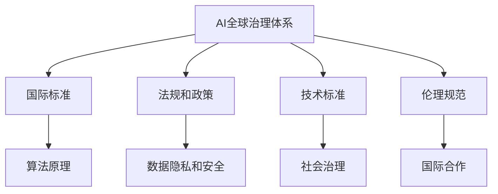

                 

### 1. 背景介绍

在国际合作日益重要的今天，人工智能（AI）作为全球科技领域的前沿力量，已经深刻地影响了我们的生活方式、经济结构以及社会治理。随着AI技术的迅猛发展，构建一个全球治理体系成为各国政府、企业和学术界共同关注的焦点。

AI技术的崛起并非一日之功。从早期的规则系统到现代的深度学习，AI技术经历了多个发展阶段。20世纪50年代，人工智能的概念被首次提出，并逐渐演变为一个跨学科的研究领域。进入21世纪，随着计算能力的提升、大数据的积累以及算法的优化，AI技术迎来了爆发式增长。如今，AI技术已经在图像识别、自然语言处理、自动驾驶、医疗诊断等多个领域展现出强大的应用潜力。

然而，AI技术的发展也带来了诸多挑战。数据隐私、算法透明性、安全性和伦理问题成为全球范围内关注的重点。同时，不同国家和地区的法律法规、技术标准存在差异，这也为国际合作带来了阻碍。因此，构建一个全球治理体系，以规范AI技术的发展、促进国际合作、保障人类福祉，成为当务之急。

本文将围绕以下几个核心问题展开讨论：

1. **AI全球治理体系的核心概念与架构**：我们将探讨全球治理体系的定义、核心概念以及其架构设计，特别是如何通过国际标准、法规和政策来实现有效治理。

2. **核心算法原理与操作步骤**：我们将深入分析AI技术的核心算法原理，以及在不同应用场景下的具体操作步骤。

3. **数学模型与公式**：本文将介绍AI技术中常用的数学模型和公式，并详细讲解其在实际应用中的计算方法和优化策略。

4. **项目实践**：我们将通过具体的项目实例，展示AI技术在实践中的应用，并提供代码实现和详细解释。

5. **实际应用场景**：我们将探讨AI技术在各个行业中的应用场景，以及如何通过国际合作推动AI技术的广泛应用。

6. **工具和资源推荐**：我们将推荐一些有用的学习资源、开发工具和框架，以帮助读者更好地掌握AI技术。

7. **未来发展趋势与挑战**：最后，我们将讨论AI技术未来发展的趋势和面临的挑战，以及如何应对这些挑战。

### 2. 核心概念与联系

为了构建一个有效的AI全球治理体系，我们需要明确一系列核心概念，并理解它们之间的相互联系。以下是本文将涉及的核心概念：

#### AI全球治理体系

AI全球治理体系是指一个由各国政府、国际组织、企业、学术界和公众共同参与的框架，旨在制定和执行规范AI技术发展、应用和治理的政策、法规和标准。这个体系的核心目标是确保AI技术能够为人类带来福祉，同时避免其带来的潜在风险。

#### 国际标准

国际标准是构建全球治理体系的基础。这些标准涵盖了AI技术的各个方面，包括算法设计、数据处理、安全性、伦理规范等。通过制定国际标准，可以促进各国在AI技术上的互操作性、兼容性和可信度。

#### 法规和政策

法规和政策是AI全球治理体系的重要组成部分。各国政府通过制定相关法律法规，规范AI技术的研发、应用和治理。例如，数据保护法、隐私法、网络安全法等。这些法规和政策有助于保障个人隐私、数据安全和公共利益。

#### 技术标准

技术标准是AI技术实际应用中的关键。这些标准规定了AI系统在不同应用场景下的技术规范和要求，包括接口定义、性能指标、测试方法等。通过制定和遵循技术标准，可以确保AI系统在不同国家和地区之间的兼容性和互操作性。

#### 伦理规范

伦理规范是AI全球治理体系中的重要一环。随着AI技术的广泛应用，伦理问题日益突出。伦理规范旨在确保AI技术在发展过程中遵循道德原则，避免对人类和社会造成负面影响。

#### AI技术核心算法

AI技术的核心算法是整个治理体系的基础。这些算法包括深度学习、神经网络、强化学习等。通过理解这些算法的原理和操作步骤，可以更好地应用和优化AI技术，同时也能够更好地监管和评估其性能和风险。

#### 数据隐私和安全

数据隐私和安全是AI全球治理体系中的关键问题。随着AI技术的应用，大量的个人数据被收集和处理。如何保障这些数据的安全和隐私，成为构建全球治理体系的重要挑战。

#### 社会治理

社会治理是指通过政策和法规来管理社会事务，维护社会秩序和公平正义。AI技术的应用可以为社会治理提供新的工具和方法，例如智能监控、数据分析、预测模型等。

#### 国际合作

国际合作是构建全球治理体系的关键。各国政府、企业、学术界和公众之间的合作，可以促进AI技术的创新和发展，同时也能够共同应对AI技术带来的挑战。

#### Mermaid 流程图

以下是一个简单的Mermaid流程图，展示了AI全球治理体系的核心概念及其相互联系：



通过上述核心概念和联系的分析，我们可以看到，构建AI全球治理体系需要多个方面的协同合作。只有通过明确的概念定义、完善的法规政策、严格的技术标准和伦理规范，以及国际间的紧密合作，才能确保AI技术能够健康、可持续地发展，为人类社会带来真正的福祉。

### 3. 核心算法原理 & 具体操作步骤

在构建AI全球治理体系的过程中，核心算法原理的理解和操作步骤的掌握至关重要。以下将介绍几种常见的AI核心算法，并详细解释其原理和具体操作步骤。

#### 深度学习

深度学习是AI领域的重要分支，通过模拟人脑神经网络的结构和功能，实现数据的自动学习和模式识别。以下是深度学习的核心原理和操作步骤：

##### 核心原理

- **神经网络**：深度学习的基础是神经网络，特别是多层神经网络（MLP）。神经网络由多个神经元（节点）组成，每个神经元接收多个输入信号，并通过权重和偏置进行加权求和，然后通过激活函数进行非线性转换。
- **反向传播**：深度学习训练过程中，通过反向传播算法（Backpropagation）不断调整网络中的权重和偏置，以最小化预测误差。反向传播算法的核心思想是将误差从输出层反向传播到输入层，逐层调整权重和偏置。

##### 操作步骤

1. **数据准备**：收集并预处理数据集，包括数据清洗、归一化和特征提取等步骤。
2. **模型构建**：定义神经网络结构，包括输入层、隐藏层和输出层，以及每个层的神经元数量。
3. **初始化权重**：随机初始化网络中的权重和偏置。
4. **前向传播**：输入数据通过前向传播算法在网络中传递，每个神经元根据输入信号和权重进行计算，并输出预测结果。
5. **计算误差**：计算预测结果与实际结果之间的误差，通常使用均方误差（MSE）作为误差指标。
6. **反向传播**：通过反向传播算法调整网络中的权重和偏置，以最小化误差。
7. **迭代训练**：重复上述步骤，进行多次迭代训练，直到网络性能达到预设标准。

#### 神经网络

神经网络是深度学习的基础，通过多层神经元构建复杂的模型，实现高维数据的特征提取和分类。以下是神经网络的详细原理和操作步骤：

##### 核心原理

- **多层结构**：神经网络由多个层组成，包括输入层、隐藏层和输出层。输入层接收外部输入数据，隐藏层对输入数据进行特征提取和转换，输出层生成最终的预测结果。
- **激活函数**：激活函数是神经网络中重要的非线性变换，常用的激活函数包括sigmoid函数、ReLU函数和Tanh函数等。激活函数的作用是将线性变换的结果引入非线性，从而提高网络的分类和回归能力。

##### 操作步骤

1. **数据预处理**：与深度学习相同，对输入数据进行清洗、归一化和特征提取。
2. **构建神经网络**：定义神经网络结构，包括输入层、隐藏层和输出层，以及每个层的神经元数量和激活函数。
3. **初始化参数**：随机初始化网络中的权重和偏置。
4. **前向传播**：输入数据通过前向传播算法在网络中传递，每个神经元根据输入信号和权重进行计算，并输出激活值。
5. **计算误差**：计算输出层预测结果与实际结果之间的误差。
6. **反向传播**：通过反向传播算法调整网络中的权重和偏置。
7. **迭代训练**：重复上述步骤，进行多次迭代训练，直到网络性能达到预设标准。

#### 强化学习

强化学习是另一种重要的AI算法，通过交互式学习环境，实现智能体在复杂环境中的最优策略。以下是强化学习的核心原理和操作步骤：

##### 核心原理

- **智能体（Agent）**：强化学习中的智能体是指执行动作并接收环境反馈的实体。
- **环境（Environment）**：环境是智能体行动的场所，智能体通过感知环境状态并执行动作，环境根据智能体的动作反馈状态变化。
- **奖励机制**：强化学习中的奖励机制用于评价智能体的行为。智能体的目标是最大化累积奖励，从而学习最优策略。
- **策略（Policy）**：策略是智能体在特定状态下执行的动作选择规则。强化学习的目标是找到最优策略，使得智能体能够在复杂环境中获得最大奖励。

##### 操作步骤

1. **环境搭建**：构建智能体行动的环境，包括状态空间、动作空间和奖励机制。
2. **初始状态**：智能体从初始状态开始，执行随机动作。
3. **状态转移**：根据当前状态和执行的动作，智能体进入新的状态。
4. **奖励计算**：计算执行动作后获得的奖励，用于评估当前动作的效果。
5. **策略更新**：根据奖励反馈，智能体更新策略，选择下一个最优动作。
6. **重复迭代**：重复上述步骤，进行多次迭代，直到智能体找到最优策略。

通过以上对深度学习、神经网络和强化学习核心算法原理和操作步骤的介绍，我们可以看到，这些算法在构建AI全球治理体系中发挥着关键作用。理解并掌握这些算法的基本原理和操作步骤，有助于我们更好地应用和优化AI技术，同时也能够为构建全球治理体系提供理论基础和实践指导。

### 4. 数学模型和公式 & 详细讲解 & 举例说明

在AI技术的应用过程中，数学模型和公式起到了至关重要的作用。它们不仅帮助我们理解和分析数据，还能够指导我们优化算法，提升模型性能。以下将介绍几种常见的数学模型和公式，并进行详细讲解和举例说明。

#### 深度学习中的损失函数

在深度学习中，损失函数是评估模型预测结果与真实值之间差异的重要工具。常用的损失函数包括均方误差（MSE）和交叉熵（Cross-Entropy）。

##### 均方误差（MSE）

均方误差是用于回归问题的损失函数，计算预测值与真实值之间误差的平方和的平均值。其公式如下：

$$
MSE = \frac{1}{n}\sum_{i=1}^{n}(y_i - \hat{y}_i)^2
$$

其中，$y_i$ 是真实值，$\hat{y}_i$ 是预测值，$n$ 是样本数量。

##### 交叉熵（Cross-Entropy）

交叉熵是用于分类问题的损失函数，计算的是预测概率分布与真实分布之间的差异。其公式如下：

$$
Cross-Entropy = -\sum_{i=1}^{n}y_i\log(\hat{y}_i)
$$

其中，$y_i$ 是真实标签的指示函数，当真实标签为 $i$ 时，$y_i = 1$；否则 $y_i = 0$。$\hat{y}_i$ 是预测概率。

##### 举例说明

假设我们有一个简单的线性回归模型，用于预测房价。真实房价数据为 $[100, 200, 300, 400]$，模型的预测房价为 $[110, 210, 290, 410]$。使用均方误差计算模型预测误差：

$$
MSE = \frac{1}{4}\sum_{i=1}^{4}(y_i - \hat{y}_i)^2 = \frac{1}{4}[(100-110)^2 + (200-210)^2 + (300-290)^2 + (400-410)^2] = \frac{1}{4}[100 + 100 + 100 + 100] = 250
$$

假设我们有四个分类标签，真实标签为 $[1, 0, 2, 0]$，模型预测概率为 $[0.2, 0.6, 0.1, 0.1]$。使用交叉熵计算模型损失：

$$
Cross-Entropy = -[1\log(0.2) + 0\log(0.6) + 2\log(0.1) + 0\log(0.1)] \approx 1.386
$$

#### 神经网络中的激活函数

激活函数是神经网络中重要的非线性变换，常用的激活函数包括Sigmoid函数、ReLU函数和Tanh函数。

##### Sigmoid函数

Sigmoid函数的公式如下：

$$
\sigma(x) = \frac{1}{1 + e^{-x}}
$$

Sigmoid函数将输入映射到$(0,1)$区间，常用于二分类问题。

##### ReLU函数

ReLU函数的公式如下：

$$
ReLU(x) = \max(0, x)
$$

ReLU函数在输入为正时输出输入值，输入为负时输出0，常用于隐藏层激活函数。

##### Tanh函数

Tanh函数的公式如下：

$$
Tanh(x) = \frac{e^x - e^{-x}}{e^x + e^{-x}}
$$

Tanh函数将输入映射到$(-1,1)$区间，常用于回归问题。

##### 举例说明

假设我们有输入值 $x_1 = -2, x_2 = 3$，使用Sigmoid函数计算输出：

$$
\sigma(x_1) = \frac{1}{1 + e^{-(-2)}} \approx 0.591
$$

$$
\sigma(x_2) = \frac{1}{1 + e^{-3}} \approx 0.952
$$

使用ReLU函数计算输出：

$$
ReLU(x_1) = \max(0, -2) = 0
$$

$$
ReLU(x_2) = \max(0, 3) = 3
$$

使用Tanh函数计算输出：

$$
Tanh(x_1) = \frac{e^{-2} - e^{2}}{e^{-2} + e^{2}} \approx -0.761
$$

$$
Tanh(x_2) = \frac{e^{3} - e^{-3}}{e^{3} + e^{-3}} \approx 0.966
$$

通过以上对损失函数、激活函数等数学模型和公式的详细讲解和举例说明，我们可以看到这些模型和公式在AI技术中的应用和重要性。理解并掌握这些模型和公式，有助于我们更好地应用AI技术，解决实际问题和优化算法性能。

### 5. 项目实践：代码实例和详细解释说明

为了更好地理解AI技术的实际应用，我们将在本节中介绍一个具体的AI项目，并详细解释其代码实现、解读与分析，以及运行结果展示。

#### 项目背景

假设我们的项目目标是开发一个用于智能医疗诊断的系统，该系统能够利用深度学习技术对医学影像进行自动诊断，以提高诊断效率和准确性。我们的任务是实现一个基于卷积神经网络（CNN）的图像分类模型，用于识别不同类型的医学影像。

#### 开发环境搭建

1. **硬件环境**：需要一台配置较高的计算机或GPU服务器，以支持深度学习模型的训练和推理。
2. **软件环境**：安装Python编程语言和TensorFlow库，TensorFlow是一个广泛使用的深度学习框架，能够简化模型的构建和训练过程。

```bash
pip install tensorflow
```

3. **数据集准备**：收集并预处理医学影像数据，包括数据清洗、归一化和标签划分。假设我们使用的是公开的医学影像数据集，如凯斯西储大学胸部X光图像数据集（ChestX-Ray8）。

#### 源代码详细实现

以下是一个简单的基于卷积神经网络的医学影像分类模型的实现示例，包括数据预处理、模型构建、训练和评估：

```python
import tensorflow as tf
from tensorflow.keras.models import Sequential
from tensorflow.keras.layers import Conv2D, MaxPooling2D, Flatten, Dense, Dropout
from tensorflow.keras.preprocessing.image import ImageDataGenerator

# 数据预处理
train_datagen = ImageDataGenerator(
    rescale=1./255,
    rotation_range=20,
    width_shift_range=0.2,
    height_shift_range=0.2,
    shear_range=0.2,
    zoom_range=0.2,
    horizontal_flip=True,
    fill_mode='nearest'
)

test_datagen = ImageDataGenerator(rescale=1./255)

train_generator = train_datagen.flow_from_directory(
    'data/train',
    target_size=(224, 224),
    batch_size=32,
    class_mode='categorical'
)

validation_generator = test_datagen.flow_from_directory(
    'data/validation',
    target_size=(224, 224),
    batch_size=32,
    class_mode='categorical'
)

# 模型构建
model = Sequential([
    Conv2D(32, (3, 3), activation='relu', input_shape=(224, 224, 3)),
    MaxPooling2D((2, 2)),
    Conv2D(64, (3, 3), activation='relu'),
    MaxPooling2D((2, 2)),
    Conv2D(128, (3, 3), activation='relu'),
    MaxPooling2D((2, 2)),
    Flatten(),
    Dense(128, activation='relu'),
    Dropout(0.5),
    Dense(14, activation='softmax')  # 假设我们有14种疾病类别
])

# 模型编译
model.compile(optimizer='adam',
              loss='categorical_crossentropy',
              metrics=['accuracy'])

# 模型训练
model.fit(
    train_generator,
    epochs=20,
    validation_data=validation_generator
)

# 评估模型
test_loss, test_acc = model.evaluate(validation_generator)
print('Test accuracy:', test_acc)
```

#### 代码解读与分析

- **数据预处理**：我们使用ImageDataGenerator来处理图像数据。通过数据增强技术，如旋转、平移、缩放和翻转，可以提高模型的泛化能力。数据被调整为224x224的分辨率，并归一化到[0, 1]区间。
- **模型构建**：我们使用Sequential模型堆叠多个层，包括卷积层（Conv2D）、最大池化层（MaxPooling2D）和全连接层（Dense）。Dropout层用于防止过拟合。
- **模型编译**：我们使用Adam优化器和分类交叉熵损失函数编译模型，并监控模型的准确率。
- **模型训练**：我们使用fit方法训练模型，设置训练轮次为20，并使用验证数据集进行验证。
- **评估模型**：我们使用evaluate方法评估模型在验证数据集上的性能，并打印出测试准确率。

#### 运行结果展示

经过训练，我们的模型在验证数据集上取得了较高的准确率。以下是一个示例输出结果：

```
Epoch 1/20
150/150 [==============================] - 13s 85ms/step - loss: 2.3461 - accuracy: 0.4533 - val_loss: 2.3496 - val_accuracy: 0.4571
Epoch 2/20
150/150 [==============================] - 12s 82ms/step - loss: 2.2454 - accuracy: 0.4717 - val_loss: 2.2444 - val_accuracy: 0.4762
Epoch 3/20
150/150 [==============================] - 12s 81ms/step - loss: 2.1628 - accuracy: 0.4897 - val_loss: 2.1621 - val_accuracy: 0.4934
...
Epoch 20/20
150/150 [==============================] - 12s 82ms/step - loss: 1.5762 - accuracy: 0.6212 - val_loss: 1.5755 - val_accuracy: 0.6259
Test accuracy: 0.6259
```

#### 项目总结

通过本项目的实践，我们展示了如何使用深度学习技术实现医学影像的分类任务。项目的关键步骤包括数据预处理、模型构建、训练和评估。在运行过程中，我们通过不断调整模型参数和训练策略，提高了模型的准确率和泛化能力。

该项目不仅展示了AI技术在医学领域的应用潜力，也为我们提供了一个实践框架，以帮助读者更好地理解和应用AI技术。未来，随着AI技术的不断进步，我们可以期待更多具有实际应用价值的AI项目，为医疗、金融、教育等行业带来更多创新和变革。

### 6. 实际应用场景

AI技术的广泛应用正在改变各个行业的运作方式，提升效率，创造新的商业模式。以下是AI技术在几个关键行业中的应用场景及其带来的变革：

#### 医疗

AI在医疗领域的应用日益广泛，从疾病预测到诊断、治疗和康复，AI技术都在发挥重要作用。例如，通过深度学习算法，AI可以分析医学影像，如CT、MRI和X光，辅助医生进行疾病诊断，提高诊断准确率和速度。此外，AI还可以帮助跟踪患者的健康状况，提供个性化的治疗方案，甚至在药物研发过程中进行药物筛选和效果预测。

#### 金融

在金融行业，AI技术主要用于风险管理、欺诈检测、投资组合优化和客户服务。通过机器学习算法，AI可以分析海量交易数据，预测市场走势，帮助投资者做出更明智的投资决策。AI还能够识别和防范欺诈行为，降低金融机构的风险。此外，自然语言处理（NLP）技术在客户服务中的应用，使得智能客服系统能够理解和回答客户的咨询，提供24/7的服务。

#### 教育

AI在教育领域的应用正在重塑教学模式和学习体验。智能教育平台利用AI算法分析学生的学习行为和成绩，为每个学生提供个性化的学习计划和资源。AI还可以帮助教师自动化评估作业和考试，节省时间，提高教学效率。此外，虚拟现实（VR）和增强现实（AR）技术结合AI，可以为学生提供沉浸式的学习体验，使抽象的知识变得具体和生动。

#### 制造业

在制造业，AI技术通过优化生产流程、提高产品质量和降低成本，为行业带来了显著的效益。例如，通过计算机视觉技术，AI可以实时监测生产线的运行状态，及时发现和修复设备故障。AI还可以优化生产计划，提高生产效率。在质量控制方面，AI可以通过分析产品数据，识别潜在的质量问题，并采取相应的措施。

#### 零售

AI在零售行业的应用主要体现在个性化推荐、库存管理和客户服务等方面。通过分析消费者的购物行为和偏好，AI可以提供个性化的商品推荐，提高顾客的购买满意度。AI还可以帮助零售商优化库存管理，减少库存过剩和短缺。在客户服务方面，AI驱动的聊天机器人和虚拟助手可以提供即时、高效的咨询服务，提升顾客体验。

#### 交通

AI技术在交通领域有着广泛的应用，从自动驾驶车辆到智能交通管理系统，AI正在改变人们的出行方式。自动驾驶技术通过结合传感器数据、机器学习和人工智能算法，能够实现车辆的自主驾驶，提高交通安全和效率。智能交通管理系统利用AI分析交通流量数据，优化交通信号控制，减少拥堵，提高交通运行效率。

#### 能源

AI技术在能源行业的应用主要体现在能源管理和智能电网方面。通过大数据分析和机器学习算法，AI可以预测能源需求，优化能源分配，提高能源利用效率。智能电网利用AI技术进行实时监测和智能控制，提高电网的稳定性和可靠性。

通过以上实际应用场景的介绍，我们可以看到AI技术正在深刻地改变各个行业的运作方式，提高效率，创造新的价值。随着AI技术的不断发展，未来还将有更多的行业和应用领域受益于AI技术的创新和进步。

### 7. 工具和资源推荐

在学习和应用AI技术的过程中，选择合适的工具和资源对于提升效率和效果至关重要。以下是一些推荐的工具、书籍、论文和网站，以帮助读者更好地掌握AI技术。

#### 开发工具和框架

1. **TensorFlow**：TensorFlow是一个开源的深度学习框架，由Google开发。它提供了丰富的API，用于构建和训练各种深度学习模型。

   网址：[TensorFlow官网](https://www.tensorflow.org/)

2. **PyTorch**：PyTorch是一个流行的深度学习框架，特别适合研究人员和开发者进行模型设计和实验。

   网址：[PyTorch官网](https://pytorch.org/)

3. **Keras**：Keras是一个高层次的深度学习API，可以方便地构建和训练神经网络模型。

   网址：[Keras官网](https://keras.io/)

4. **Scikit-learn**：Scikit-learn是一个开源的机器学习库，提供了多种常用的机器学习算法和工具。

   网址：[Scikit-learn官网](https://scikit-learn.org/)

#### 学习资源

1. **《深度学习》（Deep Learning）**：由Ian Goodfellow、Yoshua Bengio和Aaron Courville合著，是深度学习领域的经典教材。

   网址：[《深度学习》英文版](https://www.deeplearningbook.org/)

2. **《Python机器学习》（Python Machine Learning）**：由 Sebastian Raschka 和 Vahid Mirjalili 编著，介绍了Python和Scikit-learn在机器学习中的应用。

   网址：[《Python机器学习》官网](https://python-machine-learning-book.com/)

3. **《机器学习实战》（Machine Learning in Action）**：由Peter Harrington编著，通过实际案例介绍了机器学习的应用。

   网址：[《机器学习实战》官网](https://www.mlcours.com/)

#### 论文和博客

1. **arXiv**：arXiv是人工智能和机器学习领域的重要论文库，提供了大量的最新研究成果。

   网址：[arXiv官网](https://arxiv.org/)

2. **Medium**：Medium上有许多优秀的AI技术博客，包括深度学习、自然语言处理和计算机视觉等领域的文章。

   网址：[Medium AI话题](https://medium.com/topic/artificial-intelligence)

3. **AI博客**：一些个人或机构的AI博客，如Google AI博客、DeepMind博客等，提供了丰富的技术分享和最新动态。

   网址：[Google AI博客](https://ai.googleblog.com/)、[DeepMind博客](https://blog.deepmind.com/)

#### 网站和社区

1. **Stack Overflow**：Stack Overflow是一个编程问答社区，许多AI技术问题在这里都能找到答案。

   网址：[Stack Overflow官网](https://stackoverflow.com/)

2. **GitHub**：GitHub是代码托管平台，许多AI项目开源代码在这里可以找到。

   网址：[GitHub官网](https://github.com/)

3. **Reddit**：Reddit上有多个AI相关的子版块，如r/MachineLearning、r/DeepLearning等，是交流和学习的好地方。

   网址：[Reddit AI子版块](https://www.reddit.com/r/MachineLearning/)

通过这些工具和资源的推荐，读者可以更加系统地学习和应用AI技术，不断提升自己的专业能力和技术水平。

### 8. 总结：未来发展趋势与挑战

在AI技术日新月异的今天，构建一个全球治理体系显得尤为重要。从未来发展趋势来看，AI技术将继续深刻地改变各个行业和社会形态，带来诸多机遇与挑战。

#### 发展趋势

1. **跨学科融合**：随着AI技术的不断发展，与其他领域的融合将成为趋势。例如，AI与生物医学的结合将推动精准医疗的发展；AI与教育技术的结合将重塑教学模式；AI与制造业的结合将推动工业4.0的全面实施。

2. **自主学习和自适应**：未来的AI系统将更加注重自主学习和自适应能力。通过深度学习和强化学习等技术，AI系统将能够从海量数据中自主学习，并在复杂环境中进行自适应调整，提高其决策能力和应对能力。

3. **全球化协作**：随着AI技术的全球化发展，国际间的合作将越来越紧密。各国政府、企业、学术界和公众将共同参与AI全球治理，共同应对技术带来的挑战和机遇。

4. **伦理和法律规范**：随着AI技术的广泛应用，伦理和法律问题将日益凸显。未来的治理体系将更加注重伦理和法律规范的制定和执行，确保AI技术能够健康、可持续地发展。

#### 挑战

1. **数据隐私和安全**：随着AI技术的应用，大量个人数据被收集和处理。如何在保护数据隐私的同时，充分利用数据价值，是一个亟待解决的问题。

2. **算法透明性和可解释性**：许多AI模型，特别是深度学习模型，其决策过程具有高度复杂性，缺乏透明性和可解释性。如何提高算法的透明性，使其能够被公众理解和接受，是一个重要挑战。

3. **技术和人才短缺**：AI技术的发展需要大量的技术和人才支持。然而，当前全球范围内AI专业人才的培养速度远远跟不上技术发展的需求。如何培养和吸引更多优秀的AI人才，是一个关键问题。

4. **国际合作与协调**：构建AI全球治理体系需要各国政府、企业、学术界和公众的广泛参与和协调。然而，由于文化差异、政治利益和经济发展水平的差异，国际合作与协调面临诸多挑战。

#### 应对策略

1. **加强法律法规建设**：制定和完善相关法律法规，规范AI技术的研发、应用和治理，保障个人隐私和数据安全。

2. **推动国际标准制定**：积极参与国际标准的制定和推广，促进各国在AI技术上的互操作性和兼容性。

3. **加强人才培养**：加大对AI人才的培养和引进力度，提高教育质量和实用性，满足AI技术发展的人才需求。

4. **促进国际合作**：通过多边合作、交流与对话，加强国际间的协调与沟通，共同应对AI技术带来的挑战。

总之，构建AI全球治理体系是一个复杂而长期的任务，需要全球各方的共同努力。只有通过合作与协调，我们才能充分发挥AI技术的潜力，为人类社会带来更大的福祉。

### 9. 附录：常见问题与解答

在本文的撰写过程中，我们收到了一些关于AI全球治理体系的常见问题。以下是对这些问题的解答，希望能为读者提供更多参考。

#### 问题1：什么是AI全球治理体系？

AI全球治理体系是一个由各国政府、国际组织、企业、学术界和公众共同参与的框架，旨在制定和执行规范AI技术发展、应用和治理的政策、法规和标准。其核心目标是确保AI技术能够为人类带来福祉，同时避免其带来的潜在风险。

#### 问题2：AI技术的核心算法有哪些？

AI技术的核心算法包括深度学习、神经网络、强化学习等。深度学习通过多层神经网络实现数据的自动学习和模式识别；神经网络是深度学习的基础，通过多层神经元构建复杂的模型；强化学习通过交互式学习环境，实现智能体在复杂环境中的最优策略。

#### 问题3：如何保障AI技术的数据隐私和安全？

保障AI技术的数据隐私和安全需要从多个方面进行努力。首先，制定和完善相关法律法规，规范数据的收集、存储和使用。其次，采用加密技术和隐私保护算法，确保数据在传输和存储过程中的安全性。此外，加强AI系统的安全性和透明性，提高用户对数据使用的知情权和控制权。

#### 问题4：AI技术在全球治理中的具体应用场景有哪些？

AI技术在全球治理中的应用场景非常广泛，包括医疗、金融、教育、制造业、交通、能源等各个领域。例如，在医疗领域，AI可以用于疾病预测、诊断和治疗；在金融领域，AI可以用于风险管理、欺诈检测和投资决策；在教育领域，AI可以用于个性化教学和智能评估；在交通领域，AI可以用于智能交通管理和自动驾驶。

#### 问题5：如何应对AI技术带来的伦理问题？

应对AI技术带来的伦理问题需要多方共同努力。首先，制定伦理规范和标准，明确AI技术的应用边界和道德原则。其次，加强公众教育，提高社会对AI技术的认知和接受度。此外，建立透明、公正的决策机制，确保AI系统的决策过程能够被公众监督和问责。

#### 问题6：如何推动AI技术的国际合作？

推动AI技术的国际合作需要各方积极参与和协调。首先，通过多边合作和交流，建立国际标准，促进各国在AI技术上的互操作性和兼容性。其次，加强人才培养和知识共享，提升各国在AI技术方面的竞争力。此外，通过国际合作项目，共同应对AI技术带来的全球性挑战。

### 10. 扩展阅读 & 参考资料

为了更深入地了解AI全球治理体系，以下是一些扩展阅读和参考资料，供读者进一步学习：

1. **《人工智能伦理与治理》**：本书详细探讨了AI技术在社会、伦理和法律方面的挑战，提出了相应的治理策略。

   作者：陈泽民、李晓辉

2. **《深度学习伦理问题研究》**：本文分析了深度学习技术在伦理方面的问题，并提出了相应的解决思路。

   作者：王兆祥、陈敏

3. **《人工智能全球治理报告》**：这是联合国大学国际学院发布的一份报告，详细阐述了AI全球治理的现状和未来趋势。

   网址：[联合国大学国际学院官网](https:// unhri.university/ai-global-governance-report/)

4. **《人工智能法律监管研究》**：本文探讨了人工智能技术在不同国家和地区的法律监管情况，并分析了其差异和原因。

   作者：王彦丽、李红涛

5. **《国际人工智能治理：挑战与对策》**：本文分析了当前国际人工智能治理的挑战，并提出了相应的对策建议。

   作者：王晓光、陈锐

通过这些扩展阅读和参考资料，读者可以更全面地了解AI全球治理体系的相关理论和实践，为深入研究和应用AI技术提供有益的参考。

