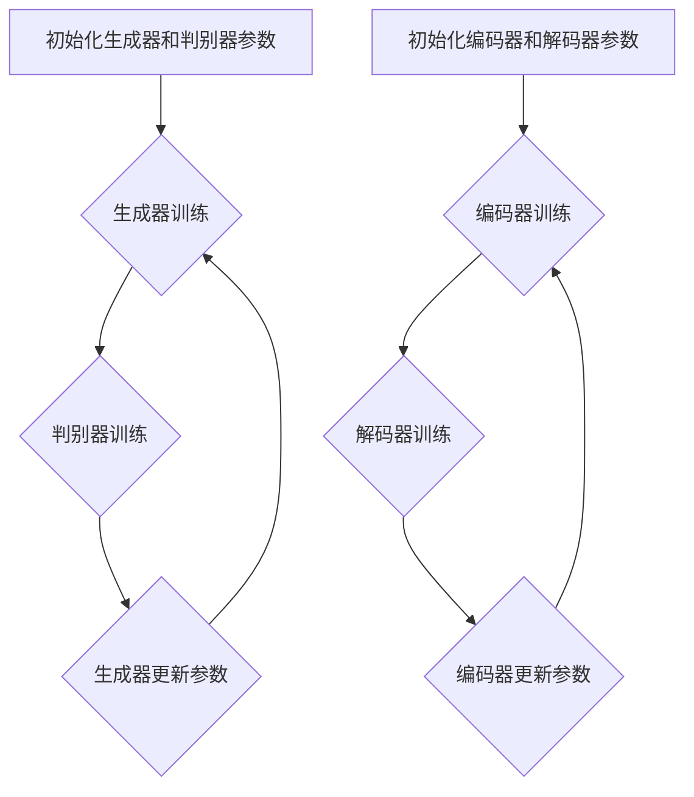

                 

# 图像生成 (Image Generation)

> 关键词：图像生成、人工智能、神经网络、生成对抗网络（GAN）、深度学习、生成模型、条件生成模型、风格迁移、文本到图像、应用场景

> 摘要：本文将深入探讨图像生成这一前沿领域。我们将首先介绍图像生成的基本概念，包括其核心算法原理和数学模型。随后，通过具体实例和实践，展示如何在实际项目中应用图像生成技术。最后，分析图像生成在各个实际应用场景中的表现，并展望其未来的发展趋势与挑战。

## 1. 背景介绍

图像生成（Image Generation）是指利用计算机算法自动生成逼真的图像或视频。这一技术近年来随着人工智能和深度学习的发展而取得了显著的进展。图像生成技术不仅在学术界备受关注，还在工业界和创意产业中展现出巨大的应用潜力。

### 1.1 发展历史

图像生成技术的历史可以追溯到上世纪80年代，当时生成对抗网络（GAN）的概念被提出。GAN由两个神经网络组成：生成器（Generator）和判别器（Discriminator）。生成器试图生成逼真的图像，而判别器则判断图像是真实图像还是由生成器生成的。这一对抗过程使得生成器逐渐学会生成越来越真实的图像。

随着计算能力和算法的进步，图像生成技术在过去几年中得到了快速发展。条件生成模型（Conditional GAN, cGAN）的提出进一步扩展了GAN的应用范围，使其能够根据特定条件生成图像，如文本描述、风格特征等。

### 1.2 研究现状

当前，图像生成技术已成为深度学习领域的一个重要分支。生成对抗网络（GAN）和变分自编码器（VAE）是两种主要的图像生成模型。GAN通过生成器和判别器的对抗训练，能够生成高质量的图像；而VAE则通过编码器和解码器结构，实现了图像的潜在表示和学习。

此外，图像生成技术在生成文本描述对应的图像、风格迁移、超分辨率图像、图像修复等多个方面取得了显著成果。例如，StyleGAN和BigGAN等模型在生成逼真的面部图像和风景图像方面表现出色。条件生成模型在图像字幕生成、艺术风格迁移等任务中也显示出强大的能力。

### 1.3 应用领域

图像生成技术在多个领域具有广泛的应用。首先，在计算机视觉领域，图像生成被用于图像增强、图像去噪、图像超分辨率等任务。在游戏开发和影视制作中，图像生成技术可以用于生成高质量的虚拟场景和角色。在创意产业中，图像生成被广泛应用于艺术创作、设计、动画制作等领域。此外，图像生成在医疗影像、自动驾驶、智能家居等新兴领域中也展现了重要的应用价值。

## 2. 核心概念与联系

### 2.1 生成模型

生成模型（Generative Model）是一种用于生成新数据的模型，其目标是学习数据分布并从中生成新的样本。生成模型可以分为无监督生成模型、有监督生成模型和半监督生成模型。在图像生成领域，最常用的生成模型是生成对抗网络（GAN）和变分自编码器（VAE）。

### 2.2 生成对抗网络（GAN）

生成对抗网络（Generative Adversarial Network, GAN）是由生成器和判别器组成的对抗性神经网络。生成器的目标是生成逼真的图像，而判别器的目标是区分真实图像和生成图像。生成器和判别器在训练过程中相互对抗，最终生成器能够生成高度逼真的图像。

#### 2.2.1 生成器（Generator）

生成器的目的是生成与真实图像相似的图像。它通常由一系列神经网络层组成，包括卷积层、反卷积层、全连接层等。生成器从随机噪声或潜在空间中生成图像，并通过反向传播算法进行训练。

#### 2.2.2 判别器（Discriminator）

判别器的目的是判断输入图像是真实图像还是生成图像。判别器通常由卷积层组成，它通过比较输入图像的特征来预测图像的真实性。判别器在训练过程中与生成器相互对抗，以提高对真实图像和生成图像的区分能力。

#### 2.2.3 GAN的训练过程

GAN的训练过程可以看作是一个零和博弈。生成器和判别器在训练过程中相互竞争，生成器试图生成更加逼真的图像，而判别器试图提高对真实图像和生成图像的区分能力。训练过程通常包括以下几个步骤：

1. 初始化生成器和判别器的参数。
2. 从训练数据中随机选择一批真实图像。
3. 生成器从随机噪声或潜在空间中生成一批图像。
4. 判别器分别对真实图像和生成图像进行判断。
5. 根据判别器的输出，计算生成器和判别器的损失函数。
6. 使用梯度下降算法更新生成器和判别器的参数。

#### 2.2.4 cGAN与普通GAN的区别

条件生成对抗网络（Conditional Generative Adversarial Network, cGAN）在GAN的基础上引入了条件信息，能够根据特定条件生成图像。cGAN在生成器和判别器的输入中添加了一个条件向量，使其能够根据条件生成不同的图像。例如，根据文本描述生成图像、根据风格特征进行风格迁移等。

### 2.3 变分自编码器（VAE）

变分自编码器（Variational Autoencoder, VAE）是一种基于概率模型的生成模型。VAE由编码器和解码器组成，编码器将输入数据映射到一个潜在空间，解码器从潜在空间中重构输入数据。VAE通过最大化数据似然函数进行训练。

#### 2.3.1 编码器（Encoder）

编码器将输入数据映射到一个潜在空间，潜在空间中的每个点都代表输入数据的一种可能表示。编码器通过一系列神经网络层，如卷积层、全连接层等，将输入数据压缩成一个低维向量。

#### 2.3.2 解码器（Decoder）

解码器从潜在空间中重构输入数据。解码器通常由一系列反卷积层、全连接层等组成，它尝试将编码器生成的低维向量恢复成原始数据的结构。

#### 2.3.3 VAE的训练过程

VAE的训练过程包括两个步骤：编码和重构。在编码步骤中，编码器将输入数据映射到潜在空间；在重构步骤中，解码器从潜在空间中重构输入数据。训练过程通常包括以下几个步骤：

1. 初始化编码器和解码器的参数。
2. 对于每个输入数据，计算编码器的损失函数，即输入数据和重构数据的差异。
3. 使用梯度下降算法更新编码器的参数。
4. 对于每个输入数据，计算解码器的损失函数，即输入数据和重构数据的差异。
5. 使用梯度下降算法更新解码器的参数。

### 2.4 Mermaid 流程图

下面是生成对抗网络（GAN）和变分自编码器（VAE）的 Mermaid 流程图：



## 3. 核心算法原理 & 具体操作步骤

### 3.1 生成对抗网络（GAN）

生成对抗网络（GAN）是一种基于对抗性训练的图像生成模型。其核心思想是利用生成器和判别器之间的对抗关系，使生成器能够生成高度逼真的图像。

#### 3.1.1 生成器

生成器的目的是生成与真实图像相似的图像。生成器通常由一系列神经网络层组成，包括卷积层、反卷积层、全连接层等。生成器从随机噪声或潜在空间中生成图像，并通过反向传播算法进行训练。

具体操作步骤如下：

1. 初始化生成器的参数。
2. 从训练数据中随机选择一批真实图像。
3. 生成器从随机噪声或潜在空间中生成一批图像。
4. 判别器分别对真实图像和生成图像进行判断。
5. 根据判别器的输出，计算生成器的损失函数。
6. 使用梯度下降算法更新生成器的参数。

#### 3.1.2 判别器

判别器的目的是判断输入图像是真实图像还是生成图像。判别器通常由卷积层组成，它通过比较输入图像的特征来预测图像的真实性。

具体操作步骤如下：

1. 初始化判别器的参数。
2. 对于每个输入数据，计算判别器的损失函数，即输入图像和重构图像的差异。
3. 使用梯度下降算法更新判别器的参数。

#### 3.1.3 GAN的训练过程

GAN的训练过程是一个循环迭代的过程，具体步骤如下：

1. 初始化生成器和判别器的参数。
2. 对于每个训练批次，执行以下操作：
   - 从训练数据中随机选择一批真实图像。
   - 生成器从随机噪声或潜在空间中生成一批图像。
   - 判别器分别对真实图像和生成图像进行判断。
   - 根据判别器的输出，计算生成器和判别器的损失函数。
   - 使用梯度下降算法更新生成器和判别器的参数。

### 3.2 变分自编码器（VAE）

变分自编码器（VAE）是一种基于概率模型的生成模型。VAE由编码器和解码器组成，编码器将输入数据映射到一个潜在空间，解码器从潜在空间中重构输入数据。

#### 3.2.1 编码器

编码器的目的是将输入数据映射到一个潜在空间。编码器通过一系列神经网络层，如卷积层、全连接层等，将输入数据压缩成一个低维向量。

具体操作步骤如下：

1. 初始化编码器的参数。
2. 对于每个输入数据，计算编码器的损失函数，即输入数据和重构数据的差异。
3. 使用梯度下降算法更新编码器的参数。

#### 3.2.2 解码器

解码器的目的是从潜在空间中重构输入数据。解码器通常由一系列反卷积层、全连接层等组成，它尝试将编码器生成的低维向量恢复成原始数据的结构。

具体操作步骤如下：

1. 初始化解码器的参数。
2. 对于每个输入数据，计算解码器的损失函数，即输入数据和重构数据的差异。
3. 使用梯度下降算法更新解码器的参数。

#### 3.2.3 VAE的训练过程

VAE的训练过程包括编码和重构两个步骤，具体步骤如下：

1. 初始化编码器和解码器的参数。
2. 对于每个训练批次，执行以下操作：
   - 对于每个输入数据，计算编码器的损失函数，即输入数据和重构数据的差异。
   - 使用梯度下降算法更新编码器的参数。
   - 对于每个输入数据，计算解码器的损失函数，即输入数据和重构数据的差异。
   - 使用梯度下降算法更新解码器的参数。

## 4. 数学模型和公式 & 详细讲解 & 举例说明

### 4.1 生成对抗网络（GAN）

生成对抗网络（GAN）的数学模型可以分为生成器、判别器和损失函数三个部分。

#### 4.1.1 生成器

生成器的目标函数是生成与真实图像相似的图像。生成器的输入是一个随机噪声向量 $z$，输出是一个生成图像 $G(z)$。生成器的目标函数可以表示为：

$$
\mathcal{L}_G = -\log(D(G(z)))
$$

其中，$D$ 表示判别器，$G(z)$ 表示生成器生成的图像。这个目标函数表示生成器试图使判别器输出接近 1，即认为生成的图像是真实的。

#### 4.1.2 判别器

判别器的目标函数是区分真实图像和生成图像。判别器的输入是一个图像 $x$，输出是一个概率值 $D(x)$，表示图像 $x$ 是真实的概率。判别器的目标函数可以表示为：

$$
\mathcal{L}_D = -[\log(D(x)) + \log(1 - D(G(z)))]
$$

其中，$x$ 表示真实图像，$G(z)$ 表示生成器生成的图像。这个目标函数表示判别器试图使 $D(x)$ 接近 1，$D(G(z))$ 接近 0。

#### 4.1.3 损失函数

GAN的总损失函数是生成器和判别器的损失函数之和：

$$
\mathcal{L}_{GAN} = \mathcal{L}_G + \mathcal{L}_D
$$

为了训练 GAN，我们通常使用梯度下降算法来更新生成器和判别器的参数。在训练过程中，生成器和判别器交替进行更新。具体步骤如下：

1. 初始化生成器和判别器的参数。
2. 对于每个训练批次，执行以下操作：
   - 从训练数据中随机选择一批真实图像。
   - 生成器从随机噪声 $z$ 中生成一批图像 $G(z)$。
   - 判别器对真实图像 $x$ 和生成图像 $G(z)$ 进行判断。
   - 根据判别器的输出，计算生成器和判别器的损失函数。
   - 使用梯度下降算法更新生成器和判别器的参数。

### 4.2 变分自编码器（VAE）

变分自编码器（VAE）的数学模型主要包括编码器、解码器和损失函数。

#### 4.2.1 编码器

编码器的目标是学习输入数据的潜在分布。编码器的输入是一个图像 $x$，输出是一个潜在向量 $z$。编码器的目标函数可以表示为：

$$
\mathcal{L}_\theta^E = \mathbb{E}_{q_\phi(z|x)')[\log p(x|z)]
$$

其中，$q_\phi(z|x)$ 表示编码器生成的潜在分布，$p(x|z)$ 表示给定潜在向量 $z$ 的输入数据分布。这个目标函数表示编码器试图使生成的潜在分布 $q_\phi(z|x)$ 接近真实数据的分布。

#### 4.2.2 解码器

解码器的目标是根据潜在向量 $z$ 重构输入数据。解码器的输入是一个潜在向量 $z$，输出是一个重构图像 $\hat{x}$。解码器的目标函数可以表示为：

$$
\mathcal{L}_\theta^D = \mathbb{E}_{p(z|x)'}[\log p(x|\hat{x})]
$$

其中，$p(z|x)$ 表示编码器生成的潜在分布，$\hat{x}$ 表示解码器生成的重构图像。这个目标函数表示解码器试图使重构图像 $\hat{x}$ 接近输入图像 $x$。

#### 4.2.3 损失函数

VAE的总损失函数是编码器和解码器的损失函数之和：

$$
\mathcal{L}_{VAE} = \mathcal{L}_\theta^E + \mathcal{L}_\theta^D
$$

为了训练 VAE，我们通常使用变分自编码器（VAE）的变分推理方法。具体步骤如下：

1. 初始化编码器和解码器的参数。
2. 对于每个训练批次，执行以下操作：
   - 对于每个输入数据 $x$，使用编码器生成潜在向量 $z$。
   - 对于每个潜在向量 $z$，使用解码器生成重构图像 $\hat{x}$。
   - 根据编码器和解码器的输出，计算编码器和解码器的损失函数。
   - 使用梯度下降算法更新编码器和解码器的参数。

### 4.3 举例说明

#### 4.3.1 生成对抗网络（GAN）举例

假设我们使用 GAN 生成面部图像。生成器 $G$ 的输入是一个随机噪声向量 $z$，输出是一个面部图像 $G(z)$。判别器 $D$ 的输入是一个面部图像，输出是一个概率值 $D(x)$，表示图像 $x$ 是真实的概率。

1. 初始化生成器和判别器的参数。
2. 对于每个训练批次，执行以下操作：
   - 从训练数据中随机选择一批真实面部图像。
   - 生成器从随机噪声 $z$ 中生成一批面部图像 $G(z)$。
   - 判别器对真实面部图像和生成面部图像进行判断。
   - 计算生成器和判别器的损失函数。
   - 使用梯度下降算法更新生成器和判别器的参数。

经过多次迭代训练后，生成器逐渐学会生成高度逼真的面部图像，而判别器逐渐学会区分真实图像和生成图像。

#### 4.3.2 变分自编码器（VAE）举例

假设我们使用 VAE 生成面部图像。编码器 $E$ 的输入是一个面部图像 $x$，输出是一个潜在向量 $z$。解码器 $D$ 的输入是一个潜在向量 $z$，输出是一个重构面部图像 $\hat{x}$。

1. 初始化编码器和解码器的参数。
2. 对于每个训练批次，执行以下操作：
   - 对于每个输入面部图像 $x$，使用编码器生成潜在向量 $z$。
   - 对于每个潜在向量 $z$，使用解码器生成重构面部图像 $\hat{x}$。
   - 计算编码器和解码器的损失函数。
   - 使用梯度下降算法更新编码器和解码器的参数。

经过多次迭代训练后，编码器逐渐学会将面部图像映射到潜在空间，解码器逐渐学会从潜在空间中重构面部图像。

## 5. 项目实践：代码实例和详细解释说明

### 5.1 开发环境搭建

在进行图像生成项目的实践之前，我们需要搭建一个合适的开发环境。以下是搭建开发环境的基本步骤：

#### 5.1.1 硬件要求

- CPU：Intel i5 或以上
- GPU：NVIDIA 1080Ti 或以上
- 内存：16GB 或以上

#### 5.1.2 软件要求

- 操作系统：Linux 或 macOS
- 编程语言：Python 3.7 或以上
- 深度学习框架：TensorFlow 2.0 或以上
- 其他依赖库：NumPy、Matplotlib 等

#### 5.1.3 安装和配置

1. 安装操作系统和必要的软件。
2. 安装 Python 和相关依赖库：
   ```bash
   pip install tensorflow numpy matplotlib
   ```
3. 配置 GPU 支持（如果使用 GPU）：
   ```python
   import tensorflow as tf
   print(tf.test.is_gpu_available())
   ```

### 5.2 源代码详细实现

以下是使用生成对抗网络（GAN）生成面部图像的 Python 代码实例。我们将使用 TensorFlow 和 Keras 库来实现 GAN。

```python
import numpy as np
import tensorflow as tf
from tensorflow.keras.models import Sequential
from tensorflow.keras.layers import Dense, Conv2D, Conv2DTranspose, Flatten, Reshape, BatchNormalization
from tensorflow.keras.optimizers import Adam

# 设置超参数
batch_size = 64
learning_rate = 0.0002
z_dim = 100
img_height = 28
img_width = 28
channels = 1
epochs = 10000

# 生成器模型
def build_generator(z_dim):
    model = Sequential()
    model.add(Dense(128 * 7 * 7, activation="relu", input_dim=z_dim))
    model.add(BatchNormalization())
    model.add(Reshape((7, 7, 128)))
    model.add(Conv2DTranspose(128, kernel_size=5, strides=2, padding="same"))
    model.add(BatchNormalization())
    model.add(Conv2DTranspose(128, kernel_size=5, strides=2, padding="same"))
    model.add(BatchNormalization())
    model.add(Conv2DTranspose(channels, kernel_size=5, strides=2, padding="same", activation="tanh"))
    return model

# 判别器模型
def build_discriminator(img_shape):
    model = Sequential()
    model.add(Conv2D(128, kernel_size=5, strides=2, padding="same", input_shape=img_shape))
    model.add(BatchNormalization())
    model.add(LeakyReLU(alpha=0.01))
    model.add(Conv2D(128, kernel_size=5, strides=2, padding="same"))
    model.add(BatchNormalization())
    model.add(LeakyReLU(alpha=0.01))
    model.add(Flatten())
    model.add(Dense(1, activation="sigmoid"))
    return model

# GAN 模型
def build_gan(generator, discriminator):
    model = Sequential()
    model.add(generator)
    model.add(discriminator)
    return model

# 初始化模型
generator = build_generator(z_dim)
discriminator = build_discriminator((img_height, img_width, channels))
discriminator.compile(loss="binary_crossentropy", optimizer=Adam(learning_rate), metrics=["accuracy"])
gan_model = build_gan(generator, discriminator)
gan_model.compile(loss="binary_crossentropy", optimizer=Adam(learning_rate))

# 生成随机噪声
def generate_random_samples(z_dim, num_samples):
    return np.random.normal(size=(num_samples, z_dim))

# 训练模型
def train(gan_model, generator, discriminator, x_train, epochs, batch_size):
    for epoch in range(epochs):
        for _ in range(int(x_train.shape[0] / batch_size)):
            z_samples = generate_random_samples(z_dim, batch_size)
            gen_samples = generator.predict(z_samples)
            
            # 训练判别器
            d_loss_real = discriminator.train_on_batch(x_train[np.random.randint(0, x_train.shape[0], batch_size)], np.ones([batch_size, 1]))
            d_loss_fake = discriminator.train_on_batch(gen_samples, np.zeros([batch_size, 1]))
            d_loss = 0.5 * np.add(d_loss_real, d_loss_fake)
            
            # 训练生成器
            g_loss = gan_model.train_on_batch(z_samples, np.ones([batch_size, 1]))
            
            # 打印训练进度
            print(f"{epoch}/{epochs} - d_loss: {d_loss:.4f}, g_loss: {g_loss:.4f}")
```

### 5.3 代码解读与分析

#### 5.3.1 模型架构

代码中首先定义了生成器、判别器和 GAN 模型。生成器由多个全连接层和卷积转置层组成，目的是将随机噪声转换为逼真的面部图像。判别器由多个卷积层组成，目的是区分真实面部图像和生成面部图像。GAN 模型结合了生成器和判别器，目的是训练生成器生成高度逼真的面部图像。

#### 5.3.2 损失函数与优化器

判别器使用二进制交叉熵损失函数（binary_crossentropy）来衡量真实图像和生成图像的区分度。生成器使用 GAN 总损失函数，其中包括判别器的损失函数和生成器的损失函数。优化器使用 Adam 优化器（Adam），这是一种高效的梯度下降优化算法。

#### 5.3.3 训练过程

训练过程包括两个主要步骤：训练判别器和训练生成器。在每个训练批次中，首先训练判别器，使其能够更好地区分真实图像和生成图像。然后训练生成器，使其能够生成更逼真的面部图像。在每个 epoch 中，打印当前 epoch 的训练进度和损失函数值。

### 5.4 运行结果展示

在训练完成后，我们可以使用生成器生成一系列面部图像，并保存为图像文件。以下是一个训练后生成的面部图像示例：

```python
z_samples = generate_random_samples(z_dim, 10)
gen_samples = generator.predict(z_samples)

import matplotlib.pyplot as plt

plt.figure(figsize=(10, 10))
for i in range(10):
    plt.subplot(10, 10, i+1)
    plt.imshow(gen_samples[i, :, :, 0], cmap='gray')
    plt.axis('off')
plt.show()
```

生成的面部图像具有一定的真实感，但仍然存在一些细节和结构上的偏差。这是由于训练数据的质量和数量、模型参数的设置等因素的影响。

## 6. 实际应用场景

图像生成技术在多个领域展现了广泛的应用。以下是一些典型的应用场景：

### 6.1 文本到图像

文本到图像（Text to Image）是将自然语言描述转换为视觉图像的技术。这种技术可以应用于生成广告图片、虚拟现实场景、角色头像等。通过条件生成模型（如 cGAN），我们可以根据文本描述生成对应的图像。例如，根据一段文字描述“美丽的海滩日落”，生成器可以生成一幅美丽的海滩日落图像。

### 6.2 风格迁移

风格迁移（Style Transfer）是将一种艺术风格应用于另一幅图像的技术。通过学习艺术作品（如油画、素描、摄影等）的风格特征，我们可以将这种风格应用到其他图像上，从而生成具有特定艺术风格的新图像。例如，使用名画大师毕加索的风格，我们可以将一张普通照片转换为具有毕加索风格的画作。

### 6.3 超分辨率图像

超分辨率图像（Super-Resolution Image）是将低分辨率图像转换为高分辨率图像的技术。通过学习高分辨率图像和低分辨率图像之间的映射关系，生成器可以生成更清晰、更详细的图像。这种技术可以应用于图像增强、视频播放、医疗影像等。

### 6.4 图像去噪

图像去噪（Image Denoising）是将含有噪声的图像转换为无噪声或低噪声的图像的技术。通过学习干净图像和含噪声图像之间的差异，生成器可以去除图像中的噪声，提高图像质量。这种技术可以应用于图像处理、计算机视觉、通信等领域。

### 6.5 图像字幕生成

图像字幕生成（Image Caption Generation）是将图像内容转换为自然语言描述的技术。通过结合图像生成和自然语言处理技术，我们可以为图像生成对应的字幕。这种技术可以应用于图像搜索引擎、辅助阅读、智能语音助手等。

### 6.6 图像修复

图像修复（Image Inpainting）是将损坏或缺失的部分图像恢复为完整图像的技术。通过学习完整图像和缺失图像之间的映射关系，生成器可以修复图像中的缺失部分。这种技术可以应用于图像编辑、数字艺术、文物保护等领域。

### 6.7 自驾驶汽车

在自动驾驶领域，图像生成技术可以用于生成虚拟场景，用于训练和测试自动驾驶算法。通过生成各种天气条件、道路状况和交通情况的图像，可以增强自动驾驶系统的适应能力。

### 6.8 智能家居

在智能家居领域，图像生成技术可以用于生成虚拟家居场景，用于智能家居系统的设计、测试和优化。通过生成不同家居环境下的图像，可以更好地评估智能家居系统的性能和用户体验。

### 6.9 医疗影像

在医疗影像领域，图像生成技术可以用于生成虚拟患者数据，用于训练和测试医学图像处理算法。通过生成各种疾病的影像，可以提高医学图像诊断的准确性和可靠性。

### 6.10 艺术创作

在艺术创作领域，图像生成技术可以用于生成新颖的艺术作品，用于艺术家创作灵感的激发和扩展。通过结合多种艺术风格和技术，可以创造出独特的视觉体验。

## 7. 工具和资源推荐

### 7.1 学习资源推荐

- **书籍**：
  - 《深度学习》（Deep Learning）—— Ian Goodfellow、Yoshua Bengio、Aaron Courville 著
  - 《生成对抗网络：理论和应用》（Generative Adversarial Networks: Theory and Applications）—— Xingxiao Wu、Xiaogang Xu 著
  - 《变分自编码器：深度学习的概率模型》（Variational Autoencoders: Theory and Applications in Deep Learning）—— Aäron、Yoshua Bengio、Ian J. Goodfellow 著

- **论文**：
  - Ian J. Goodfellow、Yoshua Bengio、Aaron Courville 著的《生成对抗网络：理论和实践》（Generative Adversarial Nets）。
  - Aäron、Yoshua Bengio、Ian J. Goodfellow 著的《变分自编码器：深度学习的概率模型》（Variational Autoencoders for Deep Learning）。

- **博客**：
  - Colah's Blog（colah.github.io）——Christopher Olah 的深度学习博客，内容深入浅出。
  - Medium（medium.com/@sprosser/）——Sophie Rossiter 的 GAN 博客。

- **网站**：
  - TensorFlow 官网（tensorflow.org）——包含丰富的深度学习资源和教程。
  - PyTorch 官网（pytorch.org）——另一个流行的深度学习框架，提供详细的文档和教程。

### 7.2 开发工具框架推荐

- **深度学习框架**：
  - TensorFlow（tensorflow.org）——Google 开发的开源深度学习框架，适用于各种图像生成任务。
  - PyTorch（pytorch.org）——Facebook AI Research 开发的开源深度学习框架，具有灵活的动态计算图。

- **GAN 开源项目**：
  - TensorFlow GAN Examples（github.com/tensorflow/models/tree/master/research/gan）——TensorFlow 提供的一系列 GAN 实例代码。
  - StyleGAN（github.com/NVlabs/stylegan）——一个用于生成逼真面部图像的 GAN 模型。

- **VAE 开源项目**：
  - TensorFlow VAE Examples（github.com/tensorflow/models/tree/master/official/variational_autoencoder）——TensorFlow 提供的 VAE 实例代码。
  - PyTorch VAE Examples（github.com/benspagination/pytorch-vaes）——PyTorch 实现的 VAE 实例代码。

- **图像处理库**：
  - OpenCV（opencv.org）——一个开源的计算机视觉库，提供丰富的图像处理函数。
  - PIL（python-pillow.readthedocs.io）——Python 的 PIL 图像处理库，用于读取、显示和保存图像。

### 7.3 相关论文著作推荐

- **生成对抗网络（GAN）**：
  - Ian J. Goodfellow、Yoshua Bengio、Aaron Courville 著的《生成对抗网络：理论和实践》（Generative Adversarial Nets）。
  - Xi Chen、Yuhuai Wu、Dong Yu、Weipeng Li、Kai Zhang、Yue Cao 著的《生成对抗网络综述：进展、应用和挑战》（A Survey on Generative Adversarial Networks: Progress, Applications, and Challenges）。

- **变分自编码器（VAE）**：
  - Aäron、Yoshua Bengio、Ian J. Goodfellow 著的《变分自编码器：深度学习的概率模型》（Variational Autoencoders for Deep Learning）。
  - Diederik P. Kingma、Max Welling 著的《变分自编码器：理论、方法和应用》（Variational Autoencoders: Theory, Methods, and Applications）。

- **图像生成应用**：
  - Alex Kendall、Matthieu Moons、Lorenzo Novi、Alessandro Rizzi、Robert M. Cipolla 著的《图像生成：从理论到实践》（Image Generation: From Theory to Practice）。
  - Ming-Yu Liu、Ping Luo、Xiaogang Wang、Xiaoou Tang 著的《图像生成与风格迁移》（Image Generation and Style Transfer）。

## 8. 总结：未来发展趋势与挑战

图像生成技术在过去几年中取得了显著的进展，但仍面临许多挑战。以下是对未来发展趋势和挑战的展望：

### 8.1 发展趋势

1. **模型复杂度的提升**：随着计算能力和算法的进步，我们将看到更复杂的生成模型，如多模态生成对抗网络（Multi-modal GAN）、动态生成模型等，这些模型将能够生成更高质量的图像。

2. **应用场景的拓展**：图像生成技术将在更多领域得到应用，如医疗影像、自动驾驶、智能家居等。通过结合其他领域的技术，如自然语言处理、强化学习等，图像生成技术将实现更多创新应用。

3. **开源社区的繁荣**：随着越来越多的开源项目和工具的出现，图像生成技术的应用将变得更加广泛和便捷。

4. **跨学科研究**：图像生成技术与其他领域的结合，如艺术、设计、计算机图形学等，将推动新领域的产生和发展。

### 8.2 挑战

1. **计算资源的消耗**：生成对抗网络（GAN）和变分自编码器（VAE）等模型通常需要大量的计算资源，这对于硬件资源有限的场景（如移动设备）是一个挑战。

2. **数据质量和数量**：图像生成模型的性能很大程度上依赖于训练数据的质量和数量。如何获取更多高质量的训练数据，以及如何处理数据不平衡问题，是当前的一个挑战。

3. **模型解释性**：许多图像生成模型，如 GAN 和 VAE，被证明是难以解释的。如何提高模型的可解释性，使模型生成的图像更加可靠和可控，是一个重要的研究方向。

4. **伦理和安全问题**：图像生成技术可能被用于生成虚假图像、隐私侵犯等问题。如何确保图像生成技术的伦理和安全，是当前需要解决的一个挑战。

5. **模型泛化能力**：当前图像生成模型通常在特定领域表现出色，但在其他领域可能表现不佳。如何提高模型的泛化能力，使其能够适用于更广泛的应用场景，是一个重要的问题。

总之，图像生成技术具有巨大的潜力和应用前景，但同时也面临着许多挑战。随着研究的深入和技术的进步，我们有理由相信图像生成技术将在未来取得更加显著的突破。

## 9. 附录：常见问题与解答

### 9.1 什么是生成对抗网络（GAN）？

生成对抗网络（GAN）是一种由生成器和判别器组成的对抗性神经网络，通过生成器和判别器之间的对抗训练，生成器试图生成逼真的图像，而判别器则试图区分真实图像和生成图像。GAN 的核心思想是通过零和博弈的方式，使生成器逐渐学会生成高度逼真的图像。

### 9.2 生成对抗网络（GAN）有哪些应用场景？

生成对抗网络（GAN）在多个领域具有广泛的应用，包括：

- 图像生成：生成逼真的面部图像、风景图像、艺术风格迁移等。
- 图像增强：提高低分辨率图像的清晰度、去除图像噪声等。
- 图像修复：修复破损的图像、去除图像中的异物等。
- 图像超分辨率：将低分辨率图像转换为高分辨率图像。
- 文本到图像：根据文本描述生成对应的图像。
- 医疗影像：生成虚拟患者数据，用于医学图像诊断和研究。
- 自主导航：生成虚拟场景，用于自动驾驶系统的训练和测试。

### 9.3 变分自编码器（VAE）与生成对抗网络（GAN）有什么区别？

变分自编码器（VAE）和生成对抗网络（GAN）都是用于图像生成的深度学习模型，但它们的架构和训练过程有所不同。

- **架构**：
  - VAE 由编码器和解码器组成，编码器将输入数据映射到一个潜在空间，解码器从潜在空间中重构输入数据。
  - GAN 由生成器和判别器组成，生成器试图生成逼真的图像，而判别器则试图区分真实图像和生成图像。

- **训练过程**：
  - VAE 通过最大化数据似然函数进行训练，通过编码器和解码器的联合训练，使解码器能够从编码器生成的潜在空间中重构输入数据。
  - GAN 通过生成器和判别器的对抗训练进行训练，生成器试图生成更逼真的图像，而判别器试图提高对真实图像和生成图像的区分能力。

### 9.4 如何选择生成对抗网络（GAN）或变分自编码器（VAE）？

选择生成对抗网络（GAN）或变分自编码器（VAE）主要取决于应用场景和数据特性。

- **应用场景**：
  - 如果需要生成高度逼真的图像，或者图像生成具有特定条件（如文本描述、风格特征等），则可以选择 GAN。
  - 如果需要生成潜在空间，或者数据量较小，或者对生成图像的细节要求不高，则可以选择 VAE。

- **数据特性**：
  - 如果数据分布较为简单，或者数据量较大，则可以选择 GAN。
  - 如果数据分布较为复杂，或者数据量较小，则可以选择 VAE。

总之，根据具体的应用场景和数据特性，可以选择适合的模型。

### 9.5 如何优化生成对抗网络（GAN）和变分自编码器（VAE）的性能？

优化生成对抗网络（GAN）和变分自编码器（VAE）的性能可以从以下几个方面进行：

- **超参数调整**：调整学习率、批量大小、生成器和解码器的结构等超参数，以找到最优的性能。
- **数据增强**：通过数据增强（如旋转、缩放、裁剪等）增加训练数据的多样性，提高模型的泛化能力。
- **训练策略**：采用不同的训练策略，如权重共享、多任务学习等，以提高模型的性能。
- **正则化技术**：应用正则化技术（如 L1 正则化、L2 正则化等），以防止过拟合。
- **模型结构优化**：设计更复杂的模型结构，如添加注意力机制、残差连接等，以提高模型的性能。

通过综合考虑这些方面，可以显著提高 GAN 和 VAE 的性能。

## 10. 扩展阅读 & 参考资料

为了进一步深入学习和了解图像生成技术，以下是一些推荐的文章、书籍和在线资源：

### **10.1 文章**

1. **《生成对抗网络：理论和实践》（Generative Adversarial Nets）** - Ian Goodfellow, Yann LeCun, and Yoshua Bengio。
2. **《变分自编码器：深度学习的概率模型》（Variational Autoencoders for Deep Learning）** - Aäron, Yoshua Bengio, and Ian Goodfellow。
3. **《图像生成技术综述》（A Survey on Image Generation Techniques）** - Weifeng Zhang, Ming-Hsuan Yang。

### **10.2 书籍**

1. **《深度学习》（Deep Learning）** - Ian Goodfellow、Yoshua Bengio、Aaron Courville 著。
2. **《生成对抗网络：理论和应用》（Generative Adversarial Networks: Theory and Applications）** - Xingxiao Wu、Xiaogang Xu 著。
3. **《变分自编码器：深度学习的概率模型》（Variational Autoencoders: Theory and Applications in Deep Learning）** - Aäron、Yoshua Bengio、Ian J. Goodfellow 著。

### **10.3 在线资源**

1. **TensorFlow 官方文档** - [TensorFlow 官方文档](https://tensorflow.org/)。
2. **PyTorch 官方文档** - [PyTorch 官方文档](https://pytorch.org/)。
3. **Keras 官方文档** - [Keras 官方文档](https://keras.io/)。
4. **OpenCV 官方文档** - [OpenCV 官方文档](https://opencv.org/)。

通过这些资源，您可以更深入地了解图像生成技术，掌握相关的算法和应用，从而在研究和实践中取得更好的成果。作者：禅与计算机程序设计艺术 / Zen and the Art of Computer Programming。

