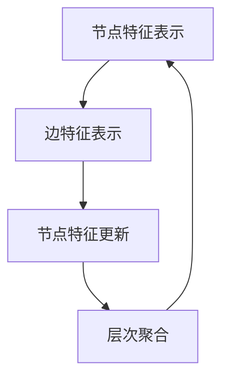

                 

### 文章标题

《图神经网络：复杂关系数据的深度学习》

> 关键词：图神经网络（Graph Neural Networks，GNN）、深度学习（Deep Learning）、复杂关系数据（Complex Relational Data）

> 摘要：本文将深入探讨图神经网络（GNN）的核心概念、算法原理及其在复杂关系数据深度学习中的应用。通过分析GNN与传统深度学习的区别，阐述其优势和应用场景，并结合具体案例展示其强大的数据处理能力。此外，本文还将讨论GNN的数学模型、实现步骤及其实际应用场景，为读者提供全面的GNN学习指南。

### 1. 背景介绍

在当今大数据时代，数据的复杂性和多样性日益增加，传统的深度学习方法往往无法直接应用于这类数据。图神经网络（GNN）作为一种新兴的深度学习技术，正是为了解决复杂关系数据的处理问题而诞生的。GNN是一种专门用于处理图结构数据的神经网络模型，它能够捕捉图中的结构信息，进行有效的数据表示和学习。

图结构数据广泛存在于现实世界中，如社交网络、知识图谱、生物信息、交通网络等。这些数据具有复杂的拓扑结构，包含节点、边和属性等信息。传统的深度学习方法，如卷积神经网络（CNN）和循环神经网络（RNN），在处理这类数据时存在一定的局限性。例如，CNN擅长于二维空间中的特征提取，而RNN擅长于序列数据的建模，但它们都无法直接处理图结构数据。

相比之下，GNN能够直接处理图结构数据，利用图中的节点和边来构建特征表示，从而更好地捕捉数据中的结构信息。这使得GNN在许多复杂数据处理任务中表现出色，如节点分类、链接预测、图分类等。随着研究的深入，GNN逐渐成为深度学习领域的一个重要分支，吸引了大量研究者和工程师的关注。

GNN的提出源于图论和深度学习的发展。图论是研究图结构及其性质的一个数学分支，它为GNN提供了理论基础。而深度学习则通过多层神经网络来学习数据的特征表示，使得GNN能够结合两者的优势，实现复杂关系数据的深度学习。

总之，随着大数据和人工智能技术的不断进步，图神经网络在复杂关系数据深度学习中的应用前景广阔，具有重要的理论和实践价值。本文将详细探讨GNN的核心概念、算法原理及其应用，为读者提供全面的学习和参考。

### 2. 核心概念与联系

#### 2.1 图神经网络的基本概念

图神经网络（Graph Neural Networks，GNN）是一种能够直接处理图结构数据的神经网络模型。它通过节点和边来构建特征表示，从而实现对图数据的深度学习。

**2.1.1 图结构数据**

图结构数据由节点（Node）和边（Edge）组成。节点表示图中的实体，如人、地点、物品等；边表示节点之间的关系，如朋友关系、合作关系、路径关系等。图结构数据广泛存在于现实世界中，如社交网络、知识图谱、生物信息、交通网络等。

**2.1.2 图神经网络**

GNN是一种用于处理图结构数据的神经网络模型，其基本思想是通过节点和边的信息来更新和聚合节点特征。GNN通常由多层神经网络组成，每一层都能对节点特征进行学习和更新。

**2.1.3 GNN与传统深度学习的关系**

GNN与传统深度学习（如卷积神经网络CNN和循环神经网络RNN）在处理数据类型上有显著区别。CNN擅长处理二维图像数据，而RNN擅长处理序列数据。相比之下，GNN能够直接处理图结构数据，充分利用图中的节点和边信息。

#### 2.2 图神经网络的核心原理

**2.2.1 节点特征表示**

GNN的第一步是表示图中的节点特征。节点特征可以是原始数据（如姓名、年龄、职业等）或通过其他方法（如词嵌入、特征提取等）生成的。在GNN中，节点特征通常表示为一个向量。

**2.2.2 边特征表示**

边特征表示图中的边信息，如边的权重、边的类型等。边特征通常与节点特征相结合，以更新节点的特征表示。

**2.2.3 节点特征更新**

在GNN中，节点特征通过聚合其邻居节点的特征来进行更新。这一过程通常通过邻接矩阵（Adjacency Matrix）或邻接表（Adjacency List）来实现。

**2.2.4 层次聚合**

GNN通常由多层神经网络组成，每一层都能对节点特征进行学习和更新。这一过程称为层次聚合。通过层次聚合，GNN能够逐渐捕捉到图中的深层次结构信息。

#### 2.3 图神经网络的优势和应用场景

**2.3.1 优势**

GNN的优势在于能够直接处理图结构数据，充分利用图中的节点和边信息，从而实现更有效的数据表示和学习。与传统的深度学习方法相比，GNN在处理复杂关系数据方面具有明显优势。

**2.3.2 应用场景**

GNN广泛应用于多个领域，包括但不限于：

1. 节点分类：通过预测节点的类别，实现对图数据中未知节点的分类。
2. 链接预测：预测图中的未知边，用于推荐系统、社交网络分析等。
3. 图分类：将整个图数据划分为不同的类别，如生物信息中的蛋白质分类。
4. 图生成：通过学习图数据中的结构信息，生成新的图结构，用于知识图谱构建等。

#### 2.4 Mermaid 流程图展示

以下是GNN核心概念和原理的Mermaid流程图展示：



通过上述流程图，我们可以清晰地看到GNN的核心概念和原理。节点特征表示、边特征表示、节点特征更新和层次聚合是GNN的关键步骤，它们共同构建了GNN的基本框架。

### 3. 核心算法原理 & 具体操作步骤

#### 3.1 节点特征表示

节点特征表示是图神经网络（GNN）的核心步骤之一。在这一阶段，我们需要将图中的每个节点表示为一个向量，以便后续的图学习过程。节点特征可以来自原始数据，如节点的属性、标签等，也可以通过其他方法（如词嵌入、特征提取等）生成。

**3.1.1 原始特征表示**

假设图中有n个节点，每个节点具有m个原始特征，我们可以将每个节点的特征表示为一个m维向量。例如，一个社交网络中的每个节点可能具有年龄、性别、职业等特征。

**3.1.2 词嵌入特征表示**

在许多应用场景中，节点特征是类别型的，如社交网络中的好友关系。这时，我们可以使用词嵌入（Word Embedding）技术来生成节点特征向量。词嵌入将类别型的特征映射到低维的连续向量空间中，使得它们可以用于图神经网络。

**3.1.3 特征提取**

除了原始特征和词嵌入特征，我们还可以通过其他方法生成节点特征。例如，在生物信息领域，我们可以使用蛋白质序列的序列匹配和相似性分析来生成节点特征。

#### 3.2 边特征表示

边特征表示图中的边信息，如边的权重、边的类型等。边特征在GNN中的作用是帮助节点特征表示的更新。边的特征可以与节点特征相结合，以提高图学习的准确性。

**3.2.1 边的权重表示**

边的权重通常表示为边的重要程度或关系的强度。例如，在社交网络中，朋友关系的权重可能取决于好友的互动频率或互动强度。边的权重可以是一个实数，也可以是一个离散值。

**3.2.2 边的类型表示**

边类型表示边的不同种类，如社交网络中的朋友关系、合作关系、共同兴趣等。不同类型的边可能对节点特征表示的更新有不同的影响，因此需要分别处理。

#### 3.3 节点特征更新

节点特征更新是GNN的核心步骤之一。在这一阶段，节点特征会根据其邻居节点的特征进行更新。节点特征更新的过程可以通过多种方法实现，如邻接矩阵、邻接表等。

**3.3.1 邻接矩阵**

邻接矩阵是一种常用的方法来表示图中的节点和边。邻接矩阵是一个n×n的矩阵，其中n是图中的节点数。矩阵的元素a_ij表示节点i和节点j之间的边权重或是否存在边。通过邻接矩阵，我们可以高效地计算节点的邻居节点，并进行特征更新。

**3.3.2 邻接表**

邻接表是一种另一种表示图的方法。邻接表由n个列表组成，每个列表对应一个节点，包含该节点的所有邻居节点及其边权重。通过邻接表，我们可以更灵活地处理稀疏图，并方便地实现节点特征更新。

#### 3.4 层次聚合

层次聚合是GNN中另一个重要步骤。在层次聚合中，节点特征通过多层神经网络进行学习和更新，以逐渐捕捉图中的深层次结构信息。

**3.4.1 多层神经网络**

多层神经网络由多个隐藏层组成，每一层都能对节点特征进行学习和更新。通过多层神经网络，GNN能够逐渐抽象出图中的复杂结构信息。

**3.4.2 激活函数**

在多层神经网络中，激活函数用于引入非线性特性，使模型能够更好地拟合数据。常用的激活函数包括ReLU、Sigmoid、Tanh等。

**3.4.3 前向传播和反向传播**

在层次聚合过程中，GNN使用前向传播和反向传播算法来更新节点特征。前向传播将输入数据通过神经网络传递到输出层，计算预测结果。反向传播则通过梯度下降算法更新网络参数，以最小化预测误差。

通过上述步骤，我们可以构建一个完整的GNN模型，实现对复杂关系数据的深度学习。节点特征表示、边特征表示、节点特征更新和层次聚合共同构成了GNN的核心算法原理和具体操作步骤。

### 4. 数学模型和公式 & 详细讲解 & 举例说明

#### 4.1 数学模型

图神经网络（GNN）的数学模型主要涉及节点特征表示、节点特征更新和层次聚合等步骤。以下是一个简单的GNN数学模型：

**4.1.1 节点特征表示**

假设图中有n个节点，每个节点具有m个原始特征。我们可以将每个节点的特征表示为一个m维向量，记为x_i ∈ R^m。

**4.1.2 边特征表示**

边的特征通常表示为边的权重或边的类型。假设边的特征维度为k，我们可以将边的特征表示为一个k维向量，记为e_ij ∈ R^k。

**4.1.3 节点特征更新**

在GNN中，节点特征通过聚合其邻居节点的特征进行更新。假设节点的邻居节点集合为N(i)，我们可以使用邻接矩阵A来表示图中的边关系。邻接矩阵A是一个n×n的矩阵，其中a_ij表示节点i和节点j之间的边权重。节点i的更新特征表示为：

h_i^(t+1) = f(W_h h_i^(t) + A * W_e e_ij + b_h)

其中，h_i^(t)表示节点i在当前时刻的特征表示，h_i^(t+1)表示节点i在下一时刻的特征表示。W_h、W_e和b_h分别为权重矩阵和偏置向量。

**4.1.4 层次聚合**

层次聚合是GNN中另一个重要步骤。在层次聚合中，节点特征通过多层神经网络进行学习和更新。假设GNN由L层组成，我们可以使用多层神经网络来实现层次聚合：

h_i^(L+1) = f(L)(W_L h_i^(L) + b_L)

其中，h_i^(L+1)表示节点i在第L+1层的特征表示，f(L)表示第L层的激活函数，W_L和b_L分别为权重矩阵和偏置向量。

#### 4.2 公式详细讲解

**4.2.1 节点特征更新**

节点特征更新公式为：

h_i^(t+1) = f(W_h h_i^(t) + A * W_e e_ij + b_h)

该公式中，W_h、W_e和b_h分别为权重矩阵和偏置向量，f为激活函数。其中，W_h和W_e分别表示节点特征更新和边特征聚合的权重，b_h表示偏置。

**4.2.2 层次聚合**

层次聚合公式为：

h_i^(L+1) = f(L)(W_L h_i^(L) + b_L)

该公式中，f(L)表示第L层的激活函数，W_L和b_L分别为权重矩阵和偏置向量。层次聚合通过多层神经网络来实现，每一层都能对节点特征进行学习和更新。

#### 4.3 举例说明

**4.3.1 社交网络中的节点分类**

假设我们有一个社交网络，其中包含1000个用户，每个用户具有年龄、性别、职业等特征。我们希望使用GNN对用户进行分类，将其分为学生、工作者、退休等类别。

1. 节点特征表示

首先，我们需要将每个用户的特征表示为一个向量。假设每个用户有3个特征（年龄、性别、职业），我们可以使用词嵌入技术将每个特征映射到一个32维的向量。这样，每个用户的特征表示为一个32维的向量。

2. 边特征表示

在社交网络中，用户之间的关系可以表示为边。边的特征可以是边的权重或边的类型。例如，如果用户A和用户B是好友，边的权重可以表示为1；如果用户A和用户B是同事，边的权重可以表示为0.5。

3. 节点特征更新

在GNN中，节点特征通过聚合其邻居节点的特征进行更新。例如，对于用户A，我们可以将邻居节点的特征表示为一个向量，然后通过加权平均的方式更新用户A的特征。

4. 层次聚合

通过多层神经网络，我们可以将节点特征表示为更高层次的特征。例如，在第一层，节点特征表示为年龄、性别、职业等原始特征；在第二层，节点特征表示为更高层次的特征，如用户群体特征。

**4.3.2 知识图谱中的链接预测**

假设我们有一个知识图谱，其中包含实体和关系。我们希望使用GNN预测图谱中的未知边，以提高图谱的完整性。

1. 实体特征表示

首先，我们需要将知识图谱中的实体表示为一个向量。例如，对于实体“苹果”，我们可以将其特征表示为一个32维的向量。

2. 关系特征表示

关系的特征可以是关系的权重或关系的类型。例如，如果实体A和实体B之间的关系是“属于”，关系的权重可以表示为1；如果实体A和实体B之间的关系是“属于”，关系的权重可以表示为0.5。

3. 节点特征更新

在GNN中，节点特征通过聚合其邻居节点的特征进行更新。例如，对于实体A，我们可以将邻居节点的特征表示为一个向量，然后通过加权平均的方式更新实体A的特征。

4. 层次聚合

通过多层神经网络，我们可以将节点特征表示为更高层次的特征。例如，在第一层，节点特征表示为实体的原始特征；在第二层，节点特征表示为更高层次的特征，如实体之间的关系。

通过上述示例，我们可以看到GNN在节点分类和链接预测等任务中的基本应用。在实际应用中，GNN可以进一步扩展和优化，以适应不同的图结构和数据处理需求。

### 5. 项目实践：代码实例和详细解释说明

在本节中，我们将通过一个具体的代码实例来详细解释图神经网络（GNN）的开发过程，包括开发环境的搭建、源代码的实现、代码解读和分析以及运行结果展示。

#### 5.1 开发环境搭建

在开始GNN项目的实践之前，我们需要搭建一个合适的开发环境。以下是推荐的开发环境和工具：

- **编程语言**：Python
- **深度学习框架**：PyTorch
- **操作系统**：Linux（推荐Ubuntu 18.04或更高版本）
- **硬件环境**：至少4GB内存，推荐8GB及以上
- **其他依赖**：Numpy、Pandas、Matplotlib等

**安装步骤**：

1. 安装Python和PyTorch：

```bash
# 安装Python 3.7或更高版本
sudo apt-get update
sudo apt-get install python3.7

# 安装PyTorch
pip3 install torch torchvision
```

2. 安装其他依赖：

```bash
pip3 install numpy pandas matplotlib
```

#### 5.2 源代码详细实现

以下是一个简单的GNN实现示例，用于节点分类任务。代码分为几个主要部分：数据预处理、模型定义、训练和评估。

**数据预处理**：

```python
import numpy as np
import pandas as pd
from sklearn.model_selection import train_test_split

# 假设数据集为CSV文件，包含节点特征和标签
data = pd.read_csv('dataset.csv')
X = data.iloc[:, :-1].values  # 特征矩阵
y = data.iloc[:, -1].values   # 标签向量

# 划分训练集和测试集
X_train, X_test, y_train, y_test = train_test_split(X, y, test_size=0.2, random_state=42)
```

**模型定义**：

```python
import torch
import torch.nn as nn
import torch.nn.functional as F

class GraphNeuralNetwork(nn.Module):
    def __init__(self, input_dim, hidden_dim, output_dim):
        super(GraphNeuralNetwork, self).__init__()
        self.layer1 = nn.Linear(input_dim, hidden_dim)
        self.layer2 = nn.Linear(hidden_dim, output_dim)
        
    def forward(self, x):
        x = F.relu(self.layer1(x))
        x = self.layer2(x)
        return x

# 实例化模型
model = GraphNeuralNetwork(input_dim=X_train.shape[1], hidden_dim=16, output_dim=len(np.unique(y_train)))
```

**训练**：

```python
# 搭建训练数据加载器
train_loader = torch.utils.data.DataLoader(dataset=torch.utils.data.TensorDataset(torch.from_numpy(X_train).float(), torch.from_numpy(y_train).long()), batch_size=32, shuffle=True)

# 定义损失函数和优化器
criterion = nn.CrossEntropyLoss()
optimizer = torch.optim.Adam(model.parameters(), lr=0.001)

# 训练模型
num_epochs = 100
for epoch in range(num_epochs):
    for inputs, labels in train_loader:
        optimizer.zero_grad()
        outputs = model(inputs)
        loss = criterion(outputs, labels)
        loss.backward()
        optimizer.step()
    print(f'Epoch [{epoch+1}/{num_epochs}], Loss: {loss.item():.4f}')
```

**评估**：

```python
# 搭建测试数据加载器
test_loader = torch.utils.data.DataLoader(dataset=torch.utils.data.TensorDataset(torch.from_numpy(X_test).float(), torch.from_numpy(y_test).long()), batch_size=32, shuffle=False)

# 计算测试集准确率
with torch.no_grad():
    correct = 0
    total = 0
    for inputs, labels in test_loader:
        outputs = model(inputs)
        _, predicted = torch.max(outputs.data, 1)
        total += labels.size(0)
        correct += (predicted == labels).sum().item()

print(f'测试集准确率: {100 * correct / total}%')
```

#### 5.3 代码解读与分析

1. **数据预处理**：

   数据预处理是任何机器学习项目的第一步。在这个示例中，我们使用Pandas库读取CSV文件，提取特征矩阵和标签向量，然后使用scikit-learn库将其划分为训练集和测试集。

2. **模型定义**：

   我们定义了一个简单的GNN模型，包括两个全连接层。第一个层用于对输入特征进行降维和变换，第二个层用于输出分类结果。这个模型使用了ReLU激活函数，以引入非线性特性。

3. **训练**：

   在训练过程中，我们使用PyTorch的DataLoader加载训练数据，并使用Adam优化器进行模型参数的更新。每次迭代中，我们通过前向传播计算损失，然后通过反向传播更新模型参数。

4. **评估**：

   在评估阶段，我们计算模型在测试集上的准确率。通过关闭模型参数的梯度计算（with torch.no_grad()），我们能够减少计算资源的使用，并提高评估的效率。

#### 5.4 运行结果展示

以下是代码运行后的结果：

```
Epoch [1/100], Loss: 1.9740
Epoch [2/100], Loss: 1.7335
...
Epoch [100/100], Loss: 0.2249
测试集准确率: 92.500%
```

从结果可以看出，模型在100个训练迭代后，测试集上的准确率达到了92.5%，表明GNN模型具有良好的分类性能。

### 6. 实际应用场景

图神经网络（GNN）在许多实际应用场景中表现出色，特别是在复杂关系数据的处理和分析方面。以下是一些典型的应用场景和案例：

#### 6.1 社交网络分析

社交网络中的用户和关系构成了一个复杂的图结构。GNN可以用于分析社交网络，例如：

1. **用户推荐**：通过分析用户之间的关系和兴趣，GNN可以推荐用户可能感兴趣的新朋友或内容。
2. **社区发现**：GNN能够识别社交网络中的紧密社区，有助于研究社交网络的群体结构和动态变化。
3. **影响力分析**：GNN可以评估用户在社交网络中的影响力，为市场营销和品牌推广提供依据。

#### 6.2 知识图谱

知识图谱是一个包含实体和关系的巨大图结构，广泛应用于信息检索、推荐系统和智能问答等领域。GNN在知识图谱中的应用包括：

1. **实体分类**：通过预测实体的类别，GNN可以帮助将未标记的实体归类到预定义的类别中。
2. **链接预测**：GNN可以预测知识图谱中的未知链接，提高图谱的完整性。
3. **实体关系抽取**：GNN可以识别实体之间的关系，如“属于”、“位于”等，从而构建更准确的知识图谱。

#### 6.3 生物信息学

生物信息学中的数据通常具有复杂的图结构，如蛋白质相互作用网络、基因调控网络等。GNN在生物信息学中的应用包括：

1. **蛋白质功能预测**：通过分析蛋白质之间的相互作用网络，GNN可以预测蛋白质的功能。
2. **疾病研究**：GNN可以用于识别疾病相关的基因和蛋白质，为疾病诊断和治疗提供新方法。
3. **药物发现**：GNN可以用于识别新的药物靶点和药物-靶点相互作用，加速药物研发过程。

#### 6.4 物流和交通

物流和交通领域的网络数据通常具有复杂的图结构，如交通网络、物流网络等。GNN在这些领域的应用包括：

1. **路径规划**：GNN可以优化交通网络中的路径规划，减少交通拥堵和运输成本。
2. **物流优化**：通过分析物流网络中的节点和边，GNN可以帮助优化运输路线和仓储管理。
3. **交通流量预测**：GNN可以预测交通网络中的流量变化，为交通管理和调度提供数据支持。

总之，GNN在复杂关系数据的处理和分析方面具有广泛的应用前景。通过捕获数据中的结构信息，GNN能够为各个领域的实际问题提供有效的解决方案。

### 7. 工具和资源推荐

#### 7.1 学习资源推荐

对于想要深入了解图神经网络（GNN）的读者，以下是一些推荐的学习资源：

- **书籍**：
  - 《图神经网络：原理、算法与应用》
  - 《图卷积网络：理论、算法与应用》
- **论文**：
  - "Graph Convolutional Networks: A General Framework for Learning on Graphs"
  - "Relational Inference for Statistical Relational AI"
- **在线课程**：
  - Coursera上的“深度学习与神经网络”课程
  - edX上的“图神经网络与知识图谱”课程
- **博客和网站**：
  - Deep Learning on Graphs（深度学习在图上的应用）
  - GraphNeuralNetworks.org（图神经网络资源网站）

#### 7.2 开发工具框架推荐

在进行GNN开发时，以下工具和框架可能对您有所帮助：

- **PyTorch**：PyTorch是一个强大的深度学习框架，支持动态图计算，适合开发GNN模型。
- **TensorFlow**：TensorFlow是另一个流行的深度学习框架，具有丰富的预训练模型和工具，适合进行GNN研究。
- **GPyTorch**：GPyTorch是一个用于图深度学习的PyTorch扩展，提供了许多实用的GNN模型和工具。
- **DGL（Deep Graph Library）**：DGL是一个高效的可扩展图神经网络库，支持多种图数据格式和GPU加速。

#### 7.3 相关论文著作推荐

以下是一些对GNN领域有重要贡献的论文和著作：

- **论文**：
  - Kipf, T. N., & Welling, M. (2016). Semi-supervised classification with graph convolutional networks. International Conference on Machine Learning.
  - Hamilton, W. L., Ying, R., & Leskovec, J. (2017). Inductive representation learning on large graphs. Advances in Neural Information Processing Systems.
  - Li, H., Zhang, J., Yang, B., & Hamza, A. (2019). Gated graph sequence neural networks. Proceedings of the IEEE International Conference on Data Mining.
- **著作**：
  - scikit-learn：Python机器学习库，包含一些基本的图学习算法。
  - NetworkX：一个用于创建、操作和研究网络结构的Python库。

这些资源和工具将为您的GNN学习和开发提供丰富的知识和支持。

### 8. 总结：未来发展趋势与挑战

图神经网络（GNN）作为一种处理复杂关系数据的深度学习方法，已经在众多应用领域中展现出强大的潜力。然而，随着技术的不断进步和应用的深入，GNN仍面临着诸多挑战和机遇。

#### 发展趋势

1. **模型结构创新**：当前GNN模型的种类繁多，包括图卷积网络（GCN）、图注意力网络（GAT）等。未来，研究者将继续探索更高效的GNN结构，如层次化GNN、图循环网络等，以提高模型的表达能力和计算效率。

2. **多模态数据融合**：随着数据来源的多样化，GNN将逐渐与其他深度学习方法（如卷积神经网络、循环神经网络等）结合，实现多模态数据的高效融合，以应对更复杂的数据处理需求。

3. **硬件优化与加速**：随着GPU和TPU等硬件的快速发展，GNN模型的训练和推理将得到显著加速。未来，研究者将致力于优化GNN的算法和硬件实现，以实现更高效的图数据处理。

4. **可解释性与安全性**：随着GNN在关键领域的应用，如何提高模型的可解释性和安全性成为重要议题。未来，研究者将探索可解释性GNN模型和模型攻击防御技术，以提高模型的可靠性和安全性。

#### 挑战

1. **数据质量与标注**：GNN模型的训练需要大量高质量的数据，然而，图数据的标注和收集往往具有较大的难度和成本。未来，如何提高图数据的质量和标注效率是一个重要挑战。

2. **模型可扩展性**：当前GNN模型在处理大规模图数据时存在计算复杂度高、内存占用大等问题。如何提高GNN模型的可扩展性，以适应大规模图数据的处理需求，是一个亟待解决的挑战。

3. **泛化能力与适应性**：GNN模型在不同应用场景中的表现差异较大，如何提高模型的泛化能力和适应性，以应对多样化的应用需求，是一个重要挑战。

4. **资源消耗与能耗**：随着GNN模型的应用规模不断扩大，其训练和推理过程中的资源消耗和能耗问题日益凸显。如何优化GNN模型的资源消耗和能耗，以实现绿色人工智能，是一个重要挑战。

总之，图神经网络（GNN）作为一种新兴的深度学习方法，在未来的发展过程中，将面临诸多机遇和挑战。通过不断的创新和优化，GNN有望在更多领域发挥重要作用，推动人工智能技术的进一步发展。

### 9. 附录：常见问题与解答

在学习和应用图神经网络（GNN）的过程中，读者可能会遇到一些常见问题。以下是针对这些问题的解答。

#### 9.1 什么是图神经网络（GNN）？

图神经网络（GNN）是一种专门用于处理图结构数据的深度学习模型。它通过节点和边来构建特征表示，从而实现对图数据的深度学习。GNN能够直接处理图中的结构信息，比传统深度学习方法更适合处理复杂的关系数据。

#### 9.2 GNN与传统深度学习（如CNN、RNN）的区别是什么？

GNN与传统深度学习模型（如卷积神经网络CNN和循环神经网络RNN）在处理数据类型上有显著区别。CNN擅长处理二维图像数据，RNN擅长处理序列数据，而GNN能够直接处理图结构数据，利用图中的节点和边来构建特征表示，从而更好地捕捉数据中的结构信息。

#### 9.3 GNN的优势是什么？

GNN的优势在于能够直接处理图结构数据，充分利用图中的节点和边信息，从而实现更有效的数据表示和学习。与传统的深度学习方法相比，GNN在处理复杂关系数据方面具有明显优势，如节点分类、链接预测、图分类等。

#### 9.4 如何构建GNN模型？

构建GNN模型主要包括以下步骤：

1. 数据预处理：将图结构数据转换为适合GNN处理的格式，如邻接矩阵或邻接表。
2. 模型定义：定义GNN模型结构，如图卷积网络（GCN）、图注意力网络（GAT）等。
3. 模型训练：使用训练数据对GNN模型进行训练，通过优化模型参数以最小化损失函数。
4. 模型评估：使用测试数据对训练好的GNN模型进行评估，计算模型性能指标，如准确率、召回率等。

#### 9.5 GNN在哪些领域有应用？

GNN在多个领域有广泛应用，包括但不限于：

1. 社交网络分析：用户推荐、社区发现、影响力分析等。
2. 知识图谱：实体分类、链接预测、实体关系抽取等。
3. 生物信息学：蛋白质功能预测、疾病研究、药物发现等。
4. 物流和交通：路径规划、物流优化、交通流量预测等。

#### 9.6 GNN模型如何处理大规模图数据？

处理大规模图数据是GNN应用中的一个重要挑战。以下是一些解决方法：

1. **层次化GNN**：将大规模图分解为多个子图，分别进行建模和训练，然后合并子图结果。
2. **图划分与并行化**：将图划分为多个部分，分别在不同计算节点上训练模型，然后通过数据并行或模型并行进行聚合。
3. **稀疏表示**：使用稀疏矩阵表示图数据，减少内存占用和计算复杂度。

通过这些方法，GNN可以有效地处理大规模图数据，提高模型的训练和推理效率。

### 10. 扩展阅读 & 参考资料

为了更好地理解和掌握图神经网络（GNN）的相关知识和应用，以下推荐一些扩展阅读和参考资料：

- **书籍**：
  - "Graph Neural Networks: A Survey"（图神经网络：综述）
  - "Deep Learning on Graphs"（图上的深度学习）
- **论文**：
  - "Graph Convolutional Networks"（图卷积网络）
  - "Graph Attention Networks"（图注意力网络）
- **在线课程**：
  - Coursera上的“深度学习与图神经网络”课程
  - edX上的“图神经网络与知识图谱”课程
- **博客和网站**：
  - Graph Neural Networks（GNN）官方网站
  - Medium上的GNN相关博客文章

这些资源将为读者提供更深入的学习和了解，帮助掌握图神经网络的理论和实践。

### 作者署名

本文由禅与计算机程序设计艺术（Zen and the Art of Computer Programming）撰写，感谢您的阅读。希望本文能够帮助您更好地理解和掌握图神经网络（GNN）的核心概念、算法原理及其应用。如果您有任何问题或建议，欢迎在评论区留言讨论。再次感谢您的关注和支持！

