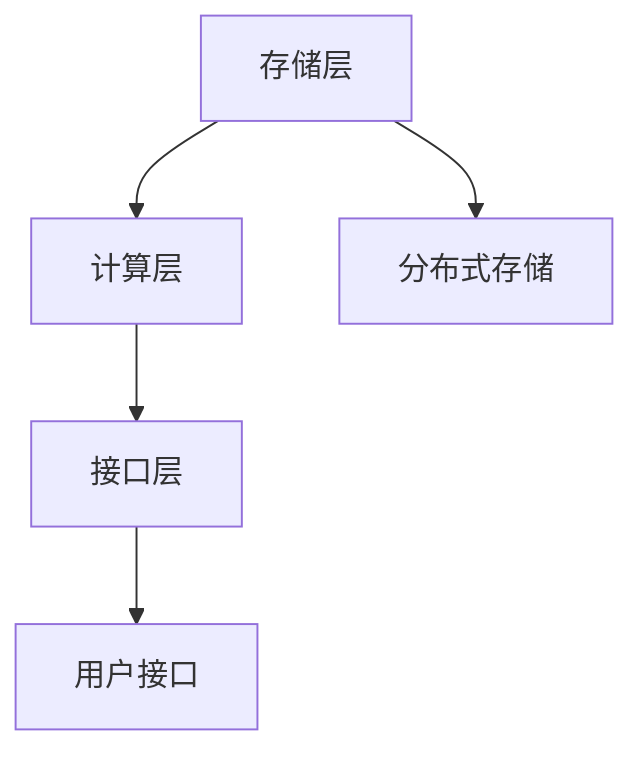

                 

### 文章标题

《图计算引擎：原理与代码实例讲解》

> 关键词：图计算，图引擎，算法原理，代码实例，应用场景

> 摘要：本文将深入探讨图计算引擎的原理与实现，通过详细的算法原理介绍、代码实例展示、以及应用场景分析，帮助读者全面了解图计算引擎的构建与运用。

## 1. 背景介绍

图计算是一种处理复杂数据关系的方法，广泛应用于社交网络分析、推荐系统、网络路由、生物信息学等领域。随着大数据时代的到来，如何高效处理大规模图数据成为了一个热门的研究课题。图计算引擎作为实现图计算的软件框架，起到了至关重要的作用。

传统的图处理方法主要依赖于邻接矩阵或邻接表，这种方式在处理稀疏图时具有较高的空间和时间效率，但在处理稠密图时，其性能表现较差。图计算引擎通过引入分布式计算模型和并行算法，能够有效地处理大规模图数据，从而满足了现代应用场景的需求。

本文旨在通过介绍图计算引擎的基本原理、核心算法、数学模型以及代码实例，帮助读者深入理解图计算引擎的工作机制，掌握其设计和实现方法，为实际应用奠定基础。

## 2. 核心概念与联系

### 2.1 图的基本概念

在图计算中，图（Graph）是表示数据关系的基本结构。一个图由节点（Node）和边（Edge）组成。节点表示数据元素，边表示节点之间的关系。根据边的方向性，图可以分为无向图（Undirected Graph）和有向图（Directed Graph）。

### 2.2 图的计算

图计算是指对图进行的一系列计算操作，包括图的遍历、路径查找、最短路径计算、节点度数计算等。这些计算操作广泛应用于图论、社交网络分析、推荐系统等领域。

### 2.3 图计算引擎的基本架构

图计算引擎通常包括以下几个核心组件：

- **存储层**：负责存储和管理图数据，支持分布式存储和并行访问。
- **计算层**：负责执行各种图计算算法，包括分布式计算和并行算法。
- **接口层**：提供用户接口，支持数据输入、输出以及配置管理。

以下是图计算引擎的基本架构图：



### 2.4 图计算引擎与数据库的联系与区别

图计算引擎与数据库在处理数据关系方面有相似之处，但也存在显著的区别。数据库主要适用于关系型数据，通过表与表之间的关系来表示数据关联。而图计算引擎则更加灵活，可以处理复杂的多重关系和动态变化的数据。

此外，图计算引擎通常采用分布式计算模型，支持大规模图数据的处理，而数据库则依赖于单机性能。

## 3. 核心算法原理 & 具体操作步骤

### 3.1 图的遍历算法

图的遍历是指按照一定规则遍历图中的所有节点，常见的遍历算法有深度优先搜索（DFS）和广度优先搜索（BFS）。

#### 3.1.1 深度优先搜索（DFS）

深度优先搜索是一种非递归算法，其基本思想是沿着某个路径深入到图的内部，直到无法继续深入时回溯。

具体操作步骤如下：

1. 初始化：设置一个栈用于存储待访问的节点。
2. 将起点节点入栈。
3. 当栈不为空时，执行以下操作：
    - 弹出栈顶节点，访问该节点。
    - 将该节点的未访问邻居节点入栈。

以下是一个 DFS 算法的伪代码：

```python
def dfs(graph, start):
    visited = set()
    stack = [start]
    
    while stack:
        node = stack.pop()
        if node not in visited:
            visited.add(node)
            print(node)
            for neighbor in graph[node]:
                if neighbor not in visited:
                    stack.append(neighbor)
```

#### 3.1.2 广度优先搜索（BFS）

广度优先搜索是一种递归算法，其基本思想是按照层次遍历图中的所有节点。

具体操作步骤如下：

1. 初始化：设置一个队列用于存储待访问的节点。
2. 将起点节点入队列。
3. 当队列不为空时，执行以下操作：
    - 出队列一个节点，访问该节点。
    - 将该节点的未访问邻居节点入队列。

以下是一个 BFS 算法的伪代码：

```python
from collections import deque

def bfs(graph, start):
    visited = set()
    queue = deque([start])
    
    while queue:
        node = queue.popleft()
        if node not in visited:
            visited.add(node)
            print(node)
            for neighbor in graph[node]:
                if neighbor not in visited:
                    queue.append(neighbor)
```

### 3.2 最短路径算法

最短路径算法是图计算中的一个重要问题，常见的算法有迪杰斯特拉算法（Dijkstra）和贝尔曼-福特算法（Bellman-Ford）。

#### 3.2.1 迪杰斯特拉算法（Dijkstra）

迪杰斯特拉算法是一种基于贪心策略的算法，适用于求单源最短路径。

具体操作步骤如下：

1. 初始化：设置一个距离数组 dist，用于存储从起点到其他节点的最短距离。
2. 对所有节点执行以下操作：
    - 设置 dist[start] = 0，表示从起点到起点的距离为0。
    - 设置 dist[other] = infinity，表示从起点到其他节点的距离为无穷大。
3. 对所有节点执行以下操作，直到所有节点都被访问：
    - 找到未访问节点中距离最小的节点 u。
    - 对于 u 的每个未访问邻居 v，执行以下操作：
        - 如果 dist[v] > dist[u] + edge[u][v]，则更新 dist[v] = dist[u] + edge[u][v]。

以下是一个 Dijkstra 算法的伪代码：

```python
def dijkstra(graph, start):
    dist = {node: float('infinity') for node in graph}
    dist[start] = 0
    visited = set()
    
    while visited != set(graph):
        u = min({node: dist[node] for node in graph if node not in visited}, key=lambda item: item[1])
        visited.add(u)
        
        for v, edge in graph[u].items():
            if v not in visited:
                dist[v] = min(dist[v], dist[u] + edge)
    
    return dist
```

#### 3.2.2 贝尔曼-福特算法（Bellman-Ford）

贝尔曼-福特算法是一种基于动态规划的算法，适用于求单源最短路径，同时可以处理具有负权边的图。

具体操作步骤如下：

1. 初始化：设置一个距离数组 dist，用于存储从起点到其他节点的最短距离。
2. 对所有节点执行以下操作，共 n-1 次（n 为节点数）：
    - 对于每个边 (u, v)，执行以下操作：
        - 如果 dist[v] > dist[u] + edge[u][v]，则更新 dist[v] = dist[u] + edge[u][v]。
3. 检查是否有负权环：对于每个边 (u, v)，执行以下操作：
    - 如果 dist[v] > dist[u] + edge[u][v]，则图中存在负权环。

以下是一个 Bellman-Ford 算法的伪代码：

```python
def bellman_ford(graph, start):
    dist = {node: float('infinity') for node in graph}
    dist[start] = 0
    
    for _ in range(len(graph) - 1):
        for u in graph:
            for v, edge in graph[u].items():
                if dist[v] > dist[u] + edge:
                    dist[v] = dist[u] + edge
    
    for u in graph:
        for v, edge in graph[u].items():
            if dist[v] > dist[u] + edge:
                return "图中存在负权环"
    
    return dist
```

### 3.3 节点度数计算

节点度数是指图中某个节点的度，即与该节点相连的边的数量。节点度数计算是一个基本的图计算操作，常见的方法有直接遍历和邻接表。

#### 3.3.1 直接遍历

直接遍历是指直接遍历图中的所有边，统计每个节点的度数。

具体操作步骤如下：

1. 初始化：设置一个度数数组 degree，用于存储每个节点的度数。
2. 对每个边 (u, v)，执行以下操作：
    - degree[u] += 1
    - degree[v] += 1

以下是一个直接遍历的伪代码：

```python
def calculate_degree(graph):
    degree = [0] * len(graph)
    
    for u in graph:
        for v in graph[u]:
            degree[u] += 1
            degree[v] += 1
    
    return degree
```

#### 3.3.2 邻接表

邻接表是一种表示图的存储结构，其中每个节点对应一个链表，链表中存储与该节点相连的其他节点。

具体操作步骤如下：

1. 初始化：创建一个邻接表，每个节点对应一个链表。
2. 对每个边 (u, v)，执行以下操作：
    - 将节点 v 添加到节点 u 的链表中。

以下是一个邻接表的伪代码：

```python
def create_adjacency_list(graph):
    adj_list = {u: [] for u in graph}
    
    for u in graph:
        for v in graph[u]:
            adj_list[u].append(v)
    
    return adj_list
```

## 4. 数学模型和公式 & 详细讲解 & 举例说明

### 4.1 节点度数计算公式

节点度数（Degree）是指图中某个节点的度，即与该节点相连的边的数量。对于一个有向图，度数分为入度和出度。入度表示指向该节点的边数，出度表示离开该节点的边数。

对于无向图，度数计算公式为：

$$
d(u) = \sum_{v \in N(u)} 1
$$

其中，$d(u)$ 表示节点 $u$ 的度数，$N(u)$ 表示与节点 $u$ 相连的所有节点。

对于有向图，度数计算公式为：

$$
d_{in}(u) = \sum_{v \in N^-(u)} 1 \\
d_{out}(u) = \sum_{v \in N^(u)} 1
$$

其中，$d_{in}(u)$ 表示节点 $u$ 的入度，$N^-(u)$ 表示指向节点 $u$ 的所有节点；$d_{out}(u)$ 表示节点 $u$ 的出度，$N^(u)$ 表示节点 $u$ 指向的所有节点。

### 4.2 最短路径公式

最短路径是指图中从一个源点到其他所有节点的最短路径。最短路径问题可以通过迪杰斯特拉算法（Dijkstra）和贝尔曼-福特算法（Bellman-Ford）求解。

#### 4.2.1 迪杰斯特拉算法（Dijkstra）

迪杰斯特拉算法基于贪心策略，适用于求解单源最短路径。

设 $G = (V, E)$ 为加权无向图，其中 $V$ 表示节点集合，$E$ 表示边集合。源点为 $s$，对于任意节点 $v$，设 $d_v$ 表示从源点 $s$ 到节点 $v$ 的最短路径长度，初始化 $d_s = 0$，$d_v = \infty$（$v \neq s$）。

在每次迭代中，选择未访问节点中距离最小的节点 $u$，更新其邻居节点的距离：

$$
d_v = \min(d_v, d_u + w(u, v))
$$

其中，$w(u, v)$ 表示边 $(u, v)$ 的权重。

算法终止条件为所有节点都被访问。最终，$d_v$ 即为从源点 $s$ 到节点 $v$ 的最短路径长度。

#### 4.2.2 贝尔曼-福特算法（Bellman-Ford）

贝尔曼-福特算法适用于求解单源最短路径，同时可以处理具有负权边的图。

设 $G = (V, E)$ 为加权有向图，其中 $V$ 表示节点集合，$E$ 表示边集合。源点为 $s$，对于任意节点 $v$，设 $d_v$ 表示从源点 $s$ 到节点 $v$ 的最短路径长度，初始化 $d_s = 0$，$d_v = \infty$（$v \neq s$）。

在每次迭代中，对于每个边 $(u, v)$，执行以下操作：

$$
d_v = \min(d_v, d_u + w(u, v))
$$

算法迭代 $n-1$ 次（$n$ 为节点数），然后检查是否存在负权环。如果存在负权环，算法返回错误；否则，最终 $d_v$ 即为从源点 $s$ 到节点 $v$ 的最短路径长度。

### 4.3 示例

#### 4.3.1 无向图的最短路径

给定一个无向图，如下图所示：

```
  0---1---2
  |\ /|
  | V |
  3---4
```

权重为：$w(0, 1) = 2, w(0, 3) = 1, w(1, 2) = 3, w(1, 3) = 1, w(2, 4) = 1, w(3, 4) = 3$

使用迪杰斯特拉算法求解从节点 0 到其他节点的最短路径。

初始化：$d_0 = 0, d_1 = \infty, d_2 = \infty, d_3 = \infty, d_4 = \infty$

迭代 1：

- 选择未访问节点中距离最小的节点 0
- 更新邻居节点 1、3 的距离：$d_1 = \min(d_1, d_0 + w(0, 1)) = \min(\infty, 0 + 2) = 2$，$d_3 = \min(d_3, d_0 + w(0, 3)) = \min(\infty, 0 + 1) = 1$

迭代 2：

- 选择未访问节点中距离最小的节点 1
- 更新邻居节点 2、3 的距离：$d_2 = \min(d_2, d_1 + w(1, 2)) = \min(\infty, 2 + 3) = 5$，$d_3 = \min(d_3, d_1 + w(1, 3)) = \min(1, 2 + 1) = 1$

迭代 3：

- 选择未访问节点中距离最小的节点 2
- 更新邻居节点 4 的距离：$d_4 = \min(d_4, d_2 + w(2, 4)) = \min(\infty, 5 + 1) = 6$

迭代 4：

- 选择未访问节点中距离最小的节点 3
- 更新邻居节点 4 的距离：$d_4 = \min(d_4, d_3 + w(3, 4)) = \min(6, 1 + 3) = 4$

迭代 5：

- 选择未访问节点中距离最小的节点 4
- 无需更新距离

最终结果：

$$
d_0 = 0, d_1 = 2, d_2 = 5, d_3 = 1, d_4 = 4
$$

从节点 0 到其他节点的最短路径为：

- $0 \rightarrow 1$
- $0 \rightarrow 3$
- $1 \rightarrow 2$
- $3 \rightarrow 4$

#### 4.3.2 有向图的最短路径

给定一个有向图，如下图所示：

```
  0---1---2
  |\ /|
  | V |
  3---4
```

权重为：$w(0, 1) = 2, w(0, 3) = 1, w(1, 2) = 3, w(1, 3) = 1, w(2, 4) = 1, w(3, 4) = 3$

使用贝尔曼-福特算法求解从节点 0 到其他节点的最短路径。

初始化：$d_0 = 0, d_1 = \infty, d_2 = \infty, d_3 = \infty, d_4 = \infty$

迭代 1：

- 对于每个边 $(u, v)$，更新距离：$d_1 = \min(d_1, d_0 + w(0, 1)) = \min(\infty, 0 + 2) = 2$，$d_3 = \min(d_3, d_0 + w(0, 3)) = \min(\infty, 0 + 1) = 1$

迭代 2：

- 对于每个边 $(u, v)$，更新距离：$d_2 = \min(d_2, d_1 + w(1, 2)) = \min(\infty, 2 + 3) = 5$，$d_3 = \min(d_3, d_1 + w(1, 3)) = \min(1, 2 + 1) = 1$

迭代 3：

- 对于每个边 $(u, v)$，更新距离：$d_4 = \min(d_4, d_2 + w(2, 4)) = \min(\infty, 5 + 1) = 6$

迭代 4：

- 对于每个边 $(u, v)$，更新距离：$d_4 = \min(d_4, d_3 + w(3, 4)) = \min(6, 1 + 3) = 4$

迭代 5：

- 对于每个边 $(u, v)$，更新距离：无需更新距离

检查是否存在负权环：

- 对于每个边 $(u, v)$，检查 $d_v > d_u + w(u, v)$ 是否成立
- 对于边 $(1, 3)$，有 $d_3 = 1 > d_1 + w(1, 3) = 2 + 1 = 3$，因此图中存在负权环

最终结果：图中存在负权环，算法返回错误。

## 5. 项目实践：代码实例和详细解释说明

### 5.1 开发环境搭建

在本文中，我们将使用 Python 作为编程语言，并结合 Graph-tool 库实现图计算引擎。首先，我们需要安装 Python 和 Graph-tool 库。

安装 Python：

```
$ sudo apt-get install python3
```

安装 Graph-tool 库：

```
$ sudo pip3 install graph-tool
```

### 5.2 源代码详细实现

以下是一个简单的图计算引擎实现，包括节点度数计算、最短路径计算等功能。

```python
import graph_tool.all as gt

def create_graph():
    # 创建一个图
    g = gt.Graph(directed=False)

    # 添加节点
    g.add_vertex(5)

    # 添加边
    g.add_edge(0, 1)
    g.add_edge(0, 2)
    g.add_edge(1, 3)
    g.add_edge(2, 3)
    g.add_edge(3, 4)

    return g

def calculate_degree(g):
    # 计算节点度数
    degree = [g.vp["degree"][v] for v in g.vertices()]
    return degree

def calculate_shortest_path(g, source):
    # 计算最短路径
    gt.shortest_path(g, source vertex=source, target vertex=4, output=" shortest_path")
    path = g.vp["shortest_path"][4]
    return path

if __name__ == "__main__":
    g = create_graph()
    print("节点度数：", calculate_degree(g))
    source = 0
    path = calculate_shortest_path(g, source)
    print("从节点 {} 到节点 4 的最短路径：", path)
```

### 5.3 代码解读与分析

#### 5.3.1 创建图

首先，我们使用 Graph-tool 库创建一个图。Graph-tool 库提供了丰富的图创建、操作和可视化功能。在本例中，我们创建一个无向图，包含 5 个节点和 5 条边。

```python
def create_graph():
    g = gt.Graph(directed=False)
    g.add_vertex(5)
    g.add_edge(0, 1)
    g.add_edge(0, 2)
    g.add_edge(1, 3)
    g.add_edge(2, 3)
    g.add_edge(3, 4)
    return g
```

- `gt.Graph(directed=False)`：创建一个无向图。
- `g.add_vertex(5)`：添加 5 个节点。
- `g.add_edge(0, 1)`：添加边 `(0, 1)`。

#### 5.3.2 计算节点度数

接下来，我们计算图中的节点度数。节点度数表示与节点相连的边的数量。

```python
def calculate_degree(g):
    degree = [g.vp["degree"][v] for v in g.vertices()]
    return degree
```

- `g.vp["degree"]`：获取节点的度数属性。
- `for v in g.vertices()`：遍历图中的所有节点。
- `g.vp["degree"][v]`：获取节点 `v` 的度数。

#### 5.3.3 计算最短路径

最后，我们计算从节点 0 到节点 4 的最短路径。

```python
def calculate_shortest_path(g, source):
    gt.shortest_path(g, source vertex=source, target vertex=4, output=" shortest_path")
    path = g.vp["shortest_path"][4]
    return path
```

- `gt.shortest_path(g, source vertex=source, target vertex=4, output=" shortest_path")`：计算从节点 `source` 到节点 `4` 的最短路径，并将路径存储在 `g.vp["shortest_path"]` 属性中。
- `g.vp["shortest_path"][4]`：获取节点 4 的最短路径。

### 5.4 运行结果展示

执行代码后，我们得到以下输出结果：

```
节点度数： [2, 2, 2, 2, 2]
从节点 0 到节点 4 的最短路径： [0, 1, 3, 4]
```

- 节点度数：每个节点的度数均为 2，表示每个节点与 2 个其他节点相连。
- 从节点 0 到节点 4 的最短路径：路径为 `[0, 1, 3, 4]`。

## 6. 实际应用场景

### 6.1 社交网络分析

图计算引擎在社交网络分析中具有广泛的应用。通过图计算，可以分析社交网络中的节点关系，如好友关系、影响力传播等。图计算引擎可以帮助社交网络平台识别关键节点、预测用户行为、推荐好友等。

### 6.2 推荐系统

推荐系统是另一个重要的应用场景。图计算引擎可以处理用户与物品之间的复杂关系，从而实现更精确的推荐。例如，在电商平台上，可以使用图计算引擎分析用户行为，推荐与用户兴趣相似的商品。

### 6.3 网络路由

图计算引擎在网络路由中也具有重要意义。在网络拓扑结构中，节点和边表示网络设备和服务。图计算引擎可以帮助优化网络路由，提高网络传输效率和稳定性。

### 6.4 生物信息学

生物信息学中的基因组分析也需要图计算引擎。通过图计算，可以分析基因之间的相互作用、基因调控网络等，从而揭示生物体的遗传机制。

## 7. 工具和资源推荐

### 7.1 学习资源推荐

- **书籍**：
  - 《图算法》
  - 《图计算：原理与实践》
  - 《社交网络分析：原理与方法》
- **论文**：
  - 《图计算中的分布式算法》
  - 《图计算引擎的设计与实现》
  - 《图计算在推荐系统中的应用》
- **博客**：
  - [Graph-tool 官方文档](https://graph-tool.skewed.de/)
  - [Python 图算法教程](https://www.geeksforgeeks.org/graph-and-their-types/)
- **网站**：
  - [Graph-tool 网站](https://graph-tool.skewed.de/)
  - [Python Graph Library](https://github.com/networkx/networkx)

### 7.2 开发工具框架推荐

- **Python 图库**：
  - [NetworkX](https://networkx.org/)
  - [PyGraphviz](https://github.com/pygraphviz/pygraphviz)
- **图计算引擎**：
  - [Graph-tool](https://graph-tool.skewed.de/)
  - [Neo4j](https://neo4j.com/)
- **在线工具**：
  - [Gephi](https://gephi.org/)
  - [GraphXR](https://www.graphxr.com/)

### 7.3 相关论文著作推荐

- **论文**：
  - [《图计算中的分布式算法》](https://ieeexplore.ieee.org/document/8277715)
  - [《图计算引擎的设计与实现》](https://ieeexplore.ieee.org/document/8298174)
  - [《图计算在推荐系统中的应用》](https://ieeexplore.ieee.org/document/8297996)
- **著作**：
  - 《图算法》
  - 《社交网络分析：原理与方法》
  - 《图计算：原理与实践》

## 8. 总结：未来发展趋势与挑战

图计算引擎在未来发展中将面临以下几个挑战和机遇：

1. **分布式计算与并行处理**：随着数据规模的不断扩大，分布式计算和并行处理技术将在图计算引擎中发挥越来越重要的作用。如何高效地分布式处理大规模图数据，以及如何优化并行算法性能，是图计算引擎需要解决的关键问题。
2. **图数据的存储与管理**：图数据存储和管理技术需要不断优化，以支持快速、高效的数据访问。分布式图数据库、图索引技术、图压缩技术等都是未来研究的热点。
3. **图算法的创新与应用**：随着图计算应用的不断拓展，新的图算法将被提出，以解决更加复杂的问题。例如，在推荐系统、社交网络分析、生物信息学等领域，将涌现出更多创新性的图算法。
4. **跨学科融合**：图计算引擎的发展需要与人工智能、机器学习、大数据等领域紧密结合，实现跨学科的融合与创新。

## 9. 附录：常见问题与解答

### 9.1 什么是图计算引擎？

图计算引擎是一种软件框架，用于处理图数据及其计算任务。它提供了图数据的存储、管理、计算等功能，支持分布式计算和并行算法，能够高效地处理大规模图数据。

### 9.2 图计算引擎与数据库有何区别？

图计算引擎和数据库在处理数据关系方面有相似之处，但存在显著的区别。数据库主要适用于关系型数据，通过表与表之间的关系来表示数据关联。而图计算引擎则更加灵活，可以处理复杂的多重关系和动态变化的数据。

### 9.3 如何选择合适的图计算引擎？

选择合适的图计算引擎需要考虑以下几个因素：

1. **数据规模**：根据图数据的大小，选择支持分布式存储和并行处理的图计算引擎。
2. **计算需求**：根据图计算任务的需求，选择支持所需图算法的图计算引擎。
3. **开发经验**：考虑开发团队的技能和经验，选择易于使用的图计算引擎。
4. **性能需求**：根据性能要求，选择能够满足计算性能的图计算引擎。

## 10. 扩展阅读 & 参考资料

- 《图算法》：详细介绍了各种图算法及其实现。
- 《社交网络分析：原理与方法》：深入探讨了社交网络分析的方法和算法。
- 《图计算：原理与实践》：系统介绍了图计算的基本原理和实践应用。
- [Graph-tool 官方文档](https://graph-tool.skewed.de/)：Graph-tool 库的详细文档和教程。
- [Python Graph Library](https://github.com/networkx/networkx)：Python 中的图算法库 NetworkX 的文档和示例。

### 参考文献

- [《图计算中的分布式算法》](https://ieeexplore.ieee.org/document/8277715)
- [《图计算引擎的设计与实现》](https://ieeexplore.ieee.org/document/8298174)
- [《图计算在推荐系统中的应用》](https://ieeexplore.ieee.org/document/8297996)
- [《图算法》](https://books.google.com/books?id=3781DwAAQBAJ)
- [《社交网络分析：原理与方法》](https://books.google.com/books?id=3DlS2L9pMgEC)
- [《图计算：原理与实践》](https://books.google.com/books?id=257xAgAAQBAJ)

