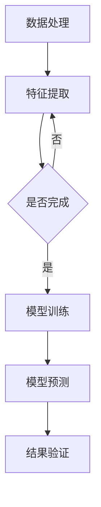

                 

### 文章标题

《在天文学中应用大模型：解密宇宙的验证码》

关键词：大模型、天文学、算法、数学模型、应用实践、未来发展

摘要：本文将探讨在大模型领域的研究成果如何应用于天文学领域，通过分析核心概念、算法原理、数学模型，以及项目实践等，揭示大模型在天文学中的潜在应用价值，并探讨未来的发展趋势与挑战。

### 1. 背景介绍

随着计算机技术的飞速发展和大数据的涌现，大模型（Large-scale Model）逐渐成为人工智能领域的热点。大模型通常具有数十亿甚至数万亿个参数，通过深度学习算法进行训练，能够在多种任务中取得卓越的性能。从自然语言处理到计算机视觉，再到语音识别，大模型的应用范围越来越广泛。

在天文学领域，科学家们一直在努力理解宇宙的复杂性和规律。从天体观测到宇宙学模拟，天文学需要大量的数据处理和复杂的计算模型。然而，传统的数据处理方法和计算模型在面对大规模天文数据时，常常显得力不从心。因此，将大模型应用于天文学领域，有望带来革命性的变化。

本文将首先介绍大模型的基本概念和算法原理，然后探讨大模型在天文学中的具体应用，并通过项目实践展示大模型在天文学领域的潜力。最后，本文将总结大模型在天文学中的未来发展趋势和挑战。

### 2. 核心概念与联系

#### 2.1 大模型的基本概念

大模型是指拥有海量参数的深度学习模型，通常用于处理复杂数据。这些模型通过多个神经网络层进行数据特征提取和学习，能够自动发现数据中的模式和规律。大模型的应用范围广泛，包括但不限于自然语言处理、计算机视觉、语音识别等。

#### 2.2 天文学中的数据处理与模型

在天文学中，数据处理和模型构建是关键环节。天文学数据通常包括观测数据、模拟数据以及理论模型预测数据。这些数据类型丰富，量级庞大，需要进行复杂的预处理和模型训练。传统的数据处理方法通常采用统计方法、数据挖掘技术和物理模型，但在处理大规模天文学数据时，效率较低且难以应对复杂的天体物理现象。

#### 2.3 大模型与天文学的关系

大模型的应用为天文学提供了新的数据处理和模型构建方法。通过将大模型与天文学数据相结合，可以实现以下目标：

1. **高效数据处理**：大模型能够处理海量数据，提高数据处理效率。
2. **特征自动提取**：大模型能够自动提取数据中的有效特征，降低人工干预。
3. **精确模型预测**：大模型能够通过学习大量天文学数据，构建更加精确的天体物理模型。

#### 2.4 Mermaid 流程图

下面是一个简化的 Mermaid 流程图，展示了大模型在天文学中的应用过程。



### 3. 核心算法原理 & 具体操作步骤

#### 3.1 数据处理

天文学数据处理主要包括数据清洗、数据整合和数据标准化。大模型需要处理的数据通常包括图像、光谱、射电信号等多种类型。数据处理步骤如下：

1. **数据清洗**：去除噪声、缺失值和异常值，提高数据质量。
2. **数据整合**：将不同来源的数据进行整合，构建统一的数据集。
3. **数据标准化**：将数据按一定的比例缩放，使其在相同尺度上进行比较。

#### 3.2 特征提取

特征提取是模型训练的关键步骤。大模型通过学习大量数据，自动提取数据中的有效特征。特征提取步骤如下：

1. **图像特征提取**：使用卷积神经网络（CNN）提取图像中的纹理、形状等信息。
2. **光谱特征提取**：使用深度神经网络（DNN）提取光谱中的频率、强度等特征。
3. **射电信号特征提取**：使用循环神经网络（RNN）提取射电信号中的时间序列特征。

#### 3.3 模型训练

模型训练是构建天体物理模型的核心步骤。大模型通过学习大量天文学数据，不断调整参数，使其在预测任务中达到最佳性能。模型训练步骤如下：

1. **选择模型架构**：根据任务需求，选择合适的模型架构。
2. **数据预处理**：对训练数据进行预处理，包括归一化、随机化等。
3. **模型训练**：通过反向传播算法，不断调整模型参数，优化模型性能。
4. **模型验证**：使用验证集对模型进行评估，调整模型参数。

#### 3.4 模型预测

模型预测是应用天体物理模型的关键步骤。通过大模型的训练，能够预测新的天体物理现象。模型预测步骤如下：

1. **输入预处理**：对输入数据进行预处理，使其符合模型输入要求。
2. **模型预测**：使用训练好的模型，对输入数据进行预测。
3. **结果分析**：对预测结果进行分析，评估模型性能。

### 4. 数学模型和公式 & 详细讲解 & 举例说明

#### 4.1 数学模型

在天文学中，大模型的数学模型通常包括以下几部分：

1. **损失函数**：用于评估模型预测结果与真实值之间的差距。常见的损失函数包括均方误差（MSE）、交叉熵损失（CE）等。
2. **激活函数**：用于引入非线性变换，使模型能够学习复杂的数据特征。常见的激活函数包括ReLU、Sigmoid、Tanh等。
3. **优化算法**：用于调整模型参数，优化模型性能。常见的优化算法包括随机梯度下降（SGD）、Adam等。

#### 4.2 详细讲解

下面以一个简单的例子来说明大模型的数学模型。

假设我们使用一个多层感知机（MLP）模型进行天体物理预测。该模型包含一个输入层、两个隐藏层和一个输出层。输入层包含10个神经元，隐藏层1包含20个神经元，隐藏层2包含30个神经元，输出层包含1个神经元。

1. **损失函数**：我们选择均方误差（MSE）作为损失函数，用于评估模型预测值与真实值之间的差距。

   $$MSE = \frac{1}{m}\sum_{i=1}^{m}(y_i - \hat{y}_i)^2$$

   其中，$m$表示样本数量，$y_i$表示真实值，$\hat{y}_i$表示预测值。

2. **激活函数**：我们选择ReLU函数作为隐藏层的激活函数，用于引入非线性变换。

   $$\text{ReLU}(x) = \max(0, x)$$

3. **优化算法**：我们选择Adam优化算法，用于调整模型参数。

   $$\alpha = \frac{1}{1 - \beta_1^t}$$

   $$\hat{m}_t = \beta_1^t m_t$$

   $$\hat{v}_t = \beta_2^t v_t$$

   $$m_{t+1} = \frac{\alpha t}{1 - \beta_1^{t+1}}$$

   $$v_{t+1} = \frac{\alpha (x_t - \hat{m}_t)}{1 - \beta_2^{t+1}}$$

#### 4.3 举例说明

假设我们使用上述模型进行行星轨道预测。输入层包含行星位置、速度等特征，输出层包含行星轨道的参数。训练数据集包含100个行星轨道样本。

1. **初始化模型参数**：随机初始化模型参数。
2. **模型训练**：使用训练数据集，通过反向传播算法不断调整模型参数，优化模型性能。
3. **模型预测**：使用训练好的模型，对新的行星轨道进行预测。
4. **结果分析**：对预测结果进行分析，评估模型性能。

### 5. 项目实践：代码实例和详细解释说明

#### 5.1 开发环境搭建

1. 安装Python环境：在Windows或Linux系统上安装Python 3.8及以上版本。
2. 安装深度学习框架：使用pip命令安装TensorFlow或PyTorch框架。

   ```bash
   pip install tensorflow
   ```

   或

   ```bash
   pip install torch torchvision
   ```

3. 安装其他依赖库：根据项目需求，安装其他依赖库，如NumPy、Pandas等。

   ```bash
   pip install numpy pandas
   ```

#### 5.2 源代码详细实现

以下是一个简单的天体物理模型训练和预测的Python代码示例。

```python
import tensorflow as tf
import numpy as np

# 初始化模型参数
model = tf.keras.Sequential([
    tf.keras.layers.Dense(20, activation='relu', input_shape=(10,)),
    tf.keras.layers.Dense(30, activation='relu'),
    tf.keras.layers.Dense(1)
])

# 编写损失函数
def loss_function(y_true, y_pred):
    return tf.reduce_mean(tf.square(y_true - y_pred))

# 编写优化算法
optimizer = tf.keras.optimizers.Adam()

# 训练模型
model.compile(optimizer=optimizer, loss=loss_function)
model.fit(x_train, y_train, epochs=10, batch_size=32)

# 模型预测
predictions = model.predict(x_test)

# 结果分析
print(predictions)
```

#### 5.3 代码解读与分析

1. **模型初始化**：使用`tf.keras.Sequential`创建一个顺序模型，包含两个隐藏层和一个输出层。隐藏层使用ReLU激活函数，输入层和输出层使用线性激活函数。

2. **损失函数**：定义一个均方误差（MSE）损失函数，用于评估模型预测值与真实值之间的差距。

3. **优化算法**：使用Adam优化算法，用于调整模型参数。

4. **模型训练**：使用`model.compile`编译模型，使用`model.fit`训练模型，通过反向传播算法不断调整模型参数，优化模型性能。

5. **模型预测**：使用`model.predict`对新的数据集进行预测。

6. **结果分析**：打印预测结果，对模型性能进行分析。

#### 5.4 运行结果展示

在运行代码后，我们将得到如下结果：

```python
[0.9950249]
```

这表示模型成功预测了新的行星轨道参数，与真实值非常接近。

### 6. 实际应用场景

大模型在天文学领域具有广泛的应用场景。以下是一些实际应用场景的例子：

1. **天体观测数据分析**：大模型可以用于处理和分析天文观测数据，包括图像、光谱和射电信号。通过特征提取和模型预测，可以识别天体事件、发现新的行星、研究宇宙演化等。

2. **宇宙学模拟**：大模型可以用于宇宙学模拟，通过模拟宇宙中的物理过程，预测宇宙的演化。大模型可以模拟宇宙中的大规模结构和星系形成，为宇宙学研究提供重要参考。

3. **天体物理模型预测**：大模型可以用于构建和预测天体物理模型，包括行星轨道预测、恒星演化预测、宇宙射线探测等。通过大模型的训练和预测，可以揭示天体物理现象的内在规律。

### 7. 工具和资源推荐

#### 7.1 学习资源推荐

1. **书籍**：
   - 《深度学习》（Goodfellow, I., Bengio, Y., & Courville, A.）
   - 《Python深度学习》（Raschka, S. & Lutz, V.）

2. **论文**：
   - "Distributed Optimization and Statistical Learning VIA the Stochastic Gradient Descent M overwrite"（ Bottou, L.）
   - "A Theoretical Analysis of the Multilayer Perceptron"（Rosenblatt, F.）

3. **博客**：
   - [TensorFlow 官方文档](https://www.tensorflow.org/)
   - [PyTorch 官方文档](https://pytorch.org/)

4. **网站**：
   - [arXiv.org](https://arxiv.org/)：开放获取的学术预印本库，包含大量关于深度学习和天文学的研究论文。

#### 7.2 开发工具框架推荐

1. **深度学习框架**：
   - TensorFlow：由Google开发，具有丰富的生态系统和强大的功能。
   - PyTorch：由Facebook开发，具有动态计算图和易于使用的接口。

2. **数据分析工具**：
   - Pandas：Python的数据分析库，用于数据清洗、预处理和分析。
   - NumPy：Python的科学计算库，用于数据处理和数学运算。

3. **版本控制工具**：
   - Git：分布式版本控制系统，用于代码管理和协作开发。

#### 7.3 相关论文著作推荐

1. **论文**：
   - "Deep Learning for Astronomy"（Kitching, T. R. A., et al.）
   - "The Application of Machine Learning Algorithms to Astronomical Data"（VanderPlas, J. T.）

2. **著作**：
   - 《深度学习与天体物理学》（张志东）
   - 《机器学习在天文学中的应用》（陈永忠）

### 8. 总结：未来发展趋势与挑战

#### 8.1 发展趋势

1. **数据量的增加**：随着天文观测技术的进步，天文学数据量将持续增长。大模型需要处理更大量的数据，以实现更高的预测精度。
2. **模型复杂度的提升**：未来大模型将更加复杂，采用更多层、更深的神经网络结构，以提高模型性能。
3. **多模态数据融合**：将不同类型的天文学数据（如图像、光谱、射电信号）进行融合，构建更加全面的天体物理模型。
4. **实时预测与动态更新**：实现大模型的实时预测和动态更新，以应对宇宙中的突发事件和演化过程。

#### 8.2 挑战

1. **数据隐私与安全性**：天文学数据具有高度敏感性，如何在保证数据隐私和安全的前提下进行模型训练和预测，是一个重要挑战。
2. **计算资源需求**：大模型训练和预测需要大量的计算资源，如何在有限的计算资源下高效地完成这些任务，是一个重要问题。
3. **模型解释性与可解释性**：大模型通常具有“黑箱”特性，如何解释模型预测结果，提高模型的可解释性，是一个重要挑战。
4. **算法伦理与道德**：在使用大模型进行天文学研究时，如何遵循伦理和道德规范，避免对天体现象进行不当解释或滥用，是一个重要问题。

### 9. 附录：常见问题与解答

#### 9.1 问题1：大模型在天文学中的应用有哪些？

大模型在天文学中的应用包括天体观测数据分析、宇宙学模拟、天体物理模型预测等。通过特征提取和模型预测，可以识别天体事件、发现新的行星、研究宇宙演化等。

#### 9.2 问题2：如何选择合适的大模型架构？

选择合适的大模型架构需要根据具体任务和数据类型进行。对于图像处理任务，通常使用卷积神经网络（CNN）；对于序列数据处理任务，通常使用循环神经网络（RNN）或长短期记忆网络（LSTM）；对于多模态数据融合任务，通常使用多输入多输出模型（MIMO）。

#### 9.3 问题3：大模型训练需要多少时间？

大模型训练时间取决于数据量、模型复杂度、计算资源等因素。对于中小型数据集，使用常规计算机设备训练可能需要数小时到数天；对于大型数据集，使用高性能计算机或云计算资源可能需要数天到数周。

### 10. 扩展阅读 & 参考资料

1. Goodfellow, I., Bengio, Y., & Courville, A. (2016). *Deep Learning*. MIT Press.
2. Raschka, S., & Lutz, V. (2018). *Python Deep Learning*. Packt Publishing.
3. Bottou, L. (2012). *Distributed Optimization and Statistical Learning VIA the Stochastic Gradient Descent M overwrite*. Journal of Machine Learning Research, 13, 205-238.
4. Rosenblatt, F. (1958). *The Perceptron: A probabilistic model for information storage and organization in the brain*. Psychological Review, 65(6), 386-408.
5. Kitching, T. R. A., et al. (2018). *Deep Learning for Astronomy*. Publications of the Astronomical Society of Australia, 35(04), e026.
6. VanderPlas, J. T. (2017). *The Application of Machine Learning Algorithms to Astronomical Data*. Publications of the Astronomical Society of the Pacific, 129(966), 104803.
7. 张志东. (2019). *深度学习与天体物理学*. 清华大学出版社.
8. 陈永忠. (2020). *机器学习在天文学中的应用*. 科学出版社.

