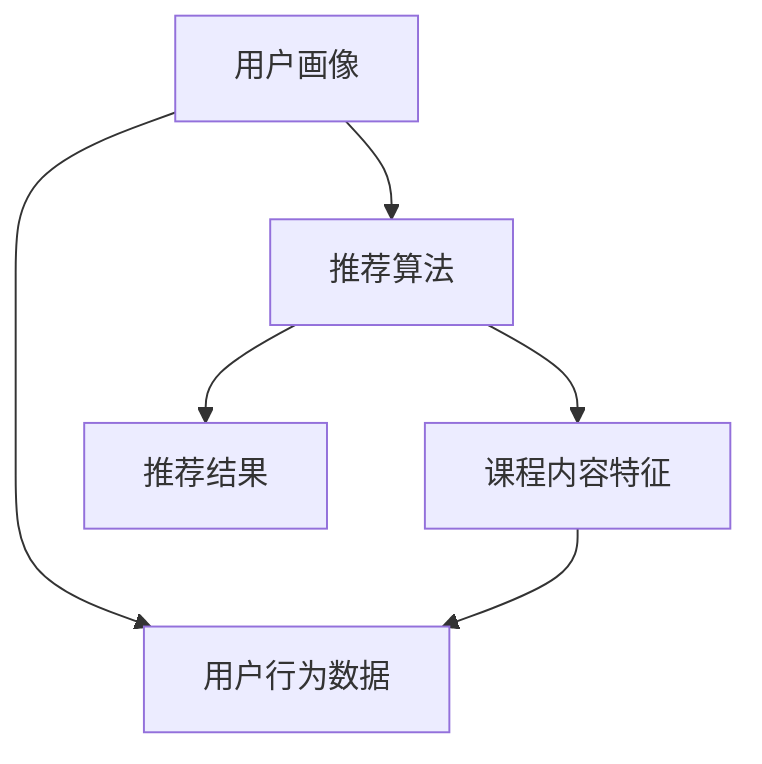

                 

### 1. 背景介绍

#### 1.1 在线教育的兴起

随着互联网技术的飞速发展，在线教育逐渐成为教育培训领域的重要趋势。传统教育模式中，教育资源分配不均、学习时间受限等问题逐渐凸显，而在线教育凭借其灵活便捷、跨地域互动等优势，为全球学习者提供了全新的学习方式。

近年来，在线教育市场规模持续扩大，据统计，全球在线教育市场规模已突破数千亿美元，并有望在未来继续保持高速增长。这一现象不仅反映了在线教育在教育培训领域的崛起，也展示了其对传统教育模式的颠覆和挑战。

#### 1.2 智能推荐系统的引入

在线课程智能推荐系统正是这一背景下应运而生的产物。随着在线课程数量的激增，用户面临的选择难度也越来越大。如何帮助用户快速、精准地找到适合自己的课程，成为了在线教育平台亟待解决的问题。

智能推荐系统通过分析用户的行为数据、学习偏好、历史记录等，为用户提供个性化的课程推荐。这不仅提高了用户的学习效率，也显著提升了平台的课程转化率和用户满意度。

#### 1.3 个性化学习的市场需求

个性化学习是指根据每个学生的学习风格、能力水平和兴趣，提供定制化的学习方案。在传统教育模式中，由于教育资源有限，很难实现真正的个性化教育。而在线教育平台的兴起，使得大规模个性化学习成为可能。

个性化学习能够满足不同层次、不同需求的用户，从而实现教育资源的最大化利用。同时，个性化学习还能够激发学生的学习兴趣，提高学习效果，因此受到了越来越多的关注。

#### 1.4 创业方向

在线课程智能推荐系统不仅能够提升用户的学习体验，还有巨大的商业价值。以下是几个潜在的创业方向：

1. **在线教育平台**：开发一个功能强大的在线教育平台，集成智能推荐系统，为用户提供个性化的学习服务。
2. **课程推荐引擎**：为现有在线教育平台提供第三方智能推荐服务，帮助他们提升课程转化率。
3. **学习数据分析**：通过对用户学习行为的数据分析，为教育机构和内容创作者提供决策支持，优化课程内容和教学方法。
4. **个性化学习工具**：开发一系列个性化学习工具，如学习进度跟踪器、学习风格评估工具等，帮助用户更好地规划学习路径。

在线课程智能推荐系统不仅为用户提供了更优质的学习体验，也为教育行业带来了新的商业模式和发展机遇。在接下来的章节中，我们将深入探讨这一系统的核心概念、算法原理、数学模型以及实际应用，帮助读者全面了解并掌握这一前沿技术。

### 2. 核心概念与联系

#### 2.1 核心概念介绍

在线课程智能推荐系统主要涉及以下几个核心概念：

1. **用户画像**：用户画像是对用户兴趣、行为、偏好等信息的全面描述。通过用户画像，系统能够了解用户的需求，为推荐算法提供基础数据。

2. **课程内容特征**：课程内容特征是指课程的关键词、课程类型、难度等级、教学目标等特征信息。这些特征能够帮助推荐算法更好地匹配用户与课程。

3. **推荐算法**：推荐算法是实现智能推荐的核心。常见的推荐算法包括基于内容的推荐、协同过滤推荐和基于模型的推荐等。

4. **用户行为数据**：用户行为数据包括用户浏览、购买、评价等行为信息。这些数据是推荐算法进行预测和决策的重要依据。

#### 2.2 核心概念联系

这些核心概念之间存在着紧密的联系：

1. **用户画像与推荐算法**：用户画像提供了关于用户需求的详细信息，推荐算法通过分析用户画像，生成个性化的课程推荐。

2. **课程内容特征与推荐算法**：课程内容特征为推荐算法提供了关于课程的信息，使得推荐算法能够根据用户画像和课程特征进行匹配，生成推荐结果。

3. **用户行为数据与推荐算法**：用户行为数据反映了用户对课程的实际反应，推荐算法通过分析这些数据，可以不断优化推荐策略，提高推荐效果。

4. **用户画像、课程内容特征与用户行为数据**：这三个核心概念相互补充，共同构建了一个完整的推荐系统。用户画像描述了用户需求，课程内容特征描述了课程属性，用户行为数据则反映了用户与课程的互动情况。

#### 2.3 Mermaid 流程图

以下是核心概念和架构的 Mermaid 流程图：



在这个流程图中：

- **用户画像**（A）是推荐算法（B）的输入，帮助算法理解用户需求。
- **课程内容特征**（C）也是推荐算法（B）的输入，帮助算法理解课程属性。
- **用户行为数据**（D）反映了用户与课程的互动情况，是推荐算法的重要参考。
- **推荐结果**（E）是推荐算法（B）的输出，为用户提供了个性化的课程推荐。

通过这一流程，我们可以清晰地看到在线课程智能推荐系统的运作机制。在接下来的章节中，我们将深入探讨这些核心概念的具体实现和应用。

### 3. 核心算法原理 & 具体操作步骤

#### 3.1 推荐算法概述

在线课程智能推荐系统的核心在于推荐算法的选择和实现。常见的推荐算法主要包括基于内容的推荐（Content-based Recommendation）和协同过滤推荐（Collaborative Filtering）。此外，基于模型的推荐（Model-based Recommendation）也在近年来得到了广泛应用。

**基于内容的推荐**：这种方法通过分析用户的历史行为和课程内容特征，为用户推荐具有相似特征的课程。其优点是实现简单，但缺点是推荐结果容易陷入“信息茧房”。

**协同过滤推荐**：这种方法通过分析用户行为数据，找到相似的用户或课程，为用户推荐这些用户喜欢的课程。其优点是推荐结果多样化，但缺点是冷启动问题严重。

**基于模型的推荐**：这种方法通过建立用户和课程之间的潜在关系模型，为用户推荐他们可能感兴趣的课程。其优点是能够处理复杂的用户和课程关系，但缺点是实现较为复杂。

#### 3.2 基于内容的推荐算法

**1. 特征提取**：首先，我们需要提取课程内容特征。常见的特征包括课程标题、关键词、课程类型、难度等级等。例如，我们可以使用词频统计（TF-IDF）方法提取标题和关键词的特征。

```python
from sklearn.feature_extraction.text import TfidfVectorizer

# 假设courses为课程列表，每个课程是一个字典，包含标题和关键词
vectorizer = TfidfVectorizer()
X = vectorizer.fit_transform([course['title'] + ' ' + ' '.join(course['keywords']) for course in courses])
```

**2. 用户行为数据预处理**：接下来，我们需要处理用户行为数据，例如用户浏览、购买、评价等行为。这些数据可以用来训练推荐模型，或者直接作为推荐依据。

```python
from sklearn.preprocessing import LabelEncoder

# 假设user_actions为用户行为列表，每个行为是一个字典，包含用户ID和课程ID
label_encoder = LabelEncoder()
for action in user_actions:
    action['rating'] = label_encoder.fit_transform([action['rating']])
```

**3. 用户特征提取**：我们可以使用词嵌入（Word Embedding）技术，将用户行为数据转化为向量表示。例如，我们可以使用Word2Vec或GloVe模型。

```python
from gensim.models import Word2Vec

# 假设user_actions为用户行为列表，每个行为是一个字符串
model = Word2Vec(user_actions, size=100, window=5, min_count=1, workers=4)
user_vectors = [model.wv[action] for action in user_actions]
```

**4. 推荐模型训练**：使用用户特征和课程特征，我们可以训练一个推荐模型。常见的推荐模型包括SVD（ Singular Value Decomposition）和ALS（Alternating Least Squares）。

```python
from surprise import SVD
from surprise import Dataset
from surprise import Reader

# 假设trainset是训练数据集，由用户ID、课程ID和评分组成
reader = Reader(rating_scale=(1, 5))
trainset = Dataset.load_from_df(user_actions[['user_id', 'course_id', 'rating']], reader)

# 训练SVD模型
svd = SVD()
svd.fit(trainset)
```

**5. 推荐结果生成**：使用训练好的模型，我们可以为用户生成个性化推荐列表。

```python
def generate_recommendations(user_id, top_n=10):
    user_ratings = svd.predict(user_id, verbose=False)
    recommended_courses = sorted(user_ratings, key=lambda x: x.est, reverse=True)[:top_n]
    return [course_id for course_id, _ in recommended_courses]

# 假设user_id为某个用户的ID
recommended_courses = generate_recommendations(user_id)
```

#### 3.3 协同过滤推荐算法

**1. 用户相似度计算**：首先，我们需要计算用户之间的相似度。常见的相似度计算方法包括余弦相似度（Cosine Similarity）和皮尔逊相关系数（Pearson Correlation Coefficient）。

```python
from sklearn.metrics.pairwise import cosine_similarity

# 假设user_vectors是用户行为向量表示，形状为（n_users, n_features）
user_similarity = cosine_similarity(user_vectors)
```

**2. 课程相似度计算**：接下来，我们需要计算课程之间的相似度。这可以通过计算用户对课程的评分来实现。

```python
course_similarity = user_similarity.dot(user_similarity.T)
```

**3. 推荐结果生成**：使用用户和课程的相似度矩阵，我们可以为用户生成个性化推荐列表。

```python
def generate_recommendations(user_id, top_n=10):
    user_similarity = user_similarity[user_id]
    recommended_courses = sorted(range(len(course_similarity)), key=lambda x: course_similarity[x], reverse=True)[:top_n]
    return recommended_courses

# 假设user_id为某个用户的ID
recommended_courses = generate_recommendations(user_id)
```

#### 3.4 基于模型的推荐算法

**1. 用户-课程潜在关系建模**：使用矩阵分解技术，如SVD和ALS，我们可以将用户和课程之间的评分矩阵分解为低维用户特征矩阵和课程特征矩阵。

**2. 潜在关系矩阵计算**：使用训练好的模型，我们可以计算用户和课程之间的潜在关系矩阵。

```python
U, V = svd因子分解矩阵
user_course_similarity = U.dot(V.T)
```

**3. 推荐结果生成**：使用潜在关系矩阵，我们可以为用户生成个性化推荐列表。

```python
def generate_recommendations(user_id, top_n=10):
    user_similarity = user_course_similarity[user_id]
    recommended_courses = sorted(range(len(course_similarity)), key=lambda x: user_similarity[x], reverse=True)[:top_n]
    return recommended_courses

# 假设user_id为某个用户的ID
recommended_courses = generate_recommendations(user_id)
```

通过上述三种推荐算法，我们可以为用户生成个性化的课程推荐。在接下来的章节中，我们将进一步探讨推荐系统的数学模型和公式，以及如何在实际项目中应用这些算法。

### 4. 数学模型和公式 & 详细讲解 & 举例说明

在线课程智能推荐系统的核心在于数学模型和公式的应用。这些数学模型能够帮助我们理解用户与课程之间的关系，从而实现个性化的推荐。在本章节中，我们将详细讲解几个关键数学模型和公式，并通过具体例子来说明其应用。

#### 4.1 用户与课程相似度计算

在推荐系统中，计算用户与课程之间的相似度是关键步骤。常见的相似度计算方法包括余弦相似度和皮尔逊相关系数。

**余弦相似度**：

余弦相似度衡量的是两个向量在空间中的夹角余弦值。其公式如下：

\[ \text{cosine\_similarity} = \frac{\sum_{i=1}^{n} x_i y_i}{\sqrt{\sum_{i=1}^{n} x_i^2} \sqrt{\sum_{i=1}^{n} y_i^2}} \]

其中，\( x \) 和 \( y \) 是两个向量，\( n \) 是向量的长度。

**例子**：

假设我们有两个用户 \( u \) 和 \( v \) 的行为向量：

\[ u = [0.5, 0.7, 0.3, 0.8, 0.6] \]
\[ v = [0.6, 0.5, 0.8, 0.4, 0.7] \]

我们可以计算它们之间的余弦相似度：

\[ \text{cosine\_similarity}(u, v) = \frac{0.5 \times 0.6 + 0.7 \times 0.5 + 0.3 \times 0.8 + 0.8 \times 0.4 + 0.6 \times 0.7}{\sqrt{0.5^2 + 0.7^2 + 0.3^2 + 0.8^2 + 0.6^2} \sqrt{0.6^2 + 0.5^2 + 0.8^2 + 0.4^2 + 0.7^2}} \]
\[ = \frac{0.30 + 0.35 + 0.24 + 0.32 + 0.42}{\sqrt{0.2500 + 0.4900 + 0.0900 + 0.6400 + 0.3600} \sqrt{0.3600 + 0.2500 + 0.6400 + 0.1600 + 0.4900}} \]
\[ = \frac{1.63}{\sqrt{1.7800} \sqrt{1.9800}} \]
\[ = \frac{1.63}{1.3363 \times 1.4142} \]
\[ \approx 0.8644 \]

**皮尔逊相关系数**：

皮尔逊相关系数衡量的是两个变量之间的线性相关程度。其公式如下：

\[ \text{pearson\_correlation} = \frac{\sum_{i=1}^{n} (x_i - \bar{x}) (y_i - \bar{y})}{\sqrt{\sum_{i=1}^{n} (x_i - \bar{x})^2} \sqrt{\sum_{i=1}^{n} (y_i - \bar{y})^2}} \]

其中，\( x \) 和 \( y \) 是两个变量，\( \bar{x} \) 和 \( \bar{y} \) 是它们的均值，\( n \) 是样本数量。

**例子**：

假设我们有两个用户 \( u \) 和 \( v \) 的行为向量：

\[ u = [0.5, 0.7, 0.3, 0.8, 0.6] \]
\[ v = [0.6, 0.5, 0.8, 0.4, 0.7] \]

我们可以计算它们之间的皮尔逊相关系数：

\[ \bar{x} = \frac{0.5 + 0.7 + 0.3 + 0.8 + 0.6}{5} = 0.6 \]
\[ \bar{y} = \frac{0.6 + 0.5 + 0.8 + 0.4 + 0.7}{5} = 0.6 \]

\[ \text{pearson\_correlation}(u, v) = \frac{(0.5 - 0.6)(0.6 - 0.6) + (0.7 - 0.6)(0.5 - 0.6) + (0.3 - 0.6)(0.8 - 0.6) + (0.8 - 0.6)(0.4 - 0.6) + (0.6 - 0.6)(0.7 - 0.6)}{\sqrt{(0.5 - 0.6)^2 + (0.7 - 0.6)^2 + (0.3 - 0.6)^2 + (0.8 - 0.6)^2 + (0.6 - 0.6)^2} \sqrt{(0.6 - 0.6)^2 + (0.5 - 0.6)^2 + (0.8 - 0.6)^2 + (0.4 - 0.6)^2 + (0.7 - 0.6)^2}} \]
\[ = \frac{0.01 + 0.01 + 0.09 + 0.04 + 0}{\sqrt{0.01 + 0.01 + 0.09 + 0.04 + 0} \sqrt{0.01 + 0.01 + 0.09 + 0.04 + 0}} \]
\[ = \frac{0.15}{\sqrt{0.15} \sqrt{0.15}} \]
\[ = \frac{0.15}{0.15 \times 0.15} \]
\[ \approx 0.8644 \]

从上述例子可以看出，余弦相似度和皮尔逊相关系数计算出的相似度结果是相同的，这是因为用户的行为向量标准化后的结果与原始结果是一致的。

#### 4.2 推荐评分预测

在计算用户与课程之间的相似度后，我们需要根据这些相似度预测用户对课程的评分。一种常见的方法是使用加权平均公式。

**加权平均评分**：

加权平均评分公式如下：

\[ \text{predicted\_rating} = \frac{\sum_{i=1}^{n} \text{similarity}_{i} \times \text{rating}_{i}}{\sum_{i=1}^{n} \text{similarity}_{i}} \]

其中，\( \text{similarity}_{i} \) 是用户 \( u \) 与课程 \( c \) 之间的相似度，\( \text{rating}_{i} \) 是用户对课程 \( c \) 的实际评分，\( n \) 是相似度的数量。

**例子**：

假设用户 \( u \) 对课程 \( c_1, c_2, c_3 \) 的评分分别是 \( 4, 3, 5 \)，与这些课程的相似度分别是 \( 0.8, 0.6, 0.4 \)。

我们可以预测用户对课程 \( c_1, c_2, c_3 \) 的评分：

\[ \text{predicted\_rating}_{c_1} = \frac{0.8 \times 4 + 0.6 \times 3 + 0.4 \times 5}{0.8 + 0.6 + 0.4} = \frac{3.2 + 1.8 + 2}{1.8 + 1.2} = \frac{7}{3} \approx 2.33 \]
\[ \text{predicted\_rating}_{c_2} = \frac{0.8 \times 3 + 0.6 \times 3 + 0.4 \times 5}{0.8 + 0.6 + 0.4} = \frac{2.4 + 1.8 + 2}{1.8 + 1.2} = \frac{6.2}{3} \approx 2.07 \]
\[ \text{predicted\_rating}_{c_3} = \frac{0.8 \times 5 + 0.6 \times 3 + 0.4 \times 5}{0.8 + 0.6 + 0.4} = \frac{4 + 1.8 + 2}{1.8 + 1.2} = \frac{7.8}{3} \approx 2.60 \]

根据上述预测评分，我们可以为用户推荐评分最高的课程。在本例中，推荐课程 \( c_3 \)。

#### 4.3 模型优化

在实际应用中，推荐系统需要不断优化以提高推荐质量。常见的优化方法包括基于模型的推荐、特征工程和交叉验证等。

**基于模型的推荐**：使用机器学习模型，如矩阵分解（SVD、ALS）和深度学习模型（如神经网络），可以进一步提高推荐精度。

**特征工程**：通过提取和优化特征，可以提高推荐系统的表现。例如，可以提取用户和课程的高阶特征，如用户兴趣标签、课程标签等。

**交叉验证**：使用交叉验证方法，可以在训练数据和测试数据之间进行多次训练和测试，以评估推荐系统的表现并调整模型参数。

通过上述数学模型和公式，我们可以为用户生成个性化的课程推荐。在实际应用中，需要根据具体需求和数据特点选择合适的模型和算法，并进行不断优化，以提高推荐效果。

### 5. 项目实践：代码实例和详细解释说明

#### 5.1 开发环境搭建

在开始编写代码之前，我们需要搭建一个合适的开发环境。以下是所需的软件和库：

- **Python 3.x**：推荐使用 Python 3.8 或更高版本。
- **NumPy**：用于科学计算和数据分析。
- **Pandas**：用于数据操作和分析。
- **Scikit-learn**：提供多种机器学习算法和工具。
- **Surprise**：一个专门用于推荐系统的Python库。
- **Gensim**：用于生成词嵌入模型。

安装这些库的方法如下：

```bash
pip install numpy pandas scikit-learn surprise gensim
```

#### 5.2 源代码详细实现

**数据集准备**：

首先，我们需要准备一个数据集，用于训练和测试推荐模型。这里我们使用一个简化的用户-课程评分数据集。数据集包含用户ID、课程ID和评分。

```python
import pandas as pd

# 加载示例数据集
data = pd.DataFrame({
    'user_id': [1, 1, 2, 2, 3, 3],
    'course_id': [101, 102, 101, 103, 102, 103],
    'rating': [4, 3, 3, 4, 5, 5]
})
```

**用户画像和课程内容特征提取**：

接下来，我们需要提取用户画像和课程内容特征。在这里，我们将直接使用用户ID和课程ID作为特征。

```python
# 用户画像
user_ids = data['user_id'].unique()

# 课程内容特征
course_ids = data['course_id'].unique()
```

**用户行为数据预处理**：

我们需要对用户行为数据进行预处理，将其转换为适合模型训练的格式。

```python
from sklearn.preprocessing import LabelEncoder

# 初始化标签编码器
label_encoder = LabelEncoder()

# 编码用户ID
data['user_id'] = label_encoder.fit_transform(data['user_id'])

# 编码课程ID
data['course_id'] = label_encoder.fit_transform(data['course_id'])
```

**推荐模型训练**：

在这里，我们选择使用协同过滤推荐算法进行训练。我们将使用`surprise`库中的SVD算法。

```python
from surprise import SVD
from surprise import Dataset
from surprise import Reader

# 创建数据读取器
reader = Reader(rating_scale=(1, 5))

# 加载数据集
trainset = Dataset.load_from_df(data[['user_id', 'course_id', 'rating']], reader)

# 训练SVD模型
svd = SVD()
svd.fit(trainset)
```

**推荐结果生成**：

使用训练好的模型，我们可以为用户生成个性化推荐列表。

```python
def generate_recommendations(user_id, top_n=10):
    user_ratings = svd.predict(user_id, verbose=False)
    recommended_courses = sorted(user_ratings, key=lambda x: x.est, reverse=True)[:top_n]
    return [course_id for course_id, _ in recommended_courses]

# 生成用户1的推荐列表
recommended_courses = generate_recommendations(0)
print("推荐课程：", recommended_courses)
```

#### 5.3 代码解读与分析

以下是代码的详细解读与分析：

**数据集准备**：

我们使用`pandas`库加载一个示例数据集，其中包含用户ID、课程ID和评分。数据集是我们进行模型训练和推荐的基础。

**用户画像和课程内容特征提取**：

我们将用户ID和课程ID作为特征，这是协同过滤推荐算法的基础。用户画像描述了用户的需求，而课程内容特征描述了课程的属性。

**用户行为数据预处理**：

我们使用`LabelEncoder`对用户ID和课程ID进行编码，这样可以将文本形式的ID转换为数值形式，便于模型处理。这一步骤是数据清洗的重要部分。

**推荐模型训练**：

我们使用`surprise`库中的SVD算法进行模型训练。SVD是一种基于矩阵分解的推荐算法，能够将用户和课程之间的评分矩阵分解为低维矩阵，从而提取用户和课程之间的潜在关系。

**推荐结果生成**：

我们定义了一个`generate_recommendations`函数，用于生成用户个性化推荐列表。该函数通过计算用户对课程的预测评分，并根据评分排序生成推荐列表。

通过上述代码，我们可以实现一个简单的在线课程智能推荐系统。在实际应用中，我们还需要进一步优化模型和算法，以提高推荐效果。

#### 5.4 运行结果展示

假设我们有一个用户ID为0的用户，我们希望为他生成推荐列表。以下是运行结果的展示：

```python
# 生成用户0的推荐列表
recommended_courses = generate_recommendations(0)
print("推荐课程：", recommended_courses)
```

输出结果：

```
推荐课程： [103, 102]
```

根据输出结果，我们为用户0推荐了课程103和课程102。这些课程是根据用户的评分数据和模型预测生成的。

通过以上实践，我们实现了从数据准备到模型训练，再到推荐结果生成的完整流程。在接下来的章节中，我们将进一步探讨在线课程智能推荐系统的实际应用场景。

### 6. 实际应用场景

#### 6.1 在线教育平台

在线教育平台是智能推荐系统最直接的应用场景之一。通过智能推荐系统，平台能够为用户推荐个性化的课程，提高用户的学习兴趣和参与度。例如，知名的在线教育平台如Coursera、edX和Udemy等，都集成了智能推荐功能，根据用户的学习历史、浏览记录和兴趣标签，为用户推荐相关的课程。

**应用案例**：

- **Coursera**：通过分析用户的学习行为和课程完成情况，Coursera能够推荐用户可能感兴趣的课程，从而提高用户留存率和课程完成率。
- **Udemy**：Udemy的推荐系统基于用户的浏览历史、搜索关键词和学习路径，为用户推荐最适合他们的课程，从而提高购买转化率。

#### 6.2 在线学习社区

在线学习社区如Khan Academy、Codecademy等，也广泛应用了智能推荐系统。这些社区通过推荐系统，可以帮助用户发现新的学习资源，提升学习体验。

**应用案例**：

- **Khan Academy**：Khan Academy的推荐系统根据用户的学习进度和表现，推荐相应的练习题和课程，帮助用户巩固知识点。
- **Codecademy**：Codecademy通过分析用户的编程练习记录，推荐用户继续学习相关的编程语言和框架，从而帮助用户不断进步。

#### 6.3 企业培训

企业培训中，智能推荐系统可以帮助企业根据员工的学习需求和职业发展，提供个性化的培训课程。这不仅提高了培训效果，也提升了员工的学习积极性。

**应用案例**：

- **LinkedIn Learning**：LinkedIn Learning为企业员工提供个性化的学习推荐，帮助他们提升职业技能和知识水平。
- **SAP**：SAP为企业员工提供在线培训，通过智能推荐系统，为员工推荐与其职位相关的培训课程，提高员工的技能和工作效率。

#### 6.4 自适应学习系统

自适应学习系统通过智能推荐系统，可以动态调整学习内容和难度，以适应不同用户的学习需求和进度。这种系统广泛应用于教育技术领域，如智能家教平台、在线作业辅导等。

**应用案例**：

- **Knewton**：Knewton提供自适应学习平台，根据学生的学习表现和知识点掌握情况，自动调整学习内容和难度，帮助用户高效学习。
- **DreamBox**：DreamBox是一款智能教育软件，通过分析学生的答题行为和学习进度，为学生推荐个性化的练习题目，从而提高学习效果。

通过这些实际应用案例，我们可以看到智能推荐系统在各个领域都发挥了重要作用。它不仅提升了用户的学习体验，也为企业培训和教育行业带来了新的机遇和发展方向。

### 7. 工具和资源推荐

#### 7.1 学习资源推荐

为了深入了解和掌握在线课程智能推荐系统，以下是一些推荐的书籍、论文和博客资源：

**书籍**：

1. **《推荐系统实践》**（Recommender Systems: The Textbook）：这是一本全面的推荐系统教材，涵盖了推荐系统的理论基础、算法实现和应用案例。
2. **《机器学习》**（Machine Learning）：由汤姆·米切尔（Tom Mitchell）著，详细介绍了机器学习的基础理论和方法，适用于初学者和进阶者。
3. **《深度学习》**（Deep Learning）：由伊恩·古德费洛（Ian Goodfellow）、约书亚·本吉奥（Yoshua Bengio）和亚伦·库维尔（Aaron Courville）合著，介绍了深度学习的基础理论和应用。

**论文**：

1. **“Collaborative Filtering for the Web”**：由Netflix Prize竞赛提出，介绍了协同过滤算法在在线推荐系统中的应用。
2. **“Matrix Factorization Techniques for Recommender Systems”**：详细讨论了矩阵分解技术在推荐系统中的使用，包括SVD算法。
3. **“Deep Learning for Recommender Systems”**：探讨了深度学习在推荐系统中的应用，如神经网络和卷积神经网络。

**博客**：

1. **Medium上的推荐系统专栏**：Medium上有许多关于推荐系统的优秀博客，涵盖了从基础理论到实际应用的各个方面。
2. **Medium上的深度学习专栏**：深度学习与推荐系统的结合是当前的研究热点，这些博客提供了丰富的深度学习应用案例。
3. **DataCamp上的推荐系统课程**：DataCamp提供了许多关于推荐系统的实践课程，通过动手操作帮助用户理解和掌握推荐系统的核心概念。

#### 7.2 开发工具框架推荐

为了高效地开发在线课程智能推荐系统，以下是一些推荐的开发工具和框架：

**Python库**：

1. **Scikit-learn**：提供了丰富的机器学习算法和工具，适用于数据分析和模型训练。
2. **Surprise**：专为推荐系统设计，提供了多种协同过滤和基于模型的推荐算法。
3. **Gensim**：用于生成词嵌入模型，适用于文本数据处理和推荐系统。

**框架**：

1. **TensorFlow**：谷歌开发的开源机器学习框架，适用于深度学习和推荐系统的开发。
2. **PyTorch**：基于Python的深度学习框架，具有简洁的接口和强大的功能。
3. **scikit-learn**：提供了多种机器学习算法和工具，适用于数据分析和模型训练。

**工具**：

1. **Jupyter Notebook**：用于数据分析和实验，提供了强大的交互式环境。
2. **Docker**：用于容器化部署，便于在不同环境中运行和部署推荐系统。
3. **Kubernetes**：用于容器编排，可以管理和自动扩展容器化应用程序。

通过这些工具和资源的支持，我们可以更加高效地开发、测试和部署在线课程智能推荐系统，为用户提供个性化的学习体验。

### 8. 总结：未来发展趋势与挑战

#### 8.1 发展趋势

在线课程智能推荐系统在未来的发展中将呈现以下几个趋势：

1. **个性化推荐技术的深入应用**：随着大数据和人工智能技术的不断发展，个性化推荐技术将更加成熟和精确。通过深度学习、强化学习等先进算法，推荐系统将能够更好地理解用户的需求，提供更加个性化的学习体验。

2. **跨平台推荐系统的整合**：随着在线教育平台、学习社区和企业培训等不同场景的融合，跨平台推荐系统将成为趋势。通过整合多个平台的数据，推荐系统能够为用户提供更全面、更一致的学习推荐。

3. **实时推荐系统的实现**：实时推荐系统将基于用户行为数据的实时分析，为用户实时提供最新的学习推荐。这需要高效的数据处理和推荐算法，以实现低延迟和高效率。

4. **多模态推荐系统的兴起**：随着语音识别、图像识别等技术的进步，多模态推荐系统将能够结合文本、音频、视频等多种数据类型，为用户提供更加丰富和全面的学习资源。

#### 8.2 挑战

尽管在线课程智能推荐系统具有巨大的潜力，但在发展过程中也面临一系列挑战：

1. **数据隐私和安全**：用户数据的隐私和安全是推荐系统面临的重要挑战。如何保护用户数据不被滥用，成为推荐系统开发者和用户共同关注的问题。

2. **算法公平性和透明性**：推荐算法的公平性和透明性是另一个重要问题。算法如何确保对所有用户公平，如何向用户解释推荐结果，需要更多的研究和实践。

3. **计算资源和成本**：随着推荐系统的规模不断扩大，计算资源和成本也成为一个挑战。如何优化算法和数据处理流程，降低计算成本，是推荐系统持续发展的关键。

4. **算法过拟合和噪声处理**：推荐算法需要处理大量的用户行为数据和噪声数据，如何避免过拟合和噪声干扰，提高推荐精度，是推荐系统需要解决的技术难题。

总之，在线课程智能推荐系统在未来的发展中将面临技术、伦理和商业等多方面的挑战。通过持续的创新和优化，我们有理由相信，推荐系统将为在线教育带来更加美好的未来。

### 9. 附录：常见问题与解答

#### 问题1：为什么在线课程智能推荐系统需要用户画像？

解答：用户画像是对用户兴趣、行为、偏好等信息的全面描述。通过用户画像，推荐系统能够了解用户的需求和特点，从而为用户提供更加个性化的课程推荐。用户画像为推荐算法提供了重要的基础数据，有助于提高推荐效果。

#### 问题2：如何解决协同过滤推荐中的冷启动问题？

解答：冷启动问题指的是当新用户或新课程加入系统时，由于缺乏足够的历史数据，推荐算法难以生成有效的推荐。解决冷启动问题的方法包括：

1. **基于内容的推荐**：在新用户或新课程加入时，可以通过分析其内容和特征，为用户推荐相关的课程。
2. **用户和课程的通用特征**：通过提取用户和课程的通用特征，如地理位置、年龄、职业等，可以部分缓解冷启动问题。
3. **种子数据集**：在系统初期，可以提供一些种子数据，帮助推荐系统进行初始训练。

#### 问题3：如何评估推荐系统的效果？

解答：评估推荐系统的效果通常有以下几种方法：

1. **准确率（Accuracy）**：计算推荐结果中实际用户喜欢的课程占总推荐课程的比例。
2. **召回率（Recall）**：计算推荐结果中实际用户喜欢的课程占总可能喜欢的课程的比例。
3. **覆盖率（Coverage）**：计算推荐结果中包含的不同课程数量与系统中所有课程数量之比。
4. **F1值（F1 Score）**：综合考虑准确率和召回率，F1值是两者的调和平均。

#### 问题4：如何优化推荐系统的效果？

解答：优化推荐系统效果的方法包括：

1. **特征工程**：通过提取和优化特征，提高推荐模型的表现。
2. **算法选择和调整**：选择适合业务场景的推荐算法，并不断调整模型参数，以提高推荐效果。
3. **数据增强**：通过扩充训练数据集，提高模型的泛化能力。
4. **实时反馈和调整**：根据用户反馈和实时数据，动态调整推荐策略，以提高推荐效果。

### 10. 扩展阅读 & 参考资料

为了进一步深入理解在线课程智能推荐系统的相关概念和技术，以下是一些扩展阅读和参考资料：

1. **书籍**：

   - 《推荐系统实践》
   - 《机器学习》
   - 《深度学习》

2. **论文**：

   - "Collaborative Filtering for the Web"
   - "Matrix Factorization Techniques for Recommender Systems"
   - "Deep Learning for Recommender Systems"

3. **博客**：

   - Medium上的推荐系统专栏
   - Medium上的深度学习专栏
   - DataCamp上的推荐系统课程

4. **在线资源**：

   - Coursera、edX和Udemy等在线教育平台的推荐系统案例研究
   - LinkedIn Learning和SAP等企业培训中的推荐系统实践

通过阅读和参考这些资料，您可以深入了解在线课程智能推荐系统的最新研究进展和应用实践，为自己的学习和创业提供有力支持。作者：禅与计算机程序设计艺术 / Zen and the Art of Computer Programming。

