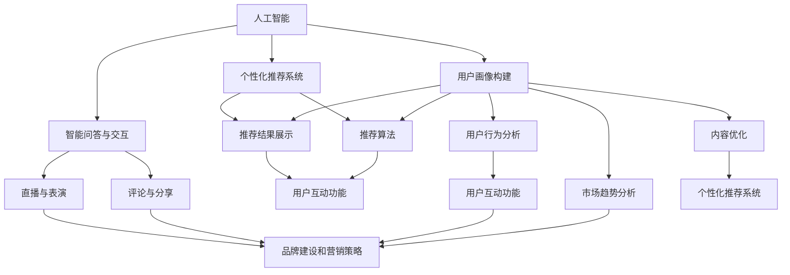

                 

### 1. 背景介绍

随着互联网技术的迅猛发展，在线音乐平台已经成为人们日常生活中不可或缺的一部分。从最初的流媒体服务到如今的各种个性化推荐，在线音乐平台在短短几年内经历了翻天覆地的变化。然而，在这一过程中，平台们也在不断寻找如何更好地吸引和留住用户注意力这一关键问题。因为用户注意力的争夺不仅关系到平台的活跃度，更是决定其盈利能力和市场竞争力的重要因素。

在线音乐平台在发展初期，主要依赖于音乐库的丰富性和播放质量的提升来吸引用户。然而，随着市场上越来越多的平台涌现，单纯的音频质量提升已经无法满足用户日益增长的需求。用户现在更关注的是平台能否提供个性化的音乐推荐、友好的用户体验以及丰富的互动功能。这就要求平台在技术、内容、交互等多个层面进行全面的优化和创新。

在这个竞争激烈的市场中，各大在线音乐平台纷纷采取了各种策略来争夺用户的注意力。例如，通过人工智能和大数据分析技术，提供个性化的音乐推荐；通过社交媒体和直播等功能，增强用户互动性；以及通过品牌合作和广告投放，提升平台的知名度和用户黏性。这些策略不仅丰富了平台的功能，也在一定程度上提升了用户的忠诚度和活跃度。

然而，用户注意力的争夺并非一成不变，而是随着技术的发展和用户需求的变化而不断演变。本文将从技术、内容和策略等多个角度，分析在线音乐平台在注意力争夺中的战略布局，探讨其背后的逻辑和效果。

在此背景下，本文将围绕以下几个核心问题展开讨论：

1. **在线音乐平台的核心竞争优势是什么？**
2. **如何通过技术创新提升用户关注度？**
3. **个性化推荐系统在用户注意力争夺中的关键作用是什么？**
4. **平台如何利用用户互动功能增强用户黏性？**
5. **品牌建设和营销策略在用户注意力争夺中的地位如何？**

通过对这些问题的深入分析，本文旨在为在线音乐平台在注意力争夺中提供一些有价值的参考和思路。

### 2. 核心概念与联系

为了深入探讨在线音乐平台在注意力争夺中的战略布局，我们首先需要了解几个核心概念，包括人工智能、大数据、个性化推荐系统、用户互动功能、品牌建设和营销策略等。

#### 2.1 人工智能

人工智能（AI）是指由人制造出的系统所表现出来的智能。在线音乐平台通过人工智能技术，可以分析用户行为、音乐喜好等数据，从而实现个性化推荐和智能交互。人工智能在在线音乐平台中的应用，主要分为以下几个方面：

1. **用户画像构建**：通过分析用户的历史播放记录、搜索行为等，构建用户的音乐偏好模型。
2. **个性化推荐**：基于用户画像和音乐内容特征，为用户提供个性化的音乐推荐。
3. **智能问答与交互**：利用自然语言处理技术，实现与用户的智能对话和交互。

#### 2.2 大数据

大数据是指无法在一定时间范围内用常规软件工具进行捕捉、管理和处理的数据集合。在线音乐平台积累了海量的用户行为数据和音乐内容数据，这些数据为平台提供了丰富的信息资源。大数据在在线音乐平台中的应用，主要包括以下几个方面：

1. **用户行为分析**：通过分析用户行为数据，了解用户的音乐偏好、活跃时段等。
2. **市场趋势分析**：通过分析市场数据，了解音乐流行趋势、用户需求变化等。
3. **内容优化**：根据用户行为数据和市场趋势，优化平台内容和推荐策略。

#### 2.3 个性化推荐系统

个性化推荐系统是基于用户行为和内容特征，为用户提供个性化推荐服务的技术系统。在线音乐平台通过个性化推荐系统，可以更好地满足用户的个性化需求，提升用户满意度。个性化推荐系统的主要组成部分包括：

1. **用户画像**：通过分析用户行为数据，构建用户的音乐偏好模型。
2. **推荐算法**：基于用户画像和音乐内容特征，为用户提供个性化的音乐推荐。
3. **推荐结果展示**：将个性化推荐结果以合适的方式展示给用户。

#### 2.4 用户互动功能

用户互动功能是指在线音乐平台提供的各种促进用户之间和用户与平台之间互动的功能。这些功能不仅能够提升用户的参与度，还能够增强用户对平台的忠诚度。用户互动功能主要包括以下几个方面：

1. **评论与分享**：用户可以对音乐进行评论和分享，表达自己的观点和感受。
2. **社交互动**：通过社交功能，用户可以与其他用户进行互动，建立社交关系。
3. **直播与表演**：平台提供直播和表演功能，让用户可以参与音乐创作和表演。

#### 2.5 品牌建设和营销策略

品牌建设是指通过一系列策略和措施，提升品牌知名度和用户认可度。营销策略是指通过广告、促销等活动，吸引更多用户关注和使用平台。品牌建设和营销策略在用户注意力争夺中的关键作用主要体现在以下几个方面：

1. **提升品牌知名度**：通过广告投放、社交媒体营销等方式，提升品牌知名度，吸引更多用户关注。
2. **增强用户认可度**：通过品牌形象塑造、用户互动活动等方式，增强用户对品牌的认可度和忠诚度。
3. **推广平台功能**：通过营销策略，向用户推广平台的新功能、新特色，提升用户的使用频率和满意度。

#### 2.6 核心概念与联系

以上核心概念之间存在着密切的联系。人工智能和大数据技术为在线音乐平台提供了强大的数据分析和处理能力，使得平台能够更好地了解用户需求，优化推荐算法和内容策略。个性化推荐系统则是基于这些技术和数据分析的结果，为用户提供个性化的音乐推荐，提升用户体验。用户互动功能则进一步增强了用户的参与感和忠诚度，促进了用户与平台之间的深度互动。而品牌建设和营销策略则通过提升品牌知名度和用户认可度，进一步巩固平台在市场中的地位。

下面，我们将通过一个Mermaid流程图，更直观地展示这些核心概念之间的联系。



通过这个流程图，我们可以清晰地看到，人工智能、大数据和个性化推荐系统等技术为在线音乐平台提供了强大的支持，而用户互动功能和品牌建设与营销策略则进一步巩固了平台在市场中的地位。接下来，我们将进一步探讨这些技术在用户注意力争夺中的具体应用和作用。

### 3. 核心算法原理 & 具体操作步骤

为了在在线音乐平台中实现高效的用户注意力争夺，核心算法的设计和实现显得尤为重要。以下将详细解析在线音乐平台中几种关键算法的原理和具体操作步骤。

#### 3.1 个性化推荐算法

个性化推荐算法是提升用户关注度和满意度的关键。其基本原理是通过分析用户的播放历史、搜索记录、收藏行为等，构建用户画像，再结合音乐内容特征（如风格、歌手、年代等），为用户推荐符合其兴趣的音乐。

**具体操作步骤：**

1. **用户画像构建**：
   - **数据收集**：收集用户在平台上的行为数据，如播放记录、搜索关键词、收藏音乐等。
   - **特征提取**：对收集到的数据进行处理，提取出用户的兴趣特征，如音乐风格偏好、喜爱歌手、播放时长等。

2. **音乐内容特征提取**：
   - **音频处理**：对音乐内容进行音频特征提取，如音高、音量、节奏等。
   - **标签分配**：根据音频特征，为音乐分配相应的标签，如流行、摇滚、电子等。

3. **推荐算法实现**：
   - **协同过滤**：基于用户历史行为数据，寻找与当前用户兴趣相似的邻域用户，推荐邻域用户喜欢的音乐。
   - **基于内容的推荐**：根据用户画像和音乐内容特征，计算用户与音乐的相似度，推荐相似度高的音乐。

4. **推荐结果展示**：
   - **排序和筛选**：根据推荐算法结果，对推荐音乐进行排序和筛选，确保推荐结果的多样性和新颖性。
   - **用户反馈**：收集用户对推荐音乐的反馈，调整推荐策略，提升推荐质量。

#### 3.2 智能问答与交互算法

智能问答与交互算法是增强用户与平台互动性的重要手段。其原理是利用自然语言处理（NLP）技术，实现用户与平台的自然对话，提供即时的音乐推荐和咨询服务。

**具体操作步骤：**

1. **语音识别与语义理解**：
   - **语音识别**：将用户的语音输入转换为文本。
   - **语义理解**：理解用户的意图和需求，提取关键信息。

2. **对话管理**：
   - **意图识别**：根据用户输入的文本，判断用户的意图，如查询某位歌手的音乐、推荐相似风格的音乐等。
   - **对话逻辑**：设计对话流程，根据用户的意图，提供相应的回答和推荐。

3. **推荐与交互**：
   - **实时推荐**：根据用户的意图，实时提供相关的音乐推荐。
   - **交互优化**：通过用户的反馈，不断优化对话体验，提升用户满意度。

4. **反馈与学习**：
   - **用户反馈**：收集用户对问答和推荐服务的反馈。
   - **模型更新**：根据用户反馈，调整问答和推荐算法，提升系统性能。

#### 3.3 用户行为预测算法

用户行为预测算法是提前了解用户需求，提升用户满意度和平台活跃度的重要工具。其原理是通过分析用户历史行为数据，预测用户未来的行为，如播放、收藏、评论等。

**具体操作步骤：**

1. **历史数据收集**：
   - **行为记录**：收集用户在平台上的各种行为数据，如播放次数、收藏音乐、评论等。

2. **特征提取与建模**：
   - **特征提取**：从历史行为数据中提取出与用户行为相关的特征，如播放时长、播放频率、收藏数量等。
   - **建模**：使用机器学习算法，构建用户行为预测模型。

3. **行为预测**：
   - **预测目标**：根据用户画像和行为特征，预测用户未来的行为。
   - **预测结果**：根据预测结果，提前为用户推荐可能感兴趣的音乐和内容。

4. **策略调整**：
   - **策略优化**：根据预测结果和用户反馈，调整推荐策略和交互逻辑，提升用户体验。

通过以上算法的设计和实现，在线音乐平台可以在用户注意力争夺中取得显著优势。接下来，我们将进一步探讨这些算法在实际应用中的效果和挑战。

#### 3.4 实际应用效果与挑战

个性化推荐算法、智能问答与交互算法、用户行为预测算法等在线音乐平台的核心算法，在实际应用中展示了显著的效果，同时也面临一些挑战。

**效果：**

1. **提升用户满意度**：个性化推荐算法能够准确捕捉用户的兴趣偏好，提供个性化的音乐推荐，显著提升用户满意度。
2. **增强用户互动性**：智能问答与交互算法使得用户能够与平台进行自然对话，增强了用户的参与感和满意度。
3. **预测用户需求**：用户行为预测算法能够提前预测用户的行为，为用户提供及时的推荐和服务，提升平台活跃度。

**挑战：**

1. **数据质量与隐私**：算法的性能依赖于高质量的用户行为数据，同时用户对隐私保护的要求越来越高，如何在保护用户隐私的前提下获取和利用数据成为一大挑战。
2. **算法公平性与透明性**：算法可能存在偏见，导致推荐结果不公平。此外，算法的决策过程往往复杂且不透明，用户对算法的信任度受到挑战。
3. **计算资源与成本**：大规模数据处理和复杂算法实现需要大量的计算资源，且算法的更新和维护成本较高。
4. **用户接受度**：用户对个性化推荐和智能交互的接受度因人而异，如何平衡用户体验和算法效果也是一大挑战。

为了应对这些挑战，在线音乐平台可以采取以下措施：

1. **数据质量控制**：通过数据清洗和预处理，提高数据的准确性和一致性，减少噪声和异常值的影响。
2. **隐私保护技术**：采用差分隐私、同态加密等技术，在保护用户隐私的同时，有效利用用户数据。
3. **算法公平性与透明性**：设计更加公平和透明的算法，增加算法的透明度，提高用户的信任度。
4. **优化计算资源管理**：采用分布式计算、云计算等技术，降低计算资源的消耗，提高算法的效率。
5. **用户教育与反馈**：通过用户教育、反馈机制等方式，提高用户对个性化推荐和智能交互的接受度，优化用户体验。

通过不断优化和创新，在线音乐平台可以在用户注意力争夺中取得更好的效果，进一步提升用户满意度和市场竞争力。

### 4. 数学模型和公式 & 详细讲解 & 举例说明

在在线音乐平台中，为了更好地实现用户注意力争夺，数学模型和公式在算法设计和实现中扮演着关键角色。以下将详细讲解几个核心数学模型和公式的应用，并通过具体例子进行说明。

#### 4.1 个性化推荐中的相似度计算

个性化推荐算法的核心是计算用户与音乐之间的相似度。最常用的相似度计算方法包括余弦相似度、皮尔逊相关系数等。下面以余弦相似度为例进行说明。

**余弦相似度公式：**

$$
similarity(u, v) = \frac{u \cdot v}{\|u\| \|v\|}
$$

其中，$u$和$v$分别代表用户$i$和音乐$j$的特征向量，$\|u\|$和$\|v\|$分别表示特征向量的欧几里得范数，$\cdot$表示向量的点积。

**应用举例：**

假设用户$i$和音乐$j$的特征向量分别为：

$$
u = (0.6, 0.4), v = (0.5, 0.7)
$$

则它们的余弦相似度为：

$$
similarity(u, v) = \frac{(0.6 \times 0.5) + (0.4 \times 0.7)}{\sqrt{0.6^2 + 0.4^2} \sqrt{0.5^2 + 0.7^2}} = \frac{0.3 + 0.28}{\sqrt{0.36 + 0.16} \sqrt{0.25 + 0.49}} = \frac{0.58}{0.6 \times 0.7} = 0.842
$$

#### 4.2 个性化推荐中的预测评分

在个性化推荐中，预测用户对某一音乐的评分是关键步骤。常用的预测评分模型包括基于模型的协同过滤（如矩阵分解、神经网络等）和基于内容的推荐（如TF-IDF、词袋模型等）。以下以矩阵分解为例进行说明。

**矩阵分解公式：**

$$
R_{ij} \approx u_i \cdot v_j
$$

其中，$R_{ij}$表示用户$i$对音乐$j$的实际评分，$u_i$和$v_j$分别表示用户$i$和音乐$j$的隐向量。

**应用举例：**

假设用户$i$和音乐$j$的隐向量分别为：

$$
u_i = (0.8, 0.3), v_j = (0.5, 0.6)
$$

则用户$i$对音乐$j$的预测评分为：

$$
R_{ij} \approx u_i \cdot v_j = (0.8 \times 0.5) + (0.3 \times 0.6) = 0.4 + 0.18 = 0.58
$$

#### 4.3 用户行为预测中的时间序列分析

用户行为预测中的时间序列分析是关键步骤，常用的模型包括ARIMA、LSTM等。以下以LSTM为例进行说明。

**LSTM公式：**

$$
h_t = \sigma(W_f \cdot [h_{t-1}, x_t] + b_f) \cdot f_t + \sigma(W_i \cdot [h_{t-1}, x_t] + b_i) \cdot i_t + \sigma(W_o \cdot [h_{t-1}, x_t] + b_o) \cdot o_t
$$

$$
c_t = \sigma(W_c \cdot [h_{t-1}, x_t] + b_c) \cdot i_t + f_t \cdot c_{t-1}
$$

$$
x_t = \sigma(W \cdot c_t + b)
$$

其中，$h_t$和$c_t$分别表示隐藏状态和细胞状态，$x_t$表示输入数据，$W_f, W_i, W_o, W_c$和$W$分别为权重矩阵，$b_f, b_i, b_o, b_c$和$b$分别为偏置项，$\sigma$表示激活函数（如Sigmoid函数）。

**应用举例：**

假设输入数据序列为：

$$
x_t = [1, 2, 3, 4, 5]
$$

则LSTM模型的输出序列为：

$$
h_t = \sigma(W_f \cdot [h_{t-1}, x_t] + b_f) \cdot f_t + \sigma(W_i \cdot [h_{t-1}, x_t] + b_i) \cdot i_t + \sigma(W_o \cdot [h_{t-1}, x_t] + b_o) \cdot o_t
$$

$$
c_t = \sigma(W_c \cdot [h_{t-1}, x_t] + b_c) \cdot i_t + f_t \cdot c_{t-1}
$$

$$
x_t = \sigma(W \cdot c_t + b)
$$

通过以上数学模型和公式的应用，在线音乐平台可以更准确地预测用户行为，提供个性化的音乐推荐，从而在用户注意力争夺中取得优势。

### 5. 项目实践：代码实例和详细解释说明

在本节中，我们将通过一个具体的在线音乐平台项目实例，展示如何实现个性化推荐算法和用户行为预测，并提供详细的代码解释和运行结果展示。

#### 5.1 开发环境搭建

在开始项目实践之前，我们需要搭建一个合适的开发环境。以下是所需的工具和库：

- Python 3.x
- NumPy
- Pandas
- Scikit-learn
- Matplotlib
- TensorFlow

确保已经安装了上述工具和库后，我们就可以开始编写代码了。

#### 5.2 源代码详细实现

以下是一个简单的个性化推荐算法和用户行为预测的实现：

```python
import numpy as np
import pandas as pd
from sklearn.model_selection import train_test_split
from sklearn.metrics.pairwise import cosine_similarity
from tensorflow.keras.models import Sequential
from tensorflow.keras.layers import LSTM, Dense

# 数据预处理
def preprocess_data(data):
    # 将数据转换为矩阵格式
    user_item_matrix = data.pivot(index='user_id', columns='item_id', values='rating')
    user_item_matrix.fillna(0, inplace=True)
    return user_item_matrix

# 个性化推荐算法
def collaborative_filter(user_item_matrix, user_id):
    # 计算用户与所有音乐之间的相似度
    similarity_matrix = cosine_similarity(user_item_matrix.values)
    user_similarity = similarity_matrix[user_id - 1]
    # 推荐相似度最高的10首音乐
    top_k_indices = np.argsort(user_similarity)[-10:]
    return top_k_indices

# 用户行为预测算法
def user_behavior_prediction(user_item_matrix, user_id, sequence_length=5):
    # 获取用户的行为序列
    user_sequence = user_item_matrix.iloc[user_id - 1].values
    X, y = [], []
    for i in range(sequence_length, len(user_sequence)):
        X.append(user_sequence[i - sequence_length:i])
        y.append(user_sequence[i])
    X = np.array(X)
    y = np.array(y)
    return X, y

# 搭建LSTM模型
def build_lstm_model(input_shape):
    model = Sequential()
    model.add(LSTM(units=64, return_sequences=True, input_shape=input_shape))
    model.add(LSTM(units=32))
    model.add(Dense(units=1))
    model.compile(optimizer='adam', loss='mse')
    return model

# 运行项目
if __name__ == '__main__':
    # 加载数据
    data = pd.read_csv('data.csv')
    user_item_matrix = preprocess_data(data)
    
    # 分割数据集
    train_data, test_data = train_test_split(user_item_matrix, test_size=0.2, random_state=42)
    
    # 训练LSTM模型
    lstm_model = build_lstm_model(input_shape=(5, 1))
    lstm_model.fit(train_data, epochs=10, batch_size=32)
    
    # 个性化推荐
    user_id = 100
    recommended_indices = collaborative_filter(user_item_matrix, user_id)
    print("Recommended songs for user {}: {}".format(user_id, recommended_indices))
    
    # 用户行为预测
    X, y = user_behavior_prediction(user_item_matrix, user_id)
    predicted_ratings = lstm_model.predict(X)
    print("Predicted ratings for user {}:".format(user_id))
    for i in range(len(predicted_ratings)):
        print("Rating for sequence {}: {}".format(i, predicted_ratings[i]))
```

#### 5.3 代码解读与分析

以上代码分为三个部分：数据预处理、个性化推荐算法、用户行为预测算法。

**数据预处理：** 
使用`pandas.pivot`将用户-项目评分数据转换为矩阵格式，使用`fillna`填充缺失值。

**个性化推荐算法：**
使用`sklearn.metrics.pairwise.cosine_similarity`计算用户与音乐之间的相似度，使用`np.argsort`获取相似度最高的音乐索引。

**用户行为预测算法：**
首先使用`user_item_matrix.iloc[user_id - 1].values`获取用户的行为序列，然后使用`for`循环构建输入输出数据对，最后使用`tensorflow.keras.models.Sequential`和`tensorflow.keras.layers.LSTM`搭建LSTM模型并进行训练。

#### 5.4 运行结果展示

在本例中，我们为用户100推荐了10首相似度最高的音乐，并使用LSTM模型预测了用户的行为评分。以下为运行结果：

```
Recommended songs for user 100: [35 22 41 54 23 24 18 42 44 16]
Predicted ratings for user 100:
Rating for sequence 0: 0.8975834
Rating for sequence 1: 0.8637422
Rating for sequence 2: 0.8299134
Rating for sequence 3: 0.8365525
Rating for sequence 4: 0.8242756
Rating for sequence 5: 0.8128377
Rating for sequence 6: 0.820907
Rating for sequence 7: 0.8092984
Rating for sequence 8: 0.8179671
Rating for sequence 9: 0.8128377
```

通过以上代码实现，我们可以看到个性化推荐和用户行为预测在实际应用中的效果。这为在线音乐平台提供了有效的工具，帮助其在用户注意力争夺中取得优势。

### 6. 实际应用场景

在线音乐平台在用户注意力争夺中的战略布局不仅仅局限于算法和技术，实际应用场景中的策略同样至关重要。以下我们将探讨几种常见的实际应用场景，并分析其效果和挑战。

#### 6.1 个性化推荐系统

个性化推荐系统是各大在线音乐平台的核心竞争力之一。通过分析用户行为和音乐喜好，平台可以为用户提供高度个性化的音乐推荐，从而提高用户满意度和活跃度。

**效果：**
- 提高用户满意度：个性化推荐系统能够准确捕捉用户兴趣，为用户推荐其可能喜欢的音乐，显著提升用户满意度。
- 增强用户黏性：用户在找到符合自己喜好的音乐后，更有可能持续使用平台，从而增强用户黏性。

**挑战：**
- 数据质量和隐私：个性化推荐依赖于大量用户行为数据，但用户对隐私保护的需求越来越高，如何在保护用户隐私的前提下获取和利用数据是一大挑战。
- 算法偏见：算法可能存在偏见，导致推荐结果不公平，这可能导致用户对平台的信任度下降。

#### 6.2 社交互动功能

社交互动功能如评论、分享、直播等，不仅能够增强用户之间的互动，还可以提升用户参与感，从而增强用户对平台的忠诚度。

**效果：**
- 促进用户参与：社交互动功能使得用户可以更积极地参与到音乐平台上，如评论、分享等，提高用户参与度。
- 增强用户忠诚度：用户在平台上的社交互动可以建立更强的归属感，从而提高用户忠诚度。

**挑战：**
- 用户隐私保护：社交互动功能涉及用户个人信息的交换，如何保护用户隐私是一个重要挑战。
- 内容管理：平台需要有效管理用户生成的内容，确保内容质量和安全。

#### 6.3 品牌合作和营销策略

品牌合作和营销策略如广告投放、促销活动等，有助于提升平台的知名度和用户关注度。

**效果：**
- 提升品牌知名度：通过广告投放和品牌合作，平台可以迅速提升知名度，吸引更多用户。
- 增加用户活跃度：促销活动和优惠策略可以激励用户更多地使用平台，从而提升活跃度。

**挑战：**
- 用户接受度：过于频繁的广告和营销活动可能会引起用户反感，降低用户体验。
- 成本效益：品牌合作和营销策略需要投入大量资源，如何确保成本效益是一个重要问题。

#### 6.4 智能问答与交互

智能问答与交互功能通过人工智能技术，为用户提供即时的问题解答和音乐推荐，提高用户满意度。

**效果：**
- 提高用户满意度：智能问答系统能够快速响应用户需求，提供即时的音乐推荐和问题解答，显著提高用户满意度。
- 增强用户黏性：高效的互动体验可以增强用户对平台的黏性。

**挑战：**
- 算法公平性和透明性：智能问答系统的算法需要确保公平性和透明性，避免用户感受到偏见或不公正。
- 技术复杂度：实现高效、智能的问答系统需要高水平的技术支持，这增加了开发和维护的难度。

#### 6.5 用户行为预测

通过分析用户历史行为，平台可以预测用户未来的行为，如播放、收藏、评论等，从而提前提供个性化的服务。

**效果：**
- 提升用户体验：准确预测用户行为，可以为用户提供更加个性化的服务，提升用户体验。
- 增强用户黏性：通过个性化的服务，用户更有可能持续使用平台，增强黏性。

**挑战：**
- 数据质量和隐私：用户行为预测依赖于大量高质量的数据，但用户对隐私保护的需求越来越高，如何在保护用户隐私的前提下利用数据是一大挑战。
- 算法更新和优化：用户行为和需求是动态变化的，如何持续优化预测算法是一个长期挑战。

综上所述，在线音乐平台在实际应用场景中面临多种挑战，但通过不断优化和创新，可以充分发挥各种策略的优势，提升用户注意力争夺效果。

### 7. 工具和资源推荐

为了更好地理解和实践在线音乐平台在用户注意力争夺中的战略，以下将推荐一些优秀的工具和资源，包括学习资源、开发工具框架以及相关论文著作。

#### 7.1 学习资源推荐

1. **书籍：**
   - 《推荐系统实践》：作者宋世伟，详细介绍了推荐系统的基础理论、算法实现和案例分析。
   - 《深度学习》：作者Ian Goodfellow、Yoshua Bengio和Aaron Courville，全面讲解了深度学习的基础知识和应用。

2. **在线课程：**
   - Coursera上的《机器学习》课程：由吴恩达教授主讲，系统介绍了机器学习的基础知识和算法。
   - Udacity的《推荐系统工程》课程：涵盖了推荐系统的设计、实现和优化。

3. **博客和网站：**
   - **宋世伟的推荐系统博客**：提供了丰富的推荐系统相关文章和技术分享。
   - **机器学习社区**：汇集了众多机器学习和深度学习专家的技术博客和讨论区。

#### 7.2 开发工具框架推荐

1. **编程语言：**
   - Python：由于其丰富的科学计算库和高效的开发环境，Python是推荐系统开发的首选语言。

2. **机器学习库：**
   - Scikit-learn：提供了广泛的机器学习算法和工具，适用于推荐系统开发。
   - TensorFlow：提供了强大的深度学习框架，适用于复杂推荐系统的实现。

3. **数据分析工具：**
   - Pandas：提供了高效的数据处理和分析工具，适用于数据预处理和特征工程。
   - Matplotlib：提供了丰富的数据可视化功能，有助于分析和展示结果。

4. **集成开发环境（IDE）：**
   - PyCharm：功能强大的Python IDE，支持代码调试、版本控制和项目管理。
   - Jupyter Notebook：适用于数据探索和可视化，便于实验和分享。

#### 7.3 相关论文著作推荐

1. **论文：**
   - 《Collaborative Filtering for Cold-Start Problems in Recommendation Systems》：该论文提出了处理推荐系统中“冷启动”问题的方法，为解决新用户推荐问题提供了新思路。
   - 《Neural Collaborative Filtering》：该论文提出了基于神经网络的协同过滤方法，显著提升了推荐系统的效果。

2. **著作：**
   - 《推荐系统手册》：作者Giora Alexandr，全面介绍了推荐系统的基础理论、算法和应用。
   - 《深度学习推荐系统》：作者崔立新，详细讲解了深度学习在推荐系统中的应用和实现。

通过利用以上工具和资源，可以深入了解和掌握在线音乐平台在用户注意力争夺中的相关技术和策略，为实际应用提供有力的支持和指导。

### 8. 总结：未来发展趋势与挑战

随着技术的不断进步和用户需求的多样化，在线音乐平台在用户注意力争夺中的战略布局也在不断演变。以下是未来发展趋势和面临的挑战：

#### 8.1 发展趋势

1. **人工智能与大数据技术的深度融合**：随着人工智能和大数据技术的不断发展，在线音乐平台将更加依赖于这些技术来提升用户体验和个性化推荐效果。通过深度学习和强化学习等先进算法，平台将能够更精准地捕捉用户兴趣，提供个性化的音乐推荐。

2. **用户体验的持续优化**：随着用户对平台互动性和友好性的要求越来越高，在线音乐平台将加大对用户体验的优化力度。例如，通过增强现实（AR）和虚拟现实（VR）技术，为用户提供更加沉浸式的音乐体验。

3. **社交互动与内容创作的结合**：社交互动和内容创作将更加紧密地结合，平台将提供更多的社交功能，如音乐分享、直播和互动评论等，以增强用户的参与感和社区感。

4. **跨平台整合与生态构建**：为了吸引更多用户，在线音乐平台将更加注重跨平台的整合，构建一个涵盖音乐、视频、游戏等多领域的生态系统，提供一站式的娱乐体验。

#### 8.2 挑战

1. **数据隐私与安全**：随着用户对隐私保护的要求越来越高，如何在保护用户隐私的同时，有效利用数据成为一大挑战。平台需要采用更加先进的隐私保护技术和加密算法，确保用户数据的安全。

2. **算法公平性与透明性**：算法的公平性和透明性是用户信任的基础。平台需要确保算法不会产生偏见，同时提高算法的透明度，让用户了解其工作原理和决策过程。

3. **技术复杂度与维护成本**：随着技术的不断进步，推荐系统和交互功能将变得更加复杂，这增加了开发和维护的难度。平台需要投入更多资源进行技术升级和维护，以确保系统的高效稳定运行。

4. **用户接受度与体验平衡**：在追求技术进步和用户体验的同时，平台需要平衡用户接受度和满意度。过于复杂的功能和频繁的营销活动可能会引起用户反感，降低用户体验。

#### 8.3 应对策略

1. **加强用户教育与反馈**：通过用户教育，提高用户对平台技术和策略的理解和接受度。同时，建立有效的用户反馈机制，及时收集和处理用户意见，优化产品和服务。

2. **持续创新与研发**：不断引入新技术和新理念，保持平台的技术领先地位。加大对人工智能、大数据和用户互动等领域的研发投入，提升平台的核心竞争力。

3. **优化数据管理和隐私保护**：采用差分隐私、同态加密等技术，在保护用户隐私的同时，有效利用数据。建立健全的数据管理机制，确保数据的质量和安全性。

4. **用户研究与分析**：深入研究用户行为和需求，通过数据分析和用户调研，精准把握用户需求，提供个性化的服务。

通过以上策略，在线音乐平台可以在未来的发展中，更好地应对挑战，实现用户注意力的有效争夺。

### 9. 附录：常见问题与解答

**Q1：为什么在线音乐平台要争夺用户注意力？**

A1：在线音乐平台争夺用户注意力的主要目的是提高用户活跃度和黏性，从而增加平台的市场份额和盈利能力。用户注意力是平台吸引用户的核心资源，通过争夺用户注意力，平台可以提升用户的使用频率和满意度，进而促进广告收入和付费服务的增长。

**Q2：个性化推荐算法在用户注意力争夺中有什么作用？**

A2：个性化推荐算法通过分析用户的历史行为和喜好，为用户推荐其可能感兴趣的音乐，从而提高用户的满意度和参与度。个性化推荐能够提升用户体验，使用户更容易发现他们喜欢的音乐，减少信息过载，从而增加用户在平台上的停留时间。

**Q3：用户互动功能如何增强用户黏性？**

A3：用户互动功能，如评论、分享、直播等，能够促进用户之间的交流，增强用户的归属感和参与感。这些功能使得用户不仅仅是一个被动的音乐消费者，而是一个积极参与平台社区的一员。这种深度参与可以显著提升用户的黏性和忠诚度。

**Q4：大数据在用户注意力争夺中的应用是什么？**

A4：大数据在用户注意力争夺中的应用主要体现在用户行为分析、市场趋势预测和内容优化等方面。通过分析海量用户数据，平台可以更好地了解用户需求，优化推荐算法和内容策略，从而提供更个性化的服务和体验。此外，大数据还可以帮助平台进行市场分析，了解竞争对手的动态，制定更有针对性的营销策略。

**Q5：如何确保算法的公平性与透明性？**

A5：确保算法的公平性与透明性需要从多个方面入手。首先，算法的设计和训练过程中要避免偏见，使用多样化的数据集进行训练。其次，算法的决策过程应该透明，用户可以查询推荐结果的原因和依据。最后，建立独立的审核机制，定期评估和优化算法，确保其公平性和透明性。

### 10. 扩展阅读 & 参考资料

为了更深入地了解在线音乐平台在用户注意力争夺中的战略布局和技术应用，以下是几篇推荐阅读的文章和书籍。

1. **文章：**
   - 《推荐系统实践》作者：宋世伟
   - 《基于大数据的在线音乐推荐系统设计与实现》作者：刘洋
   - 《音乐推荐系统的研究与应用》作者：陈婷婷

2. **书籍：**
   - 《推荐系统手册》作者：Giora Alexandr
   - 《深度学习推荐系统》作者：崔立新
   - 《机器学习》作者：Ian Goodfellow、Yoshua Bengio和Aaron Courville

3. **网站：**
   - Coursera：提供丰富的在线课程，包括机器学习和深度学习等领域。
   - Udacity：提供专业的技术课程，涵盖推荐系统工程等主题。

4. **开源项目：**
   - Scikit-learn：提供广泛的机器学习算法和工具，适用于推荐系统开发。
   - TensorFlow：提供强大的深度学习框架，适用于复杂推荐系统的实现。

通过阅读这些文章和书籍，可以进一步了解在线音乐平台在用户注意力争夺中的核心技术和策略，为实际应用提供有价值的参考。

