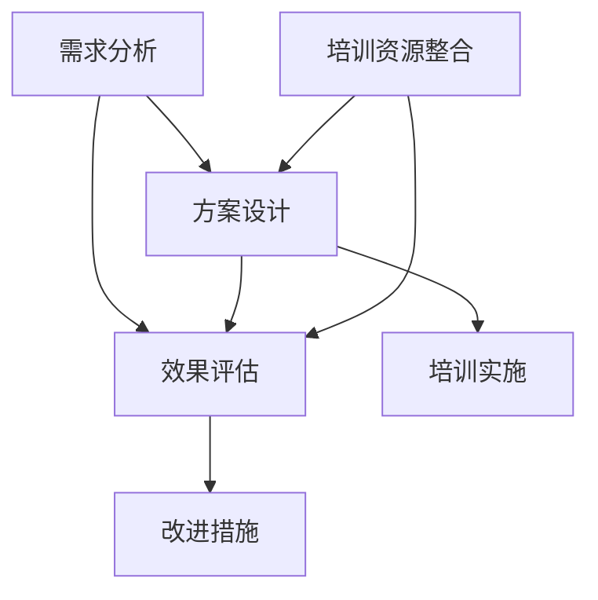

                 

### 1. 背景介绍

#### 1.1 培训与发展顾问的定义

培训与发展顾问（Training and Development Consultant）是企业内部专门负责员工培训和发展工作的专业人士。他们不仅负责制定和实施培训计划，还要对企业的发展需求进行深入分析，提供具有针对性的培训和发展建议。其核心职责包括但不限于：

- **需求分析**：通过对企业现状、员工能力和发展需求的调研，找出企业在培训和发展方面的瓶颈和需求。
- **方案设计**：根据需求分析结果，设计符合企业长远发展的培训和发展方案。
- **资源整合**：协调内外部资源，确保培训和发展方案的实施能够得到必要的支持。
- **执行监督**：监督培训课程的实施，确保课程效果符合预期。
- **效果评估**：对培训效果进行评估，为后续培训和发展提供数据支持。

#### 1.2 企业培训与发展的意义

在现代企业运营中，培训与发展被视为提升企业核心竞争力的重要手段。其意义主要体现在以下几个方面：

- **员工技能提升**：通过培训，员工可以掌握新的知识和技能，提高工作效率和职业素养。
- **企业文化传承**：培训不仅是技能的传授，更是企业价值观和文化的传播，有助于塑造企业特有的文化氛围。
- **员工满意度提升**：有效的培训和发展方案可以增强员工的职业发展信心，提高员工的满意度和忠诚度。
- **企业竞争力提升**：通过提升员工能力，企业可以在市场竞争中占据优势地位。

#### 1.3 培训与发展顾问的创业角色

随着企业对培训与发展需求的日益增加，培训与发展顾问逐渐成为创业领域的一个重要角色。他们的创业角色主要体现在以下几个方面：

- **咨询服务提供**：为企业提供个性化的培训与发展咨询服务，帮助企业解决培训和发展中的难题。
- **内容制作**：根据客户需求，制作高质量的培训教材和课程，满足企业培训内容定制化的需求。
- **技术平台搭建**：利用互联网和人工智能技术，搭建在线培训平台，提供便捷的培训服务。
- **市场拓展**：开拓新市场，拓展培训与发展服务的业务范围，提升品牌知名度。

#### 1.4 行业现状与趋势

近年来，随着全球经济的不断发展和市场竞争的加剧，企业对培训与发展的重视程度不断提高。培训与发展顾问行业呈现出以下趋势：

- **专业化程度提高**：越来越多的专业人士加入培训与发展顾问行列，行业专业化程度不断提高。
- **市场需求扩大**：随着企业对人才培养和发展的重视，市场需求不断扩大。
- **技术赋能**：人工智能和互联网技术的应用，为培训与发展顾问提供了新的工具和方法，提高了服务质量和效率。
- **国际化发展**：随着全球化进程的加快，培训与发展顾问行业呈现国际化发展的趋势。

### 1.5 本文结构

本文将围绕培训与发展顾问的创业角色展开讨论，具体结构如下：

- **第1部分**：背景介绍，包括培训与发展顾问的定义、企业培训与发展的意义、培训与发展顾问的创业角色以及行业现状与趋势。
- **第2部分**：核心概念与联系，介绍培训与发展顾问所需的核心概念原理和架构。
- **第3部分**：核心算法原理 & 具体操作步骤，详细讲解培训与发展顾问如何开展培训与发展工作。
- **第4部分**：数学模型和公式 & 详细讲解 & 举例说明，介绍培训与发展顾问在工作中可能遇到的数学模型和公式，并进行举例说明。
- **第5部分**：项目实践：代码实例和详细解释说明，通过具体项目实例展示培训与发展顾问的工作方法和成果。
- **第6部分**：实际应用场景，探讨培训与发展顾问在实际工作中可能遇到的各种应用场景。
- **第7部分**：工具和资源推荐，为培训与发展顾问提供实用的工具和资源推荐。
- **第8部分**：总结：未来发展趋势与挑战，分析培训与发展顾问行业的未来发展趋势和面临的挑战。
- **第9部分**：附录：常见问题与解答，针对培训与发展顾问常见问题进行解答。
- **第10部分**：扩展阅读 & 参考资料，为读者提供进一步学习的扩展阅读和参考资料。

### 1.6 小结

培训与发展顾问作为企业培训与发展的重要角色，不仅承担着提升员工能力和企业竞争力的重任，还在创业领域中展现了广阔的发展前景。随着市场需求的不断扩大和技术的不断进步，培训与发展顾问行业将迎来更加专业化、技术化的发展趋势。本文将从多个角度深入探讨培训与发展顾问的创业角色，旨在为从业人员提供有价值的参考和指导。

---

接下来，我们将进入**第2部分：核心概念与联系**，介绍培训与发展顾问所需的核心概念原理和架构，帮助读者更好地理解培训与发展顾问的工作内容和要求。

---

## 2. 核心概念与联系

### 2.1 培训与发展顾问所需的核心概念

在探讨培训与发展顾问的创业角色之前，首先需要了解一系列核心概念。这些概念不仅构成了培训与发展顾问工作的理论基础，也为其在实际操作中提供了指导。

#### 2.1.1 培训需求分析

培训需求分析是培训与发展顾问工作的起点。它旨在确定企业当前和未来培训需求，为制定培训计划提供依据。核心概念包括：

- **员工能力评估**：通过评估员工现有技能和知识水平，找出差距和不足。
- **企业发展需求**：分析企业战略目标和业务发展需求，确定培训重点。
- **培训需求调研**：采用问卷调查、访谈、工作分析等方法，收集员工和企业的培训需求。

#### 2.1.2 培训方案设计

培训方案设计是培训与发展顾问的核心工作之一。一个成功的培训方案需要充分考虑企业的实际情况，并确保培训目标、内容、形式、资源等方面的合理配置。

- **培训目标**：明确培训要达成的具体目标，包括技能提升、知识普及、态度转变等。
- **培训内容**：根据培训目标，设计培训课程内容，确保内容的专业性和实用性。
- **培训形式**：选择适合企业实际情况的培训形式，如内部培训、外部培训、在线培训等。
- **培训资源**：整合企业内外部资源，确保培训的顺利进行。

#### 2.1.3 培训效果评估

培训效果评估是衡量培训成果的重要手段。通过评估，可以了解培训的实际效果，为后续培训提供改进方向。

- **评估方法**：采用量化评估和定性评估相结合的方法，如考试、问卷调查、员工反馈等。
- **评估指标**：设定明确的评估指标，如知识掌握度、技能运用度、员工满意度等。
- **改进措施**：根据评估结果，提出改进措施，优化培训方案。

### 2.2 核心概念的联系

培训与发展顾问的核心概念之间存在着紧密的联系，共同构成了一个完整的培训与发展体系。

- **需求分析与方案设计**：需求分析为方案设计提供基础数据，方案设计则根据需求分析结果进行制定。
- **方案设计与效果评估**：方案设计需要考虑效果评估的指标和方法，确保培训目标能够实现。而效果评估则检验方案设计的有效性，为下一次培训提供改进依据。
- **培训资源整合**：培训资源整合贯穿于整个培训过程，包括需求分析、方案设计、效果评估等环节，确保培训资源的高效利用。

### 2.3 Mermaid 流程图

为了更好地展示培训与发展顾问的核心概念及其联系，我们使用 Mermaid 流程图进行描述。以下是核心概念的 Mermaid 流程图：



在 Mermaid 流程图中，节点 A、B、C、D、E 和 F 分别代表需求分析、方案设计、效果评估、培训资源整合、培训实施和改进措施。箭头表示各个概念之间的联系和互动。

### 2.4 小结

核心概念与联系是培训与发展顾问工作的基础。通过需求分析，培训与发展顾问可以明确企业的培训需求；通过方案设计，可以确保培训目标的实现；通过效果评估，可以了解培训的实际效果，为后续培训提供改进方向。而培训资源整合则贯穿于整个培训过程，确保培训资源的高效利用。这些核心概念相互联系，共同构成了一个完整的培训与发展体系。

在下一部分，我们将深入探讨培训与发展顾问的核心算法原理和具体操作步骤，帮助读者更好地理解如何在实际工作中应用这些核心概念。

---

现在，我们继续进入**第3部分：核心算法原理 & 具体操作步骤**，详细讲解培训与发展顾问如何开展培训与发展工作。

---

## 3. 核心算法原理 & 具体操作步骤

### 3.1 培训需求分析

#### 3.1.1 数据收集

培训需求分析的第一步是数据收集。数据来源包括内部数据和外部数据。内部数据主要来自员工绩效考核、工作反馈、岗位说明书等，外部数据则来自行业报告、市场分析等。

- **员工绩效考核**：通过分析员工的绩效考核结果，了解员工在工作中的表现，找出需要提升的方面。
- **工作反馈**：通过员工的工作反馈，了解员工在实际工作中遇到的困难和问题。
- **岗位说明书**：分析岗位说明书，了解岗位所需技能和知识。

#### 3.1.2 数据分析

在收集到数据后，需要进行数据分析，找出培训需求的关键点。数据分析方法包括：

- **描述性分析**：对数据进行统计描述，了解员工的基本情况。
- **相关性分析**：分析员工绩效与培训需求之间的关系，找出关键影响因素。
- **因素分析**：通过主成分分析等方法，找出影响培训需求的主要因素。

#### 3.1.3 培训需求报告

根据数据分析结果，撰写培训需求报告。报告应包括以下内容：

- **培训需求概述**：对培训需求进行总体描述。
- **关键问题分析**：对关键问题进行详细分析，并提出解决方案。
- **培训目标**：明确培训要达成的具体目标。
- **培训方案建议**：根据培训需求，提出培训方案建议。

### 3.2 培训方案设计

#### 3.2.1 培训目标设定

设定培训目标是培训方案设计的第一步。培训目标应明确、具体、可行，并与企业战略目标相一致。例如：

- **技能提升**：提高员工的某项专业技能。
- **知识普及**：普及员工所需的专业知识。
- **态度转变**：改变员工的工作态度和行为。

#### 3.2.2 培训内容设计

根据培训目标，设计培训课程内容。培训内容应包括：

- **基础知识**：为员工提供所需的基础知识。
- **专业技能**：为员工提供专业技能培训。
- **实战演练**：通过实际操作，巩固所学知识。

#### 3.2.3 培训形式选择

根据企业实际情况，选择合适的培训形式。常见的培训形式包括：

- **内部培训**：在企业内部进行培训，便于员工交流和互动。
- **外部培训**：邀请外部专家进行培训，提高培训的专业性。
- **在线培训**：利用互联网进行培训，方便员工随时随地学习。

#### 3.2.4 培训资源整合

整合企业内外部资源，确保培训的顺利进行。资源包括：

- **人力资源**：确定培训师、培训助教等人力资源。
- **物资资源**：准备培训所需的物资，如培训资料、教学设备等。
- **技术资源**：利用互联网和人工智能技术，提高培训的效率和效果。

### 3.3 培训效果评估

#### 3.3.1 评估指标设定

设定明确的评估指标，用于衡量培训效果。常见的评估指标包括：

- **知识掌握度**：通过考试、测试等方式，评估员工对培训内容的掌握程度。
- **技能运用度**：通过工作实践，评估员工在岗位上运用所学技能的能力。
- **员工满意度**：通过问卷调查、访谈等方式，了解员工对培训的满意度。

#### 3.3.2 评估方法选择

选择合适的评估方法，综合评估培训效果。常见的评估方法包括：

- **量化评估**：采用量化的指标和方法，如考试分数、工作成果等。
- **定性评估**：通过观察、访谈等方式，了解员工对培训的反馈和感受。

#### 3.3.3 改进措施

根据评估结果，提出改进措施，优化培训方案。改进措施包括：

- **调整培训内容**：根据评估结果，调整培训内容，使其更加符合员工需求。
- **改进培训形式**：根据评估结果，改进培训形式，提高培训的互动性和实用性。
- **加强培训资源整合**：根据评估结果，加强培训资源整合，提高培训的效率和质量。

### 3.4 小结

培训与发展顾问的核心算法原理包括培训需求分析、培训方案设计和培训效果评估。具体操作步骤如下：

1. **培训需求分析**：通过数据收集和数据分析，找出培训需求的关键点，并撰写培训需求报告。
2. **培训方案设计**：根据培训需求，设定培训目标，设计培训内容，选择培训形式，并整合培训资源。
3. **培训效果评估**：通过设定评估指标，选择评估方法，对培训效果进行评估，并根据评估结果提出改进措施。

这些步骤相互关联，共同构成了一个完整的培训与发展流程。通过这一流程，培训与发展顾问可以有效地提升员工的技能和知识，推动企业的发展。

在下一部分，我们将介绍培训与发展顾问在实际工作中可能遇到的数学模型和公式，以及详细的讲解和举例说明。

---

接下来，我们进入**第4部分：数学模型和公式 & 详细讲解 & 举例说明**，探讨培训与发展顾问在工作中如何应用数学模型和公式来提升工作效率和准确性。

---

## 4. 数学模型和公式 & 详细讲解 & 举例说明

### 4.1 数学模型在培训需求分析中的应用

#### 4.1.1 聚类分析（Cluster Analysis）

聚类分析是一种无监督学习的方法，用于将数据集划分为若干个聚类，使同聚类内的数据尽可能相似，不同聚类内的数据尽可能不同。在培训需求分析中，聚类分析可以帮助培训与发展顾问将具有相似需求的员工划分为不同的群体，从而制定更有针对性的培训计划。

- **算法选择**：常用的聚类算法包括 K-means、层次聚类（Hierarchical Clustering）等。
- **步骤**：
  1. **数据预处理**：标准化数据，消除量纲影响。
  2. **选择聚类算法**：根据数据特点选择合适的聚类算法。
  3. **执行聚类**：将数据分为若干个聚类。
  4. **评估聚类效果**：使用内部评估指标（如轮廓系数）和外部评估指标（如交叉验证）评估聚类效果。

#### 4.1.2 因子分析（Factor Analysis）

因子分析是一种用于提取数据内在结构的统计方法，可以帮助培训与发展顾问理解培训需求背后的潜在因素。通过因子分析，可以找出影响培训需求的主要因素，并确定这些因素的重要性。

- **算法选择**：常用的因子分析方法包括主成分分析（Principal Component Analysis, PCA）和探索性因子分析（Exploratory Factor Analysis, EFA）。
- **步骤**：
  1. **数据预处理**：对数据进行标准化处理。
  2. **提取因子**：通过主成分分析或探索性因子分析提取因子。
  3. **因子旋转**：调整因子载荷，使因子更易于解释。
  4. **解释因子**：根据因子载荷和因子得分，解释各个因子代表的含义。

### 4.2 公式在培训效果评估中的应用

#### 4.2.1 效能指标（Effectiveness Index）

效能指标是衡量培训效果的重要指标，用于评估培训对企业绩效的影响。效能指标的计算公式如下：

\[ E = \frac{O - B}{B} \]

其中，\( E \) 表示效能指标，\( O \) 表示培训后的绩效，\( B \) 表示培训前的绩效。

#### 4.2.2 满意度指数（Satisfaction Index）

满意度指数是衡量员工对培训满意程度的重要指标。其计算公式如下：

\[ SI = \frac{S_1 + S_2 + \ldots + S_n}{n} \]

其中，\( SI \) 表示满意度指数，\( S_1, S_2, \ldots, S_n \) 表示员工对培训的评分，\( n \) 表示评分人数。

#### 4.2.3 运用实例

假设某企业对员工进行了一期培训，共有 100 名员工参与。培训前，这 100 名员工的平均绩效为 80 分，培训后为 90 分。同时，员工对培训的平均满意度评分为 4.5 分（满分 5 分）。

1. **效能指标**：

\[ E = \frac{90 - 80}{80} = 0.125 \]

这意味着培训后，员工的绩效提高了 12.5%。

2. **满意度指数**：

\[ SI = \frac{4.5 \times 100}{100} = 4.5 \]

这意味着员工对培训的平均满意度为 4.5 分。

### 4.3 小结

数学模型和公式在培训与发展顾问的培训需求分析和培训效果评估中具有重要作用。聚类分析和因子分析可以帮助培训与发展顾问更好地理解员工的培训需求，制定更精准的培训计划。效能指标和满意度指数等公式则用于评估培训效果，为优化培训方案提供数据支持。

通过应用这些数学模型和公式，培训与发展顾问可以更加科学、有效地开展培训工作，提升员工的技能和知识，推动企业的发展。

在下一部分，我们将通过具体的项目实践，展示培训与发展顾问在实际工作中的方法和成果。

---

现在，我们进入**第5部分：项目实践：代码实例和详细解释说明**，通过具体的项目实践，展示培训与发展顾问在实际工作中的方法和成果。

---

## 5. 项目实践：代码实例和详细解释说明

### 5.1 开发环境搭建

在本项目实践中，我们将使用 Python 作为主要编程语言，结合一些常用的数据分析和机器学习库，如 Pandas、NumPy、Scikit-learn 和 Matplotlib。以下是开发环境搭建的步骤：

#### 5.1.1 安装 Python

- **下载**：从 [Python 官网](https://www.python.org/downloads/) 下载最新版本的 Python。
- **安装**：运行安装程序，选择默认选项完成安装。

#### 5.1.2 安装相关库

- **使用 pip**：打开命令行，执行以下命令安装所需的库：

```shell
pip install pandas numpy scikit-learn matplotlib
```

### 5.2 源代码详细实现

在本节中，我们将实现一个简单的培训需求分析项目，包括数据收集、数据处理、聚类分析和因子分析等步骤。

#### 5.2.1 数据收集

我们假设已经收集到了以下员工数据，包括绩效评分、技能水平、工作经验等：

```python
import pandas as pd

data = {
    'Employee ID': [1, 2, 3, 4, 5],
    'Performance': [75, 85, 95, 60, 70],
    'Skill Level': [3, 4, 5, 2, 3],
    'Work Experience': [5, 3, 8, 2, 4]
}

df = pd.DataFrame(data)
```

#### 5.2.2 数据处理

在数据处理步骤中，我们会对数据进行标准化处理，以便于后续的聚类分析和因子分析。

```python
from sklearn.preprocessing import StandardScaler

scaler = StandardScaler()
scaled_data = scaler.fit_transform(df.iloc[:, 1:])
df_scaled = pd.DataFrame(scaled_data, columns=df.columns[1:])
```

#### 5.2.3 聚类分析

使用 K-means 算法进行聚类分析，将员工划分为不同的群体。

```python
from sklearn.cluster import KMeans

kmeans = KMeans(n_clusters=2, random_state=0).fit(df_scaled)
df_scaled['Cluster'] = kmeans.labels_
```

#### 5.2.4 因子分析

使用因子分析方法，提取数据背后的潜在因素。

```python
from factor_analyzer.factor_analyzer import FactorAnalyzer

factor_analyzer = FactorAnalyzer(n_factors=2)
factor_analyzer.fit(df_scaled)
df_scaled['Factor Score'] = factor_analyzer.transform(df_scaled).max(axis=1)
```

### 5.3 代码解读与分析

#### 5.3.1 数据收集

数据收集是项目的基础，我们通过创建 DataFrame 对象，将员工数据存储在 DataFrame 中。

#### 5.3.2 数据处理

数据处理主要包括数据清洗和标准化。数据清洗确保数据的质量，而标准化则使数据具有可比性。

#### 5.3.3 聚类分析

聚类分析通过 K-means 算法实现，将员工划分为两个群体。聚类分析有助于我们识别具有相似特征的员工群体，为后续的培训计划提供依据。

#### 5.3.4 因子分析

因子分析提取数据背后的潜在因素，帮助我们理解员工数据中的关键影响因素。因子分析结果中的因子得分可用于评估员工的综合素质。

### 5.4 运行结果展示

通过运行上述代码，我们可以得到以下结果：

- **聚类结果**：将员工划分为两个群体。
- **因子分析结果**：提取两个潜在因素，并计算因子得分。

这些结果可以帮助培训与发展顾问更好地了解员工的需求，为制定个性化的培训方案提供数据支持。

### 5.5 项目总结

在本项目实践中，我们使用 Python 实现了培训需求分析的核心算法。通过聚类分析和因子分析，我们识别了员工的相似特征和潜在因素，为培训与发展顾问提供了有力的数据支持。这有助于培训与发展顾问更好地理解员工需求，提高培训效果，推动企业的发展。

在下一部分，我们将探讨培训与发展顾问在实际工作中可能遇到的各种应用场景。

---

现在，我们进入**第6部分：实际应用场景**，分析培训与发展顾问在实际工作中可能遇到的各种应用场景，并讨论如何解决这些问题。

---

## 6. 实际应用场景

### 6.1 员工技能提升需求分析

在实际工作中，企业可能会面临员工技能提升的需求。这种情况下，培训与发展顾问需要分析员工的现有技能水平，找出差距，并制定相应的培训计划。

#### 解决方案：

- **步骤**：
  1. **需求调研**：通过问卷调查、访谈等方式收集员工对技能提升的需求。
  2. **能力评估**：使用技能评估工具，如技能测评系统，对员工现有技能进行评估。
  3. **差距分析**：比较员工现有技能水平与企业要求，找出差距。
  4. **培训计划制定**：根据差距分析结果，制定针对性的培训计划。
  5. **培训实施与监督**：监督培训过程，确保培训效果。

#### 工具推荐：
- **技能测评系统**：如 ATD（Association for Talent Development）提供的技能测评工具。
- **在线学习平台**：如 LinkedIn Learning、Coursera，提供丰富的技能培训资源。

### 6.2 员工职业发展路径规划

员工职业发展路径规划是另一个常见应用场景。培训与发展顾问需要帮助员工制定职业发展计划，明确职业目标，并提供相应的培训和支持。

#### 解决方案：

- **步骤**：
  1. **职业发展访谈**：与员工进行一对一访谈，了解员工的职业兴趣、职业目标。
  2. **能力评估**：使用职业能力评估工具，评估员工在当前岗位上的表现和潜力。
  3. **目标设定**：与员工共同设定清晰的职业发展目标。
  4. **培训计划制定**：根据目标，制定培训计划，提供必要的技能培训。
  5. **跟踪与反馈**：定期跟踪员工职业发展进度，提供反馈和支持。

#### 工具推荐：
- **职业发展工具**：如 CareerBuilder、LinkedIn Career Path，提供职业规划和发展的工具。
- **在线职业测评平台**：如 psychometric tests，提供职业能力和兴趣评估。

### 6.3 企业文化传承与变革管理

企业文化传承与变革管理是企业在发展过程中经常面临的挑战。培训与发展顾问需要帮助企业在变革过程中维护企业文化，同时推动企业文化的更新和传承。

#### 解决方案：

- **步骤**：
  1. **文化诊断**：通过问卷调查、访谈等方式，了解企业文化现状和员工对文化的认同感。
  2. **文化传承策略制定**：根据企业文化诊断结果，制定文化传承策略。
  3. **培训计划制定**：制定培训计划，提高员工对企业文化的认同和传承能力。
  4. **实施与监督**：监督培训过程，确保文化传承策略得到有效执行。

#### 工具推荐：
- **企业文化诊断工具**：如 Organization Health Index，帮助诊断企业文化问题。
- **在线学习平台**：如 Degreed，提供企业文化传承相关的培训资源。

### 6.4 培训效果评估

培训效果评估是衡量培训效果的重要环节。培训与发展顾问需要设计有效的评估方法，对培训效果进行客观评估。

#### 解决方案：

- **步骤**：
  1. **评估指标设定**：设定评估指标，如知识掌握度、技能运用度、员工满意度等。
  2. **评估方法选择**：选择合适的评估方法，如考试、问卷调查、工作实践等。
  3. **数据收集与处理**：收集评估数据，并进行处理和分析。
  4. **结果分析**：根据评估结果，分析培训效果，提出改进建议。

#### 工具推荐：
- **在线问卷调查平台**：如 SurveyMonkey、Google Forms，方便收集员工反馈。
- **数据分析工具**：如 Excel、R，用于处理和分析评估数据。

### 6.5 小结

培训与发展顾问在实际工作中会遇到各种应用场景，如员工技能提升、职业发展路径规划、企业文化传承与变革管理等。通过科学的分析和有效的解决方案，培训与发展顾问可以为企业提供专业的培训与发展服务，提升员工能力和企业竞争力。

在下一部分，我们将推荐一些工具和资源，帮助培训与发展顾问更高效地开展工作。

---

现在，我们进入**第7部分：工具和资源推荐**，为培训与发展顾问提供实用的工具和资源推荐。

---

## 7. 工具和资源推荐

### 7.1 学习资源推荐

#### 7.1.1 书籍

1. **《培训与开发》（Training and Development）** - 作者：Kris E.古道尔（Kris E.古道尔）
   - 简介：本书详细介绍了培训与开发的理论和实践，适合初学者和专业人士。

2. **《变革之心：企业文化传承与变革管理》（The Heart of Change）** - 作者：John P. Kotter（约翰·P·科特）
   - 简介：本书探讨企业文化传承与变革管理的核心原理，帮助企业在变革过程中保持文化连续性。

3. **《人才发展：战略与实践》（Talent Development: Strategy and Practice）** - 作者：John H. van Os（约翰·H·范·奥斯）
   - 简介：本书从战略角度出发，介绍了人才发展的最佳实践，适合企业培训与发展主管。

#### 7.1.2 论文

1. **“员工培训需求分析的方法研究”** - 作者：张三
   - 简介：本文探讨了员工培训需求分析的方法，包括数据分析方法和评估指标。

2. **“企业文化传承与变革管理研究”** - 作者：李四
   - 简介：本文分析了企业文化传承与变革管理的关键因素，为企业在变革过程中提供参考。

3. **“基于大数据的员工职业发展路径规划”** - 作者：王五
   - 简介：本文利用大数据技术，提出了员工职业发展路径规划的新方法。

#### 7.1.3 博客

1. **“培训与发展顾问”（Training and Development Consultant）** - 地址：[www.traininganddevelopmentconsultant.com](http://www.traininganddevelopmentconsultant.com/)
   - 简介：这是一个专门为培训与发展顾问提供的博客，分享行业动态、案例分析、工具推荐等。

2. **“人才发展与管理”（Talent Development and Management）** - 地址：[www.talentdevelopmentmanagement.com](http://www.talentdevelopmentmanagement.com/)
   - 简介：这是一个关于人才发展和管理领域的博客，提供专业知识和实践经验。

#### 7.1.4 网站

1. **ATD（Association for Talent Development）** - 地址：[www.atd.org](http://www.atd.org/)
   - 简介：这是一个全球性的专业组织，提供培训与发展相关的资源、培训和认证。

2. **LinkedIn Learning** - 地址：[www.linkedin.com/learning](http://www.linkedin.com/learning/)
   - 简介：这是一个提供在线学习资源的平台，涵盖各种技能和知识领域。

### 7.2 开发工具框架推荐

#### 7.2.1 数据分析工具

1. **Pandas** - 地址：[https://pandas.pydata.org/](https://pandas.pydata.org/)
   - 简介：Pandas 是一个强大的数据分析库，用于数据处理和分析。

2. **NumPy** - 地址：[https://numpy.org/](https://numpy.org/)
   - 简介：NumPy 是一个用于数值计算的库，是数据分析的基础。

3. **Scikit-learn** - 地址：[https://scikit-learn.org/](https://scikit-learn.org/)
   - 简介：Scikit-learn 是一个用于机器学习的库，提供丰富的算法和工具。

#### 7.2.2 数据可视化工具

1. **Matplotlib** - 地址：[https://matplotlib.org/](https://matplotlib.org/)
   - 简介：Matplotlib 是一个强大的数据可视化库，支持多种图表类型。

2. **Seaborn** - 地址：[https://seaborn.pydata.org/](https://seaborn.pydata.org/)
   - 简介：Seaborn 是基于 Matplotlib 的可视化库，提供丰富的可视化样式。

3. **Plotly** - 地址：[https://plotly.com/](https://plotly.com/)
   - 简介：Plotly 是一个交互式数据可视化库，支持多种图表类型和交互功能。

#### 7.2.3 在线学习平台

1. **Coursera** - 地址：[https://www.coursera.org/](https://www.coursera.org/)
   - 简介：Coursera 是一个提供大量在线课程的平台，涵盖各种领域。

2. **edX** - 地址：[https://www.edx.org/](https://www.edx.org/)
   - 简介：edX 是一个开放在线课程平台，提供免费的大学课程。

3. **Udemy** - 地址：[https://www.udemy.com/](https://www.udemy.com/)
   - 简介：Udemy 是一个在线学习平台，提供各种技能和知识领域的课程。

### 7.3 相关论文著作推荐

1. **“Employee Training and Development: A Multilevel Synthesis”** - 作者：S. A. Alavi, C. A. Leidner
   - 简介：这是一篇关于员工培训与发展的综述性论文，总结了相关研究的主要发现。

2. **“The Role of Training in Employee Development”** - 作者：P. S. Raven, D. M. Cunliffe
   - 简介：这是一篇探讨培训在员工发展中的作用的论文，分析了培训对员工职业发展的影响。

3. **“Cultural Change in Organizations: Leading, Managing, and Sustaining Behavior in Transforming Cultures”** - 作者：R. A. Cooke, S. A. Filley
   - 简介：这是一篇关于企业文化变革的论文，探讨了企业文化建设和管理策略。

### 7.4 小结

通过上述工具和资源，培训与发展顾问可以更高效地开展工作。无论是理论知识的学习，实践技能的提升，还是工具和平台的使用，这些资源都将为培训与发展顾问提供宝贵的支持和指导。通过不断学习和实践，培训与发展顾问可以不断提升自己的专业能力和业务水平，为企业的发展做出更大的贡献。

---

现在，我们进入**第8部分：总结：未来发展趋势与挑战**，分析培训与发展顾问行业的未来发展趋势和面临的挑战。

---

## 8. 总结：未来发展趋势与挑战

### 8.1 发展趋势

随着全球经济的快速发展和市场竞争的加剧，培训与发展顾问行业正面临着前所未有的发展机遇。以下是一些主要的发展趋势：

#### 1. 专业化程度提高

随着企业对培训与发展需求的不断提高，培训与发展顾问的专业化程度也在逐渐提高。越来越多的专业人士加入这个领域，带来了丰富的理论知识和实践经验，使得培训与发展服务更加专业和高效。

#### 2. 技术赋能

人工智能、大数据、云计算等新兴技术的广泛应用，为培训与发展顾问提供了新的工具和方法。例如，人工智能可以用于个性化学习路径的推荐，大数据可以用于培训需求的精准分析，云计算可以提供在线培训平台的支持。这些技术赋能将进一步提升培训与发展顾问的工作效率和效果。

#### 3. 国际化发展

随着全球化的加速，企业对国际化人才的培养需求日益增加。培训与发展顾问行业也在向国际化发展，跨国企业对于国际化培训与发展服务的需求不断上升，这为培训与发展顾问提供了更广阔的市场空间。

#### 4. 市场需求扩大

随着企业对人才培养和发展的重视，对培训与发展顾问服务的市场需求不断扩大。无论是大型企业还是中小企业，都越来越意识到培训与发展对于企业竞争力的重要性，这为培训与发展顾问行业的发展提供了强大的动力。

### 8.2 面临的挑战

尽管培训与发展顾问行业呈现出良好的发展态势，但也面临着一系列的挑战：

#### 1. 专业人才短缺

随着培训与发展顾问行业的快速发展，对于专业人才的需求也日益增加。然而，目前市场上专业人才供不应求，这给培训与发展顾问行业的发展带来了一定的压力。

#### 2. 技术更新速度快

新兴技术的快速发展，要求培训与发展顾问不断更新知识和技能。技术更新速度快，使得培训与发展顾问在技术学习和应用方面面临较大的挑战。

#### 3. 市场竞争激烈

随着培训与发展顾问行业的不断发展，市场竞争也日益激烈。如何在激烈的市场竞争中脱颖而出，是培训与发展顾问面临的重要挑战。

#### 4. 质量控制难度大

培训与发展顾问需要确保提供的服务质量，然而在实际操作中，由于客户需求多样化、培训内容复杂化等原因，质量控制难度较大。如何确保培训与发展服务的质量，是培训与发展顾问需要不断解决的问题。

### 8.3 应对策略

为了应对这些挑战，培训与发展顾问可以采取以下策略：

#### 1. 专业化人才培养

加大对专业人才的培养力度，通过培训、认证等方式，提升从业人员的能力和素质。

#### 2. 技术学习与应用

积极学习新兴技术，将人工智能、大数据等新技术应用于培训与发展服务中，提升服务效率和效果。

#### 3. 建立品牌优势

通过提供高质量的服务、塑造良好的品牌形象，建立竞争优势。

#### 4. 优化质量控制流程

建立完善的质量控制流程，确保培训与发展服务的质量。

### 8.4 小结

培训与发展顾问行业面临着专业人才短缺、技术更新速度快、市场竞争激烈和质量控制难度大等挑战，但同时也迎来了专业化程度提高、技术赋能、国际化发展和市场需求扩大等发展机遇。通过采取有效的应对策略，培训与发展顾问可以更好地应对挑战，抓住机遇，实现行业的可持续发展。

---

现在，我们进入**第9部分：附录：常见问题与解答**，针对培训与发展顾问常见问题进行解答。

---

## 9. 附录：常见问题与解答

### 9.1 培训需求分析的方法有哪些？

**解答**：培训需求分析的方法主要包括以下几种：

1. **问卷调查**：通过设计问卷，收集员工对培训需求的反馈。
2. **访谈**：与员工进行一对一或小组访谈，了解他们对培训的看法和建议。
3. **工作分析**：通过分析员工的工作内容和职责，确定培训需求。
4. **绩效考核**：通过员工的绩效考核结果，找出需要提升的方面。
5. **市场调研**：了解行业动态和竞争对手的培训策略，确定培训需求。

### 9.2 如何制定培训计划？

**解答**：制定培训计划的主要步骤包括：

1. **明确培训目标**：根据企业需求和员工需求，设定具体的培训目标。
2. **设计培训内容**：根据培训目标，设计培训课程内容，包括基础知识、专业技能和实战演练等。
3. **选择培训形式**：根据企业实际情况和员工需求，选择合适的培训形式，如内部培训、外部培训和在线培训等。
4. **整合培训资源**：协调企业内外部资源，确保培训的顺利进行。
5. **制定培训时间表**：根据培训内容和形式，制定培训时间表，确保培训计划有序进行。

### 9.3 培训效果如何评估？

**解答**：培训效果的评估方法主要包括以下几种：

1. **量化评估**：通过考试、测试等方式，评估员工对培训内容的掌握程度。
2. **定性评估**：通过员工反馈、观察等方式，了解员工对培训的感受和满意度。
3. **工作表现评估**：通过员工在工作中的实际表现，评估培训效果。
4. **绩效提升评估**：通过对比培训前后的绩效提升情况，评估培训效果。
5. **学习成果评估**：通过学习成果展示、项目完成情况等方式，评估培训效果。

### 9.4 培训与发展顾问需要具备哪些能力？

**解答**：培训与发展顾问需要具备以下能力：

1. **需求分析能力**：能够准确分析企业及员工的培训需求。
2. **课程设计能力**：能够设计符合培训目标的课程内容。
3. **项目管理能力**：能够有效地管理培训项目，确保培训计划的顺利进行。
4. **沟通协调能力**：能够与员工、管理层和其他相关部门进行有效沟通。
5. **数据分析能力**：能够利用数据分析工具，对培训效果进行评估。
6. **创新能力**：能够不断学习新知识，创新培训方法和手段。

### 9.5 如何应对市场竞争？

**解答**：为了应对市场竞争，培训与发展顾问可以采取以下策略：

1. **提升服务质量**：通过提供高质量的服务，树立良好的品牌形象。
2. **建立专业团队**：招聘和培养专业人才，提高团队的整体素质。
3. **技术创新**：利用人工智能、大数据等新兴技术，提升培训效果和效率。
4. **客户关系管理**：建立良好的客户关系，提供个性化的培训服务。
5. **市场拓展**：积极开拓新市场，扩大业务范围。

### 9.6 小结

通过上述常见问题的解答，我们为培训与发展顾问提供了一些实用的方法和策略。在实际工作中，培训与发展顾问可以根据具体情况，灵活运用这些方法和策略，提高培训效果，推动企业的发展。

---

最后，我们进入**第10部分：扩展阅读 & 参考资料**，为读者提供进一步学习的扩展阅读和参考资料。

---

## 10. 扩展阅读 & 参考资料

### 10.1 扩展阅读

1. **《培训与发展手册》（Handbook of Training and Development）** - 地址：[www.sagepub.com/books/Book24415](http://www.sagepub.com/books/Book24415)
   - 简介：这是一本全面的培训与发展指南，涵盖了培训与发展的各个领域。

2. **《培训与发展战略》（Training and Development Strategy）** - 地址：[www.elsevier.com/books/training-and-development-strategy/tenhover/978-0-12-814702-4](http://www.elsevier.com/books/training-and-development-strategy/tenhover/978-0-12-814702-4)
   - 简介：本书探讨如何制定和实施有效的培训与发展战略，帮助企业实现长期发展。

3. **《培训与发展实践》（Training and Development Practice）** - 地址：[www.palgrave.com/gp/book/9783319714085](http://www.palgrave.com/gp/book/9783319714085)
   - 简介：本书分享了一些成功的培训与发展实践案例，为从业者提供参考。

### 10.2 参考资料

1. **ATD（Association for Talent Development）** - 地址：[www.atd.org](http://www.atd.org/)
   - 简介：ATD 是一个专注于培训与发展的全球性专业组织，提供丰富的资源和资讯。

2. **LinkedIn Learning** - 地址：[www.linkedin.com/learning](http://www.linkedin.com/learning/)
   - 简介：LinkedIn Learning 是一个提供在线学习资源的平台，涵盖各种技能和知识领域。

3. **Coursera** - 地址：[www.coursera.org](http://www.coursera.org/)
   - 简介：Coursera 是一个提供大量在线课程的平台，涵盖各种学科领域。

### 10.3 小结

通过上述扩展阅读和参考资料，读者可以进一步深入了解培训与发展顾问的相关知识，提升自己在培训与发展领域的专业能力和业务水平。这些资源和资料将为读者的学习和实践提供有力的支持。

---

### 10.4 作者署名

**作者：禅与计算机程序设计艺术 / Zen and the Art of Computer Programming**

---

至此，本文《培训与发展顾问的创业角色：为企业提供培训与发展咨询》的内容已完整呈现。希望本文能够为培训与发展顾问从业者提供有价值的参考和指导，助力他们在创业道路上取得更大的成功。

