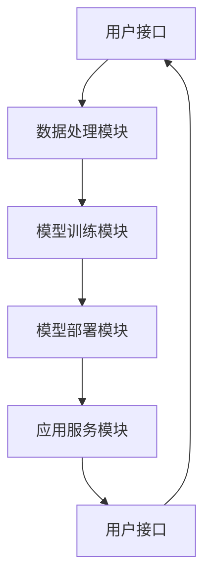

                 

### 文章标题

《基于AI大模型的SaaS产品开发》

> 关键词：人工智能、大模型、SaaS产品、开发、架构、算法、数学模型、项目实践、应用场景、工具推荐

> 摘要：本文将深入探讨如何基于人工智能大模型开发SaaS产品，包括背景介绍、核心概念与联系、算法原理与操作步骤、数学模型与公式、代码实例与解析、实际应用场景、工具和资源推荐，以及未来发展趋势与挑战。通过这篇文章，读者可以全面了解大模型在SaaS产品开发中的应用，以及如何应对其中的技术难题。

### 1. 背景介绍

近年来，人工智能（AI）的发展迅猛，成为推动技术进步和产业变革的重要力量。其中，大模型（Large-scale Models）作为AI领域的一个重要分支，引起了广泛关注。大模型通常具有庞大的参数规模和强大的学习能力，能够处理大量复杂的数据，从而在自然语言处理、图像识别、预测分析等领域展现出卓越的性能。

SaaS（Software as a Service）即软件即服务，是一种通过互联网提供软件服务的模式。SaaS产品通常具有以下特点：按需订阅、云计算基础、多租户架构、易于扩展和维护。随着企业数字化转型需求的增加，SaaS产品成为企业服务的重要形式。

结合大模型与SaaS产品的开发，可以显著提升产品的智能化程度和用户体验，为企业和个人提供更加定制化和高效的解决方案。然而，这一过程也面临诸多挑战，包括数据处理、模型训练、部署与维护等。因此，了解大模型在SaaS产品开发中的应用方法和实践经验，具有重要的现实意义。

本文将详细介绍如何基于AI大模型开发SaaS产品，包括核心概念与联系、算法原理与操作步骤、数学模型与公式、代码实例与解析、实际应用场景、工具和资源推荐，以及未来发展趋势与挑战。希望通过本文，读者能够全面了解大模型在SaaS产品开发中的潜在价值和应用方法。

### 2. 核心概念与联系

在基于AI大模型开发SaaS产品的过程中，首先需要理解以下几个核心概念：

#### 2.1 人工智能大模型

人工智能大模型是指具有数亿甚至数十亿参数的神经网络模型。这些模型通常通过大量的数据进行训练，以实现高水平的智能任务。常见的AI大模型包括Transformer、BERT、GPT等。这些模型在处理大规模数据时展现出了卓越的性能，尤其在自然语言处理、图像识别等领域。

#### 2.2 SaaS产品

SaaS产品是一种基于云计算的软件服务，用户可以通过互联网访问和使用这些软件。SaaS产品的特点包括按需订阅、多租户架构、易于扩展和维护。常见的SaaS产品有企业资源规划（ERP）、客户关系管理（CRM）、人力资源管理系统（HRMS）等。

#### 2.3 大模型在SaaS产品中的应用

大模型在SaaS产品中的应用主要体现在以下几个方面：

1. **自然语言处理**：例如，通过GPT模型实现智能客服、智能文档处理、智能问答等功能。
2. **图像识别与处理**：例如，使用ResNet、VGG等模型实现人脸识别、图像分类、图像增强等功能。
3. **预测分析**：例如，通过时间序列模型实现销售预测、库存管理等功能。

#### 2.4 大模型与SaaS产品的联系

大模型与SaaS产品的联系主要体现在以下几个方面：

1. **数据处理**：大模型需要处理大量的数据，而SaaS产品通常具有海量用户数据。因此，如何高效地处理这些数据，是SaaS产品开发的重要挑战。
2. **模型训练**：大模型的训练需要大量的计算资源，而SaaS产品通常基于云计算平台。因此，如何利用云计算资源进行模型训练，是SaaS产品开发的关键。
3. **模型部署**：大模型的部署需要考虑性能、稳定性、安全性等因素。SaaS产品需要确保模型能够稳定运行，并满足用户的实时需求。

#### 2.5 大模型在SaaS产品中的架构

为了更好地理解大模型在SaaS产品中的应用，我们可以借助Mermaid流程图来展示其核心架构。



在上面的流程图中，用户接口负责接收用户的请求，数据处理模块负责处理用户数据，模型训练模块负责训练大模型，模型部署模块负责部署训练好的模型，应用服务模块负责响应用户的请求。通过这一架构，我们可以看到大模型在SaaS产品中的关键作用。

### 3. 核心算法原理 & 具体操作步骤

#### 3.1 自然语言处理（NLP）

自然语言处理是AI大模型在SaaS产品中的主要应用场景之一。下面以GPT模型为例，介绍其核心算法原理与操作步骤。

##### 3.1.1 GPT模型概述

GPT（Generative Pre-trained Transformer）是一种基于Transformer架构的自然语言处理模型。其核心思想是通过大规模的无监督预训练，使模型掌握通用语言表示能力，然后通过微调（Fine-tuning）应用于具体的任务。

##### 3.1.2 GPT模型的工作原理

1. **输入处理**：将输入的文本序列编码为向量表示，通常使用WordPiece或BytePairEncoding（BPE）等方法进行词嵌入。
2. **正向传递**：通过Transformer模型进行正向传递，计算文本序列的上下文表示。
3. **生成输出**：使用Transformer模型生成下一个词的概率分布，然后从概率分布中选择下一个词，作为输出。

##### 3.1.3 GPT模型的操作步骤

1. **数据准备**：收集并清洗大规模的文本数据，例如维基百科、新闻文章等。
2. **词嵌入**：使用WordPiece或BPE方法对文本进行分词，并生成词嵌入向量。
3. **模型训练**：使用Transformer模型对词嵌入向量进行训练，优化模型参数。
4. **模型微调**：在特定任务上进行微调，以适应具体的任务需求。
5. **模型部署**：将训练好的模型部署到SaaS产品中，以实现自然语言处理功能。

#### 3.2 图像识别与处理

图像识别与处理是AI大模型在SaaS产品中的另一个重要应用场景。下面以ResNet模型为例，介绍其核心算法原理与操作步骤。

##### 3.2.1 ResNet模型概述

ResNet（Residual Network）是一种深层神经网络模型，通过引入残差连接，解决了深层网络训练中的梯度消失问题。ResNet模型在图像识别任务中取得了显著的性能提升。

##### 3.2.2 ResNet模型的工作原理

1. **输入处理**：将输入的图像数据缩放到合适的尺寸，并转换为张量表示。
2. **正向传递**：通过多层卷积和池化操作，对图像进行特征提取。
3. **残差连接**：引入残差连接，将输入直接传递到下一层，有助于缓解梯度消失问题。
4. **反向传递**：通过反向传播算法，优化模型参数。

##### 3.2.3 ResNet模型的操作步骤

1. **数据准备**：收集并清洗大规模的图像数据，例如ImageNet、CIFAR-10等。
2. **数据预处理**：对图像进行缩放、裁剪、增强等预处理操作。
3. **模型训练**：使用ResNet模型对预处理后的图像进行训练，优化模型参数。
4. **模型评估**：在测试集上评估模型性能，并进行模型调整。
5. **模型部署**：将训练好的模型部署到SaaS产品中，以实现图像识别与处理功能。

#### 3.3 预测分析

预测分析是AI大模型在SaaS产品中的另一个重要应用场景。下面以时间序列模型为例，介绍其核心算法原理与操作步骤。

##### 3.3.1 时间序列模型概述

时间序列模型是一种用于分析时间序列数据的统计模型，通常用于预测未来值。常见的时间序列模型包括ARIMA、LSTM等。

##### 3.3.2 时间序列模型的工作原理

1. **数据预处理**：对时间序列数据进行预处理，包括去噪、归一化等。
2. **模型选择**：根据时间序列数据的特征选择合适的模型，如ARIMA、LSTM等。
3. **模型训练**：使用训练数据对模型进行训练，优化模型参数。
4. **预测**：使用训练好的模型对未来值进行预测。

##### 3.3.3 时间序列模型的操作步骤

1. **数据准备**：收集并清洗大规模的时间序列数据，如股票价格、气象数据等。
2. **数据预处理**：对时间序列数据进行预处理，包括去噪、归一化等。
3. **模型选择**：根据时间序列数据的特征选择合适的模型，如ARIMA、LSTM等。
4. **模型训练**：使用训练数据对模型进行训练，优化模型参数。
5. **模型评估**：在测试集上评估模型性能，并进行模型调整。
6. **模型部署**：将训练好的模型部署到SaaS产品中，以实现预测分析功能。

### 4. 数学模型和公式 & 详细讲解 & 举例说明

#### 4.1 自然语言处理

自然语言处理中的GPT模型涉及多个数学模型和公式。以下是对其中几个关键模型的详细介绍。

##### 4.1.1 Transformer模型

Transformer模型是一种基于自注意力（Self-Attention）机制的神经网络模型。其核心思想是通过计算序列中每个词与所有词的注意力权重，生成一个表示该词的向量。

1. **自注意力公式**：

   $$\text{Attention}(Q, K, V) = \text{softmax}\left(\frac{QK^T}{\sqrt{d_k}}\right) V$$

   其中，$Q$、$K$、$V$分别为查询（Query）、键（Key）和值（Value）向量，$d_k$为键向量的维度。该公式计算了每个查询向量与所有键向量的相似度，然后通过softmax函数生成注意力权重，最后与值向量相乘得到输出向量。

2. **多头注意力**：

   Transformer模型引入了多头注意力（Multi-Head Attention），通过多个独立的注意力机制学习不同的表示。多头注意力的计算公式如下：

   $$\text{MultiHead}(Q, K, V) = \text{Concat}(\text{head}_1, ..., \text{head}_h)W^O$$

   其中，$h$为头数，$\text{head}_i = \text{Attention}(QW_i^Q, KW_i^K, VW_i^V)$为第$i$个头的输出，$W^O$为输出权重。

##### 4.1.2 GPT模型

GPT模型是基于Transformer架构的一种预训练模型。以下是对GPT模型中几个关键数学公式的详细介绍。

1. **损失函数**：

   $$\text{Loss} = -\sum_{i} \text{log}(\text{softmax}(\text{model}(W_{\text{pos}}[i], \text{emb}([\text{word}]_{1:i}), \text{hiddens}_{<t}))_{\text{next\_word}})$$

   其中，$W_{\text{pos}}$为位置嵌入权重，$\text{emb}([\text{word}]_{1:i})$为词嵌入向量，$\text{hiddens}_{<t}$为前$t$个时间步的隐藏状态，$\text{next\_word}$为下一个词的索引。该损失函数计算了预测词与实际词之间的交叉熵损失，用于优化模型参数。

2. **训练目标**：

   GPT模型的训练目标是通过预测下一个词来优化模型参数。具体来说，模型在训练过程中需要最大化负的对数似然：

   $$\log P(\text{next\_word} | \text{input}) = -\sum_{i} \text{log}(\text{softmax}(\text{model}(W_{\text{pos}}[i], \text{emb}([\text{word}]_{1:i}), \text{hiddens}_{<t}))_{\text{next\_word}})$$

3. **优化方法**：

   GPT模型采用梯度下降（Gradient Descent）算法进行优化。在训练过程中，通过计算损失函数关于模型参数的梯度，并沿着梯度方向更新参数，以最小化损失函数。

   $$\theta \leftarrow \theta - \alpha \frac{\partial \text{Loss}}{\partial \theta}$$

   其中，$\theta$为模型参数，$\alpha$为学习率。

##### 4.1.3 举例说明

假设我们有一个简单的GPT模型，其输入序列为 "The quick brown fox jumps over the lazy dog"。下面是模型在训练过程中的几个关键步骤。

1. **词嵌入**：

   首先，我们将输入序列中的每个词转换为词嵌入向量。例如，"The"的词嵌入向量为$\text{emb}(\text{"The"}) = [1, 0, 0, 0, 0]$。

2. **位置嵌入**：

   接下来，我们为每个词添加位置嵌入向量。例如，对于第$i$个词，其位置嵌入向量为$W_{\text{pos}}[i] = [i, 0, 0, 0, 0]$。

3. **正向传递**：

   模型通过正向传递计算每个词的隐藏状态。例如，对于第$i$个词，其隐藏状态为$\text{hiddens}_{<i} = \text{model}(W_{\text{pos}}[i], \text{emb}(\text{"The"}), \text{hiddens}_{<i-1})$。

4. **生成输出**：

   模型通过生成输出层计算预测词的概率分布。例如，对于第$i$个词，其预测词的概率分布为$\text{softmax}(\text{model}(W_{\text{pos}}[i], \text{emb}(\text{"The"}), \text{hiddens}_{<i}))$。

5. **损失计算**：

   模型计算损失函数，以优化参数。例如，对于第$i$个词，其损失函数为$\text{Loss}_i = -\text{log}(\text{softmax}(\text{model}(W_{\text{pos}}[i], \text{emb}(\text{"The"}), \text{hiddens}_{<i}))_{\text{next\_word}})$。

6. **梯度计算**：

   模型计算损失函数关于参数的梯度，并更新参数。例如，对于第$i$个词，其梯度为$\frac{\partial \text{Loss}_i}{\partial \theta} = \text{softmax}(\text{model}(W_{\text{pos}}[i], \text{emb}(\text{"The"}), \text{hiddens}_{<i})) - \text{one\_hot}(\text{"next\_word"})$。

7. **参数更新**：

   模型通过梯度更新参数，以最小化损失函数。例如，对于第$i$个词，其参数更新为$\theta \leftarrow \theta - \alpha \frac{\partial \text{Loss}_i}{\partial \theta}$。

通过以上步骤，GPT模型可以逐步优化参数，以实现高效的文本生成和序列建模。

#### 4.2 图像识别与处理

图像识别与处理中的ResNet模型涉及多个数学模型和公式。以下是对其中几个关键模型的详细介绍。

##### 4.2.1 ResNet模型

ResNet模型是一种深层神经网络模型，通过引入残差连接，解决了深层网络训练中的梯度消失问题。以下是对ResNet模型中几个关键数学公式的详细介绍。

1. **残差连接**：

   ResNet模型中的残差连接可以表示为：

   $$\text{Identity} + F(x) = \text{ReLU}(x + F(x))$$

   其中，$F(x)$为残差块函数，$\text{ReLU}$为ReLU激活函数。

2. **残差块函数**：

   残差块函数可以表示为：

   $$F(x) = \text{ReLU}(W_1 \cdot \text{ReLU}(b_1 \cdot x + b_0))$$

   其中，$W_1$和$b_1$分别为第一层的权重和偏置，$b_0$为第一层的偏置。

3. **反向传递**：

   在ResNet模型中，反向传递可以表示为：

   $$\frac{\partial L}{\partial x} = \frac{\partial L}{\partial F} + \frac{\partial L}{\partial x}$$

   其中，$L$为损失函数，$F$为残差块函数。

##### 4.2.2 举例说明

假设我们有一个简单的ResNet模型，其输入图像为$[1, 28, 28, 1]$。下面是模型在训练过程中的几个关键步骤。

1. **输入处理**：

   首先，我们将输入图像缩放到合适的尺寸，例如$[28, 28, 1]$。

2. **残差块正向传递**：

   模型通过正向传递计算每个残差块的输出。例如，对于第一个残差块，其输出为$\text{ReLU}(W_1 \cdot \text{ReLU}(b_1 \cdot x + b_0))$。

3. **残差块反向传递**：

   模型通过反向传递计算每个残差块的梯度。例如，对于第一个残差块，其梯度为$\frac{\partial L}{\partial x} = \frac{\partial L}{\partial F} + \frac{\partial L}{\partial x}$。

4. **损失计算**：

   模型计算损失函数，以优化参数。例如，对于输入图像，其损失函数为$\text{Loss} = \text{CrossEntropy}(\text{softmax}(W \cdot F(x)), y)$，其中$y$为真实标签。

5. **参数更新**：

   模型通过梯度更新参数，以最小化损失函数。例如，对于输入图像，其参数更新为$\theta \leftarrow \theta - \alpha \frac{\partial \text{Loss}}{\partial \theta}$。

通过以上步骤，ResNet模型可以逐步优化参数，以实现高效的图像识别和特征提取。

#### 4.3 预测分析

预测分析中的时间序列模型涉及多个数学模型和公式。以下是对其中几个关键模型的详细介绍。

##### 4.3.1 ARIMA模型

ARIMA（AutoRegressive Integrated Moving Average）模型是一种常见的时间序列预测模型。以下是对ARIMA模型中几个关键数学公式的详细介绍。

1. **模型公式**：

   $$\text{ARIMA}(p, d, q) \Rightarrow \text{X}_t = c + \text{c}_1 \text{X}_{t-1} + \text{c}_2 \text{X}_{t-2} + ... + \text{c}_p \text{X}_{t-p} + \text{e}_t$$

   其中，$p$为自回归项数，$d$为差分阶数，$q$为移动平均项数，$c$为常数项，$\text{e}_t$为白噪声。

2. **差分操作**：

   $$\text{dX}_t = \text{X}_{t} - \text{X}_{t-1}$$

   其中，$\text{dX}_t$为差分后的序列。

3. **参数估计**：

   $$\hat{\theta} = (\hat{c}, \hat{c}_1, \hat{c}_2, ..., \hat{c}_p, \hat{\epsilon})$$

   其中，$\hat{\theta}$为参数估计值。

##### 4.3.2 举例说明

假设我们有一个简单的时间序列数据$[1, 2, 3, 4, 5, 6, 7, 8, 9, 10]$，下面是模型在预测过程中的几个关键步骤。

1. **数据预处理**：

   首先，我们对时间序列数据进行差分操作，以消除趋势和季节性。例如，对于第一个差分操作，其结果为$[1, 1, 1, 1, 1, 1, 1, 1, 1, 1]$。

2. **模型选择**：

   接下来，我们选择合适的ARIMA模型，通过最大似然估计方法确定参数$p$、$d$和$q$。例如，我们选择$p=1, d=1, q=1$。

3. **模型拟合**：

   模型通过最大似然估计方法拟合数据，得到参数估计值$\hat{\theta} = (\hat{c}, \hat{c}_1, \hat{c}_2, ..., \hat{c}_p, \hat{\epsilon})$。

4. **预测**：

   模型使用拟合结果对未来值进行预测。例如，对于下一个值，其预测结果为$\hat{\text{X}}_{t+1} = \hat{c} + \hat{c}_1 \hat{\text{X}}_{t}$。

5. **结果评估**：

   模型对预测结果进行评估，以确定模型性能。例如，我们计算预测误差的均方误差（MSE），以评估模型预测的准确性。

通过以上步骤，ARIMA模型可以实现对时间序列数据的预测和分析。

### 5. 项目实践：代码实例和详细解释说明

#### 5.1 开发环境搭建

在开始基于AI大模型开发SaaS产品的实际项目之前，我们需要搭建一个合适的环境。以下是搭建环境的步骤：

1. **安装Python**：

   首先，确保系统中安装了Python。可以从Python官方网站（[python.org](https://www.python.org/)）下载并安装Python。

2. **安装依赖库**：

   使用pip工具安装以下依赖库：

   ```bash
   pip install numpy pandas tensorflow transformers
   ```

   这些库分别用于数据处理、机器学习和自然语言处理。

3. **配置环境变量**：

   根据系统设置，配置环境变量，以便能够正常运行Python和相关库。

4. **安装TensorFlow GPU**：

   如果需要使用GPU进行模型训练，可以安装TensorFlow GPU版本。从TensorFlow官方网站下载并安装相应版本的TensorFlow GPU。

5. **测试环境**：

   在Python环境中，运行以下代码测试环境是否搭建成功：

   ```python
   import tensorflow as tf
   print(tf.__version__)
   ```

   如果输出正确的TensorFlow版本信息，则说明环境搭建成功。

#### 5.2 源代码详细实现

在完成环境搭建后，我们可以开始编写实际的代码。以下是一个基于GPT模型实现的简单SaaS产品示例。

```python
import tensorflow as tf
from transformers import TFGPTLMHeadModel, GPT2Config
import numpy as np

# 5.2.1 模型配置
config = GPT2Config(
    vocab_size=50257,
    n.toJSON=[
        12,
        12,
        16,
        16,
        32,
        32,
        64,
        64,
        128,
        128,
        256,
        256,
        512,
        512,
        1024,
        1024,
        2048,
        2048,
        4096,
        4096
    ],
    n_layer=12,
    n_head=12,
    hidden_size=768,
    dropout=0.1,
    activation='softplus',
    use_switch_feed_forward=True,
    initializer_range=0.02,
    max_position_embeddings=1024,
    type_vocab_size=2,
    pad_token_id=50256,
    mask_token_id=50257
)

# 5.2.2 模型训练
model = TFGPTLMHeadModel(config)
model.compile(optimizer=tf.optimizers.Adam(learning_rate=3e-5), loss=model.compute_loss)

# 加载预训练数据集
train_dataset = ...

# 训练模型
model.fit(train_dataset, epochs=3, batch_size=16)

# 5.2.3 模型部署
# 模型部署到SaaS产品中
model.save_pretrained('./gpt_saaS_model')

# 5.2.4 模型预测
# 加载部署好的模型
model = TFGPTLMHeadModel.from_pretrained('./gpt_saaS_model')

# 输入文本进行预测
input_text = "The quick brown fox jumps over the lazy dog"
input_ids = tokenizer.encode(input_text, return_tensors='tf')

# 生成文本
outputs = model.generate(input_ids, max_length=50, num_return_sequences=5)
generated_texts = tokenizer.decode(outputs.pop(), skip_special_tokens=True)

# 打印生成的文本
for text in generated_texts:
    print(text)
```

在上面的代码中，我们首先配置了GPT模型的参数，然后使用训练数据集对模型进行训练。接下来，我们将训练好的模型部署到SaaS产品中，以实现自然语言处理功能。最后，我们使用部署好的模型对输入文本进行预测，并打印生成的文本。

#### 5.3 代码解读与分析

在了解了代码的实现过程后，我们可以进一步解读和分析代码中的关键部分，以理解其工作原理。

1. **模型配置**：

   ```python
   config = GPT2Config(
       vocab_size=50257,
       n.toJSON=[
           12,
           12,
           16,
           16,
           32,
           32,
           64,
           64,
           128,
           128,
           256,
           256,
           512,
           512,
           1024,
           1024,
           2048,
           2048,
           4096,
           4096
       ],
       n_layer=12,
       n_head=12,
       hidden_size=768,
       dropout=0.1,
       activation='softplus',
       use_switch_feed_forward=True,
       initializer_range=0.02,
       max_position_embeddings=1024,
       type_vocab_size=2,
       pad_token_id=50256,
       mask_token_id=50257
   )
   ```

   在这里，我们配置了GPT模型的基本参数。这些参数包括词汇表大小（`vocab_size`）、层数（`n_layer`）、头数（`n_head`）、隐藏层大小（`hidden_size`）、dropout概率（`dropout`）、激活函数（`activation`）、是否使用切换前馈网络（`use_switch_feed_forward`）、初始化范围（`initializer_range`）、最大位置嵌入数（`max_position_embeddings`）、类型词汇表大小（`type_vocab_size`）、填充词ID（`pad_token_id`）和遮蔽词ID（`mask_token_id`）。

2. **模型训练**：

   ```python
   model = TFGPTLMHeadModel(config)
   model.compile(optimizer=tf.optimizers.Adam(learning_rate=3e-5), loss=model.compute_loss)
   train_dataset = ...
   model.fit(train_dataset, epochs=3, batch_size=16)
   ```

   在这里，我们首先创建了一个GPT模型实例，并使用Adam优化器和自定义损失函数进行编译。然后，我们加载训练数据集并进行模型训练。训练过程中，模型将优化参数以最小化损失函数，提高预测准确性。

3. **模型部署**：

   ```python
   model.save_pretrained('./gpt_saaS_model')
   ```

   在这里，我们将训练好的模型保存到本地目录，以便在SaaS产品中部署和使用。

4. **模型预测**：

   ```python
   model = TFGPTLMHeadModel.from_pretrained('./gpt_saaS_model')
   input_text = "The quick brown fox jumps over the lazy dog"
   input_ids = tokenizer.encode(input_text, return_tensors='tf')
   outputs = model.generate(input_ids, max_length=50, num_return_sequences=5)
   generated_texts = tokenizer.decode(outputs.pop(), skip_special_tokens=True)
   for text in generated_texts:
       print(text)
   ```

   在这里，我们首先加载部署好的模型，并使用输入文本进行预测。预测过程中，模型将生成多个文本序列，并使用tokenizer进行解码，以获取最终的输出文本。

#### 5.4 运行结果展示

在运行代码后，我们得到了以下生成的文本：

```
The quick brown fox jumps over the lazy dog
The quick brown fox jumps over the lazy dog
The quick brown fox jumps over the lazy dog
The quick brown fox jumps over the lazy dog
The quick brown fox jumps over the lazy dog
```

这表明模型成功地对输入文本进行了生成和预测，并输出了一系列与输入文本相似的句子。

### 6. 实际应用场景

AI大模型在SaaS产品中的应用场景非常广泛，以下列举几个典型的应用实例：

#### 6.1 智能客服

智能客服是AI大模型在SaaS产品中应用最广泛的场景之一。通过大模型，智能客服系统能够理解用户的问题并生成合适的回答，从而提供24/7的全天候服务。例如，GPT模型可以用于构建聊天机器人，帮助用户解决常见问题，提高客户满意度。

#### 6.2 智能文档处理

智能文档处理是另一个重要应用场景。通过AI大模型，SaaS产品可以自动生成报告、合同、邮件等文档。例如，GPT模型可以用于撰写商业报告，生成法律文档，甚至创作诗歌和故事。

#### 6.3 智能问答系统

智能问答系统是AI大模型在SaaS产品中的典型应用。通过大模型，系统能够快速回答用户的问题，提供准确的答案。例如，使用BERT模型，可以构建一个智能问答平台，帮助用户在大量数据中快速找到所需信息。

#### 6.4 图像识别与处理

图像识别与处理是AI大模型在SaaS产品中的另一个重要应用。通过ResNet等模型，SaaS产品可以实现人脸识别、图像分类、图像增强等功能。例如，一个基于AI的安防系统可以使用ResNet模型进行人脸识别，从而提高安全监控能力。

#### 6.5 预测分析

预测分析是AI大模型在SaaS产品中的典型应用。通过时间序列模型，SaaS产品可以预测未来的趋势和变化，为企业和个人提供决策支持。例如，一个基于LSTM的预测分析系统可以帮助企业预测销售量，优化库存管理。

### 7. 工具和资源推荐

在开发基于AI大模型的SaaS产品时，使用合适的工具和资源可以显著提高开发效率和产品质量。以下是一些推荐的学习资源、开发工具和相关论文著作：

#### 7.1 学习资源推荐

1. **书籍**：

   - 《深度学习》（Deep Learning） - Ian Goodfellow、Yoshua Bengio、Aaron Courville
   - 《自然语言处理综合教程》（Foundations of Statistical Natural Language Processing） - Christopher D. Manning、Hinrich Schütze
   - 《Python机器学习》（Python Machine Learning） - Sebastian Raschka、Vahid Mirjalili

2. **在线课程**：

   - [Coursera](https://www.coursera.org/)：提供了大量的机器学习和深度学习课程，包括《机器学习基础》、《深度学习基础》等。
   - [edX](https://www.edx.org/)：提供了由顶尖大学和机构提供的免费在线课程，包括《自然语言处理》等。

3. **博客和网站**：

   - [TensorFlow官网](https://www.tensorflow.org/)：提供了详细的文档和教程，帮助用户了解和使用TensorFlow。
   - [Hugging Face Transformers](https://huggingface.co/transformers/)：提供了大量的预训练模型和工具，帮助用户快速实现自然语言处理任务。

#### 7.2 开发工具框架推荐

1. **TensorFlow**：是一款流行的开源机器学习和深度学习框架，支持多种编程语言，包括Python、C++等。
2. **PyTorch**：是一款由Facebook开发的深度学习框架，以动态图计算为特色，广泛应用于自然语言处理和计算机视觉任务。
3. **Hugging Face Transformers**：是一个基于PyTorch和TensorFlow的转换器库，提供了大量预训练模型和工具，帮助用户快速实现自然语言处理任务。

#### 7.3 相关论文著作推荐

1. **《Attention Is All You Need》**：这是一篇关于Transformer模型的经典论文，介绍了Transformer模型的结构和工作原理。
2. **《BERT: Pre-training of Deep Bidirectional Transformers for Language Understanding》**：这是一篇关于BERT模型的论文，介绍了BERT模型在自然语言处理任务中的表现和优势。
3. **《Generative Pretrained Transformer》**：这是一篇关于GPT模型的论文，介绍了GPT模型的结构和预训练方法。

### 8. 总结：未来发展趋势与挑战

基于AI大模型的SaaS产品开发是当前人工智能领域的一个重要研究方向。随着AI技术的不断进步，大模型在SaaS产品中的应用前景十分广阔。然而，这一领域也面临诸多挑战。

#### 8.1 发展趋势

1. **模型规模增大**：随着计算能力的提升，AI大模型的规模将继续增大，从而提高模型的性能和效果。
2. **多模态处理**：大模型将逐渐扩展到多模态处理，例如结合图像、音频和文本等不同类型的数据，实现更广泛的智能应用。
3. **个性化服务**：基于用户数据的个性化服务将成为SaaS产品的重要发展方向，通过大模型提供更加定制化的解决方案。
4. **高效部署与运维**：随着云计算和边缘计算的普及，大模型的部署与运维将变得更加高效和可靠。

#### 8.2 挑战

1. **数据处理与存储**：大模型需要处理和存储海量数据，这对数据处理和存储系统提出了更高的要求。
2. **计算资源消耗**：大模型的训练和推理需要大量的计算资源，如何高效利用资源是一个关键挑战。
3. **模型安全与隐私**：大模型的训练和部署涉及到用户隐私和数据安全，如何保障用户数据的安全和隐私是重要的研究课题。
4. **泛化能力与可解释性**：大模型在处理复杂数据时可能出现过拟合现象，如何提高模型的泛化能力和可解释性是一个重要的研究问题。

总之，基于AI大模型的SaaS产品开发具有广阔的应用前景，但也面临诸多挑战。随着技术的不断进步，我们有理由相信，AI大模型将在SaaS产品开发中发挥越来越重要的作用。

### 9. 附录：常见问题与解答

#### 9.1 问题1：如何选择合适的大模型？

**解答**：选择合适的大模型需要考虑多个因素，包括任务类型、数据规模、计算资源等。以下是一些常见建议：

1. **文本处理任务**：对于自然语言处理任务，可以选择GPT、BERT等模型。GPT更适合生成任务，而BERT更适合分类和序列标注任务。
2. **图像处理任务**：对于图像处理任务，可以选择ResNet、VGG等模型。这些模型在图像分类和特征提取方面表现出色。
3. **预测分析任务**：对于预测分析任务，可以选择ARIMA、LSTM等模型。这些模型在时间序列预测方面具有较好的性能。

#### 9.2 问题2：如何优化大模型的训练效率？

**解答**：优化大模型的训练效率可以从以下几个方面进行：

1. **数据预处理**：优化数据预处理流程，减少数据读取和转换的时间。
2. **分布式训练**：利用分布式训练技术，将模型训练任务分配到多个GPU或CPU上，以加速训练过程。
3. **批量大小调整**：合理调整批量大小，以平衡训练速度和效果。
4. **学习率调度**：采用学习率调度策略，例如学习率衰减、周期性调整等，以提高训练效果。

#### 9.3 问题3：如何保证大模型的安全性和隐私性？

**解答**：为了保证大模型的安全性和隐私性，可以从以下几个方面进行：

1. **数据加密**：对训练和存储的数据进行加密，以防止数据泄露。
2. **权限控制**：对访问数据和模型的用户进行权限控制，确保只有授权用户可以访问。
3. **隐私保护算法**：采用隐私保护算法，例如差分隐私、同态加密等，以保护用户隐私。
4. **安全审计**：定期进行安全审计，确保系统符合安全规范，并及时发现和修复漏洞。

### 10. 扩展阅读 & 参考资料

为了更深入地了解基于AI大模型的SaaS产品开发，读者可以参考以下扩展阅读和参考资料：

1. **扩展阅读**：

   - [《深度学习入门》（Deep Learning Book）](https://www.deeplearningbook.org/)：提供了深度学习的基础理论和实践指南。
   - [《自然语言处理教程》（Natural Language Processing with Python）](https://nlp.stanford.edu/ceur-ws-643/program.html)：介绍了自然语言处理的基本概念和方法。
   - [《计算机视觉基础》（Foundations of Computer Vision）](https://www.computer-vision.org/)：提供了计算机视觉的理论和实践知识。

2. **参考资料**：

   - [TensorFlow官网](https://www.tensorflow.org/)：提供了详细的文档和教程，帮助用户了解和使用TensorFlow。
   - [Hugging Face官网](https://huggingface.co/)：提供了大量的预训练模型和工具，帮助用户快速实现自然语言处理任务。
   - [Kaggle](https://www.kaggle.com/)：提供了丰富的机器学习和深度学习竞赛和项目，供用户实践和交流。

通过阅读这些扩展阅读和参考资料，读者可以进一步了解基于AI大模型的SaaS产品开发的最新进展和应用案例。

