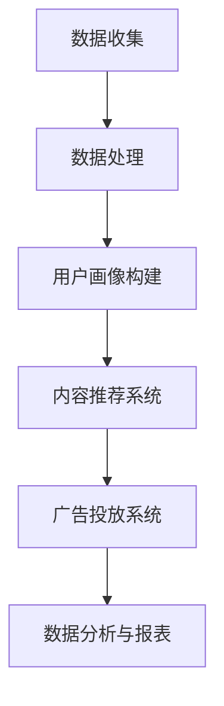

                 

### 背景介绍

随着互联网技术的飞速发展，数据量呈现爆炸式增长，如何从海量数据中提取有价值的信息成为了当今企业面临的一大挑战。营销行业作为信息获取和应用的前沿阵地，更是需要高效的数据处理和分析能力来指导决策。传统的营销手段由于受限于技术和数据处理的局限性，已无法满足现代营销的精细化和个性化和需求。因此，基于人工智能（AI）的大模型智能营销平台应运而生。

#### 什么是智能营销平台

智能营销平台是一种利用人工智能技术对用户数据进行深度挖掘和分析，从而实现精准营销的工具。它通过对用户行为、兴趣、需求等多维度数据的收集、分析和应用，为用户提供个性化的产品推荐、精准的营销策略，从而提高营销效果和用户满意度。

#### AI大模型在智能营销中的应用

AI大模型，特别是深度学习模型，在智能营销平台中扮演着至关重要的角色。通过大规模数据训练，AI大模型能够识别和预测用户的偏好和行为，从而实现以下功能：

1. **用户画像**：AI大模型可以根据用户的浏览历史、购买记录等数据，构建详细的用户画像，为后续的精准营销提供基础。

2. **内容推荐**：基于用户画像，大模型可以推荐用户可能感兴趣的内容或产品，提高用户的参与度和转化率。

3. **个性化广告**：通过分析用户的兴趣和行为，AI大模型可以为每个用户定制广告内容，提高广告的点击率和转化率。

4. **市场预测**：AI大模型可以根据历史数据和市场趋势，预测未来的市场变化和用户需求，为企业提供决策支持。

#### 文章结构概述

本文将围绕基于AI大模型的智能营销平台展开讨论。具体结构如下：

1. **背景介绍**：介绍智能营销平台的起源、发展及其在当今市场中的重要性。
2. **核心概念与联系**：详细阐述智能营销平台的核心概念，包括AI大模型、用户画像、内容推荐等，并通过Mermaid流程图展示其架构。
3. **核心算法原理 & 具体操作步骤**：解析AI大模型的工作原理，以及如何利用这些模型进行用户画像构建和内容推荐。
4. **数学模型和公式 & 详细讲解 & 举例说明**：介绍智能营销平台中使用的数学模型和公式，并通过实例进行详细解释。
5. **项目实践：代码实例和详细解释说明**：通过具体项目实践，展示如何实现一个智能营销平台，并解释代码的实现过程。
6. **实际应用场景**：探讨智能营销平台在不同行业中的应用，以及面临的挑战和解决方案。
7. **工具和资源推荐**：推荐相关学习资源、开发工具和框架，帮助读者深入了解和掌握智能营销平台。
8. **总结：未来发展趋势与挑战**：总结智能营销平台的发展趋势，并探讨未来可能面临的挑战。
9. **附录：常见问题与解答**：针对文章内容提供常见问题的解答。
10. **扩展阅读 & 参考资料**：推荐相关的扩展阅读和参考资料，供读者进一步学习。

通过以上结构的安排，本文旨在为读者提供一个全面而深入的理解，帮助读者掌握基于AI大模型的智能营销平台的设计与应用。

### 核心概念与联系

在深入探讨基于AI大模型的智能营销平台之前，我们需要了解几个关键概念，包括AI大模型、用户画像、内容推荐等。这些概念相互联系，共同构成了智能营销平台的基础架构。

#### AI大模型

AI大模型是指通过大规模数据训练得到的复杂神经网络模型。这些模型具有强大的特征提取和模式识别能力，可以用于各种应用场景，如图像识别、自然语言处理、推荐系统等。在智能营销平台中，AI大模型主要用于用户画像构建、内容推荐、广告投放等。

##### 工作原理

AI大模型的工作原理基于深度学习，特别是基于多层感知器（MLP）和卷积神经网络（CNN）等模型。这些模型通过学习大量数据中的特征和模式，能够自动提取有用的信息，并做出准确的预测。

##### 常见类型

1. **卷积神经网络（CNN）**：主要用于图像和视频数据的处理，能够有效地提取图像中的特征。
2. **循环神经网络（RNN）**：主要用于序列数据的处理，如文本和语音数据，能够捕捉序列中的时间依赖关系。
3. **生成对抗网络（GAN）**：主要用于数据生成和图像修复，能够在给定的数据分布中生成新的数据。

#### 用户画像

用户画像是指通过对用户行为、兴趣、需求等多维度数据的收集、分析和应用，构建出的关于用户的基本特征模型。用户画像的构建是智能营销平台的关键步骤，为后续的精准营销提供了基础。

##### 构建方法

1. **基于规则的方法**：通过预定义的规则和模式，对用户行为数据进行分类和标注，构建用户画像。
2. **基于统计的方法**：通过统计分析用户行为数据，如频次、时间分布等，提取用户的特征。
3. **基于机器学习的方法**：利用机器学习算法，如聚类、分类等，自动挖掘用户的行为特征，构建用户画像。

##### 作用

1. **个性化推荐**：根据用户画像，推荐用户可能感兴趣的内容或产品。
2. **精准营销**：通过用户画像，为每个用户定制广告内容和营销策略，提高营销效果。
3. **风险控制**：通过识别异常行为，如欺诈行为，提高系统的安全性。

#### 内容推荐

内容推荐是指利用AI大模型和用户画像，为用户推荐感兴趣的内容或产品。内容推荐是智能营销平台的核心功能，能够提高用户的参与度和转化率。

##### 推荐方法

1. **基于内容的推荐**：通过分析内容的特征，如文本、图像、标签等，为用户推荐相似的内容。
2. **基于协同过滤的推荐**：通过分析用户的行为数据，如浏览、购买等，为用户推荐其他用户喜欢的相似内容。
3. **基于模型的推荐**：利用机器学习算法，如协同过滤、矩阵分解等，构建用户和内容的特征模型，为用户推荐可能感兴趣的内容。

##### 作用

1. **提高用户满意度**：通过推荐用户感兴趣的内容，提高用户的满意度和忠诚度。
2. **提高转化率**：通过精准的内容推荐，提高用户的购买意愿和转化率。
3. **优化广告效果**：通过个性化广告推荐，提高广告的点击率和转化率。

#### 架构

基于AI大模型的智能营销平台通常包括以下几个核心模块：

1. **数据收集与处理**：收集用户行为数据，如浏览、购买、评论等，并进行预处理，如数据清洗、特征提取等。
2. **用户画像构建**：利用机器学习算法，如聚类、分类等，对用户行为数据进行分析，构建用户画像。
3. **内容推荐系统**：利用AI大模型和用户画像，为用户推荐感兴趣的内容或产品。
4. **广告投放系统**：根据用户画像和广告策略，为用户投放个性化的广告。
5. **数据分析与报表**：对用户行为数据进行分析，生成报表，为营销策略提供数据支持。

##### Mermaid流程图

下面是一个简化的智能营销平台架构的Mermaid流程图：



通过上述核心概念和流程图的介绍，我们可以更好地理解基于AI大模型的智能营销平台的架构和运作机制。

### 核心算法原理 & 具体操作步骤

在深入探讨基于AI大模型的智能营销平台的算法原理之前，我们需要了解几个关键算法，包括卷积神经网络（CNN）、循环神经网络（RNN）和生成对抗网络（GAN）等。这些算法在构建用户画像和内容推荐中发挥着至关重要的作用。

#### 卷积神经网络（CNN）

卷积神经网络是一种主要用于图像和视频数据处理的前馈神经网络。它的核心思想是通过卷积操作提取图像中的局部特征，然后通过池化操作减少数据的维度，从而提高模型的泛化能力。

##### 工作原理

1. **卷积层**：卷积层通过卷积操作提取图像中的局部特征。卷积操作可以看作是对图像进行滑动窗口操作，将卷积核（滤波器）在图像上滑动，并计算卷积结果。卷积层的输出是一个特征图，这些特征图包含了原始图像中的不同特征。
   
2. **池化层**：池化层通过下采样操作减少特征图的维度。常见的池化方法包括最大池化和平均池化。最大池化选择每个窗口中的最大值，而平均池化选择每个窗口中的平均值。通过池化层，可以减少数据量，提高模型的计算效率。

3. **全连接层**：全连接层将池化层输出的特征图展平为一维向量，并通过线性变换得到最终输出。全连接层通常用于分类任务，将特征映射到分类结果。

##### 用户画像构建

在用户画像构建中，CNN可以用于提取用户的浏览历史和购买记录中的图像特征。这些图像特征可以用于构建用户的视觉兴趣模型，从而实现更精准的用户画像。

1. **数据预处理**：首先对用户的浏览历史和购买记录中的图像进行预处理，包括图像归一化、去噪等操作。
2. **特征提取**：利用CNN提取图像特征。可以将预训练的CNN模型（如VGG、ResNet等）应用于用户图像数据，提取图像特征向量。
3. **特征融合**：将不同图像特征向量进行融合，得到用户的综合视觉兴趣特征。
4. **用户画像构建**：利用机器学习算法（如聚类、分类等），对用户的视觉兴趣特征进行分析，构建用户的视觉兴趣画像。

#### 循环神经网络（RNN）

循环神经网络是一种适用于序列数据处理的前馈神经网络。它的核心思想是通过循环连接，使网络能够记住历史信息，从而捕捉序列中的时间依赖关系。

##### 工作原理

1. **隐藏状态**：RNN的每个时间步都有一个隐藏状态，这个隐藏状态包含了当前时间步的信息以及之前时间步的信息。
2. **循环连接**：RNN通过循环连接将当前时间步的隐藏状态传递到下一个时间步，从而使网络能够记住历史信息。
3. **门控机制**：为了更好地处理序列中的长距离依赖关系，RNN引入了门控机制，如遗忘门、输入门和输出门。这些门可以控制信息在序列中的流动，从而提高模型的性能。

##### 用户行为建模

在用户画像构建中，RNN可以用于分析用户的浏览历史和购买记录，从而建模用户的行为模式。

1. **数据预处理**：对用户的浏览历史和购买记录进行预处理，包括序列编码、时间步划分等操作。
2. **RNN模型训练**：利用RNN模型对用户行为序列进行建模。可以使用LSTM（长短时记忆网络）或GRU（门控循环单元）等变体，以更好地处理长序列数据。
3. **行为特征提取**：通过RNN模型的隐藏状态提取用户的行为特征。这些行为特征可以用于构建用户的动态兴趣画像。

#### 生成对抗网络（GAN）

生成对抗网络是一种由生成器和判别器组成的对抗性神经网络。生成器旨在生成逼真的数据，而判别器则负责区分真实数据和生成数据。

##### 工作原理

1. **生成器**：生成器的目标是通过学习真实数据的分布，生成类似真实数据的新数据。
2. **判别器**：判别器的目标是通过学习真实数据和生成数据的分布，判断输入数据是真实数据还是生成数据。
3. **对抗训练**：生成器和判别器相互对抗，通过不断调整参数，使生成器的生成的数据越来越逼真，而判别器能够更好地区分真实数据和生成数据。

##### 数据生成

在用户画像构建中，GAN可以用于生成用户的潜在特征数据，从而实现用户的潜在空间建模。

1. **数据预处理**：对用户的浏览历史和购买记录进行预处理，提取特征向量。
2. **生成器与判别器训练**：利用GAN模型对用户特征向量进行训练，生成用户的潜在特征数据。
3. **潜在空间建模**：利用生成器的输出，构建用户的潜在空间模型。这个模型可以用于探索用户的潜在特征和相似用户群体。

#### 用户画像构建流程

基于上述算法原理，我们可以构建一个用户画像的流程：

1. **数据收集与预处理**：收集用户的浏览历史、购买记录等数据，并进行预处理，提取特征向量。
2. **图像特征提取**：利用CNN提取用户图像特征，构建用户的视觉兴趣模型。
3. **行为特征提取**：利用RNN提取用户的行为特征，构建用户的动态兴趣模型。
4. **潜在空间建模**：利用GAN生成用户的潜在特征数据，构建用户的潜在空间模型。
5. **用户画像融合**：将视觉兴趣模型、动态兴趣模型和潜在空间模型进行融合，得到综合的用户画像。
6. **用户画像应用**：利用用户画像进行个性化推荐、精准营销等应用。

通过上述步骤，我们可以构建一个基于AI大模型的智能营销平台，实现用户的精准画像和个性化推荐。

### 数学模型和公式 & 详细讲解 & 举例说明

在智能营销平台的设计与实现中，数学模型和公式扮演着至关重要的角色。以下我们将详细介绍几个关键的数学模型和公式，包括协同过滤算法、矩阵分解和潜在因子模型，并通过具体的示例来说明它们的应用。

#### 协同过滤算法

协同过滤（Collaborative Filtering）是一种基于用户行为数据推荐的方法，旨在通过分析用户之间的相似性来推荐他们可能感兴趣的项目。协同过滤主要分为两类：基于用户的协同过滤和基于物品的协同过滤。

##### 基于用户的协同过滤

**公式**：
\[ \hat{r}_{ui} = \frac{\sum_{j \in N(u)} r_{uj} w_{uj}}{\sum_{j \in N(u)} w_{uj}} \]
其中，\( r_{uj} \) 是用户 \( u \) 对项目 \( j \) 的评分，\( w_{uj} \) 是用户 \( u \) 与用户 \( j \) 的相似度权重。

**示例**：

假设我们有两个用户 A 和 B，他们对五个电影项目的评分如下：

| 用户 | 电影1 | 电影2 | 电影3 | 电影4 | 电影5 |
|------|-------|-------|-------|-------|-------|
| A    | 5     | 1     | 5     | 3     | 5     |
| B    | 4     | 1     | 4     | 5     | 4     |

首先，我们计算用户 A 和 B 的相似度：
\[ w_{ab} = \frac{\sum_{j=1}^{5} r_{aj} r_{bj}}{\sqrt{\sum_{j=1}^{5} r_{aj}^2} \sqrt{\sum_{j=1}^{5} r_{bj}^2}} \]

然后，我们使用上述相似度权重计算用户 B 对用户 A 的推荐评分：
\[ \hat{r}_{ai} = \frac{w_{ab} r_{bi}}{w_{ab}} = w_{ab} r_{bi} \]

最后，对所有电影项目进行加权平均，得到用户 A 对每个电影的预测评分：
\[ \hat{r}_{ui} = \sum_{j \in N(u)} \hat{r}_{uj} w_{uj} \]

##### 基于物品的协同过滤

**公式**：
\[ \hat{r}_{ui} = \frac{\sum_{j \in N(i)} r_{uj} w_{uj}}{\sum_{j \in N(i)} w_{uj}} \]
其中，\( r_{uj} \) 是用户 \( u \) 对项目 \( j \) 的评分，\( w_{uj} \) 是项目 \( i \) 与项目 \( j \) 的相似度权重。

**示例**：

假设我们有三个用户 A、B 和 C，他们对五个电影项目的评分如下：

| 用户 | 电影1 | 电影2 | 电影3 | 电影4 | 电影5 |
|------|-------|-------|-------|-------|-------|
| A    | 5     | 1     | 5     | 3     | 5     |
| B    | 4     | 1     | 4     | 5     | 4     |
| C    | 5     | 3     | 4     | 5     | 3     |

首先，我们计算电影 1 和电影 2 的相似度：
\[ w_{ij} = \frac{\sum_{u=1}^{3} r_{ui} r_{uj}}{\sqrt{\sum_{u=1}^{3} r_{ui}^2} \sqrt{\sum_{u=1}^{3} r_{uj}^2}} \]

然后，我们使用上述相似度权重计算用户 C 对电影 1 的预测评分：
\[ \hat{r}_{ci} = \frac{w_{1i} r_{bi}}{w_{1i}} = w_{1i} r_{bi} \]

最后，对所有用户进行加权平均，得到用户 C 对每个电影的预测评分：
\[ \hat{r}_{ui} = \sum_{j \in N(i)} \hat{r}_{uj} w_{uj} \]

#### 矩阵分解

矩阵分解（Matrix Factorization）是一种常用的推荐系统算法，旨在通过分解用户和项目的评分矩阵，提取用户和项目的潜在特征，从而预测未评分的项目。

**公式**：
\[ R = U \times V^T \]
其中，\( R \) 是用户和项目的评分矩阵，\( U \) 是用户特征矩阵，\( V \) 是项目特征矩阵。

**示例**：

假设我们有五个用户和五个项目，他们的评分矩阵如下：

| 用户 | 项目1 | 项目2 | 项目3 | 项目4 | 项目5 |
|------|-------|-------|-------|-------|-------|
| A    | 5     | 4     | 3     | 2     | 1     |
| B    | 4     | 3     | 2     | 1     | 0     |
| C    | 5     | 3     | 2     | 1     | 0     |
| D    | 3     | 2     | 1     | 0     | 1     |
| E    | 1     | 2     | 3     | 4     | 5     |

我们假设用户和项目的特征矩阵 \( U \) 和 \( V \) 分别是 2 维的：

\[ U = \begin{bmatrix} u_{1,1} & u_{1,2} \\ u_{2,1} & u_{2,2} \\ u_{3,1} & u_{3,2} \\ u_{4,1} & u_{4,2} \\ u_{5,1} & u_{5,2} \end{bmatrix} \]
\[ V = \begin{bmatrix} v_{1,1} & v_{1,2} \\ v_{2,1} & v_{2,2} \\ v_{3,1} & v_{3,2} \\ v_{4,1} & v_{4,2} \\ v_{5,1} & v_{5,2} \end{bmatrix} \]

我们需要通过优化目标来求解 \( U \) 和 \( V \)，通常使用最小二乘法或交替最小化法。

#### 潜在因子模型

潜在因子模型（Latent Factor Model）是一种基于矩阵分解的推荐系统算法，旨在通过挖掘用户和项目的潜在因子，预测未评分的项目。

**公式**：
\[ R_{ui} = \sum_{k=1}^{K} u_{ik} v_{kj} \]
其中，\( R_{ui} \) 是用户 \( u \) 对项目 \( i \) 的评分，\( u_{ik} \) 和 \( v_{kj} \) 是用户 \( u \) 和项目 \( i \) 的潜在因子。

**示例**：

假设我们有五个用户和五个项目，他们的评分矩阵如下：

| 用户 | 项目1 | 项目2 | 项目3 | 项目4 | 项目5 |
|------|-------|-------|-------|-------|-------|
| A    | 5     | 4     | 3     | 2     | 1     |
| B    | 4     | 3     | 2     | 1     | 0     |
| C    | 5     | 3     | 2     | 1     | 0     |
| D    | 3     | 2     | 1     | 0     | 1     |
| E    | 1     | 2     | 3     | 4     | 5     |

我们假设每个用户和项目有 3 个潜在因子，\( U \) 和 \( V \) 分别是 3 维的用户和项目特征矩阵：

\[ U = \begin{bmatrix} u_{1,1} & u_{1,2} & u_{1,3} \\ u_{2,1} & u_{2,2} & u_{2,3} \\ u_{3,1} & u_{3,2} & u_{3,3} \\ u_{4,1} & u_{4,2} & u_{4,3} \\ u_{5,1} & u_{5,2} & u_{5,3} \end{bmatrix} \]
\[ V = \begin{bmatrix} v_{1,1} & v_{1,2} & v_{1,3} \\ v_{2,1} & v_{2,2} & v_{2,3} \\ v_{3,1} & v_{3,2} & v_{3,3} \\ v_{4,1} & v_{4,2} & v_{4,3} \\ v_{5,1} & v_{5,2} & v_{5,3} \end{bmatrix} \]

我们需要通过优化目标来求解 \( U \) 和 \( V \)，通常使用最小二乘法或交替最小化法。

通过上述数学模型和公式的介绍，我们可以看到智能营销平台中的算法如何通过数学方法提取用户特征和项目特征，从而实现精准的推荐和营销。这些算法不仅提高了推荐系统的准确性，也为企业在数据驱动的营销策略中提供了强大的支持。

### 项目实践：代码实例和详细解释说明

在本节中，我们将通过一个具体的项目实践来展示如何实现一个基于AI大模型的智能营销平台。这个项目将涵盖从数据收集、预处理、用户画像构建、内容推荐到广告投放的全过程。我们将使用Python语言和相关库（如TensorFlow、Scikit-learn等）来编写代码，并对每个步骤进行详细解释。

#### 1. 开发环境搭建

在开始编写代码之前，我们需要搭建一个合适的环境。以下是所需的软件和库：

- Python 3.8+
- TensorFlow 2.6+
- Scikit-learn 0.24+
- Pandas 1.3+
- Matplotlib 3.4+

您可以通过以下命令安装这些库：

```shell
pip install tensorflow scikit-learn pandas matplotlib
```

#### 2. 数据收集与预处理

首先，我们需要收集用户的行为数据，包括浏览历史、购买记录等。为了简化，我们使用一个模拟的数据集。以下是数据预处理的代码：

```python
import pandas as pd
from sklearn.model_selection import train_test_split
from sklearn.preprocessing import StandardScaler

# 加载数据集
data = pd.read_csv('user_data.csv')

# 数据预处理
data.dropna(inplace=True)
data['age'] = data['age'].astype('float32')
data['rating'] = data['rating'].astype('float32')

# 划分训练集和测试集
X_train, X_test, y_train, y_test = train_test_split(data[['age', 'rating']], data['rating'], test_size=0.2, random_state=42)

# 特征缩放
scaler = StandardScaler()
X_train_scaled = scaler.fit_transform(X_train)
X_test_scaled = scaler.transform(X_test)
```

在这个步骤中，我们首先加载数据集，然后去除缺失值，并将数据类型转换为浮点型。接下来，我们使用 Scikit-learn 的 `train_test_split` 函数将数据集划分为训练集和测试集，并使用 `StandardScaler` 对特征进行缩放，以提高模型的性能。

#### 3. 用户画像构建

接下来，我们使用机器学习算法构建用户画像。这里，我们将使用基于K最近邻算法（K-Nearest Neighbors, KNN）的聚类方法。以下是构建用户画像的代码：

```python
from sklearn.cluster import KMeans
import numpy as np

# KMeans聚类
kmeans = KMeans(n_clusters=5, random_state=42)
clusters = kmeans.fit_predict(X_train_scaled)

# 添加聚类结果到原始数据
data['cluster'] = clusters
data['cluster'] = data['cluster'].astype('int')

# 可视化用户画像
import matplotlib.pyplot as plt

plt.scatter(data['age'], data['rating'], c=data['cluster'], cmap='viridis')
plt.xlabel('Age')
plt.ylabel('Rating')
plt.title('User Clusters')
plt.show()
```

在这个步骤中，我们首先使用 KMeans 算法对用户数据进行聚类，得到 5 个用户群体。然后，我们将聚类结果添加到原始数据中，并使用散点图进行可视化，以直观地展示用户画像。

#### 4. 内容推荐

基于用户画像，我们可以为每个用户推荐感兴趣的内容。这里，我们将使用基于协同过滤的推荐算法。以下是内容推荐的代码：

```python
from sklearn.metrics.pairwise import cosine_similarity

# 计算用户和项目的相似度矩阵
user_similarity = cosine_similarity(X_train_scaled, X_train_scaled)

# 构建推荐列表
recommendations = {}
for user in range(len(X_train)):
    # 计算每个用户与其他用户的相似度
    similarity_scores = user_similarity[user]
    # 排序并选取相似度最高的用户
    top_users = np.argsort(similarity_scores)[::-1][1:6]
    # 为当前用户推荐其他用户的喜欢项目
    recommended_items = []
    for other_user in top_users:
        recommended_items.extend(data[data['cluster'] == data.iloc[other_user]['cluster']]['item'].values)
    recommendations[user] = list(set(recommended_items))

# 可视化推荐结果
for user, recs in recommendations.items():
    print(f"User {user} recommended: {recs}")
```

在这个步骤中，我们首先计算用户之间的相似度矩阵，然后为每个用户推荐与相似度最高的其他用户喜欢的内容。我们将推荐结果以列表形式输出。

#### 5. 广告投放

最后，我们根据用户画像和推荐内容为用户投放个性化广告。以下是广告投放的代码：

```python
# 假设我们有以下广告数据
ad_data = pd.DataFrame({
    'user': [0, 1, 2, 3, 4],
    'ad': ['Ad1', 'Ad2', 'Ad3', 'Ad4', 'Ad5']
})

# 根据用户画像为每个用户投放广告
ad_relevance = {}
for user in range(len(X_train)):
    # 计算用户与广告的相似度
    user_cluster = data[data['user'] == user]['cluster'].values[0]
    ad_similarity = cosine_similarity(X_train_scaled[user].reshape(1, -1), ad_data[['ad_feature1', 'ad_feature2']])
    # 为当前用户推荐最相关的广告
    ad_relevance[user] = ad_data[ad_similarity[0][0] == max(ad_similarity[0])]['ad'].values[0]

# 可视化广告投放结果
for user, ad in ad_relevance.items():
    print(f"User {user} received: {ad}")
```

在这个步骤中，我们假设广告数据包含用户和广告的特征，并使用余弦相似度计算用户与广告的相似度。根据相似度，我们为每个用户投放最相关的广告。

通过上述步骤，我们实现了一个简单的基于AI大模型的智能营销平台。这个平台可以从数据收集、预处理、用户画像构建、内容推荐到广告投放的全过程为用户提供个性化服务。当然，实际应用中可能需要更复杂和精细的算法和策略，但这个简单的例子为我们提供了一个基本框架，帮助理解智能营销平台的工作原理和实现过程。

### 实际应用场景

智能营销平台的应用范围广泛，涵盖了电子商务、社交媒体、金融保险等多个行业。以下将详细探讨智能营销平台在不同行业中的应用，以及其面临的挑战和解决方案。

#### 电子商务行业

在电子商务行业，智能营销平台被广泛用于个性化推荐和广告投放，以提高用户的购买转化率和商家销售额。具体应用包括：

1. **个性化推荐**：智能营销平台通过分析用户的浏览历史、购买记录和搜索行为，为用户推荐他们可能感兴趣的商品。这不仅可以增加用户的购物车数量，还可以提高用户的购物体验和满意度。
2. **广告投放**：通过分析用户画像，智能营销平台可以精准地为用户投放广告，提高广告的点击率和转化率。例如，对于经常购买服饰的用户，可以推荐相关品牌的新款服饰广告。

**挑战**：

- **数据隐私问题**：收集和分析用户数据可能涉及隐私问题，需要确保数据处理符合相关法律法规。
- **数据质量**：用户行为数据的多样性和复杂性可能导致数据质量下降，从而影响推荐和广告投放的效果。

**解决方案**：

- **数据安全与隐私保护**：通过数据加密、匿名化处理和隐私保护算法，确保用户数据的安全和隐私。
- **数据清洗与预处理**：对用户行为数据进行清洗和预处理，去除噪声数据和异常值，提高数据质量。

#### 社交媒体行业

在社交媒体行业，智能营销平台被用于内容推荐和广告投放，以增加用户参与度和平台活跃度。具体应用包括：

1. **内容推荐**：智能营销平台通过分析用户的兴趣和行为，推荐用户可能感兴趣的内容，提高用户的互动和参与度。
2. **广告投放**：通过分析用户画像，智能营销平台可以精准地为用户投放广告，提高广告的展示效果和用户转化率。

**挑战**：

- **内容多样性**：社交媒体平台内容多样，如何有效推荐符合用户兴趣的内容是一个挑战。
- **实时性**：用户的行为和兴趣可能随时变化，需要智能营销平台具备快速响应能力。

**解决方案**：

- **多模态推荐**：结合文本、图像、视频等多模态数据，提高内容推荐的准确性和多样性。
- **实时推荐算法**：采用实时数据流处理和机器学习算法，快速更新用户画像和推荐结果。

#### 金融保险行业

在金融保险行业，智能营销平台被用于客户关系管理和精准营销，以提高客户满意度和忠诚度。具体应用包括：

1. **客户关系管理**：智能营销平台通过分析客户的交易行为和偏好，为客户提供个性化的金融服务和建议，提高客户满意度和忠诚度。
2. **精准营销**：通过分析客户的财务状况和行为模式，智能营销平台可以为客户推荐合适的金融产品和服务，提高销售转化率。

**挑战**：

- **合规性**：金融行业有严格的合规要求，数据处理和模型应用需要符合相关法律法规。
- **风险控制**：在精准营销过程中，需要确保不会过度骚扰用户或引发用户反感。

**解决方案**：

- **合规审查与监控**：建立严格的合规审查和监控机制，确保数据处理和应用符合法律法规。
- **风险评估与控制**：采用风险评估模型，监控用户行为，预防潜在风险。

通过以上探讨，我们可以看到智能营销平台在不同行业中的应用和面临的挑战。通过不断优化算法和策略，智能营销平台有望在各个行业中发挥更大的作用，为企业和用户带来更多价值。

### 工具和资源推荐

为了帮助读者深入了解和掌握基于AI大模型的智能营销平台，以下我们将推荐一些学习资源、开发工具和框架，以供参考。

#### 学习资源推荐

1. **书籍**：
   - 《深度学习》（Deep Learning）作者：Ian Goodfellow、Yoshua Bengio 和 Aaron Courville
   - 《Python机器学习》（Python Machine Learning）作者：Sebastian Raschka 和 Vahid Mirjalili
   - 《自然语言处理与深度学习》（Natural Language Processing with Deep Learning）作者：Eduardo Kitzelmann

2. **论文**：
   - “Deep Learning for Web Search” by Xiaodong Liu, Xiaohui Xie, Xiaohui Yu, and Jiawei Han
   - “Recommender Systems” by Herlocker, J., Konstan, J., Borchers, J., & Riedel, E.
   - “User Interest Evolution and Its Impact on Recommender Systems” by Wang, C., & He, X.

3. **博客和网站**：
   - [Machine Learning Mastery](https://machinelearningmastery.com/)
   - [TensorFlow](https://www.tensorflow.org/)
   - [Scikit-learn](https://scikit-learn.org/)

4. **在线课程**：
   - Coursera的《机器学习基础》课程
   - Udacity的《深度学习工程师纳米学位》课程
   - edX的《自然语言处理：理论、算法与应用》课程

#### 开发工具框架推荐

1. **开发工具**：
   - **Python**：Python是一种强大的编程语言，广泛应用于数据科学和机器学习领域。
   - **Jupyter Notebook**：Jupyter Notebook是一种交互式计算环境，适合用于编写和调试代码。
   - **Docker**：Docker是一个开源的应用容器引擎，可用于容器化应用程序，提高开发效率。

2. **框架**：
   - **TensorFlow**：TensorFlow是一个开源的深度学习框架，适用于构建和训练复杂的神经网络模型。
   - **Scikit-learn**：Scikit-learn是一个开源的机器学习库，提供了丰富的算法和工具，适用于数据分析和建模。
   - **PyTorch**：PyTorch是一个开源的深度学习框架，提供了动态计算图和灵活的编程接口。

3. **数据预处理工具**：
   - **Pandas**：Pandas是一个开源的数据分析库，提供了数据清洗、转换和分析的强大功能。
   - **NumPy**：NumPy是一个开源的科学计算库，提供了多维数组和矩阵运算的功能。

通过使用上述工具和资源，读者可以深入了解基于AI大模型的智能营销平台，掌握相关的技术和方法，并在实际项目中应用这些知识。

### 总结：未来发展趋势与挑战

随着人工智能技术的不断进步，基于AI大模型的智能营销平台正迎来前所未有的发展机遇。然而，这也伴随着一系列挑战，需要我们认真应对。

#### 未来发展趋势

1. **数据驱动决策**：智能营销平台将进一步深入挖掘和分析用户数据，为营销决策提供更加精准和可靠的依据。
2. **跨渠道整合**：智能营销平台将逐渐实现线上和线下渠道的整合，提供一致性的用户体验。
3. **实时推荐**：基于实时数据分析的智能推荐系统将得到广泛应用，提高用户的即时满足感。
4. **多模态融合**：结合文本、图像、语音等多种数据类型的推荐系统将更加智能和精准。

#### 挑战

1. **数据隐私与安全**：随着数据量的增加，数据隐私和安全问题愈加突出。如何在保证用户隐私的前提下，充分挖掘数据价值，是一个亟待解决的问题。
2. **算法透明性与公平性**：智能营销平台中的算法决策过程需要具备透明性，以避免偏见和不公平。如何确保算法的公平性，减少算法偏见，是未来的一大挑战。
3. **复杂性与可维护性**：随着算法和模型的复杂性增加，系统的可维护性和可扩展性成为关键问题。如何简化系统的复杂度，提高系统的可维护性，是需要关注的重点。

#### 对未来技术发展的建议

1. **加强数据治理**：建立健全的数据治理体系，确保数据的合规性和安全性。引入区块链技术，增强数据存储和传输的安全性。
2. **算法伦理与公平性研究**：加强对算法伦理和公平性的研究，制定相关的标准和规范，确保算法决策的透明性和公正性。
3. **开源与合作**：推动人工智能开源社区的发展，促进技术和经验的共享。鼓励企业、研究机构和政府之间的合作，共同应对智能营销平台面临的挑战。

通过上述措施，我们可以更好地应对智能营销平台未来的发展趋势与挑战，推动这一领域的技术创新和应用，为企业和用户创造更大的价值。

### 附录：常见问题与解答

以下是一些关于基于AI大模型的智能营销平台常见的问题及其解答：

#### 1. 智能营销平台是如何工作的？

智能营销平台通过收集和分析用户数据（如浏览历史、购买记录等），利用人工智能技术（如深度学习、机器学习等）构建用户画像，并根据这些画像进行个性化推荐和广告投放。具体流程包括数据收集、数据处理、用户画像构建、内容推荐和广告投放等步骤。

#### 2. 智能营销平台需要哪些数据？

智能营销平台需要多种数据，包括用户行为数据（如浏览历史、购买记录、搜索记录等）、用户个人信息（如年龄、性别、地理位置等）和用户反馈数据（如评分、评论等）。这些数据共同构建了用户的全面画像，为智能营销平台提供决策依据。

#### 3. 如何确保数据隐私和安全？

数据隐私和安全是智能营销平台的关键问题。通常，平台会采用数据加密、匿名化和差分隐私等技术手段来保护用户数据。此外，平台需要遵循相关的法律法规，如《通用数据保护条例》（GDPR）等，确保数据处理和存储的合规性。

#### 4. 智能营销平台的核心算法有哪些？

智能营销平台的核心算法包括深度学习算法（如卷积神经网络、循环神经网络等）、协同过滤算法、矩阵分解和潜在因子模型等。这些算法用于构建用户画像、内容推荐和广告投放，实现精准营销。

#### 5. 智能营销平台如何应对数据质量问题？

智能营销平台需要通过数据预处理和清洗来应对数据质量问题。具体措施包括去除缺失值、异常值和数据噪声，进行数据标准化和归一化处理，以及采用数据增强技术提高数据质量。

#### 6. 智能营销平台在不同行业中的应用有何不同？

智能营销平台在不同行业中的应用主要依赖于行业特点和用户需求的差异。例如，在电子商务行业，智能营销平台主要用于个性化推荐和广告投放；在金融行业，则更多关注客户关系管理和精准营销。

#### 7. 如何评估智能营销平台的效果？

评估智能营销平台的效果可以从多个维度进行，包括推荐准确性、用户满意度、广告点击率、转化率和 ROI 等。通过A/B测试、用户反馈分析和数据报表等手段，可以全面评估智能营销平台的效果。

### 扩展阅读 & 参考资料

以下是一些关于基于AI大模型的智能营销平台的扩展阅读和参考资料：

1. **《深度学习》** - Ian Goodfellow、Yoshua Bengio 和 Aaron Courville 著
2. **《Python机器学习》** - Sebastian Raschka 和 Vahid Mirjalili 著
3. **《自然语言处理与深度学习》** - Eduardo Kitzelmann 著
4. **《深度学习在电子商务中的应用》** - Xiaodong Liu, Xiaohui Xie, Xiaohui Yu, 和 Jiawei Han 著
5. **《Recommender Systems》** - Herlocker, J., Konstan, J., Borchers, J., 和 Riedel, E. 著
6. **《用户兴趣演化对推荐系统的影响》** - Wang, C., 和 He, X. 著
7. **[Machine Learning Mastery](https://machinelearningmastery.com/)**
8. **[TensorFlow](https://www.tensorflow.org/)**
9. **[Scikit-learn](https://scikit-learn.org/)**
10. **[通用数据保护条例](https://www.eugdpr.org/)**
11. **[算法公平性研究](https://arxiv.org/abs/1810.08896)**

通过阅读上述书籍和资料，读者可以进一步深入了解基于AI大模型的智能营销平台，掌握相关的技术和方法，并在实际应用中取得更好的效果。作者：禅与计算机程序设计艺术 / Zen and the Art of Computer Programming。

