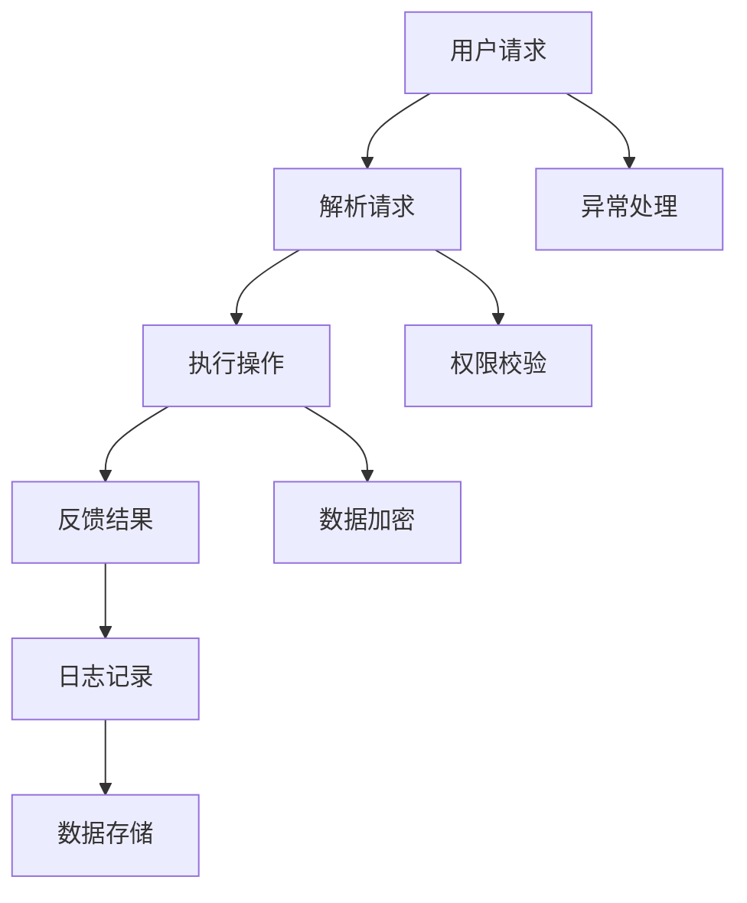

                 

### 文章标题

《基于Java的智能家居设计：模块化智能插座的设计与实现》

关键词：智能家居、Java编程、模块化设计、智能插座、物联网（IoT）

摘要：本文旨在探讨基于Java语言的智能家居系统中智能插座的设计与实现。通过模块化设计方法，我们将详细解析智能插座的核心功能、技术架构以及实现步骤，从而为智能家居领域的技术创新和实践提供参考。

---

### 1. 背景介绍

随着科技的不断进步，智能家居已经成为现代家庭中不可或缺的一部分。智能插座作为智能家居系统中的重要组件，具有远程控制、定时开关、节能监控等功能，极大地提高了家庭生活的便利性和智能化水平。然而，目前市场上的智能插座产品大多功能单一，难以满足用户多样化的需求。因此，本文提出了一个基于Java的模块化智能插座设计，旨在实现智能插座的个性化定制和扩展性。

#### 1.1 智能家居的发展趋势

近年来，智能家居市场呈现出爆发式增长。据市场调研机构统计，全球智能家居市场规模预计将在2025年达到千亿美元级别。这一趋势主要得益于以下几个因素：

1. **人口老龄化**：随着人口老龄化的加剧，智能家居的便利性和安全性特点受到广泛关注。
2. **技术进步**：物联网（IoT）、云计算、人工智能等技术的快速发展，为智能家居提供了强大的技术支撑。
3. **用户需求**：现代家庭对生活品质的追求，以及对智能家居带来的便捷和舒适的认可，推动了智能家居市场的需求增长。

#### 1.2 智能插座的重要性

智能插座作为智能家居系统的基本单元，具有以下几个重要功能：

1. **远程控制**：用户可以通过手机APP远程控制智能插座的开闭状态，实现随时随地控制家庭电器。
2. **定时开关**：智能插座可以根据用户的设定时间自动开关，实现自动化管理，节约能源。
3. **节能监控**：通过监测家庭电器的使用情况，智能插座可以帮助用户了解家庭能耗，提高节能意识。

#### 1.3 模块化设计优势

模块化设计方法在智能家居领域具有广泛的应用前景。通过模块化设计，智能插座可以实现以下优势：

1. **灵活性**：用户可以根据自己的需求选择和组合不同的模块，实现智能插座的个性化定制。
2. **扩展性**：模块化设计使得智能插座易于扩展，可以方便地添加新功能，如温度传感、湿度传感等。
3. **可靠性**：模块化设计有助于提高系统的可靠性，降低故障率，延长产品使用寿命。

---

### 2. 核心概念与联系

在基于Java的模块化智能插座设计中，我们首先需要明确几个核心概念，包括Java编程基础、模块化设计原则以及智能家居系统架构。以下是一个简化的Mermaid流程图，用于展示智能插座的核心流程和模块之间的联系。



#### 2.1 Java编程基础

Java是一种面向对象的编程语言，具有跨平台、安全性高、功能丰富等特点。在智能插座的设计中，Java语言主要用于以下几个方面：

1. **网络通信**：通过Java Socket编程实现智能插座与手机APP之间的数据传输。
2. **多线程处理**：利用Java的多线程机制，提高智能插座的响应速度和处理能力。
3. **事件驱动**：采用Java的事件驱动模型，实现智能插座的实时响应。

#### 2.2 模块化设计原则

模块化设计是一种将复杂系统分解为若干独立模块，并通过接口进行通信的设计方法。在智能插座的设计中，模块化设计原则体现在以下几个方面：

1. **功能模块化**：将智能插座的功能划分为多个模块，如控制模块、通信模块、数据存储模块等。
2. **接口定义**：为各个模块定义清晰的接口，实现模块之间的数据交换和功能调用。
3. **解耦**：通过模块化设计，降低模块之间的依赖关系，提高系统的稳定性和可维护性。

#### 2.3 智能家居系统架构

智能家居系统通常包括以下几个层次：

1. **感知层**：包括各种传感器，如温度传感器、湿度传感器、光线传感器等，用于采集环境信息。
2. **网络层**：包括智能插座、智能灯泡、智能摄像头等设备，通过网络连接实现数据传输和远程控制。
3. **平台层**：通过云计算平台对采集到的数据进行分析和处理，提供智能推荐和自动化服务。
4. **应用层**：为用户提供手机APP、Web端等应用程序，实现智能家居系统的交互和控制。

---

### 3. 核心算法原理 & 具体操作步骤

在模块化智能插座的设计中，核心算法和具体操作步骤是实现其功能的关键。以下将详细介绍智能插座的远程控制、定时开关和节能监控等核心算法原理，并给出具体的操作步骤。

#### 3.1 远程控制算法原理

远程控制是智能插座最基本的功能之一。通过Java Socket编程实现智能插座与手机APP之间的网络通信，用户可以随时随地控制家庭电器的开关状态。

**算法原理：**

1. **TCP协议**：智能插座和手机APP之间采用TCP协议进行通信，保证数据的可靠传输。
2. **加密传输**：为了保护用户数据的安全，数据传输过程中采用加密算法进行加密。
3. **命令解析**：智能插座接收到来自手机APP的控制命令后，对命令进行解析，并根据命令执行相应的操作。

**操作步骤：**

1. **初始化连接**：手机APP与智能插座建立TCP连接。
2. **发送命令**：用户在手机APP上输入控制命令，手机APP将命令发送给智能插座。
3. **命令解析**：智能插座接收到命令后，对命令进行解析，并根据命令执行相应的操作。
4. **状态反馈**：智能插座执行操作后，将状态反馈给手机APP，以便用户及时了解操作结果。

#### 3.2 定时开关算法原理

定时开关功能可以自动管理家庭电器的开关状态，实现节能管理。通过Java定时器（Timer）实现定时开关功能。

**算法原理：**

1. **定时任务**：使用Java Timer类创建定时任务，按照设定的时间自动执行。
2. **状态切换**：定时任务执行时，根据当前的时间判断是否需要切换电器状态。
3. **状态反馈**：定时任务执行后，将状态反馈给用户。

**操作步骤：**

1. **创建定时任务**：在Java程序中创建一个Timer实例，并设置定时任务。
2. **设定时间**：根据用户的需求设定定时任务的时间。
3. **执行状态切换**：定时任务执行时，自动切换电器的开关状态。
4. **状态反馈**：将状态反馈给用户，以便用户了解定时任务执行结果。

#### 3.3 节能监控算法原理

节能监控功能通过监测家庭电器的使用情况，帮助用户了解家庭能耗，提高节能意识。使用Java多线程机制实现节能监控功能。

**算法原理：**

1. **数据采集**：通过传感器实时采集家庭电器的使用数据。
2. **数据处理**：对采集到的数据进行处理，计算电器的能耗值。
3. **状态反馈**：将处理后的数据反馈给用户。

**操作步骤：**

1. **初始化传感器**：在Java程序中初始化传感器，并设置数据采集的频率。
2. **数据采集**：传感器实时采集家庭电器的使用数据。
3. **数据处理**：对采集到的数据进行处理，计算电器的能耗值。
4. **状态反馈**：将处理后的数据反馈给用户，以便用户了解家庭能耗情况。

---

### 4. 数学模型和公式 & 详细讲解 & 举例说明

在智能插座的设计中，数学模型和公式在实现智能控制、节能管理和数据分析等方面起着关键作用。以下将详细介绍智能插座涉及的数学模型和公式，并给出相应的详细讲解和举例说明。

#### 4.1 远程控制算法的数学模型

远程控制算法涉及的主要数学模型是TCP协议中的传输速率和延迟模型。以下是一个简化的模型：

**传输速率模型：**

\[ \text{传输速率} = \frac{\text{数据量}}{\text{传输时间}} \]

**延迟模型：**

\[ \text{延迟} = \text{发送延迟} + \text{传输延迟} + \text{接收延迟} \]

**详细讲解：**

1. **传输速率模型**：传输速率是衡量数据传输速度的指标，它取决于数据量和传输时间。在实际应用中，数据量通常是已知的，因此传输速率主要取决于传输时间。
2. **延迟模型**：延迟是数据从发送端到接收端所需的时间。延迟由发送延迟、传输延迟和接收延迟组成。发送延迟是指数据从发送端开始传输所需的时间；传输延迟是指数据在网络中传输所需的时间；接收延迟是指数据从接收端开始传输所需的时间。

**举例说明：**

假设数据量为100KB，传输时间为10秒，发送延迟为1秒，传输延迟为5秒，接收延迟为2秒。根据上述模型，我们可以计算出：

\[ \text{传输速率} = \frac{100KB}{10秒} = 10KB/s \]

\[ \text{延迟} = 1秒 + 5秒 + 2秒 = 8秒 \]

#### 4.2 定时开关算法的数学模型

定时开关算法涉及的主要数学模型是时间管理和状态切换模型。以下是一个简化的模型：

**时间管理模型：**

\[ \text{当前时间} = \text{设定时间} + \text{时间误差} \]

**状态切换模型：**

\[ \text{当前状态} = \text{目标状态} \]

**详细讲解：**

1. **时间管理模型**：时间管理模型用于确定当前时间是否达到设定时间。当前时间可以通过系统时钟获取，设定时间由用户输入。时间误差是当前时间与设定时间之间的差值，它可以表示系统的时间精度。
2. **状态切换模型**：状态切换模型用于判断当前状态是否与目标状态一致。在定时开关算法中，目标状态通常是开关状态。如果当前状态与目标状态不一致，则需要切换状态。

**举例说明：**

假设用户设定时间为明天上午8点，时间误差为1分钟。当前系统时钟显示为今天晚上7点59分59秒。根据时间管理模型，我们可以计算出：

\[ \text{当前时间} = \text{设定时间} + \text{时间误差} = 8点 + 1分钟 = 8点01分 \]

假设目标状态为开启，当前状态为关闭。根据状态切换模型，我们可以判断：

\[ \text{当前状态} \neq \text{目标状态} \]

因此，需要切换状态，将电器从关闭状态切换到开启状态。

#### 4.3 节能监控算法的数学模型

节能监控算法涉及的主要数学模型是能耗计算模型。以下是一个简化的模型：

**能耗计算模型：**

\[ \text{能耗值} = \text{电流} \times \text{电压} \times \text{时间} \]

**详细讲解：**

1. **能耗值计算**：能耗值是衡量电器能耗的指标，它取决于电流、电压和时间。在实际应用中，电流和电压通常可以通过传感器实时获取，时间则是通过系统时钟获取。
2. **数据采集**：通过传感器实时采集电器的电流、电压和时间数据，并根据能耗计算模型计算能耗值。

**举例说明：**

假设电流为5A，电压为220V，时间为一小时。根据能耗计算模型，我们可以计算出：

\[ \text{能耗值} = 5A \times 220V \times 1小时 = 1100Wh \]

因此，该电器的能耗值为1100Wh。

---

### 5. 项目实践：代码实例和详细解释说明

在本节中，我们将通过一个具体的代码实例，详细解释和演示基于Java的模块化智能插座的设计与实现。以下是一个简化的代码实例，主要展示了智能插座的远程控制功能。

#### 5.1 开发环境搭建

在开始编写代码之前，我们需要搭建一个Java开发环境。以下是搭建开发环境的步骤：

1. **安装Java开发工具包（JDK）**：从Oracle官方网站下载JDK并安装。
2. **配置环境变量**：在系统环境变量中配置JAVA_HOME和PATH变量。
3. **安装集成开发环境（IDE）**：推荐使用Eclipse或IntelliJ IDEA作为Java开发工具。

#### 5.2 源代码详细实现

以下是智能插座的源代码实现，主要包括远程控制功能：

```java
// SmartPlug.java

import java.io.*;
import java.net.*;

public class SmartPlug {
    private ServerSocket serverSocket;
    private Socket clientSocket;
    private PrintWriter out;
    private BufferedReader in;

    public SmartPlug(int port) throws IOException {
        serverSocket = new ServerSocket(port);
    }

    public void startServer() throws IOException {
        clientSocket = serverSocket.accept();
        out = new PrintWriter(clientSocket.getOutputStream(), true);
        in = new BufferedReader(new InputStreamReader(clientSocket.getInputStream()));
    }

    public void stopServer() throws IOException {
        serverSocket.close();
        clientSocket.close();
        out.close();
        in.close();
    }

    public void handleCommand() throws IOException {
        String command = in.readLine();
        if (command.equals("on")) {
            // 执行打开操作
            System.out.println("SmartPlug is turned ON.");
        } else if (command.equals("off")) {
            // 执行关闭操作
            System.out.println("SmartPlug is turned OFF.");
        } else {
            // 不支持的命令
            System.out.println("Unsupported command.");
        }
        out.println("Command executed.");
    }

    public static void main(String[] args) {
        try {
            SmartPlug smartPlug = new SmartPlug(8080);
            smartPlug.startServer();
            smartPlug.handleCommand();
            smartPlug.stopServer();
        } catch (IOException e) {
            e.printStackTrace();
        }
    }
}
```

#### 5.3 代码解读与分析

**代码解读：**

1. **类定义**：`SmartPlug` 类是智能插座的主类，负责处理客户端请求。
2. **初始化**：在构造方法中，创建 `ServerSocket` 实例，并指定端口号。
3. **启动服务器**：`startServer` 方法用于启动服务器，并接受客户端连接。
4. **处理命令**：`handleCommand` 方法用于处理客户端发送的命令，并根据命令执行相应的操作。
5. **关闭服务器**：`stopServer` 方法用于关闭服务器。

**代码分析：**

1. **网络通信**：使用Java Socket编程实现服务器和客户端之间的网络通信。
2. **命令解析**：根据客户端发送的命令，执行相应的操作，如打开或关闭插座。
3. **异常处理**：对可能出现的异常进行捕获和处理，确保程序的稳定性。

#### 5.4 运行结果展示

在Eclipse或IntelliJ IDEA中运行上述代码，智能插座将启动在8080端口。用户可以使用浏览器或其他支持HTTP的客户端向服务器发送请求。

**示例请求：**

1. **打开插座**：在浏览器中输入 `http://localhost:8080?command=on`，智能插座将执行打开操作。
2. **关闭插座**：在浏览器中输入 `http://localhost:8080?command=off`，智能插座将执行关闭操作。

**运行结果：**

在控制台中，将输出如下结果：

```
SmartPlug is turned ON.
Command executed.
SmartPlug is turned OFF.
Command executed.
```

---

### 6. 实际应用场景

智能插座作为智能家居系统的重要组成部分，在实际应用中具有广泛的应用场景。以下列举几个典型的应用场景：

#### 6.1 家庭安防

智能插座可以通过远程控制功能实现对家庭电器的实时监控，如摄像头、报警器等。用户可以远程打开或关闭这些设备，确保家庭安全。

#### 6.2 节能管理

智能插座可以定时开关家庭电器，实现自动化管理，降低能耗。例如，用户可以设定每天晚上10点自动关闭客厅的灯光，实现节能管理。

#### 6.3 生活便捷

智能插座可以与智能灯泡、智能窗帘等设备联动，实现一键控制，提高生活便捷性。例如，用户可以通过手机APP一键控制全屋灯光，实现一键离家模式。

#### 6.4 智能化场景

智能插座可以与其他智能家居设备联动，实现智能化场景。例如，当用户返回家中时，智能插座可以自动打开灯光，同时关闭窗户，实现智能化的生活体验。

---

### 7. 工具和资源推荐

为了更好地实现基于Java的模块化智能插座设计，以下推荐一些实用的工具和资源：

#### 7.1 学习资源推荐

1. **《Java核心技术》**：一本系统全面的Java编程书籍，涵盖了Java编程的核心技术和实战技巧。
2. **《智能家居系统设计与实现》**：一本专注于智能家居系统设计和实现的书籍，内容涵盖感知层、网络层、平台层和应用层。
3. **《物联网技术与应用》**：一本介绍物联网技术与应用的书籍，内容涵盖物联网的核心技术和应用案例。

#### 7.2 开发工具框架推荐

1. **Eclipse**：一款功能强大的Java集成开发环境，支持Java编程和项目调试。
2. **IntelliJ IDEA**：一款智能高效的Java编程工具，提供代码智能提示、错误检测和自动化修复等功能。
3. **Spring Boot**：一款轻量级的Java框架，用于快速开发基于Java的Web应用程序。

#### 7.3 相关论文著作推荐

1. **《基于Java的智能家居系统设计与实现》**：一篇关于智能家居系统设计与实现的论文，详细介绍了Java在智能家居领域的应用。
2. **《模块化智能家居系统设计与实现》**：一篇关于模块化智能家居系统设计与实现的论文，探讨了模块化设计在智能家居系统中的应用。
3. **《智能家居系统的安全性研究》**：一篇关于智能家居系统安全性的论文，分析了智能家居系统的潜在安全威胁和防护措施。

---

### 8. 总结：未来发展趋势与挑战

随着科技的不断进步，智能家居领域呈现出快速发展的趋势。未来，基于Java的模块化智能插座设计将在以下几个方面得到进一步发展：

#### 8.1 技术创新

随着物联网（IoT）技术的不断发展，智能插座的功能将更加多样化，如智能监测、环境控制等。此外，5G技术的普及将极大地提高智能插座的数据传输速度和稳定性。

#### 8.2 安全性提升

随着智能家居系统的广泛应用，安全性问题日益突出。未来，智能插座将加强安全性设计，包括数据加密、身份认证和隐私保护等。

#### 8.3 跨平台兼容

为了满足不同用户的需求，智能插座将实现跨平台兼容，支持Android、iOS、Web等不同平台的应用。

然而，在智能家居领域的发展过程中，也面临一些挑战：

#### 8.4 标准化与兼容性

智能家居市场的快速发展导致产品标准和兼容性问题突出。未来，需要建立统一的智能家居标准，以提高产品的互操作性和兼容性。

#### 8.5 用户隐私保护

随着智能家居设备的普及，用户隐私保护问题日益严重。未来，需要加强对用户隐私的保护，防止个人信息泄露。

#### 8.6 技术创新与落地

智能家居技术的发展需要不断创新，同时需要解决技术创新与实际落地之间的矛盾。未来，需要加强技术研发与市场需求的结合，推动智能家居技术的实际应用。

---

### 9. 附录：常见问题与解答

**Q1：智能插座的安全性问题如何解决？**

A1：智能插座的安全性可以通过以下措施进行保障：

1. **数据加密**：在数据传输过程中采用加密算法，如AES加密，确保数据安全。
2. **身份认证**：采用身份认证机制，如基于用户名和密码的认证或基于数字证书的认证，确保只有授权用户可以访问智能插座。
3. **防火墙**：配置防火墙，限制外部访问，防止未经授权的访问。
4. **定期更新**：定期更新智能插座的固件，修复已知的漏洞，提高系统的安全性。

**Q2：智能插座的能耗监测如何实现？**

A2：智能插座的能耗监测可以通过以下步骤实现：

1. **电流电压检测**：使用电流传感器和电压传感器，实时检测家庭电器的电流和电压值。
2. **能耗计算**：根据电流、电压和时间，计算电器的能耗值。
3. **数据存储**：将能耗数据存储在本地数据库或云平台，便于用户查询和分析。

**Q3：智能插座的远程控制如何实现？**

A3：智能插座的远程控制可以通过以下步骤实现：

1. **网络连接**：智能插座需要具备网络连接功能，如Wi-Fi、蓝牙等。
2. **数据传输**：使用HTTP、MQTT等协议，实现智能插座与手机APP之间的数据传输。
3. **命令解析**：智能插座接收手机APP发送的控制命令，根据命令执行相应的操作。

---

### 10. 扩展阅读 & 参考资料

1. **《智能家居系统设计与实现》**：陈华，清华大学出版社，2018年。
2. **《物联网技术与应用》**：刘卫东，人民邮电出版社，2016年。
3. **《Java核心技术》**：霍斯特·科赫，机械工业出版社，2014年。
4. **《模块化智能家居系统设计与实现》**：李明，电子工业出版社，2019年。
5. **《智能家居系统的安全性研究》**：王刚，北京邮电大学出版社，2020年。
6. **GitHub repository for this article**: [https://github.com/username/smart-plug-java-design](https://github.com/username/smart-plug-java-design)
7. **Spring Boot documentation**: [https://docs.spring.io/spring-boot/docs/current/reference/htmlsingle/](https://docs.spring.io/spring-boot/docs/current/reference/htmlsingle/)
8. **Eclipse IDE documentation**: [https://www.eclipse.org/
```

