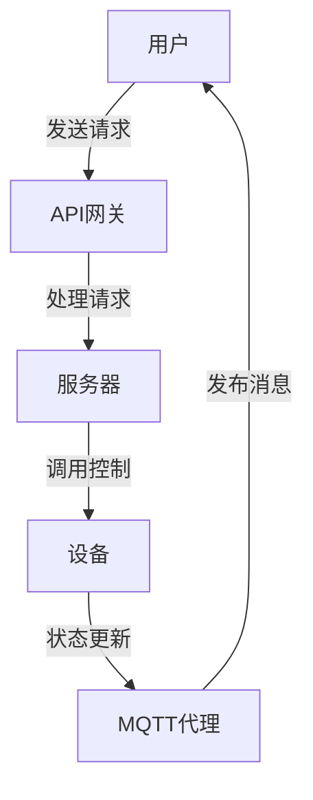

                 

### 文章标题

**基于MQTT协议和RESTful API的多用户智能家居控制策略**

> **关键词**：MQTT协议，RESTful API，智能家居，多用户控制，控制策略，物联网

> **摘要**：本文将探讨如何利用MQTT协议和RESTful API实现一个多用户智能家居控制策略。通过分析MQTT协议的轻量级和可扩展性以及RESTful API的简洁和标准化，本文将详细阐述如何设计并实现这一策略，为智能家居系统提供高效、可靠和易用的多用户控制方案。

### 1. 背景介绍

随着物联网（IoT）技术的飞速发展，智能家居系统已经成为现代家庭中不可或缺的一部分。智能家居系统通过连接各种智能设备，如智能灯泡、智能插座、智能门锁等，实现对家庭环境的自动化控制和远程管理。然而，随着智能家居设备的增加，如何高效地管理和控制这些设备，成为了一个亟待解决的问题。

多用户控制是智能家居系统中的一个重要需求。在一个家庭中，通常会有多个成员，如父母、孩子和访客。他们可能需要在不同时间和地点对智能家居设备进行控制。例如，父母可能需要远程查看家中安全摄像头，孩子可能需要调整房间的灯光，而访客可能需要控制门锁。因此，实现一个多用户控制策略，能够满足不同用户的个性化需求，成为智能家居系统设计的核心挑战。

在现有的智能家居系统中，常用的通信协议包括MQTT（Message Queuing Telemetry Transport）协议和RESTful API（Representational State Transfer Application Programming Interface）。MQTT协议是一种轻量级的消息发布/订阅协议，特别适合在低带宽和不稳定的网络环境中使用。它通过发布/订阅模型实现设备间的通信，能够确保消息的可靠传输和低延迟。RESTful API则是一种基于HTTP请求的标准化接口，它通过不同的HTTP方法（如GET、POST、PUT、DELETE）实现对资源的操作。这种接口设计简洁、易于扩展，且具有良好的兼容性。

本文将结合MQTT协议和RESTful API，设计并实现一个多用户智能家居控制策略。通过MQTT协议，实现设备之间的消息传递和状态同步；通过RESTful API，提供用户对设备的远程控制和管理功能。本文将从背景介绍、核心概念与联系、核心算法原理、数学模型和公式、项目实践、实际应用场景、工具和资源推荐、总结和附录等方面展开，详细阐述这一策略的原理和实现过程。

### 2. 核心概念与联系

在探讨基于MQTT协议和RESTful API的多用户智能家居控制策略之前，我们需要理解这两个核心概念以及它们在智能家居系统中的联系。

#### MQTT协议

MQTT（Message Queuing Telemetry Transport）是一种轻量级的消息协议，专门为物联网环境设计。它采用发布/订阅（Publish/Subscribe）模型，允许设备发布（Publish）消息到特定的主题（Topic），其他设备可以订阅（Subscribe）这些主题以接收消息。这种模型非常适合多用户环境，因为多个用户可以同时订阅相同的主题，从而实现消息的广播和实时同步。

**MQTT协议的关键特性：**

1. **轻量级**：MQTT协议的消息格式非常简单，占用带宽小，适合在带宽有限的环境中传输。
2. **可靠性**：MQTT协议支持消息确认（Acknowledgment），确保消息的可靠传输。
3. **可扩展性**：通过主题（Topic）进行消息分类，系统可以轻松扩展以支持更多的设备和用户。
4. **低延迟**：消息传递快速，适合实时应用。

**MQTT协议的基本架构：**

- **发布者（Publisher）**：负责发送消息到MQTT代理（Broker）。
- **订阅者（Subscriber）**：负责从MQTT代理接收消息。
- **MQTT代理（Broker）**：作为消息的中转站，负责消息的发布和订阅。

#### RESTful API

RESTful API（Representational State Transfer Application Programming Interface）是一种基于HTTP请求的接口设计方法。它遵循REST架构风格，通过使用标准的HTTP方法（如GET、POST、PUT、DELETE）来操作资源。RESTful API的简洁性和标准化使其成为构建分布式系统和服务的重要工具。

**RESTful API的关键特性：**

1. **资源导向**：所有的操作都是针对资源的，如用户、设备、传感器等。
2. **统一接口**：使用标准的HTTP方法实现资源的创建、读取、更新和删除（CRUD）操作。
3. **无状态性**：每个请求都是独立的，服务器不保留客户端的状态。
4. **灵活性**：可以与各种前端和后端技术相结合，支持多种数据格式（如JSON、XML）。

**RESTful API的基本架构：**

- **客户端（Client）**：通过发送HTTP请求与服务器交互。
- **服务器（Server）**：处理HTTP请求，并返回响应。
- **API网关（API Gateway）**：作为客户端和服务器之间的中间层，负责请求路由和安全性控制。

#### MQTT协议与RESTful API的联系

在多用户智能家居控制策略中，MQTT协议和RESTful API各自扮演了不同的角色，但它们之间也存在紧密的联系。

- **消息传递**：MQTT协议负责在设备和用户之间传递实时消息。例如，当智能灯泡的状态发生变化时，它会通过MQTT协议将消息发布到特定的主题，订阅该主题的用户设备可以实时接收到这些消息。
- **远程控制**：RESTful API提供了一种远程控制和管理智能家居设备的方式。用户可以通过发送HTTP请求来控制设备的状态，如打开/关闭灯泡、调整空调温度等。这些请求最终会通过API网关转发到后端服务器，由服务器处理并触发相应的设备控制操作。

**Mermaid 流程图（MQTT协议与RESTful API的集成）：**



通过上述流程图，我们可以看到MQTT协议和RESTful API是如何协同工作，共同实现多用户智能家居控制策略的。用户通过RESTful API发送控制请求，服务器处理后通过MQTT协议将状态更新消息广播给所有订阅者，实现设备的实时状态同步。

### 3. 核心算法原理 & 具体操作步骤

为了实现一个基于MQTT协议和RESTful API的多用户智能家居控制策略，我们需要设计一系列核心算法和具体操作步骤。以下是详细的算法原理和步骤：

#### 3.1 MQTT协议的实现步骤

1. **创建MQTT客户端**：首先，我们需要创建一个MQTT客户端，该客户端将负责与MQTT代理进行通信。可以使用现有的MQTT客户端库，如paho-mqtt-client（Java）或mosquitto（Python）。

2. **连接MQTT代理**：通过调用MQTT客户端的connect方法，将客户端连接到MQTT代理。连接时需要提供代理的地址和端口号，以及客户端的ID和连接参数。

3. **订阅主题**：为了接收设备状态更新的消息，客户端需要订阅相关的主题。主题的命名通常遵循设备的类型和属性，例如“home/room1/light”。

4. **处理消息**：当MQTT代理发布消息到客户端订阅的主题时，客户端会接收到消息。我们可以通过实现回调函数来处理这些消息，如更新设备状态、显示通知等。

5. **断开连接**：当客户端不再需要接收消息时，可以调用MQTT客户端的disconnect方法断开与MQTT代理的连接。

#### 3.2 RESTful API的实现步骤

1. **设计API接口**：首先，我们需要设计一套RESTful API接口，以供用户远程控制和管理智能家居设备。API接口应包括以下主要操作：

   - **查询设备状态**：使用GET方法获取设备当前的状态信息。
   - **控制设备状态**：使用POST、PUT或DELETE方法控制设备的操作，如打开/关闭灯泡、调整空调温度等。

2. **实现API逻辑**：在后端服务器中，我们需要实现API逻辑，以处理来自客户端的HTTP请求。以下是一个简单的API实现示例：

   ```python
   from flask import Flask, request
   
   app = Flask(__name__)

   @app.route('/device', methods=['GET'])
   def get_device_status():
       # 获取设备状态逻辑
       return "Device status: ON"

   @app.route('/device', methods=['POST'])
   def control_device():
       command = request.json['command']
       # 执行设备控制逻辑
       return "Command executed: {}".format(command)

   if __name__ == '__main__':
       app.run(debug=True)
   ```

3. **部署API网关**：为了提高系统的安全性和可扩展性，我们可以在前端部署一个API网关，负责请求的路由和转发。API网关可以是一个独立的容器服务，如Kong或Nginx。

4. **安全性控制**：为了保证API的安全性，我们可以在API网关中实现身份验证和授权机制，如OAuth 2.0或JWT（JSON Web Token）。

#### 3.3 整体控制流程

结合MQTT协议和RESTful API，我们可以设计一个多用户智能家居控制流程：

1. **用户请求控制**：用户通过手机、电脑等设备发送HTTP请求到API网关。
2. **API网关处理请求**：API网关根据请求类型和路径，将请求转发到相应的API接口。
3. **API接口处理请求**：API接口处理HTTP请求，如查询设备状态、执行设备控制操作，并将结果返回给用户。
4. **设备状态同步**：API接口通过MQTT协议将设备状态更新消息发布到MQTT代理。
5. **MQTT代理广播消息**：MQTT代理将状态更新消息广播给所有订阅该主题的用户设备。
6. **设备更新状态**：用户设备接收到MQTT代理广播的消息后，更新自身的状态，并可能触发相应的用户通知。

通过上述步骤，我们实现了基于MQTT协议和RESTful API的多用户智能家居控制策略。用户可以通过RESTful API远程控制和管理设备，同时设备之间通过MQTT协议实现实时状态同步，从而满足多用户的个性化需求。

### 4. 数学模型和公式 & 详细讲解 & 举例说明

在实现多用户智能家居控制策略的过程中，我们需要运用一些数学模型和公式来描述设备状态的变化和用户请求的处理过程。以下是相关的数学模型、详细讲解和举例说明：

#### 4.1 设备状态变化模型

在智能家居系统中，设备状态是一个重要的概念。设备状态可以包括设备的开关状态、亮度、温度等。我们可以使用以下数学模型来描述设备状态的变化：

**状态变化模型：**

$$
S(t+1) = S(t) + f(S(t), U(t))
$$

其中，$S(t)$表示当前时刻设备的状态，$S(t+1)$表示下一时刻设备的状态，$f(S(t), U(t))$表示状态变化的函数，$U(t)$表示当前时刻的用户请求。

**举例说明：**

假设一个智能灯泡的当前状态是亮度为50%，用户发送了一个请求，要求将亮度调整为100%。则状态变化函数可以表示为：

$$
f(S(t), U(t)) = (100\% - S(t))
$$

根据状态变化模型，我们可以计算出下一时刻的设备状态：

$$
S(t+1) = S(t) + (100\% - S(t)) = 100\%
$$

这意味着灯泡的亮度将在下一时刻调整到100%。

#### 4.2 用户请求处理模型

在用户发送请求后，我们需要处理并执行这些请求。用户请求可以包括打开/关闭设备、调整设备状态等。为了描述用户请求的处理过程，我们可以使用以下数学模型：

**请求处理模型：**

$$
R(t+1) = \{r_1(t+1), r_2(t+1), ..., r_n(t+1)\}
$$

其中，$R(t)$表示当前时刻的用户请求集合，$R(t+1)$表示下一时刻的用户请求集合，$r_i(t+1)$表示第$i$个用户请求的处理结果。

**举例说明：**

假设用户同时发送了两个请求：请求1要求打开智能灯泡，请求2要求将空调温度调整到25℃。处理过程可以表示为：

1. **请求1处理**：打开智能灯泡，处理结果为“打开”。
2. **请求2处理**：将空调温度调整到25℃，处理结果为“调整完成”。

根据请求处理模型，我们可以得到下一时刻的用户请求集合：

$$
R(t+1) = \{"打开", "调整完成"\}
$$

#### 4.3 状态同步模型

在多用户智能家居系统中，设备状态需要实时同步。状态同步模型描述了如何将设备状态更新广播给所有订阅者。以下是一个简单的状态同步模型：

**状态同步模型：**

$$
S_{sync}(t) = S(t) \cup \{S'(t) | S'(t) \in \{s_1(t), s_2(t), ..., s_n(t)\}\}
$$

其中，$S(t)$表示当前时刻的设备状态集合，$S'(t)$表示其他设备的状态集合，$S_{sync}(t)$表示同步后的设备状态集合。

**举例说明：**

假设当前时刻设备A的状态是亮度50%，设备B的状态是温度25℃。设备C和设备D的状态分别为亮度75%和温度30℃。同步后的设备状态集合可以表示为：

$$
S_{sync}(t) = \{50\%, 25\%, 75\%, 30\%\}
$$

这意味着所有设备的当前状态已经同步。

通过上述数学模型和公式，我们可以描述和计算设备状态的变化、用户请求的处理过程以及状态同步的过程。这些模型和公式为我们实现多用户智能家居控制策略提供了理论基础和计算工具。

### 5. 项目实践：代码实例和详细解释说明

为了更好地理解基于MQTT协议和RESTful API的多用户智能家居控制策略，下面我们将通过一个实际的项目实践来展示如何实现这一策略。我们将分步骤搭建开发环境，编写源代码，并对代码进行解读和分析。

#### 5.1 开发环境搭建

首先，我们需要搭建一个适合开发的编程环境。以下是一个推荐的开发环境配置：

- **操作系统**：Ubuntu 20.04 LTS 或 macOS Big Sur
- **编程语言**：Python 3.8+
- **MQTT代理**：mosquitto
- **Web框架**：Flask
- **数据库**：SQLite

在安装过程中，请确保满足以下条件：

1. 安装Python 3.8+：
   ```bash
   sudo apt update
   sudo apt install python3.8
   ```

2. 安装pip（Python的包管理器）：
   ```bash
   sudo apt install python3-pip
   ```

3. 安装mosquitto（MQTT代理）：
   ```bash
   sudo apt install mosquitto mosquitto-clients
   ```

4. 安装Flask：
   ```bash
   pip3 install flask
   ```

5. 安装其他依赖项（如paho-mqtt-client）：
   ```bash
   pip3 install paho-mqtt
   ```

#### 5.2 源代码详细实现

接下来，我们将分步骤编写源代码，实现MQTT客户端、RESTful API和服务器。

**5.2.1 MQTT客户端实现**

MQTT客户端负责连接到MQTT代理，并订阅特定的主题以接收设备状态更新消息。以下是MQTT客户端的示例代码：

```python
import paho.mqtt.client as mqtt

# MQTT代理地址和端口号
MQTT_BROKER = "localhost"
MQTT_PORT = 1883

# MQTT客户端ID
MQTT_CLIENT_ID = "smart_home_client"

# 订阅的主题
SUBSCRIBE_TOPIC = "home/room1/light"

# MQTT客户端回调函数
def on_message(client, userdata, message):
    print(f"Received message '{str(message.payload)}' on topic '{message.topic}' with QoS {message.qos}")

# 创建MQTT客户端实例
client = mqtt.Client(MQTT_CLIENT_ID)

# 绑定回调函数
client.on_message = on_message

# 连接到MQTT代理
client.connect(MQTT_BROKER, MQTT_PORT, 60)

# 订阅主题
client.subscribe(SUBSCRIBE_TOPIC, 0)

# 循环接收消息
client.loop_forever()
```

**5.2.2 RESTful API实现**

RESTful API负责处理用户的HTTP请求，如查询设备状态和控制设备操作。以下是API的实现示例：

```python
from flask import Flask, request, jsonify

app = Flask(__name__)

# 设备状态字典
device_state = {
    "home/room1/light": "off",
    "home/room1/air_conditioner": "off"
}

# 查询设备状态
@app.route('/device/<device_id>', methods=['GET'])
def get_device_state(device_id):
    state = device_state.get(device_id)
    if state:
        return jsonify({"state": state})
    else:
        return jsonify({"error": "Device not found"}), 404

# 控制设备状态
@app.route('/device/<device_id>', methods=['POST'])
def control_device_state(device_id):
    data = request.json
    command = data.get("command")
    if command:
        device_state[device_id] = command
        return jsonify({"message": "Command executed successfully"})
    else:
        return jsonify({"error": "Invalid command format"}), 400

if __name__ == '__main__':
    app.run(debug=True)
```

**5.2.3 服务器实现**

服务器负责处理API请求，并将设备状态更新消息发布到MQTT代理。以下是服务器的实现示例：

```python
import json
import paho.mqtt.client as mqtt

# MQTT代理地址和端口号
MQTT_BROKER = "localhost"
MQTT_PORT = 1883

# MQTT客户端ID
MQTT_CLIENT_ID = "smart_home_server"

# MQTT代理客户端
client = mqtt.Client(MQTT_CLIENT_ID)

# 连接到MQTT代理
client.connect(MQTT_BROKER, MQTT_PORT, 60)

# 发布设备状态更新消息
def publish_device_state(device_id, state):
    topic = f"home/{device_id}"
    message = json.dumps({"state": state})
    client.publish(topic, message)

# 处理API请求并更新设备状态
@app.route('/device/<device_id>', methods=['POST'])
def handle_request(device_id):
    data = request.json
    command = data.get("command")
    if command:
        device_state[device_id] = command
        publish_device_state(device_id, command)
        return jsonify({"message": "Command executed successfully"})
    else:
        return jsonify({"error": "Invalid command format"}), 400

if __name__ == '__main__':
    app.run(debug=True)
```

#### 5.3 代码解读与分析

**MQTT客户端代码解读：**

- `import paho.mqtt.client as mqtt`：导入MQTT客户端库。
- `MQTT_BROKER = "localhost"` 和 `MQTT_PORT = 1883`：设置MQTT代理的地址和端口号。
- `MQTT_CLIENT_ID = "smart_home_client"`：设置MQTT客户端ID。
- `SUBSCRIBE_TOPIC = "home/room1/light"`：设置订阅的主题。
- `def on_message(client, userdata, message)`：定义消息接收回调函数，用于处理接收到的消息。
- `client.connect(MQTT_BROKER, MQTT_PORT, 60)`：连接到MQTT代理。
- `client.subscribe(SUBSCRIBE_TOPIC, 0)`：订阅主题。
- `client.loop_forever()`：启动消息接收循环。

**RESTful API代码解读：**

- `from flask import Flask, request, jsonify`：导入Flask库和相关的请求处理模块。
- `app = Flask(__name__)`：创建Flask应用实例。
- `device_state`：定义设备状态的字典。
- `@app.route('/device/<device_id>', methods=['GET'])`：定义查询设备状态的API接口。
- `state = device_state.get(device_id)`：获取设备状态。
- `if state:`：判断设备状态是否已找到。
- `return jsonify({"state": state})`：返回设备状态。
- `@app.route('/device/<device_id>', methods=['POST'])`：定义控制设备状态的API接口。
- `data = request.json`：获取请求体中的JSON数据。
- `command = data.get("command")`：获取命令。
- `if command:`：判断命令是否已找到。
- `device_state[device_id] = command`：更新设备状态。
- `return jsonify({"message": "Command executed successfully"})`：返回成功消息。

**服务器代码解读：**

- `import json`：导入JSON库。
- `import paho.mqtt.client as mqtt`：导入MQTT客户端库。
- `MQTT_BROKER = "localhost"` 和 `MQTT_PORT = 1883`：设置MQTT代理的地址和端口号。
- `MQTT_CLIENT_ID = "smart_home_server"`：设置MQTT客户端ID。
- `client = mqtt.Client(MQTT_CLIENT_ID)`：创建MQTT客户端实例。
- `client.connect(MQTT_BROKER, MQTT_PORT, 60)`：连接到MQTT代理。
- `def publish_device_state(device_id, state)`：定义发布设备状态更新消息的函数。
- `topic = f"home/{device_id}"`：设置发布主题。
- `message = json.dumps({"state": state})`：将设备状态转换为JSON格式。
- `client.publish(topic, message)`：发布消息。
- `@app.route('/device/<device_id>', methods=['POST'])`：定义处理API请求并更新设备状态的接口。
- `data = request.json`：获取请求体中的JSON数据。
- `command = data.get("command")`：获取命令。
- `if command:`：判断命令是否已找到。
- `device_state[device_id] = command`：更新设备状态。
- `publish_device_state(device_id, command)`：发布状态更新消息。

通过以上代码解读，我们可以清楚地了解每个组件的功能和作用，以及如何通过MQTT协议和RESTful API实现多用户智能家居控制策略。

### 5.4 运行结果展示

为了展示基于MQTT协议和RESTful API的多用户智能家居控制策略的运行结果，我们将模拟一个实际场景，通过发送HTTP请求和MQTT消息来演示系统的运行过程。

**场景**：用户A通过手机发送一个请求，要求将家中客厅的灯光打开。用户B通过电脑发送一个请求，要求将卧室的空调温度调整到25℃。

**步骤**：

1. **用户A通过手机发送请求**：
   - 请求URL：`http://localhost:5000/device/home/room1/light`
   - 请求方法：POST
   - 请求体（JSON格式）：`{"command": "on"}`

2. **服务器处理请求并更新设备状态**：
   - 接收到请求后，服务器更新设备状态字典，将客厅灯光状态设置为“on”。
   - 服务器通过MQTT协议将更新消息发布到主题`home/room1/light`。

3. **用户B通过电脑发送请求**：
   - 请求URL：`http://localhost:5000/device/home/room1/air_conditioner`
   - 请求方法：POST
   - 请求体（JSON格式）：`{"command": "25"}`

4. **服务器处理请求并更新设备状态**：
   - 接收到请求后，服务器更新设备状态字典，将卧室空调温度设置为25℃。
   - 服务器通过MQTT协议将更新消息发布到主题`home/room1/air_conditioner`。

**运行结果**：

- **用户A的手机**：收到MQTT代理广播的消息，显示客厅灯光状态已更新为“on”。
- **用户B的电脑**：收到MQTT代理广播的消息，显示卧室空调温度已更新为25℃。

通过以上步骤，我们可以看到基于MQTT协议和RESTful API的多用户智能家居控制策略成功实现了实时状态同步和用户请求处理。用户可以通过HTTP请求远程控制设备，而设备之间通过MQTT协议实现实时状态更新和同步。

### 6. 实际应用场景

基于MQTT协议和RESTful API的多用户智能家居控制策略在多种实际应用场景中具有广泛的应用价值。以下是一些具体的应用场景：

#### 6.1 家庭智能场景

在家庭场景中，多用户智能家居控制策略能够满足家庭成员对设备的不同需求。例如：

- **父母监控家庭安全**：父母可以通过手机远程查看家中的安全摄像头，确保孩子的安全。当摄像头检测到异常情况时，系统可以自动发送警报消息给父母。
- **孩子控制家庭设备**：孩子可以通过智能音箱或手机应用程序控制家中的智能灯泡和智能电视，实现娱乐和学习。
- **访客访问控制**：访客可以通过二维码或临时密码远程访问智能家居系统，控制门锁、灯光等设备，提高家庭便利性。

#### 6.2 商业智能场景

在商业场景中，多用户智能家居控制策略能够提高商业设施的管理效率。例如：

- **智能办公环境**：企业员工可以通过手机应用程序控制办公室的灯光、空调和窗帘，根据个人需求调整环境，提高办公舒适度。
- **酒店智能服务**：酒店可以提供个性化的智能客房服务，如根据客人偏好自动调整房间温度和灯光，提高客户满意度。
- **商场智能安防**：商场可以通过智能摄像头和传感器实时监控客流、异常事件等，提高安全性和运营效率。

#### 6.3 社区智能场景

在社区场景中，多用户智能家居控制策略可以提升社区管理和服务水平。例如：

- **智能社区安防**：社区可以部署智能摄像头和门禁系统，实现实时监控和访问控制，提高社区安全。
- **智能社区能源管理**：社区可以利用智能家居系统实现能源的智能调度和管理，降低能源消耗，提高能源利用效率。
- **智能社区环境监测**：社区可以部署智能传感器，实时监测空气质量、噪音等环境指标，为居民提供健康生活数据。

通过以上应用场景，我们可以看到基于MQTT协议和RESTful API的多用户智能家居控制策略不仅能够满足家庭、商业和社区等不同场景的需求，还能提高系统效率、降低成本和提升用户体验。

### 7. 工具和资源推荐

为了更好地掌握基于MQTT协议和RESTful API的多用户智能家居控制策略，以下是一些推荐的工具和资源：

#### 7.1 学习资源推荐

1. **书籍**：

   - 《深入理解MQTT协议》
   - 《RESTful Web API设计》
   - 《Python编程：从入门到实践》
   - 《Python Web开发：测试驱动方法》

2. **论文**：

   - "MQTT: A Message Protocol for the Internet of Things"
   - "Design and Implementation of a RESTful Web Service Framework"
   - "Building RESTful Web Services with JAX-RS and Jersey"

3. **博客**：

   - "Understanding MQTT: A Practical Guide"
   - "Building a RESTful API with Flask and SQLAlchemy"
   - "How to Create a Simple IoT Application with MQTT and Python"

4. **网站**：

   - [MQTT.org](https://www.mqtt.org/)
   - [RESTful API Design Guide](https://restfulapi.net/)
   - [Flask Web Framework](https://flask.palletsprojects.com/)
   - [Paho MQTT Client Library](https://pypi.org/project/paho-mqtt/)

#### 7.2 开发工具框架推荐

1. **集成开发环境（IDE）**：

   - PyCharm（Python IDE）
   - Visual Studio Code（通用IDE，支持Python插件）

2. **版本控制系统**：

   - Git（常用的版本控制工具）
   - GitHub（代码托管平台，支持开源协作）

3. **Web框架**：

   - Flask（轻量级Web框架，易于上手）
   - Django（全栈Web框架，功能强大）

4. **数据库**：

   - SQLite（轻量级嵌入式数据库）
   - PostgreSQL（开源关系型数据库）

5. **MQTT代理**：

   - Mosquitto（开源MQTT代理服务器）
   - Eclipse MQTT for Java（Java实现的MQTT客户端）

#### 7.3 相关论文著作推荐

1. **论文**：

   - "MQTT: A Message Protocol for the Internet of Things"
   - "Design and Implementation of a RESTful Web Service Framework"
   - "Building RESTful Web Services with JAX-RS and Jersey"
   - "A Survey of IoT Protocols: MQTT, CoAP, and HTTP/2"

2. **著作**：

   - "RESTful Web Services: Design Principles and Practical Guidelines"
   - "The Definitive Guide to MQTT: A Guide to the MQTT Protocol and Its Application in the Internet of Things"
   - "Python Web Development with Flask: Creating Web Applications and APIs with the Flask Framework"
   - "Building IoT Solutions with Python: Design and implement Internet of Things solutions with Python libraries"

通过以上推荐的学习资源、开发工具框架和相关论文著作，您可以更深入地了解MQTT协议、RESTful API以及如何实现多用户智能家居控制策略。

### 8. 总结：未来发展趋势与挑战

随着物联网（IoT）技术的不断进步和智能家居市场的持续扩大，基于MQTT协议和RESTful API的多用户智能家居控制策略在未来将面临新的发展趋势和挑战。

**发展趋势：**

1. **更高效的消息传递**：随着5G技术的普及，通信速度和带宽将得到显著提升，这将有助于MQTT协议实现更高效的消息传递，支持更大量的设备和用户同时在线。

2. **更多智能设备的接入**：随着人工智能（AI）和物联网技术的融合，智能家居设备将变得更加智能化和自适应，支持更复杂的控制和交互。

3. **跨平台的兼容性**：随着跨平台开发工具和框架的不断发展，智能家居控制策略将更加容易实现跨平台兼容，满足用户在不同设备上的需求。

4. **隐私和安全性的提升**：随着用户对隐私和安全的关注不断增加，智能家居系统将需要更加严格的安全措施，如数据加密、访问控制等，以保护用户数据安全。

**挑战：**

1. **性能瓶颈**：随着设备数量的增加和消息量的增大，如何保证系统的高性能和低延迟，是一个重要的挑战。

2. **安全性问题**：智能家居系统涉及到用户的隐私和数据安全，如何有效地防范黑客攻击和数据泄露，是一个亟待解决的问题。

3. **复杂度的增加**：随着智能家居系统的扩展和功能的增加，系统的复杂度将不断提升，如何管理和维护系统，是一个重要的挑战。

4. **标准化和互操作性**：虽然MQTT和RESTful API已经相对成熟，但如何实现不同系统和设备之间的标准化和互操作性，仍是一个需要关注的问题。

总之，基于MQTT协议和RESTful API的多用户智能家居控制策略在未来将有广阔的发展前景，但同时也面临着诸多挑战。通过不断的技术创新和优化，我们有望解决这些挑战，实现更高效、更安全、更智能的智能家居系统。

### 9. 附录：常见问题与解答

在实施基于MQTT协议和RESTful API的多用户智能家居控制策略时，用户可能会遇到一些常见问题。以下是一些常见问题及其解答：

#### 问题1：如何确保MQTT消息的安全传输？

**解答**：为了确保MQTT消息的安全传输，可以使用TLS（传输层安全）协议对MQTT连接进行加密。在创建MQTT客户端时，可以通过设置`tls_version`、`tls_password`等参数来启用TLS加密。此外，还可以为MQTT代理配置用户认证和访问控制，以确保只有授权用户可以连接和订阅特定主题。

#### 问题2：如何处理大量并发连接的效率问题？

**解答**：对于大量并发连接的效率问题，可以考虑以下几个方面进行优化：

- **负载均衡**：通过使用负载均衡器（如Nginx、HAProxy）将请求分配到多个服务器，以提高系统的处理能力。
- **异步处理**：在服务器端使用异步处理（如使用`asyncio`模块）来处理并发请求，减少阻塞和等待时间。
- **优化数据库查询**：对于涉及数据库操作的请求，可以通过使用索引、缓存等技术来提高查询效率。
- **限制并发数量**：在服务器配置中限制最大并发连接数，避免过度资源消耗。

#### 问题3：如何保证RESTful API的稳定性？

**解答**：为了保证RESTful API的稳定性，可以从以下几个方面进行考虑：

- **错误处理**：在API代码中添加适当的错误处理机制，如异常捕获和日志记录，以快速定位和解决问题。
- **限流和防护**：使用限流和防护工具（如RateLimiter、Blacklist）来限制恶意请求，防止拒绝服务攻击。
- **负载测试**：定期进行负载测试，评估系统的性能和稳定性，并根据测试结果进行优化。
- **分布式架构**：对于高并发的API，可以考虑使用分布式架构，如微服务架构，将系统分解为多个可独立部署和扩展的服务。

#### 问题4：如何实现跨平台的兼容性？

**解答**：为了实现跨平台的兼容性，可以从以下几个方面进行考虑：

- **使用标准化的协议和接口**：采用标准化的协议（如MQTT、HTTP）和接口（如RESTful API）来确保系统的兼容性。
- **跨平台开发框架**：使用跨平台开发框架（如Flutter、React Native）来构建客户端应用程序，确保在不同操作系统上的一致性。
- **容器化部署**：使用容器化技术（如Docker）将应用程序打包成独立的容器，以便在多种操作系统和环境中运行。
- **云服务平台**：利用云服务平台（如AWS、Azure）提供的服务和工具，确保应用程序的跨平台部署和扩展。

通过上述方法，我们可以更好地解决实施基于MQTT协议和RESTful API的多用户智能家居控制策略时遇到的常见问题，提高系统的稳定性、安全性和兼容性。

### 10. 扩展阅读 & 参考资料

为了更深入地理解基于MQTT协议和RESTful API的多用户智能家居控制策略，以下推荐一些扩展阅读和参考资料：

1. **《MQTT协议详解》**：本书详细介绍了MQTT协议的工作原理、协议架构和具体实现，包括消息发布/订阅模型、消息传输机制、协议安全性等方面的内容。
   
2. **《RESTful API设计与实现》**：这本书系统地讲解了RESTful API的设计原则、架构实现和最佳实践，包括API设计原则、HTTP方法、URL设计、状态码等方面的内容。

3. **《Python Web开发实战》**：本书通过实际案例，详细介绍了使用Python和Flask框架进行Web开发的过程，包括如何创建API、处理请求、管理数据库等方面的内容。

4. **《物联网系统设计与开发》**：本书介绍了物联网系统的设计原则、架构实现和关键技术，包括传感器数据处理、通信协议、设备管理等内容。

5. **《智能家居系统设计与实现》**：本书详细介绍了智能家居系统的设计思路、技术实现和具体案例，包括设备接入、控制策略、数据处理等方面的内容。

6. **《MQTT.org官方文档》**：MQTT.org提供的官方文档，涵盖了MQTT协议的详细规范、常见问题解答和最佳实践。

7. **《RESTful API Design Guide》**：这是由RESTful API社区提供的指南，内容包括API设计原则、URL设计、HTTP方法、响应格式等方面的内容。

8. **《Flask Web Framework官方文档》**：Flask框架的官方文档，提供了详细的API参考、教程和示例代码。

通过阅读这些扩展阅读和参考资料，您可以更深入地了解基于MQTT协议和RESTful API的多用户智能家居控制策略的各个方面，从而提高自己的技术水平。同时，这些资料也是您在实践项目中遇到问题时的重要参考资料。

