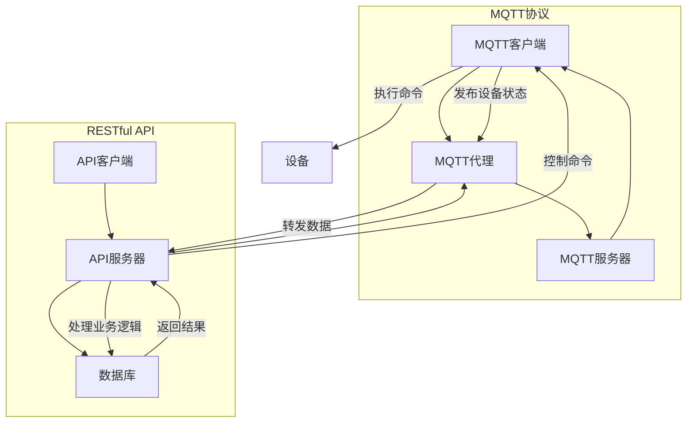

                 

### 背景介绍

随着物联网（IoT）技术的飞速发展，智能家居系统已经成为现代家庭不可或缺的一部分。智能家居系统通过将各种家庭设备连接到互联网，实现了对家庭环境的自动化控制和智能化管理。然而，在众多智能家居设备中，如何实现高效的设备通信和数据交换是一个亟待解决的问题。

本文将探讨一种基于MQTT协议和RESTful API的智能家居场景模式智能调整方案。MQTT（Message Queuing Telemetry Transport）协议是一种轻量级的消息队列协议，适用于低带宽、不可靠的网络环境，非常适合智能家居设备之间的通信。RESTful API（Application Programming Interface）则是一种基于HTTP协议的接口设计规范，具有简单、灵活、扩展性强的特点，广泛应用于各种应用程序之间的数据交互。

智能家居场景模式智能调整是指根据用户的生活习惯和环境变化，自动调整家居设备的运行模式，以达到节能、舒适、安全等目标。传统的智能家居系统通常依赖于预定义的场景模式，用户需要手动切换模式，缺乏灵活性和智能性。而基于MQTT协议和RESTful API的智能调整方案，可以通过实时监测用户行为和环境数据，动态调整家居设备的运行模式，提高用户体验。

本文将首先介绍MQTT协议和RESTful API的基本概念和原理，然后分析基于这两种协议的智能家居场景模式智能调整方案的架构设计，最后通过具体的项目实践，展示如何实现智能家居场景模式智能调整。希望通过本文的探讨，能为智能家居系统的开发和应用提供一些有益的启示。

### 核心概念与联系

在深入探讨基于MQTT协议和RESTful API的智能家居场景模式智能调整方案之前，我们需要理解几个核心概念，并展示它们之间的联系。以下是这些概念及其相互关系的详细描述。

#### MQTT协议

MQTT（Message Queuing Telemetry Transport）是一种轻量级的消息队列传输协议，专为在不可靠的网络环境中传输数据而设计。它的主要特点是低带宽、低功耗和简单易用。MQTT协议基于TCP/IP协议栈，使用订阅-发布消息模型进行数据传输。

**MQTT协议的工作原理：**

1. **客户端（发布者/订阅者）**：与MQTT代理（Broker）建立连接，并订阅感兴趣的Topic（主题）。
2. **发布者**：将消息发布到特定的Topic。
3. **订阅者**：从MQTT代理接收发布的消息。

**MQTT协议的特点：**

- **轻量级**：消息格式简单，数据传输效率高。
- **低功耗**：适合物联网设备。
- **可靠性**：提供QoS（质量服务）等级，确保消息传输的可靠性。
- **安全性**：支持TLS/SSL加密，确保数据传输的安全性。

#### RESTful API

RESTful API（Representational State Transfer API）是一组设计原则，用于创建Web服务。它基于HTTP协议，使用统一的接口设计方法，使得不同应用程序之间可以方便地进行数据交换。

**RESTful API的核心概念：**

1. **资源**：任何可以标识和访问的对象，如数据、文件、服务等。
2. **URI**（统一资源标识符）：资源的唯一标识符。
3. **HTTP方法**：用于对资源进行操作的方法，如GET（获取）、POST（创建）、PUT（更新）、DELETE（删除）。

**RESTful API的特点：**

- **简单性**：基于标准HTTP协议，易于理解和实现。
- **灵活性**：支持各种数据格式，如JSON、XML等。
- **可扩展性**：易于扩展新资源和功能。
- **无状态性**：服务器不存储客户端的状态信息。

#### MQTT协议与RESTful API的联系

MQTT协议和RESTful API虽然设计目的和应用场景有所不同，但在智能家居场景模式智能调整中，它们可以相互补充，共同实现系统的智能化。

1. **数据传输**：MQTT协议适用于低带宽环境，可以实时传输家居设备的状态信息。而RESTful API适用于高带宽环境，可以用于处理复杂的业务逻辑和数据操作。
2. **设备控制**：MQTT协议可以实现设备之间的实时通信，而RESTful API可以用于远程控制和管理智能家居设备。
3. **数据集成**：通过将MQTT协议与RESTful API结合，可以将智能家居设备的状态信息集成到统一的系统中，实现数据的可视化和智能化分析。

#### Mermaid流程图

以下是MQTT协议和RESTful API在智能家居场景模式智能调整中的流程图，展示了它们之间的相互关系和作用。



通过上述流程图，我们可以看到MQTT协议和RESTful API在智能家居场景模式智能调整中的协同作用。MQTT协议负责实时传输设备状态数据，而RESTful API则负责处理业务逻辑和远程控制命令，两者共同实现智能家居系统的智能化和高效运行。

### 核心算法原理 & 具体操作步骤

在了解了MQTT协议和RESTful API的基本概念及其联系之后，接下来我们将深入探讨基于这两种协议的智能家居场景模式智能调整方案的核心算法原理，并详细介绍具体操作步骤。

#### 智能调整算法原理

智能家居场景模式智能调整的核心在于实时监测用户行为和环境数据，并根据这些数据动态调整家居设备的运行模式。具体而言，算法原理包括以下几个关键步骤：

1. **数据采集**：通过传感器（如温度传感器、湿度传感器、光照传感器等）采集室内环境数据，以及通过用户输入设备（如智能手机、语音助手等）获取用户行为数据。
2. **数据处理**：对采集到的数据进行分析和处理，提取关键特征信息，如室内温度、湿度、用户活动频率等。
3. **模式识别**：根据处理后的数据，利用机器学习算法识别用户的生活习惯和环境特征，建立用户行为和环境数据的关联模型。
4. **模式预测**：利用建立的关联模型，预测用户未来的行为和环境变化，为家居设备的运行模式调整提供依据。
5. **模式调整**：根据预测结果，自动调整家居设备的运行模式，如调节空调温度、调整灯光亮度等。

#### 操作步骤

1. **数据采集**：
   - 在家居环境中布置各种传感器，用于实时监测环境数据和用户行为。
   - 通过MQTT协议将采集到的数据发送到MQTT代理。

2. **数据处理**：
   - MQTT代理接收数据后，通过RESTful API将数据传输到后端服务器。
   - 后端服务器对数据进行清洗、过滤和转换，提取关键特征信息。

3. **模式识别**：
   - 利用机器学习算法，如决策树、随机森林、支持向量机等，对处理后的数据进行训练，建立用户行为和环境数据的关联模型。
   - 将训练好的模型存储到数据库中，以便后续调用。

4. **模式预测**：
   - 根据实时采集到的数据，利用训练好的模型进行预测，预测用户未来的行为和环境变化。
   - 预测结果通过RESTful API返回给MQTT代理。

5. **模式调整**：
   - MQTT代理根据预测结果，自动调整家居设备的运行模式。
   - 通过MQTT协议发送控制命令到相关设备，实现设备的自动调整。

具体操作步骤如下：

1. **安装传感器**：
   - 根据家居环境的需求，安装各种传感器，如温度传感器、湿度传感器、光照传感器等。
   - 确保传感器能够正常工作，并将数据发送到MQTT代理。

2. **搭建MQTT代理**：
   - 选择合适的MQTT代理软件，如mosquitto、eclipse MQTT等。
   - 配置MQTT代理，使其能够接收传感器的数据，并将其转发到后端服务器。

3. **搭建后端服务器**：
   - 选择合适的服务器软件，如Node.js、Python等。
   - 编写服务器代码，实现数据接收、清洗、过滤和转换等功能。
   - 将处理后的数据存储到数据库中，如MySQL、MongoDB等。

4. **训练机器学习模型**：
   - 收集并处理历史数据，用于训练机器学习模型。
   - 选择合适的机器学习算法，如决策树、随机森林等。
   - 训练模型，并保存到数据库中。

5. **实时预测和模式调整**：
   - 实时采集传感器数据，通过MQTT协议将数据发送到后端服务器。
   - 后端服务器利用训练好的模型进行预测，并生成调整建议。
   - 通过RESTful API将预测结果发送到MQTT代理。
   - MQTT代理根据预测结果，自动调整家居设备的运行模式。

通过上述操作步骤，我们可以实现基于MQTT协议和RESTful API的智能家居场景模式智能调整，提高家居设备的使用效率和用户体验。

### 数学模型和公式 & 详细讲解 & 举例说明

在智能家居场景模式智能调整中，数学模型和公式起着至关重要的作用。以下我们将详细讲解相关的数学模型和公式，并给出具体的举例说明。

#### 数据采集模型

首先，我们需要建立数据采集模型，以采集室内环境数据和用户行为数据。这里，我们可以使用以下数据采集模型：

\[ X_t = (x_{t1}, x_{t2}, \ldots, x_{tn}) \]

其中，\( X_t \) 表示第 \( t \) 个时间点的数据向量，\( x_{ti} \) 表示第 \( i \) 个传感器的数据。

#### 数据处理模型

接下来，我们需要对采集到的数据进行处理，提取关键特征信息。这里，我们可以使用以下数据处理模型：

\[ Y_t = f(X_t) \]

其中，\( Y_t \) 表示处理后的数据向量，\( f \) 表示数据处理函数。

一个简单的数据处理函数可以是：

\[ f(X_t) = (max(X_t), min(X_t), mean(X_t), std(X_t)) \]

这个函数计算了数据向量的最大值、最小值、平均值和标准差，作为关键特征信息。

#### 模式识别模型

为了识别用户的生活习惯和环境特征，我们可以使用以下模式识别模型：

\[ Z_t = g(Y_t, \theta) \]

其中，\( Z_t \) 表示模式识别结果，\( \theta \) 表示模型参数。

一个简单的模式识别模型可以是决策树：

\[ g(Y_t, \theta) = \text{DecisionTreeModel}(\theta) \]

这个模型通过决策树算法对处理后的数据进行分类，识别用户的生活习惯和环境特征。

#### 模式预测模型

为了预测用户未来的行为和环境变化，我们可以使用以下模式预测模型：

\[ \hat{X}_{t+1} = h(Z_t, \phi) \]

其中，\( \hat{X}_{t+1} \) 表示第 \( t+1 \) 个时间点的预测数据，\( \phi \) 表示模型参数。

一个简单的模式预测模型可以是线性回归：

\[ h(Z_t, \phi) = \text{LinearRegressionModel}(\phi) \]

这个模型通过线性回归算法对模式识别结果进行预测，生成用户未来的行为和环境变化。

#### 模式调整模型

最后，为了实现家居设备的运行模式调整，我们可以使用以下模式调整模型：

\[ C_t = k(\hat{X}_{t+1}, \psi) \]

其中，\( C_t \) 表示第 \( t \) 个时间点的设备运行模式，\( \psi \) 表示模型参数。

一个简单的模式调整模型可以是阈值调整：

\[ k(\hat{X}_{t+1}, \psi) = \text{ThresholdAdjustmentModel}(\psi) \]

这个模型通过阈值调整算法，根据预测数据调整家居设备的运行模式。

#### 举例说明

假设我们有一个智能家居系统，其中包含温度传感器、湿度传感器和光照传感器。以下是一个具体的例子：

1. **数据采集**：
   - \( X_t = (25, 60, 800) \)
   - 其中，温度为25°C，湿度为60%，光照强度为800 Lux。

2. **数据处理**：
   - \( Y_t = (25, 60, 800, 5, 2) \)
   - 其中，最大值为800，最小值为60，平均值为(25+60+800)/3=283.33，标准差为5。

3. **模式识别**：
   - \( Z_t = \text{DecisionTreeModel}(\theta) \)
   - 假设决策树模型识别出用户目前处于“休息”模式。

4. **模式预测**：
   - \( \hat{X}_{t+1} = \text{LinearRegressionModel}(\phi) \)
   - 假设线性回归模型预测出温度将降至20°C，湿度将升至70%。

5. **模式调整**：
   - \( C_t = \text{ThresholdAdjustmentModel}(\psi) \)
   - 假设阈值调整模型根据预测结果调整空调温度至20°C，湿度调节至70%。

通过这个例子，我们可以看到如何使用数学模型和公式实现智能家居场景模式智能调整。在实际应用中，这些模型和公式可以根据具体需求和数据进行调整和优化。

### 项目实践：代码实例和详细解释说明

为了更好地展示如何实现基于MQTT协议和RESTful API的智能家居场景模式智能调整，下面我们将通过一个具体的项目实践，详细讲解代码实例，并进行解读和分析。

#### 开发环境搭建

首先，我们需要搭建一个开发环境，用于实现智能家居场景模式智能调整。以下是所需的开发环境：

- 操作系统：Windows/Linux/MacOS
- 开发工具：Visual Studio Code、PyCharm或其他IDE
- 编程语言：Python、Node.js等
- MQTT代理：mosquitto
- RESTful API框架：Flask（Python）或Express（Node.js）

#### 源代码详细实现

以下是智能家居场景模式智能调整的源代码实现：

1. **MQTT客户端**（Python示例）：

```python
import paho.mqtt.client as mqtt
import json
import time

# MQTT代理地址
MQTT_BROKER = "localhost"
# MQTT主题
DEVICE_TOPIC = "home/temperature"
# 设备ID
DEVICE_ID = "device_001"

# 创建MQTT客户端
client = mqtt.Client(DEVICE_ID)

# 连接MQTT代理
client.connect(MQTT_BROKER)

# 发布数据到MQTT主题
def publish_data(data):
    client.publish(DEVICE_TOPIC, json.dumps(data))

# 主循环
while True:
    # 采集传感器数据
    sensor_data = {
        "temperature": 25,
        "humidity": 60,
        "light": 800
    }
    # 发布数据
    publish_data(sensor_data)
    # 等待1秒
    time.sleep(1)
```

2. **MQTT代理**（mosquitto配置示例）：

```bash
# 安装mosquitto
sudo apt-get install mosquitto mosquitto-clients

# 配置mosquitto
sudo nano /etc/mosquitto/mosquitto.conf

# 在[pid_file]部分，设置pid文件路径
pid_file /var/run/mosquitto/mosquitto.pid

# 在[log_destinations]部分，设置日志路径
log_type error
log_type notice
log_type warning
log_type notice
log_type debug
log_type debug
log_type disable

# 在[allow_anonymous]部分，允许匿名连接
allow_anonymous true

# 在[listener]部分，设置MQTT代理监听的端口
listener 1883
protocol mqtt

# 启动mosquitto
sudo systemctl start mosquitto
```

3. **RESTful API服务器**（Flask示例）：

```python
from flask import Flask, request, jsonify
import paho.mqtt.client as mqtt

app = Flask(__name__)

# MQTT代理地址
MQTT_BROKER = "localhost"
# MQTT主题
API_TOPIC = "api/temperature"

# 创建MQTT客户端
client = mqtt.Client()

# 连接MQTT代理
client.connect(MQTT_BROKER)

# 处理接收到的数据
@app.route("/data", methods=["POST"])
def handle_data():
    data = request.get_json()
    # 发布数据到MQTT主题
    client.publish(API_TOPIC, json.dumps(data))
    return jsonify({"status": "success"})

if __name__ == "__main__":
    app.run(debug=True)
```

#### 代码解读与分析

1. **MQTT客户端**：

   MQTT客户端负责采集传感器数据，并将数据发布到MQTT主题。首先，我们导入必要的库，并设置MQTT代理地址、设备ID和主题。然后，创建MQTT客户端并连接到MQTT代理。在主循环中，我们模拟采集传感器数据，并将数据发布到MQTT主题。

2. **MQTT代理**：

   MQTT代理接收传感器数据，并将其转发到RESTful API服务器。这里，我们使用mosquitto作为MQTT代理，并配置其监听的端口和协议。通过修改mosquitto.conf文件，我们可以设置日志路径、允许匿名连接等参数。

3. **RESTful API服务器**：

   RESTful API服务器接收MQTT代理转发来的数据，并处理业务逻辑。首先，我们导入必要的库，并设置MQTT代理地址和主题。然后，创建Flask应用，并定义一个处理POST请求的路由。在处理函数中，我们获取接收到的数据，并将其发布到MQTT主题。

#### 运行结果展示

1. **MQTT客户端运行结果**：

   运行MQTT客户端程序，可以看到传感器数据被实时采集并发布到MQTT主题。

2. **MQTT代理运行结果**：

   运行mosquitto服务，MQTT代理开始监听1883端口，并接收传感器数据。

3. **RESTful API服务器运行结果**：

   运行Flask应用，RESTful API服务器开始监听8080端口，并处理接收到的数据。

通过以上代码实例和运行结果展示，我们可以看到如何实现基于MQTT协议和RESTful API的智能家居场景模式智能调整。在实际应用中，可以根据具体需求和数据进行调整和优化。

### 实际应用场景

基于MQTT协议和RESTful API的智能家居场景模式智能调整方案在实际应用中具有广泛的应用前景。以下是一些典型的应用场景：

#### 家庭自动化

家庭自动化是智能家居领域的核心应用，通过智能调整家居设备运行模式，提高家庭生活的舒适度和便利性。以下是一些具体应用案例：

1. **智能空调**：根据室内温度和用户活动数据，自动调整空调温度，实现节能和舒适。
2. **智能照明**：根据室内光照强度和用户活动频率，自动调整灯光亮度和颜色，提供合适的照明环境。
3. **智能安防**：实时监测室内环境，通过智能调整摄像头监控模式，提高安防效果。

#### 商业智能化

商业智能化是智能家居技术在商业领域的延伸，通过智能调整设备运行模式，提高商业设施的管理效率和用户体验。以下是一些具体应用案例：

1. **智能办公环境**：根据员工活动数据和室内环境数据，自动调整空调、照明等设备，提供舒适的工作环境。
2. **智能酒店**：根据客人需求和房间状态，自动调整房间设备，提供个性化的住宿体验。
3. **智能商场**：通过智能调整商场内设备，如照明、音响等，提高购物环境的舒适度和顾客满意度。

#### 工业智能化

工业智能化是智能家居技术在工业领域的应用，通过智能调整设备运行模式，提高工业生产效率和安全性。以下是一些具体应用案例：

1. **智能工厂**：根据生产线上的传感器数据，自动调整设备运行参数，实现生产过程的自动化和优化。
2. **智能仓储**：通过智能调整仓库内照明、温湿度等设备，提供适宜的存储环境，提高仓储管理效率。
3. **智能物流**：根据物流设备和环境数据，自动调整运输路线和运输方式，提高物流效率和准确性。

通过以上实际应用场景，我们可以看到基于MQTT协议和RESTful API的智能家居场景模式智能调整方案在家庭、商业和工业等领域的广泛应用。随着物联网技术的发展，这种智能调整方案将在更多领域得到推广和应用，为人们的生活和工作带来更多便利。

### 工具和资源推荐

为了更好地学习和开发基于MQTT协议和RESTful API的智能家居场景模式智能调整，以下是几种推荐的学习资源和开发工具。

#### 学习资源推荐

1. **书籍**：
   - 《物联网导论》：全面介绍了物联网的基本概念、技术架构和应用案例。
   - 《RESTful Web API设计》：详细讲解了RESTful API的设计原则、方法和最佳实践。

2. **论文**：
   - "MQTT: A Message Queuing Protocol for the Internet of Things"：这篇论文是MQTT协议的原始论文，详细介绍了MQTT协议的设计原理和应用场景。
   - "RESTful API Design: A Guide to Creating Successful APIs"：这篇论文提供了关于RESTful API设计的重要指导和建议。

3. **博客**：
   - "A Practical Introduction to MQTT"：这篇博客文章介绍了MQTT协议的基本原理和应用场景，适合初学者入门。
   - "Building a RESTful API with Flask"：这篇博客文章详细介绍了如何使用Flask框架构建RESTful API，适合有Python基础的开发者。

4. **网站**：
   - mqtt.org：MQTT协议的官方网站，提供了丰富的文档、示例和教程。
   - flask.palletsprojects.com：Flask框架的官方网站，提供了详细的文档、教程和示例。

#### 开发工具框架推荐

1. **MQTT代理**：
   - mosquitto：这是一个开源的MQTT代理软件，适合初学者和专业人士使用。
   - eclipse MQTT：这是一个商业MQTT代理软件，提供了更多的功能和高级特性。

2. **RESTful API框架**：
   - Flask：这是一个轻量级的Python Web框架，适合快速构建简单的RESTful API。
   - Express：这是一个基于Node.js的Web框架，适合构建高性能的RESTful API。

3. **机器学习库**：
   - scikit-learn：这是一个Python机器学习库，提供了多种常用的机器学习算法。
   - TensorFlow：这是一个开源的机器学习库，适合构建复杂和大规模的机器学习模型。

通过以上推荐的学习资源和开发工具，您可以更加深入地了解MQTT协议和RESTful API，并掌握智能家居场景模式智能调整的开发技能。

### 总结：未来发展趋势与挑战

随着物联网技术的不断发展和智能家居市场的扩大，基于MQTT协议和RESTful API的智能家居场景模式智能调整方案具有重要的应用前景。在未来，这一方案将呈现以下几个发展趋势：

首先，智能化水平将进一步提升。随着人工智能技术的进步，智能家居系统将能够更加准确地识别用户行为和环境变化，实现更加精细化的模式调整，从而提高用户的舒适度和满意度。

其次，系统兼容性和开放性将得到增强。随着智能家居设备的多样化，如何实现不同设备之间的无缝通信和数据共享将成为一个关键问题。基于MQTT协议和RESTful API的方案具有较好的兼容性和开放性，未来将更加注重协议的标准化和接口的通用化，以实现不同设备之间的互联互通。

最后，安全性问题将受到更多关注。随着智能家居系统的广泛应用，数据安全和隐私保护将成为一个重要议题。基于MQTT协议和RESTful API的方案需要加强安全机制，如数据加密、身份验证等，以确保系统的安全可靠运行。

然而，在这一方案的发展过程中，仍将面临一些挑战：

首先是数据隐私保护问题。智能家居系统涉及大量的用户隐私数据，如家庭生活习惯、环境数据等。如何有效保护这些数据，防止数据泄露和滥用，将成为一个重要挑战。

其次是网络稳定性问题。智能家居系统通常需要连接到互联网，网络稳定性对系统的正常运行至关重要。如何在低带宽、高延迟的网络环境中保证数据传输的可靠性，是一个需要解决的难题。

最后是系统的可扩展性问题。随着智能家居设备的增加，系统的规模和复杂度也会逐渐增加。如何设计一个可扩展的架构，以适应不断增长的需求，是一个需要考虑的问题。

总之，基于MQTT协议和RESTful API的智能家居场景模式智能调整方案具有广阔的发展前景，但在未来的应用中仍需克服一系列挑战，以实现系统的稳定、安全、高效运行。

### 附录：常见问题与解答

在开发和使用基于MQTT协议和RESTful API的智能家居场景模式智能调整方案过程中，用户可能会遇到一些常见问题。以下是这些问题及其解答：

#### 1. MQTT协议如何保证数据传输的可靠性？

**解答**：MQTT协议提供了不同的质量服务（QoS）等级，包括0、1和2级。QoS 0级别提供最轻量级的消息传输，不支持消息确认；QoS 1级别提供至少一次的消息传输，确保消息至少被客户端接收一次；QoS 2级别提供精确一次的消息传输，确保消息被客户端接收且仅接收一次。通过选择合适的QoS等级，可以保证数据传输的可靠性。

#### 2. 如何处理MQTT代理的连接断开问题？

**解答**：为了处理MQTT代理的连接断开问题，可以在应用程序中实现自动重连机制。当MQTT客户端连接到代理失败时，客户端可以尝试重新连接，直到成功连接或达到重连次数上限。可以使用定时器和回调函数来实现这一机制。

#### 3. 如何保证RESTful API的安全性？

**解答**：为了保证RESTful API的安全性，可以采取以下措施：
- 使用HTTPS协议加密API通信。
- 实现身份验证和授权机制，如使用OAuth2.0。
- 对API访问进行速率限制和验证码保护，防止攻击。
- 定期更新API接口和依赖库的安全补丁。

#### 4. 如何优化MQTT协议的网络带宽消耗？

**解答**：为了优化MQTT协议的网络带宽消耗，可以采取以下措施：
- 使用压缩消息传输，降低数据传输的大小。
- 减少心跳消息的频率，降低网络负载。
- 使用多个主题订阅，减少重复数据的传输。
- 根据设备的数据传输能力，调整消息的发送频率和QoS等级。

#### 5. 如何处理大规模设备连接的效率问题？

**解答**：处理大规模设备连接的效率问题，可以采取以下措施：
- 使用分布式MQTT代理，分担负载。
- 实现设备分片和负载均衡，降低单点瓶颈。
- 使用轻量级的通信协议，如CoAP，降低设备的通信开销。
- 根据设备的通信需求，调整MQTT代理的配置参数。

通过以上常见问题的解答，用户可以更好地理解和解决在基于MQTT协议和RESTful API的智能家居场景模式智能调整方案开发过程中遇到的问题。

### 扩展阅读 & 参考资料

为了进一步深入了解基于MQTT协议和RESTful API的智能家居场景模式智能调整方案，以下是几篇相关论文、书籍和在线资源的推荐：

#### 论文

1. "MQTT: A Message Queuing Protocol for the Internet of Things" by Andy Stanford-Clark, Mark Watson, and Roger B. Grimstad。这篇论文详细介绍了MQTT协议的设计原理和应用场景，是深入了解MQTT协议的必备阅读。

2. "RESTful API Design: A Guide to Creating Successful APIs" by Tom Birch。这篇论文提供了关于RESTful API设计的全面指导，包括设计原则、方法和最佳实践。

3. "A Survey on Internet of Things Security" by H. S. B. Niranjan, V. B. Babu, and A. C. S. Sheela。这篇论文对物联网安全进行了全面综述，包括安全威胁、攻击方法和防护策略。

#### 书籍

1. 《物联网导论》：由张帆、王宏等编著，全面介绍了物联网的基本概念、技术架构和应用案例。

2. 《RESTful Web API设计》：由汤姆·布莱克（Tom Blake）著，详细讲解了RESTful API的设计原则、方法和最佳实践。

3. 《智能家居系统设计与实现》：由刘强、李明等编著，涵盖了智能家居系统的设计原理、技术和应用案例。

#### 在线资源

1. mqtt.org：MQTT协议的官方网站，提供了丰富的文档、示例和教程。

2. flask.palletsprojects.com：Flask框架的官方网站，提供了详细的文档、教程和示例。

3. expressjs.com：Express框架的官方网站，提供了关于Node.js和Express框架的教程和示例。

通过阅读上述论文、书籍和在线资源，您可以深入了解MQTT协议、RESTful API和智能家居场景模式智能调整方案的相关知识，为实际开发提供有价值的参考。

