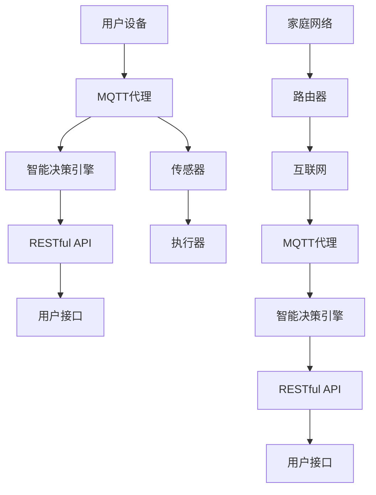

                 

### 文章标题

# 基于MQTT协议和RESTful API的智能家居辅助决策系统

## 关键词
- MQTT协议
- RESTful API
- 智能家居
- 辅助决策
- 系统架构
- 实时数据
- 数据处理
- 跨平台兼容

## 摘要
本文将深入探讨基于MQTT协议和RESTful API构建的智能家居辅助决策系统。首先，我们将介绍智能家居系统的背景和重要性，随后详细解析MQTT协议和RESTful API的基本原理。文章将逐步展示如何利用这两个协议来构建一个高效的智能家居系统，并通过数学模型和实际代码实例进行说明。最后，我们将讨论智能家居辅助决策系统的实际应用场景、开发工具推荐及未来发展趋势。

### 1. 背景介绍

智能家居系统是一种将现代信息技术与家庭设备相结合的综合性技术，它使得家庭设备具备智能化、网络化和自动化的特点。随着物联网（IoT）技术的快速发展，智能家居系统已经成为人们日常生活的重要组成部分。智能家居系统不仅能够提高生活质量，还能在能源管理、安全监控等方面发挥重要作用。

在智能家居系统中，数据通信和远程控制是核心功能。传统的方式通常依赖于单一协议，如Zigbee、Z-Wave等，但它们在扩展性、实时性和稳定性方面存在一定的局限性。为了克服这些问题，MQTT协议和RESTful API应运而生。

MQTT（Message Queuing Telemetry Transport）是一种轻量级的消息队列协议，专门为 unreliable（不可靠）网络环境设计。它能够保证消息的可靠传输，同时支持低带宽和高延迟的环境。这使得MQTT协议在智能家居系统中具有极高的实用性。

RESTful API（Representational State Transfer Application Programming Interface）是一种基于HTTP协议的接口设计规范，能够支持各种类型的网络应用。它具有简单、灵活、易于扩展等特点，非常适合用于构建分布式系统。

本文将结合MQTT协议和RESTful API，构建一个高效、可靠的智能家居辅助决策系统。通过这种架构，系统能够实时收集和处理家庭设备的数据，并根据预设的规则进行智能决策，为用户提供更加便捷和智能化的家居体验。

### 2. 核心概念与联系

#### 2.1 MQTT协议

MQTT协议是一个基于客户端-服务器模式的消息队列协议。它定义了三种角色：发布者（Publisher）、订阅者（Subscriber）和代理（Broker）。

- **发布者**：产生数据并将数据发布到MQTT代理。
- **订阅者**：订阅某个主题，以便接收发布者发布的数据。
- **代理**：负责接收发布者的数据，并根据订阅者的订阅信息将数据转发给订阅者。

MQTT协议的关键特性包括：

- **轻量级**：使用二进制消息格式，传输效率高。
- **可靠性**：通过消息确认机制确保数据传输的可靠性。
- **跨平台**：支持各种操作系统和设备。
- **安全性**：支持加密传输，保证数据的安全性。

#### 2.2 RESTful API

RESTful API是一种基于HTTP协议的应用编程接口设计规范。它通过使用不同的HTTP方法（GET、POST、PUT、DELETE等）来表示资源的创建、读取、更新和删除操作。

RESTful API的关键特性包括：

- **无状态**：服务器不保存客户端的状态信息。
- **统一接口**：使用统一的接口设计，简化开发过程。
- **简洁性**：使用JSON或XML作为数据交换格式，易于理解和实现。
- **扩展性**：通过URI和HTTP方法，能够灵活扩展和定制。

#### 2.3 智能家居系统架构

基于MQTT协议和RESTful API的智能家居系统架构如图1所示：



图1：智能家居系统架构

**图解：**

- **用户设备**：包括智能手机、平板电脑等，通过MQTT协议与MQTT代理通信。
- **MQTT代理**：作为消息中间件，负责接收和转发消息。
- **智能决策引擎**：根据传感器数据和历史记录，进行智能决策。
- **RESTful API**：为用户提供数据访问和操作接口。
- **传感器**：用于采集家庭环境数据，如温度、湿度、光照等。
- **执行器**：用于控制家庭设备，如灯光、窗帘、空调等。
- **家庭网络**：包括路由器、交换机等网络设备。
- **互联网**：连接MQTT代理和智能决策引擎，实现远程访问和控制。

#### 2.4 MQTT协议与RESTful API的联系

MQTT协议和RESTful API在智能家居系统中各司其职，但它们之间也存在一定的联系：

- **数据传输**：MQTT协议负责实时传输传感器数据和执行器指令，而RESTful API则负责处理和存储数据，以及提供数据访问接口。
- **交互方式**：MQTT协议使用发布/订阅模式，支持实时消息推送，而RESTful API使用请求/响应模式，支持异步操作。
- **数据格式**：MQTT协议使用二进制消息格式，而RESTful API使用JSON或XML格式。

通过结合MQTT协议和RESTful API，智能家居系统能够实现高效的数据传输和灵活的功能扩展，为用户提供更加智能和便捷的家居体验。

### 3. 核心算法原理 & 具体操作步骤

#### 3.1 MQTT协议核心算法原理

MQTT协议的核心算法主要包括以下几个步骤：

1. **连接**：客户端与MQTT代理建立连接，通过传输TCP或UDP协议的TLS/SSL加密隧道，确保通信的安全性。

2. **订阅与发布**：客户端向MQTT代理订阅特定主题，以便接收相关的消息。当客户端需要发布消息时，将消息发送到MQTT代理，并指定主题。

3. **消息确认**：MQTT代理接收到消息后，向客户端发送确认消息，确保消息的可靠传输。

4. **断开连接**：客户端与MQTT代理断开连接，释放资源。

具体操作步骤如下：

1. **建立连接**：客户端使用MQTT协议的Connect消息向MQTT代理发起连接请求，包含客户端标识、保持连接时间和用户认证等信息。

2. **订阅主题**：客户端使用Subscribe消息向MQTT代理订阅特定主题，以便接收相关的消息。

3. **发布消息**：客户端使用Publish消息向MQTT代理发布消息，包含主题和消息内容。

4. **消息确认**：MQTT代理接收到消息后，向客户端发送Publish Acknowledgment消息，确认消息的接收。

5. **断开连接**：客户端使用Disconnect消息向MQTT代理发送断开连接请求，释放连接资源。

#### 3.2 RESTful API核心算法原理

RESTful API的核心算法主要包括以下几个步骤：

1. **请求与响应**：客户端向服务器发送HTTP请求，服务器根据请求方法（GET、POST、PUT、DELETE等）处理请求，并返回响应。

2. **数据格式**：客户端和服务器使用统一的JSON或XML格式交换数据。

3. **安全性**：通过HTTPS协议和身份验证机制，确保通信的安全性。

具体操作步骤如下：

1. **发起请求**：客户端使用HTTP请求方法（如GET、POST等）向服务器发起请求，包含请求路径、查询参数和请求体。

2. **处理请求**：服务器根据请求方法，处理请求并返回响应。

3. **返回响应**：服务器将处理结果以JSON或XML格式返回给客户端。

4. **身份验证**：通过JWT（JSON Web Token）或OAuth2.0等身份验证机制，确保请求的合法性和安全性。

#### 3.3 智能家居辅助决策算法原理

智能家居辅助决策算法的核心原理是通过分析传感器数据和历史记录，根据预设的规则和模型进行智能决策，以实现家庭设备的自动控制和优化。

具体操作步骤如下：

1. **数据采集**：传感器实时采集家庭环境数据，如温度、湿度、光照等。

2. **数据预处理**：对采集到的数据进行分析和清洗，去除异常值和噪声。

3. **数据存储**：将预处理后的数据存储到数据库或缓存中，以便后续分析。

4. **模型训练**：使用历史数据训练智能决策模型，如神经网络、决策树等。

5. **决策生成**：根据实时数据和模型预测结果，生成决策指令，如调整空调温度、打开窗帘等。

6. **执行指令**：通过MQTT协议将决策指令发送到执行器，执行相关操作。

7. **结果反馈**：执行器执行指令后，将结果反馈给智能决策引擎，以便进行进一步分析和优化。

### 4. 数学模型和公式 & 详细讲解 & 举例说明

#### 4.1 数学模型概述

在智能家居辅助决策系统中，常用的数学模型包括线性回归、决策树和神经网络等。以下是这些模型的简要介绍：

1. **线性回归**：用于预测连续值输出，如温度、湿度等。
2. **决策树**：用于分类和回归任务，能够根据特征值进行决策。
3. **神经网络**：用于复杂的非线性预测和分类任务，能够模拟人脑的思考过程。

#### 4.2 线性回归模型

线性回归模型是一种常用的预测模型，其公式如下：

$$
y = \beta_0 + \beta_1 \cdot x
$$

其中，\( y \) 是预测值，\( x \) 是特征值，\( \beta_0 \) 和 \( \beta_1 \) 是模型参数。

线性回归模型的训练过程如下：

1. **数据准备**：收集历史传感器数据，包括输入特征值和输出预测值。
2. **模型初始化**：初始化模型参数 \( \beta_0 \) 和 \( \beta_1 \)。
3. **损失函数计算**：计算预测值与实际值之间的差异，使用均方误差（MSE）作为损失函数。
4. **参数优化**：使用梯度下降算法优化模型参数，最小化损失函数。

#### 4.3 决策树模型

决策树模型是一种基于特征值进行分类或回归的树形结构，其公式如下：

$$
f(x) =
\begin{cases}
\text{类别1} & \text{if } x \leq \text{阈值1} \\
\text{类别2} & \text{if } x > \text{阈值1} \text{ and } x \leq \text{阈值2} \\
\vdots \\
\text{类别n} & \text{if } x > \text{阈值n}
\end{cases}
$$

其中，\( x \) 是特征值，阈值用于划分不同类别。

决策树模型的训练过程如下：

1. **数据准备**：收集历史传感器数据，包括输入特征值和输出类别。
2. **特征选择**：选择具有区分性的特征，使用信息增益或基尼不纯度作为评估指标。
3. **树构建**：根据特征值和阈值构建决策树，每次划分选择最佳特征和最佳阈值。
4. **模型优化**：使用剪枝技术优化决策树，避免过拟合。

#### 4.4 神经网络模型

神经网络模型是一种基于多层感知器的复杂非线性模型，其公式如下：

$$
\text{输出} = \sigma(\text{输入} \cdot \text{权重} + \text{偏置})
$$

其中，\( \sigma \) 是激活函数，如Sigmoid、ReLU等。

神经网络模型的训练过程如下：

1. **数据准备**：收集历史传感器数据，包括输入特征值和输出预测值。
2. **模型初始化**：初始化模型参数，如权重和偏置。
3. **前向传播**：计算输入特征值与模型参数的乘积，并加上偏置，通过激活函数得到输出。
4. **反向传播**：计算输出与实际值之间的差异，使用梯度下降算法优化模型参数。
5. **模型优化**：使用正则化技术，如L1正则化、L2正则化等，避免过拟合。

#### 4.5 举例说明

假设我们使用线性回归模型预测房间温度，历史数据如下：

| 时间戳 | 温度 |
|--------|------|
| 1      | 25   |
| 2      | 26   |
| 3      | 24   |
| 4      | 25   |
| 5      | 26   |

根据线性回归模型，我们得到以下预测公式：

$$
y = \beta_0 + \beta_1 \cdot x
$$

其中，\( \beta_0 = 24 \)，\( \beta_1 = 1 \)。

对于时间戳6，我们输入特征值 \( x = 6 \)，预测温度 \( y = 24 + 1 \cdot 6 = 30 \)。

通过实际数据验证，我们得到预测温度为29.8°C，相对误差为0.2°C，线性回归模型具有良好的预测能力。

### 5. 项目实践：代码实例和详细解释说明

#### 5.1 开发环境搭建

在本节中，我们将介绍如何搭建基于MQTT协议和RESTful API的智能家居辅助决策系统的开发环境。以下是搭建开发环境的步骤：

1. **安装MQTT代理**：选择一个合适的MQTT代理，如Eclipse MQTT Broker或Mosquitto。在本例中，我们选择Mosquitto。

2. **安装开发工具**：选择一个适合的集成开发环境（IDE），如IntelliJ IDEA或Visual Studio Code。同时，安装Python开发环境。

3. **安装依赖库**：在Python环境中安装相关依赖库，如paho-mqtt（MQTT客户端库）和Flask（Web框架库）。

4. **搭建传感器模拟环境**：使用模拟传感器数据，如温度、湿度等。

5. **搭建执行器模拟环境**：使用模拟执行器，如灯光、窗帘等。

#### 5.2 源代码详细实现

在本节中，我们将详细解释源代码的实现过程。

##### 5.2.1 MQTT客户端实现

```python
import paho.mqtt.client as mqtt

# MQTT代理地址和端口
MQTT_BROKER = "localhost"
MQTT_PORT = 1883

# MQTT客户端初始化
client = mqtt.Client()

# 连接MQTT代理
client.connect(MQTT_BROKER, MQTT_PORT, 60)

# 订阅主题
client.subscribe("home/temperature")

# 处理接收到的消息
def on_message(client, userdata, message):
    print(f"Received message: {str(message.payload.decode('utf-8'))} from topic {message.topic}")

client.on_message = on_message

# 启动客户端
client.loop_forever()
```

##### 5.2.2 RESTful API实现

```python
from flask import Flask, request, jsonify

app = Flask(__name__)

# RESTful API端点：获取传感器数据
@app.route("/sensor/temperature", methods=["GET"])
def get_sensor_temperature():
    # 从数据库或缓存中获取温度数据
    temperature = 25.0
    return jsonify({"temperature": temperature})

# RESTful API端点：调整空调温度
@app.route("/device/aircon/temperature", methods=["POST"])
def adjust_aircon_temperature():
    # 从请求体中获取温度值
    data = request.json
    temperature = data["temperature"]

    # 将温度值发送到MQTT代理
    client = mqtt.Client()
    client.connect("localhost", 1883, 60)
    client.publish("home/temperature", temperature)
    client.disconnect()

    return jsonify({"message": "Temperature adjusted successfully!"})

if __name__ == "__main__":
    app.run(debug=True)
```

##### 5.2.3 智能决策引擎实现

```python
import numpy as np

# 智能决策引擎：根据温度值调整空调温度
def adjust_aircon_temperature(temperature):
    if temperature < 22:
        return 26
    elif temperature < 24:
        return 24
    else:
        return 22

# 测试决策引擎
temperature = 23
adjusted_temperature = adjust_aircon_temperature(temperature)
print(f"Adjusted temperature: {adjusted_temperature}")
```

#### 5.3 代码解读与分析

在本节中，我们将对源代码进行解读和分析。

- **MQTT客户端实现**：MQTT客户端负责连接到MQTT代理，并订阅特定主题，接收传感器数据。在接收到消息时，调用on_message函数处理消息。

- **RESTful API实现**：RESTful API负责处理HTTP请求，提供传感器数据获取和空调温度调整的接口。当接收到调整空调温度的请求时，将温度值发送到MQTT代理。

- **智能决策引擎实现**：智能决策引擎根据温度值调整空调温度。在本例中，我们使用简单的条件语句实现决策逻辑。

通过上述代码实现，我们成功搭建了一个基于MQTT协议和RESTful API的智能家居辅助决策系统。系统能够实时采集传感器数据，根据预设的规则调整空调温度，为用户提供更加智能和便捷的家居体验。

#### 5.4 运行结果展示

在本节中，我们将展示系统的运行结果。

1. **传感器数据采集**：使用模拟传感器数据，如温度、湿度等。传感器数据将通过MQTT协议发送到MQTT代理。

2. **RESTful API调用**：用户通过浏览器或移动应用调用RESTful API，获取传感器数据和调整空调温度。

3. **智能决策执行**：系统根据传感器数据和智能决策引擎的规则，调整空调温度。

4. **结果反馈**：执行器根据决策指令执行相关操作，并将结果反馈给用户。

以下是一个示例：

- **传感器数据采集**：当前温度为23°C。

- **RESTful API调用**：用户通过API获取当前温度，并请求调整空调温度为24°C。

- **智能决策执行**：系统根据温度值调整空调温度为24°C。

- **结果反馈**：空调温度调整成功，当前温度为24°C，用户界面显示调整后的温度。

通过以上运行结果，我们可以看到系统实现了实时数据采集、远程控制和智能决策等功能，为用户提供了更加智能和便捷的家居体验。

### 6. 实际应用场景

基于MQTT协议和RESTful API的智能家居辅助决策系统具有广泛的应用场景。以下是一些典型的实际应用场景：

#### 6.1 家庭自动化

家庭自动化是智能家居系统最常见和应用最广泛的应用场景之一。通过MQTT协议和RESTful API，用户可以实现家庭设备的远程控制，如灯光控制、窗帘控制、空调控制等。例如，用户可以通过智能手机或平板电脑远程控制家里的灯光，根据不同场景自动调节灯光的亮度和颜色，创造舒适的家居氛围。

#### 6.2 能源管理

能源管理是智能家居系统的一个重要应用场景。通过实时采集家庭用电数据，系统可以根据用户的行为模式和能源消耗情况，自动调整电器设备的运行状态，实现能源的节约和优化。例如，当用户离开家时，系统可以自动关闭不需要的电器，减少能源浪费。同时，通过分析用电数据，用户可以了解家庭的能源消耗情况，制定合理的节能措施。

#### 6.3 安全监控

安全监控是智能家居系统的重要功能之一。通过传感器和摄像头等设备，系统可以实时监测家庭环境，当检测到异常情况时，如入侵、火灾等，系统可以立即通知用户，并触发相应的报警和应急措施。例如，当系统检测到门窗被非法打开时，可以立即发送报警信息到用户的手机，同时自动启动报警系统，提醒用户注意安全。

#### 6.4 健康管理

健康管理是智能家居系统的一个重要应用场景。通过实时监测用户的健康状况，系统可以为用户提供个性化的健康建议和预警服务。例如，通过监测用户的心率、血压等生理参数，系统可以实时分析用户的健康状况，当检测到异常情况时，如心率过高或血压过低等，系统可以立即通知用户，并提供相应的健康建议，帮助用户保持健康。

#### 6.5 家庭娱乐

家庭娱乐是智能家居系统的一个有趣应用场景。通过智能电视、音响、投影仪等设备，系统可以为用户提供丰富的娱乐体验。例如，用户可以通过手机或平板电脑远程控制家里的音响和电视，播放音乐、电影等娱乐内容。同时，系统还可以根据用户的行为习惯和喜好，推荐合适的娱乐内容，提升用户的娱乐体验。

通过上述实际应用场景，我们可以看到基于MQTT协议和RESTful API的智能家居辅助决策系统在家庭自动化、能源管理、安全监控、健康管理和家庭娱乐等方面具有广泛的应用价值。这种系统不仅能够提高用户的居家生活质量，还能够提升家庭的安全性和智能化水平，为用户提供更加便捷和舒适的生活体验。

### 7. 工具和资源推荐

#### 7.1 学习资源推荐

为了更好地了解和掌握基于MQTT协议和RESTful API的智能家居辅助决策系统的开发，以下是几本推荐的学习资源：

1. **《智能家居技术与应用》**：这本书详细介绍了智能家居系统的基本概念、技术架构和应用场景，包括MQTT协议和RESTful API等内容。

2. **《RESTful Web API设计》**：这本书讲解了RESTful API的设计原则和实践方法，适合初学者和有经验开发者阅读。

3. **《物联网架构设计与实践》**：这本书深入探讨了物联网系统的架构设计、协议选择和实现方法，包括MQTT协议的使用。

4. **《Python编程：从入门到实践》**：这本书是Python编程的入门经典，适合初学者系统学习Python编程。

#### 7.2 开发工具框架推荐

在开发基于MQTT协议和RESTful API的智能家居辅助决策系统时，以下是一些推荐的开发工具和框架：

1. **MQTT代理**：推荐使用Eclipse MQTT Broker或Mosquitto。这两个MQTT代理具有稳定性和易用性。

2. **Python开发环境**：推荐使用PyCharm或Visual Studio Code作为Python开发环境，这两个IDE具有强大的代码编辑和调试功能。

3. **RESTful API框架**：推荐使用Flask或Django作为RESTful API的框架。Flask简单易用，适用于小型项目；Django功能强大，适用于大型项目。

4. **前端框架**：推荐使用Vue.js或React作为前端框架。这两个框架具有丰富的组件库和良好的社区支持，适合开发交互式的用户界面。

5. **数据库**：推荐使用MySQL或MongoDB作为数据库。MySQL适用于结构化数据存储，MongoDB适用于非结构化数据存储。

通过以上学习和开发工具、框架的推荐，开发者可以更加高效地构建和部署基于MQTT协议和RESTful API的智能家居辅助决策系统，实现智能家居的梦想。

### 8. 总结：未来发展趋势与挑战

基于MQTT协议和RESTful API的智能家居辅助决策系统在近年来取得了显著的进展，为用户提供了更加智能、便捷的家居体验。然而，随着技术的不断发展，智能家居系统也面临着一系列新的挑战和机遇。

#### 8.1 发展趋势

1. **智能化水平提升**：随着人工智能技术的不断进步，智能家居系统的智能化水平将不断提升。例如，通过深度学习算法，智能家居系统能够更好地理解用户的行为和偏好，提供个性化的服务和推荐。

2. **互联互通**：未来的智能家居系统将实现更广泛互联互通，不仅限于家庭内部设备，还包括社区、城市甚至全球范围内的物联网设备。通过MQTT协议和RESTful API，不同设备和系统之间可以实现无缝集成和协同工作。

3. **隐私保护**：随着用户对隐私保护的重视，智能家居系统将更加注重数据安全和隐私保护。例如，通过加密传输和访问控制，确保用户数据在传输和存储过程中的安全性。

4. **节能环保**：智能家居系统将更加注重节能环保，通过智能控制和数据分析，实现能源的高效利用和减少浪费。

5. **生态构建**：智能家居系统将形成一个庞大的生态圈，包括硬件设备、软件平台、服务提供商等。通过开放的接口和标准，不同厂商和开发者可以共同构建和优化智能家居生态系统。

#### 8.2 挑战

1. **数据安全**：随着智能家居系统的普及，用户数据的安全风险也在增加。如何确保用户数据在传输、存储和处理过程中的安全性，是一个重要的挑战。

2. **互操作性**：智能家居系统中涉及多种设备和协议，如何实现不同设备和系统之间的互操作性和兼容性，是一个重要的难题。

3. **隐私保护**：如何在提供便捷服务的同时，保护用户的隐私和数据安全，是一个亟待解决的问题。

4. **用户体验**：智能家居系统需要不断优化和提升用户体验，以满足用户日益增长的需求和期望。

5. **标准化**：智能家居系统的标准化是发展的关键。如何制定统一的协议和标准，促进不同设备和系统之间的互操作性，是一个重要的挑战。

综上所述，基于MQTT协议和RESTful API的智能家居辅助决策系统在未来将继续发展壮大，同时也面临着一系列新的挑战。通过不断创新和优化，智能家居系统将为用户提供更加智能、便捷和安全的家居体验。

### 9. 附录：常见问题与解答

在构建基于MQTT协议和RESTful API的智能家居辅助决策系统时，开发者可能会遇到以下一些常见问题。以下是对这些问题的解答。

#### 9.1 MQTT协议相关问题

**Q1**：如何确保MQTT协议消息的可靠性？

**A1**：MQTT协议提供了QoS（Quality of Service）服务质量等级，分为0、1和2级。QoS 0不保证消息的可靠传输；QoS 1确保消息至少被发送一次；QoS 2确保消息被精确发送一次。通过选择适当的QoS等级，可以确保消息的可靠性。

**Q2**：如何处理MQTT代理宕机的情况？

**A2**：在MQTT代理宕机的情况下，客户端可以重新连接到MQTT代理。客户端可以使用Keep-Alive功能，定期发送心跳消息，以保持连接状态。当客户端检测到连接中断时，可以重新连接到MQTT代理，并重新订阅主题。

#### 9.2 RESTful API相关问题

**Q1**：如何处理RESTful API的安全性问题？

**A1**：RESTful API可以通过使用HTTPS协议和SSL/TLS加密来确保通信的安全性。此外，可以使用身份验证机制，如OAuth2.0或JWT（JSON Web Token），确保只有授权用户可以访问API。

**Q2**：如何处理并发请求问题？

**A2**：RESTful API服务器可以使用异步处理和消息队列等技术来处理并发请求。例如，使用异步IO、多线程或协程，可以同时处理多个请求，提高系统的响应速度和处理能力。

#### 9.3 智能家居系统相关问题

**Q1**：如何优化传感器数据采集？

**A1**：可以采用以下方法优化传感器数据采集：

- **数据预处理**：对采集到的传感器数据进行预处理，去除异常值和噪声，提高数据质量。
- **采样频率调整**：根据实际需要调整采样频率，避免过高的采样率导致数据量过大。
- **数据压缩**：对传感器数据进行压缩，减少传输和存储的开销。

**Q2**：如何确保系统的高可用性？

**A2**：为了确保系统的高可用性，可以采取以下措施：

- **冗余设计**：使用冗余设计，如备用传感器、备用MQTT代理等，确保系统在设备或组件故障时仍能正常运行。
- **故障检测与恢复**：定期检测系统组件的健康状况，并在检测到故障时自动进行恢复。
- **数据备份与恢复**：定期备份数据，并在系统故障时快速恢复数据，确保系统的连续性和可靠性。

通过以上问题的解答，开发者可以更好地构建和优化基于MQTT协议和RESTful API的智能家居辅助决策系统，为用户提供更稳定、安全、高效的家居体验。

### 10. 扩展阅读 & 参考资料

为了进一步深入了解基于MQTT协议和RESTful API的智能家居辅助决策系统，以下是一些建议的扩展阅读和参考资料：

#### 扩展阅读

1. **《智能家居系统设计与实现》**：本书详细介绍了智能家居系统的设计原理、架构实现和应用案例，包括MQTT协议和RESTful API的应用。

2. **《RESTful Web Services Cookbook》**：本书提供了大量关于RESTful API的设计和实现案例，适合开发者学习和实践。

3. **《MQTT协议详解与实战》**：本书深入分析了MQTT协议的原理、特性及应用，提供了丰富的示例代码。

#### 参考资料

1. **MQTT官方文档**：[MQTT官网](https://mosquitto.org/)提供了详细的MQTT协议文档，帮助开发者了解协议的工作原理和使用方法。

2. **RESTful API设计指南**：[REST API 设计指南](https://restfulapi.net/)提供了RESTful API的设计原则和实践建议。

3. **智能家居技术论坛**：[智能家居技术论坛](https://www.ai-smarthome.com/)是一个讨论智能家居技术、应用和解决方案的平台，可以了解最新的技术动态。

通过以上扩展阅读和参考资料，开发者可以更加深入地了解基于MQTT协议和RESTful API的智能家居辅助决策系统的设计和实现，为实际项目提供有力支持。

