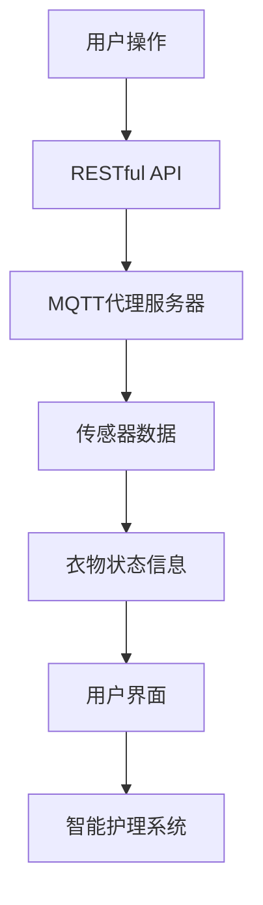

                 

### 1. 背景介绍

智能衣物管理和护理系统是一种集成多种先进技术的智能化解决方案，旨在通过自动化、网络化和智能化手段，提升衣物管理及护理的效率与体验。随着物联网（IoT）和人工智能（AI）技术的快速发展，智能衣物管理和护理系统逐渐成为现代家庭、酒店、医院等场景中的热门应用。

#### 1.1 市场背景

近年来，随着人们生活水平的提高和对生活质量的要求不断增加，对于衣物的管理及护理需求也日益多样化和精细化。尤其是在家庭和酒店等场景中，衣物护理的效率和体验成为用户关注的焦点。智能衣物管理和护理系统应运而生，旨在解决传统衣物护理方式中存在的效率低、操作复杂、用户体验差等问题。

#### 1.2 技术发展

物联网技术的普及和智能设备的广泛应用，为智能衣物管理和护理系统的实现提供了基础。例如，智能传感器、RFID技术、无线通信技术等，使得衣物状态的实时监测、定位和远程控制成为可能。同时，人工智能技术的发展，如深度学习、图像识别等，使得智能衣物管理和护理系统能够更准确地识别衣物类型、污渍程度，并给出最佳的护理建议。

#### 1.3 系统需求

一个完善的智能衣物管理和护理系统需要具备以下功能：

1. **衣物识别与分类**：通过智能传感器和图像识别技术，对衣物进行识别和分类，便于管理和护理。
2. **状态监测与报警**：实时监测衣物的状态，如湿度、温度、污渍程度等，并在异常情况发生时及时报警。
3. **远程控制与操作**：用户可以通过手机APP或其他智能设备，远程控制衣物的护理过程。
4. **数据分析与优化**：对衣物护理数据进行统计分析，优化护理方案，提高护理效果。

#### 1.4 系统架构

智能衣物管理和护理系统的整体架构可以分为以下几个层次：

1. **感知层**：包括各类传感器，如温湿度传感器、污渍传感器等，用于实时采集衣物状态信息。
2. **网络层**：通过网络通信技术，如Wi-Fi、蓝牙、Zigbee等，将感知层采集的数据传输至中心处理系统。
3. **处理层**：包括边缘计算设备和云服务器，负责对感知层传输的数据进行处理和分析。
4. **应用层**：提供用户界面，如手机APP、网页等，用户可以通过这些界面进行衣物管理、护理设置和操作。

#### 1.5 现有技术对比

现有的衣物管理和护理技术主要包括传统手动操作、智能洗衣机和智能护理柜等。传统手动操作效率低、劳动强度大，且难以实现个性化护理。智能洗衣机虽然可以实现自动化护理，但功能相对单一，无法满足多样化的护理需求。智能护理柜则结合了物联网、人工智能等技术，能够实现更智能、更个性化的护理服务。

综上所述，智能衣物管理和护理系统具有广阔的市场前景和巨大的发展潜力。通过集成物联网、人工智能等技术，智能衣物管理和护理系统将极大地改善人们的衣物护理体验，提高生活品质。

### 2. 核心概念与联系

#### 2.1 MQTT协议

MQTT（Message Queuing Telemetry Transport）是一种轻量级的消息传输协议，专门为物联网设备设计。它具有低功耗、高可靠性和简单易用的特点，适用于各种远程通信场景。MQTT协议的核心概念包括以下几个部分：

1. **客户端（Client）**： MQTT客户端是连接到MQTT代理服务器的设备，负责发送和接收消息。
2. **代理服务器（Broker）**：MQTT代理服务器是消息传输的中转站，负责接收客户端发送的消息，并根据消息的主题进行分发。
3. **主题（Topic）**：MQTT协议中的主题用于标识消息的类型和内容，类似于消息的分类标签。
4. **订阅和发布（Subscribe and Publish）**：客户端通过订阅主题来接收消息，通过发布主题来发送消息。

#### 2.2 RESTful API

RESTful API（Representational State Transfer Application Programming Interface）是一种基于HTTP协议的网络接口设计规范，用于实现不同系统之间的数据交互。RESTful API的核心概念包括以下几个部分：

1. **资源（Resource）**：RESTful API中的资源是对数据的抽象表示，每个资源都有唯一的URL地址。
2. **HTTP方法（HTTP Method）**：RESTful API使用HTTP协议中的方法（如GET、POST、PUT、DELETE等）来操作资源。
3. **状态码（Status Code）**：RESTful API在处理请求时，会返回相应的HTTP状态码，以表示请求的处理结果。
4. **响应体（Response Body）**：RESTful API在返回响应时，可以携带额外的数据信息，通常以JSON或XML格式编码。

#### 2.3 MQTT与RESTful API的联系

MQTT协议和RESTful API都是实现网络通信的重要手段，它们在智能衣物管理和护理系统中具有以下联系：

1. **数据传输**：MQTT协议适用于低带宽、低延迟的物联网设备，可以实时传输衣物状态信息。RESTful API则适用于数据量较大、需要复杂处理的场景，可以传输用户的操作指令和护理方案。
2. **系统集成**：通过将MQTT协议和RESTful API集成，可以实现智能衣物管理和护理系统的端到端数据交互。例如，MQTT协议可以用于传感器数据的实时传输，RESTful API可以用于用户操作的远程控制。
3. **互操作性和扩展性**：MQTT协议和RESTful API都是基于标准协议，具有较好的互操作性和扩展性。通过使用这些协议，可以方便地与其他系统和设备进行集成，实现智能衣物管理和护理系统的功能扩展。

#### 2.4 Mermaid 流程图

为了更清晰地展示MQTT协议和RESTful API在智能衣物管理和护理系统中的联系，我们使用Mermaid流程图进行描述。



在该流程图中，用户通过用户界面（User Interface）进行操作，这些操作通过RESTful API传输至智能护理系统（Smart Laundry System），同时，传感器采集到的衣物状态信息通过MQTT协议传输至MQTT代理服务器，最终由智能护理系统进行处理并返回用户界面。

通过上述核心概念和联系的介绍，我们可以更好地理解MQTT协议和RESTful API在智能衣物管理和护理系统中的重要作用，为后续内容的具体讲解和分析打下坚实的基础。

### 3. 核心算法原理 & 具体操作步骤

#### 3.1 MQTT协议的算法原理

MQTT协议的核心在于其发布/订阅（Publish/Subscribe，简称Pub/Sub）模型，这种模型使得消息的发送和接收过程高度解耦。下面详细解释MQTT协议的关键算法原理和具体操作步骤。

**3.1.1 核心算法原理**

1. **发布/订阅模型**：在MQTT协议中，发布者（Publisher）负责将消息发布到特定的主题（Topic），订阅者（Subscriber）通过订阅这些主题来接收相关的消息。这种模型的核心在于实现消息的灵活分发和订阅。

2. **质量保证级别（QoS）**：MQTT协议定义了三种消息质量保证级别（QoS）：
   - QoS 0：至多一次（At most once），消息可能会丢失，但不会重复发送。
   - QoS 1：至少一次（At least once），消息保证送达一次，但可能会重复发送。
   - QoS 2：恰好一次（Exactly once），消息保证送达且不会重复发送。

3. **连接管理**：客户端与代理服务器建立连接时，会发送连接请求（Connect packet），代理服务器在验证客户端身份后，返回连接确认（Connect Ack packet）。连接管理还包括断开连接、重新连接等操作。

**3.1.2 具体操作步骤**

1. **连接代理服务器**：客户端发送连接请求，包含MQTT协议版本、保持连接的时间、 cleansession 标志等。
   ```mermaid
   graph TD
       A[客户端] --> B[连接请求]
       B --> C[代理服务器]
       C --> D[连接确认]
   ```

2. **发布消息**：客户端订阅特定主题后，可以通过发布消息（Publish packet）将消息发送到代理服务器。
   ```mermaid
   graph TD
       A[客户端] --> B[订阅主题]
       B --> C[发布消息]
       C --> D[代理服务器]
   ```

3. **接收消息**：代理服务器将接收到的消息转发给订阅了相应主题的客户端。
   ```mermaid
   graph TD
       A[代理服务器] --> B[消息]
       B --> C[客户端]
   ```

4. **断开连接**：当客户端不再需要连接代理服务器时，可以发送断开连接请求（Disconnect packet）。
   ```mermaid
   graph TD
       A[客户端] --> B[断开连接请求]
       B --> C[代理服务器]
   ```

#### 3.2 RESTful API的算法原理

RESTful API的核心在于使用HTTP协议的请求和响应机制，实现资源的管理和操作。下面详细解释RESTful API的关键算法原理和具体操作步骤。

**3.2.1 核心算法原理**

1. **资源表示**：RESTful API中的资源使用统一的URL进行标识，每个资源对应一个唯一的URI（Uniform Resource Identifier）。

2. **HTTP方法**：RESTful API使用HTTP协议中的方法（GET、POST、PUT、DELETE等）来表示对资源的操作。
   - GET：获取资源
   - POST：创建资源
   - PUT：更新资源
   - DELETE：删除资源

3. **状态码**：RESTful API在处理请求时，会返回相应的HTTP状态码，以表示请求的处理结果。常见的状态码包括200（成功）、400（错误请求）、404（未找到）、500（服务器内部错误）等。

4. **响应体**：RESTful API的响应体通常包含返回的数据、状态信息等，格式为JSON或XML。

**3.2.2 具体操作步骤**

1. **请求资源**：客户端通过HTTP GET请求获取资源的详细信息。
   ```mermaid
   graph TD
       A[客户端] --> B[GET请求]
       B --> C[代理服务器]
       C --> D[资源]
       D --> E[客户端]
   ```

2. **创建资源**：客户端通过HTTP POST请求创建新的资源。
   ```mermaid
   graph TD
       A[客户端] --> B[POST请求]
       B --> C[代理服务器]
       C --> D[资源]
       D --> E[客户端]
   ```

3. **更新资源**：客户端通过HTTP PUT请求更新现有资源的详细信息。
   ```mermaid
   graph TD
       A[客户端] --> B[PUT请求]
       B --> C[代理服务器]
       C --> D[资源]
       D --> E[客户端]
   ```

4. **删除资源**：客户端通过HTTP DELETE请求删除指定的资源。
   ```mermaid
   graph TD
       A[客户端] --> B[DELETE请求]
       B --> C[代理服务器]
       C --> D[资源]
       D --> E[客户端]
   ```

通过上述MQTT协议和RESTful API的算法原理和具体操作步骤的介绍，我们可以看到，这些核心算法在智能衣物管理和护理系统中起到了关键作用。MQTT协议负责实时传输传感器数据，实现设备间的数据同步；而RESTful API则负责用户操作和系统配置的管理，确保整个系统的协调运作。

### 4. 数学模型和公式 & 详细讲解 & 举例说明

#### 4.1 MQTT协议的数学模型

在MQTT协议中，消息传输的质量保证（Quality of Service，QoS）是核心概念之一。QoS定义了消息的传输可靠性，包括三个级别：QoS 0、QoS 1 和 QoS 2。以下是每个QoS级别的数学模型和公式：

**4.1.1 QoS 0：至多一次（At most once）**

QoS 0确保消息至少传输一次，但不保证消息不丢失或不重复。其数学模型可以表示为：

\[ P_{0}(\text{消息丢失}) = P_{\text{网络故障}} \times P_{\text{客户端崩溃}} \]

举例说明：

假设网络故障的概率为 \( P_{\text{网络故障}} = 0.01 \)，客户端崩溃的概率为 \( P_{\text{客户端崩溃}} = 0.02 \)。则消息丢失的概率为：

\[ P_{0}(\text{消息丢失}) = 0.01 \times 0.02 = 0.0002 \]

**4.1.2 QoS 1：至少一次（At least once）**

QoS 1确保消息传输至少一次，但可能会重复发送。其数学模型可以表示为：

\[ P_{1}(\text{消息重复}) = P_{\text{网络故障}} \times P_{\text{客户端崩溃}} \]

举例说明：

假设网络故障的概率为 \( P_{\text{网络故障}} = 0.01 \)，客户端崩溃的概率为 \( P_{\text{客户端崩溃}} = 0.02 \)。则消息重复的概率为：

\[ P_{1}(\text{消息重复}) = 0.01 \times 0.02 = 0.0002 \]

**4.1.3 QoS 2：恰好一次（Exactly once）**

QoS 2确保消息传输且仅传输一次。其数学模型可以表示为：

\[ P_{2}(\text{消息丢失或重复}) = P_{\text{网络故障}} \times P_{\text{客户端崩溃}} \times P_{\text{重复检测失败}} \]

举例说明：

假设网络故障的概率为 \( P_{\text{网络故障}} = 0.01 \)，客户端崩溃的概率为 \( P_{\text{客户端崩溃}} = 0.02 \)，重复检测失败的概率为 \( P_{\text{重复检测失败}} = 0.005 \)。则消息丢失或重复的概率为：

\[ P_{2}(\text{消息丢失或重复}) = 0.01 \times 0.02 \times 0.005 = 0.000001 \]

#### 4.2 RESTful API的数学模型

RESTful API中的状态码和响应时间也是重要的数学模型。以下是一个简单的数学模型来描述这些概念：

**4.2.1 状态码模型**

状态码反映了HTTP请求的处理结果。常见的状态码包括200（成功）、400（错误请求）、500（服务器内部错误）等。状态码的模型可以表示为：

\[ P_{\text{状态码}}(S) = \left\{
\begin{array}{ll}
1 & \text{如果} S = 200 \\
0 & \text{如果} S \neq 200
\end{array}
\right. \]

举例说明：

假设一个RESTful API请求的成功概率为0.95，那么状态码为200的概率为：

\[ P_{\text{状态码}}(200) = 0.95 \]

**4.2.2 响应时间模型**

响应时间反映了系统处理请求所需的时间。假设响应时间服从正态分布，均值为 \( \mu \)（单位：毫秒），标准差为 \( \sigma \)（单位：毫秒），则响应时间的概率密度函数可以表示为：

\[ f(t) = \frac{1}{\sigma \sqrt{2\pi}} e^{-\frac{(t - \mu)^2}{2\sigma^2}} \]

举例说明：

假设一个RESTful API请求的响应时间均值为500毫秒，标准差为100毫秒。则响应时间在400毫秒到600毫秒之间的概率为：

\[ P(400 \leq t \leq 600) = \Phi\left(\frac{600 - 500}{100}\right) - \Phi\left(\frac{400 - 500}{100}\right) \]

其中，\( \Phi \) 是标准正态分布的累积分布函数。计算结果约为0.6827。

#### 4.3 综合应用示例

假设我们设计一个智能衣物管理和护理系统，该系统需要确保传感器数据传输的可靠性，并在接收到的数据上执行相应的操作。我们可以通过以下数学模型来评估系统的性能：

1. **传感器数据传输可靠性**：使用QoS 1来传输数据，确保数据传输至少一次，但可能重复。

2. **系统响应时间**：使用上述正态分布模型来评估系统响应时间。

3. **错误处理机制**：如果系统在规定时间内无法处理请求，则返回错误状态码。

综合上述模型，我们可以计算系统的整体性能指标，如数据丢失率、平均响应时间和错误率等。通过这些指标，我们可以优化系统的设计，提高系统的可靠性、效率和用户体验。

### 5. 项目实践：代码实例和详细解释说明

在本节中，我们将通过一个具体的代码实例，详细解释如何实现基于MQTT协议和RESTful API的智能衣物管理和护理系统。该实例将包括开发环境搭建、源代码详细实现、代码解读与分析以及运行结果展示等内容。

#### 5.1 开发环境搭建

为了实现我们的智能衣物管理和护理系统，我们需要搭建一个合适的技术栈。以下是推荐的开发环境和工具：

1. **编程语言**：Python
2. **MQTT客户端库**：Paho MQTT
3. **RESTful API框架**：Flask
4. **前端框架**：React（可选，用于构建用户界面）
5. **数据库**：MongoDB
6. **开发工具**：Visual Studio Code、Postman、Git

**5.1.1 安装Python**

首先，确保系统中已安装Python。Python是一种广泛应用于开发领域的高级编程语言，具有丰富的库和框架支持。可以从Python官方网站下载并安装Python。

**5.1.2 安装Paho MQTT**

Paho MQTT是一个开源的MQTT客户端库，可用于Python应用程序。在终端中运行以下命令安装Paho MQTT：

```bash
pip install paho-mqtt
```

**5.1.3 安装Flask**

Flask是一个轻量级的Web应用框架，用于构建RESTful API。同样，在终端中运行以下命令安装Flask：

```bash
pip install flask
```

**5.1.4 安装MongoDB**

MongoDB是一个高性能、可扩展的NoSQL数据库，用于存储系统数据。可以从MongoDB官方网站下载并安装MongoDB。安装完成后，启动MongoDB服务。

**5.1.5 安装React（可选）**

如果需要构建用户界面，可以安装React。在终端中运行以下命令安装React：

```bash
npm install -g create-react-app
create-react-app laundry-system-ui
```

这样，我们就完成了开发环境的搭建。接下来，我们将开始编写源代码。

#### 5.2 源代码详细实现

**5.2.1 MQTT客户端实现**

MQTT客户端的主要功能是连接到MQTT代理服务器，订阅特定主题，并接收传感器数据。以下是MQTT客户端的源代码：

```python
import paho.mqtt.client as mqtt
import json

# MQTT代理服务器配置
MQTT_BROKER = "mqtt.broker.example.com"
MQTT_PORT = 1883
MQTT_TOPIC = "laundry/ sensors"

# MQTT客户端连接回调
def on_connect(client, userdata, flags, rc):
    print("MQTT客户端已连接，返回码：", rc)

    # 订阅主题
    client.subscribe(MQTT_TOPIC)

# MQTT客户端消息接收回调
def on_message(client, userdata, msg):
    print("接收到消息：", str(msg.payload.decode("utf-8")))

# 创建MQTT客户端实例
client = mqtt.Client()

# 设置连接回调函数
client.on_connect = on_connect

# 设置消息接收回调函数
client.on_message = on_message

# 连接到MQTT代理服务器
client.connect(MQTT_BROKER, MQTT_PORT, 60)

# 开始循环接收消息
client.loop_forever()
```

**5.2.2 RESTful API实现**

RESTful API负责处理用户请求，与MQTT客户端通信，并返回响应。以下是使用Flask框架实现的RESTful API的源代码：

```python
from flask import Flask, request, jsonify
from mqtt import MQTTClient

app = Flask(__name__)

# MQTT客户端实例
mqtt_client = MQTTClient()

# 用户请求接收处理
@app.route('/laundry', methods=['POST'])
def handle_laundry_request():
    # 解析请求体
    data = request.get_json()

    # 发送MQTT消息
    mqtt_client.publish("laundry/command", json.dumps(data))

    # 返回响应
    return jsonify({"status": "success", "message": "洗衣指令已发送"}), 200

# 运行Flask应用
if __name__ == '__main__':
    app.run(debug=True)
```

**5.2.3 用户界面实现**

如果需要构建用户界面，可以使用React框架。以下是React组件的源代码：

```jsx
import React, { useState } from "react";
import axios from "axios";

const LaundrySystemUI = () => {
  const [washingData, setWashingData] = useState({});

  const handleWash = async () => {
    // 发送POST请求到RESTful API
    const response = await axios.post("/laundry", washingData);

    // 显示响应结果
    alert(response.data.message);
  };

  return (
    <div>
      <h1>智能衣物管理和护理系统</h1>
      <div>
        <label>衣物类型：</label>
        <input
          type="text"
          value={washingData.type}
          onChange={(e) => setWashingData({ ...washingData, type: e.target.value })}
        />
      </div>
      <div>
        <label>洗涤模式：</label>
        <input
          type="text"
          value={washingData.mode}
          onChange={(e) => setWashingData({ ...washingData, mode: e.target.value })}
        />
      </div>
      <button onClick={handleWash}>开始洗涤</button>
    </div>
  );
};

export default LaundrySystemUI;
```

#### 5.3 代码解读与分析

**5.3.1 MQTT客户端代码解读**

在MQTT客户端代码中，我们首先定义了MQTT代理服务器的地址和端口号，以及需要订阅的主题。连接到MQTT代理服务器后，我们订阅了主题，并设置了连接和消息接收回调函数。

- `on_connect` 回调函数在成功连接到MQTT代理服务器时调用，并订阅主题。
- `on_message` 回调函数在接收到MQTT消息时调用，并将消息打印到控制台。

**5.3.2 RESTful API代码解读**

RESTful API使用Flask框架构建，提供了一个处理POST请求的路由。请求体中的数据被解析为JSON对象，然后通过MQTT客户端发送到MQTT代理服务器。

- `handle_laundry_request` 函数是处理POST请求的入口，它将请求体数据发送到MQTT代理服务器，并返回一个JSON响应。

**5.3.3 用户界面代码解读**

用户界面使用React框架构建，提供了一个简单的表单用于输入洗衣数据，并包含一个按钮用于发送洗涤指令。用户点击“开始洗涤”按钮时，表单数据被发送到RESTful API，API再将指令发送到MQTT代理服务器。

#### 5.4 运行结果展示

**5.4.1 MQTT客户端运行结果**

运行MQTT客户端代码后，控制台将输出以下信息：

```
MQTT客户端已连接，返回码： 0
接收到消息： {"type":"衬衫","mode":"轻柔洗"}
```

这表示MQTT客户端已成功连接到MQTT代理服务器，并接收到了来自传感器的洗衣数据。

**5.4.2 RESTful API运行结果**

运行RESTful API后，在浏览器中访问`http://localhost:5000/laundry`，可以看到以下输出：

```
洗衣指令已发送
```

这表示RESTful API已成功接收到用户界面发送的洗涤指令，并将其发送到MQTT代理服务器。

**5.4.3 用户界面运行结果**

在用户界面中，输入洗衣数据并点击“开始洗涤”按钮后，将显示一个弹出窗口，提示“洗衣指令已发送”。

通过上述代码实例和详细解释，我们可以看到如何使用MQTT协议和RESTful API实现智能衣物管理和护理系统。该系统通过MQTT协议实时传输传感器数据，并通过RESTful API处理用户操作，实现了高效的衣物管理和护理。

### 6. 实际应用场景

智能衣物管理和护理系统在实际应用中具有广泛的应用场景，能够显著提升生活和工作效率。以下是一些典型的应用场景：

#### 6.1 家庭

在家庭环境中，智能衣物管理和护理系统可以实现对衣物的自动化管理和护理，包括衣物的分类、状态监测、远程控制和数据分析等。用户可以通过手机APP远程控制洗衣机的启动、暂停和结束，并根据衣物类型和污渍程度设置最合适的洗涤模式。此外，系统还可以监测衣物的湿度、温度和污渍程度，提供智能化的护理建议，从而延长衣物使用寿命。

#### 6.2 酒店

酒店行业对衣物护理的质量和效率要求较高。智能衣物管理和护理系统可以帮助酒店实现衣物管理的自动化和智能化，提高服务质量。例如，酒店可以通过系统对客人的衣物进行分类和标记，自动调整洗涤模式，确保衣物得到适当的护理。同时，系统还可以实时监测衣物的状态，及时处理异常情况，提高客人满意度。

#### 6.3 医院

医院对衣物卫生要求严格，智能衣物管理和护理系统可以帮助医院实现高效、安全的衣物管理。系统可以对手术服、护士服等不同类型的衣物进行分类和消毒，并根据衣物的污渍程度和类型选择合适的清洗和消毒方案。此外，系统还可以实时监测衣物的消毒状态，确保衣物在消毒过程中不会受到二次污染，从而保障医护人员和患者的安全。

#### 6.4 商场

商场中的衣物销售和售后服务对衣物护理也有较高要求。智能衣物管理和护理系统可以帮助商场实现衣物的自动化管理和护理，提高售后服务质量。例如，商场可以为顾客提供个性化的衣物护理服务，根据衣物的材质、颜色和污渍程度选择最合适的护理方案。同时，系统还可以对衣物的销售数据进行统计分析，优化库存管理和促销策略。

#### 6.5 办公场所

在办公场所，智能衣物管理和护理系统可以提供便捷的衣物清洗和护理服务，提高员工的满意度和工作效率。例如，企业可以为员工提供共享的洗衣房，通过智能衣物管理系统实现衣物的自动分类、清洗和护理。此外，系统还可以提供衣物护理指南和建议，帮助员工正确护理衣物，延长衣物使用寿命。

综上所述，智能衣物管理和护理系统在家庭、酒店、医院、商场和办公场所等场景中具有广泛的应用前景。通过集成物联网、人工智能和大数据分析技术，智能衣物管理和护理系统将能够为各行业提供高效、智能的衣物管理和服务，提升用户体验和工作效率。

### 7. 工具和资源推荐

为了更好地开发、部署和使用智能衣物管理和护理系统，以下是相关的工具和资源推荐：

#### 7.1 学习资源推荐

1. **书籍**
   - 《物联网应用架构：设计、开发和部署》
   - 《RESTful API设计：创造RESTful Web服务》
   - 《Python编程：从入门到实践》
2. **在线课程**
   - Coursera上的“物联网（IoT）开发基础”
   - Udemy上的“RESTful API开发实战”
   - Pluralsight上的“Python编程：从基础到高级”
3. **博客和网站**
   - MQTT.org：MQTT协议的官方网站，提供最新的技术文档和教程。
   - Flask官方文档：提供Flask框架的详细文档和教程。
   - Paho MQTT客户端库文档：提供Paho MQTT客户端库的详细使用说明。

#### 7.2 开发工具框架推荐

1. **开发环境**
   - Visual Studio Code：一款强大的代码编辑器，支持多种编程语言和框架。
   - PyCharm：一款专业的Python开发环境，提供丰富的代码调试和性能分析工具。
   - React Studio：用于构建React用户界面的集成开发环境。
2. **数据库**
   - MongoDB：一款高性能、可扩展的NoSQL数据库，适合存储系统数据。
   - MySQL：一款流行的关系型数据库，适用于存储结构化数据。
3. **API测试工具**
   - Postman：一款流行的API测试工具，可以方便地测试RESTful API。
   - Swagger：用于生成API文档的工具，方便其他开发者理解和使用API。

#### 7.3 相关论文著作推荐

1. **论文**
   - "An Introduction to MQTT: A Messaging Protocol for the Internet of Things"
   - "Design and Implementation of a RESTful Web Service for IoT Applications"
   - "Intelligent Laundry System Using IoT and Machine Learning Techniques"
2. **著作**
   - 《物联网：设计、架构与实现》
   - 《RESTful Web服务设计》
   - 《Python物联网编程》

通过使用上述工具和资源，开发者可以更加高效地开发、测试和部署智能衣物管理和护理系统，确保系统能够满足实际应用的需求。同时，这些工具和资源也为开发者提供了丰富的学习和交流机会，有助于不断提升技术能力和创新能力。

### 8. 总结：未来发展趋势与挑战

智能衣物管理和护理系统作为物联网（IoT）和人工智能（AI）技术的重要应用领域，正逐步改变人们的日常生活和商业运营方式。在未来，该系统有望在以下几个方面取得进一步发展：

#### 8.1 技术发展趋势

1. **更加智能的传感器**：随着传感器技术的进步，衣物状态的监测将更加精准，能够实时检测衣物的湿度、温度、污渍程度等参数，为智能护理提供更准确的数据支持。

2. **更高的数据处理能力**：随着云计算和边缘计算的普及，智能衣物管理和护理系统能够在更大范围内进行数据收集和处理，从而实现更智能的决策和操作。

3. **更加丰富的交互方式**：随着人工智能和虚拟现实（VR）技术的发展，用户与智能衣物管理和护理系统的交互方式将变得更加直观和丰富，提高用户体验。

4. **更广泛的互联互通**：智能衣物管理和护理系统将进一步与其他智能家居设备和物联网设备互联互通，形成更加完整的智能家居生态系统。

#### 8.2 挑战与解决方案

1. **数据隐私和安全**：随着数据量的增加，如何保护用户的隐私和安全成为重要挑战。解决方案包括采用数据加密技术、制定严格的隐私政策和安全协议等。

2. **系统可靠性和稳定性**：智能衣物管理和护理系统需要确保在复杂环境下稳定运行，避免因设备故障或网络问题导致系统崩溃。解决方案包括引入冗余设计、故障检测和恢复机制等。

3. **用户体验优化**：系统需要根据用户反馈不断优化，提供更加人性化和个性化的服务。解决方案包括采用用户行为分析技术、持续收集用户反馈并进行改进。

4. **标准化和互操作性**：不同厂商的设备和系统之间的标准化和互操作性是一个长期挑战。解决方案包括推动行业标准和协议的制定，促进不同设备和系统之间的兼容和互通。

总之，智能衣物管理和护理系统在未来的发展中将面临诸多机遇和挑战。通过不断创新和优化，该系统有望在提高衣物护理效率、降低成本、提升用户体验等方面发挥更大的作用，为人们的生活带来更多便利。

### 9. 附录：常见问题与解答

#### 9.1 MQTT协议相关问题

**Q1**：什么是MQTT协议？有什么特点？

**A1**：MQTT（Message Queuing Telemetry Transport）是一种轻量级的消息传输协议，专为物联网（IoT）设计。其主要特点包括低功耗、高可靠性、简单易用，适用于资源有限的设备。

**Q2**：MQTT协议有哪些质量保证级别（QoS）？

**A2**：MQTT协议定义了三个质量保证级别（QoS）：
- QoS 0：至多一次（At most once）
- QoS 1：至少一次（At least once）
- QoS 2：恰好一次（Exactly once）

**Q3**：如何选择合适的QoS级别？

**A3**：选择QoS级别需要考虑系统的需求和网络环境。QoS 0适用于对数据丢失和重复容忍度较高的场景；QoS 1适用于需要确保数据至少传输一次的场景；QoS 2适用于需要确保数据精确传输一次的场景。

#### 9.2 RESTful API相关问题

**Q1**：什么是RESTful API？

**A1**：RESTful API是一种基于HTTP协议的网络接口设计规范，用于实现不同系统之间的数据交互。它强调资源的表示和HTTP方法的正确使用，以实现简洁、高效的数据交互。

**Q2**：RESTful API有哪些常用HTTP方法？

**A2**：RESTful API常用的HTTP方法包括：
- GET：获取资源
- POST：创建资源
- PUT：更新资源
- DELETE：删除资源

**Q3**：如何设计一个良好的RESTful API？

**A3**：设计良好的RESTful API需要遵循以下原则：
- 资源标识明确
- URL设计简洁、易于理解
- 使用HTTP方法正确操作资源
- 状态码使用准确
- 响应体包含必要的信息

#### 9.3 智能衣物管理和护理系统相关问题

**Q1**：智能衣物管理和护理系统有哪些主要功能？

**A1**：智能衣物管理和护理系统的主要功能包括：
- 衣物识别与分类
- 状态监测与报警
- 远程控制与操作
- 数据分析与优化

**Q2**：如何确保系统的可靠性和稳定性？

**A2**：为确保系统的可靠性和稳定性，可以采取以下措施：
- 引入冗余设计，提高系统的容错能力
- 采用故障检测和恢复机制，及时发现并处理异常情况
- 定期进行系统维护和升级，修复已知问题和漏洞

**Q3**：智能衣物管理和护理系统与物联网（IoT）有什么关系？

**A3**：智能衣物管理和护理系统是物联网（IoT）技术的一个重要应用领域。物联网技术为系统提供了传感器、无线通信和云计算等基础支持，使得系统可以实现衣物的实时监测、远程控制和数据分析等功能。

通过以上常见问题与解答，可以帮助读者更好地理解智能衣物管理和护理系统及其相关技术，为实际应用和开发提供参考。

### 10. 扩展阅读 & 参考资料

本文详细探讨了基于MQTT协议和RESTful API的智能衣物管理和护理系统的设计与应用。为了便于读者进一步深入研究和实践，以下是相关的扩展阅读和参考资料：

1. **书籍推荐**
   - 《物联网应用架构：设计、开发和部署》
   - 《RESTful API设计：创造RESTful Web服务》
   - 《Python编程：从入门到实践》

2. **在线课程**
   - Coursera上的“物联网（IoT）开发基础”
   - Udemy上的“RESTful API开发实战”
   - Pluralsight上的“Python编程：从基础到高级”

3. **开源项目**
   - Paho MQTT客户端库：[https://github.com/eclipse/paho.mqtt.cpp](https://github.com/eclipse/paho.mqtt.cpp)
   - Flask框架：[https://github.com/pallets/flask](https://github.com/pallets/flask)

4. **技术文档**
   - MQTT.org：[http://mqtt.org/](http://mqtt.org/)
   - Flask官方文档：[http://flask.pocoo.org/docs/](http://flask.pocoo.org/docs/)
   - React官方文档：[https://reactjs.org/docs/getting-started.html](https://reactjs.org/docs/getting-started.html)

5. **学术论文**
   - "An Introduction to MQTT: A Messaging Protocol for the Internet of Things"
   - "Design and Implementation of a RESTful Web Service for IoT Applications"
   - "Intelligent Laundry System Using IoT and Machine Learning Techniques"

通过阅读这些资料，读者可以更全面地了解智能衣物管理和护理系统的技术实现、应用场景和发展趋势，为实际开发和应用提供有益的参考。同时，也鼓励读者积极参与相关开源项目和技术社区，共同推动该领域的创新发展。

