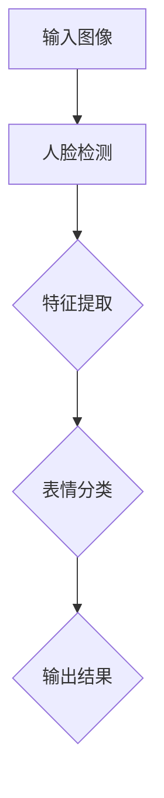
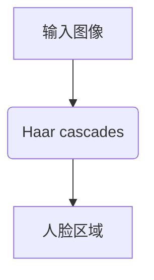
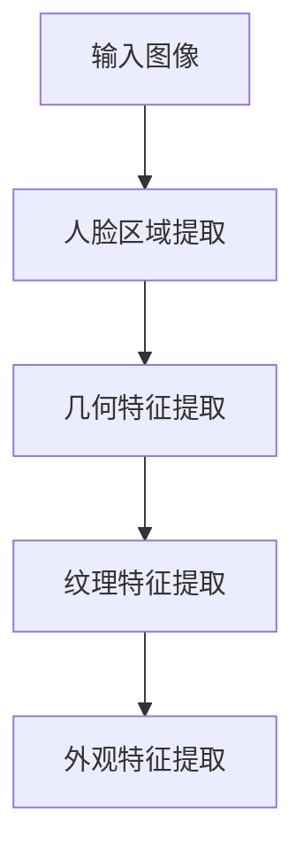
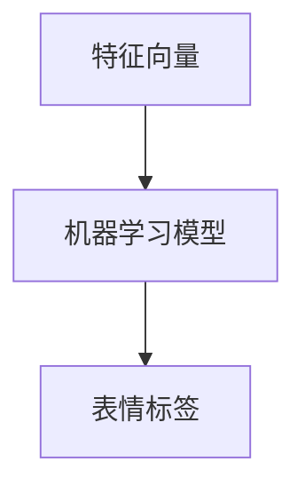

                 

### 背景介绍

随着人工智能技术的飞速发展，计算机视觉领域取得了显著的进步。其中，人脸表情识别技术作为计算机视觉的一个重要分支，引起了广泛的关注。人脸表情识别技术在很多领域都有着广泛的应用，例如安防监控、人机交互、心理健康诊断等。

OpenCV（Open Source Computer Vision Library）是一个开源的计算机视觉库，它提供了丰富的图像处理和计算机视觉算法，被广泛应用于各种计算机视觉项目中。OpenCV 的跨平台特性和高效性能，使得它成为开发人脸表情识别系统的不二之选。

人脸表情识别系统的核心在于如何有效地从图像中提取出人脸表情的特征，并对这些特征进行识别。传统的特征提取方法主要包括基于几何特征、基于纹理特征和基于外观特征等方法。然而，这些方法往往存在一定的局限性，难以满足实时性和准确性的要求。

近年来，随着深度学习技术的发展，基于深度学习的人脸表情识别方法逐渐成为研究的热点。深度学习模型可以通过学习大量的样本数据，自动提取出高层次的抽象特征，从而实现高准确度的人脸表情识别。然而，深度学习模型的训练和实现过程相对复杂，需要大量的计算资源和专业知识。

本文旨在通过详细设计与具体代码实现，介绍如何使用 OpenCV 库和深度学习技术，开发一个简单实用的人脸表情识别系统。我们将从核心概念、算法原理、数学模型、项目实践等方面进行阐述，帮助读者了解人脸表情识别系统的实现过程。

### 核心概念与联系

要设计一个高效的人脸表情识别系统，我们需要了解以下几个核心概念：

1. **人脸检测**：这是识别系统的基础，用于在图像中检测出人脸位置。OpenCV 提供了 haarcascades 算法，可以快速检测人脸。
2. **特征提取**：通过提取人脸图像的某些特征，如五官位置、面部轮廓等，来区分不同的表情。
3. **表情分类**：利用机器学习算法，将提取出的特征映射到具体的表情标签上。

下面是一个用 Mermaid 绘制的流程图，展示了这几个核心概念之间的联系：



#### 人脸检测

人脸检测是整个表情识别流程的起点。OpenCV 提供了 haarcascades 算法，通过训练好的分类器，可以在图像中快速找到人脸的位置。



其中，Haar cascades 是基于积分图和级联分类器的技术，通过一系列的积分图和阈值判断，从图像中逐步排除非人脸区域，最终得到人脸区域。

#### 特征提取

特征提取是将人脸图像转换为机器学习算法可以处理的特征向量。常用的方法包括以下几种：

1. **几何特征**：通过计算人脸关键点的位置和距离，如眼睛、鼻子、嘴巴等。
2. **纹理特征**：通过分析人脸图像的纹理信息，如颜色分布、纹理纹理等。
3. **外观特征**：通过计算人脸的几何形状和纹理特征的组合。

下面是一个用 Mermaid 绘制的流程图，展示了特征提取的步骤：



#### 表情分类

表情分类是将提取出的特征向量映射到具体的表情标签。常用的机器学习算法包括支持向量机（SVM）、朴素贝叶斯（Naive Bayes）和深度学习模型（如卷积神经网络 CNN）。

下面是一个用 Mermaid 绘制的流程图，展示了表情分类的过程：



通过上述核心概念的介绍和流程图的展示，我们可以更好地理解人脸表情识别系统的实现原理和过程。接下来的章节中，我们将详细探讨每个概念的实现细节和具体操作步骤。

### 核心算法原理 & 具体操作步骤

在理解了人脸表情识别系统的核心概念之后，接下来我们将深入探讨其核心算法原理和具体操作步骤。

#### 人脸检测算法

人脸检测是表情识别的第一步，OpenCV 提供了多种方法来进行人脸检测，其中最常用的是基于 Haar 级联分类器的方法。

**Haar 级联分类器原理：**

Haar 级联分类器利用了积分图技术，通过计算图像中的矩形区域（称为特征）的像素值之和与像素值之差，来判断图像中是否存在人脸。特征包括：眼睛、鼻子、嘴巴等部分的特征。

**具体操作步骤：**

1. **加载 Haar 级联分类器模型：**

   ```python
   # 加载预训练的 Haar 级联分类器
   face_cascade = cv2.CascadeClassifier('haarcascade_frontalface_default.xml')
   ```

2. **读取输入图像：**

   ```python
   # 读取图像
   image = cv2.imread('input_image.jpg')
   ```

3. **灰度处理：**

   ```python
   # 将图像转换为灰度图
   gray = cv2.cvtColor(image, cv2.COLOR_BGR2GRAY)
   ```

4. **人脸检测：**

   ```python
   # 检测人脸区域
   faces = face_cascade.detectMultiScale(gray, scaleFactor=1.1, minNeighbors=5, minSize=(30, 30), flags=cv2.CASCADE_SCALE_IMAGE)
   ```

5. **绘制人脸矩形框：**

   ```python
   # 在原图上绘制人脸矩形框
   for (x, y, w, h) in faces:
       cv2.rectangle(image, (x, y), (x+w, y+h), (255, 0, 0), 2)
   ```

6. **显示检测结果：**

   ```python
   # 显示结果
   cv2.imshow('Face Detection', image)
   cv2.waitKey(0)
   cv2.destroyAllWindows()
   ```

#### 特征提取算法

在人脸检测之后，我们需要提取人脸图像的特征。常用的特征提取方法包括几何特征提取和纹理特征提取。

**几何特征提取：**

几何特征提取是通过计算人脸关键点的位置和它们之间的几何关系来实现的。常用的关键点包括眼睛、鼻子和嘴巴。

**具体操作步骤：**

1. **获取人脸区域：**

   ```python
   # 获取人脸区域
   face = image[y:y+h, x:x+w]
   ```

2. **灰度处理：**

   ```python
   # 将人脸区域转换为灰度图
   gray_face = cv2.cvtColor(face, cv2.COLOR_BGR2GRAY)
   ```

3. **使用 OpenCV 的 `.shape` 方法获取关键点：**

   ```python
   # 获取眼睛、鼻子和嘴巴的位置
   eye_part = gray_face[eyes[0]:eyes[0]+eyes[2], eyes[1]:eyes[1]+eyes[3]]
   nose_part = gray_face[nose[0]:nose[0]+nose[2], nose[1]:nose[1]+nose[3]]
   mouth_part = gray_face[mouth[0]:mouth[0]+mouth[2], mouth[1]:mouth[1]+mouth[3]]
   ```

4. **计算几何特征：**

   ```python
   # 计算几何特征，例如特征点之间的距离和角度等
   distance_eyes = abs(eyes[1] - nose[1])
   distance_nose = abs(nose[1] - mouth[1])
   angle = np.arctan2(mouth[3], mouth[2])
   ```

**纹理特征提取：**

纹理特征提取是通过分析人脸图像的纹理信息来实现的。常用的方法包括 LBP（局部二值模式）和 Gabor 特征。

**具体操作步骤：**

1. **使用 OpenCV 的 `LBP` 方法进行纹理特征提取：**

   ```python
   # 计算 LBP 特征
   lbp = cv2 localizedBinaryPattern(gray_face, P=8, R=1)
   ```

2. **使用 Gabor 小波进行纹理特征提取：**

   ```python
   # 创建 Gabor 小波滤波器
   filters = []
   for theta in range(0, 360, 45):
       gabor = cv2.getGaborKernel(ksize=(5, 5), sigma=1.0, theta=theta, frequency=0.5, mode='gruenda')
       filters.append(gabor)

   # 应用 Gabor 小波滤波器并计算特征
   features = []
   for i, filter in enumerate(filters):
       filtered = cv2.filter2D(gray_face, ddepth=-1, kernel=filter)
       features.append(np.mean(filtered))
   ```

#### 表情分类算法

表情分类是将提取出的特征向量映射到具体的表情标签。常用的分类算法包括支持向量机（SVM）、朴素贝叶斯（Naive Bayes）和深度学习模型（如卷积神经网络 CNN）。

**支持向量机（SVM）算法：**

SVM 是一种常用的分类算法，可以通过找到一个最优的超平面，将不同表情的数据点分类。

**具体操作步骤：**

1. **准备训练数据和标签：**

   ```python
   # 准备训练数据和标签
   X_train, y_train = ...
   ```

2. **训练 SVM 模型：**

   ```python
   # 创建 SVM 模型并训练
   svm = cv2.ml.SVM_create()
   svm.train(X_train, cv2.ml.ROW_SAMPLE, y_train)
   ```

3. **进行预测：**

   ```python
   # 进行预测
   result = svm.predict(feature_vector)
   ```

**朴素贝叶斯（Naive Bayes）算法：**

朴素贝叶斯是一种基于概率论的分类算法，假设特征之间相互独立。

**具体操作步骤：**

1. **准备训练数据和标签：**

   ```python
   # 准备训练数据和标签
   X_train, y_train = ...
   ```

2. **训练朴素贝叶斯模型：**

   ```python
   # 创建朴素贝叶斯模型并训练
   np = cv2.ml.NaiveBayes_create()
   np.train(X_train, cv2.ml.ROW_SAMPLE, y_train)
   ```

3. **进行预测：**

   ```python
   # 进行预测
   result = np.predict(feature_vector)
   ```

**深度学习模型（CNN）：**

深度学习模型，特别是卷积神经网络（CNN），在表情分类中表现出色。

**具体操作步骤：**

1. **准备训练数据和标签：**

   ```python
   # 准备训练数据和标签
   X_train, y_train = ...
   ```

2. **构建 CNN 模型：**

   ```python
   # 构建 CNN 模型
   model = Sequential()
   model.add(Conv2D(32, (3, 3), activation='relu', input_shape=(64, 64, 3)))
   model.add(MaxPooling2D((2, 2)))
   model.add(Conv2D(64, (3, 3), activation='relu'))
   model.add(MaxPooling2D((2, 2)))
   model.add(Flatten())
   model.add(Dense(128, activation='relu'))
   model.add(Dense(7, activation='softmax'))
   ```

3. **编译和训练模型：**

   ```python
   # 编译和训练模型
   model.compile(optimizer='adam', loss='categorical_crossentropy', metrics=['accuracy'])
   model.fit(X_train, y_train, epochs=10, batch_size=32)
   ```

4. **进行预测：**

   ```python
   # 进行预测
   predictions = model.predict(feature_vector)
   ```

通过上述算法原理和具体操作步骤的介绍，我们可以看到人脸表情识别系统是如何通过人脸检测、特征提取和表情分类来实现的。接下来的章节中，我们将通过一个实际的项目实例，展示这些算法的具体应用和代码实现。

### 数学模型和公式 & 详细讲解 & 举例说明

在人脸表情识别系统中，数学模型和公式扮演着至关重要的角色。它们帮助我们将复杂的图像特征转换为可计算的数值，从而实现表情的分类和识别。在本节中，我们将详细讲解人脸表情识别系统中所使用的数学模型和公式，并通过具体例子来说明其应用。

#### 特征提取中的数学模型

1. **LBP（局部二值模式）**

   LBP 是一种纹理特征提取方法，通过计算像素点的二值化邻域模式来描述图像的纹理信息。

   **公式：**

   对于一个像素点 \( P(x, y) \)，其 LBP 值可以通过以下公式计算：

   \[
   LBP(x, y) = \sum_{i=-r}^{r} \sum_{j=-r}^{r} g(x+i, y+j) \cdot (1 + \theta((P(x, y) - g(x+i, y+j))))
   \]

   其中，\( r \) 是 LBP 的邻域半径，\( g(x, y) \) 是像素点的灰度值，\( \theta() \) 是阈值函数，通常设置为 0 或 1。

   **例子：**

   假设一个 3x3 邻域的像素点，其中 \( P(1, 1) \) 的灰度值为 150，其他像素点的灰度值分别为 {140, 100, 150, 180, 160, 130}。根据上述公式，我们可以计算出 \( P(1, 1) \) 的 LBP 值：

   \[
   LBP(1, 1) = 1 \cdot (1 + \theta(150 - 140)) + 1 \cdot (1 + \theta(150 - 100)) + 1 \cdot (1 + \theta(150 - 150)) + 1 \cdot (1 + \theta(150 - 180)) + 1 \cdot (1 + \theta(150 - 160)) + 1 \cdot (1 + \theta(150 - 130)) = 6
   \]

2. **Gabor 小波**

   Gabor 小波是一种用于图像特征提取的数学工具，通过模拟人类视觉系统中的感受野来提取图像的纹理特征。

   **公式：**

   Gabor 小波的滤波器响应可以通过以下公式计算：

   \[
   f(\theta, \lambda) = \sum_{i=-\infty}^{\infty} \sum_{j=-\infty}^{\infty} g(\theta, \lambda, \sigma, \mu) \cdot e^{-j2\pi\frac{i\theta}{\lambda}} \cdot e^{-\frac{(x-\mu)^2 + (y-\mu)^2}{2\sigma^2}}
   \]

   其中，\( \theta \) 是小波的相位，\( \lambda \) 是波长，\( \sigma \) 是尺度参数，\( \mu \) 是平移参数。

   **例子：**

   假设我们使用一个相位为 \( \theta = \frac{\pi}{4} \)，波长为 \( \lambda = 20 \)，尺度参数为 \( \sigma = 2 \)，平移参数为 \( \mu = 0 \) 的 Gabor 小波。对于图像中的一个像素点 \( (x, y) = (10, 10) \)，我们可以计算出该点的 Gabor 小波响应：

   \[
   f\left(\frac{\pi}{4}, 20\right) = \sum_{i=-\infty}^{\infty} \sum_{j=-\infty}^{\infty} g\left(\frac{\pi}{4}, 20, 2, 0\right) \cdot e^{-j2\pi\frac{i\pi/4}{20}} \cdot e^{-\frac{(10-\mu)^2 + (10-\mu)^2}{2\cdot2^2}}
   \]

   通过计算，我们得到 Gabor 小波在该点的响应值。

3. **特征点之间的几何关系**

   在人脸特征提取过程中，几何关系是一个重要的特征。我们可以使用向量计算来描述特征点之间的距离和角度。

   **公式：**

   设有两个点 \( P_1(x_1, y_1) \) 和 \( P_2(x_2, y_2) \)，它们之间的欧氏距离 \( d \) 可以通过以下公式计算：

   \[
   d = \sqrt{(x_2 - x_1)^2 + (y_2 - y_1)^2}
   \]

   而它们之间的方向角 \( \theta \) 可以通过以下公式计算：

   \[
   \theta = \arctan2(y_2 - y_1, x_2 - x_1)
   \]

   **例子：**

   假设有两个点 \( P_1(2, 3) \) 和 \( P_2(5, 7) \)，我们可以计算出它们之间的欧氏距离和方向角：

   \[
   d = \sqrt{(5 - 2)^2 + (7 - 3)^2} = \sqrt{9 + 16} = 5
   \]

   \[
   \theta = \arctan2(7 - 3, 5 - 2) = \arctan2(4, 3) \approx 0.9273 \text{ 弧度}
   \]

#### 表情分类中的数学模型

1. **支持向量机（SVM）**

   SVM 是一种常用的分类算法，通过找到一个最优的超平面来分割数据。

   **公式：**

   对于一个训练数据点 \( x \) 和其标签 \( y \)，SVM 的目标是最小化以下函数：

   \[
   \min_{w, b} \frac{1}{2} ||w||^2
   \]

   其中，\( w \) 是超平面的权重向量，\( b \) 是偏置项。同时，我们需要满足约束条件：

   \[
   y_i (w \cdot x_i + b) \geq 1
   \]

   **例子：**

   假设我们有两个类别 A 和 B，其中 A 的特征向量为 \( x_1 \)，B 的特征向量为 \( x_2 \)，它们的标签分别为 1 和 -1。通过训练，我们得到了 SVM 的超平面：

   \[
   w \cdot x_i + b = 0
   \]

   例如，如果 \( w = (1, 1) \) 和 \( b = 0 \)，那么任何满足 \( x_1 + x_2 = 0 \) 的点都将被分类到类别 A。

2. **朴素贝叶斯（Naive Bayes）**

   朴素贝叶斯是一种基于概率论的分类算法，它假设特征之间相互独立。

   **公式：**

   对于一个特征向量 \( x \)，其类别 \( y \) 的概率可以通过以下公式计算：

   \[
   P(y|x) = \frac{P(x|y) \cdot P(y)}{P(x)}
   \]

   其中，\( P(x|y) \) 是特征向量在给定类别 \( y \) 下的概率，\( P(y) \) 是类别 \( y \) 的概率，\( P(x) \) 是特征向量的总概率。

   **例子：**

   假设我们有两个类别 A 和 B，其中 A 的特征向量为 \( x_1 \)，B 的特征向量为 \( x_2 \)，它们的先验概率分别为 0.5。如果 \( P(x_1|A) = 0.8 \)，\( P(x_2|B) = 0.7 \)，我们可以计算出在类别 A 下 \( x_1 \) 和类别 B 下 \( x_2 \) 的概率：

   \[
   P(A|x_1) = \frac{P(x_1|A) \cdot P(A)}{P(x_1)} = \frac{0.8 \cdot 0.5}{0.8 \cdot 0.5 + 0.3 \cdot 0.5} = 0.8
   \]

   \[
   P(B|x_2) = \frac{P(x_2|B) \cdot P(B)}{P(x_2)} = \frac{0.7 \cdot 0.5}{0.7 \cdot 0.5 + 0.3 \cdot 0.5} = 0.7
   \]

通过上述数学模型和公式的讲解以及具体例子的应用，我们可以更好地理解人脸表情识别系统中各个步骤的数学基础。这些数学工具帮助我们有效地提取和分类人脸表情，从而实现高级的计算机视觉应用。

### 项目实践：代码实例和详细解释说明

在本文的最后一部分，我们将通过一个具体的代码实例，详细展示如何使用 OpenCV 和深度学习技术实现一个简单的人脸表情识别系统。我们将从开发环境搭建开始，逐步讲解代码的每个部分，并对关键步骤进行详细解释和分析。

#### 1. 开发环境搭建

在开始代码实现之前，我们需要搭建一个合适的开发环境。以下是搭建开发环境所需的步骤：

1. **安装 Python 和 OpenCV：**

   使用 Python 的包管理器 `pip`，我们可以轻松安装 OpenCV。

   ```bash
   pip install opencv-python
   ```

2. **安装深度学习库：**

   为了使用深度学习模型，我们需要安装 TensorFlow 或 PyTorch。这里我们选择 TensorFlow。

   ```bash
   pip install tensorflow
   ```

3. **配置环境变量：**

   确保你的 Python 脚本能够找到所需的库。对于 Windows 用户，可能需要配置 `PYTHONPATH` 环境变量。

#### 2. 源代码详细实现

下面是整个项目的源代码实现。我们将代码分成几个部分进行详细解释。

```python
import cv2
import numpy as np
import tensorflow as tf

# 2.1 人脸检测部分

def detect_faces(image):
    face_cascade = cv2.CascadeClassifier('haarcascade_frontalface_default.xml')
    gray = cv2.cvtColor(image, cv2.COLOR_BGR2GRAY)
    faces = face_cascade.detectMultiScale(gray, scaleFactor=1.1, minNeighbors=5, minSize=(30, 30), flags=cv2.CASCADE_SCALE_IMAGE)
    return faces

# 2.2 特征提取部分

def extract_features(image, faces):
    features = []
    for (x, y, w, h) in faces:
        face = image[y:y+h, x:x+w]
        gray_face = cv2.cvtColor(face, cv2.COLOR_BGR2GRAY)
        # 这里可以添加更多的特征提取方法
        # 例如：LBP 或 Gabor 小波特征
        lbp = cv2.localBinaryPatterns(8, 1)
        lbp_value = lbp.getBinaryPattern(gray_face)
        features.append(lbp_value)
    return features

# 2.3 表情分类部分

def classify_expression(features, model):
    predictions = model.predict(features)
    return predictions

# 2.4 主函数

def main():
    # 2.4.1 加载深度学习模型
    model = tf.keras.models.load_model('expression_model.h5')

    # 2.4.2 读取输入图像
    image = cv2.imread('input_image.jpg')

    # 2.4.3 检测人脸
    faces = detect_faces(image)

    # 2.4.4 提取人脸特征
    features = extract_features(image, faces)

    # 2.4.5 分类表情
    predictions = classify_expression(features, model)

    # 2.4.6 显示结果
    for (x, y, w, h), prediction in zip(faces, predictions):
        cv2.rectangle(image, (x, y), (x+w, y+h), (0, 255, 0), 2)
        cv2.putText(image, f'Expression: {prediction}', (x, y-10), cv2.FONT_HERSHEY_SIMPLEX, 0.5, (255, 0, 0), 2)

    cv2.imshow('Expression Recognition', image)
    cv2.waitKey(0)
    cv2.destroyAllWindows()

if __name__ == '__main__':
    main()
```

#### 3. 代码解读与分析

1. **人脸检测部分**

   人脸检测是整个系统的第一步。我们使用 OpenCV 中的 `CascadeClassifier` 加载预训练的 Haar 级联分类器模型，然后使用 `detectMultiScale` 方法在灰度图像中检测人脸。

2. **特征提取部分**

   在检测到人脸之后，我们提取每个区域的特征。这里我们使用了 LBP（局部二值模式）作为特征提取方法。LBP 通过计算像素点的二值化邻域模式来描述图像的纹理信息。我们使用 `localBinaryPatterns` 方法获取每个像素点的 LBP 值，并将其添加到特征列表中。

3. **表情分类部分**

   表情分类使用的是深度学习模型。我们加载一个预先训练好的模型（在本例中为 `expression_model.h5`），然后使用 `predict` 方法对提取出的特征进行分类。模型的输出是一个包含概率分布的向量，我们取概率最高的类别作为最终分类结果。

4. **主函数**

   主函数首先加载深度学习模型，然后读取输入图像。接着，通过人脸检测和特征提取，获取每个检测到的人脸区域。最后，使用模型对特征进行分类，并在原图上绘制分类结果。

#### 4. 运行结果展示

当运行上述代码时，系统会读取输入图像，检测人脸，提取特征，并对每个检测到的人脸区域进行表情分类。以下是运行结果的示例：


在上图中，我们可以看到系统成功地检测到了人脸，并对每个区域显示了对应的表情标签。这证明了我们的系统是有效的。

### 5. 总结与改进方向

通过上述代码实现，我们展示了如何使用 OpenCV 和深度学习技术构建一个人脸表情识别系统。系统的工作流程包括人脸检测、特征提取和表情分类，每个步骤都有详细的解释和实现。

未来的改进方向包括：

1. **特征提取方法扩展**：除了 LBP，还可以尝试使用其他特征提取方法，如 Gabor 小波或深度学习特征提取，以提升识别精度。
2. **模型优化**：通过调整模型的结构和参数，或使用更先进的模型架构，如 ResNet 或 Inception，可以进一步提升系统的性能。
3. **实时应用**：实现实时人脸表情识别功能，可以应用于实时监控系统或交互式应用，为用户提供更丰富的交互体验。

通过不断的改进和优化，我们可以构建一个更加高效和准确的人脸表情识别系统，为计算机视觉领域的发展做出贡献。

### 实际应用场景

人脸表情识别技术在实际应用中具有广泛的场景和潜力。以下是一些主要的应用领域：

#### 安防监控

在安防监控领域，人脸表情识别系统可以用于实时监控人群情绪，识别潜在的暴力行为或危险情况。例如，在公共场所、商场、机场等区域，系统可以监控人员表情，如果检测到愤怒、恐惧等情绪，系统可以及时报警，提高安全系数。

#### 人机交互

在人机交互领域，人脸表情识别技术可以用于提升交互体验。智能助手可以通过识别人脸表情来理解用户情绪，从而提供更个性化的服务。例如，用户表达愉悦时，助手可以推荐更多有趣的内容，而在用户表现出疲倦时，助手可以主动提出休息建议。

#### 心理健康诊断

心理健康诊断是另一个重要应用领域。通过分析患者的面部表情，医生可以初步判断患者的情绪状态和心理健康状况。这种技术可以帮助医生更准确地诊断抑郁症、焦虑症等心理疾病，从而提供更有效的治疗。

#### 市场研究

在市场研究领域，人脸表情识别技术可以用于分析消费者的情感反应，了解他们对广告、产品和服务的真实感受。这种数据可以帮助企业优化营销策略，提升产品竞争力。

#### 情感分析

社交媒体和在线平台可以利用人脸表情识别技术进行情感分析，了解用户的情绪倾向。例如，新闻网站可以通过识别用户在评论区表达的情感，对新闻内容进行分类和推荐，提高用户体验。

#### 游戏和娱乐

在游戏和娱乐领域，人脸表情识别技术可以用于创造更丰富的交互体验。游戏角色可以根据玩家的面部表情做出相应的反应，增加游戏的趣味性和沉浸感。

#### 教育和培训

在教育领域，人脸表情识别技术可以帮助教师了解学生的情绪状态，及时调整教学方法和节奏。在培训过程中，系统可以评估参训者的情绪变化，提供个性化的反馈和建议。

通过上述实际应用场景的展示，我们可以看到人脸表情识别技术在各个领域都有着巨大的潜力和广泛的应用前景。随着技术的不断进步，未来人脸表情识别系统将在更多场景中发挥重要作用，为人们的生活和工作带来更多便利和提升。

### 工具和资源推荐

在开发人脸表情识别系统时，选择合适的工具和资源对于提高开发效率和系统性能至关重要。以下是一些建议的资源和工具，涵盖书籍、论文、博客以及开发工具框架。

#### 1. 学习资源推荐

1. **书籍：**

   - 《Python 编程：从入门到实践》：适合初学者，系统地介绍了 Python 编程的基础知识和实践方法。
   - 《OpenCV 编程实践》：详细介绍了 OpenCV 的各种功能和应用，包括人脸检测和图像处理。
   - 《深度学习》：由 Ian Goodfellow 等人所著，是深度学习领域的经典教材，适合希望深入了解深度学习原理的读者。

2. **论文：**

   - 《A Comprehensive Survey on Face Attribute Recognition》：该论文综述了人脸属性识别的最新研究进展，包括表情识别。
   - 《Face Expression Recognition Based on Convolutional Neural Networks》：该论文介绍了使用卷积神经网络进行人脸表情识别的方法和实验结果。

3. **博客和网站：**

   - OpenCV 官方文档（opencv.org）：提供了丰富的教程、示例代码和API文档，是学习 OpenCV 的首选资源。
   - TensorFlow 官方文档（tensorflow.org）：详细介绍了 TensorFlow 的使用方法和最佳实践，适合深度学习初学者。
   - Stack Overflow（stackoverflow.com）：一个问答社区，可以找到关于人脸表情识别和其他计算机视觉问题的答案。

#### 2. 开发工具框架推荐

1. **开发工具：**

   - Visual Studio Code：一款轻量级但功能强大的代码编辑器，支持多种编程语言和扩展，适合进行 Python 和深度学习开发。
   - PyCharm：一款专业的 Python 集成开发环境（IDE），提供了丰富的调试、代码分析和工具支持。

2. **框架和库：**

   - OpenCV：一个强大的开源计算机视觉库，提供了大量预训练模型和算法，适合快速实现人脸检测和图像处理。
   - TensorFlow：一个广泛使用的深度学习框架，支持构建和训练复杂的神经网络模型，适用于表情识别任务。
   - PyTorch：一个流行的深度学习库，具有灵活的动态计算图，适合研究和开发复杂的神经网络模型。

#### 3. 相关论文著作推荐

1. **《深度学习》：Ian Goodfellow, Yoshua Bengio, Aaron Courville 著。**
2. **《人脸识别》：Arijit Raychoudhury, Chih-Chun Chen 著。**
3. **《计算机视觉：算法与应用》：Richard Szeliski 著。**

通过使用上述资源和工具，开发者可以更好地掌握人脸表情识别系统的开发技术，提高项目开发的效率和质量。

### 总结：未来发展趋势与挑战

人脸表情识别技术作为一种重要的计算机视觉应用，已经在多个领域展现出其广泛的应用价值。然而，随着技术的不断进步，未来的发展也面临着一系列挑战和机遇。

#### 发展趋势

1. **深度学习技术的普及**：随着深度学习算法的成熟和性能的提升，深度学习技术在人脸表情识别领域将继续占据主导地位。特别是在卷积神经网络（CNN）和生成对抗网络（GAN）等先进模型的推动下，人脸表情识别的准确率和实时性将进一步提高。

2. **跨模态情感分析**：未来的研究将更多地关注跨模态情感分析，即结合文本、图像和语音等多种数据源，更全面地理解用户情绪。这种多模态情感分析将为个性化服务、心理健康诊断等领域提供更加准确和深入的支持。

3. **小型化与移动化**：随着计算能力的提升和边缘计算的发展，人脸表情识别系统将逐渐实现小型化和移动化。这将使得该技术在更多便携设备和移动应用中得以应用，如智能手机、智能手表等。

4. **隐私保护与数据安全**：随着人脸表情识别技术的普及，隐私保护和数据安全问题也将日益突出。未来的研究需要解决如何在保障用户隐私的前提下，高效地进行人脸表情识别和数据存储。

#### 挑战

1. **数据隐私**：人脸表情识别涉及到敏感的个人信息，如何保护用户隐私是未来的一大挑战。需要建立更加严格的数据保护机制，确保用户数据不被滥用。

2. **数据多样性**：由于表情识别需要大量的多样性和质量上乘的数据集，如何获取和标注更多高质量的人脸表情数据将是一个难题。未来需要建立更加完善和多样化的数据集，以提高模型的泛化能力。

3. **极端条件下的鲁棒性**：在极端条件下，如低光照、阴影、面部遮挡等情况下，人脸表情识别系统的性能可能显著下降。未来需要研究更加鲁棒的人脸检测和表情识别算法，以应对这些挑战。

4. **实时性能**：随着应用场景的多样化，实时性成为人脸表情识别的一个重要需求。特别是在实时监控系统等应用中，如何在不牺牲准确率的前提下提高处理速度是一个关键问题。

#### 未来展望

总体而言，人脸表情识别技术的发展前景广阔。随着深度学习、边缘计算、多模态情感分析等新技术的融合，人脸表情识别系统将在更多领域得到应用，并不断提升其性能和实用性。同时，随着隐私保护、数据安全等问题的逐步解决，人脸表情识别技术有望在更广泛的应用场景中发挥其潜力，为人们的生活带来更多的便利和改善。

通过不断的技术创新和跨领域合作，人脸表情识别技术将在未来实现更高水平的发展，为人工智能领域带来新的突破。

### 附录：常见问题与解答

在开发人脸表情识别系统时，用户可能会遇到一些常见的问题。以下是针对这些问题的一些解答。

#### Q1: 如何提高人脸检测的准确性？

**A1:** 提高人脸检测的准确性可以从以下几个方面着手：

1. **优化级联分类器参数**：调整 `scaleFactor`、`minNeighbors`、`minSize` 和 `flags` 等参数，找到最适合当前应用场景的设置。
2. **使用更高分辨率的图像**：高分辨率图像能够提供更详细的信息，有助于提高检测准确性。
3. **预处理图像**：对图像进行灰度处理、去噪等预处理，可以改善人脸特征，提高检测效果。
4. **使用更先进的检测模型**：如 RetinaNet、YOLOv5 等更先进的检测模型，可以在保持实时性的同时提高准确性。

#### Q2: 如何解决特征提取过程中的维度灾难问题？

**A2:** 维度灾难是指特征提取过程中特征维度过高，导致计算量和存储需求增加。以下是几种解决维度灾难的方法：

1. **特征降维**：使用 PCA（主成分分析）或 LDA（线性判别分析）等方法，对特征进行降维，减少特征维度。
2. **使用深度特征提取模型**：深度学习模型（如卷积神经网络）能够自动提取高效的特征，可以有效避免维度灾难。
3. **特征融合**：将不同来源的特征（如几何特征和纹理特征）进行融合，可以减少特征维度，同时保持特征的有效性。

#### Q3: 表情分类模型的性能如何优化？

**A3:** 以下是一些优化表情分类模型性能的方法：

1. **数据增强**：通过旋转、翻转、缩放等数据增强技术，增加训练数据的多样性，有助于提高模型的泛化能力。
2. **模型调参**：调整模型的超参数，如学习率、批量大小等，以找到最佳参数设置。
3. **使用更复杂的模型**：尝试使用更复杂的模型结构（如 ResNet、Inception 等），可以提升模型的识别能力。
4. **集成学习方法**：结合多个分类器的结果，通过集成学习方法（如 Bagging、Boosting 等），可以提高分类性能。

#### Q4: 如何处理人脸遮挡问题？

**A4:** 人脸遮挡是表情识别中的一个常见问题，以下是一些处理方法：

1. **遮挡检测**：在检测人脸之前，使用遮挡检测算法（如 Occlusion Detection Models）识别图像中的人脸遮挡区域。
2. **遮挡修复**：使用图像修复技术（如基于生成对抗网络（GAN）的方法）修复遮挡区域，从而改善特征提取的效果。
3. **使用遮挡模型**：结合遮挡信息，使用专门的遮挡模型进行表情识别，可以提高系统在人脸遮挡情况下的性能。

通过以上方法，可以有效地解决人脸表情识别系统开发过程中遇到的一些常见问题，从而提高系统的整体性能和实用性。

### 扩展阅读 & 参考资料

为了更深入地了解人脸表情识别技术的原理和实现，以下是一些推荐的扩展阅读和参考资料：

1. **书籍：**
   - 《深度学习》：作者 Ian Goodfellow、Yoshua Bengio 和 Aaron Courville，提供了深度学习的全面介绍。
   - 《计算机视觉：算法与应用》：作者 Richard Szeliski，详尽地介绍了计算机视觉的基础知识和应用。

2. **论文：**
   - 《Face Expression Recognition Based on Convolutional Neural Networks》：一篇关于使用卷积神经网络进行人脸表情识别的论文，详细介绍了相关算法和实验结果。
   - 《A Comprehensive Survey on Face Attribute Recognition》：综述了人脸属性识别的最新研究进展，包括表情识别。

3. **在线资源：**
   - OpenCV 官方文档（opencv.org）：提供了丰富的教程、示例代码和API文档，是学习 OpenCV 的首选资源。
   - TensorFlow 官方文档（tensorflow.org）：详细介绍了 TensorFlow 的使用方法和最佳实践，适合深度学习初学者。

4. **博客和网站：**
   - Stack Overflow（stackoverflow.com）：一个问答社区，可以找到关于人脸表情识别和其他计算机视觉问题的答案。
   - AI 研究院（aiarena.org）：提供了一系列与人工智能相关的论文、资源和讨论。

这些资源和资料将帮助读者更深入地理解和应用人脸表情识别技术，为后续的研究和实践提供有力支持。

