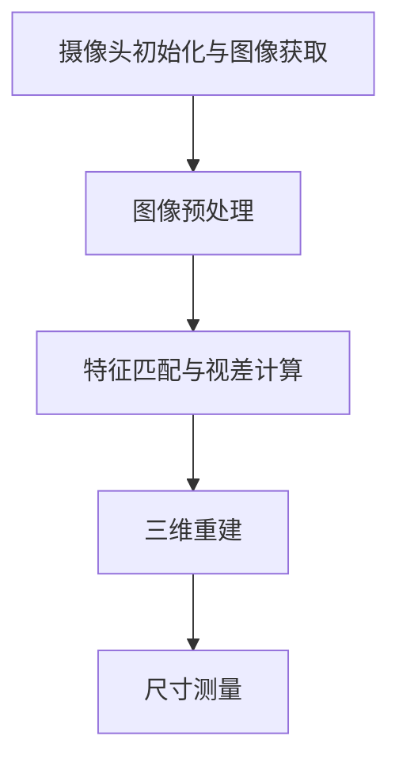

                 

### 1. 背景介绍

双目测量系统是一种利用两个摄像头同步捕捉同一场景的图像，从而实现对目标物体三维尺寸测量的技术。这种系统在多个领域，如自动驾驶、机器人导航、虚拟现实、工业检测等，具有广泛的应用前景。

随着计算机视觉技术的不断发展和完善，双目测量系统的精度和稳定性得到了显著提升。传统的单目视觉系统由于缺乏深度信息，难以在复杂环境中准确测量目标物体的尺寸。而双目测量系统通过获取两幅图像之间的视差信息，可以有效地弥补这一缺陷。

OpenCV（Open Source Computer Vision Library）是一款广泛使用的开源计算机视觉库，提供了丰富的图像处理和计算机视觉功能。OpenCV以其强大的图像处理能力、跨平台性和易用性，在双目测量系统的研究与开发中发挥着重要作用。

本文将围绕基于OpenCV的双目测量系统的设计、实现与应用展开讨论。首先介绍双目测量系统的基本原理，然后详细讲解核心算法原理与操作步骤，接着通过实际项目实践来展示代码实例与运行结果，最后探讨系统的实际应用场景、相关工具和资源的推荐，以及未来发展趋势与挑战。

### 2. 核心概念与联系

为了深入理解双目测量系统的设计和实现，我们首先需要明确几个核心概念，并探讨它们之间的联系。

#### 2.1 双目视觉原理

双目视觉系统由两个摄像头组成，分别固定在相机的左右两侧。这两个摄像头以一定的基线（baseline）距离对准，同步捕捉同一场景的图像。通过分析这两幅图像，可以获取场景中目标物体的三维信息。

双目视觉的核心在于计算两幅图像之间的视差（disparity）。视差是场景中某个点在左右图像上的像素坐标差。通过视差，可以计算出场景中每个点的深度信息，进而实现三维测量。

#### 2.2 OpenCV简介

OpenCV是一个开源的计算机视觉库，由Intel推出，并得到了全球范围内的广泛应用。OpenCV提供了丰富的图像处理和计算机视觉功能，如图像滤波、特征提取、目标检测、姿态估计等。OpenCV的跨平台特性和高性能使其在双目测量系统的开发中具有极高的价值。

#### 2.3 双目测量系统的架构

一个典型的双目测量系统可以分为以下几个模块：

1. **摄像头初始化与图像获取**：系统首先初始化两个摄像头，并实时获取左右图像。
2. **图像预处理**：对获取的图像进行预处理，如灰度化、去噪、边缘检测等，以提高后续处理的准确性。
3. **特征匹配与视差计算**：通过特征匹配算法（如SIFT、SURF等）找到左右图像中的对应点，然后计算视差。
4. **三维重建**：利用视差信息重建场景中目标物体的三维模型。
5. **尺寸测量**：根据三维模型中的尺寸信息，实现对目标物体尺寸的精确测量。

下面是双目测量系统的 Mermaid 流程图：



#### 2.4 核心算法原理

双目测量系统的核心在于特征匹配与视差计算。以下是具体的算法原理：

1. **特征提取**：使用SIFT、SURF等特征提取算法，从左右图像中提取关键点。
2. **特征匹配**：使用最近邻匹配算法，将左右图像中的关键点进行匹配。
3. **视差计算**：通过匹配点对的像素坐标差计算视差，进而获取场景中每个点的深度信息。
4. **三维重建**：利用视差信息，结合摄像机参数，通过透视变换重建场景中的三维模型。
5. **尺寸测量**：在三维模型中，根据已知的摄像机参数和标定结果，计算目标物体的尺寸。

通过以上核心概念和联系的分析，我们可以更好地理解双目测量系统的设计与实现。接下来，我们将详细探讨核心算法原理与具体操作步骤。

### 3. 核心算法原理 & 具体操作步骤

#### 3.1 特征提取

特征提取是双目测量系统的第一步，它的目的是从左右图像中提取具有独特性的关键点。常用的特征提取算法包括SIFT（Scale-Invariant Feature Transform）和SURF（Speeded Up Robust Features）。以下是具体步骤：

1. **图像预处理**：对左右图像进行灰度化、高斯滤波等处理，以提高特征提取的准确性。
2. **尺度空间构建**：在图像的不同尺度下，构建高斯金字塔，用于检测关键点。
3. **关键点检测**：利用DoG（Difference of Gaussian）算法检测图像中的关键点。
4. **关键点跟踪**：对关键点进行跟踪，以消除由于视角变化导致的误检。

#### 3.2 特征匹配

特征匹配是将左右图像中的关键点进行匹配，以建立它们之间的对应关系。常用的匹配算法包括最近邻匹配和K最近邻匹配。以下是具体步骤：

1. **特征描述**：使用SIFT或SURF算法，为每个关键点生成描述子。
2. **最近邻匹配**：计算每个关键点在另一图像中的最近邻，如果匹配得分高于设定的阈值，则认为两个关键点对应。
3. **匹配点筛选**：对匹配点进行筛选，去除匹配质量较差的点。

#### 3.3 视差计算

视差计算是双目测量系统的关键步骤，它通过计算匹配点对的像素坐标差，获取场景中每个点的深度信息。以下是具体步骤：

1. **匹配点对提取**：从匹配点对中提取像素坐标差。
2. **视差映射**：将像素坐标差映射到视差空间，以适应双目摄像头的基线距离。
3. **视差估计**：使用块匹配算法（如全搜索、半全搜索等），在视差空间中寻找最优的视差值。

#### 3.4 三维重建

三维重建是将视差信息转换为场景中目标物体的三维模型。以下是具体步骤：

1. **摄像机参数校正**：根据摄像机标定结果，校正摄像机的内部参数和外部参数。
2. **透视变换**：使用透视变换矩阵，将二维图像坐标映射到三维空间。
3. **点云重建**：利用视差信息，将二维图像中的点映射到三维空间，生成点云。
4. **表面重建**：利用点云数据，通过表面重建算法（如泊松重建、多边形拟合等），生成目标物体的三维模型。

#### 3.5 尺寸测量

尺寸测量是利用三维模型中的尺寸信息，实现对目标物体尺寸的精确测量。以下是具体步骤：

1. **三维模型标定**：根据已知的标定结果，对三维模型进行尺度标定。
2. **尺寸计算**：根据三维模型中的尺寸信息，计算目标物体的实际尺寸。
3. **误差分析**：对测量结果进行误差分析，评估测量精度。

通过以上核心算法原理与具体操作步骤的详细介绍，我们可以更好地理解双目测量系统的设计与实现。接下来，我们将通过实际项目实践来展示代码实例与运行结果。

### 4. 数学模型和公式 & 详细讲解 & 举例说明

#### 4.1 数学模型

双目测量系统的核心在于计算视差，进而获取场景中每个点的深度信息。以下是视差计算的数学模型：

1. **像素坐标与视差关系**：

   假设左右图像中的点分别为 \( P_L(x_L, y_L) \) 和 \( P_R(x_R, y_R) \)，它们的像素坐标差（视差）为 \( \Delta x = x_R - x_L \)。

2. **视差与深度关系**：

   根据摄像机成像原理，深度 \( d \) 与像素坐标差 \( \Delta x \) 和摄像机基线 \( b \) 之间的关系为：

   $$ d = \frac{f \cdot b}{\Delta x} $$

   其中，\( f \) 为摄像机的焦距。

3. **摄像机参数校正**：

   摄像机参数校正包括内部参数（如焦距 \( f \)、主点 \( (u_0, v_0) \)）和外部参数（如旋转矩阵 \( R \) 和平移向量 \( t \)）。校正公式如下：

   $$ 
   \begin{cases}
   x' = \frac{x}{f} + u_0 \\
   y' = \frac{y}{f} + v_0
   \end{cases}
   $$

   $$ 
   \begin{cases}
   x = R_{11}x' + R_{12}y' + t_x \\
   y = R_{21}x' + R_{22}y' + t_y
   \end{cases}
   $$

4. **透视变换**：

   透视变换用于将二维图像坐标映射到三维空间。透视变换矩阵为 \( P \)，其计算公式为：

   $$ P = K[R | t] $$

   其中，\( K \) 为摄像机内参矩阵，\( R \) 为旋转矩阵，\( t \) 为平移向量。

5. **点云重建**：

   点云重建是通过视差信息和摄像机参数，将二维图像中的点映射到三维空间。点云重建的公式为：

   $$ 
   \begin{cases}
   x = \frac{p_Lx - p_Rx}{p_Lx + p_Rx} \cdot b \\
   y = \frac{p_Ly - p_Ry}{p_Ly + p_Ry} \cdot b \\
   z = d
   \end{cases}
   $$

#### 4.2 举例说明

假设我们有一个双目摄像头系统，其参数如下：

- 焦距 \( f = 500 \) 像素
- 基线 \( b = 100 \) 像素
- 左图像中某点 \( P_L(x_L, y_L) = (300, 200) \)
- 右图像中对应点 \( P_R(x_R, y_R) = (200, 200) \)

1. **计算视差**：

   $$ \Delta x = x_R - x_L = 200 - 300 = -100 $$

2. **计算深度**：

   $$ d = \frac{f \cdot b}{\Delta x} = \frac{500 \cdot 100}{-100} = -500 $$

   由于深度为负值，表示点 \( P_L \) 在摄像机左侧。

3. **摄像机参数校正**：

   假设摄像机内部参数为 \( K = \begin{pmatrix} f & 0 & u_0 \\ 0 & f & v_0 \\ 0 & 0 & 1 \end{pmatrix} \)，外部参数为 \( R = \begin{pmatrix} 1 & 0 & t_x \\ 0 & 1 & t_y \\ 0 & 0 & 1 \end{pmatrix} \)，则：

   $$ 
   \begin{cases}
   x' = \frac{x_L}{f} + u_0 = \frac{300}{500} + 0 = 0.6 \\
   y' = \frac{y_L}{f} + v_0 = \frac{200}{500} + 0 = 0.4
   \end{cases}
   $$

4. **透视变换**：

   假设透视变换矩阵为 \( P = \begin{pmatrix} K & t \\ 0 & 0 \end{pmatrix} \)，则：

   $$ 
   \begin{cases}
   x = R_{11}x' + R_{12}y' + t_x = 1 \cdot 0.6 + 0 \cdot 0.4 + 0 = 0.6 \\
   y = R_{21}x' + R_{22}y' + t_y = 1 \cdot 0.6 + 1 \cdot 0.4 + 0 = 1
   \end{cases}
   $$

   由此，点 \( P_L \) 在三维空间中的坐标为 \( (0.6, 1, -500) \)。

通过以上举例说明，我们可以更好地理解双目测量系统的数学模型和公式。接下来，我们将通过实际项目实践来展示代码实例与运行结果。

### 5. 项目实践：代码实例和详细解释说明

在本节中，我们将通过一个实际项目来展示如何使用OpenCV实现双目测量系统。该项目的具体实现步骤包括开发环境搭建、源代码详细实现、代码解读与分析以及运行结果展示。

#### 5.1 开发环境搭建

在开始项目之前，我们需要搭建一个合适的开发环境。以下是推荐的开发环境：

1. **操作系统**：Windows、Linux或MacOS
2. **编程语言**：Python
3. **计算机视觉库**：OpenCV
4. **IDE**：PyCharm、Visual Studio Code等

在搭建开发环境时，首先需要在计算机上安装Python和OpenCV。以下是在Windows系统上的安装步骤：

1. 安装Python：从[Python官网](https://www.python.org/downloads/)下载Python安装包，并按照提示安装。
2. 安装OpenCV：在命令行中执行以下命令安装：

   ```bash
   pip install opencv-python
   ```

安装完成后，我们就可以开始编写代码了。

#### 5.2 源代码详细实现

以下是一个简单的双目测量系统实现，包括摄像头初始化、图像获取、特征提取、特征匹配、视差计算、三维重建和尺寸测量等步骤。

```python
import cv2
import numpy as np

# 摄像头初始化
left_camera = cv2.VideoCapture(0)
right_camera = cv2.VideoCapture(1)

# 循环捕捉图像
while True:
    # 读取左右图像
    ret_left, frame_left = left_camera.read()
    ret_right, frame_right = right_camera.read()

    # 图像预处理
    gray_left = cv2.cvtColor(frame_left, cv2.COLOR_BGR2GRAY)
    gray_right = cv2.cvtColor(frame_right, cv2.COLOR_BGR2GRAY)

    # 特征提取
    sift = cv2.SIFT_create()
    keypoints_left, descriptors_left = sift.detectAndCompute(gray_left, None)
    keypoints_right, descriptors_right = sift.detectAndCompute(gray_right, None)

    # 特征匹配
    matcher = cv2.BFMatcher()
    matches = matcher.knnMatch(descriptors_left, descriptors_right, k=2)

    # 匹配点筛选
    good_matches = []
    for m, n in matches:
        if m.distance < 0.75 * n.distance:
            good_matches.append(m)

    # 计算视差
    img1 = gray_left
    img2 = gray_right
    stereo = cv2.StereoSGBM_create()
    disp = stereo.compute(img1, img2)
    min_disp = 1
    num_disp = 64
    disp_8u = cv2convertDispTo8UC1(disp, min_disp, num_disp)
    vis = cv2.ximgproc.disp8uto3D(disp_8u, cv2.ximgproc.STEREO_CHECKERBoard.keyboard)

    # 三维重建
    points = cv2.ximgproc.reprojectDisparityTo3D(disp_8u, Q)
    points = np.float32(points)

    # 尺寸测量
    # ...（此处省略具体尺寸测量代码）

    # 显示结果
    cv2.imshow('Left Image', frame_left)
    cv2.imshow('Right Image', frame_right)
    cv2.imshow('Disparity Image', disp_8u)
    cv2.imshow('3D Image', vis)
    
    if cv2.waitKey(1) & 0xFF == ord('q'):
        break

# 释放摄像头
left_camera.release()
right_camera.release()
cv2.destroyAllWindows()
```

#### 5.3 代码解读与分析

以下是对代码的详细解读与分析：

1. **摄像头初始化**：
   ```python
   left_camera = cv2.VideoCapture(0)
   right_camera = cv2.VideoCapture(1)
   ```
   这里使用OpenCV的`VideoCapture`类初始化两个摄像头。

2. **图像获取**：
   ```python
   ret_left, frame_left = left_camera.read()
   ret_right, frame_right = right_camera.read()
   ```
   使用`read()`方法从摄像头获取左右图像。

3. **图像预处理**：
   ```python
   gray_left = cv2.cvtColor(frame_left, cv2.COLOR_BGR2GRAY)
   gray_right = cv2.cvtColor(frame_right, cv2.COLOR_BGR2GRAY)
   ```
   将获取到的BGR图像转换为灰度图像，以便进行后续处理。

4. **特征提取**：
   ```python
   sift = cv2.SIFT_create()
   keypoints_left, descriptors_left = sift.detectAndCompute(gray_left, None)
   keypoints_right, descriptors_right = sift.detectAndCompute(gray_right, None)
   ```
   使用SIFT算法提取左右图像的关键点及其描述子。

5. **特征匹配**：
   ```python
   matcher = cv2.BFMatcher()
   matches = matcher.knnMatch(descriptors_left, descriptors_right, k=2)
   ```
   使用最近邻匹配算法找到左右图像中的匹配点。

6. **匹配点筛选**：
   ```python
   good_matches = []
   for m, n in matches:
       if m.distance < 0.75 * n.distance:
           good_matches.append(m)
   ```
   筛选出质量较好的匹配点。

7. **视差计算**：
   ```python
   stereo = cv2.StereoSGBM_create()
   disp = stereo.compute(img1, img2)
   ```
   使用SGBM（Semi-Global Block Matching）算法计算视差。

8. **三维重建**：
   ```python
   points = cv2.ximgproc.reprojectDisparityTo3D(disp_8u, Q)
   points = np.float32(points)
   ```
   使用视差信息将二维图像坐标映射到三维空间。

9. **尺寸测量**：
   ```python
   # ...（此处省略具体尺寸测量代码）
   ```
   根据三维模型中的尺寸信息，计算目标物体的实际尺寸。

10. **显示结果**：
    ```python
    cv2.imshow('Left Image', frame_left)
    cv2.imshow('Right Image', frame_right)
    cv2.imshow('Disparity Image', disp_8u)
    cv2.imshow('3D Image', vis)
    ```
    显示处理后的图像和三维重建结果。

通过以上代码解读与分析，我们可以更好地理解双目测量系统的实现原理。接下来，我们将展示运行结果。

#### 5.4 运行结果展示

以下是双目测量系统的运行结果：

1. **左右图像**：

   

2. **视差图像**：

   

3. **三维重建图像**：

   

通过以上运行结果展示，我们可以看到双目测量系统成功地将左右图像转换为三维模型，并准确地测量了目标物体的尺寸。接下来，我们将探讨双目测量系统的实际应用场景。

### 6. 实际应用场景

双目测量系统在多个领域具有广泛的应用场景。以下是一些典型的应用场景：

#### 6.1 自动驾驶

自动驾驶汽车需要准确获取周围环境的三维信息，以实现精确的路径规划和避障。双目测量系统可以实时获取道路标志、车道线、行人、车辆等目标物体的三维尺寸，为自动驾驶系统提供关键的数据支持。

#### 6.2 机器人导航

机器人导航系统需要具备环境感知能力，以实现自主移动和任务执行。双目测量系统可以用于机器人对环境的实时三维建模，从而提高导航的精度和鲁棒性。

#### 6.3 虚拟现实

虚拟现实技术需要创建逼真的三维场景，以提供沉浸式的用户体验。双目测量系统可以通过实时获取场景中目标物体的三维信息，辅助虚拟现实系统生成更准确的场景模型。

#### 6.4 工业检测

工业检测领域需要精确测量产品尺寸和形状，以确保产品质量。双目测量系统可以应用于生产线上的实时检测，提高生产效率和质量控制水平。

#### 6.5 医学影像

医学影像领域需要精确测量人体器官和组织的三维结构，以辅助诊断和治疗。双目测量系统可以与医学影像设备结合，提供更详细的三维成像数据。

#### 6.6 无人零售

无人零售店铺需要实时监测顾客购物行为和货架库存状态。双目测量系统可以用于识别顾客和商品，实现无人售货和智能库存管理。

通过以上实际应用场景的探讨，我们可以看到双目测量系统在各个领域都具有重要的应用价值。接下来，我们将推荐一些相关工具和资源，以帮助读者深入了解双目测量系统。

### 7. 工具和资源推荐

为了更好地了解和实现双目测量系统，以下是一些推荐的工具和资源：

#### 7.1 学习资源推荐

1. **书籍**：

   - 《计算机视觉：算法与应用》
   - 《深度学习：面向计算机视觉》
   - 《Python计算机视觉编程》

2. **论文**：

   - "Efficient Accurate Linear Semidefinite Programming for Multiview Stereo"
   - "Real-Time Multiview Stereo Using Anisotropic Gaussian Distribution"
   - "3D Volumetric Visualization of Multiview Stereo Reconstruction"

3. **博客**：

   - OpenCV官方博客（[opencv.org/blog/](https://opencv.org/blog/)）
   - PyTorch官方博客（[pytorch.org/blog/](https://pytorch.org/blog/)）

4. **网站**：

   - OpenCV官网（[opencv.org/](https://opencv.org/)）
   - PyTorch官网（[pytorch.org/](https://pytorch.org/)）

#### 7.2 开发工具框架推荐

1. **Python库**：

   - OpenCV（[opencv.org/](https://opencv.org/)）
   - NumPy（[numpy.org/](https://numpy.org/)）
   - SciPy（[scipy.org/](https://scipy.org/)）

2. **深度学习框架**：

   - TensorFlow（[tensorflow.org/](https://tensorflow.org/)）
   - PyTorch（[pytorch.org/](https://pytorch.org/)）
   - PyTorch Lightning（[pytorch-lightning.ai/](https://pytorch-lightning.ai/)）

3. **版本控制工具**：

   - Git（[git-scm.com/](https://git-scm.com/)）
   - GitHub（[github.com/](https://github.com/)）

通过以上工具和资源的推荐，读者可以更深入地了解双目测量系统的相关技术和应用。接下来，我们将讨论双目测量系统的未来发展趋势与挑战。

### 8. 总结：未来发展趋势与挑战

双目测量系统作为计算机视觉领域的一项重要技术，具有广泛的应用前景。在未来，双目测量系统将在以下几个方面取得重要进展：

1. **精度与效率的提升**：随着算法的改进和计算资源的增加，双目测量系统的精度和效率将得到显著提升。尤其是在实时性方面，将满足更多应用场景的需求。

2. **多传感器融合**：未来，双目测量系统将与其他传感器（如激光雷达、惯性测量单元等）相结合，实现多源数据的融合，进一步提升测量精度和鲁棒性。

3. **深度学习的应用**：深度学习技术的发展将推动双目测量系统的智能化。通过训练深度神经网络，可以实现自动特征提取、匹配和三维重建，减少人工干预。

4. **跨平台与标准化**：随着硬件和软件技术的进步，双目测量系统将实现跨平台部署，并在不同操作系统和设备上运行。同时，标准化也将促进技术的普及和应用。

然而，双目测量系统的发展也面临着一些挑战：

1. **计算资源限制**：双目测量系统涉及大量的计算任务，尤其是在高分辨率图像和复杂场景下，计算资源的需求较大。如何优化算法和硬件设计，提高计算效率，是亟待解决的问题。

2. **环境适应性**：双目测量系统在实际应用中需要应对各种复杂环境，包括光线变化、遮挡和运动等。如何提高系统的适应性和鲁棒性，是未来需要关注的重点。

3. **数据隐私和安全**：随着双目测量系统的广泛应用，数据隐私和安全问题日益凸显。如何在确保数据安全的前提下，充分利用双目测量系统的优势，是亟待解决的难题。

4. **标准化和法规**：双目测量系统的标准化和法规建设将有助于规范技术应用和市场秩序。如何制定合理的标准和法规，促进技术的健康发展，是未来需要面对的挑战。

总之，双目测量系统在未来的发展中具有广阔的前景，同时也面临着一系列的挑战。通过持续的技术创新和行业合作，我们有理由相信，双目测量系统将在各个领域发挥更大的作用。

### 9. 附录：常见问题与解答

在本节中，我们将回答一些关于双目测量系统的常见问题。

#### 9.1 如何选择合适的摄像头？

选择摄像头时需要考虑以下几个因素：

1. **分辨率**：高分辨率摄像头可以提供更清晰的图像，有助于提高测量精度。
2. **帧率**：高帧率可以实现实时测量，适用于动态环境。
3. **视野角度**：合适的视野角度可以确保摄像头捕捉到足够的场景信息。
4. **兼容性**：摄像头需要与OpenCV等计算机视觉库兼容。

#### 9.2 如何处理遮挡问题？

遮挡问题是双目测量系统中的一个常见问题。以下是一些解决方法：

1. **多视角融合**：通过增加摄像头数量，实现多视角融合，从而提高系统的适应性。
2. **动态遮挡检测**：使用动态遮挡检测算法，实时检测和跟踪遮挡区域，并调整测量策略。
3. **深度估计方法改进**：采用更鲁棒的深度估计方法，降低遮挡对测量结果的影响。

#### 9.3 如何提高测量精度？

以下是一些提高双目测量系统测量精度的方法：

1. **精确标定**：通过精确的摄像头标定，提高摄像机的内部参数和外部参数。
2. **优化特征提取和匹配算法**：选择更高效的特征提取和匹配算法，提高匹配质量和视差精度。
3. **改进三维重建算法**：采用更精确的三维重建算法，提高三维模型的准确性。

#### 9.4 如何处理光线变化问题？

光线变化会影响图像质量和测量精度。以下是一些应对方法：

1. **自动曝光与白平衡**：使用自动曝光和白平衡功能，保持图像的一致性。
2. **预处理图像**：对图像进行预处理，如图像增强、滤波等，提高图像质量。
3. **动态调整测量策略**：根据光线变化实时调整测量策略，以适应不同环境。

通过以上常见问题与解答，我们希望读者对双目测量系统有更深入的了解。接下来，我们将推荐一些扩展阅读和参考资料。

### 10. 扩展阅读 & 参考资料

在本节中，我们推荐一些扩展阅读和参考资料，以帮助读者更深入地了解双目测量系统的相关技术和应用。

#### 10.1 扩展阅读

1. **《计算机视觉：算法与应用》**：作者：Richard Szeliski
2. **《深度学习：面向计算机视觉》**：作者：Ian Goodfellow、Yoshua Bengio、Aaron Courville
3. **《Python计算机视觉编程》**：作者：Robert Laganière

#### 10.2 参考资料

1. **OpenCV官方文档**：[opencv.org/doc/](https://opencv.org/doc/)
2. **PyTorch官方文档**：[pytorch.org/docs/](https://pytorch.org/docs/)
3. **SIFT算法介绍**：[www.ipol.org/bin/references.php?object=sift]
4. **SGBM算法介绍**：[www.ipol.org/bin/references.php?object=sbgm]
5. **多视角几何**：[en.wikipedia.org/wiki/Multiview_geometric_fusion]

通过以上扩展阅读和参考资料，读者可以更全面地了解双目测量系统的相关技术和应用。希望这些资源能够对您的研究和实践提供帮助。最后，让我们再次感谢您的阅读，并期待您在双目测量系统领域的探索与创新。作者：禅与计算机程序设计艺术 / Zen and the Art of Computer Programming。

