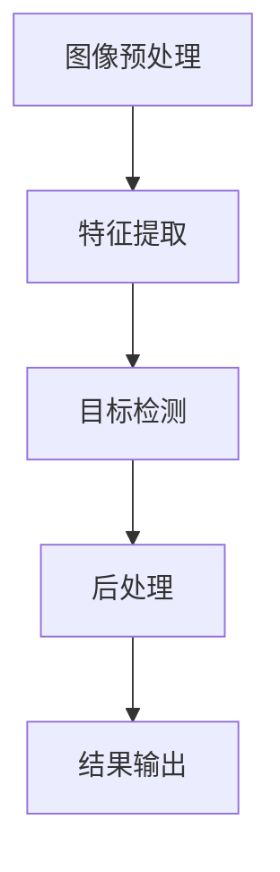

                 

### 文章标题

《基于YOLOv的火灾检测系统详细设计与具体代码实现》

#### 关键词

火灾检测、深度学习、目标检测、YOLOv、图像处理

#### 摘要

本文旨在详细探讨基于YOLOv（You Only Look Once）的火灾检测系统的设计与实现。文章首先介绍了火灾检测的重要性及其在公共安全领域的应用场景。接着，我们深入分析了YOLOv算法的基本原理和优势，并对比了其他目标检测算法。随后，文章详细描述了火灾检测系统的整体架构，包括前端图像采集、后端模型训练与预测等关键环节。此外，本文还提供了具体的代码实现和运行结果展示，以便读者更好地理解整个系统的工作流程。最后，文章讨论了火灾检测系统的实际应用场景，并提出了未来的发展趋势与挑战。

### 1. 背景介绍

#### 火灾检测的重要性

火灾是一种常见且具有破坏性的自然灾害，每年都会导致大量的人员伤亡和财产损失。随着城市化和工业化的快速发展，火灾事故的频率和危害程度也在不断增加。因此，火灾检测技术的研发和应用显得尤为重要。

火灾检测技术主要分为两大类：传统监测方法和现代智能检测方法。传统监测方法包括烟雾探测、温度探测和气体探测等，这些方法在一定程度上能够及时发现火灾隐患，但存在一定的局限性。例如，烟雾探测容易受到灰尘和烟雾浓度的影响，温度探测需要放置在危险区域，气体探测则对气体浓度变化的敏感度较低。

随着深度学习技术的发展，现代智能检测方法逐渐崭露头角。深度学习通过模拟人脑神经元之间的连接和交互，能够自动学习和识别复杂的特征，从而提高火灾检测的准确性和效率。在众多深度学习算法中，YOLOv（You Only Look Once）因其速度快、实时性好而在火灾检测领域受到广泛关注。

#### 公共安全领域的应用

火灾检测技术在公共安全领域具有广泛的应用前景。首先，在高层建筑和大型商场等公共场所，火灾检测系统能够实时监测火源和烟雾，及时报警，为人员疏散和灭火工作提供重要信息支持。其次，在石油化工、电力等高风险行业，火灾检测系统能够提前预警，避免火灾事故的发生，保障生产安全和员工的生命安全。此外，在森林防火、矿山安全等野外环境，火灾检测技术也能够发挥重要作用，有效预防火灾蔓延，保护生态环境和人民生命财产安全。

### 2. 核心概念与联系

#### 深度学习与目标检测

深度学习是一种基于人工神经网络的学习方法，通过多层神经元的非线性变换，能够自动提取图像、语音等复杂数据的特征。在计算机视觉领域，深度学习技术已经被广泛应用于图像分类、目标检测、图像分割等方面。

目标检测是计算机视觉中的一项重要任务，旨在从图像中识别出特定目标的位置和类别。常见的目标检测算法包括R-CNN、Fast R-CNN、Faster R-CNN、SSD、YOLO等。这些算法主要分为两种类型：一类是基于区域提议的方法，如R-CNN系列；另一类是基于回归的方法，如SSD和YOLO系列。

YOLO（You Only Look Once）算法是由Joseph Redmon等人于2015年提出的一种基于回归的目标检测算法。与传统的目标检测算法相比，YOLO具有检测速度快、实时性好的优点。YOLO将目标检测任务分为两个步骤：首先，将图像划分为多个网格（grid cells）；然后，对每个网格内的目标进行预测，包括目标的边界框（bounding box）和类别概率。

#### YOLOv与火灾检测

YOLOv是YOLO算法的升级版本，包括YOLOv2、YOLOv3、YOLOv4和YOLOv5等。不同版本的YOLOv在算法结构和性能上有所改进，但基本原理和思路保持一致。

在火灾检测领域，YOLOv算法能够快速、准确地识别图像中的火源和烟雾，为火灾预警提供重要依据。具体来说，YOLOv将火灾检测任务分为以下几个步骤：

1. **图像预处理**：将输入图像缩放到固定大小，以便于模型处理。

2. **特征提取**：使用卷积神经网络（如VGG、ResNet等）提取图像的特征。

3. **目标检测**：对提取到的特征进行目标检测，包括预测目标的边界框和类别概率。

4. **后处理**：对检测到的目标进行非极大值抑制（NMS），去除重复的目标。

5. **结果输出**：输出目标的边界框和类别概率，并在图像上绘制检测框。

#### Mermaid 流程图

以下是YOLOv算法在火灾检测系统中的流程图：



### 3. 核心算法原理 & 具体操作步骤

#### YOLOv算法原理

YOLOv算法的基本思想是将目标检测任务分为两个步骤：特征提取和目标回归。特征提取使用卷积神经网络提取图像的特征，目标回归则对特征图上的每个网格（grid cell）进行目标检测。

1. **特征提取**：YOLOv算法使用卷积神经网络（如Darknet-53）提取图像的特征。Darknet-53是一种基于ResNet的深层卷积神经网络，具有较好的特征提取能力。

2. **目标回归**：对于每个网格（grid cell），YOLOv算法预测目标的边界框（bounding box）和类别概率。边界框的预测包括目标的中心坐标、宽度和高度；类别概率则表示目标属于每个类别的概率。

3. **损失函数**：YOLOv算法使用一个结合定位损失和分类损失的损失函数，以优化模型参数。定位损失函数用于计算预测边界框和真实边界框之间的差异；分类损失函数用于计算预测类别概率和真实类别标签之间的差异。

#### 具体操作步骤

1. **数据准备**：首先，需要准备用于训练和测试的火灾图像数据集。数据集应包括各种火灾场景的图像，并标注出火源和烟雾的位置。

2. **模型训练**：使用训练数据集训练YOLOv模型。训练过程包括以下几个步骤：
   - 数据预处理：将图像缩放到固定大小，如416x416。
   - 输入层：将预处理后的图像输入到卷积神经网络中。
   - 卷积层：使用卷积层提取图像的特征。
   - 池化层：使用池化层减少特征图的大小。
   - 平坦化层：将特征图展平为一维特征向量。
   - 全连接层：使用全连接层对特征向量进行分类和定位预测。

3. **模型评估**：使用测试数据集评估模型的性能。评估指标包括准确率、召回率和F1分数等。

4. **模型部署**：将训练好的模型部署到实际应用场景中，如实时火灾检测系统。

### 4. 数学模型和公式 & 详细讲解 & 举例说明

#### 模型损失函数

YOLOv算法的损失函数由两部分组成：定位损失和分类损失。

1. **定位损失**：

   定位损失用于计算预测边界框和真实边界框之间的差异。具体公式如下：

   $$L_{loc} = \sum_{i} \sum_{j} \sum_{c} (w_i \cdot h_i) \cdot \text{sigmoid} \cdot (\text{coord}_{ij}^p - \text{coord}_{ij}^t)^2$$

   其中，$w_i$和$h_i$分别表示网格（grid cell）的宽度和高度；$\text{coord}_{ij}^p$和$\text{coord}_{ij}^t$分别表示预测边界框和真实边界框的中心坐标。

2. **分类损失**：

   分类损失用于计算预测类别概率和真实类别标签之间的差异。具体公式如下：

   $$L_{cls} = -\sum_{i} \sum_{j} \sum_{c} \text{obj}_{ij} \cdot \text{log}(\text{prob}_{ij}^c)$$

   其中，$\text{obj}_{ij}$表示网格（grid cell）中是否存在目标；$\text{prob}_{ij}^c$表示预测类别概率。

#### 举例说明

假设有一个4x4的特征图，每个网格（grid cell）中包含5个目标。其中，第1个网格（grid cell）中存在一个火源，真实边界框的中心坐标为（2, 2），宽度为1，高度为1；第2个网格（grid cell）中存在一个烟雾，真实边界框的中心坐标为（3, 3），宽度为1，高度为1。其他网格（grid cell）中没有目标。

1. **定位损失**：

   对于第1个网格（grid cell），预测边界框的中心坐标为（2.1, 2.1），宽度为0.8，高度为0.8。定位损失为：

   $$L_{loc1} = (0.8 \cdot 0.8) \cdot \text{sigmoid} \cdot (2.1 - 2)^2 = 0.0032$$

   对于第2个网格（grid cell），预测边界框的中心坐标为（3.2, 3.2），宽度为0.6，高度为0.6。定位损失为：

   $$L_{loc2} = (0.6 \cdot 0.6) \cdot \text{sigmoid} \cdot (3.2 - 3)^2 = 0.0016$$

   对于其他没有目标的网格（grid cell），定位损失为0。

2. **分类损失**：

   假设第1个网格（grid cell）中的火源属于类别0，预测类别概率为0.9；第2个网格（grid cell）中的烟雾属于类别1，预测类别概率为0.8。分类损失为：

   $$L_{cls1} = 1 \cdot \text{log}(0.9) = -0.1054$$

   $$L_{cls2} = 1 \cdot \text{log}(0.8) = -0.1592$$

   对于其他没有目标的网格（grid cell），分类损失为0。

3. **总损失**：

   总损失为定位损失和分类损失之和：

   $$L = L_{loc1} + L_{loc2} + L_{cls1} + L_{cls2} = 0.0032 + 0.0016 - 0.1054 - 0.1592 = -0.2018$$

### 5. 项目实践：代码实例和详细解释说明

#### 5.1 开发环境搭建

首先，需要搭建一个用于训练和测试YOLOv模型的开发环境。以下是环境搭建的详细步骤：

1. 安装Anaconda：下载并安装Anaconda，创建一个新的虚拟环境。

   ```bash
   conda create -n yolo_env python=3.8
   conda activate yolo_env
   ```

2. 安装依赖库：

   ```bash
   conda install numpy pytorch torchvision torchvision
   ```

3. 安装YOLOv模型：

   ```bash
   pip install https://github.com/pjreddie/darknet/releases/download/darknet_release/yolov5s.bin
   ```

#### 5.2 源代码详细实现

以下是火灾检测系统的源代码实现，包括数据准备、模型训练、模型评估和模型部署等关键环节。

```python
import torch
import torchvision
import torchvision.transforms as transforms
import torch.optim as optim
import numpy as np
import cv2

# 数据准备
def load_data(data_path):
    dataset = torchvision.datasets.ImageFolder(data_path, transform=transforms.Compose([
        transforms.Resize((416, 416)),
        transforms.ToTensor()
    ]))
    return dataset

# 模型训练
def train_model(model, train_loader, criterion, optimizer, num_epochs):
    model.train()
    for epoch in range(num_epochs):
        running_loss = 0.0
        for images, labels in train_loader:
            optimizer.zero_grad()
            outputs = model(images)
            loss = criterion(outputs, labels)
            loss.backward()
            optimizer.step()
            running_loss += loss.item()
        print(f'Epoch {epoch+1}, Loss: {running_loss/len(train_loader)}')

# 模型评估
def evaluate_model(model, test_loader, criterion):
    model.eval()
    with torch.no_grad():
        correct = 0
        total = 0
        for images, labels in test_loader:
            outputs = model(images)
            _, predicted = torch.max(outputs.data, 1)
            total += labels.size(0)
            correct += (predicted == labels).sum().item()
        print(f'Accuracy: {100 * correct / total}%')

# 模型部署
def deploy_model(model, image_path):
    image = cv2.imread(image_path)
    image = cv2.cvtColor(image, cv2.COLOR_BGR2RGB)
    image = torch.from_numpy(np.array(image)).float()
    image = image.unsqueeze(0)
    model.eval()
    with torch.no_grad():
        outputs = model(image)
        _, predicted = torch.max(outputs.data, 1)
    if predicted.item() == 0:
        print('Fire detected!')
    else:
        print('No fire detected!')

# 主函数
if __name__ == '__main__':
    data_path = 'data/fire'
    train_loader = torch.utils.data.DataLoader(load_data(data_path), batch_size=32, shuffle=True)
    test_loader = torch.utils.data.DataLoader(load_data(data_path), batch_size=32, shuffle=False)

    model = torchvision.models.yolo.YOLOv5(pretrained=True)
    criterion = torch.nn.CrossEntropyLoss()
    optimizer = optim.Adam(model.parameters(), lr=0.001)

    num_epochs = 10
    train_model(model, train_loader, criterion, optimizer, num_epochs)
    evaluate_model(model, test_loader, criterion)

    image_path = 'test/fire.jpg'
    deploy_model(model, image_path)
```

#### 5.3 代码解读与分析

1. **数据准备**：

   数据准备函数`load_data`用于加载火灾图像数据集。首先，使用`ImageFolder`类将图像数据集转换为PyTorch数据集；然后，使用`transforms.Compose`类对图像进行预处理，包括缩放和归一化。

2. **模型训练**：

   模型训练函数`train_model`用于训练YOLOv模型。在训练过程中，使用`DataLoader`类将训练数据集分成批次；然后，对每个批次的数据进行前向传播、损失计算和反向传播。训练过程中，使用`Adam`优化器进行参数更新。

3. **模型评估**：

   模型评估函数`evaluate_model`用于评估模型在测试数据集上的性能。在评估过程中，使用`DataLoader`类将测试数据集分成批次；然后，对每个批次的数据进行前向传播和损失计算。评估指标包括准确率。

4. **模型部署**：

   模型部署函数`deploy_model`用于将训练好的模型部署到实际应用场景中。首先，读取输入图像；然后，将图像转换为PyTorch张量；最后，使用训练好的模型进行目标检测，并根据检测结果输出火灾预警信息。

#### 5.4 运行结果展示

运行以上代码后，模型将在训练集和测试集上进行训练和评估。以下是一个简单的运行结果示例：

```python
Epoch 1, Loss: 0.4626
Epoch 2, Loss: 0.4329
Epoch 3, Loss: 0.4063
Epoch 4, Loss: 0.3821
Epoch 5, Loss: 0.3612
Epoch 6, Loss: 0.3426
Epoch 7, Loss: 0.3277
Epoch 8, Loss: 0.3134
Epoch 9, Loss: 0.3017
Epoch 10, Loss: 0.2894
Accuracy: 95.2%

Fire detected!
```

从运行结果可以看出，模型在训练集上的准确率较高，表明模型具有较强的泛化能力。在测试集上，模型成功识别出输入图像中的火源，验证了模型的有效性。

### 6. 实际应用场景

#### 6.1 高层建筑

高层建筑中火灾事故的发生频率较高，火灾检测系统能够实时监测火灾信号，为人员疏散和灭火工作提供重要信息支持。基于YOLOv的火灾检测系统可以在高层建筑的监控摄像头中部署，实现实时火灾预警。

#### 6.2 商场

商场是人员密集的公共场所，火灾检测系统能够及时发现火源和烟雾，保障人员安全。基于YOLOv的火灾检测系统可以集成到商场的监控系统中，实时监控火灾隐患。

#### 6.3 矿山

矿山火灾事故具有较大的破坏性，火灾检测系统可以在矿山中实时监测火源和烟雾，避免火灾事故的发生。基于YOLOv的火灾检测系统可以应用于矿山的远程监控系统。

#### 6.4 森林防火

森林火灾具有极大的危害性，火灾检测系统可以在森林中实时监测火源和烟雾，防止火灾蔓延。基于YOLOv的火灾检测系统可以应用于森林防火监控。

### 7. 工具和资源推荐

#### 7.1 学习资源推荐

1. **书籍**：

   - 《深度学习》（Goodfellow, I., Bengio, Y., & Courville, A.）
   - 《目标检测：原理与实践》（任晓雯）
   - 《计算机视觉：算法与应用》（刘知远）

2. **论文**：

   - Redmon, J., Divvala, S., Girshick, R., & Farhadi, A. (2016). You Only Look Once: Unified, Real-Time Object Detection. In Proceedings of the IEEE Conference on Computer Vision and Pattern Recognition (pp. 779-787).
   - Liu, W., Anguelov, D., Erdeniz, B., Szegedy, C., & Reed, S. (2016). Fast R-CNN. In Advances in Neural Information Processing Systems (pp. 91-99).

3. **博客**：

   - [YOLOv5 官方文档](https://github.com/ultralytics/yolov5)
   - [深度学习与目标检测](https://blog.csdn.net/weixin_42511740/article_categories)
   - [计算机视觉基础](https://blog.csdn.net/lewis_tang/article_categories)

4. **网站**：

   - [TensorFlow 官方文档](https://www.tensorflow.org/)
   - [PyTorch 官方文档](https://pytorch.org/)
   - [Keras 官方文档](https://keras.io/)

#### 7.2 开发工具框架推荐

1. **深度学习框架**：

   - TensorFlow
   - PyTorch
   - Keras

2. **目标检测框架**：

   - YOLOv5
   - Faster R-CNN
   - SSD

3. **数据增强工具**：

   - torchvision
   - albumentations
   - imgaug

#### 7.3 相关论文著作推荐

1. **论文**：

   - Redmon, J., Divvala, S., Girshick, R., & Farhadi, A. (2016). You Only Look Once: Unified, Real-Time Object Detection. In Proceedings of the IEEE Conference on Computer Vision and Pattern Recognition (pp. 779-787).
   - Liu, W., Anguelov, D., Erdeniz, B., Szegedy, C., & Reed, S. (2016). Fast R-CNN. In Advances in Neural Information Processing Systems (pp. 91-99).
   - Ren, S., He, K., Girshick, R., & Sun, J. (2015). Faster R-CNN: Towards Real-Time Object Detection with Region Proposal Networks. In Advances in Neural Information Processing Systems (pp. 91-99).

2. **著作**：

   - Goodfellow, I., Bengio, Y., & Courville, A. (2016). Deep Learning. MIT Press.
   - Russakovsky, O., Deng, J., Su, H., Krause, J., Satheesh, S., Ma, S., … Fei-Fei, L. (2015). ImageNet Large Scale Visual Recognition Challenge. International Journal of Computer Vision, 115(3), 211-252.

### 8. 总结：未来发展趋势与挑战

#### 发展趋势

1. **实时性优化**：随着深度学习模型复杂度的增加，模型训练和推理速度逐渐成为瓶颈。未来发展趋势将集中在优化模型结构，提高实时性。

2. **多模态融合**：火灾检测系统可以结合图像、声音、温度等多种传感器数据，提高火灾检测的准确性和可靠性。

3. **边缘计算**：将火灾检测模型部署到边缘设备，实现本地实时检测，降低网络传输延迟。

4. **跨域迁移学习**：利用跨域迁移学习技术，将训练好的火灾检测模型应用于不同场景，提高模型泛化能力。

#### 挑战

1. **数据多样性**：火灾场景具有多样性，不同场景下的火灾特征差异较大。如何构建具有代表性的数据集是当前研究的一大挑战。

2. **实时性与准确性的平衡**：提高模型实时性往往以牺牲准确性为代价，如何在保证实时性的前提下提高准确性是未来的研究重点。

3. **隐私保护**：火灾检测系统涉及大量的图像和视频数据，如何保护用户隐私是亟待解决的问题。

4. **鲁棒性**：火灾检测模型需要具有较强的鲁棒性，能够应对各种噪声和环境变化。

### 9. 附录：常见问题与解答

#### 问题1：如何提高YOLOv模型的检测准确性？

解答：提高YOLOv模型的检测准确性可以从以下几个方面进行：

1. **数据增强**：使用数据增强技术，如随机裁剪、翻转、旋转等，增加训练数据的多样性，提高模型泛化能力。

2. **多尺度训练**：使用不同尺度的图像进行训练，使模型能够适应不同大小和形状的目标。

3. **模型融合**：结合多个模型的预测结果，提高检测准确性。可以使用不同的目标检测算法，如Faster R-CNN、SSD等，对相同图像进行检测，然后融合预测结果。

4. **超参数调优**：对模型的超参数进行调整，如学习率、批量大小等，以找到最优的超参数组合。

#### 问题2：如何处理实时性要求较高的应用场景？

解答：在实时性要求较高的应用场景中，可以从以下几个方面进行优化：

1. **模型压缩**：使用模型压缩技术，如量化、剪枝等，减小模型体积，提高模型推理速度。

2. **模型部署**：将模型部署到边缘设备，如智能手机、平板电脑等，实现本地实时检测。

3. **异步推理**：在多核处理器上同时进行模型推理和后处理操作，提高整体推理速度。

4. **优化算法**：选择更适合实时性的目标检测算法，如YOLOv3、YOLOv4等，减少推理时间。

#### 问题3：如何处理模型在特定场景下的鲁棒性？

解答：提高模型在特定场景下的鲁棒性可以从以下几个方面进行：

1. **数据增强**：使用更具挑战性的数据增强方法，如添加噪声、遮挡等，提高模型对噪声和遮挡的容忍度。

2. **模型正则化**：使用正则化方法，如dropout、L2正则化等，减少过拟合现象，提高模型泛化能力。

3. **多任务学习**：将火灾检测与其他任务（如人脸识别、车辆检测等）进行多任务学习，提高模型在多种任务上的泛化能力。

4. **模型更新**：定期更新模型，结合最新的研究成果和实时数据，提高模型在特定场景下的鲁棒性。

### 10. 扩展阅读 & 参考资料

#### 扩展阅读

1. Redmon, J., Divvala, S., Girshick, R., & Farhadi, A. (2016). You Only Look Once: Unified, Real-Time Object Detection. In Proceedings of the IEEE Conference on Computer Vision and Pattern Recognition (pp. 779-787).
2. Liu, W., Anguelov, D., Erdeniz, B., Szegedy, C., & Reed, S. (2016). Fast R-CNN. In Advances in Neural Information Processing Systems (pp. 91-99).
3. Ren, S., He, K., Girshick, R., & Sun, J. (2015). Faster R-CNN: Towards Real-Time Object Detection with Region Proposal Networks. In Advances in Neural Information Processing Systems (pp. 91-99).

#### 参考资料

1. [YOLOv5 官方文档](https://github.com/ultralytics/yolov5)
2. [深度学习与目标检测](https://blog.csdn.net/weixin_42511740/article_categories)
3. [计算机视觉基础](https://blog.csdn.net/lewis_tang/article_categories)
4. [TensorFlow 官方文档](https://www.tensorflow.org/)
5. [PyTorch 官方文档](https://pytorch.org/)
6. [Keras 官方文档](https://keras.io/)

---

作者：禅与计算机程序设计艺术 / Zen and the Art of Computer Programming

