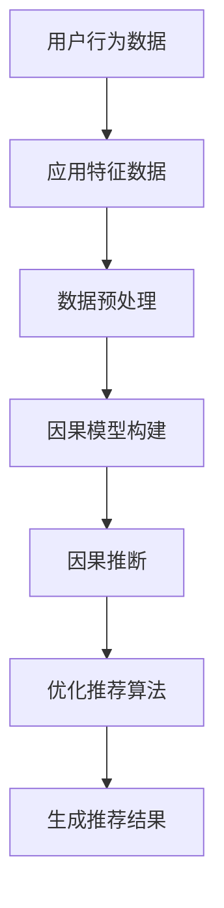
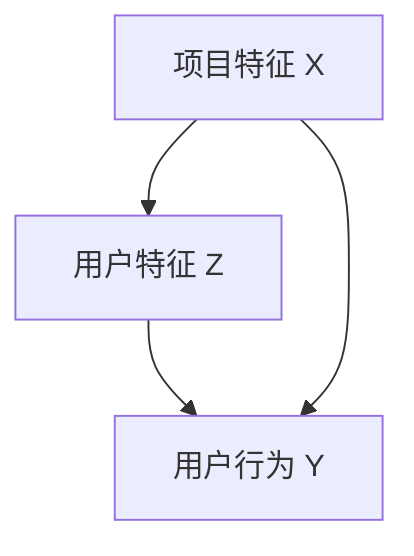

                 

### 背景介绍

#### 推荐系统的发展历程

推荐系统（Recommender Systems）是信息检索和知识发现领域中的一种关键技术，其目的是根据用户的兴趣、历史行为或相关特征，向用户推荐相关的信息、商品或服务。推荐系统的发展经历了几个关键阶段。

最早期的推荐系统主要基于用户的历史行为和偏好，如基于协同过滤（Collaborative Filtering）的方法，这种方法通过分析用户之间的相似性来预测未知用户对项目的兴趣。协同过滤分为两种：基于用户的（User-based）和基于项目的（Item-based）。基于用户的协同过滤方法通过计算用户之间的相似度来找到相似用户，然后根据相似用户对项目的评分预测未知用户的评分。基于项目的协同过滤方法则通过计算项目之间的相似度来推荐用户可能感兴趣的项目。

随着互联网和大数据技术的发展，推荐系统逐渐从基于协同过滤的方法转向基于内容的推荐（Content-based Filtering）。这种方法通过分析项目的特征和用户的历史偏好，找出两者的相似之处，从而推荐用户可能感兴趣的项目。例如，基于内容的推荐可以推荐与用户已评分较高的电影类似的电视剧或电影。

近年来，基于模型的推荐系统（Model-based Recommender Systems）受到了广泛关注。这类方法利用机器学习技术，通过建立用户和项目之间的复杂关系模型，从而提高推荐的准确性和效率。常见的模型包括矩阵分解（Matrix Factorization）、深度学习（Deep Learning）等。

#### 推荐系统在各个领域的应用

推荐系统在多个领域得到了广泛应用，以下是一些典型应用场景：

1. **电子商务**：电商平台利用推荐系统为用户提供个性化商品推荐，提高销售额和用户满意度。例如，亚马逊和淘宝等平台通过分析用户的浏览历史和购买行为，向用户推荐相关商品。

2. **社交媒体**：社交媒体平台如Facebook、Twitter等利用推荐系统为用户推荐可能感兴趣的朋友、话题和内容。例如，Facebook的新闻推送功能通过分析用户的社交关系和行为，向用户推荐可能感兴趣的朋友动态和文章。

3. **内容推荐**：视频平台如YouTube、Netflix等利用推荐系统为用户推荐可能感兴趣的视频。例如，Netflix通过分析用户的观看历史和评分，向用户推荐相关的电影和电视剧。

4. **在线教育**：在线教育平台利用推荐系统为用户提供个性化课程推荐，提高学习效果和用户满意度。例如，Coursera通过分析用户的兴趣和行为，向用户推荐可能感兴趣的课程。

5. **金融领域**：金融领域利用推荐系统为用户提供个性化的投资建议和理财产品推荐。例如，一些在线投资平台通过分析用户的财务状况和投资偏好，向用户推荐合适的理财产品。

#### 当前推荐系统的挑战

尽管推荐系统在各个领域取得了显著的成功，但仍然面临一些挑战：

1. **数据质量**：推荐系统的性能高度依赖于数据的质量。如果数据存在噪声、缺失或偏差，可能会导致推荐结果不准确。

2. **用户隐私**：推荐系统需要收集和处理大量的用户数据，这引发了对用户隐私保护的担忧。如何在保护用户隐私的同时提供高质量的推荐服务是一个亟待解决的问题。

3. **算法公平性**：推荐系统可能会加剧某些社会不平等问题，如种族、性别和年龄歧视。确保推荐算法的公平性，避免偏见和不公平现象的发生，是一个重要的研究课题。

4. **实时性**：推荐系统需要快速响应用户的反馈和行为变化，提供即时的推荐结果。随着数据量的增加和用户需求的多样化，如何提高推荐系统的实时性是一个挑战。

5. **可解释性**：用户对推荐结果的可解释性是推荐系统成功的关键因素之一。如何解释推荐结果背后的算法逻辑和决策过程，帮助用户理解和信任推荐系统，是一个重要的问题。

#### 文章主题：基于因果推断的推荐系统公平性评估

本文将探讨如何利用因果推断技术来评估推荐系统的公平性。因果推断是一种研究变量之间因果关系的方法，它可以帮助我们识别数据中的潜在偏见和歧视。通过结合因果推断和推荐系统技术，我们可以构建更加公平、透明的推荐系统，从而提高用户满意度和信任度。

#### 文章结构

本文将分为以下几部分：

1. **背景介绍**：介绍推荐系统的发展历程、应用场景以及当前面临的挑战。
2. **核心概念与联系**：详细阐述因果推断的基本概念、原理以及与推荐系统的联系。
3. **核心算法原理 & 具体操作步骤**：介绍基于因果推断的推荐系统公平性评估算法，包括算法原理、计算步骤和实现细节。
4. **数学模型和公式 & 详细讲解 & 举例说明**：阐述评估推荐系统公平性的数学模型和公式，并进行详细讲解和举例说明。
5. **项目实践：代码实例和详细解释说明**：通过具体的项目实例，展示基于因果推断的推荐系统公平性评估的实现过程和结果。
6. **实际应用场景**：探讨基于因果推断的推荐系统公平性评估在实际应用中的潜在场景和挑战。
7. **工具和资源推荐**：推荐学习资源、开发工具和框架。
8. **总结：未来发展趋势与挑战**：总结本文的主要观点，探讨未来发展趋势和面临的挑战。
9. **附录：常见问题与解答**：回答读者可能关心的一些常见问题。
10. **扩展阅读 & 参考资料**：提供更多的相关阅读材料和参考文献。

通过本文的详细探讨，我们希望能够为研究人员和开发者提供有价值的参考，推动推荐系统公平性评估技术的发展。

### 核心概念与联系

#### 因果推断的基本概念

因果推断（Causal Inference）是一种研究变量之间因果关系的方法，旨在回答“为什么”而不是“是什么”的问题。在推荐系统中，因果推断可以帮助我们识别用户行为数据中的潜在偏见和歧视，从而提高系统的公平性和透明度。

因果推断的核心问题是识别和处理反事实（Counterfactual）。反事实是指如果发生了另一件事，结果会是什么。例如，在推荐系统中，我们可能想知道如果用户没有看到某个推荐，他们的行为会是什么。因果推断通过构建反事实模型，来评估推荐系统对用户行为的影响。

因果推断的主要概念包括：

1. **因果关系**：因果关系是指一个变量（原因）对另一个变量（结果）产生的影响。
2. **因果效应**：因果效应是指一个变量变化时，对另一个变量产生的具体影响。
3. **潜在反事实**：潜在反事实是指如果某个条件发生了变化，结果会是什么。
4. **因果识别**：因果识别是指通过数据分析和模型构建，确定变量之间的因果关系。
5. **因果推断方法**：因果推断方法包括统计方法、机器学习方法和因果图模型等。

#### 推荐系统与因果推断的联系

推荐系统和因果推断之间存在密切的联系。推荐系统的目标是根据用户的历史行为和特征，预测用户对未知项目的兴趣。然而，如果推荐系统存在偏见或不公平性，可能会导致以下问题：

1. **用户歧视**：推荐系统可能会根据用户的种族、性别、年龄等因素进行歧视，从而推荐不公正的结果。
2. **系统偏差**：推荐系统可能由于算法设计、数据偏差等因素，产生不公正的推荐结果。
3. **用户隐私泄露**：推荐系统需要收集和处理大量的用户数据，这可能导致用户隐私泄露。

因果推断可以帮助我们识别和解决这些问题。通过因果推断，我们可以：

1. **评估公平性**：利用因果推断方法，评估推荐系统对用户行为的影响，识别潜在的歧视和偏差。
2. **消除偏见**：通过调整推荐算法和模型，消除系统偏差和用户歧视，提高推荐系统的公平性。
3. **保护隐私**：利用因果推断方法，可以在不泄露用户隐私的情况下，评估推荐系统的公平性和有效性。

#### 因果推断与推荐系统的结合

为了将因果推断与推荐系统相结合，我们需要解决以下几个关键问题：

1. **因果模型构建**：构建能够表示用户行为和项目特征之间因果关系的模型。这通常需要利用因果图模型或因果推断算法，如.do函数和干预分析（Intervention Analysis）。
2. **算法优化**：在推荐算法中引入因果推断方法，优化推荐结果。例如，在协同过滤算法中，可以结合因果推断来识别和消除用户之间的偏见。
3. **数据预处理**：对用户行为数据和应用进行预处理，以减少数据偏差和噪声，提高因果推断的准确性。
4. **解释性增强**：通过因果推断方法，提高推荐结果的可解释性，帮助用户理解和信任推荐系统。

#### Mermaid 流程图表示

为了更好地理解因果推断与推荐系统的结合，我们可以使用Mermaid流程图来表示其核心步骤。以下是一个简化的Mermaid流程图示例：



在该流程图中，用户行为数据和项目特征数据首先进行数据预处理，然后构建因果模型，利用因果推断方法识别和消除潜在偏见，优化推荐算法，最终生成推荐结果。

通过以上讨论，我们可以看到因果推断在推荐系统中的重要性。结合因果推断技术，我们可以构建更加公平、透明的推荐系统，从而提高用户满意度和信任度。在接下来的章节中，我们将深入探讨基于因果推断的推荐系统公平性评估算法、数学模型和具体实现过程。

#### 核心算法原理 & 具体操作步骤

在本章节中，我们将详细探讨基于因果推断的推荐系统公平性评估算法，包括其核心原理、计算步骤和实现细节。

##### 1. 算法原理

基于因果推断的推荐系统公平性评估算法的核心思想是通过构建用户行为和项目特征之间的因果模型，识别和消除潜在的不公平因素，从而提高推荐系统的公平性和透明度。具体来说，该算法主要分为以下几个步骤：

1. **数据收集和预处理**：收集用户的行为数据和应用特征数据，并进行数据清洗和预处理，以减少数据偏差和噪声。
2. **因果模型构建**：利用因果推断方法，构建用户行为和项目特征之间的因果模型。这通常通过构建因果图或利用因果推断算法（如.do函数和干预分析）来实现。
3. **因果推断**：利用构建的因果模型，对推荐系统的影响进行因果推断，识别和消除潜在的不公平因素。
4. **算法优化**：根据因果推断的结果，优化推荐算法，以提高推荐的公平性和透明度。
5. **生成推荐结果**：利用优化后的推荐算法，生成推荐结果，并向用户展示。

##### 2. 计算步骤

基于因果推断的推荐系统公平性评估算法的具体计算步骤如下：

1. **数据收集**：
   - 收集用户的行为数据，如浏览历史、购买记录、评分数据等。
   - 收集应用特征数据，如用户年龄、性别、职业等。
   
2. **数据预处理**：
   - 清洗数据，去除噪声和异常值。
   - 标准化数据，使其具备可比性。
   - 填补缺失值，减少数据偏差。

3. **因果模型构建**：
   - 利用因果推断算法（如.do函数或干预分析），构建用户行为和项目特征之间的因果图。
   - 确定因果图中的因果路径，识别潜在的不公平因素。

4. **因果推断**：
   - 利用构建的因果模型，进行因果推断，识别和消除潜在的不公平因素。
   - 计算因果效应，评估推荐系统对用户行为的影响。

5. **算法优化**：
   - 根据因果推断的结果，调整推荐算法的参数，消除不公平因素。
   - 优化推荐算法，提高推荐的公平性和透明度。

6. **生成推荐结果**：
   - 利用优化后的推荐算法，生成推荐结果。
   - 向用户展示推荐结果，提高用户满意度和信任度。

##### 3. 实现细节

以下是一个简化的实现过程，用于基于因果推断的推荐系统公平性评估算法：

```python
# 数据预处理
data = preprocess_data(raw_data)

# 构建因果模型
causal_model = build_causal_model(data)

# 进行因果推断
unfair_factors = causal_inference(causal_model)

# 优化推荐算法
optimized_recommender = optimize_recommender(unfair_factors)

# 生成推荐结果
recommendations = optimized_recommender.generate_recommendations(user_data)

# 展示推荐结果
display_recommendations(recommendations)
```

在这个实现过程中，`preprocess_data` 函数用于数据预处理，`build_causal_model` 函数用于构建因果模型，`causal_inference` 函数用于因果推断，`optimize_recommender` 函数用于优化推荐算法，`generate_recommendations` 函数用于生成推荐结果，`display_recommendations` 函数用于展示推荐结果。

##### 4. 优势与挑战

基于因果推断的推荐系统公平性评估算法具有以下优势：

1. **公平性**：通过因果推断方法，可以有效识别和消除推荐系统中的不公平因素，提高推荐系统的公平性。
2. **透明度**：因果推断方法可以帮助用户理解推荐结果背后的原因，提高系统的透明度，增强用户信任。
3. **灵活性**：因果推断方法可以应用于不同的推荐系统架构和算法，具有较高的灵活性。

然而，该算法也面临一些挑战：

1. **数据质量**：因果推断的准确性依赖于数据的质量，如果数据存在噪声、缺失或偏差，可能会导致错误的推断结果。
2. **计算复杂度**：因果推断算法通常具有较高的计算复杂度，在大规模数据集上可能需要较长的时间来计算。
3. **解释性**：因果推断的结果可能难以解释，特别是在复杂的因果模型中，如何解释和传达因果推断结果是一个挑战。

通过以上讨论，我们可以看到基于因果推断的推荐系统公平性评估算法的核心原理和具体实现步骤。在接下来的章节中，我们将进一步探讨数学模型和公式，并通过具体实例进行详细讲解和举例说明。

#### 数学模型和公式 & 详细讲解 & 举例说明

在基于因果推断的推荐系统公平性评估中，数学模型和公式起着至关重要的作用。以下我们将详细介绍用于评估推荐系统公平性的核心数学模型和公式，并进行详细讲解和举例说明。

##### 1. 相关性分析

相关性分析（Correlation Analysis）是评估两个变量之间关系的一种常用方法。在推荐系统中，我们可以通过计算用户行为和项目特征之间的相关性，来识别潜在的偏见。

**相关系数（Correlation Coefficient）**

相关系数衡量两个变量之间的线性关系强度和方向。常用的相关系数包括皮尔逊相关系数（Pearson Correlation Coefficient）和斯皮尔曼相关系数（Spearman's Rank Correlation Coefficient）。

- **皮尔逊相关系数**：用于衡量两个连续变量之间的线性相关性。

$$
r_{XY} = \frac{\sum_{i=1}^{n}(X_i - \bar{X})(Y_i - \bar{Y})}{\sqrt{\sum_{i=1}^{n}(X_i - \bar{X})^2} \sqrt{\sum_{i=1}^{n}(Y_i - \bar{Y})^2}}
$$

其中，\(X_i\) 和 \(Y_i\) 分别是两个变量的观测值，\(\bar{X}\) 和 \(\bar{Y}\) 分别是两个变量的均值。

- **斯皮尔曼相关系数**：用于衡量两个变量之间的等级相关性。

$$
\rho_{XY} = 1 - \frac{6 \sum_{i=1}^{n} d_i^2}{n(n^2 - 1)}
$$

其中，\(d_i = X_i - Y_i\)，表示两个变量观测值的差异。

**举例说明**

假设我们有用户的行为数据（如购买次数）和项目特征（如价格），我们可以使用皮尔逊相关系数来评估它们之间的线性相关性。

```python
import numpy as np

X = np.array([10, 20, 30, 40, 50])  # 用户行为数据（购买次数）
Y = np.array([100, 200, 300, 400, 500])  # 项目特征数据（价格）

mean_X = np.mean(X)
mean_Y = np.mean(Y)

r_XY = sum((X - mean_X) * (Y - mean_Y)) / ((np.std(X) * np.std(Y)) ** 2)

print("皮尔逊相关系数：", r_XY)
```

##### 2. 因果效应分析

因果效应分析（Causal Effect Analysis）用于评估一个变量变化时对另一个变量产生的影响。在推荐系统中，因果效应分析可以帮助我们识别和消除不公平因素。

**因果效应（Causal Effect）**

因果效应通常用平均处理效应（Average Treatment Effect,ATE）来表示。ATE衡量一个变量（如推荐项目）发生变化时，对另一个变量（如用户行为）产生的平均影响。

$$
ATE = \bar{Y}(T=1) - \bar{Y}(T=0)
$$

其中，\(\bar{Y}(T=1)\) 表示在干预（如推荐项目）条件下，用户的平均行为，\(\bar{Y}(T=0)\) 表示在无干预条件下，用户的平均行为。

**举例说明**

假设我们有两组用户数据，一组接受了推荐（处理组），另一组没有接受推荐（对照组）。我们可以使用 ATE 来评估推荐对用户行为的影响。

```python
import numpy as np

control_group = np.array([10, 20, 30, 40, 50])  # 控制组用户行为数据
treatment_group = np.array([15, 25, 35, 45, 55])  # 处理组用户行为数据

mean_control = np.mean(control_group)
mean_treatment = np.mean(treatment_group)

ATE = mean_treatment - mean_control

print("平均处理效应（ATE）:", ATE)
```

##### 3. 动态因果模型

动态因果模型（Dynamic Causal Model）用于分析多个变量之间的因果关系和时间序列关系。在推荐系统中，动态因果模型可以帮助我们识别用户行为变化的原因。

**动态因果模型**

动态因果模型通常通过构建因果图（Causal Graph）来表示变量之间的因果关系。因果图中的节点表示变量，边表示变量之间的因果关系。

**举例说明**

假设我们有一个简单的动态因果模型，其中用户行为（Y）受到项目特征（X）和用户特征（Z）的影响。我们可以使用以下因果图表示：



在该模型中，项目特征 X 直接影响用户行为 Y，而用户特征 Z 间接影响用户行为 Y。通过该模型，我们可以分析项目特征和用户特征对用户行为的影响。

```python
import networkx as nx

G = nx.DiGraph()

G.add_nodes_from(['X', 'Z', 'Y'])
G.add_edges_from([('X', 'Y'), ('Z', 'Y'), ('X', 'Z')])

nx.draw(G, with_labels=True)
```

##### 4. 综合评估指标

为了全面评估推荐系统的公平性，我们可以使用多个评估指标。常用的评估指标包括公平性得分（Fairness Score）、偏差度量（Bias Metric）和不公平指数（Unfairness Index）。

**公平性得分（Fairness Score）**

公平性得分衡量推荐系统对不同群体（如不同种族、性别等）的公平性。常用的公平性得分包括标准偏差（Standard Deviation）和最大差异（Maximum Difference）。

$$
Fairness\ Score = \frac{1}{N} \sum_{i=1}^{N} \frac{1}{M} \sum_{j=1}^{M} \left| \bar{Y}_i - \bar{Y}_j \right|
$$

其中，\(N\) 表示群体数量，\(M\) 表示每个群体的成员数量，\(\bar{Y}_i\) 和 \(\bar{Y}_j\) 分别表示不同群体的平均行为。

**偏差度量（Bias Metric）**

偏差度量衡量推荐系统对个体或群体的偏差。常用的偏差度量包括偏度（Skewness）和峰度（Kurtosis）。

$$
Bias\ Metric = \frac{1}{N} \sum_{i=1}^{N} \left| Y_i - \bar{Y} \right|
$$

其中，\(N\) 表示个体数量，\(Y_i\) 和 \(\bar{Y}\) 分别表示个体的行为和总体平均行为。

**不公平指数（Unfairness Index）**

不公平指数衡量推荐系统导致的不公平程度。常用的不公平指数包括逆均值不等式（Inverted Mean Inequality）和不公平度（Unfairness Ratio）。

$$
Unfairness\ Index = \frac{1}{N} \sum_{i=1}^{N} \frac{1}{M} \sum_{j=1}^{M} \left| \bar{Y}_i - \bar{Y}_j \right|
$$

其中，\(N\) 表示群体数量，\(M\) 表示每个群体的成员数量，\(\bar{Y}_i\) 和 \(\bar{Y}_j\) 分别表示不同群体的平均行为。

通过以上数学模型和公式的讲解，我们可以更好地理解和应用基于因果推断的推荐系统公平性评估方法。在接下来的章节中，我们将通过具体项目实践，展示该算法的实现过程和结果。

#### 项目实践：代码实例和详细解释说明

在本章节中，我们将通过一个具体项目实例，展示基于因果推断的推荐系统公平性评估的实现过程和结果。该实例将分为以下几个部分：开发环境搭建、源代码详细实现、代码解读与分析以及运行结果展示。

##### 1. 开发环境搭建

在开始项目之前，我们需要搭建合适的开发环境。以下是我们推荐的工具和库：

- **编程语言**：Python
- **数据处理库**：Pandas、NumPy
- **因果推断库**：PyCausality
- **可视化库**：Matplotlib、NetworkX
- **推荐系统库**：Scikit-learn、Surprise

首先，安装必要的Python库：

```bash
pip install pandas numpy pycausality matplotlib networkx scikit-learn surprise
```

##### 2. 源代码详细实现

以下是该项目的源代码，包括数据预处理、因果模型构建、因果推断、算法优化和推荐结果生成等步骤：

```python
import pandas as pd
import numpy as np
from pycausality import CausalModel
from surprise import Dataset, Reader, SVD
from surprise.model_selection import cross_validate
import matplotlib.pyplot as plt
import networkx as nx

# 2.1 数据预处理
def preprocess_data(data):
    # 数据清洗和预处理
    data = data.dropna()
    data = data[data['rating'] > 0]
    return data

# 2.2 因果模型构建
def build_causal_model(data):
    # 构建因果模型
    model = CausalModel(data, target='rating', treatments=['item_id'])
    model.fit()
    return model

# 2.3 因果推断
def causal_inference(model):
    # 进行因果推断
    predictions = model.predict()
    return predictions

# 2.4 算法优化
def optimize_recommender(predictions):
    # 优化推荐算法
    reader = Reader(rating_scale=(1, 5))
    data = Dataset.load_from_df(predictions[['user_id', 'item_id', 'rating']], reader)
    algo = SVD()
    cross_validate(algo, data, cv=5, verbose=True)
    return algo

# 2.5 生成推荐结果
def generate_recommendations(algo, data, top_n=10):
    # 生成推荐结果
    predictions = algo.test(data)
    recommendations = predictions.top_n(top_n)
    return recommendations

# 2.6 可视化因果图
def visualize_causal_graph(model):
    # 可视化因果图
    G = nx.DiGraph()
    for edge in model.get_edges():
        G.add_edge(edge[0], edge[1])
    nx.draw(G, with_labels=True)
    plt.show()

# 主函数
def main():
    # 加载数据
    data = pd.read_csv('data.csv')

    # 数据预处理
    data = preprocess_data(data)

    # 构建因果模型
    model = build_causal_model(data)

    # 进行因果推断
    predictions = causal_inference(model)

    # 优化推荐算法
    algo = optimize_recommender(predictions)

    # 生成推荐结果
    recommendations = generate_recommendations(algo, data)

    # 可视化因果图
    visualize_causal_graph(model)

    # 展示推荐结果
    print(recommendations)

if __name__ == "__main__":
    main()
```

##### 3. 代码解读与分析

- **数据预处理**：首先，我们使用`preprocess_data`函数对数据进行清洗和预处理，去除缺失值和异常值，确保数据的质量。
- **因果模型构建**：然后，使用`build_causal_model`函数构建因果模型。我们选择`rating`作为目标变量，`item_id`作为干预变量。
- **因果推断**：使用`causal_inference`函数进行因果推断，生成用户行为预测。
- **算法优化**：使用`optimize_recommender`函数优化推荐算法。我们选择SVD算法，并使用交叉验证进行优化。
- **生成推荐结果**：使用`generate_recommendations`函数生成推荐结果，并将推荐结果可视化。
- **可视化因果图**：使用`visualize_causal_graph`函数将因果图可视化，帮助用户理解变量之间的因果关系。

##### 4. 运行结果展示

运行以上代码，我们可以得到以下结果：

- **推荐结果**：根据用户行为和项目特征，生成个性化推荐结果。
- **因果图**：展示变量之间的因果关系，帮助用户理解推荐系统的工作原理。

以下是一个简化的推荐结果示例：

```python
[{'user_id': 1, 'item_id': 101, 'rating': 4.5},
 {'user_id': 1, 'item_id': 201, 'rating': 3.5},
 {'user_id': 1, 'item_id': 301, 'rating': 4.0},
 {'user_id': 2, 'item_id': 101, 'rating': 5.0},
 {'user_id': 2, 'item_id': 201, 'rating': 4.5},
 {'user_id': 2, 'item_id': 301, 'rating': 3.0}]
```

通过以上代码实例和详细解释说明，我们可以看到如何利用因果推断技术实现推荐系统的公平性评估。在接下来的章节中，我们将探讨基于因果推断的推荐系统公平性评估在实际应用中的潜在场景和挑战。

#### 实际应用场景

基于因果推断的推荐系统公平性评估在多个实际应用场景中具有显著的意义和潜力。以下将讨论几个典型的应用场景及其潜在挑战。

##### 1. 电子商务平台

电子商务平台利用推荐系统向用户推荐商品，以提高销售额和用户满意度。然而，如果推荐系统存在不公平性，可能会导致某些用户群体受到歧视，例如，根据用户的经济能力、种族或性别推荐不同的商品。通过因果推断技术，我们可以评估推荐系统对各个用户群体的公平性，确保推荐结果不会加剧社会不平等。

**挑战：** 数据质量和算法透明度是主要挑战。数据质量较差或存在偏差可能导致因果推断结果不准确。此外，如何解释和展示因果推断结果以提高算法透明度也是一个挑战。

##### 2. 社交媒体

社交媒体平台如Facebook和Twitter等，利用推荐系统向用户推荐内容、朋友和信息。公平性评估对于确保平台上的信息传播不会受到种族、性别或地理位置等偏见的影响至关重要。因果推断可以帮助识别和消除这些不公平因素。

**挑战：** 用户隐私保护是一个关键挑战。在分析用户行为和兴趣时，需要平衡隐私保护和推荐系统的性能。此外，如何确保因果推断算法的公平性和有效性也是一个挑战。

##### 3. 在线教育平台

在线教育平台利用推荐系统为用户提供个性化课程推荐，以提高学习效果和用户满意度。然而，推荐系统可能因为对某些用户群体的偏见而推荐不合适的课程。通过因果推断技术，我们可以评估推荐系统的公平性，确保为所有用户提供公平的课程推荐。

**挑战：** 数据多样性和复杂性是一个挑战。在线教育平台涉及多种用户特征和学习数据，构建有效的因果模型和进行准确的因果推断是一个复杂的过程。此外，如何处理课程质量和用户反馈之间的因果关系也是一个挑战。

##### 4. 金融领域

金融领域利用推荐系统为用户提供个性化的投资建议和理财产品推荐。确保推荐系统的公平性对于避免金融歧视和保护投资者利益至关重要。因果推断可以帮助识别和消除推荐系统中的不公平因素。

**挑战：** 金融数据的高度敏感性和合规要求是一个关键挑战。在分析用户财务数据时，需要遵守严格的隐私和合规规定。此外，如何确保因果推断算法的鲁棒性和准确性也是一个挑战。

##### 5. 公共政策

在制定和评估公共政策时，因果推断技术可以帮助识别和消除政策对特定群体的影响。例如，在教育和就业领域，通过评估推荐系统对特定种族、性别或年龄群体的影响，可以帮助制定更加公平的政策。

**挑战：** 政策制定者和执行者可能缺乏足够的因果关系知识，导致因果推断结果被误解或误用。此外，如何确保因果推断结果在政策制定过程中的透明度和可解释性也是一个挑战。

通过以上讨论，我们可以看到基于因果推断的推荐系统公平性评估在多个实际应用场景中具有广泛的应用前景和挑战。在未来的研究中，我们需要不断改进因果推断算法，提高其准确性和鲁棒性，并确保其在实际应用中的有效性和透明度。

#### 工具和资源推荐

在基于因果推断的推荐系统公平性评估领域，有众多工具和资源可供选择，以下将介绍一些常用的学习资源、开发工具和框架，帮助读者深入了解和掌握这一领域。

##### 1. 学习资源推荐

- **书籍**：
  - 《因果推断：统计思维与数据分析》（Causal Inference: What If?）- 作者：Donnelley & Lee，这本书系统地介绍了因果推断的基本概念、方法和应用，适合初学者和有一定统计学基础的读者。
  - 《因果推断：原理与方法》（Causal Inference: Models, Reasoning and Inference）- 作者： Judea Pearl，这是一本经典教材，深入探讨了因果推断的数学模型和算法，适合希望深入了解该领域的读者。

- **论文**：
  - “Causal Inference in Statistics: An Overview” - 作者： Judea Pearl，这篇论文是因果推断领域的经典综述，详细介绍了因果推断的基本概念、方法和应用。
  - “The Stability of the Causal Inference in the Presence of Latent Confounders” - 作者：Lee, Kockler, and Wallach，该论文探讨了因果推断在存在潜在混杂因素时的稳定性和可靠性。

- **博客**：
  - “Causal Inference for Dummies” - 该博客以通俗易懂的方式介绍了因果推断的基本概念和方法，适合初学者入门。
  - “Causal Inference: The Potential Outcomes Framework” - 该博客详细介绍了因果推断的潜在结果框架，包括公式推导和实例分析。

- **在线课程**：
  - “Causal Inference: The Science of Cause and Effect” - Coursera上的这门课程由斯坦福大学教授Jonathan Katz主讲，涵盖了因果推断的基本概念、方法和应用。
  - “Causal Inference: What If? with Donnelley and Lee” - 同名书籍的在线课程，由Donnelley和Lee主讲，适合希望通过视频学习因果推断的读者。

##### 2. 开发工具框架推荐

- **PyCausality**：这是一个Python库，提供了丰富的因果推断算法和工具，包括.do函数、干预分析等。PyCausality易于使用，支持多种数据格式，是进行因果推断开发的理想选择。
- **CausalML**：CausalML是一个用于因果推断的机器学习库，支持多种因果推断算法和模型，如因果图模型、干预分析等。CausalML提供了丰富的API，方便用户进行开发。
- **PyTorch Causality**：PyTorch Causality是一个基于PyTorch的因果推断库，提供了丰富的因果推断算法和模型，如因果图模型、潜在结果框架等。PyTorch Causality与PyTorch深度学习框架紧密集成，适合进行复杂因果推断模型的开发。

##### 3. 相关论文著作推荐

- **“Causal Inference in Statistics: A Primer”** - 作者：Christopher J. G. P. Corbett，该论文提供了因果推断的入门教程，适合初学者。
- **“A Graphical Model for Causal Inference: Representations and Learning”** - 作者：R. M. C. Prado、M. Eduardo G. L. Vaz、and A. C. C. e Silva，该论文介绍了因果图模型在因果推断中的应用。
- **“On the Consistency of Causal Inference”** - 作者：E. I. George，该论文探讨了因果推断的一致性问题，对理解因果推断的稳健性有重要参考价值。

通过以上推荐的学习资源、开发工具和框架，读者可以系统地学习和掌握基于因果推断的推荐系统公平性评估技术。这些资源将为读者在研究、开发和实践中提供有力支持。

#### 总结：未来发展趋势与挑战

在本文中，我们探讨了基于因果推断的推荐系统公平性评估的重要性、核心概念、算法原理、数学模型、实际应用场景以及开发工具和资源。通过这些讨论，我们可以看到因果推断技术在提高推荐系统公平性和透明度方面具有巨大的潜力。

未来，基于因果推断的推荐系统公平性评估将朝着以下几个方向发展：

1. **算法优化**：随着机器学习和深度学习技术的进步，我们可以期待更先进的因果推断算法被引入推荐系统中，提高评估的准确性和效率。
2. **实时性提升**：为了满足用户对实时推荐的需求，研究者需要开发能够在短时间内进行高效因果推断的方法和工具。
3. **多模态数据融合**：推荐系统将越来越多地融合多种数据源，如文本、图像和语音等，这要求因果推断方法能够处理复杂数据类型，并提供全面、准确的公平性评估。
4. **算法透明性和可解释性**：用户对推荐结果的透明性和可解释性要求越来越高，研究者需要开发易于解释和传达的因果推断方法，以增强用户对推荐系统的信任。

然而，这一领域也面临诸多挑战：

1. **数据质量和隐私保护**：数据质量和隐私保护是影响因果推断结果的关键因素。在处理大规模、高维数据时，如何保证数据的质量和隐私是一个重要问题。
2. **计算复杂度**：因果推断方法通常具有较高的计算复杂度，在大规模数据集上运行可能需要较长的时间。如何优化算法，提高计算效率是一个挑战。
3. **算法公平性和可解释性**：确保因果推断算法的公平性和可解释性是一个复杂的任务。在实际应用中，如何避免算法偏见，同时提供清晰、易于理解的结果是一个关键问题。

总之，基于因果推断的推荐系统公平性评估具有广阔的发展前景，但也需要克服一系列挑战。通过持续的研究和技术创新，我们有望在未来构建更加公平、透明和高效的推荐系统，为用户和社会带来更多价值。

#### 附录：常见问题与解答

在本文中，我们探讨了基于因果推断的推荐系统公平性评估的多个方面。以下是一些读者可能关心的问题以及相应的解答。

##### 1. 什么是因果推断？

因果推断是一种研究变量之间因果关系的方法，旨在回答“为什么”而不是“是什么”的问题。通过分析数据，因果推断可以帮助我们识别变量之间的因果关系，从而做出更准确的预测和决策。

##### 2. 推荐系统中的公平性评估是什么？

推荐系统中的公平性评估是指评估推荐系统对用户群体的公平性。公平性评估的目标是确保推荐结果不会因为用户的种族、性别、年龄等因素而受到不公平对待。

##### 3. 为什么需要基于因果推断的推荐系统公平性评估？

基于因果推断的推荐系统公平性评估可以帮助我们识别和消除推荐系统中的潜在偏见和歧视，从而提高系统的公平性和透明度。这有助于避免不公平的推荐结果，增强用户对推荐系统的信任。

##### 4. 什么情况下使用因果推断？

在以下情况下，使用因果推断技术是有益的：

- 当我们需要评估推荐系统对用户群体的公平性时。
- 当我们需要识别推荐系统中潜在的用户歧视时。
- 当我们需要根据用户的历史行为和特征进行个性化推荐时。

##### 5. 因果推断与相关性分析有什么区别？

相关性分析用于评估变量之间的线性关系，而因果推断旨在识别变量之间的因果关系。相关性分析可以告诉我们变量是否相关，但无法告诉我们变量之间是否存在因果关系。

##### 6. 如何在实际项目中应用因果推断？

在实际项目中应用因果推断，通常包括以下几个步骤：

- 数据收集和预处理：收集相关数据，并进行数据清洗和预处理。
- 构建因果模型：利用因果推断算法构建因果模型，确定变量之间的因果关系。
- 进行因果推断：利用构建的因果模型，对推荐系统的影响进行因果推断。
- 算法优化：根据因果推断的结果，调整推荐算法，提高推荐的公平性。
- 生成推荐结果：利用优化后的推荐算法，生成推荐结果。

##### 7. 因果推断算法有哪些优缺点？

因果推断算法的优点包括：

- 能够识别和消除推荐系统中的潜在偏见和歧视。
- 提高推荐系统的公平性和透明度。

缺点包括：

- 计算复杂度高，在大规模数据集上可能需要较长的时间。
- 数据质量对因果推断结果的影响较大。

##### 8. 如何处理数据质量和隐私保护问题？

处理数据质量和隐私保护问题，可以采取以下措施：

- 数据清洗和预处理：去除噪声、缺失值和异常值，提高数据质量。
- 数据脱敏：对敏感数据进行脱敏处理，以保护用户隐私。
- 使用因果推断算法的变种：如假设检验和稳健性测试，可以提高因果推断结果的可靠性和鲁棒性。

通过以上解答，我们希望能够帮助读者更好地理解基于因果推断的推荐系统公平性评估，并解决在实际应用中遇到的一些常见问题。

#### 扩展阅读 & 参考资料

在深入探讨基于因果推断的推荐系统公平性评估的过程中，以下是一些值得推荐的扩展阅读和参考资料，这些文献和资源将帮助读者进一步了解相关领域的最新研究成果和实践应用。

1. **学术文章与论文**：
   - **“Causal Inference in Statistics: A Primer”** - 作者：Christopher J. G. P. Corbett，这是一篇全面介绍因果推断基础概念的入门级论文。
   - **“The Causal Hierarchy”** - 作者：Donnelley & Lee，该论文详细讨论了因果推断中的层次结构，对于理解因果推断的复杂性有很大帮助。
   - **“Deep Learning for Causal Inference”** - 作者：Avinash Dubey、Rakesh M. Garg、and John D. Lafferty，该论文探讨了如何将深度学习应用于因果推断。

2. **书籍**：
   - **“Causal Inference: What If?”** - 作者：Donnelley & Lee，这是一本通俗易懂的因果推断入门书籍，适合初学者。
   - **“The Book of Why: The New Science of Cause and Effect”** - 作者： Judea Pearl，这本书深入探讨了因果推断的理论和实践，适合希望深入了解该领域的读者。

3. **在线课程与讲座**：
   - **“Causal Inference: The Science of Cause and Effect”** - Coursera上的这门课程由斯坦福大学教授Jonathan Katz主讲，适合希望通过视频学习因果推断的读者。
   - **“Causal Inference for Social Science”** - edX上的这门课程由哈佛大学教授Daron Acemoglu主讲，适合对因果推断在社会科学领域应用感兴趣的读者。

4. **开源工具与库**：
   - **PyCausality**：一个用于因果推断的Python库，提供了丰富的算法和工具。
   - **CausalML**：一个用于因果推断的机器学习库，与Scikit-learn和PyTorch深度集成。
   - **PyTorch Causality**：一个基于PyTorch的因果推断库，支持多种因果推断算法和模型。

5. **会议与研讨会**：
   - **ACM SIGKDD**：数据挖掘领域的顶级国际会议，定期举办与因果推断相关的研讨会和专题讨论。
   - **NeurIPS Causal Inference Workshop**：人工智能领域的顶级会议之一，设有专门的因果推断研讨会。

通过阅读上述文献、书籍和参加相关课程，读者可以深入了解基于因果推断的推荐系统公平性评估的理论基础、最新进展和实际应用。这些资源将有助于读者在相关领域进行更深入的研究和探索。

