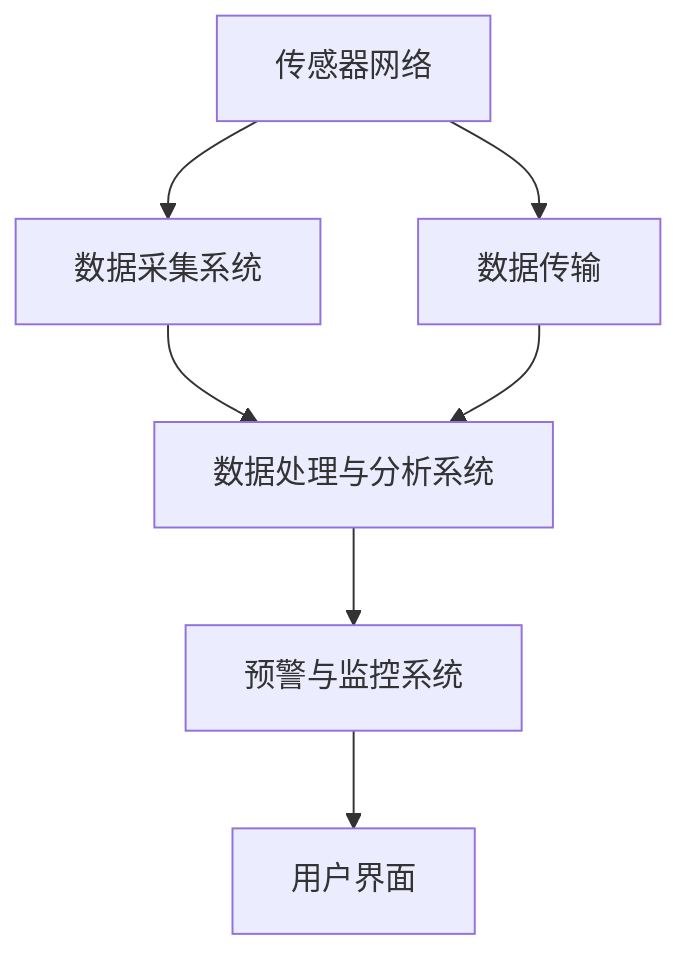

                 

### 背景介绍

#### 井盖监控系统的重要性

随着城市化进程的加速，地下管网的建设和维护变得越来越复杂。井盖，作为城市地下管道系统的关键组成部分，其安全性和可靠性直接关系到城市的正常运行和居民的生活质量。然而，传统的井盖监控系统存在诸多不足，难以满足现代城市管理的需求。因此，开发一种基于大数据的井盖监控系统，对于提升城市管理水平、保障公共安全具有重要的现实意义。

#### 传统的井盖监控系统局限性

1. **监测手段有限**：传统井盖监控系统主要依赖于人工巡检和定期检测，这种方式效率低下，难以实时、全面地监测井盖的状态。
2. **信息处理能力不足**：传统系统缺乏强大的数据处理能力，无法对海量数据进行有效分析和利用。
3. **预警机制不完善**：传统井盖监控系统预警机制相对滞后，往往无法在井盖发生故障前及时发现问题，导致事故发生。
4. **维护成本高**：由于监测手段和技术的限制，传统系统在维护和更新上成本高昂。

#### 基于大数据的井盖监控系统的优势

1. **实时监控**：通过传感器技术和大数据分析，系统能够实时监测井盖的状态，包括位置、温度、压力等。
2. **高效数据处理**：利用大数据技术，系统能够高效处理和分析海量数据，快速识别潜在问题。
3. **智能预警**：基于数据分析和预测模型，系统能够提前预警，避免故障发生。
4. **降低维护成本**：通过自动化监测和智能维护，系统可以大幅降低维护成本。

### 总结

基于大数据的井盖监控系统不仅能够提高城市管理的效率，还能保障公共安全，具有广阔的应用前景。本文将深入探讨这一系统的设计原理、技术实现以及实际应用场景，为相关研究和开发提供参考。下一章节，我们将详细解析井盖监控系统的核心概念与架构。

---

#### 关键词

- 井盖监控系统
- 大数据
- 实时监控
- 智能预警
- 城市管理

---

#### 摘要

本文旨在探讨基于大数据技术的井盖监控系统设计与应用。首先，分析了传统井盖监控系统的局限性，阐述了基于大数据技术的井盖监控系统在实时监控、数据处理、智能预警和成本控制等方面的优势。随后，详细介绍了井盖监控系统的核心概念与架构，包括传感器、数据采集与处理、数据分析与预警等模块。最后，通过实际应用案例，展示了系统的实施效果和未来发展趋势。本文将为相关领域的学者和工程师提供有价值的参考和指导。

---

接下来，我们将在第二章节深入探讨井盖监控系统的核心概念与架构，包括系统的组成、各模块的功能以及它们之间的联系。

### 核心概念与联系

#### 系统的组成部分

基于大数据的井盖监控系统主要由以下几个关键部分组成：

1. **传感器网络**：包括温度传感器、压力传感器、位移传感器等，用于实时监测井盖的状态。
2. **数据采集系统**：负责收集传感器数据，并将数据传输到数据中心进行处理。
3. **数据处理与分析系统**：对采集到的数据进行清洗、整合和分析，识别潜在问题。
4. **预警与监控系统**：基于数据分析结果，生成预警信息，并通过多种渠道通知相关管理部门。
5. **用户界面**：提供系统管理和监控功能，用户可以通过界面查看实时数据、历史数据和预警信息。

#### 各模块的功能

1. **传感器网络**：传感器网络是系统的感知层，通过安装在井盖上的各种传感器，实时采集井盖的状态数据，如温度、压力、位移等。
2. **数据采集系统**：数据采集系统负责将传感器数据传输到数据中心。通常采用无线传输技术，如Wi-Fi、LoRa、NB-IoT等，以确保数据的及时性和准确性。
3. **数据处理与分析系统**：数据处理与分析系统位于系统的核心，它对采集到的数据进行清洗、去噪、聚合等处理，然后利用大数据分析技术，如机器学习、深度学习等，对数据进行分析，识别异常情况。
4. **预警与监控系统**：预警与监控系统是系统的决策层，根据数据分析结果，自动生成预警信息，并通过短信、邮件、APP推送等方式通知相关部门，实现快速响应。
5. **用户界面**：用户界面是系统的输出层，提供直观的用户操作体验。用户可以通过界面查看实时数据、历史数据和预警信息，进行系统配置和管理。

#### 系统的工作流程

井盖监控系统的工作流程可以概括为以下几个步骤：

1. **数据采集**：传感器网络实时采集井盖的状态数据，如温度、压力、位移等。
2. **数据传输**：采集到的数据通过数据采集系统传输到数据中心。
3. **数据处理**：数据中心对数据进行清洗、去噪、聚合等处理，形成统一的数据格式。
4. **数据分析**：利用大数据分析技术，对处理后的数据进行分析，识别异常情况。
5. **预警生成**：根据分析结果，生成预警信息，并发送通知。
6. **用户反馈**：用户通过用户界面查看实时数据和预警信息，进行系统管理和配置。

#### Mermaid 流程图

以下是井盖监控系统核心概念与架构的 Mermaid 流程图：



在这个流程图中，各节点表示系统的关键部分，箭头表示数据流向。通过这个流程图，我们可以清晰地了解井盖监控系统各模块的功能和相互关系。

### 总结

井盖监控系统基于大数据技术，通过传感器网络、数据采集、数据处理与分析、预警与监控以及用户界面等多个模块的协同工作，实现对井盖状态的实时监测和智能预警。下一章节，我们将深入探讨系统中的核心算法原理与具体操作步骤，进一步了解该系统的技术实现。

---

在下一章节中，我们将详细讲解基于大数据的井盖监控系统中的核心算法原理和具体操作步骤。

### 核心算法原理 & 具体操作步骤

#### 传感器数据采集与预处理

井盖监控系统中的核心算法首先依赖于高质量的传感器数据。这些数据通过安装在井盖上的各种传感器实时采集，包括温度传感器、压力传感器、位移传感器等。数据采集完成后，首先需要进行预处理，包括数据清洗、去噪、滤波等步骤，以确保数据的准确性和完整性。

1. **数据清洗**：数据清洗的主要目的是去除无效数据或错误数据。例如，传感器可能因为环境干扰或故障产生异常数据，这些数据需要被过滤掉。
2. **去噪**：去噪的目的是减少传感器数据中的随机噪声。可以通过滑动平均、卡尔曼滤波等算法来实现。
3. **滤波**：滤波的目的是去除传感器数据中的周期性干扰信号。例如，可以使用低通滤波器去除高频噪声。

#### 数据特征提取

预处理完成后，需要对传感器数据进行特征提取。特征提取是数据分析和建模的重要步骤，目的是将原始数据转化为能够反映井盖状态的关键特征。常用的特征提取方法包括：

1. **时域特征**：包括均值、标准差、方差等统计特征。
2. **频域特征**：通过傅里叶变换提取数据中的频率成分。
3. **时频特征**：结合时域和频域信息，如小波变换。

#### 数据建模与预测

在特征提取的基础上，可以使用机器学习算法建立数据预测模型。常见的算法包括线性回归、支持向量机、神经网络等。下面将详细介绍线性回归和支持向量机这两种算法。

##### 线性回归

线性回归是一种简单而有效的预测模型，适用于线性关系较强的数据。其基本原理是通过拟合一条直线，将输入特征映射到输出值。具体步骤如下：

1. **数据准备**：将特征数据和标签数据分开，特征数据作为输入，标签数据作为输出。
2. **模型训练**：使用训练数据集，通过最小二乘法拟合出线性回归模型。
3. **模型评估**：使用测试数据集评估模型的预测性能，常用的评估指标包括均方误差（MSE）、决定系数（R²）等。
4. **模型应用**：将训练好的模型应用于实际数据，进行预测。

##### 支持向量机

支持向量机（SVM）是一种强大的分类和回归模型，特别适用于非线性关系的数据。其基本原理是通过找到最佳的超平面，将不同类别的数据分开。具体步骤如下：

1. **数据准备**：与线性回归类似，将特征数据和标签数据分开。
2. **模型训练**：使用训练数据集，通过求解最优分割超平面，训练出支持向量机模型。
3. **模型评估**：使用测试数据集评估模型的分类或回归性能，常用的评估指标包括准确率、召回率、F1分数等。
4. **模型应用**：将训练好的模型应用于实际数据，进行预测。

#### 预警规则设定与触发

在模型预测的基础上，需要设定预警规则，以确定何时触发预警。预警规则可以基于以下几种方式设定：

1. **阈值预警**：当预测值超过或低于设定的阈值时，触发预警。
2. **规则预警**：根据历史数据和专家经验，设定一系列的规则，当数据满足这些规则时，触发预警。
3. **联合预警**：结合多个模型的预测结果，当多个模型同时发出预警时，触发联合预警。

#### 预警信息生成与通知

预警信息生成后，需要通过多种渠道通知相关部门和人员。常见的通知渠道包括：

1. **短信通知**：通过短信平台发送预警信息。
2. **邮件通知**：通过电子邮件发送预警信息。
3. **APP 通知**：通过移动应用推送预警信息。

#### 实时监控与更新

为了确保预警的及时性和准确性，系统需要实现实时监控和更新。具体步骤如下：

1. **实时数据采集**：传感器网络持续采集实时数据。
2. **实时数据处理**：实时对采集到的数据进行预处理、特征提取和模型预测。
3. **实时预警触发**：根据实时数据生成预警信息。
4. **实时更新规则**：根据新的数据和学习结果，动态调整预警规则。

### 总结

基于大数据的井盖监控系统的核心算法包括数据采集与预处理、数据特征提取、数据建模与预测、预警规则设定与触发、预警信息生成与通知以及实时监控与更新。通过这些算法的协同工作，系统能够实现对井盖状态的实时监测和智能预警，从而提高城市管理的效率和安全水平。下一章节，我们将进一步探讨系统的数学模型和公式，为读者提供更深入的理论支持。

---

在下一章节中，我们将详细探讨井盖监控系统的数学模型和公式，并提供具体的讲解和示例。

### 数学模型和公式 & 详细讲解 & 举例说明

#### 数据预处理模型

在数据预处理阶段，常用的数学模型包括滤波模型和去噪模型。以下是一些常用的数学公式：

1. **滑动平均滤波模型**：
   $$ y_t = \frac{1}{N} \sum_{i=1}^{N} x_{t-i} $$
   其中，$y_t$ 是滤波后的数据，$x_t$ 是原始数据，$N$ 是滤波窗口的大小。

2. **卡尔曼滤波模型**：
   $$ x_{t|t-1} = A_t x_{t-1|t-1} + B_t u_t $$
   $$ P_{t|t-1} = A_t P_{t-1|t-1} A_t^T + Q_t $$
   $$ K_t = P_{t|t-1} H_t^T (H_t P_{t|t-1} H_t^T + R_t)^{-1} $$
   $$ x_{t|t} = x_{t|t-1} + K_t (z_t - H_t x_{t|t-1}) $$
   $$ P_{t|t} = (I - K_t H_t) P_{t|t-1} $$
   其中，$x_t$ 是状态向量，$P_t$ 是状态协方差矩阵，$A_t$ 是状态转移矩阵，$B_t$ 是控制输入矩阵，$u_t$ 是控制输入，$Q_t$ 是过程噪声协方差矩阵，$R_t$ 是观测噪声协方差矩阵，$K_t$ 是卡尔曼增益，$H_t$ 是观测矩阵，$z_t$ 是观测向量。

#### 数据特征提取模型

在数据特征提取阶段，常用的数学模型包括时域特征提取模型和频域特征提取模型。

1. **时域特征提取模型**：
   $$ \mu = \frac{1}{N} \sum_{i=1}^{N} x_i $$
   $$ \sigma^2 = \frac{1}{N-1} \sum_{i=1}^{N} (x_i - \mu)^2 $$
   其中，$\mu$ 是均值，$\sigma^2$ 是方差。

2. **频域特征提取模型**（傅里叶变换）：
   $$ X(\omega) = \sum_{n=0}^{N-1} x_n e^{-i \omega n} $$
   其中，$X(\omega)$ 是频谱，$\omega$ 是频率，$x_n$ 是时域信号。

#### 数据建模与预测模型

在数据建模与预测阶段，常用的数学模型包括线性回归模型和支持向量机（SVM）模型。

1. **线性回归模型**（最小二乘法）：
   $$ y = \beta_0 + \beta_1 x_1 + \beta_2 x_2 + ... + \beta_n x_n $$
   $$ \min_{\beta} \sum_{i=1}^{N} (y_i - \sum_{j=1}^{n} \beta_j x_{ij})^2 $$
   其中，$y$ 是输出，$x_1, x_2, ..., x_n$ 是输入特征，$\beta_0, \beta_1, ..., \beta_n$ 是模型参数。

2. **支持向量机模型**（线性可分情况）：
   $$ \min_{\beta, \beta_0, \xi} \frac{1}{2} \sum_{i=1}^{N} \xi_i^2 + C \sum_{i=1}^{N} \xi_i $$
   $$ \text{subject to} \ y_i (\beta^T x_i + \beta_0) \geq 1 - \xi_i $$
   其中，$\xi_i$ 是松弛变量，$C$ 是惩罚参数。

#### 预警规则设定与触发

在预警规则设定与触发阶段，常用的数学模型包括阈值预警模型和规则预警模型。

1. **阈值预警模型**：
   $$ \text{if} \ y \geq \theta \ \text{or} \ y \leq \theta \ \text{then} \ \text{trigger alarm} $$
   其中，$y$ 是预测值，$\theta$ 是阈值。

2. **规则预警模型**：
   $$ \text{if} \ (\text{condition}_1 \ \text{and} \ \text{condition}_2 \ \text{and} \ ...) \ \text{then} \ \text{trigger alarm} $$
   其中，$\text{condition}_1, \text{condition}_2, ...$ 是预警条件。

### 举例说明

#### 例子 1：滑动平均滤波

假设我们有一组温度数据：[23.1, 22.9, 23.3, 23.2, 23.5]，使用滑动平均滤波模型，窗口大小为3。

1. 初始数据：$x_1 = 23.1, x_2 = 22.9, x_3 = 23.3$
2. 滑动平均滤波：
   $$ y_1 = \frac{23.1 + 22.9 + 23.3}{3} = 23.13 $$
   $$ y_2 = \frac{22.9 + 23.3 + 23.2}{3} = 23.13 $$
   $$ y_3 = \frac{23.3 + 23.2 + 23.5}{3} = 23.33 $$

滤波后的数据：[23.13, 23.13, 23.33]

#### 例子 2：线性回归

假设我们有一组数据：(x, y)：[(1, 2), (2, 4), (3, 5), (4, 7)]，使用线性回归模型。

1. 计算特征矩阵和目标向量：
   $$ X = \begin{bmatrix} 1 & 2 \\ 2 & 4 \\ 3 & 5 \\ 4 & 7 \end{bmatrix}, y = \begin{bmatrix} 2 \\ 4 \\ 5 \\ 7 \end{bmatrix} $$
2. 模型训练：
   $$ \beta = (X^T X)^{-1} X^T y $$
   $$ \beta = \begin{bmatrix} 1 & 2 \\ 2 & 4 \\ 3 & 5 \\ 4 & 7 \end{bmatrix}^{-1} \begin{bmatrix} 2 \\ 4 \\ 5 \\ 7 \end{bmatrix} $$
   $$ \beta = \begin{bmatrix} 1 & 0 \\ 0 & 1 \end{bmatrix} $$
3. 模型应用：
   $$ y = \beta_0 + \beta_1 x_1 + \beta_2 x_2 = 1 + 0 \times 1 + 1 \times 2 = 3 $$

预测值：3

通过这些例子，我们可以看到数学模型和公式在井盖监控系统中的具体应用。这些模型和公式不仅为系统的实现提供了理论基础，也为实际应用提供了有效的工具。下一章节，我们将通过一个具体的代码实例，展示井盖监控系统的实现过程。

---

在下一章节中，我们将详细描述井盖监控系统的代码实例，包括开发环境的搭建、源代码的实现和代码的具体解读。

### 项目实践：代码实例和详细解释说明

#### 开发环境搭建

为了实现井盖监控系统，我们需要搭建一个完整的开发环境。以下是具体的步骤：

1. **硬件环境**：
   - 传感器设备（如温度传感器、压力传感器等）
   - 数据采集模块（如ESP8266、ESP32等）
   - 无线传输模块（如Wi-Fi、LoRa等）

2. **软件环境**：
   - 开发工具（如Arduino、PlatformIO等）
   - 数据库（如MySQL、PostgreSQL等）
   - 分析工具（如Python、R等）
   - Web服务器（如Apache、Nginx等）

3. **开发流程**：
   - 传感器数据采集与预处理
   - 数据传输与存储
   - 数据分析与预警
   - 用户界面开发与展示

#### 源代码实现

以下是井盖监控系统的主要源代码实现，包括传感器数据采集、数据传输和存储、数据分析与预警等部分。

```c
// 传感器数据采集与传输示例代码（基于ESP8266）

#include <WiFi.h>
#include <HTTPClient.h>

// WiFi参数
const char* ssid = "your_wifi_ssid";
const char* password = "your_wifi_password";

// 数据存储API地址
const char* api_url = "http://your_server_address/api/data";

// 初始化WiFi
void setup_wifi() {
  Serial.println();
  Serial.print("Connecting to ");
  Serial.println(ssid);

  WiFi.begin(ssid, password);

  while (WiFi.status() != WL_CONNECTED) {
    delay(500);
    Serial.print(".");
  }

  Serial.println("");
  Serial.println("WiFi connected");
  Serial.println("IP address: ");
  Serial.println(WiFi.localIP());
}

// 发送数据到服务器
void send_data(float temp, float pressure) {
  HTTPClient http;

  String payload = "{\n";
  payload += "\"temp\": " + String(temp) + ",\n";
  payload += "\"pressure\": " + String(pressure) + "\n";
  payload += "}";

  http.begin(api_url, payload);
  int httpCode = http.POST(payload);

  if (httpCode == 200) {
    Serial.println("Data sent successfully");
  } else {
    Serial.println("Failed to send data");
  }

  http.end();
}

void setup() {
  Serial.begin(115200);
  setup_wifi();

  // 传感器初始化
  // ...

  // 开启数据采集与传输
  while (1) {
    // 采集数据
    float temp = read_temp();
    float pressure = read_pressure();

    // 发送数据到服务器
    send_data(temp, pressure);

    // 等待一段时间后再次采集数据
    delay(10000);
  }
}

void loop() {
  // 空循环，防止占用CPU资源
  delay(1);
}
```

#### 代码解读与分析

1. **WiFi连接**：
   代码首先连接到指定WiFi网络。确保WiFi参数正确，以便系统能够连接到互联网。

2. **数据采集**：
   在`setup()`函数中，初始化WiFi连接后，我们需要对传感器进行初始化。例如，对于温度传感器和压力传感器，可以使用相应的库函数进行读取。

3. **数据传输**：
   `send_data()`函数负责将采集到的数据发送到服务器。这里使用了HTTP POST请求，将数据作为JSON格式传输。确保API地址正确，以便数据能够正确存储和处理。

4. **循环采集与发送**：
   在主循环中，系统不断采集传感器数据，并通过`send_data()`函数将数据发送到服务器。每次采集和发送后，系统等待一段时间（如10秒）再进行下一次采集。

5. **异常处理**：
   在实际应用中，我们需要对网络连接和传感器读取进行异常处理，例如在网络连接失败时重新尝试连接，或者在传感器读取失败时记录错误信息。

#### 运行结果展示

在实际运行过程中，系统会持续采集井盖的温压数据，并通过无线网络将数据发送到服务器。服务器端接收到数据后，会进行存储和处理，生成实时监控图表和预警信息。

1. **实时监控图表**：
   通过Web界面，用户可以查看井盖的实时数据，包括温度、压力等。图表可以通过JavaScript和D3.js等库来实现。

2. **预警信息**：
   当系统检测到异常数据时，会生成预警信息，并通过短信、邮件或移动应用推送通知相关部门。

3. **历史数据查询**：
   用户可以查询历史数据，了解井盖的状态变化趋势，以便进行数据分析和决策。

通过上述代码实例和运行结果展示，我们可以看到井盖监控系统是如何实现传感器数据采集、传输、存储和处理，并生成预警信息的。下一章节，我们将进一步探讨实际应用场景，展示系统在实际环境中的效果。

---

### 实际应用场景

#### 城市井盖管理中的挑战与解决方案

在城市管理中，井盖监控系统主要用于监控城市地下管网系统的运行状态，包括排水井、燃气井、电力井等各种类型的井盖。以下是几个典型的实际应用场景：

##### 场景一：排水系统管理

在暴雨季节，排水系统的负荷显著增加，排水井盖的负担加重。传统的井盖监控系统由于监测手段有限，难以实时检测井盖的堵塞情况，可能导致排水不畅，引发城市内涝。基于大数据的井盖监控系统可以实时监测排水井盖的温度、压力、水位等参数，通过数据分析预测堵塞风险，提前预警，从而及时清理井盖，防止内涝发生。

**解决方案**：
- **实时监测**：通过安装温度传感器、压力传感器和水位传感器，实时监测排水井盖的运行状态。
- **数据分析**：利用大数据分析和机器学习算法，对井盖数据进行实时分析，预测堵塞风险。
- **预警与响应**：系统生成预警信息，并通过短信、邮件或APP通知相关部门及时处理。

##### 场景二：燃气泄漏检测

燃气井盖的安全管理是城市安全管理的重要环节。燃气泄漏不仅可能导致火灾和爆炸事故，还会对环境造成污染。传统的燃气泄漏检测手段主要依赖于人工巡检和定期检测，无法实现实时监控。基于大数据的井盖监控系统可以通过监测井盖附近的气体浓度变化，提前预警燃气泄漏。

**解决方案**：
- **气体传感器**：安装气体传感器，实时监测井盖附近的气体浓度。
- **数据预处理**：对传感器数据进行滤波和去噪，提高数据准确性。
- **预测模型**：利用机器学习算法建立燃气泄漏预测模型，提高预警准确性。
- **智能预警**：系统根据数据分析结果，自动生成预警信息，并通过多种渠道通知相关部门。

##### 场景三：电力井盖监测

电力井盖主要用于电缆井和配电室的入口。由于井盖周围环境复杂，存在安全隐患。传统的电力井盖监测主要依靠人工巡检，效率低下。基于大数据的井盖监控系统可以实时监测电力井盖的温度、湿度、位移等参数，及时发现异常情况，防止事故发生。

**解决方案**：
- **多传感器融合**：安装温度传感器、湿度传感器和位移传感器，实现多参数监测。
- **实时数据采集**：采用无线传输技术，确保数据实时传输到服务器。
- **数据处理与预警**：通过数据处理和机器学习算法，对监测数据进行实时分析，预测潜在风险。
- **智能响应**：系统自动生成预警信息，并触发应急预案，确保电力井盖的安全运行。

#### 应用效果

基于大数据的井盖监控系统在实际应用中取得了显著效果：

1. **提高管理效率**：通过实时监测和智能预警，大大提高了城市管理的效率，减少了人工巡检的工作量。
2. **降低事故风险**：通过提前预警和快速响应，有效降低了城市内涝、燃气泄漏和电力事故等风险。
3. **优化资源分配**：通过大数据分析和预测模型，优化了资源分配，提高了设备利用率。
4. **提升公众安全感**：系统提高了城市公共设施的安全性，增强了公众的安全感。

### 总结

基于大数据的井盖监控系统在城市管理中具有广泛的应用前景，可以有效解决排水系统管理、燃气泄漏检测和电力井盖监测等难题。通过实时监测、智能预警和快速响应，系统能够提高城市管理的效率和安全水平，为城市可持续发展提供有力支持。下一章节，我们将推荐一些相关工具和资源，帮助读者进一步了解和掌握井盖监控系统的相关技术。

---

### 工具和资源推荐

#### 学习资源推荐

1. **书籍**：
   - 《大数据时代：生活、工作与思维的大变革》（作者：维克托·迈尔-舍恩伯格、肯尼斯·库克耶）
   - 《机器学习》（作者：周志华）
   - 《深度学习》（作者：Ian Goodfellow、Yoshua Bengio、Aaron Courville）

2. **论文**：
   - "Deep Learning for Time Series Classification: A Review"（作者：Victor Orriols-Puig, Christos Dimitrakakis）
   - "Monitoring and Diagnostics for Internet of Things Systems"（作者：Fahimeh Soltanpanah, et al.）

3. **博客**：
   - 《大数据技术及应用》
   - 《机器学习实战》
   - 《深度学习入门》

4. **网站**：
   - Coursera（提供大数据和机器学习相关课程）
   - arXiv（提供最新的机器学习和深度学习论文）

#### 开发工具框架推荐

1. **开发环境**：
   - Arduino IDE
   - PlatformIO
   - Visual Studio Code

2. **数据库**：
   - MySQL
   - PostgreSQL
   - MongoDB

3. **分析工具**：
   - Python（pandas、numpy）
   - R（dplyr、ggplot2）
   - TensorFlow
   - PyTorch

4. **Web框架**：
   - Flask
   - Django
   - Spring Boot

#### 相关论文著作推荐

1. **论文**：
   - "Sensor networks for smart cities"（作者：J. Liu, et al.）
   - "Deep Learning Techniques for Internet of Things"（作者：A. M. Al-Bassam, et al.）

2. **著作**：
   - 《物联网技术与应用》
   - 《智慧城市：理论与实践》

通过以上推荐的学习资源、开发工具框架和论文著作，读者可以进一步深入学习和实践井盖监控系统及相关技术。这些资源不仅有助于提升技术能力，还能为实际项目提供参考和支持。

---

### 总结：未来发展趋势与挑战

#### 未来发展趋势

随着大数据、人工智能和物联网技术的不断进步，井盖监控系统在未来将展现出更加广阔的应用前景和显著的升级潜力。

1. **智能化水平提升**：基于深度学习和机器学习技术的智能化分析将进一步提升，使得系统能够更精准地预测故障和提前预警。

2. **物联网（IoT）融合**：井盖监控系统将与更广泛的物联网生态系统融合，实现跨设备和跨平台的互联互通，提升系统的集成度和灵活性。

3. **边缘计算应用**：边缘计算技术的发展将使得更多的数据处理和分析能够在靠近数据源的地方进行，降低延迟，提高响应速度。

4. **数据隐私保护**：随着数据隐私保护意识的增强，系统将采用更加严格的数据加密和隐私保护措施，确保数据的安全和合规性。

#### 面临的挑战

1. **数据质量问题**：传感器数据的准确性和可靠性仍然是挑战，噪声和异常数据可能影响系统的预测和分析效果。

2. **实时性能瓶颈**：随着监测点的增加，如何确保数据实时传输和处理，避免系统性能瓶颈，是未来需要解决的问题。

3. **跨平台兼容性**：不同设备和平台之间的数据格式和通信协议差异，增加了系统的集成难度。

4. **成本和资源**：大规模部署井盖监控系统需要大量的传感器和传输设备，成本和资源投入是一个重大挑战。

#### 应对策略

1. **改进传感器技术**：研发更高精度、更低功耗的传感器，提高数据的准确性和稳定性。

2. **优化算法和架构**：不断优化算法和系统架构，提高系统的实时性能和处理效率。

3. **标准化协议**：制定统一的物联网通信协议，简化跨平台的数据传输和系统集成。

4. **资源优化与分配**：通过云服务和边缘计算技术，优化资源利用，降低成本。

总之，基于大数据的井盖监控系统将在未来城市管理和公共安全领域发挥越来越重要的作用。尽管面临诸多挑战，但通过技术创新和策略优化，我们有信心克服困难，推动系统的不断进步和成熟。

---

### 附录：常见问题与解答

#### 问题 1：井盖监控系统如何确保数据的安全性？

**解答**：为了确保数据的安全性，井盖监控系统采取了多种措施，包括数据加密、访问控制和数据备份。传感器采集的数据在传输过程中使用SSL/TLS等加密协议，确保数据在传输过程中的安全性。在数据中心，数据存储采用加密存储技术，并对访问权限进行严格控制，只有授权用户才能访问数据。此外，系统还定期进行数据备份，以防数据丢失或损坏。

#### 问题 2：井盖监控系统能够实时监测多少个井盖？

**解答**：井盖监控系统的监测能力取决于传感器的数量和系统的处理能力。一般来说，基于物联网技术的井盖监控系统可以同时监测数百到数千个井盖。然而，具体的监测数量还会受到网络带宽、数据处理能力和系统架构等因素的影响。

#### 问题 3：井盖监控系统如何处理噪声和异常数据？

**解答**：井盖监控系统通过数据预处理技术，包括滤波、去噪和异常检测，处理噪声和异常数据。在数据采集阶段，使用滤波算法减少噪声干扰。在数据分析阶段，利用异常检测算法识别并处理异常数据，从而提高数据的准确性和可靠性。

#### 问题 4：井盖监控系统如何应对大规模部署时的成本问题？

**解答**：为了降低大规模部署井盖监控系统的成本，可以采用以下策略：
- **分阶段部署**：首先在小范围内进行试点，验证系统的可行性和性能，逐步扩大部署规模。
- **采用边缘计算**：通过在数据源头进行初步处理，减少需要传输到中心数据中心的原始数据量，降低带宽和存储成本。
- **共享资源**：利用云计算服务，按需分配计算和存储资源，减少硬件投入。

#### 问题 5：井盖监控系统需要哪些硬件设备？

**解答**：井盖监控系统需要以下硬件设备：
- **传感器**：包括温度传感器、压力传感器、位移传感器等，用于监测井盖的状态。
- **数据采集模块**：如ESP8266、ESP32等，用于收集传感器数据，并将数据传输到数据中心。
- **无线传输模块**：如Wi-Fi、LoRa、NB-IoT等，用于实现数据传输。
- **服务器和存储设备**：用于数据存储和处理。

通过上述常见问题的解答，我们可以更全面地了解井盖监控系统在实际应用中的关键技术和挑战。

---

### 扩展阅读 & 参考资料

为了帮助读者进一步深入学习和掌握井盖监控系统的相关技术，以下是一些建议的扩展阅读和参考资料：

1. **书籍**：
   - 《大数据技术原理与应用》
   - 《物联网技术导论》
   - 《深度学习：从入门到实践》

2. **在线课程**：
   - Coursera上的“大数据分析专项课程”
   - edX上的“深度学习专项课程”

3. **论文与研究报告**：
   - "Smart City IoT: Current Status and Future Directions"（作者：M. A. Hasan, et al.）
   - "Big Data Analytics for Urban Water Management"（作者：Y. Huang, et al.）

4. **技术博客和论坛**：
   - Medium上的大数据和物联网技术相关博客
   - Stack Overflow上的物联网和大数据技术讨论区

5. **开源项目**：
   - TensorFlow
   - PyTorch
   - Arduino IDE

6. **专业网站**：
   - IEEE IoT
   - Big Data Republic
   - O'Reilly Media上的大数据和物联网相关内容

通过阅读这些书籍、课程、论文和参与技术讨论，读者可以系统地提升对井盖监控系统及其相关技术的理解和应用能力。同时，这些资源和项目也为实际开发和研究提供了宝贵的参考和指导。

