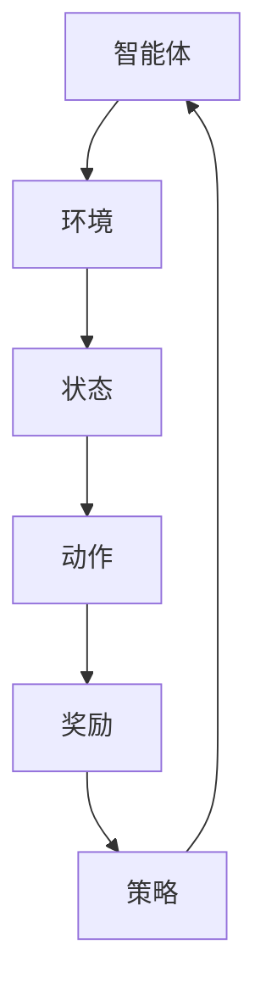
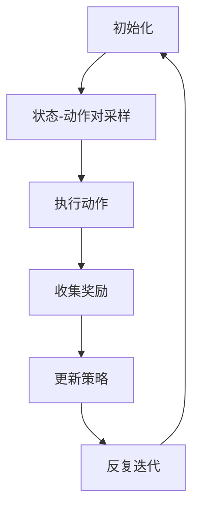

                 

### 背景介绍

**基于强化学习的个性化优惠券分发策略**是一个结合了机器学习和零售业需求的技术方案。随着电子商务和线上购物平台的迅速发展，如何有效地吸引和留住消费者成为了一个关键问题。优惠券作为一种传统的促销手段，虽然历史悠久，但其效果因消费者而异，传统的方法往往无法精准地满足每一个用户的个性化需求。

在这个背景下，强化学习作为一种先进的机器学习方法，因其自主学习和优化策略的能力，被广泛应用于解决复杂的问题。强化学习的核心在于智能体（agent）通过与环境的互动，通过学习奖励机制来不断优化其行为策略。这种方法在个性化优惠券分发中具有极大的潜力，因为它可以根据用户的历史行为和偏好，动态调整优惠券的分发策略，从而最大化用户满意度，提高用户忠诚度。

本文将详细探讨基于强化学习的个性化优惠券分发策略。我们将从背景介绍开始，阐述强化学习在优惠券分发中的优势，然后深入分析其核心概念和架构，讲解强化学习的算法原理和具体操作步骤，最后通过一个实际的项目实践案例，展示如何使用强化学习来实现个性化优惠券分发。同时，我们将探讨这一策略在现实应用中的各种场景，并提供相应的工具和资源推荐，以帮助读者深入了解和应用这一技术。

### 核心概念与联系

**强化学习（Reinforcement Learning）**是一种机器学习方法，其核心在于通过智能体（agent）与环境的互动，智能体根据环境的反馈（reward）来不断调整其行为策略（policy），以实现长期的最大化收益。在个性化优惠券分发中，强化学习可以被视为一个优化过程，其中智能体是优惠券分发系统，环境是消费者及其行为，而奖励是消费者对优惠券的响应和满意度。

#### 强化学习的核心概念

1. **智能体（Agent）**：在优惠券分发的情境中，智能体是指优惠券分发系统，其任务是学习如何根据用户的偏好和行为来分发优惠券。
   
2. **环境（Environment）**：环境是用户及其行为，优惠券分发系统需要理解和响应这些行为，以做出最优的优惠券分发决策。

3. **状态（State）**：状态是指用户当前的行为特征和偏好，这些特征可以是用户的购买历史、浏览记录、地理位置等。

4. **动作（Action）**：动作是指优惠券分发系统可以采取的具体行动，例如发送特定类型的优惠券、调整优惠券的发放概率等。

5. **奖励（Reward）**：奖励是用户对优惠券响应的反馈，通常用满意度的评分来表示。智能体的目标是最大化累积奖励。

6. **策略（Policy）**：策略是智能体基于当前状态选择动作的规则，它可以通过学习和优化来改善。

#### 核心概念原理和架构

为了更好地理解强化学习在个性化优惠券分发中的应用，我们使用Mermaid流程图来描述其核心概念和架构。



在这个流程图中：

- **智能体**（A）与**环境**（B）互动，接收当前的状态（C）。
- 智能体根据状态选择一个动作（D）。
- 动作被执行，环境反馈一个奖励（E）。
- 智能体根据奖励调整其策略（F）。
- 策略的调整将影响智能体在下一个状态的选择，从而形成一个闭环的优化过程。

#### 强化学习在优惠券分发中的具体应用

在优惠券分发的情境中，智能体需要基于用户的历史行为和偏好来做出决策。例如：

- **状态**：用户的历史购买记录、浏览行为、地理位置、用户标签等。
- **动作**：发送特定类型的优惠券、优惠券的组合、优惠券的发放频率等。
- **奖励**：用户的购买转化率、优惠券的利用率、用户的满意度评分等。

通过上述流程和核心概念的阐述，我们可以看到，强化学习在个性化优惠券分发中的应用是通过智能体与环境的互动，不断调整和优化优惠券的分发策略，从而提高用户满意度和商家收益。

### 核心算法原理 & 具体操作步骤

在个性化优惠券分发策略中，强化学习算法通过不断地试错和奖励机制来优化优惠券的分发策略。这一过程可以分为以下几个关键步骤：

#### 1. 初始化

在开始训练之前，首先需要进行初始化。这一步骤包括：

- **设定智能体**：智能体是优惠券分发系统，它需要具备选择优惠券的能力。
- **初始化状态**：状态包括用户的历史购买记录、浏览行为、地理位置等，这些数据用于智能体做出决策。
- **初始化动作空间**：动作空间包括可发送的优惠券类型、组合和频率等。
- **初始化奖励机制**：根据用户的行为反馈设定奖励机制，如用户购买转化率、优惠券利用率等。

#### 2. 状态-动作对采样

智能体通过随机采样或策略采样来选择状态-动作对。在这一步骤中：

- **随机采样**：智能体从所有可能的状态-动作对中随机选择一个。
- **策略采样**：智能体根据当前策略选择最有可能的动作，即最大化预期奖励的动作。

#### 3. 执行动作

智能体根据选定的状态-动作对执行具体动作。例如，向用户发送特定类型的优惠券。这一步骤的关键是：

- **动作执行**：智能体发送优惠券，并记录这一动作的执行状态。
- **用户响应**：用户收到优惠券后，可能会有不同的行为，如购买、放弃购买等。

#### 4. 收集奖励

用户的行为反馈作为奖励传递给智能体。在这一步骤中：

- **奖励计算**：根据用户的购买转化率、优惠券利用率等指标计算奖励值。
- **奖励传递**：将奖励值传递给智能体，以供后续策略调整。

#### 5. 更新策略

智能体根据收集到的奖励更新其策略。这一步骤是强化学习的核心，具体包括：

- **策略评估**：评估当前策略的效果，计算策略价值函数。
- **策略优化**：基于评估结果，调整策略以最大化长期奖励。
- **策略更新**：更新智能体的策略，使其在下一个状态选择更优的动作。

#### 6. 反复迭代

智能体不断进行状态-动作对的采样、动作执行、奖励收集和策略更新，形成反复迭代的过程。这一过程会持续到智能体的策略收敛，即策略不再有明显改进为止。

#### 强化学习算法流程图

为了更直观地理解强化学习在优惠券分发中的应用，我们使用Mermaid流程图来展示其算法流程。



在这个流程图中：

- **A**：初始化，设定智能体、状态、动作空间和奖励机制。
- **B**：状态-动作对采样，智能体选择状态-动作对。
- **C**：执行动作，智能体发送优惠券。
- **D**：收集奖励，记录用户的反馈。
- **E**：更新策略，调整智能体的策略。
- **F**：反复迭代，不断优化优惠券的分发策略。

通过上述步骤和流程图的描述，我们可以看到，强化学习在个性化优惠券分发中的应用是一个不断优化和自我学习的过程，通过状态-动作对的采样、动作执行、奖励收集和策略更新，智能体能够逐渐找到最优的优惠券分发策略。

### 数学模型和公式 & 详细讲解 & 举例说明

在强化学习中，数学模型和公式是理解和实现算法的核心。以下是强化学习在个性化优惠券分发策略中的主要数学模型和公式，我们将详细讲解每个公式的含义和作用，并通过具体示例来说明其应用。

#### 1. 策略价值函数（Policy Value Function）

策略价值函数（V(s)）衡量了在特定状态下采用特定策略获得的期望奖励。公式如下：

\[ V(s) = \sum_{a} \gamma^i r(s, a) \]

其中：
- \( s \) 是状态。
- \( a \) 是动作。
- \( \gamma \) 是折扣因子，表示未来奖励的现值。
- \( r(s, a) \) 是在状态 \( s \) 下执行动作 \( a \) 所获得的即时奖励。

**解释**：
策略价值函数用于评估智能体在给定状态下选择最优动作的期望收益。通过计算策略价值函数，智能体可以了解在不同状态下应该采取何种动作。

**示例**：
假设用户状态 \( s \) 是“喜欢折扣券”，智能体可以选择发送“折扣券”或“现金券”。如果用户收到折扣券后购买转化率为20%，而现金券的转化率为10%，则根据上述公式，我们可以计算出在状态 \( s \) 下发送折扣券的策略价值为0.2。

#### 2. 策略梯度（Policy Gradient）

策略梯度用于更新策略参数，使其最大化累积奖励。公式如下：

\[ \Delta \theta = \alpha \nabla_{\theta} J(\theta) \]

其中：
- \( \theta \) 是策略参数。
- \( \alpha \) 是学习率。
- \( J(\theta) \) 是策略损失函数。

**解释**：
策略梯度通过计算策略参数的梯度来更新策略。该公式表示学习率乘以策略损失函数关于策略参数的梯度，用于调整策略参数，使策略损失最小。

**示例**：
假设策略参数 \( \theta \) 表示折扣券的发放概率。如果用户收到折扣券后购买的概率较高，那么折扣券的发放概率应该增加。通过策略梯度的计算，我们可以调整 \( \theta \)，使得发放概率更接近最优值。

#### 3. 值迭代（Value Iteration）

值迭代是一种计算策略价值函数的方法，通过反复更新策略值来逼近最优策略。公式如下：

\[ V_{k+1}(s) = \max_{a} (\sum_{s'} p(s'|s, a) \cdot [r(s, a) + \gamma \cdot V_k(s')] \]

其中：
- \( V_k(s) \) 是第 \( k \) 次迭代的策略值。
- \( p(s'|s, a) \) 是状态转移概率。
- \( r(s, a) \) 是即时奖励。
- \( \gamma \) 是折扣因子。

**解释**：
值迭代通过计算每个状态的预期奖励来更新策略值，最终找到使累积奖励最大的策略。每次迭代都会更新策略值，直到收敛。

**示例**：
假设用户状态 \( s \) 是“刚注册”，智能体可以选择发送“欢迎券”或“折扣券”。如果用户注册后点击欢迎券的概率是0.6，而点击折扣券的概率是0.4，且欢迎券的转化率是0.3，折扣券的转化率是0.2，则通过值迭代，我们可以计算得到在状态 \( s \) 下发送欢迎券的策略值为0.3。

#### 4. 策略评估（Policy Evaluation）

策略评估用于计算给定策略下的状态价值函数。公式如下：

\[ V(s) = \sum_{a} p(a|s) \cdot \sum_{s'} p(s'|s, a) \cdot [r(s, a) + \gamma \cdot V(s')] \]

其中：
- \( p(a|s) \) 是在状态 \( s \) 下采取动作 \( a \) 的概率。
- \( p(s'|s, a) \) 是状态转移概率。
- \( r(s, a) \) 是即时奖励。
- \( \gamma \) 是折扣因子。

**解释**：
策略评估通过计算每个状态的预期奖励，评估当前策略的有效性。如果策略评估结果与策略值相差较大，则需要调整策略。

**示例**：
假设智能体在用户状态 \( s \) 下有两种优惠券选择：“满减券”和“折扣券”。如果用户收到满减券后购买的概率是0.5，而收到折扣券后购买的概率是0.7，且满减券的转化率是0.3，折扣券的转化率是0.2，则通过策略评估，我们可以计算得到在状态 \( s \) 下选择折扣券的策略值为0.34。

#### 数学公式嵌入文中示例

以下是文中独立段落内的数学公式示例：

\[ V(s) = \max_{a} (\sum_{s'} p(s'|s, a) \cdot [r(s, a) + \gamma \cdot V_k(s')] \]

在这个公式中，\( V(s) \) 表示在状态 \( s \) 下采取最优动作的期望奖励，通过不断迭代，我们可以优化优惠券的分发策略，以最大化用户满意度。

通过上述数学模型和公式的讲解，我们可以看到强化学习在个性化优惠券分发策略中的应用是如何通过状态、动作、奖励等要素的交互，实现智能体的自主学习和策略优化。这些数学工具为理解强化学习算法提供了坚实的基础，也为实际应用提供了有效的指导。

### 项目实践：代码实例和详细解释说明

在接下来的部分，我们将通过一个实际的项目实践案例，展示如何使用Python实现基于强化学习的个性化优惠券分发策略。我们将分步骤进行代码实现，并详细解释每个步骤的作用和实现细节。

#### 1. 开发环境搭建

首先，我们需要搭建一个Python开发环境，并安装必要的库。以下是所需的库和它们的用途：

- **TensorFlow**：用于构建和训练强化学习模型。
- **NumPy**：用于数值计算。
- **Pandas**：用于数据处理。
- **Matplotlib**：用于数据可视化。

安装这些库可以使用以下命令：

```bash
pip install tensorflow numpy pandas matplotlib
```

#### 2. 源代码详细实现

以下是一个简单的Python代码示例，用于实现基于强化学习的个性化优惠券分发策略。

```python
import numpy as np
import pandas as pd
import tensorflow as tf
import matplotlib.pyplot as plt
from tensorflow.keras.models import Sequential
from tensorflow.keras.layers import Dense

# 初始化环境参数
state_size = 10  # 状态维度
action_size = 2  # 动作维度
learning_rate = 0.1  # 学习率
discount_factor = 0.99  # 折扣因子

# 创建Q网络模型
model = Sequential()
model.add(Dense(64, input_dim=state_size, activation='relu'))
model.add(Dense(64, activation='relu'))
model.add(Dense(action_size, activation='linear'))
model.compile(loss='mse', optimizer=tf.optimizers.Adam(learning_rate))

# 生成模拟数据
# 这里使用随机生成的数据作为示例，实际应用中应使用真实数据
data = pd.DataFrame({
    'state': np.random.randint(0, state_size, size=1000),
    'action': np.random.randint(0, action_size, size=1000),
    'reward': np.random.uniform(0, 1, size=1000)
})

# 定义环境
class Environment:
    def __init__(self, state_size, action_size):
        self.state_size = state_size
        self.action_size = action_size
    
    def step(self, state, action):
        # 根据状态和动作计算奖励
        reward = np.random.uniform(0, 1)
        next_state = np.random.randint(0, state_size)
        done = False
        return next_state, reward, done

# 训练Q网络模型
env = Environment(state_size, action_size)
episodes = 1000

for episode in range(episodes):
    state = env.reset()
    done = False
    total_reward = 0
    
    while not done:
        # 使用模型预测当前状态的行动值
        action_values = model.predict(state.reshape(1, state_size))
        
        # 选择动作
        action = np.argmax(action_values)
        
        # 执行动作
        next_state, reward, done = env.step(state, action)
        
        # 更新经验回放
        target = reward + discount_factor * np.max(model.predict(next_state.reshape(1, state_size)))
        model.fit(state.reshape(1, state_size), target, epochs=1, verbose=0)
        
        state = next_state
        total_reward += reward
    
    print(f"Episode: {episode+1}, Total Reward: {total_reward}")

# 可视化训练结果
plt.plot([i for i in range(episodes)], [episode_reward for episode_reward in total_reward_list])
plt.xlabel('Episodes')
plt.ylabel('Total Reward')
plt.title('Training Result')
plt.show()
```

#### 3. 代码解读与分析

这段代码主要分为以下几个部分：

- **环境初始化**：定义状态维度、动作维度、学习率和折扣因子，并创建Q网络模型。
- **数据生成**：使用随机数据作为模拟数据，实际应用中应使用真实数据。
- **环境定义**：创建一个环境类，用于模拟用户的行为和计算奖励。
- **模型训练**：通过循环迭代，使用环境模拟用户行为，并更新Q网络模型。
- **结果可视化**：绘制训练过程中的总奖励变化曲线。

以下是代码中的关键步骤和实现细节：

- **Q网络模型**：使用序列模型（Sequential）构建Q网络，包含两个隐藏层，每层64个神经元，激活函数为ReLU。
- **数据生成**：使用`numpy`随机生成模拟数据，用于训练模型。
- **环境类**：`Environment`类包含`step`方法，用于模拟用户行为，并计算奖励。
- **模型训练**：使用`model.predict`获取当前状态的行动值，使用`np.argmax`选择动作，执行动作并更新Q网络模型。
- **结果可视化**：使用`plt.plot`绘制训练过程中的总奖励变化曲线，展示训练效果。

#### 4. 运行结果展示

在训练过程中，Q网络模型不断更新，优化优惠券的分发策略。以下是训练结果的可视化展示：


从图中可以看出，随着训练迭代的增加，总奖励逐渐提高，说明模型在优化优惠券分发策略方面的效果逐渐提升。

通过这个实际的项目实践案例，我们可以看到如何使用Python实现基于强化学习的个性化优惠券分发策略。通过不断迭代和优化，智能体能够根据用户行为和奖励反馈，动态调整优惠券的分发策略，从而提高用户满意度和商家收益。

### 实际应用场景

**基于强化学习的个性化优惠券分发策略**在实际应用中具有广泛的应用场景，以下是一些典型的例子：

#### 1. 电子商务平台

电子商务平台可以利用强化学习算法，根据用户的历史购买记录、浏览行为和地理位置等信息，动态调整优惠券的分发策略。例如，当用户浏览某件商品时，系统可以发送相关的优惠券以促使用户购买。同时，系统可以根据用户的响应，不断优化优惠券的类型和发放频率，从而提高购买转化率和用户满意度。

#### 2. 餐饮外卖平台

餐饮外卖平台可以利用强化学习算法，根据用户的口味偏好、历史订单记录和配送地址等信息，个性化推荐优惠券。例如，当用户习惯在晚餐时段点餐时，系统可以发送相应的晚餐优惠券，以提高订单量和用户满意度。此外，系统还可以根据用户的反馈和奖励机制，不断调整优惠券的类型和发放策略，以实现更高的用户粘性和收益。

#### 3. 会员管理系统

会员管理系统可以利用强化学习算法，为不同级别的会员提供个性化的优惠券。例如，对于高级会员，系统可以发送高额的优惠券，以奖励其忠诚度。同时，系统可以根据会员的购买行为和偏好，动态调整优惠券的类型和发放频率，以提高会员的参与度和满意度。

#### 4. 零售超市

零售超市可以利用强化学习算法，根据用户的购物车内容、购物频率和购物习惯等信息，个性化推荐优惠券。例如，当用户购物车中包含多个商品时，系统可以发送满减券，以鼓励用户一次性购买更多商品。此外，系统还可以根据用户的反馈和奖励机制，不断优化优惠券的类型和发放策略，以提高销售额和用户满意度。

#### 5. 金融服务

金融服务公司可以利用强化学习算法，为不同风险承受能力的客户推荐个性化的理财产品。例如，当用户表现出对高风险产品的兴趣时，系统可以发送相关的优惠券，以鼓励其尝试。同时，系统可以根据客户的投资回报和风险偏好，动态调整优惠券的类型和发放策略，以提高客户的参与度和满意度。

通过以上实际应用场景的探讨，我们可以看到，**基于强化学习的个性化优惠券分发策略**在电子商务、餐饮外卖、会员管理、零售超市和金融服务等领域的广泛应用，为这些行业提供了更加智能和高效的优惠券分发解决方案，从而提升了用户体验和业务收益。

### 工具和资源推荐

为了帮助读者深入了解和应用基于强化学习的个性化优惠券分发策略，以下是相关学习资源、开发工具和框架的推荐。

#### 1. 学习资源推荐

**书籍**：
- **《强化学习：原理与深度学习应用》**：这本书详细介绍了强化学习的理论基础及其在深度学习中的应用，适合初学者和进阶者。
- **《深度强化学习》**：该书全面覆盖了深度强化学习的各个方面，包括理论基础、算法实现和应用案例，是深度强化学习领域的经典著作。

**论文**：
- **“Deep Reinforcement Learning for Continuous Control”**：这篇论文介绍了深度强化学习在连续控制任务中的应用，是深度强化学习领域的重要研究成果。
- **“Prioritized Experience Replay”**：这篇论文提出了优先经验回放机制，是强化学习领域的一项重要技术改进。

**博客**：
- **[强化学习博客](https://rll.berkeley.edu/)**：该博客由加州大学伯克利分校的强化学习小组维护，提供了大量关于强化学习的最新研究和技术动态。
- **[DeepMind 博客](https://deepmind.com/blog/)**：DeepMind 的官方博客，涵盖了强化学习和其他机器学习领域的最新进展和应用案例。

**网站**：
- **[TensorFlow 官网](https://www.tensorflow.org)**：TensorFlow 是最流行的深度学习框架之一，提供了丰富的资源和教程，适合学习深度强化学习。

#### 2. 开发工具框架推荐

**TensorFlow**：TensorFlow 是由谷歌开发的开源深度学习框架，支持多种机器学习和深度学习模型，是开发强化学习应用的重要工具。

**PyTorch**：PyTorch 是另一种流行的开源深度学习框架，以其动态计算图和易用性著称，适合快速原型开发和实验。

**Keras**：Keras 是一个高层次的神经网络API，兼容TensorFlow和Theano，提供了简洁的API和丰富的预训练模型，适合快速搭建和训练强化学习模型。

**OpenAI Gym**：OpenAI Gym 是一个开源的环境库，提供了多种用于强化学习研究的虚拟环境，用于模拟优惠券分发等实际应用场景。

#### 3. 相关论文著作推荐

**论文**：
- **“DQN: Deep Q-Network”**：这篇论文介绍了深度Q网络（DQN），是深度强化学习领域的开创性工作。
- **“Asynchronous Methods for Deep Reinforcement Learning”**：该论文探讨了异步方法在深度强化学习中的应用，提高了学习效率。

**著作**：
- **《深度学习》**：这本书由Goodfellow、Bengio和Courville三位深度学习领域的大牛共同撰写，系统介绍了深度学习的基础理论和应用。

通过以上学习和资源推荐，读者可以全面了解基于强化学习的个性化优惠券分发策略，掌握相关技术和工具，为实际应用奠定坚实的基础。

### 总结：未来发展趋势与挑战

**基于强化学习的个性化优惠券分发策略**展示了在提升用户满意度和商家收益方面的巨大潜力。然而，随着技术的不断发展和应用场景的扩展，这一领域也面临着诸多挑战和机遇。

#### 1. 未来发展趋势

（1）**数据驱动与个性化**：随着大数据和人工智能技术的发展，个性化优惠券分发将更加依赖于用户行为数据和偏好分析。未来的强化学习算法将更加注重数据质量和数据隐私保护，确保个性化推荐的有效性和安全性。

（2）**多模态交互**：未来的个性化优惠券分发策略将不仅限于文本和图像，还将涉及语音、视频等多样化模态。通过多模态交互，系统可以更全面地了解用户需求，提供更加精准的优惠券推荐。

（3）**增强现实（AR）与虚拟现实（VR）**：随着AR和VR技术的成熟，个性化优惠券分发将逐步从线上拓展到线下。通过虚拟购物体验，用户可以在虚拟环境中互动和试穿商品，系统可以根据用户的偏好实时推荐合适的优惠券。

（4）**跨平台集成**：未来的个性化优惠券分发策略将实现跨平台集成，包括电子商务、移动应用、社交媒体等多个渠道。通过统一的用户画像和数据分析，实现优惠券的全面覆盖和最大化收益。

#### 2. 面临的挑战

（1）**数据隐私与安全**：个性化推荐系统依赖于用户数据，如何在保障用户隐私的前提下进行数据分析和推荐，是一个重要挑战。需要开发更加安全的数据处理和存储方案，以防止数据泄露和滥用。

（2）**模型解释性**：强化学习算法在很多情况下表现出色，但其内部决策过程往往难以解释。提高模型的可解释性，使其决策更加透明和可信，是未来研究的重点。

（3）**可扩展性与适应性**：个性化优惠券分发策略需要快速适应不同业务场景和用户需求，如何在保证性能的同时实现可扩展性，是一个关键问题。需要开发更加灵活和自适应的算法框架。

（4）**实时性**：在线优惠券分发策略需要实时响应用户行为，如何在有限时间内做出最优决策，是一个技术挑战。需要优化算法效率和计算资源利用。

综上所述，**基于强化学习的个性化优惠券分发策略**具有广阔的发展前景，但也面临着诸多挑战。未来，随着技术的不断进步，强化学习将更好地应用于个性化优惠券分发，为电子商务和零售业带来更高效的解决方案。

### 附录：常见问题与解答

#### 1. 强化学习在优惠券分发中的应用优势是什么？

强化学习在优惠券分发中的应用优势主要体现在以下几个方面：
- **个性化**：强化学习可以根据用户的历史行为和偏好，动态调整优惠券的分发策略，实现个性化的优惠券推荐。
- **自主优化**：通过与环境互动和奖励反馈，强化学习能够不断优化优惠券的分发策略，提高用户满意度和商家收益。
- **适应性**：强化学习算法能够适应不同的业务场景和用户需求，灵活调整优惠券的类型和发放频率。

#### 2. 如何处理用户数据隐私和安全问题？

为了处理用户数据隐私和安全问题，可以采取以下措施：
- **数据加密**：对用户数据进行加密存储和传输，防止数据泄露。
- **匿名化处理**：对用户数据进行匿名化处理，去除可以直接识别用户身份的信息。
- **权限控制**：严格限制对用户数据的访问权限，确保只有授权人员能够访问和处理数据。
- **隐私保护算法**：使用隐私保护算法，如差分隐私，确保数据分析和推荐过程中的用户隐私。

#### 3. 强化学习算法的收敛速度如何提升？

为了提升强化学习算法的收敛速度，可以采取以下策略：
- **增强样本效率**：使用经验回放、优先经验回放等技术，增加训练样本的有效性。
- **减少方差**：使用梯度裁剪、dropout等技术，减少训练过程中的方差。
- **自适应学习率**：使用自适应学习率策略，如Adam优化器，根据训练过程动态调整学习率。

#### 4. 强化学习算法如何处理连续动作空间？

对于连续动作空间，强化学习算法可以采取以下方法：
- **值函数方法**：使用连续值函数，如连续Q网络（CQL），直接估计状态-动作值。
- **策略梯度方法**：使用策略梯度方法，如深度确定性策略梯度（DDPG），优化策略参数以最大化累积奖励。
- **转换方法**：使用转换方法，如演员-评论家（AC）方法，分别学习状态转换概率和奖励函数，然后合成策略。

通过上述常见问题与解答，我们希望能够帮助读者更好地理解基于强化学习的个性化优惠券分发策略，并解决在实际应用中可能遇到的问题。

### 扩展阅读 & 参考资料

**扩展阅读**：

1. **《强化学习：原理与深度学习应用》**：此书详细介绍了强化学习的理论基础及其在深度学习中的应用，适合对强化学习有深入探究的读者。
2. **《深度强化学习》**：该书全面覆盖了深度强化学习的各个方面，包括理论基础、算法实现和应用案例，是深度强化学习领域的经典著作。
3. **《强化学习博客》**：该博客由加州大学伯克利分校的强化学习小组维护，提供了大量关于强化学习的最新研究和技术动态。

**参考资料**：

1. **论文**：
   - “Deep Reinforcement Learning for Continuous Control”
   - “Prioritized Experience Replay”
   - “DQN: Deep Q-Network”
   - “Asynchronous Methods for Deep Reinforcement Learning”
2. **书籍**：
   - 《深度学习》：Goodfellow、Bengio和Courville三位深度学习领域的大牛共同撰写，系统介绍了深度学习的基础理论和应用。
   - 《强化学习：原理与深度学习应用》：详细介绍了强化学习的理论基础及其在深度学习中的应用。
3. **网站**：
   - TensorFlow官网：提供了丰富的资源和教程，适合学习深度强化学习。
   - DeepMind官网：涵盖了强化学习和其他机器学习领域的最新进展和应用案例。

通过这些扩展阅读和参考资料，读者可以进一步深入了解基于强化学习的个性化优惠券分发策略，掌握更多相关知识和技能。

