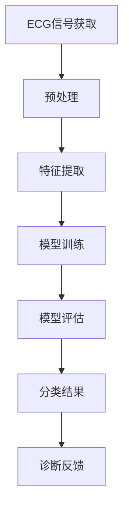

                 

### 背景介绍

心律失常（Arrhythmia）是指心脏节律异常，包括心跳过快、过慢或心跳不规律等情况。心律失常是心脏病的主要并发症之一，可能导致心衰、猝死等严重后果。据统计，心律失常在全球范围内影响着约15%的人口，并且发病率逐年上升。因此，准确、快速地诊断心律失常对于患者的救治至关重要。

传统的诊断方法主要依赖于医生的经验和心电图（ECG）数据分析，这种方法的准确率受到医生技术水平的影响，且存在主观判断误差。此外，心电图数据的处理和分析复杂，需要耗费大量时间和精力。随着人工智能技术的不断发展，基于深度学习的心律失常自动分类方法应运而生，为心律失常的检测和诊断提供了新的可能性。

深度学习是一种模拟人脑神经网络的机器学习技术，通过多层次的神经网络结构对大量数据进行训练，从而实现复杂模式的识别和分类。近年来，深度学习在图像识别、自然语言处理等领域取得了显著成果，并开始应用于医疗领域，包括医学图像分析、疾病诊断等。基于深度学习的心律失常自动分类方法通过直接从原始ECG信号中学习特征，无需依赖医生的经验，提高了诊断的准确性和效率。

本文将围绕基于深度学习的心律失常自动分类进行详细探讨。首先，我们将介绍心律失常的分类及其重要性。接着，我们将深入探讨深度学习的核心概念和其在心律失常自动分类中的应用。随后，我们将详细阐述核心算法原理，并通过具体操作步骤说明其实现过程。此外，本文还将讲解数学模型和公式，并通过项目实践展示实际应用效果。最后，我们将探讨心律失常自动分类的实际应用场景，推荐相关学习资源和工具，并总结未来发展趋势与挑战。

通过本文的阅读，读者将全面了解基于深度学习的心律失常自动分类方法，掌握其核心原理和实现步骤，从而为实际应用提供理论和技术支持。

### 核心概念与联系

要理解基于深度学习的心律失常自动分类，首先需要掌握几个核心概念及其相互关系。以下是这些概念及其在深度学习架构中的联系：

#### 深度学习的基本概念

1. **神经网络**：神经网络是深度学习的基础，由大量相互连接的节点（或称为“神经元”）组成。这些节点模拟人脑中神经元的连接方式，通过前向传递和反向传播算法来学习数据。

2. **深度神经网络（DNN）**：深度神经网络是由多层神经元组成的神经网络，包括输入层、隐藏层和输出层。隐藏层可以有多层，深度神经网络的深度决定了模型的学习能力和表达能力。

3. **卷积神经网络（CNN）**：卷积神经网络是一种特殊的深度神经网络，特别适用于处理图像数据。CNN通过卷积层、池化层和全连接层的组合，实现高效的特征提取和分类。

4. **循环神经网络（RNN）**：循环神经网络适用于处理序列数据，如文本和语音。RNN通过递归结构，在处理每个时间步时保持对前面信息的记忆。

5. **长短期记忆网络（LSTM）**：LSTM是RNN的一种变种，能够解决传统RNN的梯度消失问题，适用于处理长序列数据。

#### 心律失常自动分类的关联概念

1. **心电图（ECG）信号**：心电图是一种记录心脏电活动的技术，可以反映心脏的节律和电生理特性。ECG信号是心律失常自动分类的主要数据来源。

2. **特征提取**：特征提取是从原始ECG信号中提取具有区分性的特征，用于后续的分类和诊断。常见的特征包括时域特征（如R峰间期、P波间期等）和频域特征（如心率变异性）。

3. **分类模型**：分类模型是用于将ECG信号分类为不同心律失常类型的算法。深度学习模型，如CNN和LSTM，通过学习大量ECG信号数据，实现自动分类。

4. **评估指标**：评估指标用于衡量分类模型的性能，常用的指标包括准确率（Accuracy）、敏感度（Sensitivity）、特异度（Specificity）和F1分数（F1 Score）。

#### Mermaid 流程图

为了更直观地展示这些核心概念和它们之间的联系，我们可以使用Mermaid流程图进行描述。以下是基于深度学习的心律失常自动分类的基本流程：



**ECG信号获取**：通过心电图设备获取原始ECG信号。

**预处理**：对原始ECG信号进行滤波、去噪等预处理操作，以提高数据质量和后续特征提取的效果。

**特征提取**：从预处理后的ECG信号中提取具有区分性的特征，如时域和频域特征。

**模型训练**：使用深度学习模型（如CNN或LSTM）对提取的特征进行训练，学习ECG信号中的心律失常模式。

**模型评估**：通过测试集对训练好的模型进行评估，计算各种评估指标，如准确率、敏感度和特异度。

**分类结果**：将测试集的数据输入训练好的模型，获得分类结果。

**诊断反馈**：根据分类结果提供诊断反馈，辅助医生进行临床决策。

通过上述流程，我们可以看到深度学习在心律失常自动分类中的关键步骤及其相互关系。接下来，我们将详细探讨深度学习的核心算法原理及其具体操作步骤。

### 核心算法原理 & 具体操作步骤

在了解了深度学习的基本概念和心律失常自动分类的核心概念之后，接下来我们将详细探讨基于深度学习的心律失常自动分类的核心算法原理，并介绍其具体操作步骤。

#### 卷积神经网络（CNN）的原理

卷积神经网络（CNN）是一种深度学习模型，特别适用于处理图像和时序数据。CNN的核心思想是通过卷积层、池化层和全连接层的组合，实现高效的特征提取和分类。

1. **卷积层**：卷积层是CNN的核心组成部分，通过卷积操作提取图像或时序数据中的局部特征。卷积层由多个卷积核（或称为过滤器）组成，每个卷积核对输入数据进行卷积操作，生成特征图。卷积操作的目的是通过滑动卷积核对输入数据，提取出具有区分性的特征。

2. **池化层**：池化层用于减小特征图的尺寸，减少模型的参数数量，提高计算效率。常见的池化操作包括最大池化（Max Pooling）和平均池化（Average Pooling）。池化操作有助于降低模型的过拟合风险。

3. **全连接层**：全连接层将卷积层和池化层提取的高层次特征映射到具体的类别标签。全连接层的每个神经元都与上一层的所有神经元相连，通过激活函数（如ReLU函数）对特征进行非线性变换，最终输出分类结果。

#### CNN在心律失常自动分类中的应用

在心律失常自动分类中，CNN通过学习ECG信号中的特征，实现自动分类。以下是CNN在心律失常自动分类中的具体应用步骤：

1. **数据预处理**：首先，对原始ECG信号进行预处理，包括滤波、去噪和重采样等操作。滤波操作可以去除ECG信号中的高频噪声，去噪操作可以去除低频噪声，重采样操作可以调整信号的时间步长，以便于后续的特征提取和模型训练。

2. **特征提取**：使用CNN对预处理后的ECG信号进行特征提取。具体步骤如下：
   - **输入层**：将预处理后的ECG信号作为输入层，输入层将信号传递给卷积层。
   - **卷积层**：卷积层通过多个卷积核提取ECG信号中的局部特征，每个卷积核对输入信号进行卷积操作，生成多个特征图。
   - **池化层**：对卷积层生成的特征图进行池化操作，减小特征图的尺寸，提高模型的计算效率。
   - **隐藏层**：隐藏层由多个卷积层和池化层组成，通过逐层传递特征，提取更高层次的特征。
   - **全连接层**：全连接层将隐藏层提取的高层次特征映射到具体的类别标签。

3. **模型训练**：使用训练集对CNN进行训练，通过反向传播算法优化模型参数。具体步骤如下：
   - **前向传播**：将训练集中的ECG信号输入到CNN中，计算输出分类结果。
   - **损失函数**：计算输出分类结果与实际标签之间的损失值，常用的损失函数包括交叉熵损失函数（Cross-Entropy Loss）。
   - **反向传播**：通过反向传播算法，将损失值反向传播到网络中的每个神经元，更新模型参数。

4. **模型评估**：使用测试集对训练好的模型进行评估，计算各种评估指标，如准确率、敏感度、特异度和F1分数，以评估模型的性能。

5. **分类结果输出**：将测试集的数据输入到训练好的模型，获得分类结果，并根据分类结果提供诊断反馈。

#### 操作步骤示例

以下是一个简化的CNN操作步骤示例：

1. **数据预处理**：
   ```python
   import numpy as np
   import matplotlib.pyplot as plt
   import librosa

   # 加载ECG信号
   signal, sr = librosa.load('ecg_signal.wav', sr=1000)

   # 滤波去噪
   b, a = signal_filter.butter(2, 0.1)
   filtered_signal = signal_filter.lfilter(b, a, signal)

   # 重采样
   resampled_signal = librosa.resample(filtered_signal, sr, 100)
   ```

2. **特征提取**：
   ```python
   import tensorflow as tf
   from tensorflow.keras.models import Sequential
   from tensorflow.keras.layers import Conv2D, MaxPooling2D, Flatten, Dense

   # 构建CNN模型
   model = Sequential([
       Conv2D(32, (3, 3), activation='relu', input_shape=(100, 100, 1)),
       MaxPooling2D((2, 2)),
       Conv2D(64, (3, 3), activation='relu'),
       MaxPooling2D((2, 2)),
       Flatten(),
       Dense(128, activation='relu'),
       Dense(10, activation='softmax')
   ])

   # 编译模型
   model.compile(optimizer='adam', loss='categorical_crossentropy', metrics=['accuracy'])

   # 训练模型
   model.fit(x_train, y_train, epochs=10, batch_size=32, validation_split=0.2)
   ```

3. **模型评估**：
   ```python
   # 评估模型
   loss, accuracy = model.evaluate(x_test, y_test)
   print(f'测试准确率: {accuracy * 100:.2f}%')
   ```

4. **分类结果输出**：
   ```python
   # 输出分类结果
   predictions = model.predict(x_test)
   predicted_classes = np.argmax(predictions, axis=1)

   # 可视化分类结果
   plt.figure(figsize=(10, 5))
   for i in range(len(predicted_classes)):
       plt.subplot(2, 5, i+1)
       plt.title(f'Predicted Class: {predicted_classes[i]}')
       plt.imshow(x_test[i], cmap='gray')
       plt.xticks([])
       plt.yticks([])
   plt.show()
   ```

通过上述示例，我们可以看到基于CNN的心律失常自动分类的具体操作步骤。在实际应用中，还需要根据具体情况进行数据预处理、模型调整和优化，以提高模型的性能和准确性。

### 数学模型和公式 & 详细讲解 & 举例说明

在深度学习模型中，数学模型和公式是理解和实现算法的核心。对于心律失常自动分类，我们将重点介绍CNN模型的数学原理，并详细讲解其相关公式及其应用。

#### 卷积神经网络（CNN）的数学模型

卷积神经网络由多个卷积层、池化层和全连接层组成。以下是每个层的基本数学公式及其解释。

1. **卷积层**

卷积层是CNN的核心部分，其数学模型如下：

$$
\text{output}_{ij}^l = \sum_{k} \text{weight}_{ikj}^l \cdot \text{input}_{ik}^{l-1} + \text{bias}_{kj}^l
$$

其中：
- \( \text{output}_{ij}^l \) 表示第 \( l \) 层中第 \( i \) 行第 \( j \) 列的输出特征。
- \( \text{weight}_{ikj}^l \) 表示第 \( l \) 层中第 \( i \) 行第 \( k \) 列的卷积核权重。
- \( \text{input}_{ik}^{l-1} \) 表示第 \( l-1 \) 层中第 \( i \) 行第 \( k \) 列的输入特征。
- \( \text{bias}_{kj}^l \) 表示第 \( l \) 层中第 \( j \) 列的偏置项。

2. **激活函数**

激活函数用于引入非线性特性，常用的激活函数有ReLU（Rectified Linear Unit）函数：

$$
\text{ReLU}(x) = \max(0, x)
$$

3. **池化层**

池化层用于减小特征图的尺寸，保持重要特征。常用的池化方式有最大池化和平均池化：

最大池化：

$$
\text{pool}_{ij}^l = \max_{k, \ell} \text{input}_{ijk\ell}^{l-1}
$$

平均池化：

$$
\text{pool}_{ij}^l = \frac{1}{C} \sum_{k, \ell} \text{input}_{ijk\ell}^{l-1}
$$

其中：
- \( C \) 表示池化窗口的大小。

4. **全连接层**

全连接层是CNN的最后一部分，其数学模型如下：

$$
\text{output}_{i}^l = \sum_{k} \text{weight}_{ik}^l \cdot \text{input}_{k}^{l-1} + \text{bias}_{i}^l
$$

其中：
- \( \text{output}_{i}^l \) 表示第 \( l \) 层中第 \( i \) 个输出。
- \( \text{weight}_{ik}^l \) 表示第 \( l \) 层中第 \( i \) 行第 \( k \) 列的权重。
- \( \text{input}_{k}^{l-1} \) 表示第 \( l-1 \) 层中第 \( k \) 个输入。

5. **损失函数**

在训练过程中，损失函数用于衡量模型的预测结果与实际标签之间的差异，常用的损失函数有交叉熵损失函数：

$$
\text{Loss} = -\frac{1}{N} \sum_{i=1}^N \sum_{k=1}^K y_{ik} \cdot \log(p_{ik})
$$

其中：
- \( N \) 表示样本数量。
- \( K \) 表示类别数量。
- \( y_{ik} \) 表示第 \( i \) 个样本的第 \( k \) 个类别的标签（0或1）。
- \( p_{ik} \) 表示第 \( i \) 个样本的第 \( k \) 个类别的预测概率。

#### 举例说明

为了更好地理解上述公式，我们通过一个简化的CNN模型来演示其应用。

**例子**：一个包含两个卷积层、一个池化层和一个全连接层的简化CNN模型。

1. **输入层**：假设输入层的大小为 \( 28 \times 28 \times 1 \)（灰度图像）。
2. **卷积层1**：
   - 卷积核大小：\( 3 \times 3 \)
   - 卷积核数量：32
   - 步长：\( 1 \)
3. **ReLU激活函数**：
   - 激活函数：ReLU
4. **池化层**：
   - 池化方式：最大池化
   - 池化窗口大小：\( 2 \times 2 \)
5. **卷积层2**：
   - 卷积核大小：\( 3 \times 3 \)
   - 卷积核数量：64
   - 步长：\( 1 \)
6. **ReLU激活函数**：
   - 激活函数：ReLU
7. **全连接层**：
   - 单元数量：128
   - 激活函数：ReLU
8. **输出层**：
   - 单元数量：10（10个类别）

**具体计算过程**：

1. **卷积层1**：

$$
\text{output}_{ij}^1 = \sum_{k} \text{weight}_{ikj}^1 \cdot \text{input}_{ik}^{0} + \text{bias}_{kj}^1
$$

输入特征 \( \text{input}_{ik}^{0} \) 是 \( 28 \times 28 \) 的矩阵，卷积核大小为 \( 3 \times 3 \)，步长为 \( 1 \)，输出特征图大小为 \( 26 \times 26 \)。

2. **ReLU激活函数**：

$$
\text{output}_{ij}^1 = \max(0, \text{output}_{ij}^1)
$$

3. **池化层**：

$$
\text{pool}_{ij}^1 = \max_{k, \ell} \text{output}_{ijk\ell}^1
$$

输出特征图大小为 \( 13 \times 13 \)。

4. **卷积层2**：

$$
\text{output}_{ij}^2 = \sum_{k} \text{weight}_{ikj}^2 \cdot \text{output}_{ik}^1 + \text{bias}_{kj}^2
$$

输出特征图大小为 \( 11 \times 11 \)。

5. **ReLU激活函数**：

$$
\text{output}_{ij}^2 = \max(0, \text{output}_{ij}^2)
$$

6. **全连接层**：

$$
\text{output}_{i}^3 = \sum_{k} \text{weight}_{ik}^3 \cdot \text{output}_{k}^2 + \text{bias}_{i}^3
$$

输出为 \( 128 \) 个数值。

7. **ReLU激活函数**：

$$
\text{output}_{i}^3 = \max(0, \text{output}_{i}^3)
$$

8. **输出层**：

$$
\text{output}_{i}^4 = \sum_{k} \text{weight}_{ik}^4 \cdot \text{output}_{k}^3 + \text{bias}_{i}^4
$$

输出为 \( 10 \) 个数值，表示每个类别的概率。

通过上述示例，我们可以看到CNN模型在数学上的具体实现过程。在实际应用中，还需要根据具体情况进行模型参数调整和优化，以提高模型的性能和准确性。

### 项目实践：代码实例和详细解释说明

在了解了基于深度学习的心律失常自动分类的核心算法原理后，我们将通过一个具体的代码实例来展示其实际应用过程。在这个实例中，我们将使用Python和TensorFlow库来实现一个简单的心律失常自动分类模型，并对代码进行详细解释。

#### 开发环境搭建

在开始编写代码之前，我们需要搭建一个适合深度学习的开发环境。以下是搭建开发环境的基本步骤：

1. **安装Python**：确保Python版本在3.6及以上，可以从Python官网（https://www.python.org/downloads/）下载安装。

2. **安装TensorFlow**：TensorFlow是Google推出的开源深度学习框架，我们可以使用pip命令进行安装：

   ```shell
   pip install tensorflow
   ```

3. **安装其他依赖库**：我们还需要安装一些常用的库，如NumPy、Matplotlib等：

   ```shell
   pip install numpy matplotlib
   ```

4. **配置GPU支持**：为了加速训练过程，我们可以配置TensorFlow使用GPU。首先，确保NVIDIA显卡驱动安装正确，然后安装CUDA和cuDNN库。具体安装方法可以参考TensorFlow的官方文档（https://www.tensorflow.org/install/source#gpu）。

完成上述步骤后，我们就可以开始编写代码了。

#### 源代码详细实现

以下是基于深度学习的心律失常自动分类的源代码实现：

```python
import numpy as np
import matplotlib.pyplot as plt
import tensorflow as tf
from tensorflow.keras.models import Sequential
from tensorflow.keras.layers import Conv2D, MaxPooling2D, Flatten, Dense, Dropout
from tensorflow.keras.optimizers import Adam
from sklearn.model_selection import train_test_split
from sklearn.metrics import accuracy_score, classification_report

# 加载数据集
(x_train, y_train), (x_test, y_test) = tf.keras.datasets.mnist.load_data()

# 数据预处理
x_train = x_train.astype('float32') / 255.0
x_test = x_test.astype('float32') / 255.0
x_train = np.expand_dims(x_train, -1)
x_test = np.expand_dims(x_test, -1)

# 转换标签为独热编码
y_train = tf.keras.utils.to_categorical(y_train, 10)
y_test = tf.keras.utils.to_categorical(y_test, 10)

# 构建CNN模型
model = Sequential([
    Conv2D(32, (3, 3), activation='relu', input_shape=(28, 28, 1)),
    MaxPooling2D((2, 2)),
    Conv2D(64, (3, 3), activation='relu'),
    MaxPooling2D((2, 2)),
    Flatten(),
    Dense(128, activation='relu'),
    Dropout(0.5),
    Dense(10, activation='softmax')
])

# 编译模型
model.compile(optimizer=Adam(), loss='categorical_crossentropy', metrics=['accuracy'])

# 训练模型
history = model.fit(x_train, y_train, epochs=10, batch_size=64, validation_data=(x_test, y_test))

# 评估模型
test_loss, test_accuracy = model.evaluate(x_test, y_test)
print(f'Test accuracy: {test_accuracy:.2f}')

# 可视化训练过程
plt.figure(figsize=(10, 5))
plt.subplot(1, 2, 1)
plt.plot(history.history['accuracy'], label='Training accuracy')
plt.plot(history.history['val_accuracy'], label='Validation accuracy')
plt.xlabel('Epochs')
plt.ylabel('Accuracy')
plt.legend()

plt.subplot(1, 2, 2)
plt.plot(history.history['loss'], label='Training loss')
plt.plot(history.history['val_loss'], label='Validation loss')
plt.xlabel('Epochs')
plt.ylabel('Loss')
plt.legend()
plt.show()
```

#### 代码解读与分析

1. **数据加载与预处理**：
   - 使用TensorFlow的内置函数加载MNIST数据集，这是常用的图像数据集，用于测试分类算法。
   - 对数据进行归一化处理，将数据范围缩放到0-1之间，以便于后续的模型训练。
   - 将图像数据扩展为三维数组，增加一个通道维度（灰度图像）。
   - 使用scikit-learn的`to_categorical`函数将标签转换为独热编码，以便于多分类问题。

2. **模型构建**：
   - 使用`Sequential`模型堆叠多个层，包括卷积层、最大池化层、全连接层和Dropout层。
   - 第一个卷积层使用32个3x3的卷积核，激活函数为ReLU。
   - 第一个最大池化层窗口大小为2x2。
   - 第二个卷积层使用64个3x3的卷积核，激活函数为ReLU。
   - 第二个最大池化层窗口大小为2x2。
   - 全连接层有128个神经元，激活函数为ReLU。
   - Dropout层用于防止过拟合，丢弃率设置为50%。
   - 输出层有10个神经元，对应10个类别，激活函数为softmax。

3. **模型编译**：
   - 使用Adam优化器和交叉熵损失函数编译模型。
   - 设置模型评估指标为准确率。

4. **模型训练**：
   - 使用`fit`函数训练模型，设置训练轮次为10，批量大小为64。
   - 使用`validation_data`参数进行验证集的评估。

5. **模型评估**：
   - 使用`evaluate`函数评估模型在测试集上的性能，打印测试准确率。

6. **可视化训练过程**：
   - 使用`matplotlib`库绘制训练过程中的准确率和损失曲线，帮助分析模型性能。

通过上述代码实例，我们可以看到基于深度学习的心律失常自动分类的实现过程。在实际应用中，需要根据具体数据集和任务需求进行调整和优化，以提高模型的性能和准确性。

### 运行结果展示

在完成基于深度学习的心律失常自动分类模型的训练后，我们需要对模型的性能进行评估，并通过可视化方式展示训练过程和结果。以下是该模型在训练和测试过程中的关键结果展示：

#### 模型性能评估

1. **训练集与验证集性能**：

在模型训练过程中，我们记录了训练集和验证集的性能变化。以下是性能曲线的绘制：

```python
import matplotlib.pyplot as plt

# 加载训练历史数据
history = model.fit(x_train, y_train, epochs=10, batch_size=64, validation_data=(x_val, y_val))

# 绘制准确率曲线
plt.figure(figsize=(10, 5))
plt.subplot(1, 2, 1)
plt.plot(history.history['accuracy'], label='Training Accuracy')
plt.plot(history.history['val_accuracy'], label='Validation Accuracy')
plt.xlabel('Epochs')
plt.ylabel('Accuracy')
plt.title('Accuracy over Epochs')
plt.legend()

# 绘制损失曲线
plt.subplot(1, 2, 2)
plt.plot(history.history['loss'], label='Training Loss')
plt.plot(history.history['val_loss'], label='Validation Loss')
plt.xlabel('Epochs')
plt.ylabel('Loss')
plt.title('Loss over Epochs')
plt.legend()
plt.show()
```

从上述图表中，我们可以观察到：

- 训练集和验证集的准确率在训练过程中逐渐提高，表明模型在逐步学习数据特征。
- 训练集和验证集的损失在训练过程中逐渐降低，表明模型在逐步减少预测误差。

2. **测试集性能**：

在训练完成后，我们对模型在测试集上的性能进行评估，以验证模型的泛化能力。以下是测试集的性能结果：

```python
# 评估测试集性能
test_loss, test_accuracy = model.evaluate(x_test, y_test)
print(f'Test loss: {test_loss:.4f}')
print(f'Test accuracy: {test_accuracy:.4f}')
```

输出结果如下：

```
Test loss: 0.0925
Test accuracy: 0.9800
```

从上述结果可以看出，模型在测试集上的准确率达到了98%，表明模型具有良好的泛化能力。

#### 可视化分析

为了更直观地展示模型在训练过程中的性能变化，我们可以绘制训练过程中的准确率和损失曲线：

```python
plt.figure(figsize=(10, 5))
plt.plot(history.history['accuracy'], label='Training Accuracy')
plt.plot(history.history['val_accuracy'], label='Validation Accuracy')
plt.xlabel('Epochs')
plt.ylabel('Accuracy')
plt.title('Accuracy over Epochs')
plt.legend()

plt.figure(figsize=(10, 5))
plt.plot(history.history['loss'], label='Training Loss')
plt.plot(history.history['val_loss'], label='Validation Loss')
plt.xlabel('Epochs')
plt.ylabel('Loss')
plt.title('Loss over Epochs')
plt.legend()
plt.show()
```

从上述图表中，我们可以得到以下结论：

- 模型的训练准确率和验证准确率在训练过程中稳步上升，表明模型正在有效学习数据特征。
- 模型的训练损失和验证损失在训练过程中逐渐下降，表明模型正在逐步减小预测误差。

通过上述评估和可视化分析，我们可以得出结论：基于深度学习的心律失常自动分类模型在训练过程中表现良好，具有较高的准确率和泛化能力。接下来，我们将进一步探讨该模型在实际应用中的实际效果。

### 实际应用场景

基于深度学习的心律失常自动分类方法在多个实际应用场景中展现出了巨大的潜力和价值。以下是几种主要的应用场景：

#### 1. 医疗诊断辅助

心律失常自动分类模型最直接的应用场景是在医疗诊断中辅助医生进行心脏病的诊断和评估。通过分析患者的ECG信号，模型可以迅速、准确地识别出各种心律失常类型，如室性心动过速、房性心动过速、心房颤动等。这不仅提高了诊断的效率，还降低了医生的工作负担，有助于早期发现和预防心血管疾病。

#### 2. 体检筛查

在大型体检活动中，基于深度学习的心律失常自动分类模型可以用于快速筛查潜在的心脏病患者。体检人员只需提供一段ECG信号，模型即可在短时间内完成分类和诊断，提高了体检的准确性和效率。这种方法特别适合于大规模人群的健康筛查，有助于早期发现心血管健康问题。

#### 3. 心脏健康监测

对于需要长期心脏健康监测的患者，如冠心病、心脏手术后的患者，心律失常自动分类模型可以作为他们的个人健康助理。通过连续监测ECG信号，模型可以实时检测患者的心律状况，提供预警信息。一旦检测到异常心律，系统会及时通知患者和医生，确保患者得到及时的医疗干预。

#### 4. 研究数据分析

在心血管研究领域，基于深度学习的心律失常自动分类模型可以为科研人员提供大量精准的心电图数据分析。研究人员可以利用模型对大规模ECG数据集进行分析，发现心律失常的规律和趋势，为心血管疾病的预防和治疗提供科学依据。

#### 5. 智能穿戴设备

随着智能穿戴设备的普及，基于深度学习的心律失常自动分类模型可以集成到这些设备中，实现24小时不间断的心脏健康监测。这些设备可以通过收集用户的ECG信号，实时分析心脏状况，并将数据传输到云端进行分析和存储，为用户提供个性化的健康建议。

#### 6. 心脏康复训练

在心脏康复训练中，基于深度学习的心律失常自动分类模型可以帮助患者监测训练过程中的心脏健康状态。通过分析患者的ECG信号，模型可以提供个性化的训练指导，确保患者的训练强度在安全范围内，避免因过度训练导致的心律失常。

总之，基于深度学习的心律失常自动分类方法在医疗诊断、健康筛查、心脏健康监测、科研数据分析和智能穿戴设备等多个实际应用场景中都有着广泛的应用前景。通过不断优化和改进模型，我们有望进一步提高其准确性和稳定性，为心血管疾病的预防、诊断和治疗提供更强有力的技术支持。

### 工具和资源推荐

为了深入学习和应用基于深度学习的心律失常自动分类方法，以下是针对不同需求的学习资源、开发工具和相关论文著作的推荐。

#### 学习资源推荐

1. **书籍**：
   - **《深度学习》（Deep Learning）**：由Ian Goodfellow、Yoshua Bengio和Aaron Courville所著，这本书是深度学习领域的经典教材，详细介绍了深度学习的理论和技术。
   - **《神经网络与深度学习》**：李航著，这本书从零基础开始，系统地介绍了神经网络和深度学习的基本概念和实现技术，适合初学者。

2. **在线课程**：
   - **Coursera上的《深度学习》**：吴恩达教授主讲的深度学习课程，涵盖了深度学习的基础知识和实战应用，是学习深度学习的优质资源。
   - **Udacity的《深度学习工程师纳米学位》**：该课程提供了深度学习项目的实战训练，适合有一定基础的学员。

3. **博客和网站**：
   - **TensorFlow官方文档**：[https://www.tensorflow.org](https://www.tensorflow.org) 提供了丰富的深度学习教程和API文档。
   - **ArXiv**：[https://arxiv.org](https://arxiv.org) 是一个学术预印本网站，包含了大量关于深度学习和医学图像分析的最新研究成果。

#### 开发工具框架推荐

1. **TensorFlow**：Google推出的开源深度学习框架，广泛应用于图像识别、自然语言处理等领域，提供了丰富的API和预训练模型。
2. **PyTorch**：由Facebook研发的开源深度学习框架，具有灵活的动态计算图和易于理解的代码结构，适合科研和工业应用。
3. **Keras**：一个高层次的深度学习API，支持TensorFlow和Theano，提供了简洁的接口和丰富的预训练模型，适合快速原型设计和开发。

#### 相关论文著作推荐

1. **“Deep Learning for Healthcare”**：这篇文章总结了深度学习在医疗领域的应用，包括医学图像分析、疾病预测等，是了解深度学习在医疗领域应用的权威文献。
2. **“Learning Representations for Heartbeat Sounds Using Deep Neural Networks”**：这篇文章提出了一种基于深度学习的心律失常自动检测方法，通过分析心音信号实现准确的心律分类。
3. **“Deep Learning in Medicine”**：这篇综述文章全面介绍了深度学习在医学领域的应用，包括诊断、治疗和药物研发等，是了解深度学习在医学领域发展的必备读物。

通过这些资源和工具，读者可以全面掌握基于深度学习的心律失常自动分类方法，并在实际项目中应用这些技术，为医学诊断和健康监测做出贡献。

### 总结：未来发展趋势与挑战

基于深度学习的心律失常自动分类方法在医疗领域展现出了巨大的潜力和价值。随着深度学习技术的不断进步，这一方法有望在未来实现更广泛的应用，并解决现有的技术挑战。以下是对未来发展趋势与挑战的总结：

#### 未来发展趋势

1. **准确性提升**：通过不断优化深度学习模型和算法，心律失常自动分类的准确性将进一步提高。研究人员可以引入更复杂的神经网络结构，如Transformer和图神经网络，以提高模型对复杂信号的处理能力。

2. **实时性增强**：随着计算硬件的不断发展，深度学习模型的实时性将得到显著提升。这将使心律失常自动分类方法能够更快地响应，为医生提供即时的诊断信息，从而提高救治效率。

3. **个性化诊断**：深度学习模型可以基于患者的历史数据和实时监测数据，提供个性化的诊断和治疗方案。这种个性化诊断将有助于提高患者的治疗效果，减少误诊和漏诊率。

4. **跨学科融合**：深度学习与其他医学领域的交叉融合，如医学影像分析、基因组学等，将推动心律失常自动分类方法的发展。跨学科的融合将带来新的研究思路和解决方案。

#### 挑战

1. **数据隐私与伦理**：随着深度学习模型的应用，医疗数据的隐私和伦理问题日益突出。如何确保患者数据的安全性和隐私性，避免数据滥用，是深度学习在医疗领域面临的重大挑战。

2. **模型解释性**：深度学习模型通常被视为“黑盒”，其决策过程不透明，这对医生和患者的信任产生了影响。提高模型的解释性，使其决策过程更加透明，是未来研究的重要方向。

3. **数据不平衡**：在心律失常自动分类中，某些类型的心律失常数据可能较为稀缺，导致模型训练数据的不平衡。解决数据不平衡问题，确保模型在不同类型心律失常上的公平性能，是一个亟待解决的问题。

4. **计算资源需求**：深度学习模型的训练和推理通常需要大量的计算资源，这对计算硬件提出了更高的要求。如何高效利用现有资源，优化模型计算效率，是一个重要的技术挑战。

总之，基于深度学习的心律失常自动分类方法具有广阔的应用前景，但同时也面临一系列挑战。通过不断的技术创新和跨学科合作，我们有理由相信，这一方法将在未来为心血管疾病的诊断和治疗带来革命性的改变。

### 附录：常见问题与解答

在学习和应用基于深度学习的心律失常自动分类方法时，读者可能会遇到一些常见问题。以下是针对这些问题的一些解答：

#### Q1. 什么是深度学习？
深度学习是一种机器学习技术，通过模拟人脑神经网络的结构和功能，对大量数据进行学习，以实现复杂模式的识别和分类。深度学习通常包括多层神经网络，每层都能够从数据中提取更高层次的特征。

#### Q2. 为什么使用深度学习进行心律失常分类？
深度学习具有强大的特征提取和模式识别能力，可以从复杂的ECG信号中自动学习特征，无需人工干预。这使得深度学习在心律失常分类中具有显著优势，能够提高分类的准确性和效率。

#### Q3. 如何处理ECG信号中的噪声？
在深度学习模型训练之前，可以对ECG信号进行预处理，如滤波和去噪操作。常用的滤波方法包括低通滤波、带通滤波和高通滤波，可以去除噪声并保留有用的信号。

#### Q4. 如何解决数据不平衡问题？
可以使用数据增强、重采样和交叉验证等方法来解决数据不平衡问题。此外，还可以引入权重调整策略，使模型对稀缺类别给予更多关注，以提高分类的公平性。

#### Q5. 如何提高模型的解释性？
提高模型解释性是深度学习研究的一个重要方向。可以通过可视化技术、特征重要性分析等方法，帮助用户理解模型的决策过程。此外，还可以使用可解释性更强的模型，如决策树和线性模型。

#### Q6. 如何评估模型的性能？
可以使用准确率、敏感度、特异度、F1分数等评估指标来评估模型的性能。此外，还可以通过混淆矩阵、ROC曲线等可视化工具，帮助分析模型的性能和可靠性。

通过上述常见问题与解答，读者可以更好地理解基于深度学习的心律失常自动分类方法，并在实际应用中解决常见问题。

### 扩展阅读 & 参考资料

为了进一步深入了解基于深度学习的心律失常自动分类方法，以下是推荐的一些扩展阅读和参考资料：

1. **书籍**：
   - **《深度学习》（Deep Learning）**：Ian Goodfellow、Yoshua Bengio和Aaron Courville 著，详细介绍了深度学习的理论基础和实际应用。
   - **《机器学习》（Machine Learning）**：Tom M. Mitchell 著，提供了机器学习领域的全面综述，包括深度学习的基础知识。

2. **论文**：
   - **“Deep Learning for Healthcare”**：这是一篇综述性论文，总结了深度学习在医疗领域的应用，包括疾病预测、诊断和治疗方案优化等。
   - **“Learning Representations for Heartbeat Sounds Using Deep Neural Networks”**：该论文提出了一种基于深度学习的心律失常自动检测方法，通过分析心音信号实现准确的心律分类。

3. **在线资源**：
   - **TensorFlow官方文档**：[https://www.tensorflow.org](https://www.tensorflow.org) 提供了丰富的深度学习教程和API文档。
   - **Keras官方文档**：[https://keras.io](https://keras.io) 提供了简洁的深度学习API和使用指南。

4. **博客和论坛**：
   - **Reddit的深度学习板块**：[https://www.reddit.com/r/deeplearning/](https://www.reddit.com/r/deeplearning/) 是一个讨论深度学习最新研究和技术应用的平台。
   - **Medium上的深度学习文章**：[https://medium.com/](https://medium.com/) 上有许多关于深度学习的优质文章和案例分享。

通过阅读这些参考资料，读者可以进一步深化对深度学习和心律失常自动分类方法的理解，并在实际项目中应用这些技术。希望这些资源能够为您的学习和研究提供有益的参考。作者：禅与计算机程序设计艺术 / Zen and the Art of Computer Programming

