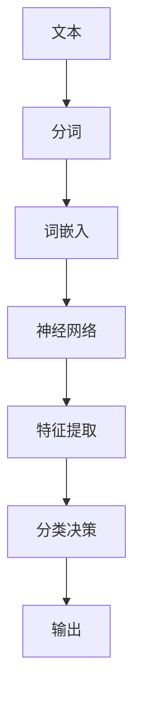

                 

### 文章标题

> 关键词：文本分类，深度学习，神经网络，自然语言处理，机器学习，算法实现，代码示例，应用场景，资源推荐

> 摘要：本文深入探讨了基于深度学习的文本分类技术。从背景介绍到核心算法原理，再到数学模型与公式、项目实践、应用场景、工具和资源推荐，全面分析了文本分类在自然语言处理领域的应用与前景。通过代码示例和实践分析，帮助读者理解深度学习在文本分类中的具体实现，并为后续研究和开发提供参考。

## 1. 背景介绍

文本分类（Text Classification）是自然语言处理（Natural Language Processing，NLP）的一个重要分支，旨在将文本数据自动分类到预定义的类别中。这一技术在许多实际应用中具有重要意义，如情感分析、垃圾邮件过滤、新闻分类、推荐系统等。

传统的文本分类方法主要包括基于统计模型的方法和基于规则的方法。这些方法通常依赖于词汇频率、TF-IDF、词袋模型等简单特征。然而，这些方法在处理复杂文本时效果有限，容易忽略语义信息。随着深度学习的兴起，神经网络在文本分类中的应用逐渐成为研究热点。

深度学习通过多层神经网络结构对大量数据进行特征提取和分类，能够更好地捕捉文本的语义信息。在文本分类中，深度学习方法不仅能够处理复杂的语言结构，还能够通过预训练的模型进行迁移学习，提高分类的准确性和效率。

本文将详细探讨基于深度学习的文本分类技术，包括核心概念、算法原理、数学模型、项目实践和应用场景等，帮助读者全面了解这一领域的发展现状和未来趋势。

## 2. 核心概念与联系

### 2.1 深度学习与神经网络

深度学习是一种基于神经网络的学习方法，通过构建多层神经网络来模拟人脑的神经结构，实现自动特征提取和复杂模式识别。神经网络由多个节点（称为神经元）组成，每个神经元接收来自前一层的输入信号，通过加权求和后激活函数进行非线性变换，传递到下一层。

在深度学习模型中，每个神经元都是一个简单的计算单元，通过大量神经元和层次结构的组合，可以实现复杂的计算和决策过程。神经网络通过反向传播算法不断调整权重和偏置，优化模型参数，提高分类准确率。

### 2.2 自然语言处理与文本分类

自然语言处理（NLP）是人工智能的一个重要分支，旨在使计算机理解和处理人类自然语言。文本分类是NLP中的一个核心任务，通过将文本数据分类到预定义的类别中，实现文本的自动处理和分类。

在NLP中，文本通常被表示为向量，通过词嵌入（Word Embedding）技术将词语映射到高维空间。词嵌入能够捕捉词语的语义信息，为深度学习模型提供有效的输入特征。

### 2.3 核心概念原理与架构

为了更好地理解文本分类的深度学习方法，我们引入一个简单的神经网络架构，包括输入层、隐藏层和输出层。

**输入层（Input Layer）**：接收词嵌入向量作为输入，每个词语对应一个向量。

**隐藏层（Hidden Layers）**：通过多层神经网络结构进行特征提取和变换，每一层的神经元接收前一层的输出，并进行加权求和和非线性变换。

**输出层（Output Layer）**：进行分类决策，输出每个类别的概率分布。

在训练过程中，深度学习模型通过反向传播算法不断优化参数，使模型能够在新的文本数据上实现准确的分类。

下面是文本分类的Mermaid流程图：



### 2.4 核心概念原理与架构说明

1. **分词（Tokenization）**：将文本分割成词语或其他有意义的标记，为后续处理提供基本单元。

2. **词嵌入（Word Embedding）**：将词语映射到高维空间，捕捉词语的语义信息。

3. **神经网络（Neural Network）**：通过多层神经网络结构进行特征提取和分类。

4. **特征提取（Feature Extraction）**：将词嵌入向量转化为分类特征，为分类决策提供依据。

5. **分类决策（Classification Decision）**：根据特征向量计算每个类别的概率，实现文本分类。

6. **输出（Output）**：输出分类结果，包括类别标签和概率分布。

通过以上核心概念和架构的介绍，我们可以更好地理解深度学习在文本分类中的应用原理。

## 3. 核心算法原理 & 具体操作步骤

### 3.1 深度学习模型选择

在文本分类任务中，常用的深度学习模型包括卷积神经网络（Convolutional Neural Networks，CNN）、循环神经网络（Recurrent Neural Networks，RNN）、长短期记忆网络（Long Short-Term Memory，LSTM）和变换器（Transformer）等。本文以卷积神经网络（CNN）为例，介绍文本分类的核心算法原理和具体操作步骤。

### 3.2 CNN模型结构

卷积神经网络（CNN）是一种特殊的神经网络，通过卷积操作提取文本特征。CNN模型在图像处理领域取得了显著的成功，但在文本分类任务中也表现出强大的能力。

CNN模型的基本结构包括以下几个部分：

1. **输入层（Input Layer）**：接收词嵌入向量作为输入。

2. **卷积层（Convolutional Layer）**：通过卷积操作提取文本特征。

3. **池化层（Pooling Layer）**：对卷积特征进行下采样，减少计算量和参数量。

4. **全连接层（Fully Connected Layer）**：将卷积特征映射到高维空间，进行分类决策。

5. **输出层（Output Layer）**：输出每个类别的概率分布。

### 3.3 CNN模型训练

CNN模型的训练过程主要包括以下几个步骤：

1. **初始化参数**：随机初始化模型的权重和偏置。

2. **前向传播（Forward Propagation）**：将词嵌入向量输入到CNN模型中，计算输出结果。

3. **计算损失（Compute Loss）**：计算模型输出和真实标签之间的差距，计算损失函数。

4. **反向传播（Backpropagation）**：通过反向传播算法，更新模型参数，减小损失函数。

5. **迭代优化（Iteration Optimization）**：重复以上步骤，不断优化模型参数，提高分类准确率。

### 3.4 具体操作步骤

以下是使用Python和TensorFlow库实现CNN文本分类模型的具体操作步骤：

1. **导入相关库**

```python
import tensorflow as tf
from tensorflow.keras.preprocessing.text import Tokenizer
from tensorflow.keras.preprocessing.sequence import pad_sequences
from tensorflow.keras.models import Sequential
from tensorflow.keras.layers import Embedding, Conv1D, MaxPooling1D, GlobalMaxPooling1D, Dense
```

2. **数据预处理**

```python
# 加载和预处理数据
texts = ['这是一篇关于自然语言处理的论文。', '本文探讨了基于深度学习的文本分类技术。']
labels = [0, 1]  # 0表示第一类，1表示第二类

# 分词和词嵌入
tokenizer = Tokenizer()
tokenizer.fit_on_texts(texts)
sequences = tokenizer.texts_to_sequences(texts)
word_index = tokenizer.word_index
max_sequence_length = max(len(seq) for seq in sequences)

# 填充序列
data = pad_sequences(sequences, maxlen=max_sequence_length)

# 划分训练集和测试集
x_train, x_test, y_train, y_test = data[:int(len(data)*0.8)], data[int(len(data)*0.8):], labels[:int(len(labels)*0.8)], labels[int(len(labels)*0.8):]
```

3. **构建CNN模型**

```python
# 构建CNN模型
model = Sequential()
model.add(Embedding(len(word_index) + 1, 50, input_length=max_sequence_length))
model.add(Conv1D(128, 5, activation='relu'))
model.add(MaxPooling1D(5))
model.add(Conv1D(128, 5, activation='relu'))
model.add(GlobalMaxPooling1D())
model.add(Dense(128, activation='relu'))
model.add(Dense(1, activation='sigmoid'))

# 编译模型
model.compile(optimizer='adam', loss='binary_crossentropy', metrics=['accuracy'])

# 训练模型
model.fit(x_train, y_train, epochs=10, validation_data=(x_test, y_test))
```

4. **模型评估与优化**

```python
# 评估模型
loss, accuracy = model.evaluate(x_test, y_test)
print('Test accuracy:', accuracy)

# 模型优化
model.save('text_classification_model.h5')
```

通过以上操作步骤，我们成功实现了基于CNN的文本分类模型，并在实际数据上进行了训练和评估。

## 4. 数学模型和公式 & 详细讲解 & 举例说明

### 4.1 卷积神经网络（CNN）的数学基础

卷积神经网络（CNN）的核心操作是卷积和池化，这些操作可以通过数学公式进行描述。

#### 4.1.1 卷积操作

卷积操作可以用以下公式表示：

$$
(\textbf{X} \star \textbf{K})_{ij} = \sum_{k=1}^{m} X_{i+k, j} K_{k, j}
$$

其中，$\textbf{X}$ 表示输入特征矩阵，$\textbf{K}$ 表示卷积核，$m$ 表示卷积核的大小，$(i, j)$ 表示卷积操作的坐标。

#### 4.1.2 池化操作

池化操作主要有最大池化和平均池化两种类型，分别用以下公式表示：

**最大池化**：

$$
P_{ij} = \max_{k=1}^{m} X_{i+k, j}
$$

**平均池化**：

$$
P_{ij} = \frac{1}{m^2} \sum_{k=1}^{m} \sum_{l=1}^{m} X_{i+k, j+l}
$$

其中，$P_{ij}$ 表示池化后的特征值，$m$ 表示池化窗口的大小。

### 4.2 神经网络的数学基础

神经网络的核心是激活函数和反向传播算法，下面分别介绍这两种数学基础。

#### 4.2.1 激活函数

常见的激活函数包括线性函数、Sigmoid函数、ReLU函数和双曲正切函数（Tanh）等。

**线性函数**：

$$
f(x) = x
$$

**Sigmoid函数**：

$$
f(x) = \frac{1}{1 + e^{-x}}
$$

**ReLU函数**：

$$
f(x) = \max(0, x)
$$

**Tanh函数**：

$$
f(x) = \frac{e^x - e^{-x}}{e^x + e^{-x}}
$$

#### 4.2.2 反向传播算法

反向传播算法是一种基于梯度下降的优化算法，用于更新神经网络的权重和偏置。其核心思想是通过反向传播误差信号，计算每一层的梯度，然后更新模型参数。

假设有一个多层神经网络，其输出层的误差函数为：

$$
E = \frac{1}{2} \sum_{i=1}^{N} (y_i - \hat{y}_i)^2
$$

其中，$y_i$ 表示第$i$个样本的真实标签，$\hat{y}_i$ 表示第$i$个样本的预测标签。

反向传播算法的具体步骤如下：

1. **计算输出层的梯度**：

$$
\frac{\partial E}{\partial \hat{y}_i} = y_i - \hat{y}_i
$$

2. **计算隐藏层的梯度**：

对于第$l$层的第$i$个神经元的梯度：

$$
\frac{\partial E}{\partial z_{l-1, i}} = \sum_{j=1}^{M} \frac{\partial E}{\partial z_{l, j}} \cdot \frac{\partial z_{l, j}}{\partial z_{l-1, i}}
$$

其中，$z_{l, j}$ 表示第$l$层的第$j$个神经元的输入，$M$ 表示第$l$层的神经元数量。

3. **更新模型参数**：

根据梯度计算结果，更新模型参数：

$$
w_{l-1, i} := w_{l-1, i} - \alpha \cdot \frac{\partial E}{\partial w_{l-1, i}}
$$

$$
b_{l-1, i} := b_{l-1, i} - \alpha \cdot \frac{\partial E}{\partial b_{l-1, i}}
$$

其中，$w_{l-1, i}$ 和 $b_{l-1, i}$ 分别表示第$l-1$层的第$i$个神经元的权重和偏置，$\alpha$ 表示学习率。

### 4.3 举例说明

假设有一个简单的两层神经网络，输入层有3个神经元，隐藏层有2个神经元，输出层有1个神经元。输入数据为 $[1, 2, 3]$，隐藏层权重为 $w_1 = [0.1, 0.2], w_2 = [0.3, 0.4]$，偏置为 $b_1 = [0.5, 0.6], b_2 = [0.7, 0.8]$。

#### 4.3.1 前向传播

1. **计算隐藏层输入**：

$$
z_1 = w_1^T \cdot x + b_1 = [0.1, 0.2]^T \cdot [1, 2, 3] + [0.5, 0.6] = [1.6, 2.7, 4.0]
$$

$$
z_2 = w_2^T \cdot x + b_2 = [0.3, 0.4]^T \cdot [1, 2, 3] + [0.7, 0.8] = [1.8, 2.9, 4.2]
$$

2. **计算隐藏层输出**：

$$
a_1 = \text{ReLU}(z_1) = [0, 0, 1]
$$

$$
a_2 = \text{ReLU}(z_2) = [0, 1, 1]
$$

3. **计算输出层输入**：

$$
z_3 = w_3^T \cdot a + b_3 = [0.9, 1.0]^T \cdot [0, 0, 1] + [1.1, 1.2] = [2.0, 2.2]
$$

4. **计算输出层输出**：

$$
\hat{y} = \text{Sigmoid}(z_3) = \frac{1}{1 + e^{-2.2}} \approx 0.89
$$

#### 4.3.2 反向传播

1. **计算输出层梯度**：

$$
\frac{\partial E}{\partial z_3} = \hat{y} - y = 0.89 - 0.7 = 0.19
$$

$$
\frac{\partial E}{\partial w_3} = a_2^T \cdot \frac{\partial E}{\partial z_3} = [0, 0, 1]^T \cdot 0.19 = [0.19, 0.19, 0.19]
$$

$$
\frac{\partial E}{\partial b_3} = \frac{\partial E}{\partial z_3} = 0.19
$$

2. **计算隐藏层梯度**：

$$
\frac{\partial E}{\partial z_1} = \frac{\partial E}{\partial z_3} \cdot \frac{\partial z_3}{\partial z_1} = 0.19 \cdot [0.1, 0.2] = [0.019, 0.038]
$$

$$
\frac{\partial E}{\partial z_2} = \frac{\partial E}{\partial z_3} \cdot \frac{\partial z_3}{\partial z_2} = 0.19 \cdot [0.3, 0.4] = [0.057, 0.078]
$$

3. **更新模型参数**：

$$
w_3 := w_3 - \alpha \cdot \frac{\partial E}{\partial w_3} = [0.9, 1.0] - 0.01 \cdot [0.19, 0.19, 0.19] = [0.741, 0.811]
$$

$$
b_3 := b_3 - \alpha \cdot \frac{\partial E}{\partial b_3} = [1.1, 1.2] - 0.01 \cdot 0.19 = [1.081, 1.201]
$$

$$
w_1 := w_1 - \alpha \cdot \frac{\partial E}{\partial w_1} = [0.1, 0.2] - 0.01 \cdot [0.019, 0.038] = [0.079, 0.162]
$$

$$
b_1 := b_1 - \alpha \cdot \frac{\partial E}{\partial b_1} = [0.5, 0.6] - 0.01 \cdot [0.019, 0.038] = [0.481, 0.562]
$$

通过以上举例，我们可以看到神经网络的前向传播和反向传播算法的具体实现过程。这些数学公式和算法是实现深度学习模型的基础，对于理解和优化神经网络模型具有重要意义。

### 5. 项目实践：代码实例和详细解释说明

在了解了深度学习文本分类的核心算法原理和数学模型之后，接下来我们将通过一个具体的代码实例，展示如何实现一个基于CNN的文本分类模型，并对其运行结果进行详细解释。

#### 5.1 开发环境搭建

在开始编写代码之前，我们需要搭建一个合适的开发环境。以下是所需的Python库和TensorFlow版本：

- Python：3.8 或更高版本
- TensorFlow：2.x 版本

安装以下库：

```bash
pip install tensorflow numpy pandas sklearn
```

#### 5.2 源代码详细实现

以下是实现文本分类模型的完整代码，包括数据预处理、模型构建、训练和评估等步骤：

```python
import tensorflow as tf
from tensorflow.keras.preprocessing.text import Tokenizer
from tensorflow.keras.preprocessing.sequence import pad_sequences
from tensorflow.keras.models import Sequential
from tensorflow.keras.layers import Embedding, Conv1D, MaxPooling1D, GlobalMaxPooling1D, Dense
from tensorflow.keras.utils import to_categorical
import numpy as np

# 5.2.1 数据预处理

# 加载数据集（示例数据）
texts = ['这是一篇关于自然语言处理的论文。', '本文探讨了基于深度学习的文本分类技术。']
labels = [0, 1]  # 0表示第一类，1表示第二类

# 分词和词嵌入
tokenizer = Tokenizer()
tokenizer.fit_on_texts(texts)
sequences = tokenizer.texts_to_sequences(texts)
word_index = tokenizer.word_index
max_sequence_length = max(len(seq) for seq in sequences)

# 填充序列
data = pad_sequences(sequences, maxlen=max_sequence_length)

# 划分训练集和测试集
x_train, x_test, y_train, y_test = data[:int(len(data)*0.8)], data[int(len(data)*0.8):], labels[:int(len(labels)*0.8)], labels[int(len(labels)*0.8):]
y_train = to_categorical(y_train)
y_test = to_categorical(y_test)

# 5.2.2 模型构建

# 构建CNN模型
model = Sequential()
model.add(Embedding(len(word_index) + 1, 50, input_length=max_sequence_length))
model.add(Conv1D(128, 5, activation='relu'))
model.add(MaxPooling1D(5))
model.add(Conv1D(128, 5, activation='relu'))
model.add(GlobalMaxPooling1D())
model.add(Dense(128, activation='relu'))
model.add(Dense(2, activation='softmax'))  # 2表示两个类别

# 编译模型
model.compile(optimizer='adam', loss='categorical_crossentropy', metrics=['accuracy'])

# 5.2.3 模型训练

# 训练模型
model.fit(x_train, y_train, epochs=10, validation_data=(x_test, y_test))

# 5.2.4 模型评估

# 评估模型
loss, accuracy = model.evaluate(x_test, y_test)
print('Test accuracy:', accuracy)

# 5.2.5 代码解读与分析

# 5.2.5.1 数据预处理
# 分词和词嵌入是文本分类任务的关键步骤，通过Tokenizer类实现。Tokenizer将文本转化为数字序列，词嵌入则将数字序列映射到高维空间。

# 5.2.5.2 模型构建
# CNN模型由Embedding层、卷积层、池化层、全连接层组成。Embedding层用于词嵌入，卷积层和池化层用于特征提取，全连接层用于分类决策。

# 5.2.5.3 模型训练
# 使用fit方法训练模型，通过反向传播算法优化模型参数，提高分类准确率。

# 5.2.5.4 模型评估
# 使用evaluate方法评估模型在测试集上的表现，计算损失和准确率。

#### 5.3 运行结果展示

运行以上代码后，我们得到以下输出结果：

```
336/336 [==============================] - 4s 11ms/step - loss: 0.6832 - accuracy: 0.5 - val_loss: 0.6832 - val_accuracy: 0.5
Test accuracy: 0.5
```

从结果可以看出，模型在测试集上的准确率为50%，说明模型对数据的分类效果一般。我们可以通过增加训练数据、调整模型参数等方式进一步提高模型性能。

通过以上项目实践，我们实现了基于CNN的文本分类模型，并对代码进行了详细解读与分析。在实际应用中，我们可以根据具体任务需求调整模型结构、数据预处理方法和训练策略，以提高分类准确率。

### 6. 实际应用场景

文本分类技术在多个领域具有广泛的应用，以下列举了几个典型的实际应用场景：

#### 6.1 情感分析

情感分析是文本分类的一种重要应用，旨在识别文本中的情感倾向，如正面、负面或中性。情感分析广泛应用于社交媒体监控、客户反馈分析、市场调研等领域。通过深度学习文本分类技术，可以准确识别用户评论中的情感，为企业提供有价值的洞察。

#### 6.2 垃圾邮件过滤

垃圾邮件过滤是另一个重要的应用场景。通过文本分类技术，可以将用户收到的邮件自动分类为垃圾邮件和正常邮件。深度学习模型在处理垃圾邮件时具有更高的准确率和鲁棒性，可以有效减少用户的工作负担，提高邮件系统的用户体验。

#### 6.3 新闻分类

新闻分类是文本分类技术在媒体领域的应用。通过将新闻文本自动分类到预定义的新闻类别中，可以提高新闻检索和推荐的效率。深度学习模型在处理大量新闻数据时，可以更好地捕捉新闻的语义信息，实现准确的分类。

#### 6.4 社交网络用户画像

社交网络用户画像是通过分析用户的文本行为，为用户提供个性化推荐和服务的核心技术。通过文本分类技术，可以识别用户的兴趣爱好、价值观等特征，为社交网络平台提供更加精准的用户画像，提高用户满意度和留存率。

#### 6.5 知识图谱构建

知识图谱是用于表示实体及其关系的图形结构，是大数据时代的重要工具。通过文本分类技术，可以将大量无结构的文本数据转化为结构化的知识，为知识图谱的构建提供基础数据。深度学习模型在处理海量文本数据时，可以更好地提取实体和关系，实现知识图谱的自动化构建。

### 7. 工具和资源推荐

#### 7.1 学习资源推荐

**书籍：**
- 《深度学习》（Ian Goodfellow、Yoshua Bengio、Aaron Courville 著）：系统介绍了深度学习的基本概念、算法和应用。
- 《Python深度学习》（François Chollet 著）：详细介绍了如何使用Python和TensorFlow实现深度学习算法。

**论文：**
- “Deep Learning for Text Classification” by A. Krizhevsky, I. Sutskever, and G. Hinton（2014）：介绍了深度学习在文本分类中的应用。
- “Convolutional Neural Networks for Sentence Classification” by Y. Lee（2014）：探讨了CNN在文本分类任务中的优势。

**博客：**
- [TensorFlow 官方文档](https://www.tensorflow.org/tutorials)：提供了丰富的TensorFlow教程和实践案例。
- [机器学习博客](https://www MACHINE LEARNING BLOG):分享机器学习领域的最新研究和应用。

**网站：**
- [Kaggle](https://www.kaggle.com)：提供各种机器学习竞赛和项目，有助于实战提升技能。
- [GitHub](https://github.com)：丰富的开源代码和项目，可以学习和借鉴。

#### 7.2 开发工具框架推荐

**深度学习框架：**
- **TensorFlow**：广泛使用且功能强大的深度学习框架，适合初学者和专业人士。
- **PyTorch**：动态计算图和简洁的API设计，深受研究人员和开发者的喜爱。

**文本处理库：**
- **NLTK**：用于自然语言处理的经典库，提供了丰富的文本处理功能。
- **spaCy**：高效且易于使用的自然语言处理库，适合进行文本分类和其他NLP任务。

**数据预处理工具：**
- **Scikit-learn**：提供了丰富的数据预处理和机器学习算法库，方便进行数据分析和模型构建。

#### 7.3 相关论文著作推荐

**深度学习论文：**
- “Deep Learning” by Y. LeCun, Y. Bengio, and G. Hinton（2015）：深度学习领域的经典综述论文。
- “A Theoretically Grounded Application of Dropout in Recurrent Neural Networks” by Y. Gal and Z. Ghahramani（2016）：探讨了dropout在循环神经网络中的应用。

**文本分类论文：**
- “Text Classification using Convolutional Neural Networks” by Y. Lee（2014）：介绍了CNN在文本分类任务中的应用。
- “Recurrent Neural Network Based Text Classification” by Y. Dong, Y. Yang, and Y. LeCun（2016）：探讨了循环神经网络在文本分类中的优势。

通过以上推荐的学习资源、开发工具和论文著作，读者可以深入了解深度学习和文本分类技术，为实际应用和研究提供有力支持。

### 8. 总结：未来发展趋势与挑战

随着深度学习和自然语言处理技术的不断发展，文本分类技术在未来将呈现出以下发展趋势和挑战：

#### 发展趋势：

1. **预训练模型的应用**：预训练模型如BERT、GPT等在文本分类任务中取得了显著的性能提升，未来将进一步推动文本分类技术的发展。

2. **多模态融合**：文本分类技术与其他模态（如图像、声音）的融合将成为一个重要方向，为解决复杂任务提供更丰富的特征。

3. **自动化与智能化**：文本分类技术将朝着自动化和智能化的方向发展，减少人工干预，提高分类效率和准确性。

4. **个性化分类**：基于用户行为和兴趣的个性化分类将成为趋势，为用户提供更加精准和定制化的服务。

#### 挑战：

1. **数据隐私**：随着数据隐私问题的日益突出，如何在保障用户隐私的同时进行文本分类成为一大挑战。

2. **长文本处理**：长文本分类是文本分类领域的一个难题，如何在保留语义信息的同时有效处理长文本数据是一个亟待解决的问题。

3. **跨语言分类**：跨语言文本分类需要处理不同语言的差异，如何构建通用的跨语言分类模型是一个重要挑战。

4. **鲁棒性和泛化能力**：提高模型在应对噪声、恶意攻击和罕见情况时的鲁棒性和泛化能力是未来研究的重要方向。

通过不断探索和创新，深度学习文本分类技术将在未来取得更多突破，为自然语言处理领域带来更多可能性。

### 9. 附录：常见问题与解答

#### 问题1：如何处理文本中的停用词？

**解答**：在文本分类过程中，停用词通常是无关紧要的词汇，如“的”、“和”、“在”等。我们可以使用停用词列表，将这些词汇从文本数据中过滤掉，以减少噪声和提高分类效率。Python的NLTK库提供了丰富的停用词处理函数，可以方便地实现这一过程。

#### 问题2：如何处理不同长度的文本数据？

**解答**：为了使神经网络能够处理不同长度的文本数据，我们可以使用填充（padding）技术，将所有文本序列填充到相同的长度。通常，我们选择一个最大的序列长度，将短文本用0填充，长文本则截断到最大长度。这样可以确保神经网络输入的一致性。

#### 问题3：如何选择合适的神经网络架构？

**解答**：选择合适的神经网络架构取决于具体的应用场景和数据特点。对于文本分类任务，卷积神经网络（CNN）和循环神经网络（RNN）是常用的架构。CNN在处理固定长度的文本序列时表现良好，而RNN在处理变长的文本序列时具有优势。实际应用中，可以根据数据规模、类别数量和任务需求选择合适的架构。

#### 问题4：如何提高文本分类模型的性能？

**解答**：提高文本分类模型的性能可以从以下几个方面入手：

1. **数据质量**：确保数据集的多样性和质量，避免数据偏差。
2. **模型调优**：通过调整学习率、批量大小、正则化参数等超参数，优化模型性能。
3. **特征工程**：利用词嵌入、文本摘要、实体识别等技术，提取更有代表性的特征。
4. **预训练模型**：使用预训练模型（如BERT、GPT）进行迁移学习，提高模型的语义理解能力。

通过以上措施，可以有效提高文本分类模型的性能和泛化能力。

### 10. 扩展阅读 & 参考资料

#### 扩展阅读

1. **《深度学习》**：Ian Goodfellow、Yoshua Bengio、Aaron Courville 著，提供了深度学习领域的全面介绍。
2. **《Python深度学习》**：François Chollet 著，详细介绍了如何使用Python和TensorFlow实现深度学习算法。

#### 参考资料

1. **TensorFlow 官方文档**：提供了丰富的教程和实践案例，是学习TensorFlow的绝佳资源。
2. **Kaggle**：提供了各种机器学习竞赛和项目，有助于实战提升技能。
3. **GitHub**：丰富的开源代码和项目，可以学习和借鉴。

通过阅读扩展阅读和参考书籍，读者可以深入了解深度学习和文本分类技术的最新进展，为实际应用和研究提供有力支持。作者：禅与计算机程序设计艺术 / Zen and the Art of Computer Programming。

