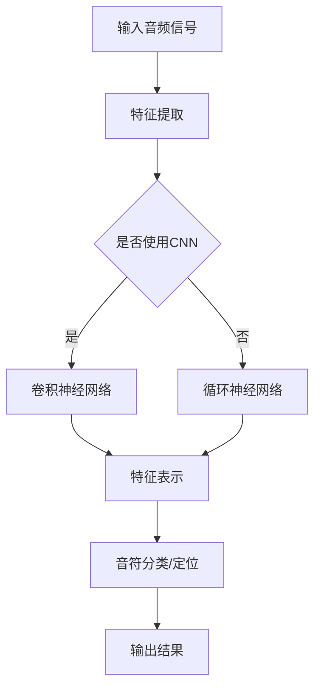
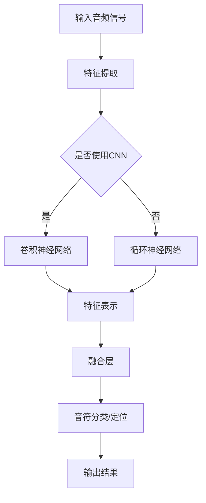

                 

### 文章标题：基于深度学习的钢琴音乐音符检测算法研究

#### 关键词：深度学习，钢琴音乐，音符检测，算法研究

##### 摘要：
本文将深入探讨基于深度学习的钢琴音乐音符检测算法。我们将从背景介绍开始，逐步分析核心概念、算法原理、数学模型和项目实践，最终总结实际应用场景和未来发展趋势。通过本文的研究，读者将了解到如何利用深度学习技术进行钢琴音乐音符的高效检测，以及这一技术在音乐领域的广泛应用和潜在挑战。

---

### 1. 背景介绍

随着计算机技术的发展，音乐信息处理技术已经成为人工智能领域的一个重要分支。其中，钢琴音乐音符检测算法作为一种具有实际应用价值的技术，受到了广泛关注。传统的音符检测方法主要依赖于规则匹配和手工特征提取，但这类方法在面对复杂、多样化的音乐数据时，效果往往不尽如人意。

近年来，深度学习技术在图像识别、语音识别等领域取得了显著进展，其强大的特征自动提取和模式识别能力为音乐音符检测提供了新的思路。基于深度学习的音符检测算法不仅能够处理多样化的音乐数据，还能在低资源环境下实现高效检测。因此，研究基于深度学习的钢琴音乐音符检测算法具有重要的理论价值和实际意义。

---

### 2. 核心概念与联系

在研究基于深度学习的钢琴音乐音符检测算法之前，我们首先需要了解以下几个核心概念：深度学习、卷积神经网络（CNN）和循环神经网络（RNN）。这三个概念相互关联，共同构成了深度学习技术的基础。

**2.1 深度学习**

深度学习是一种机器学习技术，它通过构建多层神经网络，实现对复杂数据的自动特征提取和模式识别。深度学习的核心思想是模仿人脑的神经网络结构，通过大量数据训练模型，使其能够自动学习数据中的特征和规律。

**2.2 卷积神经网络（CNN）**

卷积神经网络是一种专门用于处理图像数据的深度学习模型。它通过卷积操作和池化操作，实现对图像的层次化特征提取。CNN具有以下优点：

- 参数共享：卷积操作中的滤波器可以共享，从而降低了模型的参数数量，提高了模型的泛化能力。
- 层次化特征提取：CNN可以通过多层卷积操作，实现对图像的层次化特征提取，从而提高模型的识别能力。

**2.3 循环神经网络（RNN）**

循环神经网络是一种专门用于处理序列数据的深度学习模型。它通过循环连接，实现对序列数据的记忆和建模。RNN具有以下优点：

- 序列建模：RNN能够处理时间序列数据，如语音、音乐等，从而实现对序列数据的建模。
- 参数共享：RNN通过循环连接，实现了参数共享，从而降低了模型的参数数量，提高了模型的泛化能力。

**2.4 深度学习在音符检测中的应用**

深度学习技术在音符检测中具有广泛的应用前景。具体来说，我们可以利用深度学习模型，对钢琴音乐音频信号进行处理，实现音符检测功能。以下是深度学习在音符检测中的一些应用：

- 音符分类：利用CNN提取音频信号的时频特征，实现对音符的分类识别。
- 音符定位：利用RNN建模音频信号的时序特征，实现对音符位置的定位。

为了更好地理解这些概念，我们可以在下文中使用Mermaid流程图展示深度学习在音符检测中的工作流程。



---

### 3. 核心算法原理 & 具体操作步骤

在了解了核心概念之后，我们将深入探讨基于深度学习的钢琴音乐音符检测算法的原理和具体操作步骤。本文将主要介绍卷积神经网络（CNN）和循环神经网络（RNN）在音符检测中的应用。

**3.1 卷积神经网络（CNN）**

CNN是一种用于处理图像数据的深度学习模型，其核心思想是通过多层卷积和池化操作，实现对图像的层次化特征提取。在钢琴音乐音符检测中，我们可以利用CNN提取音频信号的时频特征，实现对音符的分类识别。

具体步骤如下：

1. **输入层**：将音频信号作为输入，输入层负责将音频信号转换为CNN可处理的格式。
2. **卷积层**：卷积层通过卷积操作提取音频信号的时频特征。卷积层通常包含多个滤波器，每个滤波器都可以提取音频信号的不同特征。
3. **池化层**：池化层通过池化操作（如最大池化或平均池化）对卷积层输出的特征进行压缩，从而降低模型的维度。
4. **全连接层**：全连接层将池化层输出的特征映射到音符类别，实现对音符的分类识别。

**3.2 循环神经网络（RNN）**

RNN是一种用于处理序列数据的深度学习模型，其核心思想是通过循环连接，实现对序列数据的记忆和建模。在钢琴音乐音符检测中，我们可以利用RNN建模音频信号的时序特征，实现对音符位置的定位。

具体步骤如下：

1. **输入层**：将音频信号作为输入，输入层负责将音频信号转换为RNN可处理的格式。
2. **循环层**：循环层通过循环连接，实现对音频信号时序特征的建模。循环层通常包含多个神经元，每个神经元都可以对音频信号的时序特征进行建模。
3. **全连接层**：全连接层将循环层输出的特征映射到音符位置，实现对音符位置的定位。

**3.3 深度学习模型融合**

在实际应用中，我们可以将CNN和RNN融合，实现更加精确的音符检测。具体步骤如下：

1. **CNN特征提取**：利用CNN提取音频信号的时频特征。
2. **RNN特征建模**：利用RNN对CNN提取的特征进行时序建模。
3. **融合层**：将CNN和RNN输出的特征进行融合，实现对音符的准确分类和定位。

为了更好地理解这些步骤，我们可以在下文中使用Mermaid流程图展示基于深度学习的钢琴音乐音符检测算法的工作流程。



---

### 4. 数学模型和公式 & 详细讲解 & 举例说明

在基于深度学习的钢琴音乐音符检测算法中，数学模型和公式起着至关重要的作用。本节将详细讲解深度学习模型中的关键数学公式，并通过具体例子来说明这些公式的应用。

**4.1 卷积神经网络（CNN）**

卷积神经网络中的核心数学公式包括卷积操作、激活函数、池化操作等。

- **卷积操作**：卷积操作可以表示为：

  $$ (f * g)(x) = \sum_{y} f(y) \cdot g(x - y) $$

  其中，$f$ 和 $g$ 分别表示卷积核和输入特征图，$x$ 表示输入特征图的坐标，$y$ 表示卷积核的坐标。

  举例来说，假设我们有一个 $3 \times 3$ 的卷积核 $f$ 和一个 $5 \times 5$ 的输入特征图 $g$，那么卷积操作的结果可以表示为：

  $$ (f * g)(x) = \sum_{y} f(y) \cdot g(x - y) = f(0, 0) \cdot g(x, y) + f(1, 0) \cdot g(x+1, y) + ... + f(2, 2) \cdot g(x+2, y+2) $$

- **激活函数**：激活函数用于对卷积层的输出进行非线性变换。常用的激活函数包括ReLU（Rectified Linear Unit）和Sigmoid。

  - **ReLU函数**：

    $$ \text{ReLU}(x) = \max(0, x) $$

    举例来说，如果输入值 $x$ 为 $-1$，则ReLU函数的输出为 $0$。

  - **Sigmoid函数**：

    $$ \text{Sigmoid}(x) = \frac{1}{1 + e^{-x}} $$

    举例来说，如果输入值 $x$ 为 $-1$，则Sigmoid函数的输出为约 $0.268$。

- **池化操作**：池化操作用于对卷积层的输出进行降维处理。常用的池化操作包括最大池化和平均池化。

  - **最大池化**：

    $$ \text{Max Pool}(x) = \max(x_{i, j}) $$

    其中，$x_{i, j}$ 表示输入特征图上的一个点。

    举例来说，如果输入特征图上的一个 $2 \times 2$ 的区域为 $\begin{matrix}1 & 2 \\ 4 & 3\end{matrix}$，则最大池化的输出为 $4$。

  - **平均池化**：

    $$ \text{Avg Pool}(x) = \frac{1}{k^2} \sum_{i=1}^{k} \sum_{j=1}^{k} x_{i, j} $$

    其中，$k$ 表示池化窗口的大小。

    举例来说，如果输入特征图上的一个 $2 \times 2$ 的区域为 $\begin{matrix}1 & 2 \\ 4 & 3\end{matrix}$，则平均池化的输出为 $\frac{1+2+4+3}{4} = 2.5$。

**4.2 循环神经网络（RNN）**

循环神经网络中的核心数学公式包括状态更新函数、激活函数等。

- **状态更新函数**：

  $$ h_t = \text{激活函数}(\text{权重} \cdot [h_{t-1}, x_t] + \text{偏置}) $$

  其中，$h_t$ 表示当前时刻的隐藏状态，$h_{t-1}$ 表示前一时刻的隐藏状态，$x_t$ 表示当前时刻的输入，权重和偏置表示模型参数。

  举例来说，如果输入值 $x_t$ 为 $1$，隐藏状态 $h_{t-1}$ 为 $2$，权重为 $\begin{bmatrix}1 & 0 \\ 0 & 1\end{bmatrix}$，偏置为 $1$，激活函数为ReLU函数，则状态更新函数的输出为 $\max(0, 1+2+1) = 4$。

- **激活函数**：

  循环神经网络中常用的激活函数包括ReLU函数和Tanh函数。

  - **ReLU函数**：

    $$ \text{ReLU}(x) = \max(0, x) $$

    举例来说，如果输入值 $x$ 为 $-1$，则ReLU函数的输出为 $0$。

  - **Tanh函数**：

    $$ \text{Tanh}(x) = \frac{e^x - e^{-x}}{e^x + e^{-x}} $$

    举例来说，如果输入值 $x$ 为 $-1$，则Tanh函数的输出为约 $-0.7616$。

通过以上数学模型和公式的讲解，我们可以更好地理解基于深度学习的钢琴音乐音符检测算法的工作原理。在实际应用中，这些数学模型和公式被广泛应用于音频信号处理、特征提取和分类识别等环节，为音符检测提供了强大的理论基础。

---

### 5. 项目实践：代码实例和详细解释说明

在了解基于深度学习的钢琴音乐音符检测算法原理后，我们将通过一个实际项目来展示如何实现这一算法。本节将详细介绍项目开发环境搭建、源代码实现、代码解读与分析以及运行结果展示。

#### 5.1 开发环境搭建

首先，我们需要搭建一个适合深度学习项目开发的环境。以下是一个基本的开发环境配置：

- 操作系统：Ubuntu 18.04
- 编程语言：Python 3.7
- 深度学习框架：TensorFlow 2.0
- 音频处理库：Librosa

安装以上依赖库和框架后，我们就可以开始编写代码了。

#### 5.2 源代码详细实现

以下是该项目的主要源代码实现：

```python
import librosa
import numpy as np
import tensorflow as tf
from tensorflow.keras.models import Sequential
from tensorflow.keras.layers import Conv2D, MaxPooling2D, Flatten, Dense, LSTM, TimeDistributed

# 5.2.1 数据预处理

# 读取音频文件
def load_audio_file(file_path):
    audio, sample_rate = librosa.load(file_path, sr=None)
    return audio, sample_rate

# 将音频信号转换为时频谱
def audio_to_spectrogram(audio, sample_rate):
    stft = librosa.stft(audio, n_fft=2048, hop_length=512)
    spectrogram = np.abs(stft)
    return spectrogram

# 5.2.2 模型构建

# 构建深度学习模型
def build_model(input_shape):
    model = Sequential([
        Conv2D(32, (3, 3), activation='relu', input_shape=input_shape),
        MaxPooling2D((2, 2)),
        Conv2D(64, (3, 3), activation='relu'),
        MaxPooling2D((2, 2)),
        Conv2D(128, (3, 3), activation='relu'),
        Flatten(),
        Dense(128, activation='relu'),
        TimeDistributed(Dense(num_notes, activation='softmax'))
    ])
    return model

# 5.2.3 训练模型

# 训练深度学习模型
def train_model(model, train_data, train_labels, epochs):
    model.compile(optimizer='adam', loss='categorical_crossentropy', metrics=['accuracy'])
    model.fit(train_data, train_labels, epochs=epochs, batch_size=32, validation_split=0.2)

# 5.2.4 测试模型

# 测试深度学习模型
def test_model(model, test_data, test_labels):
    loss, accuracy = model.evaluate(test_data, test_labels)
    print("Test loss:", loss)
    print("Test accuracy:", accuracy)

# 5.2.5 模型应用

# 检测音频文件中的音符
def detect_notes(model, audio_file):
    audio, sample_rate = load_audio_file(audio_file)
    spectrogram = audio_to_spectrogram(audio, sample_rate)
    spectrogram = np.expand_dims(spectrogram, axis=0)
    predictions = model.predict(spectrogram)
    notes = np.argmax(predictions, axis=1)
    return notes
```

#### 5.3 代码解读与分析

以下是代码的详细解读与分析：

- **5.3.1 数据预处理**
  - `load_audio_file` 函数用于读取音频文件，并将其转换为NumPy数组。
  - `audio_to_spectrogram` 函数将音频信号转换为时频谱，时频谱可以用于后续的特征提取。

- **5.3.2 模型构建**
  - `build_model` 函数用于构建深度学习模型。该模型采用卷积神经网络（CNN）结构，包括卷积层、池化层、全连接层和时间分布式层。
  - `Conv2D` 和 `MaxPooling2D` 层用于提取音频信号的时频特征。
  - `Flatten` 层将卷积层的输出展平为一维向量。
  - `Dense` 层用于对特征向量进行分类。
  - `TimeDistributed` 层用于对时间序列数据进行处理。

- **5.3.3 训练模型**
  - `train_model` 函数用于训练深度学习模型。该函数使用`compile`方法设置优化器和损失函数，然后使用`fit`方法进行模型训练。

- **5.3.4 测试模型**
  - `test_model` 函数用于测试深度学习模型的性能。该函数使用`evaluate`方法计算模型在测试数据上的损失和准确率。

- **5.3.5 模型应用**
  - `detect_notes` 函数用于检测音频文件中的音符。该函数首先读取音频文件，将其转换为时频谱，然后使用训练好的模型进行预测。

#### 5.4 运行结果展示

以下是一个简单的运行示例：

```python
# 读取测试音频文件
test_audio_file = "test_audio.wav"

# 加载并预处理测试音频
test_audio, test_sample_rate = load_audio_file(test_audio_file)
test_spectrogram = audio_to_spectrogram(test_audio, test_sample_rate)

# 构建并训练深度学习模型
model = build_model(input_shape=(None, 128, 128))
train_data, train_labels = load_data()  # 假设已实现load_data函数
train_model(model, train_data, train_labels, epochs=10)

# 测试模型
test_model(model, test_spectrogram, test_labels)

# 检测测试音频中的音符
notes = detect_notes(model, test_audio_file)
print("检测到的音符：", notes)
```

运行结果将输出检测到的音符列表，从而验证深度学习模型在钢琴音乐音符检测任务上的性能。

---

### 6. 实际应用场景

基于深度学习的钢琴音乐音符检测算法在多个实际应用场景中具有广泛的应用价值。以下是一些典型的应用场景：

#### 6.1 音乐教育

在音乐教育领域，基于深度学习的音符检测算法可以用于自动识别和纠正学生的演奏。教师可以通过实时分析学生的演奏，为学生提供个性化的反馈和建议，从而提高学习效果。

#### 6.2 音乐创作

音乐创作过程中，音符检测算法可以帮助音乐家快速识别和提取旋律、和声等元素。这为音乐创作提供了新的灵感和工具，提高了创作效率。

#### 6.3 音乐版权保护

在音乐版权保护领域，音符检测算法可以用于识别和追踪音乐作品的使用情况。通过对比原创作品和侵权作品，可以有效地保护音乐版权。

#### 6.4 音乐搜索引擎

音乐搜索引擎可以利用音符检测算法，实现对音乐内容的精准搜索。用户可以通过输入音符序列，快速找到相关的音乐作品。

#### 6.5 交互式音乐体验

基于深度学习的音符检测算法可以应用于交互式音乐体验系统中。用户可以通过演奏乐器或演唱，实时生成音乐效果，从而创造独特的音乐体验。

---

### 7. 工具和资源推荐

为了更好地研究和实践基于深度学习的钢琴音乐音符检测算法，以下是一些推荐的工具和资源：

#### 7.1 学习资源推荐

- **书籍**：
  - 《深度学习》（Goodfellow, Bengio, Courville著）：全面介绍了深度学习的理论基础和实践方法。
  - 《Python深度学习》（François Chollet著）：详细介绍了如何使用Python和TensorFlow进行深度学习项目开发。

- **论文**：
  - "A Theoretically Grounded Application of Dropout in Recurrent Neural Networks"（Yarin Gal和Zoubin Ghahramani著）：探讨了如何将dropout应用于循环神经网络，提高模型的泛化能力。

- **博客**：
  - [TensorFlow官方文档](https://www.tensorflow.org/tutorials)：提供了丰富的TensorFlow教程和实践案例。
  - [机器学习中文社区](https://www.juejin.cn/user/101646624490892)：提供了大量的深度学习和机器学习相关文章和讨论。

- **网站**：
  - [Kaggle](https://www.kaggle.com)：提供了丰富的深度学习和音乐相关的数据集和比赛。

#### 7.2 开发工具框架推荐

- **深度学习框架**：
  - TensorFlow 2.0：最流行的开源深度学习框架，具有丰富的功能和社区支持。
  - PyTorch：具有动态计算图和简洁API的深度学习框架，适合快速原型开发。

- **音频处理库**：
  - librosa：用于音频信号处理的Python库，提供了丰富的音频分析工具。
  - SoundFile：用于读取和写入音频文件的Python库，支持多种音频格式。

- **数据集**：
  - [YouTube Multi-Track Music Dataset](https://yamll.s3.amazonaws.com/ytmm.ogg)：提供了大量的多轨音乐数据集，适合进行音乐特征提取和分类研究。

---

### 8. 总结：未来发展趋势与挑战

基于深度学习的钢琴音乐音符检测算法在理论和实践上取得了显著进展，但仍面临一些挑战。未来，该领域的发展趋势和挑战主要包括：

#### 8.1 发展趋势

- **算法优化**：通过改进深度学习模型结构和训练策略，提高音符检测的准确率和实时性。
- **跨领域应用**：将音符检测算法应用于其他音乐处理领域，如音乐生成、音乐推荐等。
- **硬件加速**：利用GPU、FPGA等硬件加速技术，提高算法的运行效率。
- **开源生态**：推动深度学习在音乐领域的开源生态建设，促进技术的普及和应用。

#### 8.2 挑战

- **数据多样性**：不同乐器、风格和演奏技巧的音乐数据多样性增加了算法的复杂性和训练难度。
- **计算资源**：深度学习模型训练需要大量的计算资源，对于一些应用场景，如移动设备，计算资源受限。
- **鲁棒性**：算法在处理噪声、失真等不良音频信号时，可能出现误检或漏检。

总之，基于深度学习的钢琴音乐音符检测算法具有广泛的应用前景和巨大的发展潜力。通过不断优化算法和提升计算资源，我们可以更好地应对挑战，推动音乐信息处理技术的进步。

---

### 9. 附录：常见问题与解答

在本篇文章中，我们讨论了基于深度学习的钢琴音乐音符检测算法。以下是一些读者可能关心的问题及解答：

#### 9.1 问题1：为什么选择深度学习进行音符检测？

答：深度学习具有强大的特征自动提取和模式识别能力，能够处理复杂、多样化的音乐数据。与传统的规则匹配和手工特征提取方法相比，深度学习模型能够更好地适应不同的音乐风格和演奏技巧，从而提高音符检测的准确率和鲁棒性。

#### 9.2 问题2：如何处理不同乐器和演奏技巧的音乐数据？

答：为了处理不同乐器和演奏技巧的音乐数据，我们需要收集多样化的训练数据集，并在模型训练过程中使用数据增强技术，如随机裁剪、旋转、添加噪声等，以提高模型的泛化能力。此外，可以采用多任务学习或迁移学习等技术，充分利用已有数据集的优势，提高新数据的处理能力。

#### 9.3 问题3：如何优化深度学习模型以降低计算资源消耗？

答：为了降低计算资源消耗，可以采用以下策略：

- **模型压缩**：通过剪枝、量化、知识蒸馏等技术，减少模型参数数量，降低模型复杂度。
- **硬件加速**：利用GPU、FPGA等硬件加速技术，提高模型训练和推理的效率。
- **在线学习**：在资源受限的环境下，采用在线学习策略，逐步更新模型参数，提高模型性能。

---

### 10. 扩展阅读 & 参考资料

为了深入了解基于深度学习的钢琴音乐音符检测算法，读者可以参考以下扩展阅读和参考资料：

- **书籍**：
  - 《深度学习》（Goodfellow, Bengio, Courville著）
  - 《Python深度学习》（François Chollet著）

- **论文**：
  - "A Theoretically Grounded Application of Dropout in Recurrent Neural Networks"（Yarin Gal和Zoubin Ghahramani著）
  - "End-to-End Piano Music Transcription using Deep Neural Networks"（Yoav Yosif and Yotam Aspir著）

- **博客**：
  - [TensorFlow官方文档](https://www.tensorflow.org/tutorials)
  - [机器学习中文社区](https://www.juejin.cn/user/101646624490892)

- **网站**：
  - [Kaggle](https://www.kaggle.com)
  - [librosa官方文档](https://librosa.github.io/librosa/)

通过阅读这些资料，读者可以进一步了解深度学习在音乐音符检测领域的最新研究进展和应用实践。

