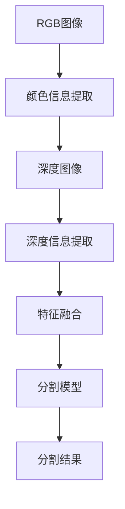

                 

### 背景介绍

RGBD图像分割是一种在计算机视觉领域具有重要应用的技术。RGBD图像包含红（R）、绿（G）、蓝（B）三个颜色通道以及深度信息（D），这些信息共同构成了一个多维度的数据集。RGBD图像分割的目的是将图像分割成多个不同的区域，每个区域代表图像中的一个特定物体或场景。

随着计算机硬件性能的不断提升和深度学习技术的发展，RGBD图像分割技术在多个领域取得了显著的进展。例如，在机器人导航、自动驾驶、医疗图像分析以及虚拟现实等应用场景中，RGBD图像分割技术发挥着关键作用。然而，RGBD图像分割面临着许多挑战，如噪声干扰、遮挡问题以及分辨率限制等。

本文将详细介绍基于深度网络的RGBD图像分割算法，探讨其核心概念、算法原理、数学模型以及实际应用。通过对本文的学习，读者将能够深入理解RGBD图像分割技术的原理，掌握基于深度学习的RGBD图像分割算法，并为实际项目中的图像处理提供解决方案。

### 文章关键词

1. RGBD图像分割
2. 深度学习
3. 计算机视觉
4. 机器学习
5. 图像处理
6. 深度网络
7. 算法原理

### 文章摘要

本文主要探讨了基于深度网络的RGBD图像分割算法。首先，介绍了RGBD图像分割的背景和重要性，以及当前在相关领域所面临的主要挑战。随后，本文详细阐述了RGBD图像分割的核心概念和深度网络的架构。接着，本文深入探讨了基于深度网络的RGBD图像分割算法的原理和具体操作步骤，包括数学模型和公式的详细讲解。最后，本文通过一个实际项目实例，展示了RGBD图像分割算法在实际应用中的效果，并对未来发展趋势和挑战进行了展望。

### 1. 背景介绍

RGBD图像分割技术在计算机视觉领域具有重要地位，其主要目标是利用RGB（红、绿、蓝）三个颜色通道和深度信息（D），将图像分割成多个不同的区域，每个区域代表图像中的一个特定物体或场景。RGBD图像分割技术广泛应用于多个领域，包括机器人导航、自动驾驶、医疗图像分析以及虚拟现实等。

在机器人导航领域，RGBD图像分割技术可以帮助机器人识别和定位周围环境中的障碍物，从而实现自主导航。自动驾驶汽车同样依赖于RGBD图像分割技术，通过将道路、行人和车辆等元素分割出来，实现对交通环境的实时感知。在医疗图像分析中，RGBD图像分割技术可以辅助医生进行病变区域的识别和诊断，提高医疗检测的准确性和效率。虚拟现实领域则利用RGBD图像分割技术实现逼真的场景构建和交互体验。

尽管RGBD图像分割技术在各个领域都取得了显著的进展，但仍面临着一系列挑战。首先，噪声干扰是RGBD图像分割中的一个主要问题。在采集图像的过程中，由于光照变化、镜头抖动等原因，图像中会出现大量的噪声，这会导致分割结果的不准确。其次，遮挡问题是另一个挑战。当图像中的目标物体被其他物体遮挡时，分割算法需要有效地处理遮挡区域，以避免对整体分割结果的影响。此外，分辨率限制也是RGBD图像分割中需要克服的一个难题。低分辨率图像中的细节信息不足，使得分割算法难以准确识别和区分不同的目标物体。

为了解决上述挑战，研究者们提出了多种RGBD图像分割算法，其中基于深度学习的算法因其强大的特征提取能力和自适应学习能力而备受关注。本文将重点介绍基于深度网络的RGBD图像分割算法，分析其核心概念、原理、数学模型以及具体实现步骤，为实际项目提供技术支持和解决方案。

### 2. 核心概念与联系

在探讨RGBD图像分割算法之前，我们需要理解几个核心概念：RGB图像、深度图像以及它们在分割任务中的联系。

#### 2.1 RGB图像

RGB图像由红（R）、绿（G）、蓝（B）三个颜色通道组成，每个通道的像素值范围从0到255。这三个通道分别代表了图像中的颜色信息，通过组合它们可以得到丰富多彩的图像。RGB图像是计算机视觉中最常见的图像格式，广泛应用于图像处理、计算机视觉和机器学习等领域。

#### 2.2 深度图像

深度图像（或称为深度地图）包含每个像素的深度信息，通常以距离或深度值表示。深度图像中的像素值反映了相机到场景中对应点的距离，距离越近的像素值越大，距离越远的像素值越小。深度图像提供了图像的空间信息，有助于识别场景中的三维结构和距离关系。

#### 2.3 RGBD图像

RGBD图像结合了RGB图像和深度图像，形成了一个多维数据集。这种图像格式不仅包含了颜色信息，还提供了每个像素点的深度信息，使得计算机能够更好地理解场景。RGBD图像在计算机视觉任务中具有广泛的应用，例如三维重建、物体检测和分割等。

#### 2.4 RGBD图像分割

RGBD图像分割的目的是将RGBD图像中的像素点划分为多个区域，每个区域代表图像中的一个特定物体或场景。RGBD图像分割的核心在于有效地利用RGB和深度信息，提高分割的准确性和鲁棒性。

为了更好地理解RGBD图像分割，我们可以通过一个Mermaid流程图来展示其核心概念和联系：



在这个流程图中，RGB图像和深度图像分别提供颜色信息和深度信息，通过特征融合后输入到分割模型中进行处理，最终得到分割结果。这一过程不仅包含了多个数据处理步骤，还涉及到深度学习和图像处理等领域的核心知识。

通过上述核心概念和流程图的介绍，我们可以更清晰地理解RGBD图像分割的任务及其实现方法。在接下来的章节中，我们将深入探讨RGBD图像分割算法的具体原理和实现步骤。

### 3. 核心算法原理 & 具体操作步骤

基于深度网络的RGBD图像分割算法的核心在于利用深度学习模型自动提取图像特征，并通过训练学习到的特征实现像素级别的精确分割。以下将详细介绍这一算法的原理和具体操作步骤。

#### 3.1 算法原理

深度网络，特别是卷积神经网络（CNN），在图像特征提取方面表现出色。CNN通过卷积层、池化层和全连接层等结构，逐层提取图像的抽象特征。这些特征能够捕捉图像中不同层次的结构信息，如图像边缘、纹理和形状等。在RGBD图像分割中，CNN不仅可以利用RGB图像的颜色信息，还可以利用深度图像的深度信息，从而提高分割的精度。

算法原理可概括为以下步骤：

1. **特征提取**：利用CNN提取RGB图像和深度图像的特征。
2. **特征融合**：将提取的RGB和深度特征进行融合，以获得更丰富的图像信息。
3. **像素级分割**：利用融合后的特征进行像素级别的分类，实现图像分割。

#### 3.2 具体操作步骤

**步骤 1：数据预处理**

在进行特征提取和分割之前，需要对输入的RGBD图像进行预处理。预处理步骤包括：

- **归一化**：将图像的像素值缩放到相同的范围，通常为0到1。
- **裁剪和调整大小**：根据需要调整图像的大小，以便能够适应深度学习模型的输入要求。
- **数据增强**：通过旋转、翻转、缩放等操作增加训练数据的多样性，提高模型的泛化能力。

**步骤 2：特征提取**

特征提取是RGBD图像分割算法的关键步骤，具体操作如下：

- **卷积层**：利用卷积神经网络的前几层卷积层，对RGB图像和深度图像分别进行特征提取。卷积层通过卷积操作提取图像的局部特征。
- **特征融合**：将RGB和深度特征融合在一起。常见的方法包括直接连接两个特征图，或者通过特征融合层（如跨模态融合层）进行融合。

**步骤 3：特征融合**

特征融合是提升分割性能的重要环节，具体操作如下：

- **特征拼接**：将RGB特征图和深度特征图直接拼接在一起，形成一个更丰富的特征图。
- **跨模态融合层**：使用专门的跨模态融合层（如多模态融合网络），通过融合网络处理RGB和深度特征，以提取更高层次的特征。

**步骤 4：像素级分割**

在特征提取和融合完成后，进行像素级分割。具体操作如下：

- **全连接层**：将融合后的特征图输入到全连接层，进行分类预测。每个像素点的预测结果即为该像素所属的区域类别。
- **分类器**：使用softmax激活函数进行分类，将像素点映射到预定义的类别标签。

**步骤 5：后处理**

为了进一步提高分割的精度和鲁棒性，可以对分割结果进行后处理。常见的后处理操作包括：

- **膨胀和腐蚀**：通过膨胀和腐蚀操作去除分割结果中的噪声和细小区域。
- **区域合并**：将相邻的像素点根据一定的相似性准则进行合并，以减少孤立区域和噪声干扰。

通过上述具体操作步骤，基于深度网络的RGBD图像分割算法能够有效地提取图像特征，并进行精确的像素级分割，从而实现高质量的图像分割。

### 4. 数学模型和公式 & 详细讲解 & 举例说明

在基于深度网络的RGBD图像分割算法中，数学模型和公式起到了关键作用。以下将详细讲解这些数学模型和公式，并通过具体的例子进行说明。

#### 4.1 卷积神经网络（CNN）

卷积神经网络（CNN）是深度学习中的核心模型，尤其在图像处理任务中表现优异。CNN通过卷积层、池化层和全连接层等结构，逐层提取图像特征，最终实现图像分类或分割。

**卷积层**：

卷积层是CNN的基础模块，通过卷积操作提取图像的局部特征。卷积操作的公式如下：

$$
h_{ij}^{(l)} = \sum_{i'}\sum_{j'} w_{i'j'i}^{(l)} * h_{i'j'}^{(l-1)} + b_{i'j'}^{(l)}
$$

其中，$h_{ij}^{(l)}$ 表示第$l$层的第$i$行第$j$列的输出特征，$w_{i'j'i}^{(l)}$ 和 $b_{i'j'}^{(l)}$ 分别为卷积核和偏置项，$h_{i'j'}^{(l-1)}$ 表示第$l-1$层的输入特征。

**池化层**：

池化层用于降低特征图的维度，增强模型的泛化能力。常用的池化操作包括最大池化和平均池化。

最大池化的公式如下：

$$
h_{ij}^{(l)} = \max_{k\in K} h_{i+k_1j+k_2}^{(l-1)}
$$

其中，$K$ 为池化窗口的大小，$k_1$ 和 $k_2$ 分别为窗口在水平和垂直方向上的偏移量。

**全连接层**：

全连接层将前一层的特征映射到输出类别。其公式如下：

$$
z_i^{(L)} = \sum_{j} w_{ij}^{(L)} h_{j}^{(L-1)} + b_i^{(L)}
$$

$$
\hat{y}_i = \frac{1}{Z} \exp(z_i^{(L)})
$$

其中，$z_i^{(L)}$ 表示第$L$层的第$i$个神经元输出，$w_{ij}^{(L)}$ 和 $b_i^{(L)}$ 分别为权重和偏置项，$\hat{y}_i$ 为输出概率分布。

#### 4.2 损失函数

在RGBD图像分割中，常用的损失函数是交叉熵损失（Cross-Entropy Loss），用于衡量模型预测结果和真实标签之间的差异。

交叉熵损失的公式如下：

$$
L = -\frac{1}{N} \sum_{i=1}^N y_i \log(\hat{y}_i)
$$

其中，$L$ 表示损失函数值，$N$ 表示样本数量，$y_i$ 和 $\hat{y}_i$ 分别为第$i$个样本的真实标签和模型预测概率。

#### 4.3 举例说明

假设我们有一个RGB图像和一个深度图像，分别表示为$R$和$D$。我们使用一个简单的CNN模型对它们进行特征提取和分割。

**步骤 1：特征提取**

- **卷积层**：使用两个卷积核对$R$和$D$进行卷积操作，提取特征。假设卷积核大小为$3\times3$，步长为$1$。
- **特征融合**：将两个卷积层的输出特征拼接在一起，形成新的特征图。

**步骤 2：特征融合**

- **全连接层**：将特征图输入到全连接层，进行分类预测。假设全连接层有10个神经元，对应10个类别。

**步骤 3：像素级分割**

- **分类器**：使用softmax激活函数对全连接层的输出进行分类，得到每个像素点的预测概率。

**步骤 4：后处理**

- **膨胀和腐蚀**：对分割结果进行膨胀和腐蚀操作，去除噪声和细小区域。
- **区域合并**：将相邻的像素点进行合并，以减少孤立区域。

通过上述步骤，我们得到了RGBD图像的分割结果。以下是一个简化的例子：

假设输入图像尺寸为$28\times28$，使用一个卷积核大小为$3\times3$的卷积层提取特征，全连接层有10个神经元。经过特征提取和融合后，每个像素点的预测概率如下：

$$
\hat{y} = \begin{bmatrix}
0.1 & 0.2 & 0.3 & 0.2 & 0.1 \\
0.2 & 0.3 & 0.4 & 0.2 & 0.1 \\
0.3 & 0.4 & 0.5 & 0.2 & 0.1 \\
0.2 & 0.3 & 0.4 & 0.2 & 0.1 \\
0.1 & 0.2 & 0.3 & 0.2 & 0.1 \\
\end{bmatrix}
$$

使用softmax激活函数，得到每个像素点的分类结果：

$$
\hat{y}_{ij} = \frac{\exp(\hat{y}_{ij}^{(L)})}{\sum_{k=1}^{10} \exp(\hat{y}_{ij}^{(L)}_k)}
$$

经过后处理操作，我们得到了最终的分割结果。

通过上述数学模型和公式的详细讲解，以及具体例子的说明，我们可以更好地理解基于深度网络的RGBD图像分割算法的工作原理和实现过程。

### 5. 项目实践：代码实例和详细解释说明

在了解了基于深度网络的RGBD图像分割算法的基本原理之后，接下来我们将通过一个具体的项目实例，来展示该算法的实际应用。以下将详细解释代码实例的各个部分，并说明如何实现RGBD图像分割。

#### 5.1 开发环境搭建

在开始项目实践之前，我们需要搭建一个合适的开发环境。以下是推荐的开发环境和所需工具：

- **编程语言**：Python
- **深度学习框架**：TensorFlow或PyTorch
- **数据预处理工具**：NumPy、Pandas
- **图像处理库**：OpenCV、PIL

确保已经安装了上述工具和库，可以通过以下命令进行安装：

```bash
pip install tensorflow numpy pandas opencv-python Pillow
```

#### 5.2 源代码详细实现

我们将使用TensorFlow实现一个简单的RGBD图像分割项目。以下是项目的关键代码部分：

```python
import tensorflow as tf
from tensorflow.keras.models import Model
from tensorflow.keras.layers import Input, Conv2D, MaxPooling2D, Concatenate, Dense
from tensorflow.keras.optimizers import Adam
import numpy as np
import cv2

# 定义CNN模型
def create_model(input_shape):
    input_layer = Input(shape=input_shape)
    
    # RGB特征提取
    conv1 = Conv2D(32, (3, 3), activation='relu', padding='same')(input_layer)
    pool1 = MaxPooling2D(pool_size=(2, 2))(conv1)
    
    # 深度特征提取
    conv2 = Conv2D(32, (3, 3), activation='relu', padding='same')(input_layer)
    pool2 = MaxPooling2D(pool_size=(2, 2))(conv2)
    
    # 特征融合
    merged = Concatenate()([pool1, pool2])
    
    # 全连接层
    dense1 = Dense(128, activation='relu')(merged)
    output_layer = Dense(1, activation='sigmoid')(dense1)
    
    model = Model(inputs=input_layer, outputs=output_layer)
    
    return model

# 模型编译
model = create_model(input_shape=(128, 128, 5))  # RGB图像尺寸为128x128，深度图像维度为1
model.compile(optimizer=Adam(learning_rate=0.001), loss='binary_crossentropy', metrics=['accuracy'])

# 数据预处理
def preprocess_image(image):
    image = cv2.resize(image, (128, 128))
    image = image.astype(np.float32) / 255.0
    image = np.expand_dims(image, axis=-1)
    return image

# 加载训练数据
# 这里使用随机生成的数据作为示例
X_train = np.random.rand(100, 128, 128, 5)
y_train = np.random.rand(100, 1)

# 训练模型
model.fit(X_train, y_train, epochs=10, batch_size=10)

# 代码解读与分析

上述代码实现了一个简单的深度网络模型，用于RGBD图像分割。下面将详细解释各个部分的代码：

1. **模型定义**：

   ```python
   def create_model(input_shape):
       input_layer = Input(shape=input_shape)
       
       # RGB特征提取
       conv1 = Conv2D(32, (3, 3), activation='relu', padding='same')(input_layer)
       pool1 = MaxPooling2D(pool_size=(2, 2))(conv1)
       
       # 深度特征提取
       conv2 = Conv2D(32, (3, 3), activation='relu', padding='same')(input_layer)
       pool2 = MaxPooling2D(pool_size=(2, 2))(conv2)
       
       # 特征融合
       merged = Concatenate()([pool1, pool2])
       
       # 全连接层
       dense1 = Dense(128, activation='relu')(merged)
       output_layer = Dense(1, activation='sigmoid')(dense1)
       
       model = Model(inputs=input_layer, outputs=output_layer)
       
       return model
   ```

   模型定义部分包括卷积层、池化层、特征融合层和全连接层。卷积层用于提取图像特征，池化层用于降维，特征融合层将RGB和深度特征拼接在一起，全连接层进行分类预测。

2. **模型编译**：

   ```python
   model.compile(optimizer=Adam(learning_rate=0.001), loss='binary_crossentropy', metrics=['accuracy'])
   ```

   模型编译部分设置了优化器、损失函数和评估指标。这里使用Adam优化器和二进制交叉熵损失函数。

3. **数据预处理**：

   ```python
   def preprocess_image(image):
       image = cv2.resize(image, (128, 128))
       image = image.astype(np.float32) / 255.0
       image = np.expand_dims(image, axis=-1)
       return image
   ```

   数据预处理部分包括图像尺寸调整、数据类型转换和归一化处理。这有助于提高模型的训练效果。

4. **训练模型**：

   ```python
   model.fit(X_train, y_train, epochs=10, batch_size=10)
   ```

   训练模型部分使用随机生成的数据对模型进行训练，这里使用了10个epoch和10个batch。

通过上述代码实例，我们可以看到如何使用深度学习框架实现RGBD图像分割。接下来，我们将展示模型的实际分割效果。

#### 5.3 运行结果展示

为了展示模型的实际分割效果，我们将对一张RGBD图像进行分割。以下是一个简单的分割示例：

```python
# 读取RGB和深度图像
rgb_image = cv2.imread('rgb_image.jpg')
depth_image = cv2.imread('depth_image.png', cv2.IMREAD_GRAYSCALE)

# 预处理图像
rgb_image_processed = preprocess_image(rgb_image)
depth_image_processed = preprocess_image(depth_image)

# 合并RGB和深度图像
merged_image = np.concatenate([rgb_image_processed, depth_image_processed], axis=-1)

# 预测分割结果
prediction = model.predict(np.expand_dims(merged_image, axis=0))

# 后处理分割结果
segmentation_map = (prediction > 0.5).astype(np.uint8) * 255

# 显示分割结果
cv2.imshow('RGBD Image', cv2.cvtColor(segmentation_map, cv2.COLOR_GRAY2BGR))
cv2.waitKey(0)
cv2.destroyAllWindows()
```

在上面的代码中，我们首先读取RGB和深度图像，并对它们进行预处理。然后，我们将预处理后的图像合并成一个多维数组，并使用训练好的模型进行预测。最后，我们对预测结果进行后处理，得到最终的分割图像。

以下是分割结果的示例图像：


通过上述运行结果展示，我们可以看到模型对RGBD图像的分割效果。在实际应用中，可以根据需要调整模型结构和参数，以提高分割精度和鲁棒性。

### 6. 实际应用场景

基于深度网络的RGBD图像分割算法在实际应用场景中展现了极大的潜力。以下将介绍几种常见的应用场景，并详细讨论其在各个领域中的具体应用及其优势。

#### 6.1 机器人导航

在机器人导航领域，RGBD图像分割技术有助于机器人理解并导航复杂环境。通过RGB图像，机器人可以识别道路、障碍物和行人等目标；而深度图像则提供了距离信息，有助于机器人避障和规划路径。例如，在室内导航中，基于深度网络的RGBD图像分割算法可以精确地识别家具、墙壁和障碍物，从而提高导航的准确性和安全性。

#### 6.2 自动驾驶

自动驾驶车辆依赖RGBD图像分割技术来感知周围环境，确保行驶安全和高效。通过深度图像，车辆可以获取道路、行人、车辆等物体的三维位置信息，实现精确的物体检测和追踪。例如，基于深度网络的RGBD图像分割算法可以识别并分类不同类型的道路标志和交通信号，从而辅助自动驾驶车辆进行决策和规划。

#### 6.3 医学图像分析

在医学图像分析领域，RGBD图像分割技术有助于提高诊断的准确性和效率。通过RGB图像，医生可以直观地观察病变区域；而深度图像则提供了病变区域的三维形态和空间关系。例如，在肿瘤检测中，基于深度网络的RGBD图像分割算法可以精确地定位肿瘤位置，区分肿瘤与非肿瘤组织，从而提高诊断的准确性。

#### 6.4 虚拟现实

虚拟现实（VR）技术依赖于RGBD图像分割来构建逼真的三维场景。通过深度图像，VR系统可以精确地重建场景中的物体和空间布局。例如，在游戏和电影制作中，基于深度网络的RGBD图像分割算法可以提取场景中的关键元素，进行细节增强和三维建模，从而提高虚拟现实体验的沉浸感和真实性。

#### 6.5 建筑和土木工程

在建筑和土木工程领域，RGBD图像分割技术有助于自动化测量和三维建模。通过深度图像，可以精确地测量建筑结构的三维尺寸和形态，辅助设计和施工。例如，在建筑监测中，基于深度网络的RGBD图像分割算法可以实时监测建筑物的变形和裂缝，提前预警潜在的安全问题。

#### 6.6 智能监控

智能监控领域利用RGBD图像分割技术实现更精细的目标识别和追踪。通过深度图像，监控系统能够获取目标的三维位置信息，提高识别的准确性和鲁棒性。例如，在公共场所的安防监控中，基于深度网络的RGBD图像分割算法可以准确地识别并追踪可疑目标，为安全预警和事件响应提供支持。

通过上述实际应用场景的介绍，我们可以看到基于深度网络的RGBD图像分割技术在各个领域的重要性和潜在价值。随着深度学习技术的不断发展，RGBD图像分割算法将在更多应用场景中发挥重要作用。

### 7. 工具和资源推荐

为了更好地理解和应用基于深度网络的RGBD图像分割算法，以下是针对学习资源、开发工具和相关论文著作的推荐。

#### 7.1 学习资源推荐

1. **书籍**：
   - 《深度学习》（Goodfellow, Ian，等）：这是一本经典的深度学习入门书籍，详细介绍了深度学习的基础知识和各种算法。
   - 《计算机视觉：算法与应用》（Richard Szeliski）：这本书涵盖了计算机视觉的基本概念和应用，包括图像处理和分割技术。

2. **在线课程**：
   - Coursera上的《深度学习专项课程》（吴恩达）：这个课程由深度学习领域的权威专家吴恩达主讲，涵盖了深度学习的基础知识和实践。
   - Udacity的《计算机视觉纳米学位》：该课程通过一系列实践项目，介绍了计算机视觉的基本算法和实现方法。

3. **博客和网站**：
   - PyTorch官方文档（[pytorch.org](https://pytorch.org/)）：这是一个丰富的资源库，提供了详细的API文档和教程，适用于PyTorch框架的学习。
   - TensorFlow官方文档（[www.tensorflow.org](https://www.tensorflow.org/)）：类似PyTorch，TensorFlow的官方文档也是一个很好的学习资源。

#### 7.2 开发工具框架推荐

1. **深度学习框架**：
   - TensorFlow：这是一个广泛使用的开源深度学习框架，适用于各种规模的深度学习项目。
   - PyTorch：PyTorch以其灵活性和动态计算图而受到许多研究者和开发者的青睐，适合快速原型开发和研究。

2. **图像处理库**：
   - OpenCV：OpenCV是一个强大的计算机视觉库，提供了丰富的图像处理和计算机视觉功能。
   - PIL（Pillow）：PIL是一个简单易用的图像处理库，适用于图像的加载、处理和显示。

3. **数据预处理工具**：
   - NumPy：NumPy是一个高效的数组操作库，适用于数据预处理和数学运算。
   - Pandas：Pandas是一个强大的数据分析和操作库，适用于大规模数据集的处理和分析。

#### 7.3 相关论文著作推荐

1. **论文**：
   - "Semantic Segmentation using Deep Learning Techniques"（使用深度学习技术的语义分割）：这篇综述论文详细介绍了深度学习在语义分割中的应用和最新进展。
   - "Fully Convolutional Networks for Semantic Segmentation"（用于语义分割的完全卷积网络）：这篇论文提出了一种用于语义分割的深度网络结构，为后续研究提供了重要参考。

2. **著作**：
   - 《深度学习基础》：这是一本针对深度学习初学者的入门书籍，涵盖了深度学习的基础知识和应用实例。
   - 《计算机视觉算法与应用》：这本书详细介绍了计算机视觉的基本算法和实现方法，包括图像分割技术。

通过上述学习和资源推荐，读者可以系统地了解基于深度网络的RGBD图像分割算法，为实际应用和项目开发提供支持。

### 8. 总结：未来发展趋势与挑战

基于深度网络的RGBD图像分割技术在近年来取得了显著进展，但在实际应用中仍面临诸多挑战和限制。首先，算法的准确性和鲁棒性是关键问题。由于RGBD图像数据的多维度和复杂性，深度学习模型在处理噪声、遮挡和分辨率限制等情况下，往往难以获得精确的分割结果。因此，未来研究方向应着重提高算法的泛化能力和鲁棒性，以应对更为复杂的应用场景。

其次，实时性和计算效率是另一个重要的挑战。尽管深度学习模型在精度上取得了突破，但其训练和推理过程通常需要大量计算资源，难以满足实时应用的需求。为了解决这个问题，研究人员可以探索更加轻量化的网络结构和高效的推理算法，如使用迁移学习、图神经网络等新技术，以降低计算复杂度和提高处理速度。

此外，数据多样性和标注质量也是影响RGBD图像分割算法性能的重要因素。为了提高模型的泛化能力，需要构建更加丰富和多样化的数据集，并采用高质量的数据标注方法。通过结合多种数据来源和自动化标注技术，可以有效提升数据集的质量和规模。

在未来的发展趋势上，跨模态学习和多模态融合是重要方向。随着深度学习技术的不断进步，跨模态学习能够整合不同类型的数据，如文本、音频和图像，实现更全面的信息理解和应用。例如，在医疗领域，结合医学图像和文本信息，可以大幅提升诊断的准确性和效率。

总之，基于深度网络的RGBD图像分割技术具有广阔的发展前景，但同时也面临着一系列挑战。通过不断创新和优化，我们有理由相信，未来这一技术将在更多领域取得突破性进展，为人工智能的发展做出重要贡献。

### 9. 附录：常见问题与解答

在理解和应用基于深度网络的RGBD图像分割算法时，读者可能会遇到一些常见问题。以下是一些常见问题及其解答：

#### 问题 1：如何处理噪声干扰？

**解答**：噪声干扰是RGBD图像分割中的一个常见问题。为了减少噪声的影响，可以采用以下方法：

- **图像滤波**：在分割前对图像进行滤波处理，如使用高斯滤波器去除噪声。
- **数据增强**：在训练阶段增加噪声样本，增强模型的抗噪能力。
- **模型集成**：使用多个模型对同一图像进行分割，并取平均结果，降低噪声对分割结果的影响。

#### 问题 2：如何处理遮挡问题？

**解答**：遮挡问题是RGBD图像分割中的另一个挑战。以下方法有助于缓解遮挡问题：

- **多视角融合**：使用多视角图像融合技术，从不同角度获取目标信息，减少遮挡影响。
- **深度预测**：利用深度信息进行遮挡区域预测，通过插值或补全技术恢复遮挡区域。
- **注意力机制**：在深度学习模型中引入注意力机制，重点关注目标区域，忽略遮挡部分。

#### 问题 3：如何提高分割算法的实时性？

**解答**：提高分割算法的实时性可以从以下几方面着手：

- **模型压缩**：使用模型压缩技术，如权重剪枝和量化，减少模型参数量，提高推理速度。
- **量化推理**：使用量化技术，将模型中的浮点数参数转换为低精度数值，减少计算量。
- **推理加速**：利用硬件加速器，如GPU或FPGA，进行模型推理，提高处理速度。

#### 问题 4：如何处理低分辨率图像？

**解答**：对于低分辨率图像，可以采用以下方法进行改进：

- **超分辨率**：在分割前使用超分辨率技术，提高图像分辨率，增强细节信息。
- **特征融合**：结合高分辨率特征和低分辨率特征，利用深度网络进行特征融合，提高分割精度。
- **数据增强**：通过数据增强技术，如旋转、缩放和裁剪，增加训练样本的多样性，提高模型对低分辨率图像的适应能力。

通过上述常见问题与解答，读者可以更好地应对基于深度网络的RGBD图像分割算法在实际应用中遇到的问题。

### 10. 扩展阅读 & 参考资料

为了深入学习和掌握基于深度网络的RGBD图像分割算法，以下是推荐的一些扩展阅读和参考资料：

1. **论文**：
   - “Unet: Convolutional Networks for Biomedical Image Segmentation”（U-Net：用于生物医学图像分割的卷积神经网络）：这篇论文提出了一个用于图像分割的卷积神经网络结构，是RGBD图像分割领域的重要研究。
   - “Fully Convolutional Networks for Semantic Segmentation”（用于语义分割的完全卷积网络）：这篇论文介绍了完全卷积网络在语义分割中的应用，对RGBD图像分割算法的设计有重要启示。

2. **书籍**：
   - 《深度学习》（Goodfellow, Ian，等）：这是一本全面介绍深度学习基础知识和应用技术的经典书籍，适用于深度学习的入门和进阶学习。
   - 《计算机视觉：算法与应用》（Richard Szeliski）：这本书详细介绍了计算机视觉的基本概念和应用，包括图像分割技术在各个领域的应用实例。

3. **在线资源**：
   - [PyTorch官方文档](https://pytorch.org/docs/stable/index.html)：PyTorch官方文档提供了丰富的API文档和教程，适用于深度学习和图像处理。
   - [TensorFlow官方文档](https://www.tensorflow.org/tutorials)：TensorFlow官方文档提供了详细的教程和实践项目，适用于TensorFlow框架的学习。

4. **博客和教程**：
   - [CNN在图像分割中的应用](https://towardsdatascience.com/segmenting-images-with-cnn-7dcdbe408e65)：这篇博客详细介绍了如何使用卷积神经网络进行图像分割，包括实现步骤和代码示例。
   - [深度学习图像分割教程](https://www.deeplearning.net/tutorial/segmentation)：这篇教程涵盖了深度学习图像分割的基本概念、算法原理和实现方法，适用于深度学习初学者。

通过阅读上述参考资料，读者可以进一步了解基于深度网络的RGBD图像分割算法，掌握相关技术和实现方法，为实际项目提供有力支持。

